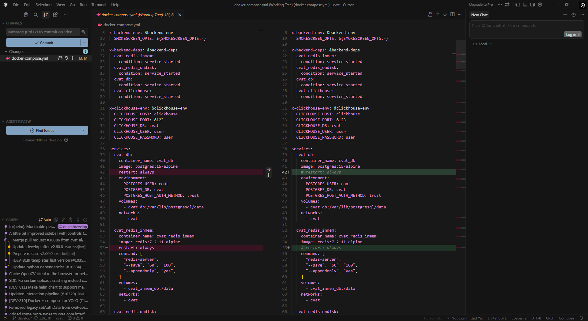
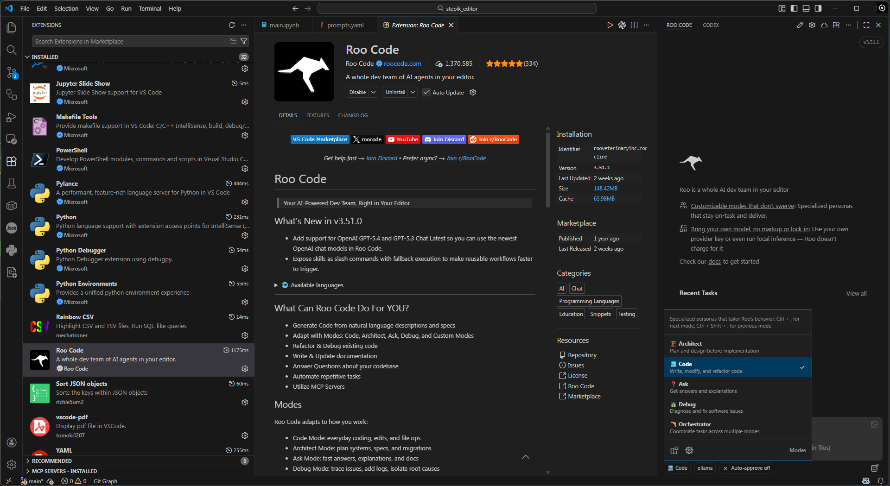
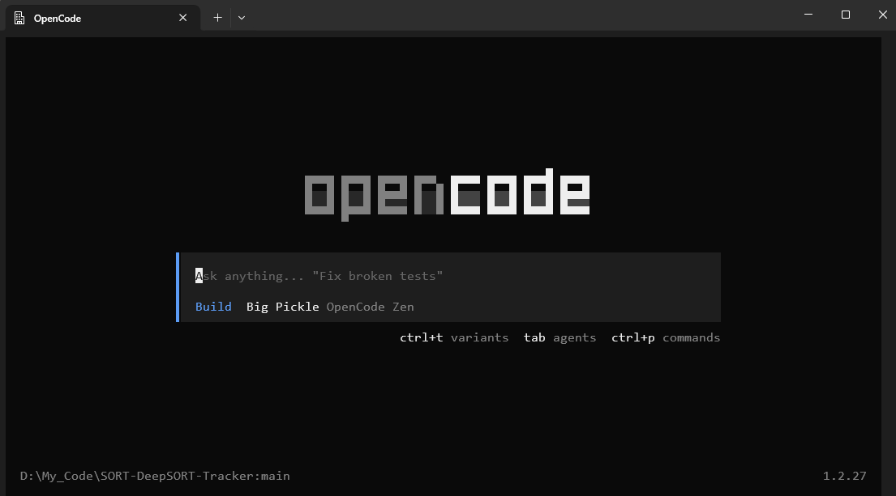
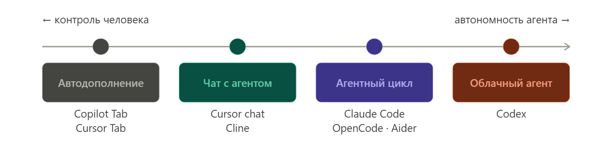

# Урок 1. Концепции: провайдеры, агенты, интерфейсы

_lesson_id: 2281867 · steps: 14 · ttc: 1117s_

---

## Шаг 1 (step_id=9781634, text)

Что такое вайбкодинг и зачем этот курс

В начале 2025 года Андрей Карпати — один из основателей OpenAI и бывший директор по AI в Tesla — опубликовал короткий пост в X. Он описывал свой рабочий процесс: диктует задачи в Cursor голосом, почти не касается клавиатуры, принимает все изменения не глядя, а когда что-то ломается — просто вставляет сообщение об ошибке обратно в чат без единого комментария. Пост назывался «вайбкодинг» — новый способ писать код, где ты «полностью отдаёшься вайбам и забываешь, что код вообще существует».

Пост набрал 4,5 миллиона просмотров. К концу 2025 года термин «vibe coding» быстро стал вирусным. По разным оценкам, к тому моменту значительная доля написанного в мире кода генерировалось с участием AI.

Что это на самом деле означает

Карпати сам потом сказал, что тот пост был «импульсивным твитом из-под душа» — не манифестом, не методологией. Он описывал подход для «одноразовых выходных проектов», где скорость важнее всего остального. Но термин попал в нерв, потому что назвал то, что многие уже делали или хотели делать.

Ровно через год — в феврале 2026-го — он вернулся с поправкой. Модели стали значительно умнее, и теперь профессиональный AI-assisted workflow выглядит иначе: не «принять всё не глядя», а управлять агентами с контролем и осмысленным надзором. В индустрии это всё чаще называют agentic engineering — вайбкодинг с инженерной дисциплиной.

Здесь важно различать два полюса. На одном — чистый вайбкодинг: описываешь задачу, принимаешь всё, запускаешь, смотришь работает ли, не читаешь код. Это быстро и иногда достаточно для прототипа или личного инструмента. На другом — ответственная AI-assisted разработка: агент пишет, ты направляешь, проверяешь результат и понимаешь, что происходит. Именно этот подход масштабируется на реальные проекты.

Разница не в инструментах — они одни и те же. Разница в том, как мы с ними работаем.

Что здесь действительно меняется

Узкое место в разработке сместилось. Раньше им была скорость написания кода — сколько строк в день может произвести разработчик. Теперь узкое место — качество постановки задачи и осмысленность надзора за результатом. Код стал дешёвым. Дорогим остаётся понимание того, что именно нужно построить, как это проверить и где агент пойдёт не туда.

Это не значит, что можно не знать, как устроен код. Это значит, что знание архитектуры, паттернов и граничных случаев теперь нужно не для того, чтобы писать каждую строку вручную, а для того, чтобы направлять агента и оценивать его работу. Разработчик становится ближе к роли техлида, чем к роли исполнителя.

Данные это подтверждают, но с оговорками. METR в 2025 году провёл рандомизированный контролируемый эксперимент с опытными open-source разработчиками — и обнаружил, что при наивном использовании AI-инструментов они работали на 19% медленнее, хотя сами ожидали ускорения на 24%. Инструменты дают преимущество тем, кто умеет ими пользоваться — не всем автоматически. Ещё один факт: по данным CodeRabbit, AI-код содержит в 2,7 раза больше уязвимостей безопасности, чем написанный человеком. Код нужно проверять — это не опция.

О чём этот курс

Курс — про инженерный подход к AI-assisted разработке. Не про то, как нажать «принять всё» и надеяться на лучшее, а про то, как осознанно выстраивать рабочий процесс с агентами.

Мы разберём, как устроен рынок инструментов: почему провайдер, модель и агент — это три разных слоя, и как это влияет на выбор стека. Посмотрим на разные классы инструментов — от IDE с встроенным AI до CLI-агентов, работающих с репозиторием целиком — и поймём, какие задачи каждый из них решает лучше. Отдельно разберём, как формулировать задачи для агентов так, чтобы получать предсказуемый и проверяемый результат.

Начнём с карты ландшафта — чтобы при появлении нового инструмента (а они появляются постоянно) было понятно, куда его положить.

---

## Шаг 2 (step_id=9782198, text)

Три слоя: провайдеры, модели и агенты

Когда разработчики говорят «я использую Cursor» и «я использую Claude», это звучит как описание одного и того же — инструмента для написания кода. Но это принципиально разные вещи. Чтобы осознанно выбирать инструменты и не теряться при появлении новых, нам нужно разобраться в том, как устроен этот рынок на уровне архитектуры.

Провайдер, модель, агент

Весь ландшафт AI-инструментов для разработки строится из трёх независимых слоёв.

Провайдер — это компания, которая обучает языковые модели и предоставляет к ним доступ через API: Anthropic, OpenAI, Google, Mistral, DeepSeek. Когда мы отправляем запрос, он уходит на серверы конкретного провайдера — именно там выполняется модель, именно там происходит вычисление.

Модель — это сама нейронная сеть: Claude Sonnet 4.6, GPT‑5.3‑Codex, Gemini 2.5 Pro, DeepSeek V3 и другие. Модель принимает текст на входе и возвращает текст на выходе. Она не знает, кто её вызывает — разработчик напрямую через curl или сложный агент внутри IDE.

Агент — это программа, которая обращается к модели, чтобы помочь нам писать код: Cursor, Claude Code, Cline, Windsurf, OpenCode. Агент решает, что отправить модели, как интерпретировать ответ и что сделать с результатом — вставить в файл, выполнить команду, показать диф.

Ключевое следствие из этой архитектуры: три слоя во многом независимы. Cursor поддерживает Anthropic, OpenAI и Google — мы выбираем провайдера под задачу прямо в интерфейсе. Cline подключается к сотням моделей через единый ключ OpenRouter. Когда выходит новая модель, нам чаще всего не нужно менять инструмент — достаточно обновить настройки.

BYOM: bring your own model

BYOM (Bring Your Own Model) и BYOK (Bring Your Own Key) — устойчивые термины, описывающие агентов, которые не привязывают нас к одному провайдеру. Мы сами приносим API-ключ и подключаем нужную модель.

Это важно по нескольким причинам. Мы можем переключиться на более дешёвую модель для рутинных задач и на более мощную — для сложного рефакторинга. Мы не зависим от ценовой политики конкретного провайдера. Мы можем сравнивать модели на одной и той же задаче прямо из интерфейса агента.

Для сравнения: Claude Code CLI — не BYOM-инструмент. Он не мультимодельный: нельзя переключить его на GPT-5 или Gemini, нельзя подставить ключ OpenRouter. При этом он не ограничен строго прямым Anthropic API — официально поддерживаются и инфраструктурные каналы вроде Google Vertex AI, Amazon Bedrock и Microsoft Azure Foundry. Но это всё равно Claude-модели, просто через разные точки доступа, а не свободный выбор провайдера. Cline и OpenCode устроены иначе: там нет привязки к конкретной модели или семейству моделей — весь смысл архитектуры в том, что мы сами приносим ключ любого провайдера: Anthropic, OpenAI, Google, DeepSeek или агрегатор вроде OpenRouter.

Практический пример: Cline в VS Code с ключом OpenRouter даёт доступ к Claude Sonnet, GPT-5, Gemini 2.5 Pro и DeepSeek из одного интерфейса. Когда один провайдер недоступен или стал дороже — переключаемся без смены инструмента.

В следующем шаге посмотрим, чем агенты отличаются по типу среды выполнения: как именно каждый класс инструментов встраивается в рабочий процесс и какие задачи это определяет.

---

## Шаг 3 (step_id=9782197, text)

Классы инструментов: среда выполнения и доступ к проекту

Понимая, что провайдер, модель и агент — это разные слои, перейдём к тому, как агенты различаются между собой. Главная ось здесь — не «умнее/глупее», а в какой среде выполняется агент и какой доступ к проекту это ему даёт.

IDE-форки

Cursor и Windsurf — это форки VS Code. Важно понимать разницу между форком и расширением: они модифицировали само ядро редактора, а не добавили плагин поверх. AI здесь — не гость, а часть архитектуры. Отсюда и возможности, недоступные расширениям: индексация всего проекта при открытии, встроенный интерфейс для просмотра дифов, единый переключатель между моделями разных провайдеров прямо в UI.

При этом между двумя форками есть существенное различие в совместимости с экосистемой VS Code. Cursor использует Open VSX и поддерживает большинство популярных расширений — при первом запуске можно импортировать настройки из VS Code, и интерфейс становится практически неотличим. Windsurf устроен строже: документация прямо предупреждает, что ряд расширений несовместим, а установка через сторонние маркетплейсы не поддерживается. Это стоит учитывать, если вы завязаны на конкретные плагины.

IDE-расширения

Cline, Roo Code, GitHub Copilot, JetBrains AI — это расширения, которые устанавливаются поверх существующего редактора. Редактор не меняется, AI добавляется как слой.

Cline и Roo Code — классические BYOM-инструменты: подключаем любой провайдер через API-ключ. Roo Code идёт чуть дальше и предлагает отдельные режимы работы — Architect, Code, Ask, Debug, Orchestrator — чтобы разделить фазу планирования и фазу исполнения (об этом подробнее в следующих уроках).

GitHub Copilot устроен иначе: авторизация через GitHub, фиксированная подписка, но в платных тарифах доступны разные модели — Claude Sonnet, GPT-5, Gemini. Это делает его гибридом: не BYOM, но и не намертво привязан к одной модели. Copilot поддерживает JetBrains, Vim и Neovim — как и Windsurf Plugin. Cursor с марта 2026 также доступен в JetBrains через Agent Client Protocol (ACP), а Codex имеет расширения и для JetBrains, и для VS Code. Иными словами, выбор инструментов для JetBrains-среды сегодня заметно шире, чем год назад.

Ключевое отличие расширений от CLI-агентов в модели этого доступа к файлам. VS Code Extension API позволяет читать и записывать файлы, открывать терминал и даже работать с файлами вне workspace. Однако конкретная реализация каждого расширения сама определяет, насколько широко этим пользоваться. На практике большинство агентов-расширений работают преимущественно в контексте открытого рабочего пространства, тогда как CLI-агент с самого старта получает прямой доступ к оболочке и файловой системе — без каких-либо ограничений модели разрешений редактора.

CLI-агенты

Claude Code, OpenCode, Aider запускаются в терминале. Никакого GUI — только текстовый интерфейс и прямой доступ к файловой системе. Это принципиально другая модель работы: агент не ограничен тем, что открыто на экране. Он может самостоятельно обойти весь репозиторий, прочитать нужные файлы, выполнить npm test или pytest и проанализировать вывод — всё в рамках одной сессии.

Именно этот прямой доступ к командной оболочке делает CLI-агентов особенно сильными на задачах, затрагивающих десятки файлов: крупный рефакторинг, миграция зависимостей, переименование по всей кодовой базе.

Облачные агенты

Codex от OpenAI — многорежимный инструмент: он существует и как облачный агент, и как расширение для VS Code, Cursor, Windsurf и JetBrains, и как CLI. В облачном режиме задача выполняется в изолированном контейнере на серверах OpenAI — агент клонирует репозиторий, устанавливает зависимости и работает без нашей машины. Результат оформляется как Pull Request. При этом процесс не полностью непрозрачен: можно следить за логами, просматривать промежуточный диф и итерировать по результату перед тем, как PR будет создан.

Это хорошо ложится в GitHub-воркфлоу: задача ставится через API или интерфейс, через некоторое время появляется PR для ревью. Не нужно настраивать локальное окружение — агент справляется сам.

Какую IDE использовать

Прямой ответ: лучшая IDE — та, в которой вы уже работаете. Смена редактора ради инструмента создаёт трение, которое нивелирует часть выигрыша.

Если вы работаете в VS Code — Cline или Copilot дают полноценного AI-агента без смены среды. Если хочется более тесной интеграции AI в интерфейс редактора — Cursor наиболее зрелый вариант с широкой экосистемой расширений. Windsurf интересен как агентный опыт «из коробки» и дешевле по подписке, но совместимость с расширениями ограничена — это важно проверить до переезда.

Если вы используете JetBrains (IntelliJ, PyCharm, GoLand) — выбор сегодня заметно шире, чем раньше. Встроенный JetBrains AI Assistant с агентом Junie — наиболее нативный путь, рекомендованный самой JetBrains. Copilot и Windsurf Plugin официально поддерживают JetBrains. Cursor с марта 2026 доступен через ACP, Codex тоже имеет плагин. Так что оставаться в JetBrains и полноценно использовать AI-агента сегодня вполне реально.

Мы разобрали, как разные классы агентов интегрированы в рабочую среду. В следующем шаге посмотрим на то, насколько автономно они действуют — это определяет, как именно мы будем с ними взаимодействовать.

---

## Шаг 4 (step_id=9782196, text)

Спектр автономности

Внутри одного класса инструментов агенты могут вести себя очень по-разному: одни предлагают следующую строку кода, другие самостоятельно проходят длинные многошаговые задачи с минимальным участием разработчика. Это различие в уровне автономности — пожалуй, самый практически важный параметр при выборе инструмента под конкретную задачу.

От подсказки до Pull Request

На одном конце спектра находится автодополнение — то, с чего начинался AI в IDE. Copilot Tab, Cursor Tab, инлайн-подсказки Windsurf: модель смотрит на несколько строк выше курсора и предлагает продолжение. Никакого планирования, никаких команд, никакого понимания архитектуры проекта. Быстро, ненавязчиво, хорошо работает для шаблонного кода.

Следующий уровень — интерактивный чат-агент. Cursor chat, Cline в стандартном режиме: мы формулируем задачу, агент предлагает изменения, мы одобряем каждый шаг. Цикл остаётся под нашим контролем — агент не делает ничего без явного разрешения.

Принципиально другая модель — агентный цикл (agentic loop). Claude Code и OpenCode работают именно так: мы описываем задачу один раз, агент самостоятельно планирует последовательность действий, читает нужные файлы, выбирает инструменты, вносит правки, запускает тесты и исправляет ошибки. Цикл повторяется до тех пор, пока задача не выполнена или агент не упирается в неопределённость, требующую уточнения. Мы включаемся не на каждом шаге, а по мере необходимости.

На другом конце спектра — асинхронный агент. В этом режиме, который наиболее характерен для Codex, мы описываем задачу, агент выполняет её в изолированном контейнере с минимальным участием с нашей стороны, и на выходе появляется Pull Request. При этом процесс не полностью непрозрачен: можно следить за логами, просматривать промежуточный диф и итерировать до создания PR. Акцент здесь — на делегировании, а не на полной изоляции.

Важная оговорка: это спектр, а не жёсткая классификация. Современные инструменты активно движутся к гибридным моделям — Cursor добавил фоновые агенты, Claude Code развивает мультиагентные команды, Codex поддерживает интерактивные итерации. Граница между «агентным циклом» и «асинхронным агентом» будет становиться всё более условной.

Автономность и пропускная способность

У каждого уровня спектра есть своя ставка — контроль против скорости. Автодополнение и интерактивный чат дают высокий контроль над каждым изменением, но ограничивают пропускную способность: мы лично участвуем в каждом шаге. Агентный цикл и асинхронный режим дают высокую пропускную способность — агент работает параллельно, пока мы занимаемся другим — но снижают прямой контроль над процессом.

Это не значит, что высокая автономность всегда лучше. Исследования показывают, что агенты хорошо справляются с хорошо задокументированными, конкретными задачами — и заметно хуже с размытыми требованиями или архитектурными решениями, которые нужно принимать по ходу. Выбор уровня автономности — это всегда осознанный компромисс под конкретную задачу, а не вопрос «чем больше, тем лучше».

Есть и практический риск, который стоит называть прямо: автономный агент с достаточными правами может удалять файлы, менять зависимости и ломать работающий код — особенно при неточной постановке задачи. Чем выше автономность, тем важнее точность формулировки и тем дороже обходится ошибка в задании. Агент, ушедший в неверном направлении на двадцать минут, хуже интерактивного режима, где недопонимание всплыло бы на первом же шаге. Именно этому — как формулировать задачи для агентов — посвящён отдельный урок курса.

Итоги урока

Мы рассмотрели архитектуру, на которой строится весь ландшафт AI-инструментов. Провайдер, модель и агент — три независимых слоя, и понимание их разделения позволяет осознанно выбирать инструменты, а не полагаться на маркетинговые описания. Агенты делятся по типу интерфейса — IDE-форки, расширения, CLI-агенты, облачные агенты — и каждый класс оптимизирован под разные сценарии работы. Поверх этого накладывается спектр автономности: от строчки автодополнения до PR, сгенерированного без нашего участия. Эти три оси — провайдер/инструмент, тип интерфейса, уровень автономности — и есть карта, по которой мы будем ориентироваться во всех следующих уроках.

---

## Шаг 5 (step_id=9782301, choice)

Что именно делает концепцию BYOM принципиально важной при выборе агента?

**Тип:** choice (single)

**Варианты:**
-  Модель обучается на данных конкретного разработчика
-  Агент работает быстрее при подключении нескольких провайдеров
-  Провайдер получает доступ к исходному коду проекта
- [✓ правильный] Агент не привязан к ценовой политике одного провайдера

**Статус Stepik:** `correct` (score 1.0)

**Мой reasoning:** _В теории прямо сказано, что BYOM важен потому, что мы не зависим от ценовой политики конкретного провайдера и можем переключаться между моделями под задачу._

---

## Шаг 6 (step_id=9782297, choice)

Чем форк IDE принципиально отличается от расширения с точки зрения доступа к проекту?

**Тип:** choice (single)

**Варианты:**
- [✓ правильный] Форк меняет ядро и индексирует весь проект
-  Форк не требует установки дополнительных зависимостей
-  Расширение работает только с одним провайдером моделей
-  Расширение поддерживает больше языков и режимов

**Статус Stepik:** `correct` (score 1.0)

**Мой reasoning:** _В теории прямо сказано: форки модифицировали само ядро редактора (а не добавили плагин поверх), что даёт возможности вроде индексации всего проекта при открытии — недоступные расширениям._

---

## Шаг 7 (step_id=9782300, choice)

Почему CLI-агент эффективнее IDE-расширения при рефакторинге, затрагивающем весь репозиторий?

**Тип:** choice (single)

**Варианты:**
- [✓ правильный] CLI-агент свободно работает с файлами и shell
-  CLI-агент использует более мощные языковые модели
-  CLI-агент сохраняет историю изменений в отдельный лог
-  IDE-расширения хуже тянут правки по всему проекту

**Статус Stepik:** `correct` (score 1.0)

**Мой reasoning:** _В теории прямо сказано: CLI-агент с самого старта получает прямой доступ к оболочке и файловой системе без ограничений модели разрешений редактора, что делает его особенно сильным на задачах, затрагивающих десятки файлов._

---

## Шаг 8 (step_id=9782296, choice)

Что является главным критерием выбора уровня автономности агента под задачу?

**Тип:** choice (single)

**Варианты:**
- [✓ правильный] Проверяемость результата и ясность требований
-  Количество файлов, которые нужно изменить
-  Опыт разработчика в конкретном агенте и проекте
-  Размер кодовой базы проекта

**Статус Stepik:** `correct` (score 1.0)

**Мой reasoning:** _В тексте прямо сказано: агенты хорошо справляются с хорошо задокументированными, конкретными задачами и хуже с размытыми требованиями; чем выше автономность, тем важнее точность формулировки. Выбор уровня автономности — осознанный компромисс под конкретную задачу, а не вопрос масштаба или опыта._

---

## Шаг 9 (step_id=9782294, choice)

Какой режим работы агента подразумевает, что разработчик одобряет каждый шаг перед его выполнением?

**Тип:** choice (single)

**Варианты:**
- [✓ правильный] Интерактивный чат-агент
-  Агентный цикл с автоматической верификацией
-  Инлайн-автодополнение с подтверждением
-  Асинхронный облачный агент

**Статус Stepik:** `correct` (score 1.0)

**Мой reasoning:** _В теории прямо сказано: 'Cursor chat, Cline в стандартном режиме: мы формулируем задачу, агент предлагает изменения, мы одобряем каждый шаг. Цикл остаётся под нашим контролем — агент не делает ничего без явного разрешения.'_

---

## Шаг 10 (step_id=9782298, choice)

Какие из перечисленных характеристик относятся к облачному агенту?

**Тип:** choice (multiple)

**Варианты:**
-  Требует запуска в терминале на машине разработчика
- [✓ правильный] Выполняет задачу в изолированном контейнере
- [✓ правильный] Не требует настройки локального окружения для выполнения задачи
- [✓ правильный] Возвращает результат в виде Pull Request

**Статус Stepik:** `correct` (score 1.0)

**Мой reasoning:** _По теории облачный агент (Codex) выполняется в изолированном контейнере на серверах провайдера, не требует локального окружения и оформляет результат как PR. Запуск в терминале — это про CLI-агентов, а не облачных._

---

## Шаг 11 (step_id=9782295, choice)

Почему неточная постановка задачи обходится дороже при высоком уровне автономности агента?

**Тип:** choice (single)

**Варианты:**
-  Они не показывают промежуточный ход работы
-  Автономные агенты нельзя прервать после старта
-  Высокоавтономные агенты тратят больше токенов
- [✓ правильный] Агент уходит не туда без быстрых уточнений

**Статус Stepik:** `correct` (score 1.0)

**Мой reasoning:** _В тексте прямо сказано: «Агент, ушедший в неверном направлении на двадцать минут, хуже интерактивного режима, где недопонимание всплыло бы на первом же шаге». Высокая автономность означает отсутствие промежуточных проверок, поэтому ошибка в задании множится._

---

## Шаг 12 (step_id=9782292, choice)

Что отличает «agentic engineering» от классического вайбкодинга в понимании Карпати?

**Тип:** choice (single)

**Варианты:**
- [✓ правильный] Осознанный контроль агента вместо слепого принятия
-  Использование нескольких языков и инструментов сразу
-  Обязательное написание тестов перед генерацией кода
-  Отказ от автодополнения в пользу только чат-интерфейса

**Статус Stepik:** `correct` (score 1.0)

**Мой reasoning:** _В теории прямо сказано: Карпати вернулся с поправкой — профессиональный workflow теперь это управление агентами с контролем и осмысленным надзором, а не «принять всё не глядя». Это и есть agentic engineering._

---

## Шаг 13 (step_id=9782293, matching)

Сопоставьте класс агента с его ключевой технической характеристикой.

**Тип:** matching

**Колонка А (вопросы):**
- IDE-форк
- IDE-расширение
- CLI-агент
- Облачный агент

**Колонка Б (варианты, перемешаны):**
- работает через API редактора, видит открытое рабочее пространство
- выполняется в изолированном контейнере на серверах провайдера
- индексирует весь проект на уровне ядра редактора
- прямой доступ к файловой системе и командной оболочке ОС

**Правильные пары:**
- IDE-форк → индексирует весь проект на уровне ядра редактора
- IDE-расширение → работает через API редактора, видит открытое рабочее пространство
- CLI-агент → прямой доступ к файловой системе и командной оболочке ОС
- Облачный агент → выполняется в изолированном контейнере на серверах провайдера

**Статус Stepik:** `correct` (score 1.0)

**Мой reasoning:** _Форки (Cursor/Windsurf) модифицируют ядро редактора и индексируют проект целиком; расширения работают через VS Code Extension API в рамках workspace; CLI-агенты имеют прямой доступ к shell и FS; облачные агенты (Codex) выполняются в изолированном контейнере на серверах провайдера._

---

## Шаг 14 (step_id=9782299, matching)

Сопоставьте уровень автономности с типичным сценарием использования.

**Тип:** matching

**Колонка А (вопросы):**
- Автодополнение
- Интерактивный чат
- Агентный цикл
- Асинхронный агент

**Колонка Б (варианты, перемешаны):**
- написание шаблонного кода без выхода из потока редактирования
- хорошо описанная задача с результатом в виде готового PR
- задача с неопределёнными требованиями, которые уточняются по ходу
- рефакторинг с затрагиванием десятков файлов по всему репозиторию

**Правильные пары:**
- Автодополнение → написание шаблонного кода без выхода из потока редактирования
- Интерактивный чат → задача с неопределёнными требованиями, которые уточняются по ходу
- Агентный цикл → рефакторинг с затрагиванием десятков файлов по всему репозиторию
- Асинхронный агент → хорошо описанная задача с результатом в виде готового PR

**Статус Stepik:** `correct` (score 1.0)

**Мой reasoning:** _Автодополнение — шаблонный код в потоке; интерактивный чат даёт пошаговый контроль для размытых задач; агентный цикл (Claude Code/OpenCode) силён в многофайловых рефакторингах; асинхронный агент (Codex) — делегирование чёткой задачи с PR на выходе._

---
