# Урок 3. Агент в IDE

_lesson_id: 2281869 · steps: 10 · ttc: 1072s_

---

## Шаг 1 (step_id=9781636, text)

Cursor: установка и режимы работы

Cursor — один из самых популярных AI-native редакторов в 2026 году: широкая пользовательская база, активное сообщество и зрелая экосистема. Он построен как форк VS Code, но с переработанным ядром под агентную разработку. Именно его мы будем использовать в примерах по курсу — поэтому начнём с установки и разберём все основные режимы работы.

Установка

Cursor скачивается с cursor.com — сайт определяет операционную систему автоматически. Установка стандартная, а после запуска, необходимо залогинится. Предварительно нужно создать аккаунт на сайте либо создав новый аккаунт используя почту, либо с помощью Google, GitHub или Apple аккаунтов. Регистрация тоже стандартная, не требует ввода данных карт и прочих сложностей, так что не будем на ней долго задерживаться. После неё вам сразу доступен Free Plan, предоставляющий возможность начать пользоваться агентами и моделями с определёнными лимитами.

Первоначальная настройка

В Cursor есть два слоя настроек, и это важно понять сразу. Стандартные настройки, как в VS Code — открываются через Ctrl+, (на Windows/Linux. Тут и далее имейте ввиду что Ctrl на MacOS меняем на Cmd) — это шрифты, темы, расширения, всё привычное.

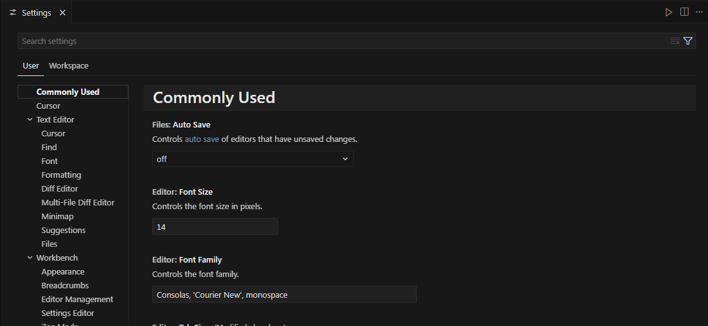

Cursor Settings — отдельный раздел для всего, что касается AI: модели, правила, MCP, приватность. Открывается через Ctrl+Shift+J или меню: File → Preferences → Cursor Settings.

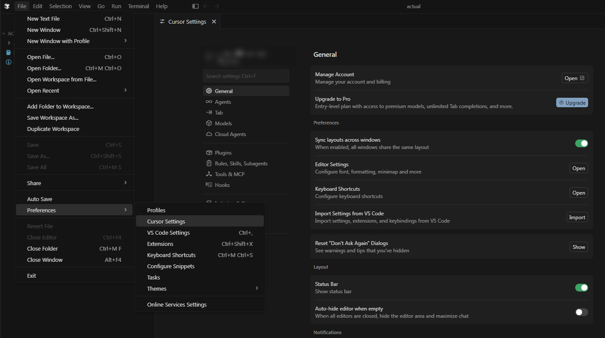

Если вы работали в VS Code, переход будет практически незаметным. Cursor использует Open VSX и поддерживает большинство популярных расширений VS Code. Для переноса настроек в Cursor Settings нажмите кнопку import в пункте Import Settings from VS Code

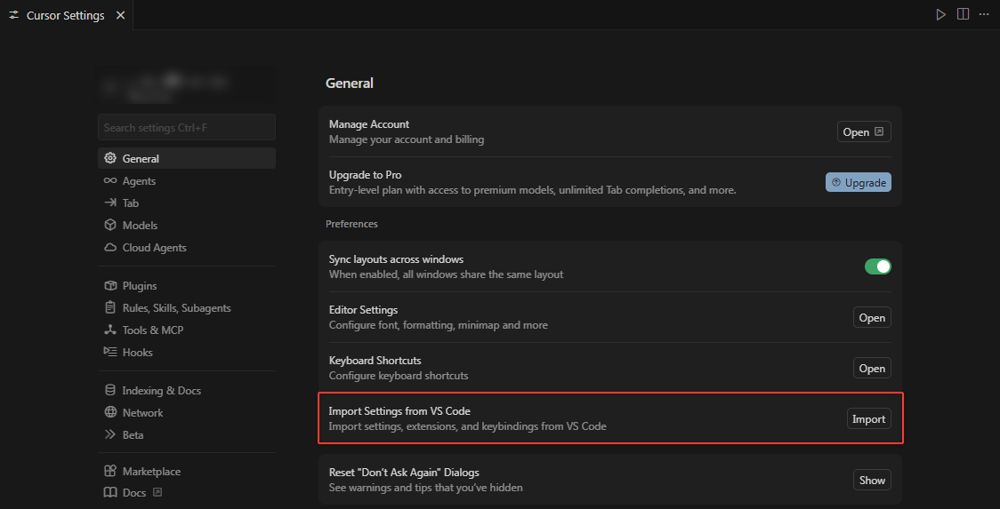

Это автоматически подхватит и перенесёт в курсор все ваши настройки из VS Code, включая и расширения.

Выбор моделей

По умолчанию у нас стоит режим Auto: Cursor сам выбирает подходящую модель из доступных премиум-моделей в зависимости от типа задачи и текущей нагрузки. Если нужен ручной контроль — в меню Models доступен список доступных моделей. В этом разделе можно включить конкретные модели, и они появятся в выпадающем списке внутри чата.

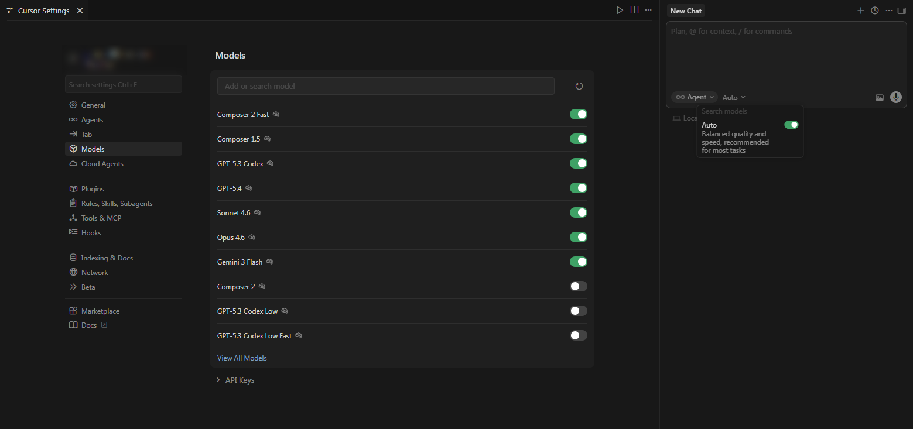

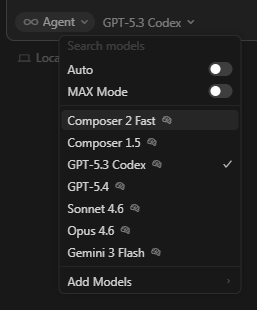

Здесь же добавляются собственные API-ключи провайдеров: Anthropic, OpenAI, Google, Azure, AWS Bedrock. Ключ вставляется в соответствующее поле, кнопка Verify проверяет его валидность.

Важное ограничение: BYOK-ключи работают только для стандартных моделей в чате и Cmd+K — Tab-автодополнение и ряд агентных функций всегда используют встроенные модели Cursor.

Режимы работы

Вся агентная работа в Cursor сосредоточена в одном интерфейсе — панели, которая открывается через  Ctrl+I. Внутри неё четыре режима, переключаемые через picker под полем ввода или сочетанием клавиш Shift+Tab:

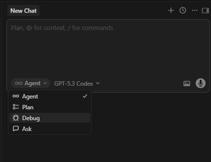

Agent — режим по умолчанию для сложных задач. Агент самостоятельно изучает кодовую базу, определяет нужные файлы, вносит изменения сразу в нескольких местах, запускает команды в терминале и итерирует по ошибкам. Перед каждым значимым действием Cursor запрашивает подтверждение, если не включён Run Everything режим (автоодобрение всех действий — настраивается в Cursor Settings → Agents).

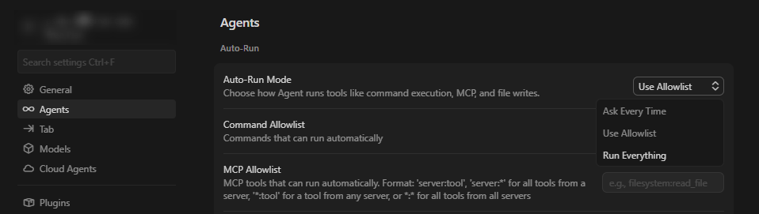

Plan — режим планирования перед реализацией. Агент задаёт уточняющие вопросы, строит интерактивный план с to-do списком, но не вносит изменения в код. Удобно для сложных задач, где нужно сначала согласовать подход. Из плана можно отправлять отдельные to-do прямо в новые агентные сессии.

Debug — специализированный режим для отладки. Cursor анализирует логи выполнения и стек ошибок, чтобы выявить причину проблемы и предложить исправления. Работает с разными стеками и языками.

Ask — режим только для чтения. Агент ищет по кодовой базе и отвечает на вопросы, но никаких изменений в файлы не вносит. Подходит для изучения незнакомого кода или планирования подхода без риска что-то поменять.

Помимо основной панели есть Inline Edit — быстрое редактирование прямо в файле. Выделяем фрагмент кода, нажимаем Ctrl+K, описываем изменение — Cursor вносит правку и показывает диф прямо в редакторе. Принять — Ctrl+Shift+Y, отклонить — Ctrl+N. Удобен для быстрых точечных правок без открытия боковой панели.

И отдельно — Tab-автодополнение, которое работает фоном постоянно. Cursor предсказывает не просто следующую строку, а целые блоки с учётом контекста проекта: добавляет импорты, учитывает сигнатуры функций из соседних файлов. Принять предложение — Tab.

Контекст: что видит агент

Agent mode индексирует кодовую базу при открытии проекта и использует этот индекс при поиске релевантных файлов. Дополнительно контекст можно передавать явно через @-символы прямо в поле ввода:

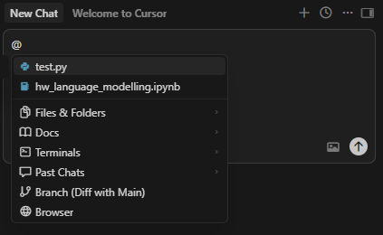

Прикрепить можно конкретный файл или папку, документацию (можно добавить свою через Cursor Settings → Indexing & Docs), вывод терминала, предыдущие чаты, git diff, поиск в интернете.

Rules: постоянный контекст для агента

Агент не помнит инструкции между сессиями — каждый новый разговор начинается с чистого листа. Чтобы соглашения по коду, архитектурные ограничения и стилевые предпочтения применялись автоматически, в Cursor есть система Rules.

Правила могут быть общими, пользовательскими или проектными и хранятся в директории .cursor/rules в корне проекта, попадают в git и шарятся с командой. Каждое правило — отдельный .mdc-файл с метаданными: можно задать glob-паттерн (применять только к *.test.ts), сделать правило всегда активным или оставить агенту решать по контексту. User Rules — глобальные предпочтения в Cursor Settings → Rules, применяются во всех проектах.

Создать правило: Cursor Settings → Rules, Skills, Subagents → Rule → +New.

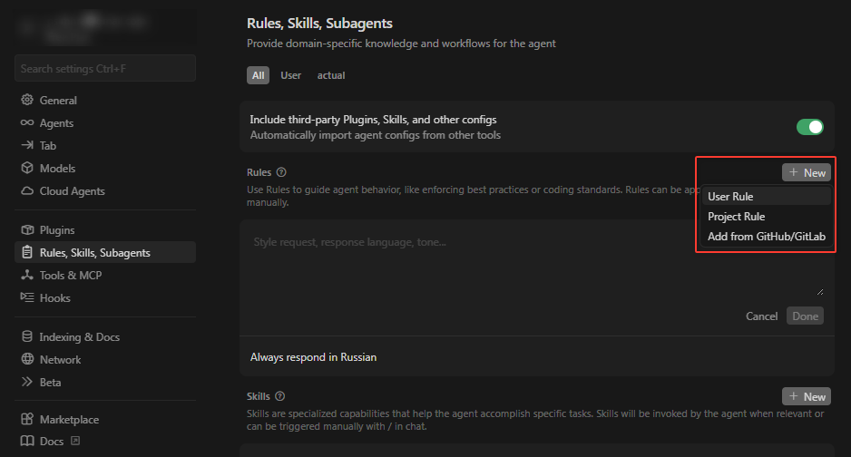

Это можно сделать и с помощью самого же агента, заодно протестировав что он работает. С помощью команды /create-rule описываем агенту что за правило мы хотим создать. Агент поспрашивает разрешения (создание папок, файлов и т.д.) и создаст папку .cursor в корне проекта и добавит туда правило

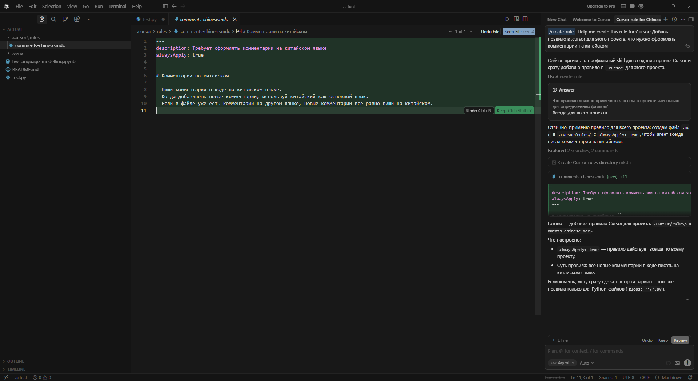

После подтверждения создания этого файла, это правило будет действовать

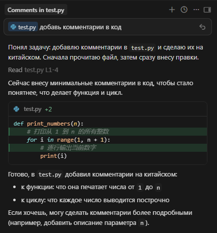

Для наглядности того факта, что правило действительно работает, мы тут попросили его писать комментарии на китайском, чего он сам бы вряд ли стал делать, но на практике стоит тщательно продумывать что именно вы тут пишите. Не стоит делать этот файл слишком большим, потому как это увеличивает контекст, а значит и стоимость каждого запроса. Лучше разбивать правила на несколько файлов и ограничивать их область применения через glob-паттерны — например, правила для тестов применять только к *.test.ts, а общие соглашения по стилю вынести в отдельный файл. Так агент получает только релевантные инструкции, а не весь набор правил сразу.

Правила работают лучше всего, когда они конкретны и однозначны. «Пиши чистый код» — бесполезная инструкция. «Не используй any в TypeScript», «все HTTP-запросы делай через lib/api.ts», «функции длиннее 40 строк разбивай на части» — это работает.

---

## Шаг 2 (step_id=9782330, text)

Windsurf

Windsurf — ещё один AI-native редактор на базе VS Code, со своим агентом Cascade и рядом уникальных возможностей, которых нет в Cursor. Он хорошо подходит тем, кто хочет альтернативу Cursor или просто интересуется другим подходом к агентной разработке.

Установка

Windsurf скачивается с windsurf.com — кнопка Download в правом верхнем углу. На macOS открываем скачанный .dmg, перетаскиваем в Applications и запускаем. На Windows запускаем инсталлятор и следуем инструкциям. На Linux доступны .deb и .rpm пакеты.

При первом запуске Windsurf проведёт онбординг: выбор раскладки клавиш (VS Code или Vim), перенос настроек из VS Code или Cursor, тема оформления. Перенос работает так же, как в Cursor — настройки переносятся автоматически, а расширения — по возможности, с учётом совместимости. После этого нужно залогиниться или создать аккаунт — через Google, GitHub или почту. При старте предлагается двухнедельный Pro-триал — для его активации запрашиваются данные карты. Если хотите пропустить и сразу использовать бесплатный план — ищите соответствующую ссылку на экране оплаты. Бесплатный план предоставляет ограниченное количество кредитов (точные значения могут меняться)

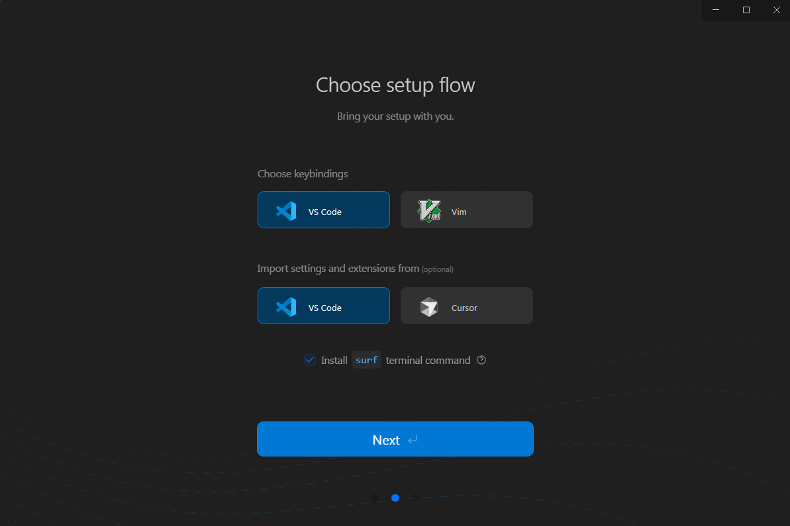

Одно важное ограничение по расширениям: в отличие от Cursor, Windsurf более строг с совместимостью — часть расширений VS Code не работает, установка через сторонние маркетплейсы не поддерживается. Если вы завязаны на конкретные плагины, стоит проверить совместимость до переезда.

Cascade: агент Windsurf

Агент в Windsurf называется Cascade. Открывается через Cmd+L / Ctrl+L или кликом на иконку Cascade в правом верхнем углу. Cascade работает в трёх режимах, переключаемых через toggle под полем ввода или сочетанием Cmd+. / Ctrl+.:

Code — агентный режим по умолчанию. Cascade самостоятельно читает файлы, вносит изменения, запускает команды в терминале и итерирует. Внутри разговора строится to-do список для отслеживания прогресса на сложных задачах.

Plan — режим планирования. Cascade изучает кодовую базу и сохраняется как отдельный план, доступный для повторного использования. Никаких изменений в код до вашего подтверждения. Когда план готов, нажимаете «Implement» — Cascade переключается в Code режим и начинает реализацию. Готовые планы можно @-упоминать в новых сессиях, чтобы продолжить работу с чистым контекстом.

Ask — режим только для чтения. Cascade ищет по кодовой базе и отвечает на вопросы, но никаких изменений не вносит.

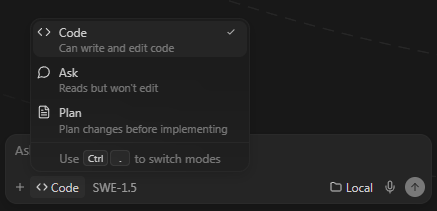

Что отличает Cascade от других агентов

Real-time awareness. Cascade учитывает текущий контекст редактора — открытые файлы, активный код и диагностические сообщения — что снижает необходимость явно передавать контекст в каждом запросе.

Ценообразование по промптам, а не токенам. В Windsurf стоимость обычно привязана к количеству сообщений (кредитов), а не напрямую к числу выполненных действий, что делает расходы более предсказуемыми.

Собственные модели SWE. У Windsurf есть своя линейка моделей — SWE-1.5 и SWE-1.5 Fast, обученных специально на задачах software engineering. Они позиционируются как близкий по качеству к frontier-моделям на кодинговых задачах, но работают быстрее. Помимо собственных моделей доступны Claude, GPT, Gemini, Grok, GLM — выбирается в выпадающем меню под полем ввода. Также есть BYOK для подключения своих API-ключей.

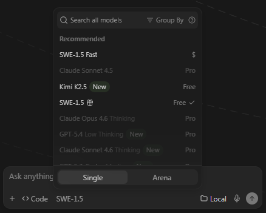

Arena Mode. Запускаем двух агентов с разными моделями параллельно на одну задачу, сравниваем результаты и голосуем за лучший. Можно выбрать конкретные модели или дать Windsurf подобрать их случайно из группы «быстрые» или «умные».

Codemaps. Cascade может строить визуальные карты структуры кодовой базы — показывает связи между файлами, модулями и ключевыми компонентами. Это инструмент навигации и понимания архитектуры: можно быстро увидеть, где находится нужная логика и как части проекта связаны между собой. Каждый узел кликабелен и ведёт к соответствующему месту в коде. Открыть: Ctrl+Shift+P → «Focus on Codemaps View». Карты можно @-упоминать в Cascade как контекст.

Настройка поведения агента

В Windsurf четыре способа задать агенту постоянные инструкции — они дополняют друг друга:

Rules хранятся в .windsurf/rules/, попадают в git и применяются автоматически. Можно задать glob-паттерн (например, только для *.test.ts) или сделать правило всегда активным. Пример правила с frontmatter:

---
trigger: always
---
Используй TypeScript strict mode.
Не изменяй файлы в директории auth/ без явного указания.

Skills — пакеты инструкций для сложных повторяющихся задач. Skill — это папка в .windsurf/skills/ с файлом SKILL.md и вспомогательными файлами (шаблоны, чеклисты, конфиги). Cascade загружает содержимое skill только когда решает его применить — это не раздувает контекст без нужды. @-упоминание skill вызывает его принудительно.

Workflows — переиспользуемые последовательности шагов, вызываемые вручную через /имя-воркфлоу в поле ввода. Хранятся в .windsurf/workflows/ как markdown-файлы. Подходит для регулярных процессов: ревью PR, деплой, запуск тестовых пайплайнов.

AGENTS.md — стандартный файл с инструкциями для агентов, который Windsurf (и другие агенты, поддерживающие этот формат) автоматически подхватывает из корня проекта или нужной директории. Удобен для командного шаринга общих правил через git.

В следующем шаге разберём расширения для VS Code — Cline, Roo Code и Copilot — для тех, кто хочет агентные возможности без смены редактора.

---

## Шаг 3 (step_id=9782331, text)

Расширения для VS Code: Copilot, Cline, Roo Code

IDE-форки дают тесную интеграцию AI на уровне редактора, но требуют смены инструмента. Расширения для VS Code решают задачу иначе: агент добавляется поверх привычной среды, редактор остаётся тем же. Для тех, кто не хочет переезжать из VS Code, это полноценная альтернатива. При этом важно помнить, что граница между «расширением для IDE» и «CLI-агентом» уже не всегда жёсткая: часть инструментов умеет работать и в редакторе, и в терминале.

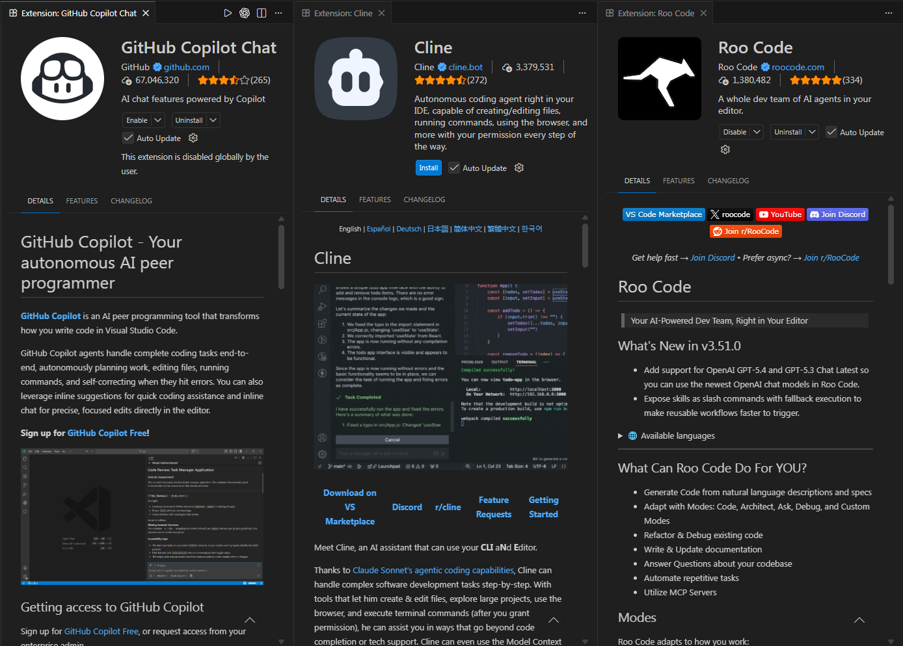

GitHub Copilot

GitHub Copilot — наиболее распространённое AI-расширение для VS Code, и хорошая отправная точка, если вы только знакомитесь с AI-инструментами в IDE. Устанавливается из маркетплейса VS Code, авторизация — через GitHub аккаунт. Бесплатный план даёт ограниченное количество автодополнений и сообщений в чат (точные лимиты могут меняться).

Copilot предлагает три основных режима: автодополнение строк прямо в редакторе и чат в боковой панели. Agent mode поддерживает многошаговые задачи через чат и инструменты, но с меньшей автономностью, чем специализированные агентные IDE. В платных тарифах можно выбирать между несколькими моделями, которые предоставляет GitHub. В Актуальной версии добавили возможность добавлять некоторые дополнительные модели со своими API ключами.

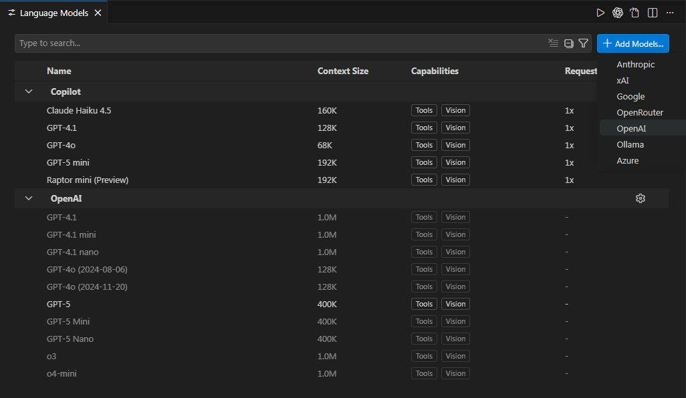

Главное преимущество Copilot — охват сред. Это единственный инструмент из этого класса с официальными плагинами для JetBrains и Neovim. Если в команде кто-то работает в IntelliJ или Vim, Copilot даёт единый опыт без дополнительной настройки. Для VS Code это добротный инструмент с минимальной конфигурацией — установил, залогинился, работает.

Но при этом главный фокус инструмента не на автономность, а на ассистирование, поэтому для автономных агентов часто смотрят на другие инструменты.

Cline

Cline — open-source агентное расширение для VS Code с BYOM-подходом: никакой подписки на инструмент, платите только за токены выбранного провайдера. Устанавливается из маркетплейса, в настройках указывается провайдер и API-ключ — Anthropic, OpenAI, OpenRouter, Gemini или любой другой совместимый API.

Cline реализует полноценный агентный цикл: читает файлы, выполняет команды в терминале, вносит изменения в несколько файлов, итерирует по ошибкам. Каждое действие агента требует явного одобрения — можно включить автоодобрение, но по умолчанию контроль максимальный. Это делает Cline хорошим вариантом для тех, кто хочет понять, что именно делает агент на каждом шаге.

Roo Code

Roo Code — форк Cline, который развился в самостоятельный продукт с более богатой функциональностью. Устанавливается так же — из маркетплейса VS Code, настраивается через BYOM. Ключевое отличие от Cline — структурированные режимы и встроенное семантическое индексирование кодовой базы.

С 15 мая 2026 года Roo Code прекращает работу — его сменяет Kilo Code с аналогичными функциями.

Roo Code предлагает пять специализированных режимов.

	Architect занимается планированием и проектированием до написания кода.
	Code — основной рабочий режим для написания и рефакторинга.
	Ask отвечает на вопросы без изменения файлов.
	Debug диагностирует ошибки по стектрейсам и логам.
	Orchestrator координирует работу между остальными режимами для многоэтапных задач. Каждому режиму можно назначить отдельную модель — например, Architect работает с reasoning-моделью, а Code с более быстрой и дешёвой.

Индексирование кодовой базы в Roo Code

Одна из самых значимых функций Roo Code — семантическое индексирование через Qdrant. Это требует некоторой настройки и установки дополнительных инструментов, но стоит иметь ввиду такую возможность.

Без семантического индекса агенты опираются на поиск по тексту и выборочное чтение файлов. Roo Code может конвертировать весь код в векторные эмбеддинги и хранить их в Qdrant — векторной базе данных. Когда агенту нужно найти релевантный код, он делает семантический поиск по смыслу запроса, а не по точному совпадению текста.

Если хочется глубже разобраться именно в том, как устроены векторные базы данных, эмбеддинги, семантический поиск и сам Qdrant вне привязки к Roo Code, для этого у нас есть отдельный курс: Vector DB & RAG Developer.

Это означает, что запрос «где у нас логика аутентификации?» находит нужный код, даже если слово «аутентификация» нигде явно не написано. На больших репозиториях разница существенная: агент точнее определяет релевантные файлы и может снизить объём лишнего контекста.

Для настройки нужны два компонента. Embedding-провайдер конвертирует код в векторы — поддерживаются OpenAI, Google Gemini (включая бесплатный тир), Ollama для локальной работы, OpenRouter и другие. Qdrant — сама векторная база данных. Локальный инстанс запускается через Docker одной командой:

docker run -p 6333:6333 -v qdrant_storage:/qdrant/storage qdrant/qdrant

После этого в настройках Roo Code указываем URL Qdrant (http://localhost:6333), выбираем embedding-провайдер и нажимаем «Start Indexing». Статус индексирования виден прямо в интерфейсе чата — иконка базы данных в правом нижнем углу поля ввода. Последующие обновления инкрементальные — переиндексируются только изменённые файлы, что существенно быстрее полного переиндексирования.

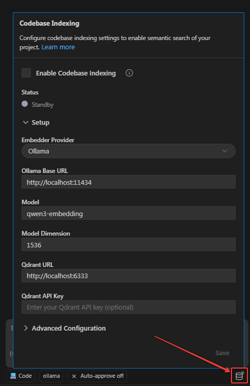

Claude Code и Codex: мост между IDE и CLI

Claude Code и Codex логичнее относить не к классическим VS Code-расширениям, а к CLI-агентам с интеграцией в редактор. Основной сценарий у них терминальный: агент запускается в рабочей директории проекта, сам читает файлы, выполняет команды и вносит изменения. Но при этом оба инструмента уже умеют встраиваться в IDE-процесс: IDE можно использовать как интерфейс для просмотра изменений, запуска задач и возврата к коду без постоянного переключения контекста.

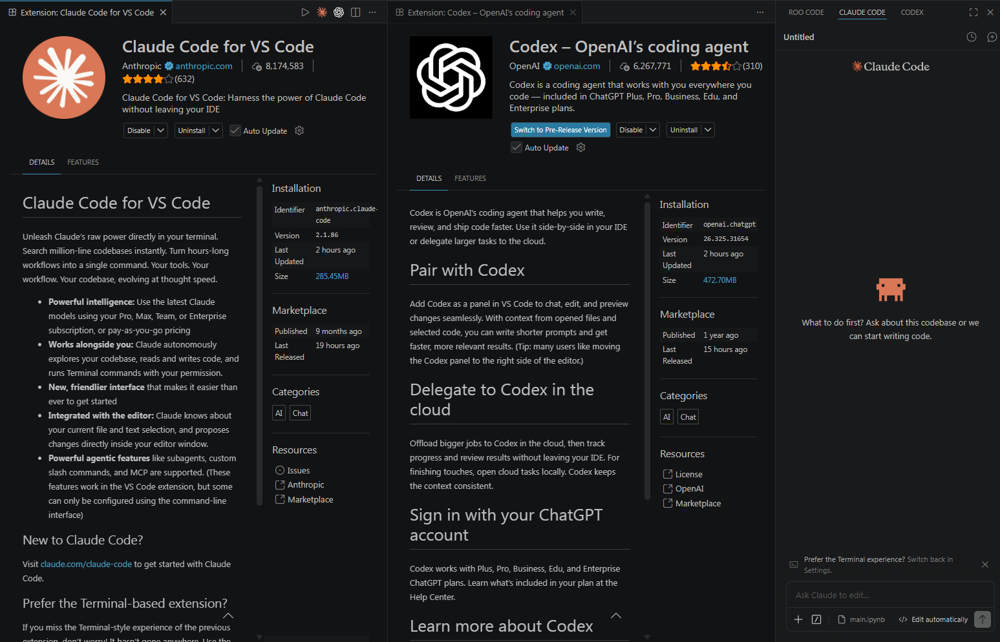

Практически это означает следующее. Если вам важнее работать внутри VS Code, у вас есть как минимум два равноправных пути. Первый — классические IDE-расширения вроде Copilot, Cline или Roo Code, где агентная работа целиком встроена в интерфейс редактора. Второй — Claude Code или Codex, которые можно связать с IDE, но при этом их рабочая модель по-прежнему опирается на CLI. Если у вас уже есть подходящая подписка на Claude или OpenAI, начать именно с их интеграций часто вполне логично.

Разница не в том, что один из этих вариантов «правильнее» для VS Code, а в том, какой режим работы вам ближе. Copilot, Cline и Roo Code — это скорее IDE-first инструменты. Claude Code и Codex — скорее CLI-first инструменты, которые умеют хорошо встраиваться в IDE. Такой сценарий особенно полезен, когда нужно много работать с git, shell-командами, скриптами и длинными многошаговыми задачами.

Важно не воспринимать IDE-интеграцию как «полную замену» терминалу. В редакторе такие инструменты обычно удобнее для входа, визуального контроля diff и быстрого возврата к файлам. Но терминальный режим остаётся сильнее там, где рабочий процесс строится вокруг shell-команд и автоматизации.

	Меньше трения в shell-first сценариях. В терминале проще естественно встраивать агента в обычный поток работы: запускать его из нужной директории, быстро переключаться между git, тестами, логами, скриптами и самим агентом.
	Лучше подходит для длинных автономных задач. Когда агенту нужно пройтись по многим файлам, несколько раз запустить проверки и итерировать по результату, терминал обычно даёт более прямой и предсказуемый контроль над этим циклом.
	Проще автоматизировать и воспроизводить. CLI легче встроить в скрипты, alias'ы, CI-процессы и командные инструкции проекта. Для инженерной работы это важно: один и тот же сценарий можно повторять без привязки к конкретному окну IDE.
	Понятнее границы окружения. В терминале лучше видно, в какой директории запущен агент, какие команды он использует, какие переменные окружения и инструменты ему доступны. Для реальной разработки это часто критичнее, чем удобство боковой панели.

Мы намеренно только намечаем этот переход здесь, потому что в следующем уроке разберём Claude Code и Codex уже как отдельный класс инструментов — именно как CLI-агентов. Это поможет не смешивать два режима работы: в этом шаге мы смотрим, как агент встраивается в привычную IDE, а дальше перейдём к сценарию, где терминал становится основным рабочим интерфейсом.

Итоги урока

Мы рассмотрели несколько способов добавить агента в IDE. Cursor и Windsurf — AI-native форки VS Code с глубокой интеграцией агента в редактор, каждый со своей философией: Cursor даёт контроль и гибкость, Windsurf — скорость и делегирование. Расширения для VS Code позволяют получить агентные возможности без смены среды: Copilot прост в старте и покрывает JetBrains и Neovim, Cline даёт BYOM с полным контролем над каждым шагом, Roo Code добавляет специализированные режимы и семантическое индексирование через Qdrant. Claude Code и Codex занимают промежуточную позицию: их можно связать с IDE, но по своей логике это уже CLI-агенты. Поэтому следующим уроком мы разберём их именно в терминальном сценарии работы.

---

## Шаг 4 (step_id=9803750, choice)

Чем принципиально отличается AI-native IDE-форк от расширения с точки зрения интеграции агента?

**Тип:** choice (single)

**Варианты:**
- ○ Расширение не может выполнять команды, а форк может
- ○ Форк поддерживает больше провайдеров моделей, чем расширение
- ○ Форк всегда автономнее расширения при любых настройках
- ✓ Форк меняет ядро, расширение живёт в API редактора

---

## Шаг 5 (step_id=9803748, choice)

В чём принципиальное отличие режима Plan в Cursor от режима Agent?

**Тип:** choice (single)

**Варианты:**
- ○ Plan использует более мощную модель для обдумывания задачи
- ○ Plan работает только с файлами из @-контекста
- ○ Plan позволяет запускать несколько агентов параллельно
- ✓ Plan строит план без правок до подтверждения

---

## Шаг 6 (step_id=9803753, choice)

Что такое real-time awareness в Windsurf Cascade и чем это полезно на практике?

**Тип:** choice (single)

**Варианты:**
- ○ Cascade знает о новых библиотеках сразу после релиза
- ○ Cascade сама чинит ошибки из консоли без запроса
- ✓ Cascade видит открытый код и диагностику без @
- ○ Cascade синхронизирует правки команды в реальном времени

---

## Шаг 7 (step_id=9803752, choice)

Почему семантический поиск через Qdrant точнее обычного текстового поиска при работе агента с кодом?

**Тип:** choice (single)

**Варианты:**
- ✓ Векторный поиск находит код по смыслу запроса
- ○ Qdrant кэширует поиск и отвечает быстрее grep
- ○ Семантический поиск учитывает историю файла при ранжировании
- ○ Qdrant ищет по AST-структуре, а не по тексту

---

## Шаг 8 (step_id=9803754, choice)

В чём ключевое преимущество ценообразования Windsurf по кредитам перед оплатой по токенам?

**Тип:** choice (single)

**Варианты:**
- ✓ Цена задачи предсказуема независимо от её длины
- ○ Кредиты дают доступ к более мощным моделям без доплаты
- ○ Кредиты всегда дешевле токенов у провайдера
- ○ Кредиты не сгорают в конце месяца

---

## Шаг 9 (step_id=9803751, matching)

Сопоставьте инструмент с его особенностью.

**Тип:** matching

**Правильные пары:**
- GitHub Copilot → Официальная поддержка JetBrains и Neovim
- Windsurf → ценообразование по кредитам за сообщение, а не по токенам
- Cursor → Полноценная IDE с агентными функциями на уровне ядра
- Roo Code → Возможность индексирования кодовой базы

---

## Шаг 10 (step_id=9803749, choice)

В Cursor включён режим Run Everything. Что именно он делает?

**Тип:** choice (single)

**Варианты:**
- ✓ Снимает все подтверждения действий агента
- ○ Разрешает любые модели без проверки API-ключа
- ○ Отключает индексирование проекта для ускорения работы агента
- ○ Запускает нескольких агентов в отдельных worktrees

---
