# Урок 4. CLI-агент

_lesson_id: 2281870 · steps: 13 · ttc: 965s_

---

## Шаг 1 (step_id=9781637, text)

Claude Code

Claude Code — терминальный агент от Anthropic. Он работает прямо в командной строке, понимает структуру репозитория, умеет читать файлы, выполнять команды и итерировать по ошибкам. Как и все CLI его можно в теории использовать даже без открытого IDE. В этом шаге мы его установим, подключим к аккаунту и разберёмся с CLAUDE.md — механизмом, который даёт агенту постоянный контекст о проекте.

Установка

Anthropic выпустил нативный инсталлятор, который не требует Node.js и автоматически обновляется в фоне. Именно его и рекомендуется использовать — старый способ через npm официально устарел.

На macOS и Linux

curl -fsSL https://claude.ai/install.sh | bash

 После завершения проверяем версию:

claude --version

На Windows

Claude Code использует Git внутри для выполнения команд. Если Git не установлен, инсталлятор это сообщит. Установите его.

Если стоит portable версия и путь не стандартный, нужно его явно указать

setx CLAUDE_CODE_GIT_BASH_PATH "D:\Path\to\git\usr\bin\bash.exe"

Когда Git установлен можно приступать к установке:

	через PowerShell
	irm https://claude.ai/install.ps1 | iex
	
	или CMD
	curl -fsSL https://claude.ai/install.cmd -o install.cmd && install.cmd && del install.cmd
	

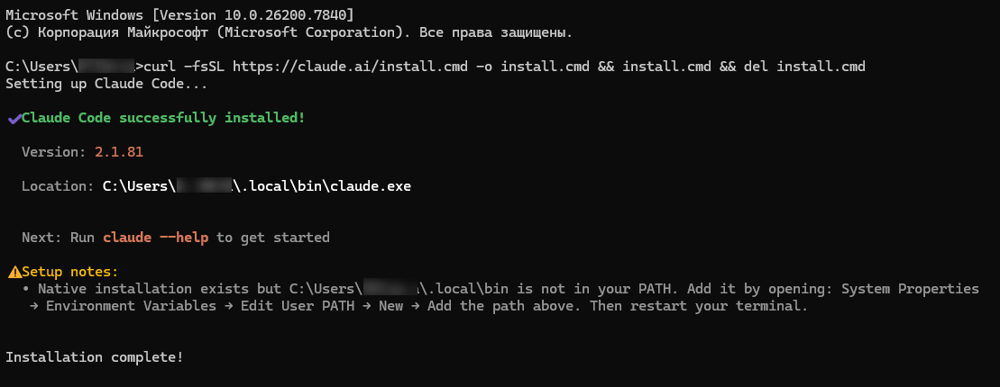

После этого нужно добавить папку C:\Users\<USERNAME>\.local\bin, в переменные среды (<USERNAME> замените на имя вашей папки, установщик пишет вам этот путь в Setup notes)

setx PATH "%PATH%;C:\Users\<username>\.local\bin"

Проверяем что работает, пишем в терминале claude

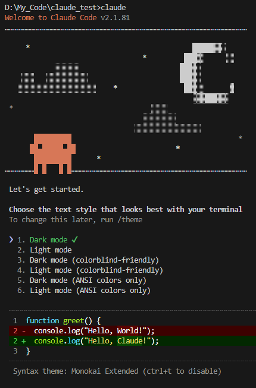

Аутентификация

После того как вы при первом запуске выберете стиль оформления, как на скриншоте выше, Claude Code предложит выбрать способ аутентификации. Поддерживается три способа подключения — выбор зависит от того, как вы платите за доступ к модели.

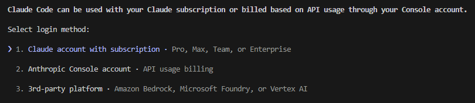

Claude account with subscription  — OAuth через браузер, вариант для тех кто пользуется подпиской. После запуска claude в терминале откроется браузер для авторизации через аккаунт claude.ai. Никаких ключей вводить не нужно: токен сохраняется локально и обновляется автоматически. 

Anthropic Console account — API-ключ для прямой оплаты через platform.claude.com. Ключ создаётся в разделе API Keys и передаётся через переменную окружения:

export ANTHROPIC_API_KEY="ваш-ключ"

Чтобы переменная применялась в каждой новой сессии, добавьте эту строку в ~/.zshrc или ~/.bashrc. При API-ключе каждый запрос списывает токены напрямую с баланса — без лимитов подписки, но и без фиксированного месячного счёта.

3rd-party platform  — Сторонние платформы, предоставляющие доступ к моделям —  доступны варианты Amazon Bedrock, Microsoft Foundry, или Vertex AI.

Первое использование

Используя терминал переходим в директорию проекта и запускаем агента:

cd ~/my-project
claude

Терминал войдёт в интерактивный режим. Можно писать задачи на русском или английском — агент прочитает нужные файлы, внесёт изменения и покажет diff перед применением. По умолчанию каждое значимое действие требует подтверждения.

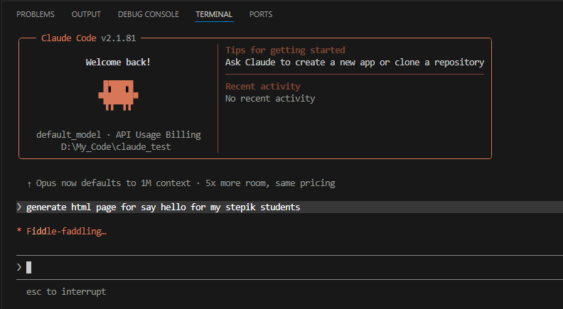

После того как мы отправляем ему промпт, он приступает к работе и как завершит, спрашивает подтверждение на создание/изменение/удаление файлов, если это потребуется

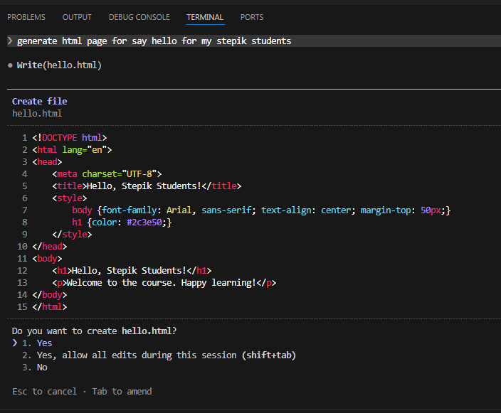

Подтверждаем и смотрим результат

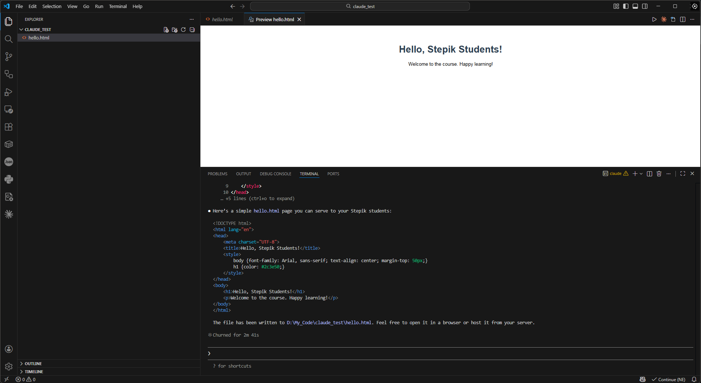

Поздравляю, вы установили и попробовали использовать Claude code.

Для одноразовых задач без интерактивного режима задачу можно передать сразу аргументом:

claude "добавь обработку ошибок в функцию fetch_user в src/api.py"

Завершить сессию — /exit или Ctrl+C.

CLAUDE.md: постоянный контекст для агента

У Claude Code нет памяти между сессиями — каждый новый запуск начинается с чистого листа. CLAUDE.md решает эту проблему: это markdown-файл в корне проекта, который агент автоматически читает при каждом старте.

Создать его проще всего командой /init прямо в сессии — агент проанализирует репозиторий и сгенерирует заготовку:

claude
# В интерактивном режиме:
/init

Результат — Claude code сгенерирует файл CLAUDE.md с описанием проекта в его корне.

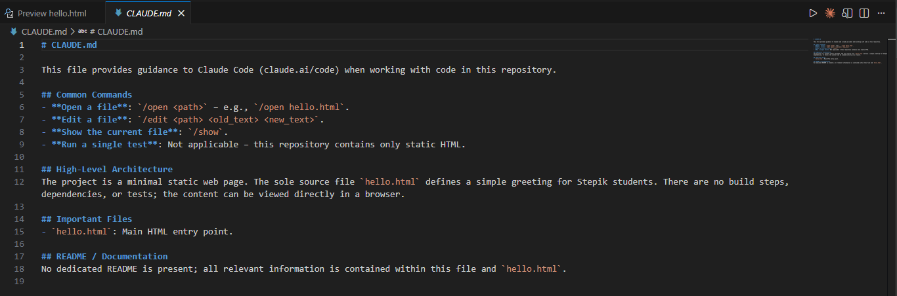

Его стоит сразу отредактировать под свой проект. Вот типичная структура:

# My Project

## Команды
- `npm run dev` — запуск dev-сервера
- `npm test` — запуск тестов
- `npm run lint` — линтер

## Архитектура
- API-хендлеры живут в `src/api/`
- Бизнес-логика — в `src/services/`
- Типы — в `src/types/`

## Соглашения
- TypeScript strict mode, никаких `any`
- Все HTTP-запросы идут через `src/lib/api.ts`
- Функции длиннее 40 строк разбивать на части

## Что не трогать
- `src/legacy/` — устаревший код, только читаем
- `config/prod.json` — не изменять без согласования

Несколько практических правил. Файл стоит держать в пределах 200 строк — длинный CLAUDE.md раздувает контекст каждого запроса и снижает точность следования инструкциям. Если правил много, разбивайте их на несколько файлов в директории .claude/rules/ и ограничивайте область применения через glob-паттерны — например, правила для тестов можно применять только к *.test.ts.

Правила работают лучше, когда они конкретны. «Пиши чистый код» — бесполезная инструкция. «Не используй any в TypeScript», «все HTTP-запросы делай через src/lib/api.ts» — это работает. CLAUDE.md стоит добавить в git: тогда вся команда работает с одним набором инструкций для агента.

---

## Шаг 2 (step_id=9782341, text)

OpenAI Codex

В первом уроке мы разбирали путаницу в именовании: Codex 2021 года — это языковая модель, которую OpenAI обучали на коде. Сегодняшний Codex — другое: это терминальный агент от OpenAI, написанный на Rust, открытый исходный код, работающий локально на вашей машине. Мы его установим, разберём режимы работы и посмотрим на AGENTS.md — аналог CLAUDE.md из предыдущего шага.

Установка

На сайте OpenAI есть разные варианты установки, начиная от браузерной версии и расширений для IDE, заканчивая полноценным приложением.

Если поставить app версию (на данный момент доступны MacOS и Windows версии), то мы получим полноценное приложение с графическим интерфейсом

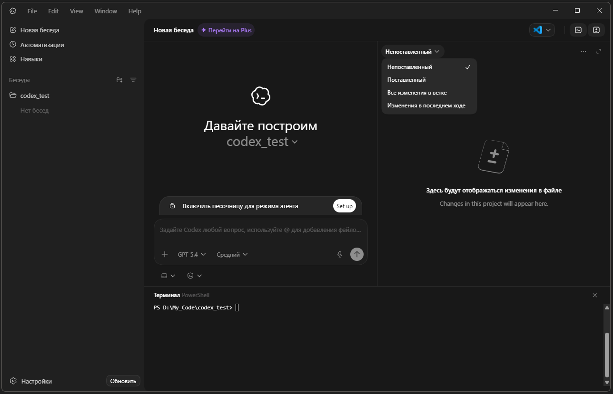

Это удобный вариант для личного использования, и с ним легко интуитивно разобраться, особенно если вы уже пользовались ChatGPT, тут всё очень похоже: окно чата, в котором вы общаетесь с агентом, слева менеджер проектов и задач, сверху — управление сессией. Есть интегрированное окно терминала, возможность открывать файлы через вашу IDE, смотреть изменения.

Сильная сторона такого подхода — наглядность. Видно, что делает агент, проще контролировать процесс, удобно работать с несколькими задачами одновременно. Это особенно полезно, если вы только начинаете или используете Codex как “второго разработчика”, а не как инструмент в пайплайне.

Но есть и ограничения. Графический интерфейс добавляет лишний слой между вами и инструментом: сложнее автоматизировать процессы, хуже интеграция в существующий workflow, и в целом меньше гибкости. Такие вещи начинают ощущаться, когда работа выходит за рамки одной задачи и появляется необходимость в повторяемости.

Установка CLI

CLI версия, лучше вписывается в реальную разработку. Она даёт прямой доступ к агенту без промежуточных слоёв, проще интегрируется в текущую среду (терминал, скрипты, CI), и позволяет выстраивать более быстрые и предсказуемые процессы. Это уже не “отдельное приложение”, а инструмент, который становится частью рабочего окружения.

Codex CLI устанавливается через npm. На macOS и Linux это три команды. На Windows — чуть длиннее: CLI работает стабильно только в Linux-окружении, поэтому сначала нужно поднять WSL.

macOS и Linux

Если Node.js ещё не установлен, рекомендуем ставить его через nvm — менеджер версий. В отличие от системного пакетного менеджера, nvm устанавливает всё в домашнюю директорию, и глобальные npm-пакеты не требуют прав суперпользователя.

curl -o- https://raw.githubusercontent.com/nvm-sh/nvm/v0.39.7/install.sh | bash
source ~/.zshrc   # или ~/.bashrc, если используете bash
nvm install --lts

Если Node.js уже есть — этот шаг пропускаем. Ставим Codex:

npm install -g @openai/codex

После установки команда codex станет доступна в системе.

codex --version

Особенности работы на Windows

В отличие от app-версии, которая уже работает нативно, CLI на Windows пока находится в экспериментальном состоянии.

Формально он запускается, но основной сценарий, который рекомендует сам OpenAI — использовать его через WSL (Windows Subsystem for Linux). Это связано с тем, что CLI изначально ориентирован на Unix-подобную среду, и именно там работает стабильно.

На практике это означает, что при попытке использовать CLI напрямую в PowerShell или cmd можно столкнуться с рядом ограничений: нестабильная работа с файловой системой, проблемы с путями (особенно из-за обратных слешей), ограничения sandbox-окружения и лишние подтверждения операций.

Также часть возможностей может работать некорректно или непредсказуемо, поскольку Windows-окружение отличается от того, под которое инструмент изначально разрабатывался.

Как это обходится на практике

Решение здесь стандартное — использовать WSL2 и работать внутри Linux-окружения.

В этом случае CLI ведёт себя так же, как на Linux или macOS: корректно обрабатывает файлы, нормально работает с путями и не создаёт лишних ограничений.

Фактически, вся работа переносится в WSL, а Windows остаётся только хост-системой. Это может показаться лишним шагом, но на практике это самый стабильный и предсказуемый вариант.

Вывод для установки

Если вы работаете на Windows и планируете использовать CLI, лучше сразу закладываться на WSL как на основное окружение.

Если же хочется “поставил и работает” без дополнительной настройки — в этом случае app-версия сейчас даёт более простой вход и нативный опыт на Windows.

Windows: установка через WSL

WSL (Windows Subsystem for Linux) — это встроенная в Windows возможность запускать полноценное Linux-окружение прямо внутри системы, без виртуальной машины. Codex CLI разрабатывался под Unix-среду, поэтому на Windows его запускают именно так.

Шаг 1. Включаем WSL и устанавливаем Ubuntu

Открываем PowerShell от имени администратора (правая кнопка на иконке → «Запуск от имени администратора») и выполняем:

wsl --install -d Ubuntu

Команда включит компонент WSL, скачает и установит Ubuntu. В конце потребуется перезагрузка — соглашаемся. После перезагрузки Ubuntu запустится автоматически и попросит придумать имя пользователя и пароль для Linux-окружения. Это отдельный пользователь внутри WSL, не связанный с Windows-аккаунтом.

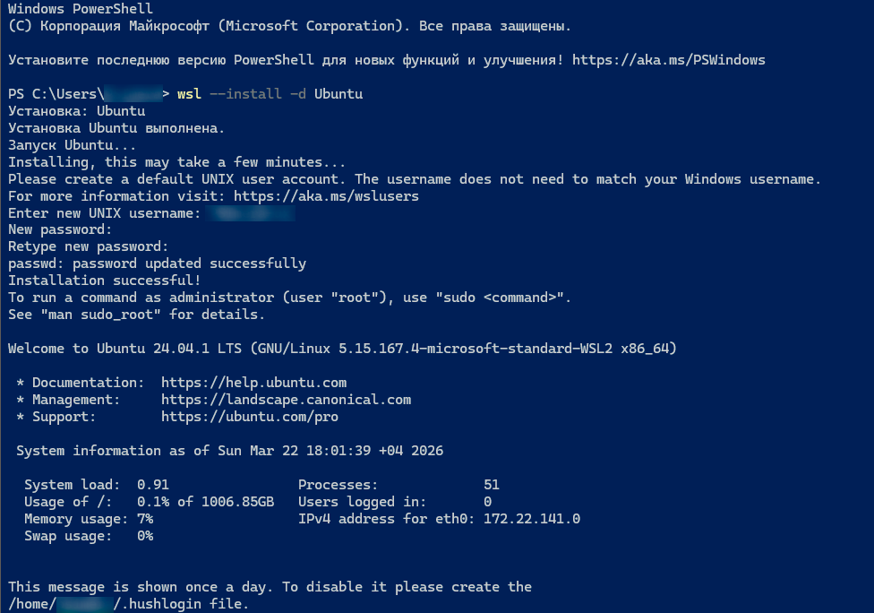

Шаг 2. Обновляем пакеты Ubuntu

Перед установкой чего-либо обновляем список доступных пакетов. Это стандартная практика — как обновление магазина приложений перед установкой:

sudo apt update

sudo означает выполнение с правами администратора — Ubuntu попросит пароль, который вы задали на предыдущем шаге.

Шаг 3. Устанавливаем Node.js через nvm

Не стоит ставить Node.js через apt install nodejs — системная версия устанавливает глобальные пакеты в директорию, куда обычному пользователю писать нельзя, и npm install -g будет падать с ошибкой EACCES: permission denied. Правильный путь — nvm:

curl -o- https://raw.githubusercontent.com/nvm-sh/nvm/v0.39.7/install.sh | bash
source ~/.bashrc
nvm install --lts

Первая команда скачивает и устанавливает nvm в вашу домашнюю директорию. source ~/.bashrc применяет изменения в текущей сессии (без этого команда nvm будет недоступна до перезапуска терминала). nvm install --lts устанавливает актуальную LTS-версию Node.js.

Проверяем:

node --version
npm --version

Шаг 4. Устанавливаем Codex

npm install -g @openai/codex

На этом установка завершена. Дальше работаем в этом же терминале WSL — переходим в директорию проекта и запускаем Codex как на Linux.

Файлы Windows доступны из WSL по пути /mnt/c/Users/ВашеИмя/. То есть если проект лежит, например по адресу D:\My_Code\codex_test, то в WSL к нему можно перейти так: cd /mnt/d/My_Code/codex_test.

Переходим в папку проекта и запускаем агента командой codex

Аутентификация

Codex поддерживает три способа входа.

Sign in with ChatGPT — Если вы пользуетесь подпиской на ChatGPT Plus, Pro, Business или Enterpricse — при первом запуске codex откроется браузер для OAuth-авторизации через аккаунт OpenAI. Это удобно: никаких ключей, лимиты уже включены в подписку.

Sign in with Device Code — это способ авторизоваться с устройства без браузера — получаете одноразовый код и вводите его на другом устройстве. Удобно например в серверном окружении.

Provide your own API key — Если вы хотите платить за используемые токены. Используем API-ключ, который создаётся на platform.openai.com в разделе API keys

Быстрый старт

Для быстрой одноразовой задачи без интерактивного режима можно писать промпт сразу, после команды запуска:

codex "объясни архитектуру этого проекта"

Агент прочитает файлы в текущей директории, составит план и выведет ответ в терминал.

Если же открыв папку проекта, запустить там команду codex, то мы попадём в интерактивный режим, и аналогично как и в Claude code мы можем сразу писать агенту промпт и просить его что-то сделать в открытом проекте

Настройки

Используя команду /model, мы можем выбрать модель и уровень её reasoning, то на сколько глубоко она будет размышлять. Выбор ограничен моделями OpenAI. На скриншоте вы  видите актуальный на момент написания урока модельный ряд (Модель довольно часто меняются, следите за обновлениями)

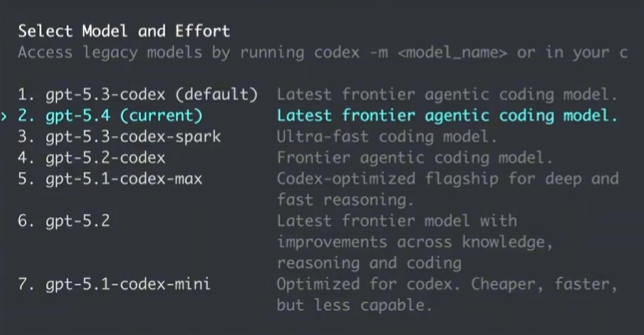

Reasoning советуем оставлять на уровне medium, этот режим достаточно "умный", но при этом сэкономит вам много токенов по сравнению с  high или extra high. Более глубокие режимы подойдут для сложных задач, но они работают дольше и очень быстро расходуют лимиты, это скорее подойдёт для дорогих тарифов Pro.

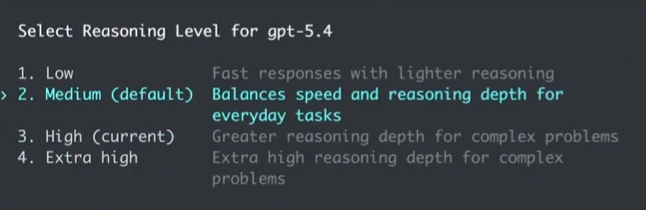

команда /permissions управляет доступом. Мы можем оставить стандартные настройки Default и тогда codex будет спрашивать нас разрешения на разные действия, либо дать ему полный доступ Full Acces, но делайте это осознавая все риски. Если выберете этот режим, codex выдаст вам сообщение с предупреждением и уточнит уверены ли вы в этом.

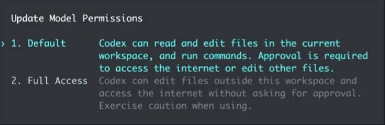

/plan — включить режим планирования. Аналогичен одноимённому режиму в cursor, не вносит изменений в код, задаёт уточняющие вопросы и продумывает дальнейшие действия по шагам.

В codex есть ещё много других команд, во вводном уроке всех мы касаться не будем, будем разбираться с ними далее по мере изучения. Если вы хотите самостоятельно ознакомится с их полным перечнем, можно сделать это в документации.

AGENTS.md

Так же как Claude Code использует CLAUDE.md, Codex читает AGENTS.md при старте сессии. Формат и назначение те же: команды для запуска, соглашения по коду, архитектурные ограничения, что не трогать. Файл стоит закоммитить в репозиторий — тогда он автоматически подхватывается при работе в проекте. Чтобы сгенерировать этот файл автоматически, используйте команду /init

# Project Name

## Build & Test
- `npm run build` — сборка
- `npm test` — тесты
- `npm run lint` — линтер

## Conventions
- Компоненты — в `src/components/`, по одному файлу на компонент
- Никаких прямых fetch-вызовов в компонентах — только через `src/api/`
- Все новые файлы на TypeScript, strict mode

Codex Web: асинхронный вариант

Помимо CLI, OpenAI предоставляет Codex Web — облачный режим на chatgpt.com/codex. Работает иначе: подключаете GitHub-репозиторий, описываете задачу, и агент выполняет её в изолированном контейнере на стороне OpenAI. Когда задача готова, можно просмотреть diff, оставить комментарии, итерировать и в итоге создать pull request. Этот режим удобен для задач, которые не требуют вашего присутствия за терминалом, — например, рефакторинг, написание тестов, обновление зависимостей.

---

## Шаг 3 (step_id=9782342, text)

OpenCode

OpenCode — open-source агент с открытым кодом, который изначально проектировался под работу с любым провайдером. Не нужно выбирать между Claude и GPT — можно переключаться между ними в одну команду. Именно об этом шаг: установка, подключение провайдеров и первая работа с агентом.

Десктопное приложение и TUI

У OpenCode есть десктопное приложение в бета-версии для macOS, Windows и Linux — скачать можно на opencode.ai/download. Оно подойдёт тем, кто предпочитает графический интерфейс.

Мы будем работать с TUI — Terminal User Interface. Это не чистый CLI, а полноценный текстовый интерфейс в терминале: с панелями, навигацией клавишами, меню выбора моделей и провайдеров. Сами авторы называют его именно TUI — это важный нюанс, потому что опыт работы с ним заметно богаче, чем просто ввод команд в строку.

Установка

Рекомендуемый способ — скрипт-инсталлятор. Он не требует Node.js, скачивает нативный бинарник под вашу платформу и автоматически добавляет его в PATH:

curl -fsSL https://opencode.ai/install | bash

Эта команда работает на macOS, Linux — и на Windows тоже, но нужен bash-терминал. Проще всего использовать Git Bash, который идёт в комплекте с Git for Windows — он у большинства разработчиков уже установлен. Открываем Git Bash и запускаем ту же команду.

Если Git Bash нет — альтернативой будет WSL (мы его настраивали в предыдущем шаге), либо пакетные менеджеры в PowerShell:

# Через Scoop
scoop install opencode

# Через Chocolatey
choco install opencode

После установки проверяем:

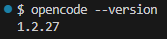

Первый запуск и подключение провайдеров

Переходим в директорию проекта и запускаем агент:

cd ~/my-project
opencode

Откроется TUI.

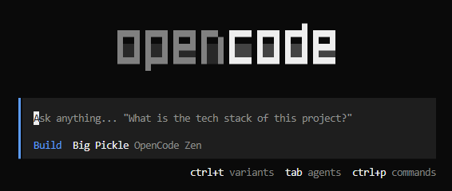

При первом запуске OpenCode предложит подключить OpenCode Zen — собственный хостинг моделей от команды OpenCode, где они отбирают и тестируют модели специально под агентные задачи. Это платный сервис с бесплатным тиром. Если хотите попробовать — можно начать с него. 

Можно подключить любого другого провайдера. Делается это через команду /connect. Когда мы начинаем вводить / мы сразу видим список доступных команд прямо в интерфейсе.

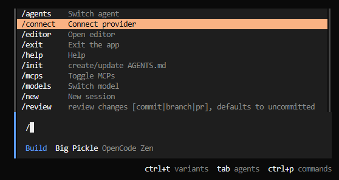

Anthropic и OpenAI: если уже есть подписка

Если у вас есть подписка на claude.ai Pro/Max или ChatGPT Plus/Pro — самый простой вариант войти через OAuth, без ввода API-ключей. Вводим /connect, выбираем нужного провайдера и следуем инструкции в браузере:

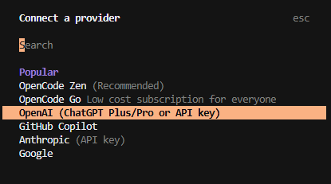

После авторизации команда /models покажет все доступные модели этого провайдера. Для Anthropic это будут Claude Sonnet, Opus и другие; для OpenAI — весь актуальный модельный ряд.

Если подписки нет — можно выбрать Manually enter API Key в том же меню и вставить ключ от console.anthropic.com или platform.openai.com.

OpenRouter: один ключ — все модели

Главная ценность OpenCode проявляется в связке с OpenRouter — агрегатором, который даёт доступ к 300+ моделям от разных провайдеров через единый API-ключ. Вместо того чтобы заводить аккаунты у каждого провайдера отдельно, подключаем OpenRouter — и переключаемся между Claude, GPT, Gemini, DeepSeek и десятками других в одной команде.

Шаг 1. Регистрируемся на openrouter.ai. Кнопка Sign In в правом верхнем углу — вход через Google или GitHub.

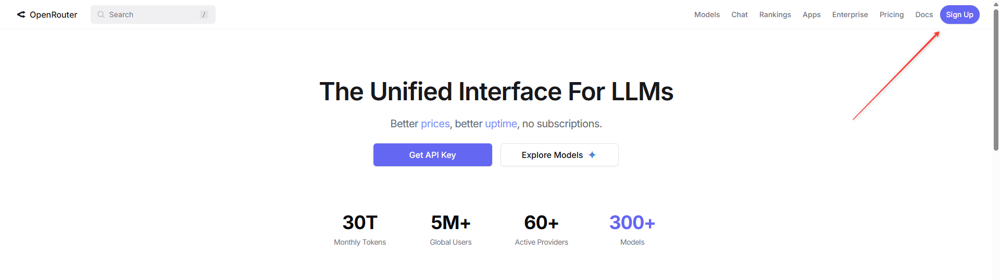

Шаг 2. После входа открываем openrouter.ai/settings/keys, нажимаем Create Key, даём ключу имя и копируем его.

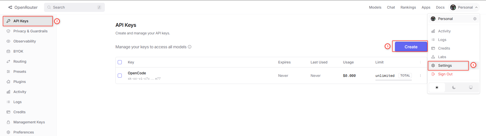

Шаг 3. В TUI OpenCode вводим /connect, выбираем OpenRouter из списка и вставляем ключ.

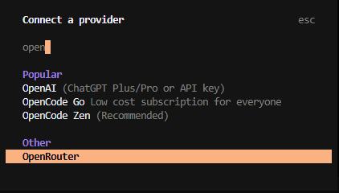

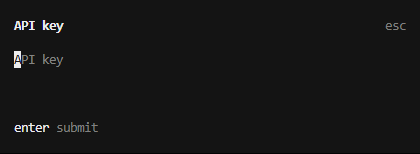

Шаг 4. После подключения вводим /models — откроется список доступных моделей. 

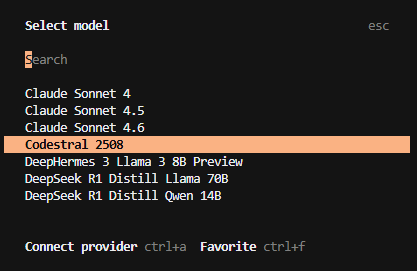

Бесплатные модели помечены суффиксом (free)

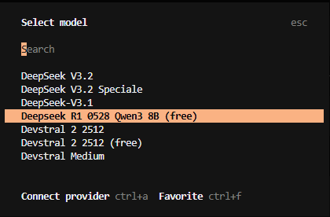

У бесплатных моделей есть лимиты по запросам в минуту, но для учёбы и экспериментов обычно хватает.

Найти их можно также на openrouter.ai/models, включив фильтры по текстовым моделям и по цене.

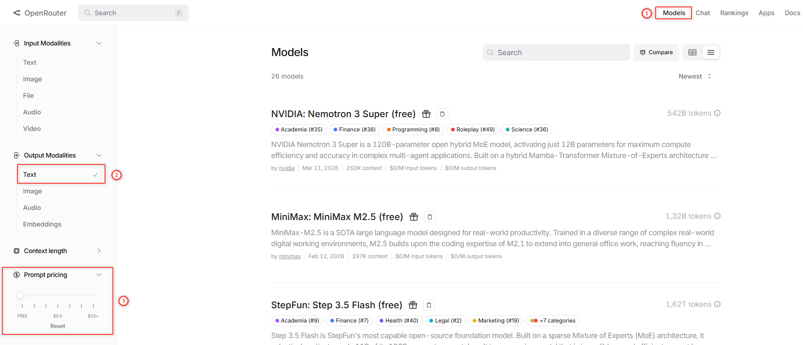

После подключения модели, проверим что всё работает

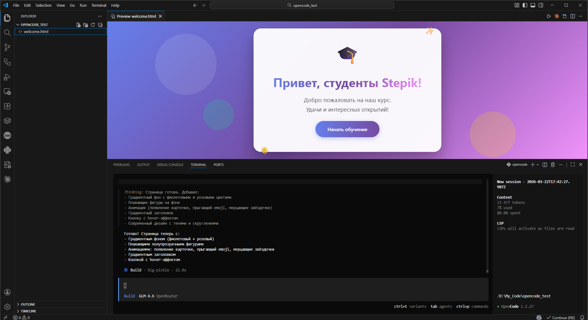

Режимы: build и plan

OpenCode работает в двух режимах, между которыми переключаются клавишей Tab. Текущий режим виден в поле запроса.

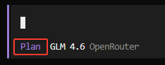

Build — основной режим. Агент читает файлы, вносит изменения, выполняет команды. Перед каждым действием показывает что собирается сделать и ждёт подтверждения.

Plan — режим только для анализа. Агент изучает кодовую базу и предлагает план реализации, но ничего не меняет. Удобно начинать с Plan на сложных задачах: убедились что агент правильно понял задачу — переключаемся в Build клавишей Tab.

Для прикрепления конкретных файлов к запросу используем @ — это вызывает fuzzy-поиск по проекту прямо в поле ввода.

AGENTS.md

Как и остальные CLI-агенты, OpenCode читает AGENTS.md из корня проекта при каждом старте. Создать его автоматически:

/init

Агент проанализирует репозиторий и создаст файл с описанием структуры. Стоит его отредактировать и закоммитить — тогда вся команда работает с одним набором инструкций для агента.

Итоги урока

Мы разобрали три CLI-агента, каждый со своей нишей. Claude Code — выбор тех, кто работает с моделями Anthropic: нативный инсталлятор, OAuth для подписчиков claude.ai, плотная интеграция с экосистемой Anthropic. CLAUDE.md задаёт постоянный контекст проекта. Codex от OpenAI — удобнее всего тем, у кого есть подписка ChatGPT: OAuth-вход без ключей, явный контроль автономности через режимы Suggest / Auto Edit / Full Auto, плюс Codex Web как асинхронный облачный вариант для задач без присутствия за терминалом. На Windows CLI-версия требует WSL — нативный опыт там лучше даёт десктопное приложение. OpenCode — наиболее гибкий вариант: подключается к любому из 75+ провайдеров через /connect, один ключ OpenRouter даёт доступ к сотням моделей, работает нативно на Windows без WSL, и TUI-интерфейс заметно богаче простой командной строки.

В следующем шаге мы разберём локальные модели — LM Studio и Ollama — и посмотрим как их подключать к CLI-агентам и расширениям в IDE.

---

## Шаг 4 (step_id=9816201, choice)

Что даёт OAuth-авторизация в CLI-агентах по сравнению с API-ключом?

**Тип:** choice (single)

**Варианты:**
-  снимает лимиты на количество запросов в рамках сессии
-  позволяет использовать агент без подключения к интернету
-  доступ к более мощным моделям без дополнительной платы
- [✓ правильный] не требует ручного создания и хранения ключа

**Статус Stepik:** `correct` (score 1.0)

**Мой reasoning:** _В теории прямо сказано про OAuth: «Никаких ключей вводить не нужно: токен сохраняется локально и обновляется автоматически». Это и есть ключевое отличие от API-ключа, который нужно создавать вручную и хранить в переменной окружения._

---

## Шаг 5 (step_id=9816208, choice)

Для чего предназначен Plan mode в CLI-агентах?

**Тип:** choice (single)

**Варианты:**
- [✓ правильный] анализирует задачу без изменения файлов проекта
-  запускает тесты и проверяет корректность кода проекта
-  генерирует документацию по существующей кодовой базе
-  создаёт резервную копию перед применением изменений

**Статус Stepik:** `correct` (score 1.0)

**Мой reasoning:** _В теории прямо сказано про /plan в Codex: «не вносит изменений в код, задаёт уточняющие вопросы и продумывает дальнейшие действия по шагам». Это режим планирования без правок._

---

## Шаг 6 (step_id=9816210, choice)

Чем TUI отличается от обычного CLI?

**Тип:** choice (single)

**Варианты:**
-  TUI не поддерживает ввод аргументов при запуске команды
-  TUI работает только в графических терминальных эмуляторах
- [✓ правильный] TUI предоставляет интерактивные панели поверх терминала
-  TUI требует постоянного подключения к удалённому серверу

**Статус Stepik:** `correct` (score 1.0)

**Мой reasoning:** _В теории явно сказано, что TUI — это не чистый CLI, а полноценный текстовый интерфейс в терминале с панелями, навигацией клавишами и меню. Это и отличает его от обычного CLI с вводом команд в строку._

---

## Шаг 7 (step_id=9816209, choice)

Почему для работы Codex CLI на Windows рекомендуется WSL?

**Тип:** choice (single)

**Варианты:**
-  PowerShell не умеет корректно запускать npm-скрипты
-  настройка API-ключа невозможна без Linux-окружения
-  Windows-версия Codex не поддерживает ни один режим работы
- [✓ правильный] он ориентирован на Unix-среду и стабильнее там

**Статус Stepik:** `correct` (score 1.0)

**Мой reasoning:** _В теории прямо сказано, что CLI изначально ориентирован на Unix-подобную среду и именно там работает стабильно, поэтому OpenAI рекомендует WSL._

---

## Шаг 8 (step_id=9816202, choice)

Какую роль выполняет OpenRouter в связке с CLI-агентами?

**Тип:** choice (single)

**Варианты:**
-  инструмент для локального запуска open-source моделей
-  провайдер, разрабатывающий собственные языковые модели
-  платформа для тонкой настройки и дообучения моделей
- [✓ правильный] агрегатор, дающий доступ к моделям через один ключ

**Статус Stepik:** `correct` (score 1.0)

**Мой reasoning:** _OpenRouter — это агрегатор, позволяющий через единый API-ключ обращаться к множеству моделей разных провайдеров, что удобно для CLI-агентов вроде OpenCode, поддерживающих разных провайдеров._

---

## Шаг 9 (step_id=9816203, choice)

Какие рекомендации по ведению CLAUDE.md / AGENTS.md верны? (несколько ответов)

**Тип:** choice (multiple)

**Варианты:**
-  писать максимально подробно для покрытия всех случаев
- [✓ правильный] держать файл компактным, не более 200 строк
- [✓ правильный] добавлять конкретные команды запуска и тестов
-  хранить все правила в одном файле для простоты навигации

**Статус Stepik:** `correct` (score 1.0)

**Мой reasoning:** _В теории прямо сказано: файл стоит держать в пределах 200 строк, и правила должны быть конкретными (команды запуска, тестов, линтера). Подробность ради подробности раздувает контекст, а длинные правила рекомендуют разбивать на несколько файлов в .claude/rules/._

---

## Шаг 10 (step_id=9816207, choice)

Чем Codex Web отличается от Codex CLI?

**Тип:** choice (single)

**Варианты:**
-  Codex Web работает с любыми провайдерами через API-ключ
- [✓ правильный] задача выполняется в облаке без участия разработчика
-  Codex Web требует локальной установки и зависимостей
-  Codex Web поддерживает только просмотр кода без изменений

**Статус Stepik:** `correct` (score 1.0)

**Мой reasoning:** _В теории явно сказано: Codex Web работает в изолированном контейнере на стороне OpenAI, агент выполняет задачу асинхронно, без присутствия разработчика за терминалом._

---

## Шаг 11 (step_id=9816205, choice)

Что произойдёт если не добавить CLAUDE.md / AGENTS.md в git?

**Тип:** choice (single)

**Варианты:**
-  агент не запустится без этого файла в репозитории
-  файл будет создаваться заново при каждом запуске агента
-  агент проигнорирует файл и не будет применять правила
- [✓ правильный] коллеги будут работать без общих инструкций для агента

**Статус Stepik:** `correct` (score 1.0)

**Мой reasoning:** _В теории прямо сказано: 'CLAUDE.md стоит добавить в git: тогда вся команда работает с одним набором инструкций для агента'. Без коммита в репозиторий файл остаётся локальным и команда не получит общих правил._

---

## Шаг 12 (step_id=9816206, matching)

Сопоставь CLI-агент с его особенностью.

**Тип:** matching

**Колонка А (вопросы):**
- Claude Code
- Codex CLI
- OpenCode
- Codex Web

**Колонка Б (варианты, перемешаны):**
- CLAUDE.md как постоянный контекст проекта
- требует WSL для стабильной работы на Windows
- /connect для подключения 75+ провайдеров
- выполнение задач в изолированном облачном контейнере

**Правильные пары:**
- Claude Code → CLAUDE.md как постоянный контекст проекта
- Codex CLI → требует WSL для стабильной работы на Windows
- OpenCode → /connect для подключения 75+ провайдеров
- Codex Web → выполнение задач в изолированном облачном контейнере

**Статус Stepik:** `correct` (score 1.0)

**Мой reasoning:** _Claude Code использует CLAUDE.md для контекста, Codex CLI на Windows стабильно работает только через WSL, OpenCode подключает провайдеров через /connect, а Codex Web выполняет задачи в облачном контейнере OpenAI._

---

## Шаг 13 (step_id=9816204, choice)

Для чего нужна команда /init в CLI-агентах?

**Тип:** choice (single)

**Варианты:**
-  инициализирует новый git-репозиторий в текущей папке
- [✓ правильный] анализирует проект и создаёт файл с контекстом
-  проверяет совместимость окружения и зависимостей
-  сбрасывает настройки агента до заводских значений

**Статус Stepik:** `correct` (score 1.0)

**Мой reasoning:** _В теории прямо сказано: /init у Claude Code генерирует CLAUDE.md, а у Codex — AGENTS.md, оба файла дают агенту постоянный контекст о проекте._

---
