# Урок 5. Запуск моделей локально

_lesson_id: 2289076 · steps: 13 · ttc: 1030s_

---

## Шаг 1 (step_id=9816224, text)

Локальные модели: зачем и что нужно

В прошлом уроке мы подключали OpenRouter и выбирали модели из каталога. Многие из них — так называемые open-weight модели: их веса открыты, то есть любой может скачать и запустить их самостоятельно. Llama от Meta, Qwen от Alibaba, Gemma от Google — все они open-weight. Но когда мы используем их через OpenRouter, запросы всё равно уходят на серверы провайдера. Ваш код видит третья сторона.

Для большинства задач это не критично. Но если вы работаете с проприетарным кодом, чувствительными данными клиентов или просто хотите полной изоляции — локальный запуск решает проблему радикально: модель работает на вашем железе, никакие данные не покидают машину.

Форматы моделей

Прежде чем говорить о железе, разберёмся с форматами — от этого зависит что вообще можно запустить на вашей машине.

GGUF — универсальный формат, созданный проектом llama.cpp. Это основной формат для локального запуска: работает на CPU, GPU с CUDA, и Apple Silicon через Metal. Практически все инструменты для локального запуска — LM Studio, Ollama, jan.ai — понимают GGUF. Модели в этом формате уже поставляются со встроенной квантизацией, и их можно скачать напрямую с Hugging Face. Когда вы видите файл вроде model-Q4_K_M.gguf — это он.

MLX — формат Apple, разработанный специально для Apple Silicon. Использует unified memory и оптимизирован под Neural Engine чипов M-серии. На Mac с чипами M1 и новее MLX даёт заметно более высокую скорость генерации по сравнению с GGUF на той же машине. LM Studio поддерживает MLX на Apple Silicon — Ollama пока нет, поддержка на roadmap. MLX-модели лежат на Hugging Face в организации mlx-community.

Safetensors / PyTorch — «сырые» форматы, в которых модели сохраняются после обучения. Не оптимизированы для инференса на потребительском железе. Чтобы запустить модель в таком формате локально, её нужно сначала конвертировать в GGUF. Эти форматы вы встретите на Hugging Face у оригинальных чекпоинтов.

Для практических целей: если у вас Mac с M-чипом — смотрите на MLX-версии моделей в LM Studio, они быстрее. На Windows и Linux — GGUF.

Квантизация: как большая модель помещается на маленькое железо

Модель хранит свои параметры в виде чисел. По умолчанию — 16 бит на каждый параметр. Квантизация сжимает эти числа до 4–8 бит, уменьшая размер модели и требования к памяти примерно в два-четыре раза, с минимальной потерей качества.

Самый распространённый вариант — Q4_K_M: 4-битная квантизация с оптимизацией по ключевым слоям. Это золотой стандарт для потребительского железа — модель влезает в VRAM, работает быстро, качество практически не отличается от полной версии. Модель 8B в Q4_K_M весит около 5 ГБ вместо 16 ГБ в полном формате.

Q8 даёт чуть лучшее качество, но вдвое больший размер. Q3 и ниже — заметная деградация качества, оправдана только если модель иначе не влезает.

Требования к железу

Главный ресурс при локальном запуске — память. Если модель не помещается целиком в быструю память, часть слоёв уходит в медленную (оперативную), и скорость генерации падает кратно — с 40 токенов в секунду до 2–3. Поэтому ключевое правило: модель должна помещаться в VRAM целиком.

На Windows и Linux быстрая память — это VRAM видеокарты. Для ускорения нужна NVIDIA с поддержкой CUDA (RTX-серия) или AMD с ROCm. CPU-режим работает везде, но медленно — подходит для экспериментов, не для агентной работы.

На Apple Silicon картина другая: GPU и CPU используют единый пул памяти (unified memory). Это означает, что весь RAM доступен как «VRAM» — Mac с 64 ГБ оперативной памяти может запускать модели, которые не поместятся ни на одну потребительскую видеокарту.

Ориентировочные цифры для Q4_K_M квантизации:

	
		
			Железо
			Модели
			Реальные возможности
		
	
	
		
			4–6 ГБ VRAM / 16 ГБ RAM (Mac)
			3–4B
			простые вопросы, маленькие скрипты
		
		
			8 ГБ VRAM / 16–32 ГБ RAM (Mac)
			7–8B
			несложный кодинг, короткий контекст
		
		
			12–16 ГБ VRAM / 32 ГБ RAM (Mac)
			14B
			заметно лучше, но на сложных задачах ощутимо уступает облаку
		
		
			24 ГБ VRAM / 64 ГБ RAM (Mac)
			32B
			уже рабочий инструмент, разрыв с облаком сокращается
		
		
			48+ ГБ VRAM / 96+ ГБ RAM (Mac)
			70B
			лучшее что доступно локально, всё ещё заметно слабее топовых облачных
		
	

Важно правильно понимать масштаб разрыва. Топовые облачные модели (например, флагманские модели Anthropic или OpenAI) используют архитектуру Mixture of Experts: формально это триллионы параметров, но на каждом токене работает лишь часть сети — обычно эквивалент десятков миллиардов. Поэтому корректное сравнение — не «70 миллиардов против нескольких триллионов», а скорее «70B против ~30–50B активных параметров».

Тем не менее разница хорошо видна на практических бенчмарках. Например, в рейтинге LLM для кодинга от Vellum топовые облачные модели стабильно занимают верхние позиции на SWE-bench и других инженерных тестах (≈80%+), тогда как даже сильные open-source модели заметно отстают . Это отражает реальный разрыв именно в сложных задачах — не в синтаксисе, а в многошаговом reasoning и работе с кодовой базой.

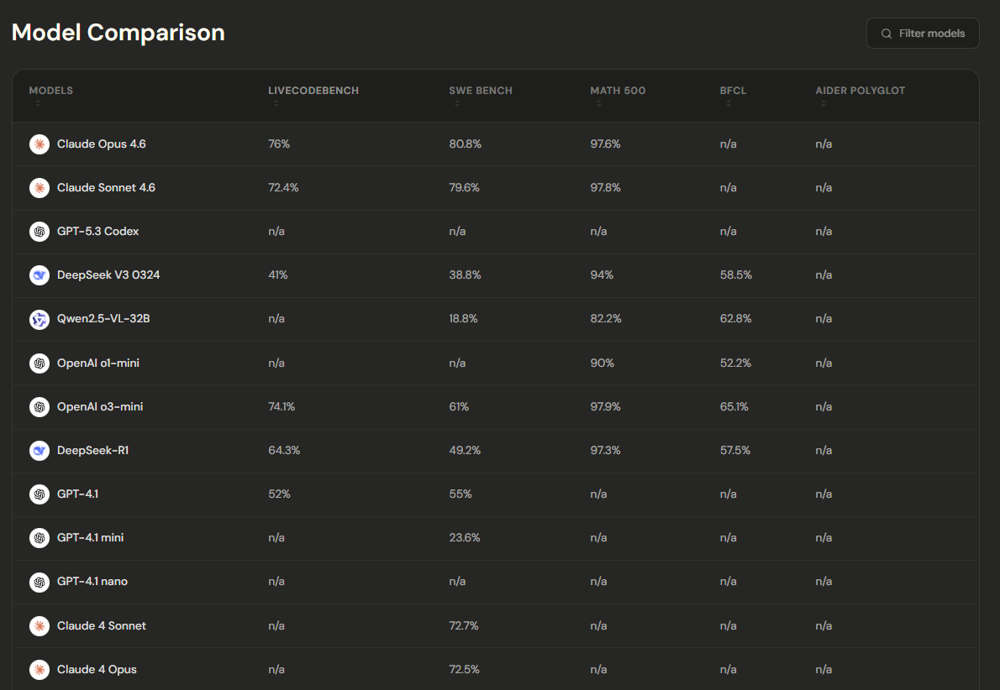

На простых и средних задачах 32–70B уже близки по уровню, но на сложных сценариях — многошаговый рефакторинг, архитектура, анализ больших кодовых баз — преимущество облака остаётся существенным. Локальные модели — это компромисс между приватностью, стоимостью и качеством, а не полная замена.

Где скачать модели

Hugging Face (huggingface.co) — основной репозиторий open-weight моделей. Здесь лежат оригинальные веса и конвертированные GGUF-версии от сообщества. Организации lmstudio-community, bartowski и mlx-community публикуют проверенные квантизованные версии популярных моделей. Для скачивания конкретного файла достаточно перейти во вкладку Files и скачать нужный .gguf.

На практике же скачивать модели вручную с Hugging Face нужно редко — LM Studio и Ollama делают это сами через встроенные каталоги. В следующих шагах мы разберём оба инструмента.

---

## Шаг 2 (step_id=9819936, text)

LM Studio

LM Studio — десктопное приложение для запуска локальных моделей. Главное его преимущество перед другими инструментами — удобный GUI: модели ищутся и скачиваются прямо внутри приложения, загрузка и настройка делается в несколько кликов, а локальный сервер запускается одной кнопкой. Под капотом — движок llama.cpp для GGUF-моделей и собственный MLX-движок для Apple Silicon.

Установка

Скачиваем с lmstudio.ai — установщик под вашу платформу определяется автоматически. На macOS открываем .dmg и перетаскиваем в Applications, на Windows запускаем инсталлятор, на Linux доступен .AppImage.

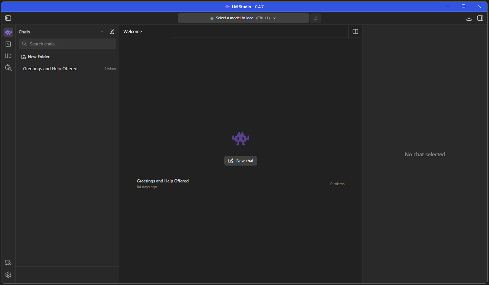

Поиск и загрузка модели

Встроенный каталог LM Studio — самый удобный способ найти и скачать модель. Открываем раздел Discover (иконка лупы в боковом меню) или нажимаем Cmd+Shift+M на macOS / Ctrl+Shift+M на Windows.

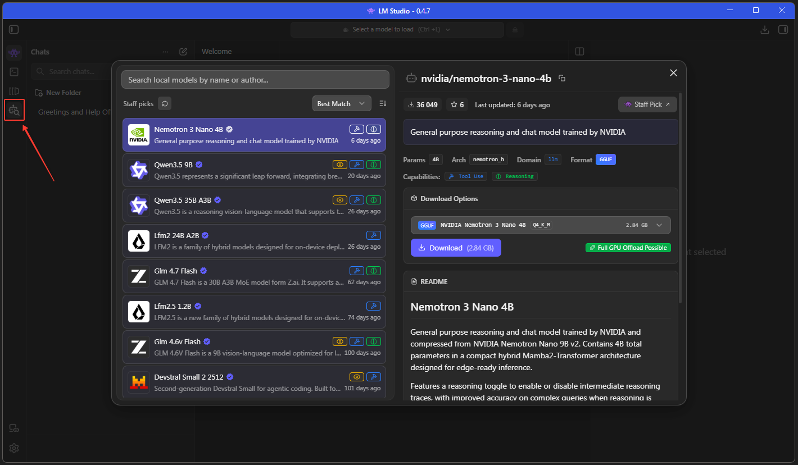

В поиске набираем название модели, LM Studio показывает доступные варианты с указанием размера и квантизации, модели, которые полностью помещаются в доступную VRAM, подсвечиваются зелёным цветом и символом ракеты. Рядом показывается объём VRAM, который потребуется.

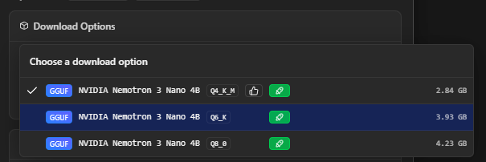

Нажимаем Download — модель скачивается в фоне. Прогресс виден прямо в интерфейсе.

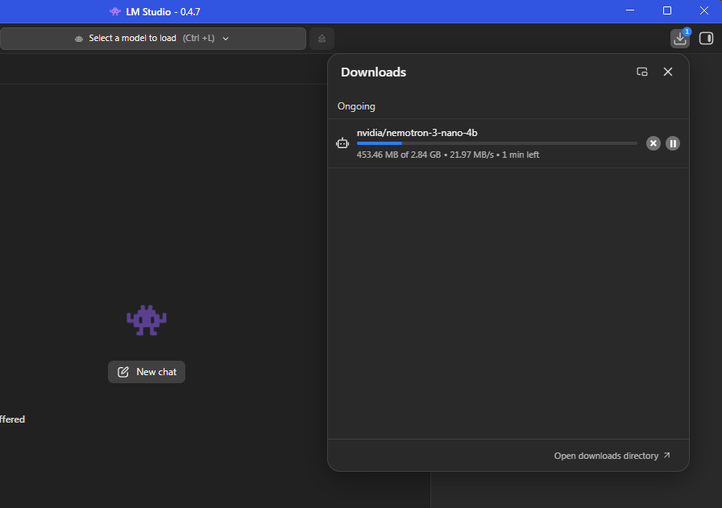

В настройках можно поменять путь сохранения моделей

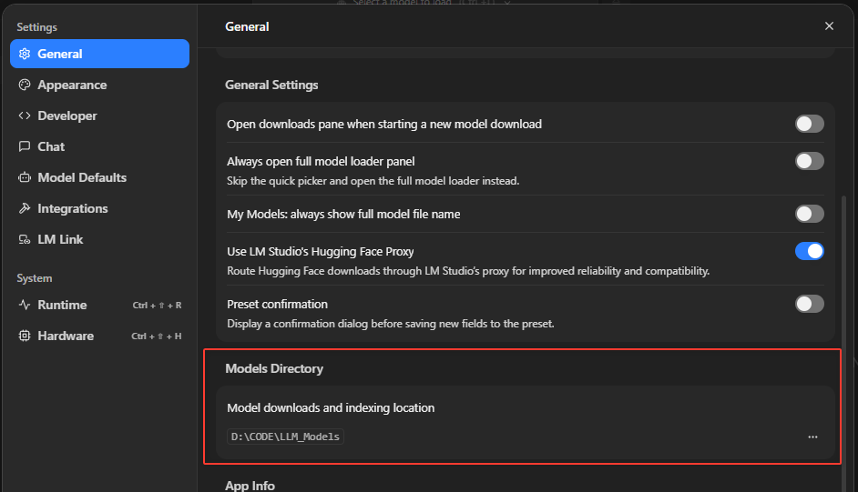

Загрузка модели и первый чат

После скачивания, LM Studio сам предложит её загрузить, либо мы можем это сделать сами в верху выбрав желаемую модель. 

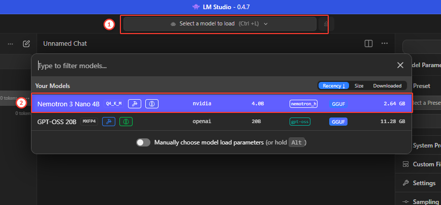

Переходим в раздел Chat и проверяем что модель работает. В меню справа доступны настройки модели (системный промпт, температура, размер контекста и много других настроек)

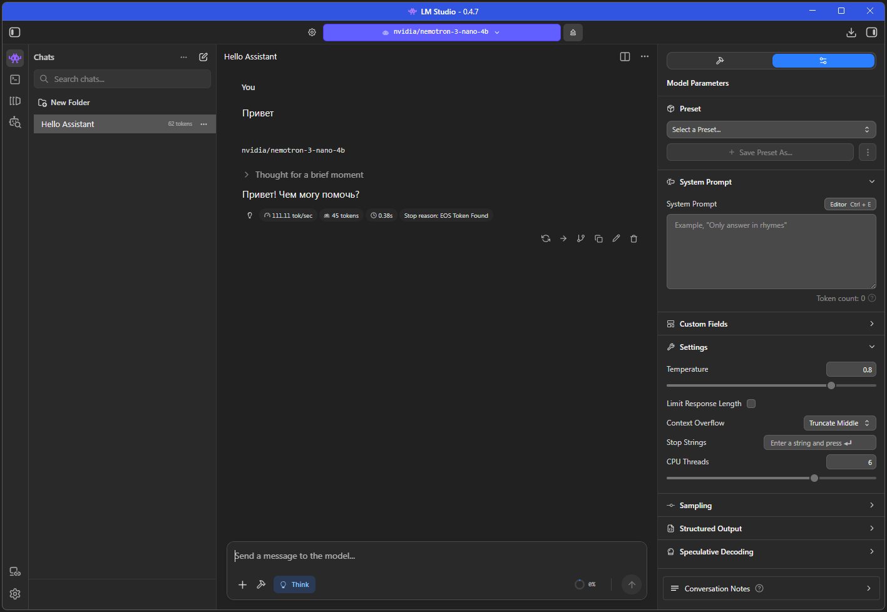

Теперь можно общаться с моделью в интерфейсе, не отличимом от обычного чат-приложения. Всё работает офлайн — никаких запросов в интернет.

Локальный сервер

Чат — это удобно, но главная ценность LM Studio для разработчика в другом: оно поднимает локальный сервер с OpenAI и Anthropic-совместимым API. Это означает, что любой инструмент, который умеет работать с доступными API, можно переключить на локальную модель — просто изменив адрес сервера.

По суть, загрузив в память модель, мы уже запустили сервер. Открываем раздел Developer (иконка >_ в боковом меню [1]). Здесь мы так же можем загружать и выгружать из памяти модели, менять настройки сервера (Порт и другие. По умолчанию сервер слушает на http://localhost:1234 [2]), копировать название модели [3] просматривать доступные эндпоинты [4], смотреть логи

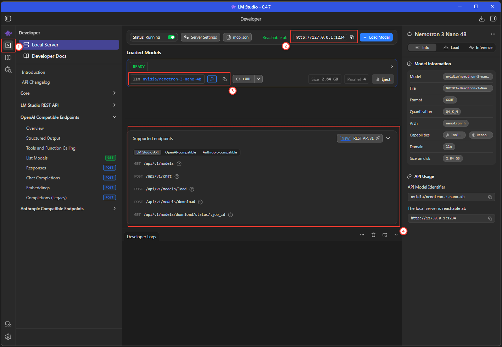

Интеграция с инструментами

Roo Code

Заходим в настройки, добавляем нового провайдера, из списка выбираем LM Studio, доступные модели автоматически считываются расширением, просто выбираем нужную и сохраняем.

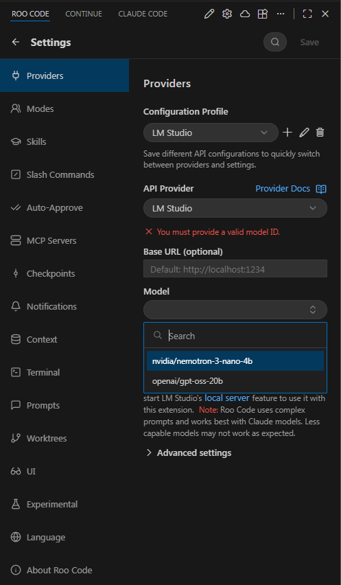

Настройка модели становится доступной для выбора под окном ввода запроса

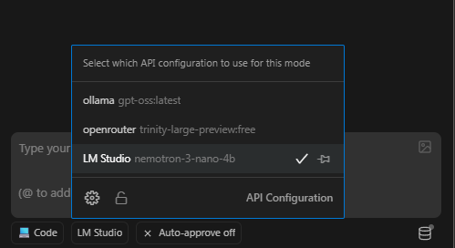

Cloude Code

Создаём файл с настройками ~/.claude/lmstudio.settings.json (название можно заменить)

{
    "env": {
        "ANTHROPIC_BASE_URL": "http://127.0.0.1:1234/",
        "ANTHROPIC_AUTH_TOKEN": "dummy",
        "API_TIMEOUT_MS": "3000000",
        "CLAUDE_CODE_DISABLE_NONESSENTIAL_TRAFFIC": 1,
        "ANTHROPIC_MODEL": "default_model",
        "ANTHROPIC_SMALL_FAST_MODEL": "default_model",
        "ANTHROPIC_DEFAULT_SONNET_MODEL": "default_model",
        "ANTHROPIC_DEFAULT_OPUS_MODEL": "default_model",
        "ANTHROPIC_DEFAULT_HAIKU_MODEL": "default_model"
    }
}

default_model позволит не менять настройки, когда мы меняем модели

Потом запускаем Claude code с параметром --settings <путь к файлу настроек>

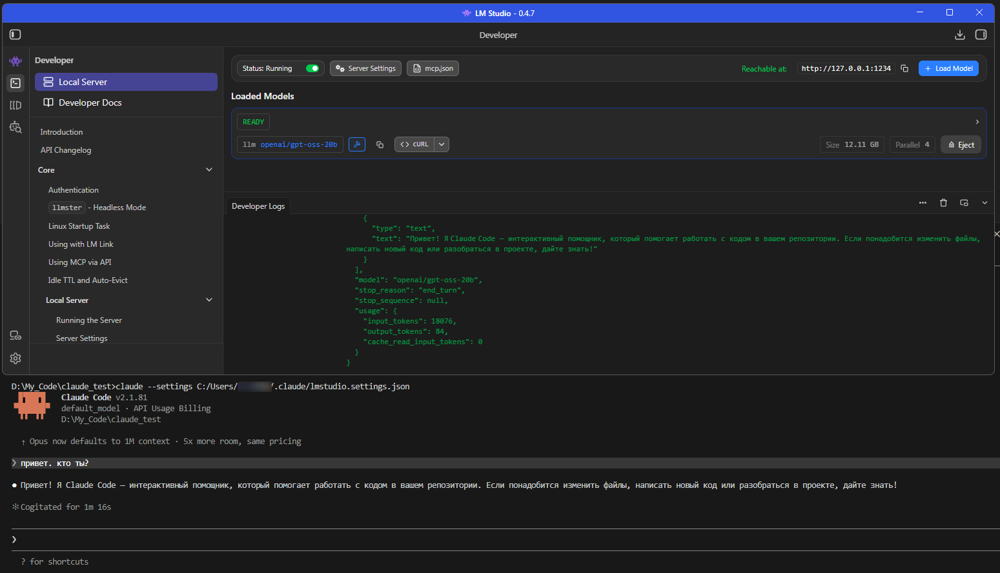

Не все модели одинаково хорошо справляются, поэтому если на выходе получаете ошибки, попробуйте поменять модель

Codex

Чтобы подключить локальную модель тут, нужно отредактировать фаил ~/.codex/config.toml

api_key = "lm-studio" # на самом деле не важно что тут, ключ у нас не задан
model = "nvidia/nemotron-3-nano-4b" # название модели
openai_base_url = "http://127.0.0.1:1234/v1" # адрес LM Studio

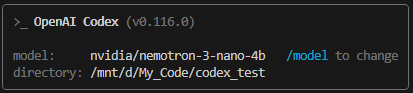

При подключении из WSL нужно пробрасывать порты, так как внутри WSL, codex не увидит наш windows localhost.

Проще на windows использовать другие инструменты для этого

OpenCode

Запускаем /connect в TUI, прокручиваем список до LM Studio — он уже есть в каталоге провайдеров.

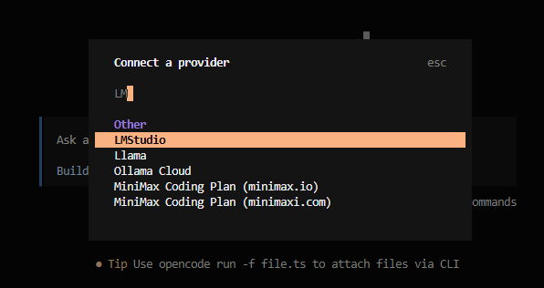

Однако по умолчанию там забиты всего несколько моделей

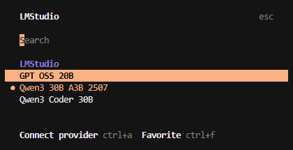

На практике что бы мы там не выбрали, работать оно всё равно будет с запущенной моделью

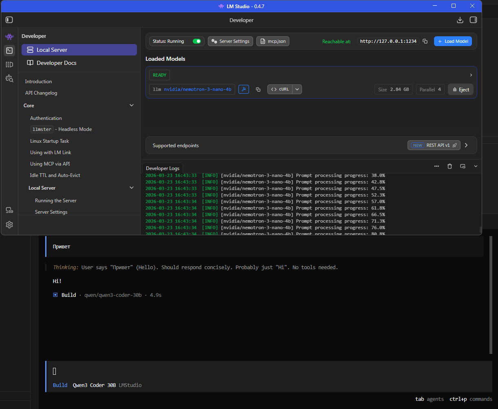

Как видим модель у нас загружена совсем другая, но он всё равно отвечает (причём на вопрос "что ты за модель?", будет отвечать согласно системным инструкциям opencode в соответствии с названием выбранной в нём модели)

Если же мы хотим сделать картину более ясной, то можно создать файл с настройками ~/.config/opencode/opencode.json

{
  "$schema": "https://opencode.ai/config.json",
  "provider": {
    "lmstudio": {
      "npm": "@ai-sdk/openai-compatible",
      "name": "LM Studio (local)",
      "options": {
        "baseURL": "http://127.0.0.1:1234/v1"
      },
      "models": {
        "nvidia/nemotron-3-nano-4b": {
          "name": "nvidia/nemotron-3-nano-4b (local)"
        }
      }
    }
  }
}

Тут мы можем явно прописать отображаемое название провайдера и моделей, указать адрес и порт. Перезагружаем opencode и проверяем.

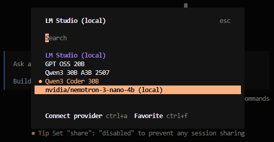

Настройка производительности

LM Studio позволяет гибко управлять распределением нагрузки между GPU и CPU, а также размером окна контекста для модели.

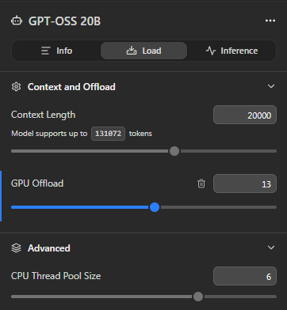

	GPU Offload — Определяет, сколько слоёв модели будет вычисляться на графическом процессоре. Чем больше слоёв на GPU, тем быстрее inference, но требуется больше видеопамяти. Если модель не помещается полностью на GPU, часть вычислений будет идти через CPU, что замедляет работу.
	Context Length — Максимальное количество токенов, которое модель может учитывать в одном запросе. Этот параметр задаёт “окно контекста” и напрямую влияет на объём текста, который модель может обработать за один раз. Диапозон зависит от конкретной модели
	
	Опции Conversation Overflow в разделе Inference params позволяют управлять переполнением контекста при длинных сессиях.

	
	
	Advanced → CPU Thread Pool Size

	Устанавливает количество потоков CPU, выделяемых для вычислений модели. Оптимизация этого параметра помогает ускорить работу при недостатке видеопамяти или при вычислении на CPU.

Советы:

	Для больших моделей комбинируйте GPU Offload с оптимизацией CPU Thread Pool Size.
	На Apple Silicon с MLX-моделями ручная настройка GPU Offload обычно не нужна, unified memory распределяет слои автоматически.
	Контекст выбирайте в зависимости от объёма текста и задач: больше токенов — более длинные сессии, но выше нагрузка на память.

---

## Шаг 3 (step_id=9819935, text)

Ollama

Под капотом LM Studio и Ollama работает один и тот же движок — llama.cpp, C/C++ реализация инференса, которая умеет эффективно использовать CPU, NVIDIA CUDA и Apple Metal. Разница не в движке, а в интерфейсе и философии: LM Studio — GUI-приложение, Ollama — CLI-инструмент без графики. Ollama проще интегрировать в скрипты, удобнее держать как фоновый сервис, и легче запускать на сервере или в Docker.

Установка

На macOS и Windows — скачиваем установщик с ollama.com. На macOS Ollama встаёт как системный сервис и запускается автоматически при старте. На Windows — аналогично через installer.

На Linux:

curl -fsSL https://ollama.com/install.sh | sh

Проверяем:

ollama --version

Скачать и запустить модель

На сайте ollama.com есть каталог моделей.

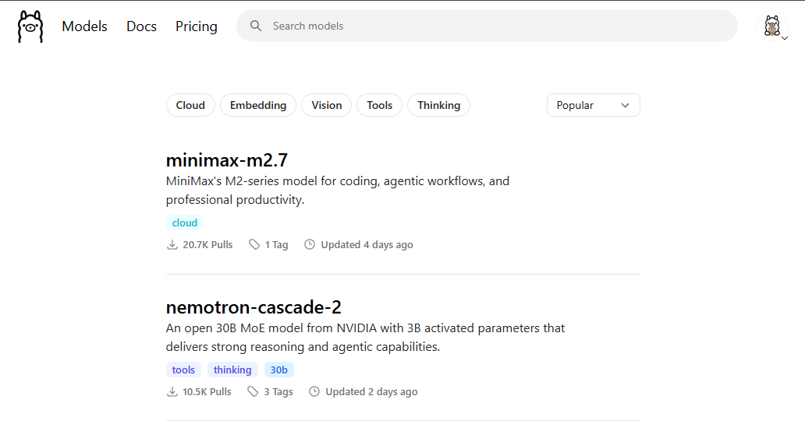

Выбрав интересующую вас модель, вы можете на её странице сразу скопировать команду её запуска.

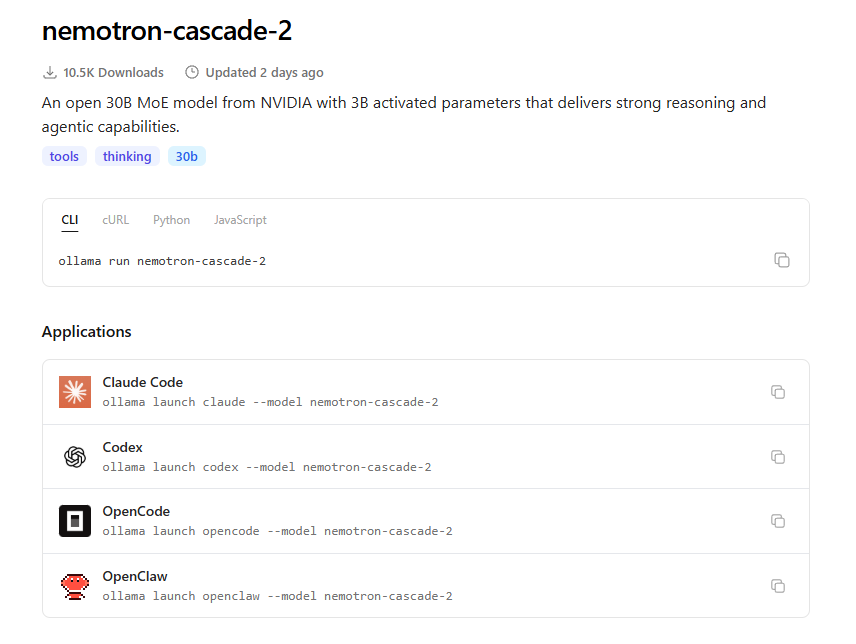

Команда run автоматически скачивает и сразу запускает модель. Если же запускать не нужно, можно просто скачать:

ollama pull nemotron-cascade-2

Ollama сам выберет подходящую квантизацию для вашего железа. Если хотите указать явно — на странице каждой модели есть список доступных вариантов.

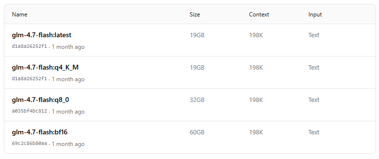

После запуска открывается интерактивный чат прямо в терминале, в котором можно проверить модель. Для выхода — /bye или Ctrl+D.

Посмотреть все скачанные модели:

ollama list

Интеграция с инструментами

Ollama автоматически запускает локальный сервер в фоне — он доступен на http://localhost:11434 с OpenAI-совместимым API. Если по какой-то причине сервер не запустился автоматически:

ollama serve

Подключение к Roo Code аналогично LM Studio из предыдущего шага, только указываем соответственно Ollama в поле провайдера. URL если не меняли он так же знает.

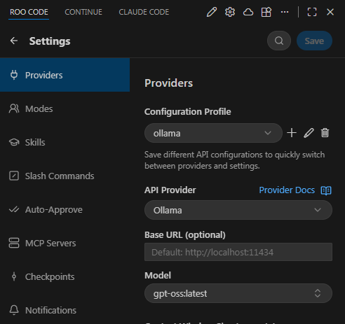

Так же Ollama поддерживает интеграцию с GitHub Copilot

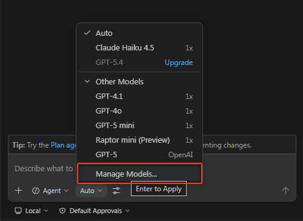

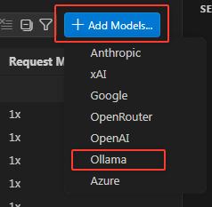

Для трёх CLI-агентов, которые мы разбирали в курсе, у Ollama есть нативные интеграции через команду ollama launch. Она автоматически настраивает нужные переменные окружения и запускает агент, указав ему смотреть на локальный Ollama-сервер.

Claude Code — Ollama поднимает Anthropic-совместимый API, и Claude Code подключается через родной Anthropic-протокол:

ollama launch claude
# или с конкретной моделью:
ollama launch claude --model qwen3.5

Codex — подключается через флаг --oss, который переключает его на OpenAI-совместимый API Ollama. По умолчанию использует модель gpt-oss:20b:

ollama launch codex
# или вручную:
codex --oss
codex --oss -m gpt-oss:120b

OpenCode — запускается аналогично:

ollama launch opencode

Все три агента требуют контекстного окна минимум 64k токенов — иначе они обрезают контекст на длинных задачах. Размер контекста можно менять в настройках в десктопном приложении

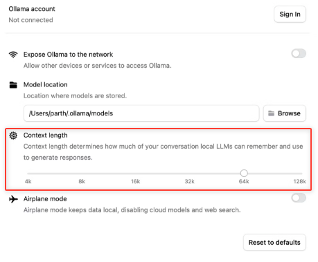

Либо задав переменную при запуске

OLLAMA_CONTEXT_LENGTH=64000 ollama serve

Помимо инструментов из курса, Ollama также интегрируется с агентами Droid, Goose и Pi — если интересно, подробности в разделе интеграций документации.

Когда Ollama, когда LM Studio

Оба инструмента решают одну задачу, выбор — вопрос удобства. LM Studio удобнее для первого знакомства с локальными моделями: каталог, визуальный выбор квантизации, встроенный чат. Ollama удобнее когда нужна автоматизация — можно написать скрипт, который запускает нужную модель, делает запрос и обрабатывает результат, без участия GUI. Также Ollama проще держать как постоянный фоновый сервис на рабочей машине: запустил один раз, модели доступны всегда.

Есть важный практический нюанс с памятью. LM Studio по умолчанию делает CPU offload — если модель не помещается в VRAM целиком, часть слоёв автоматически уходит в оперативную память и модель всё равно запускается, пусть и медленнее. Так 12-гигабайтная модель может работать на 8 ГБ VRAM — медленно, но работает. Ollama в этом плане строже: если модель не вписывается в доступную память, он просто отказывается её запускать. Теоретически CPU offload в Ollama настраивается через параметр OLLAMA_NUM_GPU и Modelfile, но на практике добиться стабильной работы получается не всегда. Если у вас ограниченная VRAM и нужно запускать модели на грани — LM Studio надёжнее.

На Apple Silicon LM Studio поддерживает MLX-модели, которые на M-чипах быстрее GGUF. Ollama пока работает только с GGUF через llama.cpp, MLX-поддержка в разработке. Если скорость генерации критична на Mac — LM Studio с MLX-моделями даст заметный выигрыш.

Итоги урока

Локальный запуск моделей решает задачу приватности радикально: данные не покидают машину. Ключевой формат для этого — GGUF, работающий на любом железе через llama.cpp; на Apple Silicon альтернативой служит MLX с заметно более высокой скоростью на M-чипах. Размер модели, которую реально запустить, определяется объёмом VRAM (на PC) или unified memory (на Mac): 8 ГБ достаточно для 7–8B моделей в Q4_K_M квантизации — вполне рабочий вариант для агентной разработки. LM Studio — лучший старт: встроенный каталог, визуальный выбор квантизации, сервер в один клик. Ollama работает на том же движке, но без GUI — удобнее для автоматизации и как постоянный фоновый сервис. Оба поднимают OpenAI-совместимый API на localhost, что позволяет подключить их к разным BYOM агентам.

---

## Шаг 4 (step_id=9823657, choice)

Чем open-weight модели отличаются от проприетарных?

**Тип:** choice (single)

**Варианты:**
-  open-weight модели всегда уступают по качеству проприетарным аналогам
-  open-weight модели работают только на локальном железе
-  open-weight модели не требуют лицензии для коммерческого использования
- [✓ правильный] веса open-weight моделей открыты и доступны для скачивания

**Статус Stepik:** `correct` (score 1.0)

**Мой reasoning:** _В теории прямо сказано: open-weight модели — это модели, веса которых открыты, то есть любой может скачать и запустить их самостоятельно. Остальные варианты либо неверны, либо не следуют из определения._

---

## Шаг 5 (step_id=9823651, choice)

Почему использование open-weight моделей через OpenRouter не решает проблему приватности?

**Тип:** choice (single)

**Варианты:**
-  open-weight модели на OpenRouter работают в режиме совместного доступа
-  OpenRouter логирует все запросы и передаёт их разработчикам моделей
-  OpenRouter требует привязки реального имени пользователя к аккаунту
- [✓ правильный] запросы всё равно уходят на серверы стороннего провайдера

**Статус Stepik:** `correct` (score 1.0)

**Мой reasoning:** _В теории прямо сказано: даже если модель open-weight, при использовании через OpenRouter запросы уходят на серверы провайдера и ваш код видит третья сторона. Локальный запуск решает это радикально — данные не покидают машину._

---

## Шаг 6 (step_id=9823655, choice)

Что такое квантизация модели?

**Тип:** choice (single)

**Варианты:**
-  процесс дообучения модели на специализированном наборе данных
-  конвертация модели из одного формата хранения в другой
-  разбиение модели на несколько частей для параллельного запуска
- [✓ правильный] сжатие весов модели до меньшей разрядности для экономии памяти

**Статус Stepik:** `correct` (score 1.0)

**Мой reasoning:** _В теории прямо сказано: квантизация сжимает числа параметров с 16 бит до 4-8 бит, уменьшая размер модели и требования к памяти в 2-4 раза с минимальной потерей качества._

---

## Шаг 7 (step_id=9823649, choice)

В чём принципиальное преимущество Apple Silicon при запуске локальных моделей?

**Тип:** choice (single)

**Варианты:**
-  чипы M-серии поддерживают эксклюзивный формат моделей MLX
-  нейронный движок Apple обрабатывает токены быстрее любого GPU
- [✓ правильный] GPU и CPU используют единый пул памяти, весь RAM доступен как VRAM
-  Apple Silicon работает с моделями без квантизации без потери скорости

**Статус Stepik:** `correct` (score 1.0)

**Мой reasoning:** _В теории прямо сказано: на Apple Silicon unified memory позволяет использовать весь RAM как VRAM, и Mac с 64 ГБ может запускать модели, которые не поместятся ни на одну потребительскую видеокарту. MLX и Neural Engine — следствия, а принципиальное преимущество именно в архитектуре памяти._

---

## Шаг 8 (step_id=9823654, choice)

Почему Q4_K_M считается стандартным выбором квантизации для локального запуска?

**Тип:** choice (single)

**Варианты:**
-  Q4_K_M — единственный формат, совместимый одновременно с GGUF и MLX
-  более высокие квантизации недоступны на потребительском железе
- [✓ правильный] даёт примерно вчетверо меньший размер при минимальной потере качества
-  это единственная квантизация, поддерживаемая всеми inference-движками

**Статус Stepik:** `correct` (score 1.0)

**Мой reasoning:** _В теории прямо сказано: Q4_K_M — золотой стандарт, потому что уменьшает размер модели примерно в 2-4 раза с минимальной потерей качества, модель влезает в VRAM и работает быстро._

---

## Шаг 9 (step_id=9823652, choice)

В чём ключевое отличие MLX от GGUF на Apple Silicon?

**Тип:** choice (single)

**Варианты:**
-  только MLX позволяет запускать модели размером выше 13B на Mac
-  MLX поддерживает квантизацию, недоступную в формате GGUF
- [✓ правильный] MLX оптимизирован под unified memory и Neural Engine чипов M-серии
-  модели в формате MLX занимают меньше места на диске чем GGUF

**Статус Stepik:** `correct` (score 1.0)

**Мой reasoning:** _В теории прямо сказано: MLX — формат Apple, использует unified memory и оптимизирован под Neural Engine чипов M-серии, что даёт выигрыш в скорости по сравнению с GGUF._

---

## Шаг 10 (step_id=9823653, choice)

Как LM Studio ведёт себя когда модель не помещается в VRAM целиком?

**Тип:** choice (single)

**Варианты:**
-  запускает модель только в режиме CPU без использования GPU
-  предлагает автоматически скачать меньшую версию модели
- [✓ правильный] автоматически выгружает часть слоёв в оперативную память
-  блокирует запуск и требует освободить память вручную

**Статус Stepik:** `correct` (score 1.0)

**Мой reasoning:** _В теории прямо сказано: LM Studio по умолчанию делает CPU offload — если модель не помещается в VRAM целиком, часть слоёв автоматически уходит в оперативную память. Ollama в отличие от LM Studio в такой ситуации отказывается запускать модель._

---

## Шаг 11 (step_id=9823656, choice)

Какие утверждения про ollama launch верны?

**Тип:** choice (multiple)

**Варианты:**
- [✓ правильный] автоматически настраивает переменные окружения для агента
-  требует предварительного скачивания модели через ollama pull
-  команда работает только для агентов, разработанных командой Ollama
- [✓ правильный] поддерживает Claude Code, Codex и OpenCode

**Статус Stepik:** `correct` (score 1.0)

**Мой reasoning:** _В теории прямо сказано, что ollama launch есть для трёх CLI-агентов курса (Claude Code, Codex, OpenCode) и что команда автоматически настраивает нужные переменные окружения. Про обязательный предварительный pull и про «только агентов Ollama» в тексте ничего нет._

---

## Шаг 12 (step_id=9823650, matching)

Сопоставь формат модели с его характеристикой.

**Тип:** matching

**Колонка А (вопросы):**
- GGUF
- MLX
- Q4_K_M
- safetensors

**Колонка Б (варианты, перемешаны):**
- оптимизирован для Apple Silicon, использует unified memory
- 4-битная квантизация, стандарт для потребительского железа
- исходный формат после обучения, не оптимизирован для инференса
- универсальный формат, работает на CPU, CUDA и Metal

**Правильные пары:**
- GGUF → универсальный формат, работает на CPU, CUDA и Metal
- MLX → оптимизирован для Apple Silicon, использует unified memory
- Q4_K_M → 4-битная квантизация, стандарт для потребительского железа
- safetensors → исходный формат после обучения, не оптимизирован для инференса

**Статус Stepik:** `correct` (score 1.0)

**Мой reasoning:** _GGUF — универсальный формат llama.cpp; MLX — формат Apple для Silicon с unified memory; Q4_K_M — золотой стандарт 4-битной квантизации; safetensors — сырой формат после обучения, требует конвертации._

---

## Шаг 13 (step_id=9823658, choice)

Для чего нужна команда ollama serve?

**Тип:** choice (single)

**Варианты:**
-  запускает интерактивный чат с выбранной моделью в терминале
-  загружает модель в память без запуска интерфейса взаимодействия
-  синхронизирует локальный каталог моделей с ollama.com
- [✓ правильный] вручную запускает API-сервер

**Статус Stepik:** `correct` (score 1.0)

**Мой reasoning:** _В теории сказано: Ollama автоматически запускает локальный сервер в фоне, но если он не запустился автоматически — используется команда ollama serve для ручного запуска API-сервера._

---
