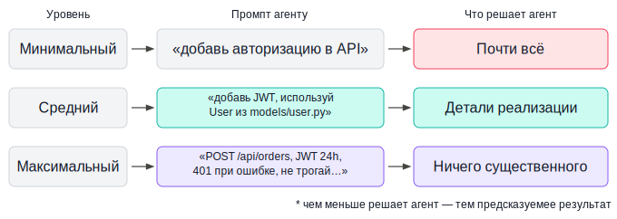
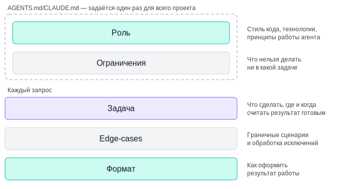
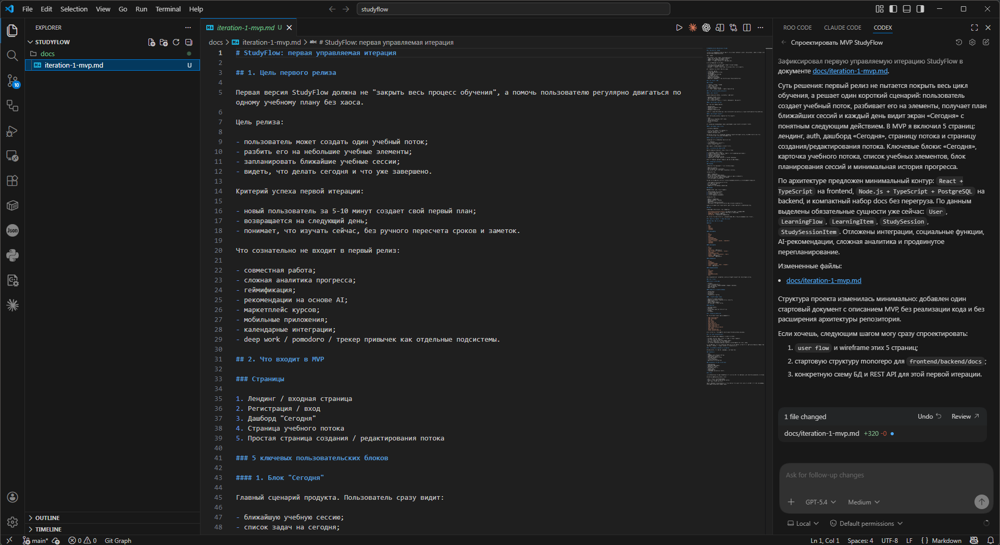
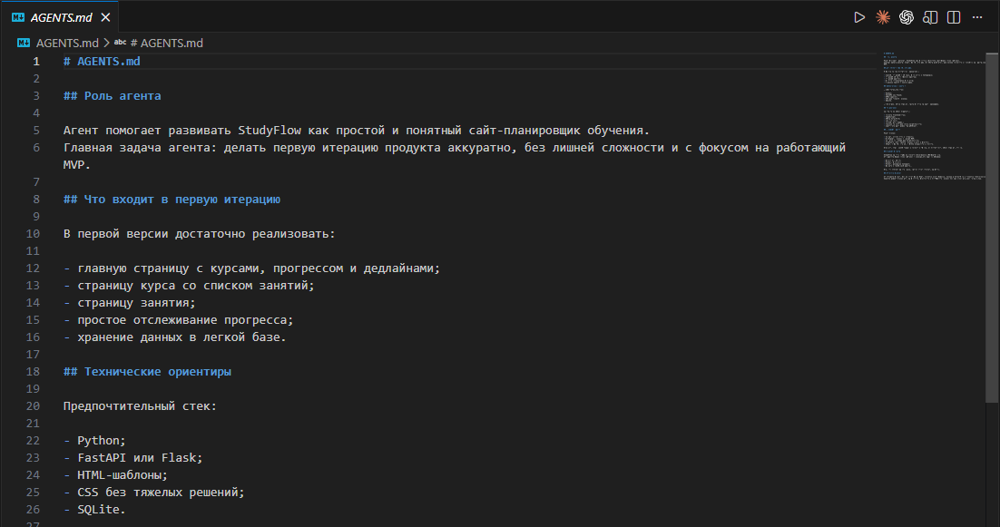

# Урок 1. Промпт-инжиниринг для агентов

_lesson_id: 2281940 · steps: 11 · ttc: 1397s_

---

## Шаг 1 (step_id=9782203, text)

Уровни детализации промпта и почему это важно для агентов

Работая с обычным чатом, мы получаем ответ и сразу видим — то или нет. Ответили что-то не так: уточняем в следующем сообщении. В агентном режиме петля обратной связи принципиально длиннее. Агент получает промпт, планирует задачу, последовательно выполняет действия: читает файлы, вносит изменения, запускает тесты. Между первым сообщением и моментом, когда мы снова смотрим на экран, проходит несколько минут реальной работы.

Важный нюанс: многие агенты умеют уточнять задачу перед стартом — у большинства теперь есть режим планирования, Cursor может задать вопросы прежде чем начать. Но даже с учётом этого детализация промпта критична. Во-первых, расплывчатая задача порождает расплывчатые уточняющие вопросы — агент спросит о том, что ему очевидно неясно, но промолчит про то, где у него есть «достаточно хорошая» догадка. Во-вторых, в длинных автономных сценариях — параллельные агенты, ночные задачи, subagents — возможности для диалога вообще нет. Хорошо сформулированный промпт работает одинаково надёжно в любом из этих случаев.

Есть и асимметрия затрат: написать подробный промпт занимает две-три минуты. Исправлять то, что агент реализовал не так — двадцать-тридцать, а иногда и больше, если он успел затронуть несколько файлов.

Три уровня детализации

Рассмотрим один и тот же запрос на трёх уровнях. Задача — добавить авторизацию в API.

Минимальный уровень

добавь авторизацию в API

При таком промпте агент сам решает: какой метод авторизации выбрать (JWT, сессии, API-ключи, OAuth), какие маршруты защищать, что возвращать при ошибке, где хранить секреты. Он примет разумные с его точки зрения решения — но с высокой вероятностью не те, что имели в виду мы. Результат придётся либо откатывать, либо переделывать.

Средний уровень

добавь JWT-авторизацию к API. Используй существующую модель User из models/user.py

Агент уже знает метод и где искать пользователей. Но пространство для самостоятельных решений всё ещё большое: срок жизни токена, поведение при его истечении, какие именно маршруты защищать, формат ошибок. Вероятность получить приемлемый результат выше, но правки после всё равно скорее всего понадобятся.

Максимальный уровень

Добавь JWT-авторизацию к эндпоинту POST /api/orders.
Используй модель User из models/user.py.
Срок жизни токена: 24 часа.
При невалидном токене возвращай 401 с телом {"error": "unauthorized"}.
Существующие импорты в routes/orders.py не трогай.

Агент знает что именно сделать, в каком месте, как обрабатывать ошибку и что оставить нетронутым. Пространство для неожиданных решений минимально. Результат будет предсказуемым — что и является целью.

Как выбрать нужный уровень

Уровень детализации зависит от двух вещей: насколько задача изолирована и насколько важно точное соответствие результата ожиданиям.

Для небольших самодостаточных задач — написать утилитарную функцию, создать юнит-тест для уже готового кода, переименовать переменную по всему файлу — среднего уровня достаточно. Для задач, которые затрагивают несколько файлов, меняют публичные интерфейсы или влияют на поведение в продакшн-сценариях, максимальный уровень окупается всегда.

Хороший признак того, что промпт достаточно детален: по нему можно написать тест, который однозначно проверит, выполнена ли задача. Если тест представить сложно — скорее всего, в задаче ещё есть неразрешённая неопределённость.

Область неопределённости

Полезно думать о промпте не как о тексте, а как о пространстве возможных интерпретаций. Каждое неуточнённое решение — это развилка, на которой агент делает выбор самостоятельно. Минимальный промпт оставляет десятки таких развилок. Максимальный — закрывает их явными ответами.

Это не значит, что каждый промпт нужно делать исчерпывающим. Оставлять агенту творческое пространство на уровне реализации — нормальная практика. Важно разграничить: какие решения мы делегируем, а какие оставляем за собой. Всё, что важно нам, — нужно прописать явно. Остальное агент вправе решать сам.

---

## Шаг 2 (step_id=9782347, text)

Структурированный промпт, управление вниманием и постоянный контекст

Детализация важна, но ещё важнее — управлять тем, как агент читает промпт. В агентном режиме промпт — это не просто текст, а инструкция с приоритетами. Структура помогает не только ничего не забыть, но и направляет внимание модели на критичные части задачи.

Хороший промпт состоит из разных блоков и дополняется техниками управления вниманием: явными приоритетами, декомпозицией и контролем шагов выполнения.

Роль

Роль задаёт не только стиль, но и критерии принятия решений. Усиление: добавляйте приоритеты прямо в роль.

Ты — опытный backend-разработчик (Python, FastAPI).
Приоритеты: корректность > безопасность > читаемость > производительность.

Так агент понимает, чем жертвовать в спорных ситуациях.

Задача

То что задача должна быть конкретной и проверяемой мы обсудили на прошлом шаге, но её можно ещё усилить: добавляйте критерий завершения прямо в формулировку.

Добавь JWT-авторизацию к POST /api/orders в routes/orders.py.
Готово, если:
- эндпоинт возвращает 200 при валидном токене
- возвращает 401/403 в описанных случаях
- существующие тесты проходят без изменений

Это превращает задачу в проверяемый контракт.

Ограничения

Ограничения — это способ контролировать область изменений. Усиление: разделяйте ограничения на жёсткие и мягкие.

Жёсткие ограничения:
- НЕ МЕНЯЙ models/order.py
- НЕ ДОБАВЛЯЙ новые зависимости

Мягкие:
- по возможности не меняй структуру файлов

Агент лучше соблюдает ограничения, если понимает их приоритет.

Edge-cases

Edge-cases — это управление поведением в неопределённости. Усиление: добавляйте не только случаи, но и явные правила обработки.

Правило: всегда возвращай JSON-ответ.

Edge-cases:
- токен истёк → 401 {"error": "token_expired"}
- токен отсутствует → 401 {"error": "unauthorized"}
- пользователь не найден → 403

Формат

Формат — это контроль результата. Усиление: разбивайте ответ на шаги.

Формат ответа:
1. Изменённые файлы
2. Код
3. Краткое объяснение решений (только специфичное для проекта)

Декомпозиция

Одна из ключевых техник — разбивать задачу на шаги внутри промпта. Это снижает вероятность ошибок.

Выполни по шагам:
1. Найди текущую реализацию эндпоинта
2. Добавь middleware для JWT
3. Обнови обработку ошибок
4. Проверь, что логика заказов не изменилась

Агент начинает мыслить как планировщик, а не как генератор кода.

Самопроверка

Добавление шага проверки резко повышает качество результата.

Перед завершением:
- проверь, что соблюдены все ограничения
- проверь edge-cases
- убедись, что код компилируется

Промпт в сборе

Секции разделены ---

Роль:
Ты — backend-разработчик (Python, FastAPI).
Приоритеты: корректность > безопасность > читаемость.

---

Задача:
Добавь JWT-авторизацию к POST /api/orders в routes/orders.py.

Готово, если:
- корректные ответы 200/401/403
- тесты проходят

---

Ограничения:
- НЕ МЕНЯЙ models/order.py
- НЕ ДОБАВЛЯЙ зависимости

---

Edge-cases:
- token expired → 401
- no token → 401
- user not found → 403

---

Шаги:
1. Найти эндпоинт
2. Добавить JWT
3. Обновить ошибки

---

Формат:
1. Файлы
2. Код
3. Объяснение

---

Самопроверка:
- ограничения соблюдены
- edge-cases покрыты

Форматирование промпта

Несколько техник, которые особенно хорошо работают с агентами:

	Разделители (---) — делают структуру жёсткой
	XML-теги — изолируют данные
	КАПС — для одного критичного ограничения
	Псевдокод — для логики ветвления
	Нумерованные шаги — для планирования выполнения

Постоянный контекст: файлы инструкций

Если часть промпта повторяется от задачи к задаче — её лучше вынести в постоянный контекст.

Claude Code — CLAUDE.md

OpenAI Codex — AGENTS.md

Cursor — .cursor/rules

Windsurf — .windsurfrules

Дополнение: в этих файлах полезно хранить не только стек и стиль, но и инварианты проекта — то, что нельзя нарушать ни при каких задачах.

## Invariants
- API всегда возвращает JSON
- Ошибки имеют единый формат
- БД-миграции создаются отдельно, не автоматически

Это превращает агента из универсального помощника в участника конкретного проекта.

---

## Шаг 3 (step_id=9782346, text)

Типичные ошибки в агентных промптах и как их исправлять

Даже при хорошей структуре промпта ошибки остаются. В агентном режиме они усиливаются: агент не уточняет, а действует. Ниже — ключевые ошибки и способы их исправления.

Размытая задача без критерия готовности

Проблема: нет условия завершения → агент не знает, когда остановиться.

улучши обработку ошибок

Исправление: добавить проверяемый результат.

Добавь обработку ошибок:
- 422 → список ошибок
- 401 → {"error": "unauthorized"}
- 500 → лог + {"error": "internal error"}

Готово, если все кейсы обрабатываются и тесты проходят.

Правило: если нельзя написать тест — задача сформулирована плохо.

Отсутствие edge-cases

Проблема: агент сам принимает решения в неопределённых ситуациях.

Исправление: явно задать поведение.

Если users == [] → вернуть []
Если users == None → ValueError

Усиление: добавляйте правило по умолчанию.

Если поведение не описано — выбрасывай исключение

Противоречивые требования

Проблема: агент выбирает одно требование и игнорирует другое.

REST API + единый endpoint /api/action

Исправление: устранять конфликт или задавать приоритет.

Приоритет: следовать REST, даже если это требует изменения структуры endpoint'ов

Слишком большая задача

Проблема: агент теряет точность при больших задачах.

Реализуй систему аутентификации, авторизации и логирования

Исправление: декомпозиция.

Шаг 1: JWT авторизация
Шаг 2: роли пользователей
Шаг 3: логирование

Правило: один промпт — одна логическая задача.

Отсутствие контроля выполнения

Проблема: агент сделал что-то, но не проверил результат.

Исправление: добавлять самопроверку.

Перед завершением:
- проверь ограничения
- проверь edge-cases
- убедись, что код работает

Скрытые допущения

Проблема: часть требований остаётся «в голове», а не в промпте.

Исправление: выносить допущения явно.

Считать, что:
- база уже подключена
- модель User существует
- миграции не требуются

Итоги урока

Агент не догадывается — он исполняет. Качество результата напрямую зависит от того, насколько явно заданы:

	критерий готовности
	границы задачи
	поведение в edge-cases
	приоритеты и ограничения
	шаги выполнения и самопроверка

Хороший промпт — это не описание задачи, а инструкция с проверкой. Чем меньше в нём неявного, тем предсказуемее результат.

---

## Шаг 4 (step_id=9873432, text)

Практика "StudyFlow"

Начиная с этого модуля, мы будем не только разбирать отдельные приёмы, но и постепенно собирать свой сквозной учебный проект. Этот проект называется StudyFlow. Мы создаём его с нуля: сначала как идею продукта, потом как план MVP, затем как архитектурный набросок, и только после этого как реальный сайт с фронтендом и бэкендом.

Идея проекта такая: StudyFlow — это сайт-планировщик обучения. Пользователь заходит на сайт, видит свои курсы, текущий прогресс, ближайшие дедлайны и кнопку перехода к следующему занятию. У сайта будет frontend для интерфейса и backend для хранения и выдачи данных. Во втором уроке мы начнём это оформлять уже как проект. А здесь нам важно показать, как идея уровней детализации промпта работает ещё до появления кода — на уровне постановки продуктовой задачи.

Важно: мы выбрали StudyFlow просто как один внятный сквозной пример. Если вам по ходу курса интереснее делать свой проект, вы можете применять те же подходы к своей идее. Если своей идеи пока нет, можно спокойно идти по готовому маршруту и повторять StudyFlow шаг за шагом.

Формирование оформленной идеи

Минимальный уровень:

Придумай сайт StudyFlow

Средний уровень:

Опиши первую версию сайта StudyFlow для планирования обучения.
Нужно учесть курсы, прогресс и ближайшие дедлайны.
Предложи, какие страницы и пользовательские блоки войдут в первый релиз.

Продвинутый уровень:

Спроектируй первую итерацию сайта StudyFlow с нуля.
Это учебный веб-продукт для планирования обучения.
Нужно предложить:
- цель первого релиза;
- какие страницы и 3-5 ключевых пользовательских блоков войдут в MVP;
- минимальную архитектуру: frontend, backend, docs;
- какие сущности и данные нужны уже сейчас, а что можно отложить.
Не пытайся проектировать весь продукт целиком.
Сфокусируйся на первой управляемой итерации.

Этот промпт лишь пример, но суть в том, что мы описываем максимально чётко и подробно идею проекта, все наши пожелания и ограничения.

В случае Codex, он сразу сам создал нам фаил docs\iteration-1-mvp.md с описанием первой итерации проекта. В разных агентах поведение может отличаться и возможно стоит отдельно указать агенту чтобы он этот план сохранил. После генерации этого плана, отдельные его части можно отредактировать в диалоге с агентом, доведя его до желаемого вида, которым вы останетесь довольны. 

Логика ровно та же: даже до появления кода важно явно зафиксировать границы, цель первой итерации и ожидаемый результат. Иначе агент начнёт достраивать продукт за нас слишком широко и слишком рано.

Создание проектных правил

В первом уроке речь ещё не про редактирование файлов, а про грамотную постановку проектной задачи до старта реализации. Создаём AGENTS.md или аналог под ваш инструмент с базовыми описаниями проекта, роли агента и ограничениями.

---

## Шаг 5 (step_id=9834826, choice)

Что происходит при минимальной детализации промпта?

**Тип:** choice (single)

**Варианты:**
-  Агент выполняет строго по шаблону
-  Агент отказывается выполнять задачу
-  Агент ждёт дополнительных уточнений перед стартом
- [✓ правильный] Агент сам принимает ключевые решения

**Статус Stepik:** `correct` (score 1.0)

**Мой reasoning:** _В теории прямо сказано: при минимальном промпте агент сам решает метод авторизации, какие маршруты защищать, формат ошибок и т.д. — то есть принимает ключевые решения самостоятельно, часто не те, что имел в виду пользователь._

---

## Шаг 6 (step_id=9834830, choice)

Зачем добавлять критерий завершения?

**Тип:** choice (single)

**Варианты:**
- [✓ правильный] Сделать результат проверяемым
-  Чтобы агент быстрее закончил ответ
-  Уменьшить код
-  Снизить нагрузку

**Статус Stepik:** `correct` (score 1.0)

**Мой reasoning:** _В теории прямо сказано: критерий завершения превращает задачу в проверяемый контракт — если нельзя написать тест, задача сформулирована плохо._

---

## Шаг 7 (step_id=9834832, choice)

Что даёт декомпозиция задачи?

**Тип:** choice (single)

**Варианты:**
-  Убирает ограничения
-  Делает код длиннее
-  Делает план подробнее, но сложнее
- [✓ правильный] Снижает вероятность ошибок

**Статус Stepik:** `correct` (score 1.0)

**Мой reasoning:** _В теории прямо сказано: «Одна из ключевых техник — разбивать задачу на шаги внутри промпта. Это снижает вероятность ошибок.» Декомпозиция заставляет агента мыслить как планировщик._

---

## Шаг 8 (step_id=9834831, choice)

Почему важна самопроверка?

**Тип:** choice (single)

**Варианты:**
- [✓ правильный] Повышает качество результата
-  Делает код короче
-  Позволяет быстрее перейти к следующему шагу
-  Уменьшает токены

**Статус Stepik:** `correct` (score 1.0)

**Мой reasoning:** _В теории прямо сказано: «Добавление шага проверки резко повышает качество результата». Самопроверка заставляет агента сверить ограничения, edge-cases и работоспособность кода до завершения._

---

## Шаг 9 (step_id=9834828, choice)

Почему важны ограничения?

**Тип:** choice (single)

**Варианты:**
-  Ускоряют работу агента, не давая ему долго её решать
-  Уменьшают файлы
- [✓ правильный] Контролируют область изменений
-  Увеличивают креативность

**Статус Stepik:** `correct` (score 1.0)

**Мой reasoning:** _В теории прямо сказано: «Ограничения — это способ контролировать область изменений», с разделением на жёсткие и мягкие для управления приоритетом._

---

## Шаг 10 (step_id=9834829, choice)

Что входит в структурированный промпт?

**Тип:** choice (multiple)

**Варианты:**
- [✓ правильный] Ограничения
- [✓ правильный] Роль
-  История чата
- [✓ правильный] Задача

**Статус Stepik:** `correct` (score 1.0)

**Мой reasoning:** _В уроке структурированный промпт описан через блоки: Роль, Задача, Ограничения, Edge-cases, Формат, Декомпозиция, Самопроверка. История чата не упоминается среди компонентов структурированного промпта._

---

## Шаг 11 (step_id=9834827, matching)

сопоставь элемент промпта и его функцию

**Тип:** matching

**Колонка А (вопросы):**
- Роль
- Задача
- Ограничения
- Edge-cases

**Колонка Б (варианты, перемешаны):**
- формулировка результата
- контроль области изменений
- поведение в исключениях
- критерии принятия решений

**Правильные пары:**
- Роль → критерии принятия решений
- Задача → формулировка результата
- Ограничения → контроль области изменений
- Edge-cases → поведение в исключениях

**Статус Stepik:** `correct` (score 1.0)

**Мой reasoning:** _По теории: роль задаёт критерии принятия решений, задача формулирует проверяемый результат, ограничения контролируют область изменений, edge-cases описывают поведение в исключительных ситуациях._

---
