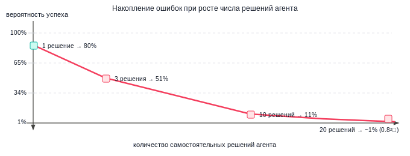
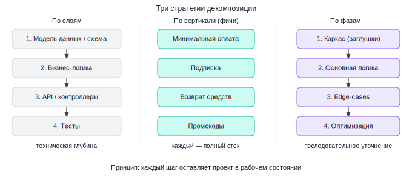
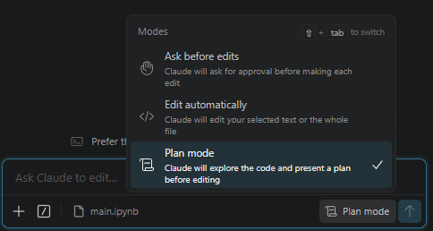
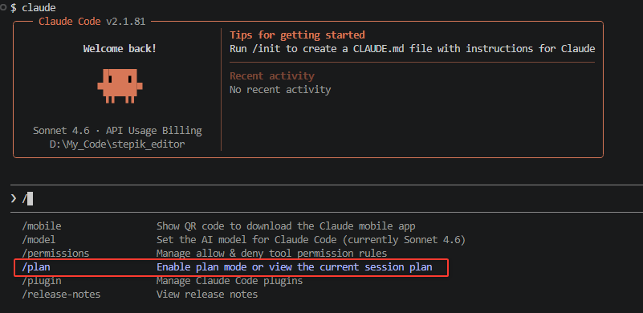
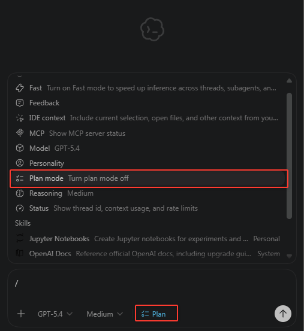
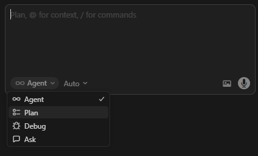
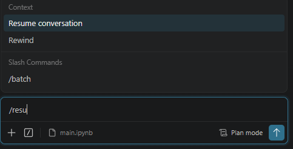
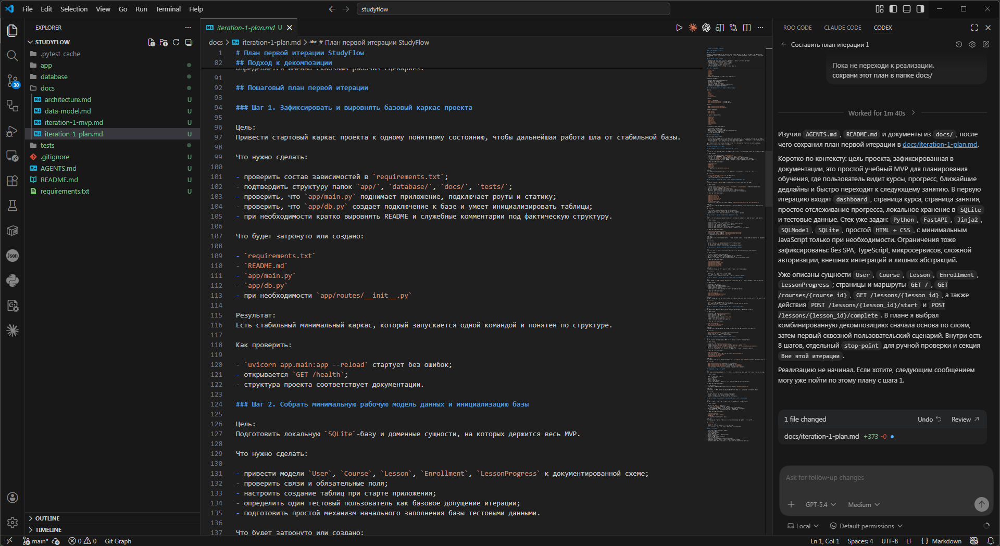

# Урок 3. Декомпозиция больших задач

_lesson_id: 2289222 · steps: 15 · ttc: 1153s_

---

## Шаг 1 (step_id=9817259, text)

Почему большие задачи ломаются

Когда разработчик работает над большой задачей самостоятельно, он делает десятки небольших решений: как назвать метод, куда вынести логику, как обработать граничный случай. Если где-то ошибается — замечает сразу и корректирует. Агент тоже принимает эти решения, но не корректирует их на ходу: каждое следующее решение строится на предыдущих, и ошибки накапливаются.

Если допустить, что агент принимает каждое отдельное решение правильно в 80% случаев — это звучит приемлемо — то при двадцати самостоятельных решениях вероятность того, что все они окажутся верными, составляет 0,8²⁰ — это около 1%. Не потому что агент плохой, а потому что накопление работает именно так.

На практике это выражается в нескольких типичных сценариях. Агент выбирает архитектурный паттерн в начале задачи — например, строит авторизацию через middleware — и последующие десять файлов пишутся с расчётом на этот выбор. Мы хотели что-то другое, но узнаём об этом только в конце, когда уже нужно переписывать. Или агент «помогает» и рефакторит соседние файлы, которые мы не трогали, — теперь diff непонятно большой и его сложно ревьюить. Или задача такая длинная, что агент начинает «забывать» инструкции из начала сессии по мере роста контекста.

Где проходит граница

Практический критерий: если задачу можно описать в одном предложении, формулирующем точный ожидаемый diff — агент справится с ней целиком. «Добавь валидацию email в форму регистрации», «переименуй переменную usr в user по всему проекту», «напиши юнит-тест для функции calculate_discount» — всё это хорошо укладывается в один прогон.

Если задачу нельзя сформулировать так лаконично, или если результат затрагивает больше трёх файлов — стоит декомпозировать. Не потому что агент не справится технически, а потому что это делает результат предсказуемым, проверяемым и восстанавливаемым при ошибке.

Что даёт декомпозиция кроме надёжности

	Маленькие задачи проще ревьюить: diff на пятнадцать строк понятен с первого взгляда, diff на двести — требует погружения.
	Каждый завершённый шаг — это точка восстановления: если что-то пошло не так на четвёртом шаге, мы откатываемся к третьему, а не к началу.
	Короткие задачи оставляют меньше места для накопленных ошибок и дают нам возможность скорректировать курс между шагами.
	Есть и менее очевидный эффект: небольшие конкретные задачи существенно повышают качество кода агента. Агент с чётко ограниченным скоупом думает о деталях реализации, а не о том, как держать в голове всю фичу целиком.

---

## Шаг 2 (step_id=9851978, text)

Стратегии декомпозиции

Декомпозиция — это не просто «разбить на части». Важно, чтобы каждая часть была самодостаточной: её можно закоммитить, запустить тесты и получить рабочее состояние проекта. Это даёт точки отката и делает прогресс видимым. Есть три основных способа нарезать задачу.

По слоям

Движемся по техническим слоям архитектуры сверху вниз (или снизу вверх): сначала модель данных и миграции, затем бизнес-логика в сервисах, затем API-слой, затем тесты. Каждый шаг строится на предыдущем и не затрагивает следующий.

Этот подход хорошо работает, когда у задачи есть чёткие технические зависимости: нельзя написать сервис до того, как определена схема данных, нельзя написать тесты до того, как есть что тестировать. Агент работает в ограниченном и понятном скоупе на каждом шаге.

Разбивка задачи «добавить модуль оплаты» по слоям:

Шаг 1. Создай миграцию для таблицы payments:
       поля id, user_id, amount, currency, status, created_at.
       Используй Alembic. Таблицу orders не трогай.

Шаг 2. Напиши модель Payment в models/payment.py
       и репозиторий PaymentRepository в repositories/payment.py
       с методами create, get_by_id, list_by_user.

Шаг 3. Напиши сервис PaymentService в services/payment.py
       с методом charge(user_id, amount, currency).
       Используй PaymentRepository. Бизнес-логику провайдера не добавляй — 
       это следующий шаг.

Шаг 4. Добавь эндпоинты POST /api/payments и GET /api/payments
       в routes/payments.py. Используй существующий auth middleware.

По вертикали (фичи)

Режем задачу не по техническим слоям, а по функциональным кускам — каждый из которых проходит через все слои. Вместо «сначала все модели, потом все сервисы» — «сначала минимальная оплата от начала до конца, потом подписки, потом возвраты».

Это подход из agile-разработки: вертикальный срез функциональности. Его преимущество в том, что после первого же шага у нас есть что-то работающее и демонстрируемое. Особенно хорошо работает для продуктовых задач с несколькими независимыми фичами.

Шаг 1. Реализуй минимальную разовую оплату:
       POST /api/payments принимает amount и card_token,
       создаёт запись в БД, возвращает payment_id.
       Интеграция с провайдером — заглушка, просто логируй.

Шаг 2. Добавь подписки: POST /api/subscriptions
       создаёт повторяющийся платёж раз в месяц.
       Используй существующую логику из шага 1.

Шаг 3. Добавь возвраты: POST /api/payments/{id}/refund
       меняет статус платежа на refunded.
       Добавь проверку: возврат возможен только в течение 30 дней.

По фазам

Сначала создаём работающий каркас с заглушками, потом итерационно наполняем деталями. Первый шаг — «сделай так, чтобы всё компилировалось и тесты не падали, даже если логика пустая». Второй — «заполни основную логику». Третий — «добавь обработку edge-cases». Четвёртый — «оптимизируй».

Этот подход хорош для задач, где требования к деталям могут проясниться только после того, как виден каркас. Мы видим структуру раньше, чем погружаемся в детали, и можем скорректировать направление.

Шаг 1. Создай заглушки для всех эндпоинтов модуля оплаты:
       POST /api/payments → всегда возвращает {"status": "ok"}
       GET /api/payments → возвращает пустой массив
       Все тесты должны проходить.

Шаг 2. Реализуй логику POST /api/payments:
       валидация, запись в БД, возврат реального payment_id.

Шаг 3. Добавь обработку ошибок: недостаточно средств → 402,
       невалидная карта → 422, внутренняя ошибка → 500.

Шаг 4. Добавь индекс на payments.user_id,
       кеширование статуса в Redis на 60 секунд.

Как выбрать стратегию

На практике стратегии часто комбинируют: берём вертикальный срез как единицу работы, а внутри каждого среза двигаемся по слоям. Главный критерий выбора — не теория, а вопрос: «могу я после этого шага закоммитить и показать результат?» Если да — разбивка правильная.

Задачи с чёткими техническими зависимостями (нельзя сделать A без B) — декомпозируем по слоям. Задачи с несколькими независимыми функциями — по вертикали. Задачи с туманными требованиями — по фазам, начиная с каркаса.

---

## Шаг 3 (step_id=9851980, text)

Планирование как отдельный шаг

Декомпозиция, которую мы делаем сами — это один подход. Но есть и другой: попросить агента составить план до того, как он начнёт писать код, и согласовать этот план с нами. Для длинных задач это убирает главный источник потерь — агент обнаруживает архитектурные неопределённости и задаёт вопросы на стадии исследования, а не в середине реализации.

Plan Mode

В Claude Code — это режим работы, в котором агент сначала исследует кодовую базу в режиме планирования и формулирует план, а не сразу переходит к правкам. Этот режим предназначен для безопасного анализа: агент читает проект, уточняет требования и предлагает план, который мы можем проверить до начала изменений.

Активировать Plan Mode можно несколькими способами. В режиме расширения для VS Code — нажать Shift+Tab и переключить режим на  plan mode.

Для CLI версии можно запустить Claude Code с флагом --permission-mode plan. Или уже находясь в интерактивном режиме командой /plan

В Codex логика та же: сначала можно вынести задачу в отдельный этап планирования, согласовать шаги, а уже потом переходить к изменениям. Это особенно полезно, когда задача затрагивает несколько частей проекта или требует исследования до первого diff.

В Cursor тоже есть отдельный режим планирования, поэтому сама практика уже стала общей для современных инструментов, а не привязана к одному продукту.

Цикл Explore → Plan → Execute

Когда агент сформировал план, мы не принимаем его автоматически, а сначала проверяем: нет ли лишних файлов, спорных архитектурных решений или слишком широкого скоупа. Смысл Plan Mode именно в этом промежуточном слое контроля между исследованием и правками.

Практическое правило простое: если задача многошаговая, затрагивает несколько частей проекта, требует исследования кодовой базы или обсуждения компромиссов, сначала полезно пройти цикл Explore → Plan → Execute. Для Claude Code, Codex и Cursor это уже нормальный рабочий сценарий, а не редкое исключение.

Как работает цикл на практике:

# 1. Входим в Plan Mode и описываем задачу

Хочу добавить систему уведомлений: пользователь получает email
когда его заказ меняет статус. Изучи текущую структуру заказов
и email-инфраструктуру, задай вопросы если нужно, потом составь план.

# 2. Агент исследует проект, задаёт уточняющие вопросы:
# - Использовать существующий email-сервис или новый?
# - Какие статусы триггерят уведомление?
# - Нужны ли шаблоны или достаточно plain text?

# 3. Мы отвечаем, агент формирует план

# 4. Проверяем план, правим если нужно

# 5. Одобряем — агент переходит к реализации

Вопросы, которые агент задаёт в Plan Mode, — ценный сигнал. Каждый вопрос — это развилка, на которой при обычном запуске он принял бы решение самостоятельно. Ответив на них заранее, мы убираем основные источники неожиданностей в результате.

В агентах, где мы выносим задачу в отдельный этап планирования, лучше просить не просто «составить план», а перечислить шаги, затрагиваемые файлы и проверки после каждого этапа. Тогда план сразу получается пригодным для исполнения, а не остаётся общими рассуждениями.

Планирование без Plan Mode

Plan Mode — удобный инструмент, но не единственный способ добавить планирование в процесс. Если у инструмента нет отдельного режима планирования, похожего поведения можно добиться обычным промптом:

Изучи текущую реализацию авторизации в проекте.
Не пиши код пока — сначала составь пошаговый план изменений.
Укажи, какие файлы затронешь и что именно изменишь в каждом.
Жду плана перед тем как продолжать.

Ключевые части: явный запрет писать код («не пиши код пока»), просьба перечислить конкретные файлы и изменения, явная пауза («жду плана»). Это не так формализовано как Plan Mode, но работает в любом инструменте.

Другой вариант — сохранить согласованный план в файл репозитория перед реализацией. Это особенно полезно для многошаговых задач: если сессия прервётся, план останется рядом с кодом и следующая сессия сможет опереться на него, а не восстанавливать контекст по памяти.

---

## Шаг 4 (step_id=9851979, text)

Контроль прогресса в длинных задачах

Хороший план и правильная декомпозиция решают проблему «что делать». Остаётся вопрос «как не потерять прогресс» в длинных сессиях, которые могут растянуться на несколько часов или прерваться. Это особенно важно в работе с несколькими агентами, запущенными параллельно.

Коммиты как точки восстановления

Самая простая и эффективная практика — коммитить после каждого завершённого шага декомпозиции. Не в конце всей задачи, а именно после каждого шага. Тогда при проблеме на шаге N мы откатываемся к коммиту шага N-1, а не к началу всей задачи.

Можно явно попросить агента делать это:

После того как реализуешь каждый пункт плана и убедишься,
что тесты проходят — делай коммит с описанием что сделано.

В Claude Code это можно зафиксировать в CLAUDE.md, а в Codex — в AGENTS.md как постоянное правило, чтобы не повторять его в каждом промпте.

Возобновление прерванной задачи

Длинные задачи прерываются — сессия закрылась, контекст вырос до предела, нужно переключиться на что-то другое. При возобновлении важно не просто открыть новую сессию и написать «продолжай» — у агента нет памяти о предыдущей работе.

Хорошо работает catchup-запрос: короткий промпт, который восстанавливает контекст без лишней истории.

Мы работаем над добавлением модуля уведомлений.
Прочитай PLAN.md чтобы понять план.
Затем посмотри git log --oneline -10 — там видно, что уже сделано.
Продолжи с шага, который ещё не закоммичен.

В Claude Code для этого есть запуск с флагом --resume, он быстро поднимает последнюю сессию. Это лучше, чем писать «продолжай» в новой пустой сессии: инструмент действительно восстанавливает предыдущий контекст. В расширении для VS Code тоже есть такая команда.

Параллельная работа через git worktrees

Когда задача хорошо декомпозирована на независимые части — их можно выполнять параллельно в нескольких агентных сессиях. Проблема в том, что два агента не могут работать в одной рабочей директории: они перезапишут изменения друг друга.

Git worktrees решают эту проблему. Worktree — это отдельная рабочая директория, привязанная к тому же git-репозиторию, но на своей ветке. Каждый агент получает свою изолированную копию файлов, работает независимо, а в конце мы мёрджим ветки как обычно.

В Claude Code создать worktree и сразу запустить в нём сессию можно одной командой:

# Первый агент — API для уведомлений
claude --worktree feature-notifications-api

# Второй агент — email-шаблоны (в другом терминале)
claude --worktree feature-notifications-email

# Третий агент — тесты (в третьем терминале)
claude --worktree feature-notifications-tests

Флаг --worktree создаёт изолированную рабочую копию внутри .claude/worktrees/ и запускает там сессию. Если изменений нет, такой worktree может быть удалён автоматически; если изменения или коммиты есть, инструмент предлагает сохранить его или убрать.

В Codex к той же схеме удобно подойти через обычные git worktrees: мы сами создаём отдельные рабочие директории, а затем запускаем агента в каждой из них.

# Первый агент — API для уведомлений
git worktree add ..\\notifications-api -b feature-notifications-api
cd ..\\notifications-api
codex

# Второй агент — email-шаблоны
git worktree add ..\\notifications-email -b feature-notifications-email
cd ..\\notifications-email
codex

Подход тот же самый: у каждого агента своя изолированная рабочая область и свой diff. Разница только в том, что в Claude Code эта схема упакована в отдельный флаг, а в Codex мы чаще собираем её из обычных git-команд и запуска агента в нужной директории.

Ключевое условие для параллельной работы — независимость задач. Если агент B должен использовать код, который пишет агент A, они не могут работать одновременно. Перед параллельным запуском стоит явно проверить: нет ли между задачами зависимостей по импортам или по данным.

Вывод для практики простой: если хотим параллелить работу агентов, нужно сначала декомпозировать задачу на действительно независимые куски, а затем дать каждому агенту отдельную рабочую область. Инструменты могут отличаться в деталях, но инженерный принцип везде один и тот же.

Итоги урока

Большие задачи ломаются не потому что агент плохо работает, а потому что ошибки накапливаются мультипликативно: двадцать решений с 80% точностью каждое дают около 1% вероятности верного итогового результата. Декомпозиция — это способ сократить количество решений за один прогон до предсказуемого минимума.

Три стратегии нарезки — по слоям, по вертикальным срезам и по фазам — покрывают большинство реальных задач. Их объединяет одно требование: каждый шаг должен оставлять проект в рабочем и коммитабельном состоянии. Отдельный этап планирования, коммиты после каждого шага, короткие catchup-промпты при возобновлении и изолированные worktrees для параллельной работы делают длинные задачи заметно управляемее.

---

## Шаг 5 (step_id=9873535, text)

Практика "StudyFlow"

В этом шаге ваша задача — потренироваться в декомпозиции большой задачи. У вас есть только идея проекта и набор стартовых документов. Нужно превратить эту абстрактную концепцию в пошаговый план, по которому агент сможет начать реализацию без лишних догадок и резкого расширения задачи.

Практическая цель — написать агенту такой промпт, который сначала соберёт контекст по проекту, а потом предложит хороший план первой итерации.

В этом промпте нужно попросить агента:

	сначала прочитать локальные правила проекта, README, заметки по MVP, архитектуре, модели данных и другие документы, если они есть;
	кратко перечислить, что уже определено: цель проекта, ограничения первой итерации, стек, основные сущности и важные рамки;
	только после этого предложить пошаговый план запуска первой итерации проекта.

В промпте важно заранее задать требования к качеству плана. В плане должно быть минимум 5 шагов. Логика шагов должна быть практической: сначала подготовка основы проекта, затем базовый каркас, затем первая рабочая функциональность, и только потом расширение. Например, в начале могут появиться шаги про окружение, зависимости, структуру приложения и базовые страницы, но точный план должен вытекать из локальных документов и правил проекта.

Для каждого шага укажите:

	цель шага;
	что именно должен сделать агент на этом этапе;
	какие файлы, папки или части проекта, вероятно, будут затронуты или созданы;
	какой результат вы ожидаете получить после этого шага;
	как вы проверите, что можно переходить дальше.

Отдельно добавьте:

	stop-point — где нужно остановиться и проверить результат вручную;
	секцию «Вне этой итерации», чтобы явно отсечь всё лишнее.

Важно: не просите агента сразу «сделать весь проект». Цель упражнения — написать такой промпт, который заставит агента сначала собрать контекст, а затем разложить работу на последовательные, проверяемые шаги.

Пример такого промпта:

Мы начинаем новый проект.

Сначала изучи контекст:
- прочитай локальные правила проекта для агента, если они есть;
- прочитай README.md;
- прочитай документы с описанием MVP, архитектуры, модели данных;
- прочитай другие важные файлы проекта, например ...;

После этого коротко зафиксируй:
- какова цель проекта;
- что входит в первую итерацию;
- какой стек и ограничения уже заданы;
- какие сущности, страницы, модули или сценарии уже описаны;
- ...

Дальше составь пошаговый план первой итерации проекта.

Требования к плану:
1. Выбери подход к декомпозиции:
   по слоям, по вертикальному срезу или комбинированный.
2. Разбей работу минимум на 5 шагов.
3. Сначала должны идти шаги по подготовке основы проекта,
   затем базовый каркас, затем первая рабочая функциональность.
4. Для каждого шага укажи:
   - цель;
   - что именно нужно сделать;
   - какие файлы, папки или части проекта будут затронуты или созданы;
   - какой результат должен получиться;
   - как проверить, что шаг завершён;
   - ...
5. Добавь отдельный stop-point для ручной проверки.
6. В конце добавь секцию "Вне этой итерации".

Пока не переходи к реализации.
Сначала дай только план в markdown-формате.

Итогом этого шага должен быть markdown-файл с планом первой итерации для StudyFlow. После этого плана уже можно будет давать агенту короткие задачи по одному шагу за раз и постепенно собирать проект из концепции в рабочий MVP.

---

## Шаг 6 (step_id=9853236, choice)

Почему большие задачи часто ломаются при работе с агентом?

**Тип:** choice (single)

**Варианты:**
- ✓ Потому что ошибки копятся шаг за шагом
- ○ Потому что агент всегда пишет без тестов
- ○ Потому что git мешает длинным сессиям
- ○ Потому что агент не умеет менять файлы

---

## Шаг 7 (step_id=9853235, choice)

Какой практический признак подсказывает, что задачу пора декомпозировать?

**Тип:** choice (single)

**Варианты:**
- ✓ Её нельзя описать точным коротким diff
- ○ Для неё нужен только один коммит в конце
- ○ В задаче есть хотя бы один новый файл
- ○ В проекте уже включён линтер

---

## Шаг 8 (step_id=9853230, choice)

Что является хорошим критерием качества шага декомпозиции?

**Тип:** choice (single)

**Варианты:**
- ○ После шага можно переписать соседний модуль
- ✓ После шага проект остаётся рабочим
- ○ После шага меняется максимум один файл
- ○ После шага агенту не нужны инструкции

---

## Шаг 9 (step_id=9853232, choice)

Когда особенно уместна декомпозиция по слоям?

**Тип:** choice (single)

**Варианты:**
- ○ Когда нужно параллелить независимые фичи
- ○ Когда требования ещё очень туманны
- ✓ Когда есть жёсткие техзависимости
- ○ Когда важнее быстро показать демо

---

## Шаг 10 (step_id=9853228, choice)

Какой подход даёт ранний работающий результат по фиче целиком?

**Тип:** choice (single)

**Варианты:**
- ○ Сначала все модели, потом все сервисы
- ✓ Вертикальный срез через все слои
- ○ Один большой запрос без промежуточных шагов
- ○ Полный рефакторинг до реализации

---

## Шаг 11 (step_id=9853229, choice)

Зачем использовать Plan Mode перед реализацией?

**Тип:** choice (single)

**Варианты:**
- ✓ Чтобы согласовать план до правок
- ○ Чтобы агент сразу правил код без плана
- ○ Чтобы заменить тесты ручной проверкой
- ○ Чтобы отключить уточняющие вопросы

---

## Шаг 12 (step_id=9853231, choice)

Какие практики помогают не потерять прогресс в длинной задаче?

**Тип:** choice (multiple)

**Варианты:**
- ✓ Сохранять и перечитывать план
- ○ Держать всё в одной сессии без коммитов
- ✓ Давать catchup-запрос при возобновлении
- ✓ Коммитить после завершённых шагов

---

## Шаг 13 (step_id=9853233, choice)

Что важно для безопасной параллельной работы нескольких агентов?

**Тип:** choice (multiple)

**Варианты:**
- ✓ Чтобы у каждого была своя worktree
- ✓ Чтобы задачи были независимыми
- ○ Чтобы все работали в одной директории
- ✓ Чтобы потом можно было ревьюить diff

---

## Шаг 14 (step_id=9853227, choice)

В каких случаях особенно полезен подход по фазам?

**Тип:** choice (multiple)

**Варианты:**
- ✓ Когда детали проясняются итеративно
- ✓ Когда хочется увидеть структуру заранее
- ✓ Когда edge-cases удобнее добавлять позже
- ✓ Когда сначала нужен рабочий каркас

---

## Шаг 15 (step_id=9853234, matching)

Сопоставьте приём с его ролью.

**Тип:** matching

**Правильные пары:**
- Коммит после шага → точка восстановления
- Plan Mode → согласование плана до правок
- Catchup-запрос → быстрое восстановление контекста
- Git worktree → изоляция параллельной работы

---
