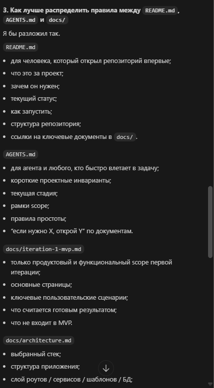
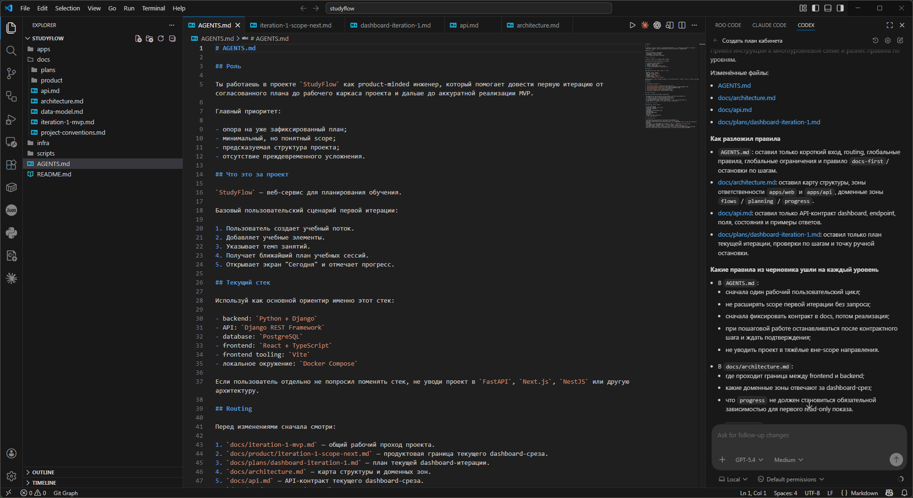

# Урок 4. Rules и проектные инструкции

_lesson_id: 2289224 · steps: 15 · ttc: 990s_

---

## Шаг 1 (step_id=9817261, text)

Зачем агенту нужны rules и проектные инструкции

В прошлых уроках мы уже увидели две базовые проблемы агентной работы: промпт должен быть достаточно конкретным, а агенту нужен качественный контекст по кодовой базе. Теперь добавим ещё один слой управления: постоянные проектные инструкции. Это правила, которые живут рядом с кодом и напоминают агенту, как здесь принято работать, даже если мы не повторяем это в каждом запросе.

Обычный одноразовый промпт хорошо задаёт текущую задачу. Но он плохо подходит для вещей, которые должны выполняться всегда: соблюдать структуру репозитория, использовать правильные команды, не трогать определённые каталоги, писать тесты перед коммитом, обновлять документацию, работать в нужном стиле. Если такие требования каждый раз вставлять вручную, промпт быстро разрастается, начинает шуметь и сам становится источником ошибок.

Именно поэтому современные инструменты для агентной разработки всё чаще опираются на проектные инструкции: файлы и rule-сущности, которые подключаются автоматически и дают агенту устойчивый рабочий контекст. Для агента это почти то же самое, что для нового разработчика хорошие onboarding-материалы: карта проекта, локальные соглашения и правила безопасности.

Почему одного чата недостаточно

Представим, что мы каждый раз пишем так:

Следуй принятому в проекте стеку и стилю.
Не меняй публичные API без явной необходимости.
Сначала найди существующие тесты.
Если меняешь схему данных, обнови документацию.
Не трогай папку migrations вручную.
Покажи краткий отчёт о том, что изменил.

Пока задача маленькая, это терпимо. Но в реальной работе такие правила начинают смешиваться с бизнес-требованиями конкретной задачи. Агенту становится сложнее понять, что здесь локальная цель, а что постоянное ограничение. В результате он либо забывает важные инварианты проекта, либо тратит часть контекстного окна на то, что можно было бы вынести в отдельный постоянный слой.

Хорошие rules разгружают основной промпт. Мы оставляем в запросе только то, что относится к текущему изменению, а общие правила переносим в файл или конфигурацию проекта. Это делает задачу чище и повышает повторяемость результата.

Что именно должны хранить проектные инструкции

В проектных инструкциях лучше хранить не всё подряд, а только то, что действительно должно повторяться из сессии в сессию. Обычно сюда попадают:

	Структура проекта. Где лежат основные модули, тесты, миграции, документация, конфиги, generated-файлы.
	Рабочие соглашения. Какие команды использовать для поиска, запуска тестов, форматирования и сборки.
	Границы изменений. Что можно менять свободно, а что требует отдельного подтверждения.
	Критерии качества. Нужны ли тесты, какие проверки запускать, как оформлять итоговый отчёт.
	Маршрутизация. Куда смотреть за деталями: в docs/, в архитектурные заметки, в план работ или в другие узкоспециализированные документы.

Rules не заменяют мышление

Важно не переоценивать их роль. Проектные инструкции не превращают слабую постановку задачи в сильную. Они не объясняют бизнес-цель автоматически и не заменяют работу по планированию, когда задача станет достаточно большой. Их задача скромнее, но очень важна: сделать среду работы устойчивой. Мы уменьшаем количество повторных пояснений, снижаем риск забытых ограничений и освобождаем основной промпт для сути задачи.

Практическое правило простое: если какое-то указание мы повторяем агенту снова и снова, пора подумать, не должно ли оно жить в проектных instructions.

---

## Шаг 2 (step_id=9861037, text)

Где живут инструкции в современных инструментах

Почти все зрелые инструменты для агентной разработки поддерживают идею постоянных проектных инструкций. Форматы различаются, но общая логика совпадает: часть контекста живёт не в чате, а в файлах и rule-конфигурациях рядом с кодом.

Codex и AGENTS.md

В актуальном guide OpenAI для Codex проектные инструкции оформляются через AGENTS.md. Этот файл работает как локальная карта правил для агента: как устроен репозиторий, что можно и нельзя делать, какими командами пользоваться, где искать дополнительные документы. Это особенно удобно в многошаговой работе, потому что одни и те же ограничения не нужно переписывать в каждом задании.

Огромный единый AGENTS.md быстро деградирует, поэтому лучше использовать его как оглавление и карту, а подробные правила хранить в отдельных документах внутри репозитория. Агенту полезнее короткая точка входа с явными ссылками на нужные документы, чем один большой монолитный файл.

Claude Code и CLAUDE.md

У Claude Code похожая идея оформляется через CLAUDE.md. Этот файл тоже играет роль постоянной проектной памяти: в нём удобно фиксировать правила работы с репозиторием, предпочтения команды, ограничения на изменения, требования к проверкам и формату отчёта. В практическом смысле это тот же класс решения, что и AGENTS.md: мы выносим повторяющиеся указания из чата в файл рядом с кодом.

Особенность CLAUDE.md в том, что его часто используют не только как список запретов и напоминаний, но и как рабочую памятку для длинных агентных сессий. Например, туда удобно вынести правила про коммиты после завершённых шагов, про чтение PLAN.md перед продолжением задачи или про обязательную проверку тестов перед финальным отчётом. То есть в экосистеме Claude Code этот файл нередко связывает вместе и контекст проекта, и стиль работы команды.

GitHub Copilot: общие и path-specific instructions

У GitHub Copilot экосистема инструкций стала заметно богаче:

Общий файл репозитория .github/copilot-instructions.md. Он задаёт базовые правила для всего проекта.

Path-specific instructions в каталоге .github/instructions/. Они позволяют привязать правила к определённым папкам, типам файлов или рабочим областям, чтобы фронтенд, бэкенд и инфраструктура не делили один и тот же шумный набор ограничений.

Файл AGENTS.md для agentic-сценариев. GitHub отдельно описывает этот формат как способ давать агенту инструкции по сборке, тестированию, стилю, pull request-процессу и другим проектным нормам.

Для нас здесь важен не конкретный синтаксис, а вывод: современные инструменты уходят от идеи «один глобальный текст на всё» к многоуровневой модели инструкций, где часть правил глобальна, а часть привязана к директориям и сценариям работы.

Cursor: структурированные rules и простой вход через AGENTS.md

У Cursor rules разделены на несколько типов: Project Rules, User Rules, AGENTS.md и legacy-формат .cursorrules. Project Rules живут в .cursor/rules, хранятся вместе с проектом и позволяют точнее управлять поведением агента. Одновременно Cursor сохраняет и более простой путь: если проекту не нужна сложная мета-конфигурация, можно ограничиться понятным AGENTS.md.

Это хороший ориентир для практики. Когда правил мало, нам достаточно обычного Markdown-файла. Когда проект становится большим и разнородным, появляются структурированные rules со scope и более точным включением в контекст.

Главный вывод

Хотя названия различаются, зрелый стек сегодня выглядит примерно одинаково:

1. Короткая точка входа для агента
2. Проектные инструкции рядом с кодом
3. Возможность разделить общие и локальные правила
4. Явные ссылки на более глубокие документы
5. Минимум повторения одного и того же в каждом промпте

Если помнить эту схему, мы не будем привязываться только к одному инструменту. Форматы могут меняться, но сама инженерная идея уже устоялась. У Codex это AGENTS.md, у Claude Code — CLAUDE.md, у Copilot и Cursor есть свои уровни project instructions, но цель везде одна и та же: дать агенту устойчивые правила работы без повторения их в каждом новом запросе.

---

## Шаг 3 (step_id=9861038, text)

Как писать хорошие проектные инструкции

Теперь перейдём от обзора инструментов к практической задаче: как именно писать такие инструкции, чтобы они реально помогали агенту. Главное правило здесь простое: проектные инструкции должны быть короткими, проверяемыми и работать как карта. Если файл невозможно быстро прочитать, проверить на актуальность и использовать как точку входа, со временем он начнёт мешать.

Из чего состоит сильный файл инструкций

Хороший стартовый шаблон обычно включает пять блоков.

1. Базовый контекст. Что это за проект, где лежат основные сущности, какова базовая структура каталогов.

2. Правила маршрутизации. Если задача про тесты, идти сюда; если про документацию, идти туда; если про миграции, сначала читать другой документ. Это экономит агенту шаги исследования. Вместо того чтобы читать весь свод правил, агент читает только тот документ, который относится к текущей задаче.

3. Глобальные ограничения. Что нельзя делать без явного запроса: не трогать generated-файлы, не менять публичные API, не запускать опасные команды, не редактировать соседние модули без необходимости.

4. Рабочие соглашения. Какими командами искать файлы, как запускать тесты, в каком виде давать отчёт, какие артефакты обновлять вместе с кодом.

5. Ссылки на источник достоверной информации. Не переписывать архитектуру заново в AGENTS.md, а отправлять в docs/architecture.md, docs/testing.md, plans/ и другие профильные документы.

Минимальный каркас

# AGENTS.md

## Base Context
- Проект хранится в ...
- Основная структура такая: ...

## Routing
- Если задача про API, сначала читай ...
- Если задача про UI, сначала читай ...

## Constraints
- Не меняй ...
- Не запускай ...

## Working Style
- Для поиска используй ...
- После изменений запусти ...

## Report
- Кратко перечисли изменённые файлы
- Отдельно укажи, изменилась ли структура

Такой файл не пытается заменить всю документацию проекта. Он отвечает только на вопрос: как агенту безопасно и эффективно войти в работу.

Какие правила формулируются хорошо

Сильное правило проверяемо. Вместо «пиши качественный код» лучше написать: «если меняешь бизнес-логику, запусти unit-тесты из tests/ и кратко сообщи результат». Вместо «не ломай архитектуру» лучше написать: «контроллеры не должны ходить в базу напрямую; используй сервисный слой». Вместо «аккуратно работай с документацией» лучше написать: «если меняешь публичный API, обнови docs/api.md в том же изменении».

То есть выигрываем мы не от абстрактной строгости, а от конкретики. Агенту легче следовать правилу, когда оно описывает наблюдаемое действие.

Когда стоит дробить инструкции

Если проект маленький, одного файла может быть достаточно. Но когда кодовая база растёт, полезно разделять:

корневой файл для общих принципов;

документы по доменам для архитектуры, тестирования, деплоя, безопасности;

локальные правила по путям для отдельных зон проекта, если инструмент это поддерживает.

Это напрямую связано с темой шумного контекста из предыдущих уроков. Чем лучше мы скоупим правило, тем меньше лишнего текста попадает в задачу.

---

## Шаг 4 (step_id=9861039, text)

Антипаттерны и поддержка инструкций в актуальном состоянии

Почти все команды, начинающие работать с агентами, сначала радуются возможности «наконец-то всё прописать». А потом сталкиваются с обратной проблемой: rules начинают разрастаться, противоречить друг другу и устаревать. Поэтому последний шаг урока посвящён не созданию инструкций, а их сопровождению.

Антипаттерн 1. Огромный монолитный файл

Самая частая ошибка — превратить AGENTS.md в энциклопедию на сотни строк. Такой подход быстро ломается: файл забивает контекст, смешивает правила разной важности и плохо поддерживается. Значит, корневой файл должен быть коротким и служить картой, а не архивом всего на свете.

Антипаттерн 2. Непроверяемые формулировки

Инструкции вроде «будь аккуратен», «следуй лучшим практикам» или «пиши красиво» звучат слишком абстрактно и почти не помогают. Агенту нужны признаки, по которым он может принять решение, а не субъективные человеческие оценки в духе «сделай хорошо». Чем более туманно правило, тем больше пространства для случайной интерпретации.

Антипаттерн 3. Конфликт между слоями правил

В современных инструментах могут одновременно существовать user-level, repo-level и path-specific instructions. Если они противоречат друг другу, агент получает смешанные сигналы. Поэтому полезно соблюдать простую иерархию: глобальные правила описывают общую культуру работы, а локальные правила уточняют поведение только внутри своей области.

Антипаттерн 4. Инструкции оторваны от реальности

Это самый опасный случай. Если в rules написано одно, а реальный проект уже живёт по-другому, агент будет ошибаться системно. Поэтому проектные инструкции нужно обновлять не «когда-нибудь», а вместе с изменением процесса или структуры репозитория. Если команда перешла на другой test runner, поменяла layout каталогов или способ сборки, rules тоже должны измениться в том же цикле работы.

Как поддерживать правила живыми

Полезный практический цикл выглядит так:

1. Повторяющееся указание замечаем в чатах
2. Переносим его в проектные instructions
3. Проверяем, можно ли сделать формулировку точнее
4. Даём ссылку на документ, если тема большая
5. Обновляем правило при любом изменении процесса

Если смотреть на это инженерно, rules тоже являются частью кодовой базы. Они хранятся вместе с проектом, влияют на поведение системы и должны проходить тот же здравый цикл поддержки, что и код с документацией.

Итоги урока

Rules и проектные инструкции нужны затем, чтобы вынести повторяющиеся ограничения и соглашения из одноразовых промптов в постоянный контекст проекта. Сегодня это уже стандартный паттерн работы в современных инструментах: Codex использует AGENTS.md, GitHub Copilot поддерживает repo-wide и path-specific instructions, а Cursor сочетает structured rules с простым входом через AGENTS.md.

Практически это означает следующее: мы не пишем огромный «свод законов», а создаём короткую карту проекта, фиксируем проверяемые правила, разделяем общие и локальные инструкции и держим их в актуальном состоянии. Тогда агент получает не просто текст в чате, а рабочую среду, в которой легче действовать предсказуемо и безопасно.

---

## Шаг 5 (step_id=9873606, text)

Практика "StudyFlow"

После урока про контекст кодовой базы у StudyFlow уже есть стартовый репозиторий, корневая карта проекта и набор документов в docs/. Теперь важно не раздувать один «главный документ», а понять, как разложить эти сведения по уровням, чтобы агент читал только то, что относится к текущей задаче. Например:

	AGENTS.md — как агенту входить в работу, какие документы читать первыми и какие ограничения действуют в проекте;
	README.md — что это за проект, какой стек уже выбран и как выглядит верхнеуровневая структура репозитория;
	docs/iteration-1-mvp.md — что уже зафиксировано по продуктовой рамке первой итерации;
	docs/project-conventions.md, docs/architecture.md, docs/data-model.md, docs/api.md — какие технические договорённости уже вынесены из корня и какие разделы ещё ждут наполнения;
	apps/api/README.md и apps/web/README.md — локальные точки входа в backend и frontend части проекта.

Хороший следующий шаг здесь — не переписывать все документы заново, а попросить агента проверить, достаточно ли нынешней структуры для первого технического прохода по проекту и не размыт ли контекст между корнем и docs/.

Изучи README.md, AGENTS.md и docs/iteration-1-mvp.md, ... <перечисляем ему нашу документацию>

Затем предложи:
1. какие сведения должны оставаться в AGENTS.md как в корневой карте проекта;
2. какие документы сейчас выглядят как заготовки и что в них нужно дописать перед первым техническим проходом;
3. как распределить правила между README.md, AGENTS.md и файлами в docs/, чтобы агенту было проще войти в задачу без лишнего шума.

Изучаем что предлагает нам агент, поправляем его, если требуется или сразу соглашаемся. Так мы связываем тему документации с реальным состоянием StudyFlow: не обсуждаем абстрактный AGENTS.md, а проверяем, готов ли текущий набор документов к следующему инженерному шагу и где агенту может не хватить контекста. Что-то можно прописать руками, но как правило агенты оформляют всё достаточно корректно и править надо не много.

После этого шага у нас должна получиться понятная карта: что агент читает всегда, что читает только для backend-задач, а что относится только к текущей итерации dashboard. Именно на эту раскладку мы будем опираться дальше.

---

## Шаг 6 (step_id=9861345, choice)

Зачем вообще нужны проектные инструкции для агента?

**Тип:** choice (single)

**Варианты:**
-  Чтобы заменить краткое описание текущей задачи
-  Чтобы каждый раз заново объяснять архитектуру
- [✓ правильный] Чтобы вынести повторяющиеся правила из чата
-  Чтобы хранить в них всё прошлое обсуждение проекта

**Статус Stepik:** `correct` (score 1.0)

**Мой reasoning:** _В теории прямо сказано: rules нужны, чтобы вынести повторяющиеся ограничения и соглашения из одноразовых промптов в постоянный контекст проекта. Это разгружает основной промпт и снижает риск забытых инвариантов._

---

## Шаг 7 (step_id=9861342, choice)

Какой тип указаний лучше всего подходит для project instructions?

**Тип:** choice (single)

**Варианты:**
-  Условия одной конкретной задачи
-  Черновые заметки по текущему обсуждению
- [✓ правильный] Повторяющиеся правила и соглашения
-  Временные гипотезы до чтения кодовой базы

**Статус Stepik:** `correct` (score 1.0)

**Мой reasoning:** _В теории прямо сказано: project instructions нужны, чтобы вынести повторяющиеся ограничения и соглашения из одноразовых промптов в постоянный контекст проекта. Одноразовые условия задачи и черновые заметки туда не относятся._

---

## Шаг 8 (step_id=9861338, choice)

Что лучше делать с большим монолитным AGENTS.md?

**Тип:** choice (single)

**Варианты:**
-  Удалить и писать всё вручную в чате
-  Постоянно дописывать его без структуры
-  Перенести всё в один системный промпт
- [✓ правильный] Оставить в нём карту, детали вынести

**Статус Stepik:** `correct` (score 1.0)

**Мой reasoning:** _В теории прямо сказано: огромный монолитный AGENTS.md деградирует, поэтому лучше использовать его как оглавление и карту, а подробные правила хранить в отдельных документах._

---

## Шаг 9 (step_id=9861341, choice)

Какое правило сформулировано лучше?

**Тип:** choice (single)

**Варианты:**
-  Соблюдай архитектуру проекта по возможности
-  Ориентируйся на лучшие практики без уточнений
- [✓ правильный] После правок запусти тесты и дай результат
-  Проверь, что решение выглядит достаточно чистым

**Статус Stepik:** `correct` (score 1.0)

**Мой reasoning:** _В теории прямо сказано: сильное правило проверяемо и описывает наблюдаемое действие. Остальные варианты — абстрактные формулировки вроде «будь аккуратен» / «следуй лучшим практикам», которые в уроке названы антипаттерном._

---

## Шаг 10 (step_id=9861336, choice)

Зачем нужны path-specific или локальные правила?

**Тип:** choice (single)

**Варианты:**
-  Чтобы хранить все правила только рядом с кодом
- [✓ правильный] Чтобы читать правила только по текущей зоне
-  Чтобы автоматизировать запуск тестов по папке
-  Чтобы отказаться от общего файла инструкций

**Статус Stepik:** `correct` (score 1.0)

**Мой reasoning:** _В уроке прямо сказано, что path-specific instructions позволяют скоупить правила к определённым папкам/зонам, чтобы фронтенд, бэкенд и инфраструктура не делили один шумный набор ограничений. Это уменьшает шум в контексте текущей задачи._

---

## Шаг 11 (step_id=9861343, choice)

Что уместно хранить в проектных инструкциях?

**Тип:** choice (multiple)

**Варианты:**
- [✓ правильный] Какие команды использовать для проверок
-  Историю всех прошлых обсуждений в чате
- [✓ правильный] Что нельзя менять без явного запроса
- [✓ правильный] Где лежат тесты, docs и основные модули

**Статус Stepik:** `correct` (score 1.0)

**Мой reasoning:** _В проектных инструкциях хранят структуру проекта, рабочие соглашения (команды) и границы изменений. История чатов — это одноразовый контекст, ему не место в постоянных rules._

---

## Шаг 12 (step_id=9861337, choice)

Какие форматы или механизмы постоянных инструкций упоминались в уроке?

**Тип:** choice (multiple)

**Варианты:**
- [✓ правильный] CLAUDE.md
- [✓ правильный] AGENTS.md
-  package-lock.json
- [✓ правильный] .cursor/rules

**Статус Stepik:** `correct` (score 1.0)

**Мой reasoning:** _В уроке упоминаются AGENTS.md (Codex, GitHub, Cursor), CLAUDE.md (Claude Code) и .cursor/rules (Project Rules в Cursor). package-lock.json — это файл зависимостей npm, не имеет отношения к проектным инструкциям._

---

## Шаг 13 (step_id=9861339, choice)

Почему формализацию правил можно поручить самому агенту?

**Тип:** choice (multiple)

**Варианты:**
-  Потому что тогда человеку не нужно ничего проверять
- [✓ правильный] Он может быстро превратить пожелания в структуру
- [✓ правильный] Он помогает сделать формулировки проверяемыми
- [✓ правильный] Он экономит время на первом черновике правил

**Статус Stepik:** `correct` (score 1.0)

**Мой reasoning:** _Агент полезен для быстрой структуризации, черновика и уточнения формулировок до проверяемых, но ответственность за проверку остаётся на человеке — поэтому вариант про «человеку не нужно ничего проверять» неверен._

---

## Шаг 14 (step_id=9861344, choice)

Что является хорошим итогом работы над rules?

**Тип:** choice (single)

**Варианты:**
-  Набор советов без проверяемых действий
-  Подробный файл со всеми историческими решениями
- [✓ правильный] Короткая карта проекта с чёткими ограничениями
-  Один общий документ без разделения по зонам

**Статус Stepik:** `correct` (score 1.0)

**Мой reasoning:** _Урок прямо подчёркивает: rules должны быть короткими, проверяемыми и работать как карта проекта, а не как энциклопедия или абстрактный набор советов._

---

## Шаг 15 (step_id=9861340, matching)

Сопоставьте сущность и её роль.

**Тип:** matching

**Колонка А (вопросы):**
- AGENTS.md
- CLAUDE.md
- Path-specific instructions
- Проверяемая формулировка

**Колонка Б (варианты, перемешаны):**
- правило с наблюдаемым действием
- локальные правила по зоне проекта
- постоянная память проекта в Claude Code 
- карта правил для агента

**Мои пары (неверные):**
- AGENTS.md → карта правил для агента
- CLAUDE.md → постоянная память проекта в Claude Code
- Path-specific instructions → локальные правила по зоне проекта
- Проверяемая формулировка → правило с наблюдаемым действием

**Статус Stepik:** `wrong` (score 0.0)

**Мой reasoning:** _AGENTS.md в теории описан как локальная карта правил/точка входа; CLAUDE.md — постоянная проектная память в Claude Code; path-specific instructions привязывают правила к зонам проекта; проверяемая формулировка — это правило с наблюдаемым действием._

---
