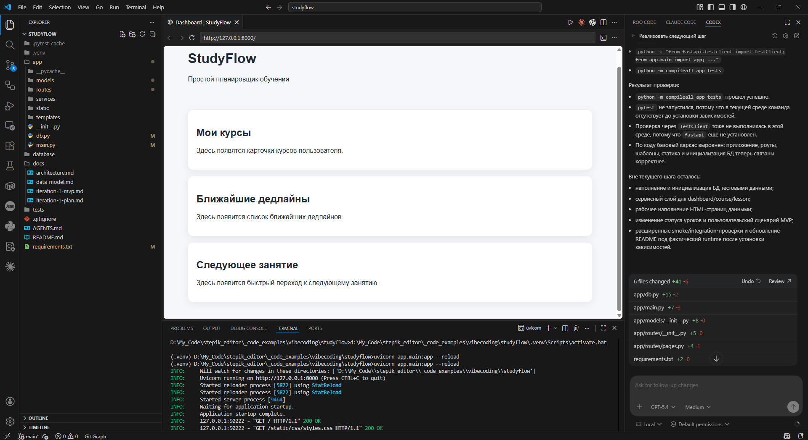

# Урок 1. Генерация нового проекта

_lesson_id: 2289225 · steps: 14 · ttc: 744s_

---

## Шаг 1 (step_id=9867046, text)

Когда можно переходить к генерации проекта

Старт проекта с агентом не начинается с команды «сгенерируй мне приложение». До этого должен появиться минимальный набор опор, иначе агент будет не реализовывать вашу первую итерацию, а на ходу додумывать продукт, стек и границы задачи.

Во втором модуле мы как раз подготовили этот фундамент: научились выносить постоянные правила в AGENTS.md, собирать контекстный пакет, фиксировать узкий первый срез и оформлять план первой итерации как отдельный артефакт. Значит, на старте модуля 3 мы не начинаем с пустоты. Мы начинаем с момента, когда проект уже описан на уровне решений, но ещё не реализован как живая кодовая база.

Что уже должно быть готово до генерации

Перед первым большим проходом генерации полезно проверить, что у вас уже есть понятная продуктовая цель для первого узкого сценария, постоянные инструкции для агента, минимальный контекстный пакет без лишнего шума и пошаговый план первой итерации с точками контроля. Если чего-то из этого не хватает, агент почти наверняка компенсирует пробелы собственными догадками. Тогда вместо управляемого старта вы получите смесь из решений, которые никто не утверждал заранее.

Что значит “технический старт”

Иногда для этого этапа используют термин bootstrap. Он пришёл из английского выражения про попытку «подтянуть себя за ремешки сапог» и хорошо подходит к старту проекта почти из ничего: у нас ещё нет живой кодовой базы, но уже есть идея, правила и план, из которых нужно собрать первый рабочий каркас. В инженерной практике так называют самый первый технический запуск проекта. Если термин кажется лишним, можно мысленно заменить его на более прямую формулировку: первый технический старт проекта.

Важный момент здесь такой: мы не просим агента придумать весь продукт. Мы просим его реализовать уже согласованный первый шаг. Поэтому переход к генерации уместен только тогда, когда рамка определена заранее, а не тогда, когда мы всё ещё выбираем направление.

Какая ошибка здесь встречается чаще всего

Самая частая ошибка на этом переходе — снова скатиться в планирование, хотя план уже есть, или наоборот сразу открыть слишком широкий проход на реализацию. В первом случае мы топчемся на месте и заставляем агента повторять решения из предыдущего модуля. Во втором — теряем контроль над границами задачи и получаем слишком большой первый набор изменений.

Для StudyFlow и для собственного проекта студента логика одна и та же. К этому моменту у вас уже должен быть выбран узкий первый срез и набор входных артефактов. Следующий шаг — не обсуждать заново весь проект, а правильно сформулировать запрос на первую генерацию.

Что мы хотим получить после первого прохода

После первой генерации нам нужен не “почти готовый продукт”, а понятный первый технический результат: живая структура проекта, первый запускаемый или хотя бы проверяемый артефакт, ясная связь между результатом и планом и понимание того, что пока осталось вне текущей итерации. Это и есть правильная точка входа в модуль 3: план уже подготовлен, теперь нужно научиться переводить его в аккуратную генерацию и так же аккуратно проверять получившийся результат.

---

## Шаг 2 (step_id=9867044, text)

Как сформулировать запрос на генерацию проекта

Когда план первой итерации уже готов, постановка задачи меняется. Теперь нам не нужен ещё один исследовательский промпт. Нам нужен запрос, который аккуратно переводит согласованный план в реализацию и не разрешает агенту расширять задачу на ходу.

Хороший запрос на генерацию проекта всегда опирается на уже подготовленные артефакты из прошлого модуля: цель первого среза, постоянные правила, контекстный пакет и план. Если эти вещи уже лежат в репозитории или собраны в рабочем чате, их не надо пересказывать с нуля. Их нужно коротко подключить как вход.

Из чего должен состоять такой запрос

В сильной постановке для первого технического старта полезно явно указать, на какой план или документ должен опираться агент, какой шаг он реализует прямо сейчас, какой объём первой итерации считается допустимым, какие ограничения нельзя нарушать и что именно агент должен показать в конце вместе с результатом. Такой запрос работает лучше, чем абстрактное «начни проект». Он сразу говорит агенту, что рамка уже определена и сейчас от него ждут не обсуждения, а исполнения в заданных границах.

Что особенно важно указать явно

На первом проходе генерации особенно полезно отдельно зафиксировать, что агент не должен выходить за рамки первой итерации, не должен без необходимости придумывать большие архитектурные слои и в конце обязан перечислить созданные файлы, выполненные команды и наблюдаемый результат. Это кажется мелочью, но именно такие ограничения часто отделяют управляемый старт от ситуации, где агент “заодно” тащит половину будущего проекта в первый же проход.

Пример рабочей формулировки

Используй уже подготовленные материалы проекта:
- README.md
- AGENTS.md
- план первой итерации
- релевантные документы из docs/, если они у нас есть

Сейчас реализуй только первый технический проход по согласованному плану.

Требования:
- не расширяй scope за пределы первой итерации;
- если в плане есть несколько крупных шагов, начни только с ближайшего;
- не добавляй лишние технологии и слои без явной необходимости;
- если показываешь структуру проекта, опирайся на выбранный нами путь, а не на произвольный шаблон.

В финале:
- перечисли, какие файлы создал или изменил;
- перечисли, какие команды запустил;
- отдельно укажи, что удалось проверить реально;
- перечисли, что осталось вне текущего прохода.

У такого запроса есть важное свойство: он не заставляет агента снова строить план, но и не отпускает его в автономную длинную генерацию без отчётности.

Что не стоит просить в первом запросе

В первом запросе не стоит одновременно просить заново выбрать стек, перепридумать архитектуру проекта, сгенерировать весь продукт до конца и сразу добавить богатую бизнес-логику, тесты, деплой и “улучшения на будущее”. Всё это может быть полезно позже, но не должно смешиваться с первым проходом. Если план из прошлого модуля был сделан правильно, то сейчас нам нужен не новый виток обсуждения, а аккуратная реализация первого узкого шага.

Как понять, что запрос сформулирован хорошо

Хорошая постановка на генерацию даёт агенту достаточно контекста для работы, но не отдаёт ему право произвольно расширять проект. После такого запроса вы должны ожидать небольшой, объяснимый результат, который можно проверить по списку файлов, команд и эффектов, а не по общему ощущению, что “проект как будто появился”.

---

## Шаг 3 (step_id=9867045, text)

Как проверять результат генерации

Сам по себе факт, что агент создал много файлов, ещё не означает хороший старт проекта. После первой генерации наша главная задача — не восхититься объёмом результата, а проверить, что агент действительно реализовал согласованный шаг и не увёл проект в сторону.

Именно поэтому проверку стоит рассматривать как отдельный этап, а не как короткий взгляд на diff в конце. На этом шаге мы отвечаем на вопрос: можно ли принять результат как рабочую первую итерацию или нужно сразу вернуть агента в узкий корректирующий проход.

Что проверять в первую очередь

После первой генерации полезно пройти четыре слоя проверки. Сначала смотрим на границы задачи: сделал ли агент именно тот шаг, который был запланирован. Затем проверяем структуру: понятен ли новый каркас проекта и нет ли в нём лишних слоёв. После этого оцениваем проверяемость: можно ли воспроизвести запуск, smoke-check или иной заявленный результат. И только затем смотрим на управляемость: можно ли быстро объяснить, зачем нужен каждый новый файл или блок изменений. Если хотя бы на одном из этих уровней ответ расплывчатый, значит первую итерацию ещё рано принимать.

Какие вопросы стоит задать себе после генерации

После генерации полезно задать себе несколько простых вопросов: соответствует ли результат шагу из плана первой итерации, не добавил ли агент лишние технологии, зависимости или папки, есть ли первый наблюдаемый технический результат, который правда можно проверить, и понятно ли по итоговому состоянию проекта, как переходить к следующему шагу без нового старта с нуля. Для старта проекта это особенно важно, потому что ошибка в самом первом каркасе потом тянется за всеми следующими уроками и итерациями.

Что смотреть в ответе агента

Хорошо, если агент в конце сам перечисляет изменённые файлы, команды и результаты проверки. Но даже тогда не стоит принимать отчёт на веру. Его нужно сверить с реальным итогом.

Список файлов должен совпадать с тем, что действительно появилось или изменилось. Команды должны быть понятными и воспроизводимыми. Заявленная проверка должна давать наблюдаемый результат, а не просто звучать правдоподобно. И главное, вне границ текущей задачи не должно оказаться скрытых изменений “заодно”. Если агент пишет уверенно, но вы не можете быстро пройти от его отчёта к реальному состоянию проекта, это уже сигнал остановиться и проверить всё внимательнее.

Как возвращать агента на корректировку

Почти всегда после первой генерации нужен короткий уточняющий проход. Это нормально. Важно только, чтобы доработка опиралась на конкретный результат проверки, а не превращалась в новый большой запрос “переделай всё ещё раз”.

Иногда агент действительно делает слишком много, и тогда его полезно вернуть к текущему шагу плана. Но это не единственный возможный сценарий. Проблема может быть и в другом: реализован не тот шаг, не проходит запуск, структура получилась тяжелее ожидаемой или отчёт агента слишком расплывчатый. Поэтому корректирующий запрос должен быть привязан к одному понятному отклонению.

Практическое правило здесь простое. Если агент вышел за рамки итерации, просим сузить объём работы. Если результат не соответствует плану, просим сверить реализацию с конкретным шагом. Если не проходит проверка, просим исправить только то, что мешает воспроизводимому запуску или проверяемому результату. Если отчёт неполный, просим отдельно перечислить изменённые файлы, команды и наблюдаемый эффект.

Такой подход возвращает нас к управляемому циклу и помогает исправлять один конкретный тип проблемы за раз, а не запускать новый широкий проход с дополнительными случайными решениями.

Что считается хорошим результатом проверки

Хорошим результатом первой генерации можно считать не идеальный проект, а такой каркас, который реализует согласованный шаг из плана, не разрастается за пределы первой итерации, имеет понятный способ проверки и оставляет ясную передачу в следующий шаг. Если держать эту рамку, то агент становится не генератором случайного старта, а управляемым исполнителем первого технического прохода. А это уже прочная база для следующих сценариев модуля.

---

## Шаг 4 (step_id=9873856, text)

Практика: первая генерация проекта

В этом шаге вы переходите от артефактов, подготовленных во втором модуле, к первой реальной генерации проекта. Ваша цель — не получить весь продукт, а аккуратно реализовать ближайший шаг из уже готового плана первой итерации и проверить результат.

Что должно быть у вас на входе

Перед началом практики убедитесь, что у вас уже есть README.md или аналогичная точка входа в проект, AGENTS.md или другой слой постоянных правил, план первой итерации и минимальный контекстный пакет, который объясняет первый узкий срез проекта. Если чего-то из этого ещё нет, сначала вернитесь к артефактам второго модуля. Эта практика не про подготовку плана с нуля, а про переход от плана к реализации.

Шаг 1. Подготовьте короткий запрос на первую генерацию

Соберите запрос так, чтобы агент опирался на уже существующие материалы проекта и реализовывал только ближайший шаг, а не всю итерацию целиком.

Используй материалы проекта:
- README.md
- AGENTS.md
- план первой итерации
- дополнительные документы из docs/, если они нужны для этого шага

Сейчас реализуй только ближайший шаг из плана.

Требования:
- не выходи за рамки первой итерации;
- не добавляй лишние технологии и слои;
- в конце перечисли изменённые файлы, команды и результат проверки;
- отдельно укажи, что осталось вне текущего шага.

Если вы работаете по StudyFlow, используйте его как основной маршрут. Если у вас собственный сквозной проект, логика остаётся той же: берёте уже подготовленный план и запускаете только его ближайший технический шаг.

Шаг 2. Проверьте, что агент сгенерировал

После ответа не переходите сразу к следующей задаче. Сначала проверьте, реализован ли именно тот шаг, который был в плане, не появился ли лишний объём работы, можно ли воспроизвести заявленную проверку и понятно ли, зачем нужен каждый новый файл или слой. Если агент сделал слишком много или результат трудно проверить, остановите процесс и верните его к узкой корректировке.

Шаг 3. Попросите короткую доработку, если нужно

Если после проверки вы видите, что проект почти на месте, но ему не хватает нескольких доработок, это нормальная часть процесса. После первой генерации агенту часто нужно отдельно уточнить, что именно поправить, что упростить, что доделать для запуска и что привести к более аккуратному состоянию. Не стоит ожидать, что даже хороший первый проход сразу даст полностью готовый результат без дополнительных уточнений.

На этом этапе нередко выясняется, что проекту ещё нужна техническая подготовка: создать виртуальное окружение, установить зависимости, добавить недостающие пакеты, выполнить инициализацию базы данных, настроить переменные окружения или запустить служебные команды сборки. Если агент сам не сделал такие шаги, это нормально уточнить отдельным коротким запросом или прямо попросить его выполнить подготовку самостоятельно и перечислить, что именно он установил и настроил.

Что отправить себе как сигнал завершения

Практику можно считать выполненной, если после первой генерации проект хотя бы в базовом виде запускается и это можно подтвердить. Хороший итог для этого шага: у вас поднимается сервер, в терминале видно успешный запуск, в браузере открывается результат, а у вас есть понятная проверка, что первый проход действительно работает. На этом уроке важен не объём созданного кода, а то, что вы получили живой старт проекта, который можно показать, проверить и спокойно дорабатывать дальше.

---

## Шаг 5 (step_id=9867440, choice)

Когда разумно переходить к первой генерации проекта с агентом?

**Тип:** choice (single)

**Варианты:**
- ○ Когда хочется быстрее увидеть много файлов
- ✓ Когда уже готовы правила, контекст и план
- ○ Когда агент сам предлагает архитектуру на будущее
- ○ Когда стек ещё не выбран окончательно

---

## Шаг 6 (step_id=9867437, choice)

Что лучше всего описывает цель первого технического прохода?

**Тип:** choice (single)

**Варианты:**
- ○ Сразу получить почти весь продукт
- ✓ Реализовать ближайший согласованный шаг
- ○ Сначала переделать весь план под агента
- ○ Максимально расширить первую итерацию

---

## Шаг 7 (step_id=9867442, choice)

На какие материалы должен опираться первый запрос на генерацию?

**Тип:** choice (single)

**Варианты:**
- ✓ На согласованные артефакты проекта
- ○ Только на шаблон фреймворка
- ○ Только на итоговый список зависимостей
- ○ На случайные идеи из чата

---

## Шаг 8 (step_id=9867435, choice)

Что особенно важно явно запретить в первом запросе?

**Тип:** choice (single)

**Варианты:**
- ○ Сравнивать результат с согласованным планом
- ○ Показывать созданные файлы
- ○ Перечислять запущенные команды
- ✓ Выходить за рамки текущего шага

---

## Шаг 9 (step_id=9867441, choice)

Что проверяют после первой генерации в первую очередь?

**Тип:** choice (single)

**Варианты:**
- ○ Насколько длинным получился ответ агента
- ✓ Соответствие результата шагу из плана
- ○ Сколько новых папок создалось автоматически
- ○ Насколько современно выглядит выбранный стек

---

## Шаг 10 (step_id=9867439, choice)

Что делать, если результат почти подходит, но требует уточнения?

**Тип:** choice (single)

**Варианты:**
- ○ Принять всё без дополнительной проверки
- ○ Сразу расширить задачу до следующего модуля
- ○ Начать проект заново в новом чате
- ✓ Дать короткий корректирующий проход

---

## Шаг 11 (step_id=9867436, choice)

Что должно быть готово до первой генерации проекта?

**Тип:** choice (multiple)

**Варианты:**
- ✓ План первой итерации
- ✓ Минимальный контекстный пакет
- ✓ Постоянные инструкции для агента
- ○ Полный набор всех будущих фич

---

## Шаг 12 (step_id=9867438, choice)

Какие признаки говорят о хорошем первом результате?

**Тип:** choice (multiple)

**Варианты:**
- ✓ Понятно, что осталось вне текущего шага
- ✓ Связь между результатом и планом прозрачна
- ○ Агент сразу закрыл весь продукт целиком
- ✓ Есть проверяемый технический эффект

---

## Шаг 13 (step_id=9874204, choice)

Что полезно попросить у агента в финале первого прохода?

**Тип:** choice (multiple)

**Варианты:**
- ○ Подробную историю внутренних рассуждений
- ✓ Список созданных или изменённых файлов
- ✓ Перечень реально проверенных результатов
- ✓ Список выполненных команд

---

## Шаг 14 (step_id=9874205, matching)

Сопоставьте артефакт и его роль.

**Тип:** matching

**Правильные пары:**
- AGENTS.md → постоянные правила работы по проекту
- План первой итерации → границы ближайшего технического шага
- Контекстный пакет → минимальный набор релевантных входов
- Проверка результата → сверка реализации с планом и запуском

---
