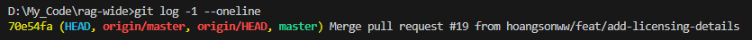
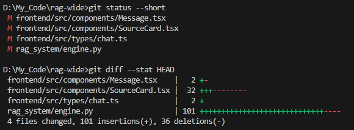
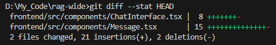
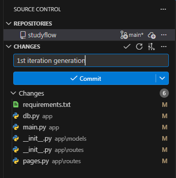
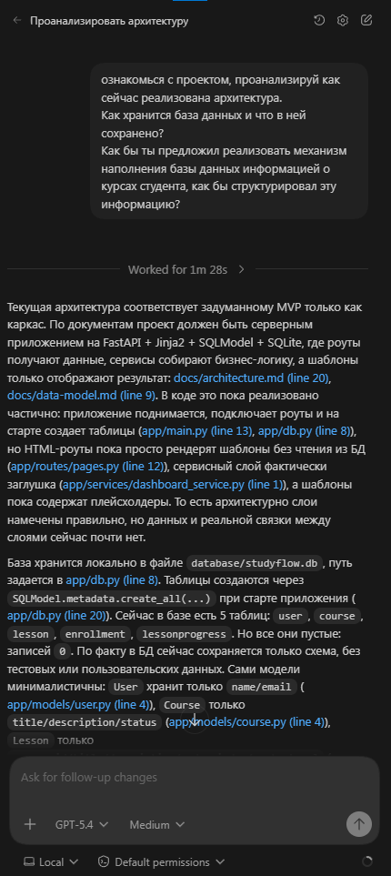
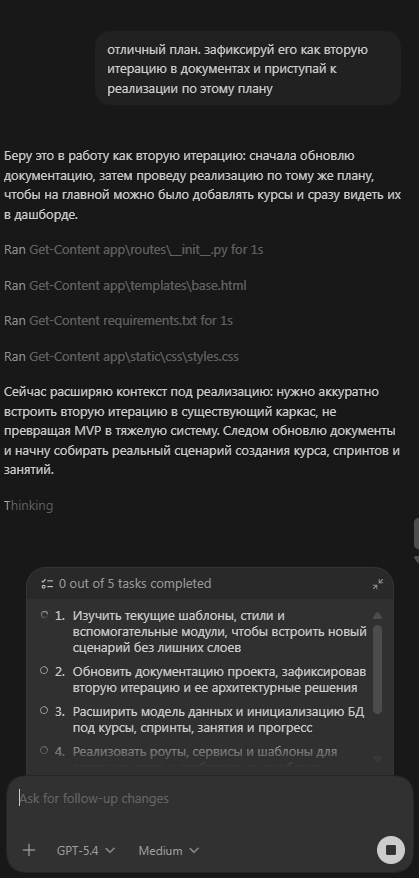
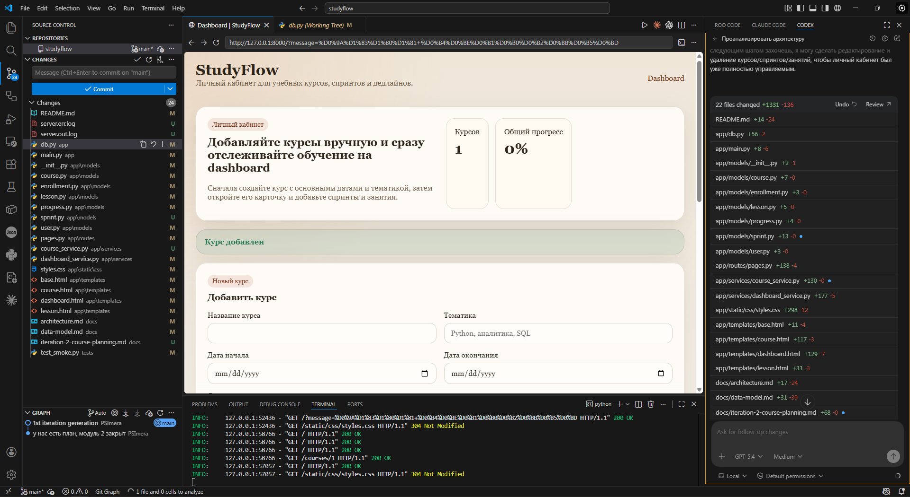

# Урок 2. Изменения в существующей кодовой базе

_lesson_id: 2289226 · steps: 14 · ttc: 900s_

---

## Шаг 1 (step_id=9817263, text)

Почему менять существующий код сложнее

Когда агент генерирует что-то с нуля, его ограничивают только наши требования. Когда мы просим изменить существующую систему — задача принципиально другая: нужно сохранить текущие контракты, не сломать соседнее поведение и не внести регрессию — скрытую поломку, которую сразу не видно.

В реальном проекте накоплен исторический слой: старые решения, локальные компромиссы, неочевидные зависимости. Участки, которые выглядят странно, но зачем-то существуют. Агент ничего из этого не знает по умолчанию — пока мы не дадим ему контекст.

Правдоподобное, но неверное изменение

Самая опасная ошибка при работе с существующим кодом — не явная, а незаметная. Агент может переписать функцию, сделать её чище и при этом изменить поведение: вернуть другую структуру данных, убрать обработку редкого пограничного случая, поменять порядок вызовов. Такие ошибки плохо заметны в diff, особенно когда diff большой.

Возьмём конкретный пример: рабочее Flask-приложение, нам нужна пагинация в списке статей. Задача звучит локально. Но агент легко затронет роут, модель, сериализатор и тесты — и каждое изменение по отдельности будет выглядеть разумным. Именно поэтому мы сначала требуем от агента показать карту текущего поведения, а не сразу редактируем код.

Что уже есть в проекте

В почти любой кодовой базе есть вещи, которые нужно учитывать: публичные интерфейсы и форматы ответов, готовые утилиты, которые принято переиспользовать, устоявшиеся паттерны обработки ошибок, legacy-участки, которые лучше не трогать без явной причины.

Задача «изменить логику отображения дедлайнов» звучит как правка одного виджета. В реальности там могут быть завязки на сортировку, timezone, серверный формат даты, пустые состояния и старый компонент списка. Опасность не в сложности отдельной строчки, а в том, что поведение распределено по нескольким местам.

Точность важнее количества улучшений

При изменении существующего кода мы почти всегда предпочитаем точное локальное изменение вместо полной переписки. Нас интересует не абстрактно лучший код, а конкретное изменение с предсказуемыми последствиями.

Хороший запрос к агенту в этом сценарии должен сдерживать лишний энтузиазм. Агент не нужен как соавтор, который параллельно улучшает архитектуру, обновляет стиль и перестраивает слои. Такие задачи лучше разделять: сначала одно, потом другое.

В живом проекте мы смотрим не на красоту ответа агента, а на точность и читаемость diff. Чем выше цена регрессии, тем важнее локальность и понятная цепочка проверки.

---

## Шаг 2 (step_id=9874209, text)

Как искать точку изменения и ограничивать область правок

При работе с существующим кодом мы жёстко разделяем два этапа: сначала агент анализирует текущую логику, и только потом получает разрешение что-то менять. Это не формальность — без понимания точки изменения агент склонен лечить симптом, а не причину.

Сначала — исследование

Исследовательский запрос выглядит примерно так: «найди текущую реализацию», «покажи, где формируется ответ», «объясни, через какие модули проходит этот сценарий», «предложи минимальный план правок». Такой запрос заставляет агента сначала продемонстрировать понимание системы — и это проверка. Если агент не может внятно показать точку изменения, доверять ему редактирование рано.

В Cursor этот этап часто проходит через просмотр связанных файлов и граф зависимостей прямо в редакторе. В Claude Code и Codex полезно буквально сформулировать исследовательский запрос отдельным первым шагом с явным запретом на редактирование. Некоторые задачи требуют нескольких проходов: сначала понять, кто вызывает функцию, — потом разобраться, что делает каждый вызывающий.

Пример хорошей постановки

Нужно, чтобы пользователь оставался залогиненным после перезапуска приложения.

Сначала:
- найди, где сейчас хранится токен
- покажи, как устроен login flow
- перечисли файлы, связанные с этим поведением
- предложи минимальный план изменений без переписывания всей auth-логики

Потом:
- реализуй сохранение токена
- не меняй публичные интерфейсы без необходимости
- не трогай экран регистрации

Двухфазный формат здесь принципиален: мы заранее задаём ожидаемую глубину изменений. Агент не просто получает задачу, а понимает, что мы ждём локальное решение и отдельный разбор текущего состояния до каких-либо правок.

Почему важно удерживать минимальную область

Чем меньше область изменений, тем проще проверить и принять результат. Если для локальной задачи агент затрагивает UI, API-клиент, формат ошибок и соседний сервис — это почти всегда повод пересмотреть план. Минимальная область не означает отказ от рефакторинга: она означает, что каждое изменение должно иметь явную причину. Хороший ориентир: если нельзя в двух предложениях объяснить, почему изменён каждый файл — область правок, скорее всего, вышла за разумные пределы.

Какие ограничения задавать явно

Конкретные ограничения зависят от проекта, но несколько формулировок работают почти везде: не менять публичный API модуля; не переносить код между слоями без отдельного согласования; не трогать legacy-фрагменты; не переписывать соседние тесты без причины; не добавлять новые абстракции, если задача решается локально.

Сильный запрос на изменение существующего кода почти всегда двухфазный: сначала локализовать текущее поведение и показать план — потом разрешать минимальные правки в явно ограниченной зоне.

---

## Шаг 3 (step_id=9874208, text)

Регрессии, проверка и итеративная доработка

После того как агент внёс изменения, начинается самая ответственная часть работы. Важно понять не только то, что задача решена, но и то, что ничего соседнего не сломалось. «Патч выглядит разумно» и «изменение безопасно» — это разные вещи, и в живом проекте они расходятся чаще, чем кажется.

На что смотреть в первую очередь

Смотрите на результат минимум по четырём направлениям:

	Поведение — решена ли исходная задача.
	Совместимость — сохранены ли внешние контракты и ожидания других частей системы.
	Локальность — не расширил ли агент область изменений без необходимости.
	Воспроизводимость — можем ли мы быстро повторить сценарий, на котором проверяем исправление.

Если правка закрыла баг, но при этом изменила сигнатуру функции, формат ответа или способ вызова из соседнего модуля — это уже не точечное исправление. Такое требует отдельной проверки и, возможно, другой постановки задачи.

Что просить у агента после правок

Чтобы ревью было проще, просим не только патч, но и короткий отчёт: какие файлы изменены, какое поведение изменилось, какие сценарии стоит проверить вручную, где у модели оставалась неопределённость.

Это не отменяет нашу проверку, но делает её направленной. Если инструмент уже показывает компактный diff и список файлов — дублировать запрос не нужно. В текстовых ответах агента такой отчёт значительно ускоряет переход от разговора к фактической проверке.

Как давать обратную связь на второй проход

Конкретное замечание помогает агенту доработать тот же замысел. Размытая критика, наоборот, часто провоцирует новую широкую перепись. Мало смысла писать «не нравится» — важно уточнить: «не меняй контракт функции», «используй существующую утилиту», «сузь решение до слоя API», «оставь тесты, измени только фикстуры».

Хорошая обратная связь опирается на факты из проверки: «после перезапуска токен сохраняется, но logout больше не очищает storage», «фикс работает, но ты изменил публичный тип ответа», «сценарий успешен, однако соседний тест падает». Такая формулировка удерживает вторую итерацию в инженерных рамках и не даёт агенту уйти в очередную широкую перепись.

---

## Шаг 4 (step_id=9874210, text)

Пример: как плохой промпт заставляет агента менять слишком много

Чтобы проверить устойчивость ассистента, лучше взять реальный репозиторий и прогнать на нём два сценария: сначала дать широкий запрос без границ, а затем — такой же по смыслу, но с чёткими ограничениями. Вариант A ниже использует англоязычный LangChain-репозиторий с зафиксированным коммитом. Вариант Б оставляет прежнюю StudyFlow-сессию, чтобы показать тот же метод на вашем проекте.

Вариант A: реальный LangChain-репозиторий

Для эксперимента возьмём hoangsonww/RAG-LangChain-AI-System. Это многослойный проект: у него есть frontend, Python-слой rag_system и тесты. Чтобы результат был воспроизводимым, сразу закрепите коммит:

git clone https://github.com/hoangsonww/RAG-LangChain-AI-System.git rag-wide
cd rag-wide
git switch --detach 70e54fa
git log -1 --oneline

Шаг 1. Широкий запрос

В первом прогоне дайте агенту такой запрос:

Сделай ответы компактнее и менее шумными: показывай пользователю только самые важные источники и улучши качество цитат.

Запрос звучит почти разумно, но в нём не сказано, где проходит граница задачи. Агент может понять его как просьбу менять и отображение, и retrieval, и формат подготовки ответа. В нашем прогоне так и произошло.

После запроса проверим масштаб патча:

git status --short
git diff --stat HEAD

Фактический результат широкого запроса выглядел так:

То есть агент не ограничился интерфейсом. Он полез в Python-слой, вынес новую логику в helper, поменял сборку источников в rag_system/engine.py и затронул три UI-компонента. По смыслу каждое изменение можно защитить. Но вместе это уже другой масштаб задачи.

Шаг 2. Точный запрос

Откатим эти изменения и во втором прогоне используем тот же смысл, но с явными границами:

В интерфейсе чата показывай не больше трёх источников у ответа ассистента.

Меняй только:
- frontend/src/components/Message.tsx
- frontend/src/components/ChatInterface.tsx

Не трогай retrieval, backend, тексты промптов, конфиги и тесты.
Если источников больше трёх, добавь короткую подпись, что показаны только три верхних источника.

После этого проверим diff:

git diff --stat HEAD

Во втором прогоне получилось так:

Только два файла и только интерфейс. Тот же пользовательский смысл, но другой масштаб риска и другая проверяемость.

Важный вывод: хороший результат в существующем репозитории — не расползание «полезных улучшений» по всему репозиторию, а патч, у которого заранее понятны границы, цена проверки и зона ответственности.

Что именно здесь демонстрирует сбой

На широком запросе агент не ошибается синтаксически. Он ошибается рамкой задачи. Вместо локального изменения в UI он начинает улучшать python код самого retrieval. Именно это поведение и нужно уметь замечать в ревью.

Как повторять такой эксперимент дальше

	Берите реальный репозиторий с несколькими слоями и фиксируйте конкретный коммит.
	Выбирайте одну узкую цель, которую можно решить локально.
	Сначала давайте широкий запрос без границ и фиксируйте список затронутых файлов.
	Потом повторяйте тот же смысл с явными файлами и запретами на соседние слои.
	Сравнивайте не только то, «работает ли», но и то, насколько патч локальный и проверяемый.

Вариант Б: ваш проект (StudyFlow)

Если вы работаете со StudyFlow, логика та же. Перед началом сохраняем текущее состояние в git.

git branch --show-current
git status --short
git log -1 --oneline

Если в рабочем дереве есть незакоммиченные изменения, не передавайте новую задачу агенту поверх этого состояния. Сначала зафиксируйте их как безопасную точку возврата.

Шаг 1. Локализация точки изменения

Для StudyFlow выбираем один конкретный сбой или одно узкое улучшение в уже существующем коде и сначала просим агента показать карту текущей реализации:

Изучи текущий проект и локализуй точку изменения.

Нужно:
- показать, какие файлы отвечают за старт приложения и рендер страниц
- объяснить, где может ломаться запуск или работа шаблонов
- перечислить только реально связанные файлы
- предложить минимальный план правок

Пока не редактируй код.

Если агент не может внятно показать точку изменения — это сигнал. Именно в этом месте модель особенно склонна лечить симптом, а не причину.

Шаг 2. Минимальные правки в явной рамке

Когда карта понятна, даём второй запрос с ограничениями:

Теперь внеси только минимальные правки по найденному плану.

Ограничения:
- не расширяй задачу за пределы текущей проблемы
- не перестраивай архитектуру и папки
- не добавляй лишние абстракции
- в финале перечисли изменённые файлы и объясни, зачем изменён каждый

Шаг 3. Проверьте именно тот сценарий, который меняли

Для StudyFlow проверяем, что стартовый каркас работает: сервер запускается, /health отвечает, базовые страницы рендерятся без ошибки шаблона.

uvicorn app.main:app --reload

Проверяем как минимум: GET /health, главную страницу и одну страницу курса, если они уже есть в каркасе.

В существующем проекте хороший результат — не «агент улучшил всё вокруг», а одна понятная проблема, локальный набор файлов и воспроизводимая проверка после правки.

Что считать завершением шага

Практика выполнена, если вы начали с понятного git-чекпоинта, получили узкий diff и можете проверить ровно тот сценарий, который меняли. Если правка относится к StudyFlow и вы действительно изменяли файлы проекта, завершите шаг отдельным коммитом.

---

## Шаг 5 (step_id=9882326, choice)

Почему изменение существующего кода обычно рискованнее генерации с нуля?

**Тип:** choice (single)

**Варианты:**
- ○ Потому что IDE мешает менять файлы
- ✓ Нужно сохранить текущие контракты
- ○ Потому что агент пишет медленнее
- ○ Потому что новые проекты всегда без багов

---

## Шаг 6 (step_id=9882322, choice)

С чего лучше начинать задачу на правку существующего поведения?

**Тип:** choice (single)

**Варианты:**
- ○ С обновления всех зависимостей проекта
- ○ С полной переписи нужного модуля
- ○ С переноса логики по новым директориям
- ✓ С локализации текущей реализации

---

## Шаг 7 (step_id=9882320, choice)

Что обычно показывает, что область правок стала слишком широкой?

**Тип:** choice (single)

**Варианты:**
- ○ В ответе есть краткий список файлов
- ✓ Локальная задача задела много слоёв
- ○ Проверка заняла меньше одной минуты
- ○ Агент изменил только один файл

---

## Шаг 8 (step_id=9882317, choice)

Какая обратная связь лучше подходит для второго прохода агента?

**Тип:** choice (single)

**Варианты:**
- ○ Полностью перепиши auth-логику заново
- ○ Сделай код аккуратнее на свой вкус
- ✓ Не меняй контракт функции и сузь diff
- ○ Улучши всё вокруг, если увидишь шанс

---

## Шаг 9 (step_id=9882321, choice)

Что полезно попросить у агента на исследовательском этапе?

**Тип:** choice (multiple)

**Варианты:**
- ○ Немедленно изменить все связанные файлы
- ✓ Показать точку изменения
- ✓ Перечислить реально связанные файлы
- ✓ Предложить минимальный план правок

---

## Шаг 10 (step_id=9882324, choice)

Какие риски урок предлагает проверять после правки в первую очередь?

**Тип:** choice (multiple)

**Варианты:**
- ○ Изменился ли стиль комментариев во всём проекте
- ✓ Решена ли исходная задача
- ✓ Не расширился ли diff без причины
- ✓ Сохранены ли внешние ожидания системы

---

## Шаг 11 (step_id=9882318, choice)

Какие ограничения помогают удержать правку в разумных границах?

**Тип:** choice (multiple)

**Варианты:**
- ✓ Не трогать legacy-фрагменты без повода
- ✓ Не менять публичный API без причины
- ✓ Не добавлять новые абстракции без нужды
- ○ Всегда переносить код в новый слой

---

## Шаг 12 (step_id=9882319, matching)

Сопоставьте цель и действие

**Тип:** matching

**Правильные пары:**
- Найти текущую реализацию → Исследовательский этап до правок
- Изменить только нужный участок → Минимальная область изменений
- Проверить соседние сценарии → Контроль регрессий
- Дать точное замечание по diff → Обратная связь на второй проход

---

## Шаг 13 (step_id=9882325, matching)

Сопоставьте формулировку и её роль в постановке

**Тип:** matching

**Правильные пары:**
- Покажи, где формируется ответ → Локализация поведения
- Не трогай экран регистрации → Явное ограничение области правок
- Перечисли изменённые файлы → Краткий отчёт после правки
- Проверь /health и главную страницу → Воспроизводимая проверка

---

## Шаг 14 (step_id=9882323, matching)

Сопоставьте ситуацию и правильную реакцию

**Тип:** matching

**Правильные пары:**
- Агент не показал точку изменения → Не разрешать редактирование
- Diff внезапно ушёл в соседние слои → Остановить и сузить задачу
- Правка закрыла баг, но изменила контракт → Проверить совместимость отдельно
- После фикса нужен второй проход → Дать конкретные замечания по фактам

---
