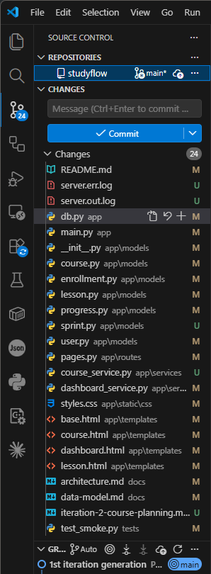
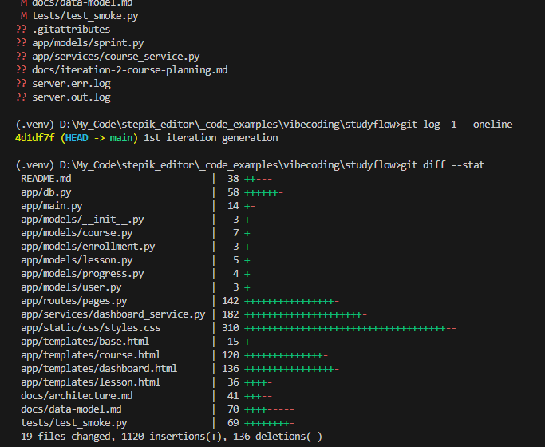
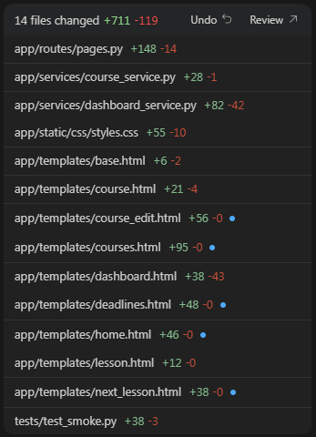
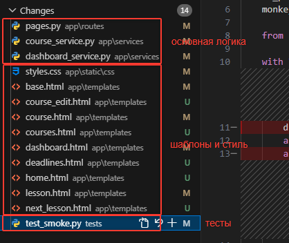
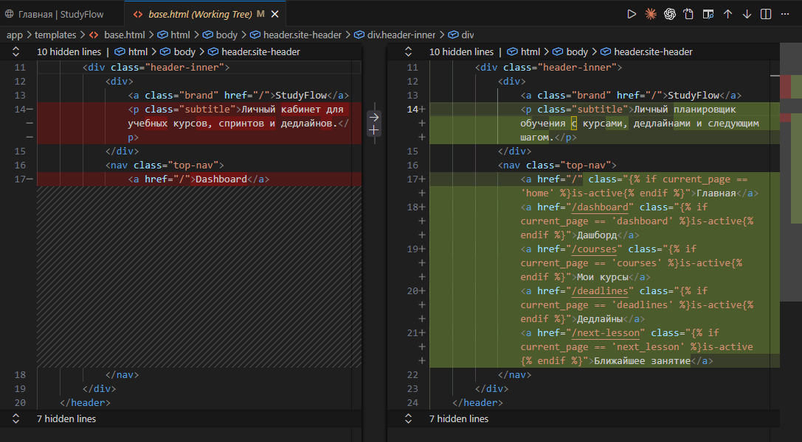
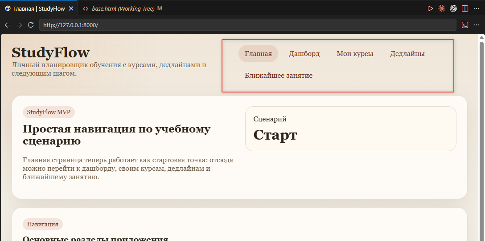
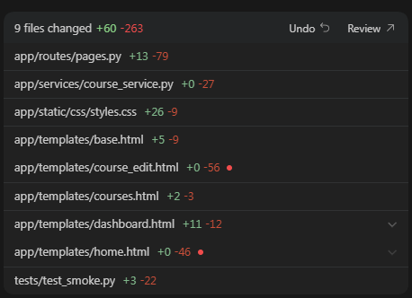
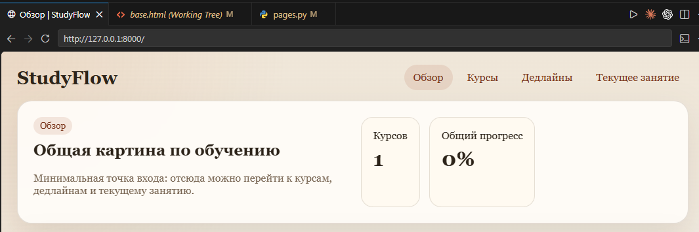
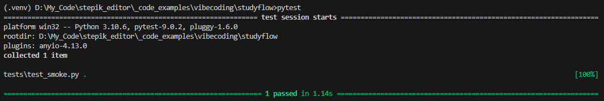

# Урок 3. Работа с diff и контроль изменений

_lesson_id: 2289227 · steps: 14 · ttc: 933s_

---

## Шаг 1 (step_id=9817264, text)

Почему в AI-разработке контролируют патч, а не ответ агента

Агенты в Codex, Claude Code, Cursor и облачных сценариях вроде GitHub Copilot coding agent умеют читать кодовую базу, менять несколько файлов, запускать команды и работать в фоне. Результат они приносят в виде локальных правок или запроса на слияние. Поэтому главным объектом контроля становится не сообщение агента, а патч — фактический набор изменений в коде.

Интерфейс у инструментов разный, но инженерная логика одна и та же. В редакторе мы принимаем или отклоняем строки в окне ревью. В терминале смотрим git diff. В облачном агенте читаем запрос на слияние. Во всех случаях мы принимаем не «идею», а конкретные изменения: какие файлы затронуты, что удалено, что добавлено, насколько далеко агент вышел за границы задачи.

Что изменилось в инструментах

Инструменты всё чаще работают как полноценные исполнители, а не как автодополнение. У Cursor и VS Code есть встроенное принятие и отклонение правок, контрольные точки и фоновые агентные проходы. У Codex рабочий цикл строится вокруг локального git-состояния, проверки команд и небольших патчей. Claude Code поддерживает изолированные worktree-сессии, где агент получает собственную копию репозитория и не загрязняет рабочую ветку, пока мы не приняли решение о принятии патча. В облачных агентах итог автономной работы появляется в PR — именно там человек впервые видит, что было сделано.

Из этого следует простое правило: если задача сформулирована слишком широко, агент почти наверняка принесёт слишком широкий патч.

Почему объяснение агента недостаточно

Агент умеет звучать убедительно: «упростил архитектуру», «довёл реализацию до продакшен-качества», «сделал код чище». За такими формулировками могут скрываться лишние переименования, смешение новой функциональности с рефакторингом, удаление защитной логики или изменения в соседних модулях, которых мы не просили.

Поэтому в инженерной работе полезно придерживаться простого порядка: сначала читаем патч, потом слушаем интерпретацию. Объяснение агента помогает быстрее понять замысел, но только патч показывает реальный масштаб и цену этого замысла.

Чем сильнее агент, тем важнее смотреть не на его уверенность, а на фактическую область изменений.

Что это меняет в повседневной работе

Как только агент начинает менять не один файл, а несколько связанных частей проекта, контроль через патч становится обязательным. До просмотра патча мы не знаем, произошло ли точечное изменение или вместе с ним в код попали правки в шаблонах, данных, тестах и визуальном слое.

Это особенно важно в облачных сценариях: когда агент работает в фоне и приносит готовый PR, у нас нет промежуточных наблюдений — только итоговый патч. Именно там привычка читать diff по карте файлов, а не доверять описанию, работает лучше всего.

---

## Шаг 2 (step_id=9874212, text)

Как читать патч: от области изменения к рискам

Читать патч полезнее не строка за строкой, а от общего к частному: сначала карта файлов, потом смысловые группы, потом конкретные строки. Такой порядок особенно важен в работе с агентом, потому что у него часто получаются локально разумные фрагменты, которые вместе складываются в слишком широкий проход.

Сначала смотрим на карту файлов

Первый вопрос всегда один: ожидали ли мы именно этот набор файлов. Если задача узкая, а патч задевает маршруты, сервисы, шаблоны, стили, тесты и документацию одновременно — это повод остановиться.

Удобный способ — быстрый git diff --stat: он показывает изменённые файлы и число строк без детального кода. По этому виду часто уже видно, вышел ли агент за рамки задачи, не читая ни одной строки патча.

Потом разделяем обязательное и попутное

После карты файлов раскладывайте изменения по ролям. Обычно хватает четырёх групп:

ядро поведения — где реально добавляется или меняется сценарий;
поддержка сценария — тесты, небольшие изменения модели, служебная логика;
полировка — стили, тексты, косметика интерфейса;
сопровождение — документация, README, дополнительные пояснения.

Хороший патч причинно чистый: мы можем объяснить, почему каждая группа файлов оказалась в изменении. Если без стилей сценарий уже работает, а без документации ничего не ломается — эти части лучше вынести в следующий проход. Агент часто делает их «заодно», и именно тут начинается лишний объём.

Ищем места, где легко спрятать регрессию

Когда границы патча понятны, идём в самые чувствительные зоны: удаления, изменения сигнатур, новые ветки условий, преобразование дат и статусов, ручной разбор форм, редиректы, создание сущностей и обновление тестов. Именно там чаще всего скрывается неочевидная поломка: сценарий вроде бы работает, но контракты уже поменялись.

Особенно внимательно смотрим на изменения, которые одновременно затрагивают сущности данных, экранные маршруты, статусы и пользовательские сценарии. Такой патч может быть полезным, но он несёт продуктовый риск: мы меняем не одну точку, а сразу несколько связанных частей.

Если патч трудно объяснить простым предложением — почти всегда лучше вернуть его агенту на сужение.

Что отличает хороший патч от опасного

У хорошего патча обычно три свойства: он связан с одной понятной целью, его легко проверить воспроизводимым способом и его можно принять без фразы «ну вроде всё полезное». У опасного патча, наоборот, несколько мотивов сразу: немного функциональности, немного переделки структуры, немного полировки интерфейса.

Чем лучше мы умеем читать патч таким способом, тем быстрее начинаем видеть не только ошибки агента, но и качество собственной постановки. Слишком широкий патч почти всегда означает, что и задача была сформулирована слишком широко.

---

## Шаг 3 (step_id=9874213, text)

Как выстраивать работу агента вокруг маленьких патчей

Патч полезен не только как объект чтения после факта. Вокруг него можно выстроить весь цикл работы с агентом: короткие итерации, в каждой из которых заранее понятны допустимая область изменения, способ проверки и критерий принятия.

Задаём форму изменения ещё до запуска агента

Хороший результат начинается с хорошего ограничения. Если мы знаем, что готовы принять только один небольшой вертикальный срез, говорим это прямо: пусть агент сначала перечислит связанные файлы, не трогает несвязанные стили и документацию, а в конце покажет карту изменений.

Сделай только один небольшой проход.

Цель:
- реализовать один проверяемый сценарий
- не смешивать новую функциональность с косметикой и документацией
- если для задачи потребуется больше 4–5 файлов, сначала остановись и покажи план

В финале:
- перечисли изменённые файлы
- коротко объясни, зачем изменён каждый
- не делай commit

Такой формат работает для Codex, Claude Code, Cursor и агентного режима VS Code. Если вы используете AGENTS.md или CLAUDE.md в репозитории, часть этих ограничений можно закрепить там постоянно — тогда не нужно повторять их в каждом запросе. Это особенно полезно для правил вроде «всегда перечисляй изменённые файлы», «не делай commit без явного запроса» или «не трогай legacy-папку src/legacy/».

Принимаем решение по патчу, а не по инерции

После первого прохода не нужно немедленно просить агента идти дальше только потому, что он хорошо разогнался. Сначала смотрим на патч. Если он узкий и читаемый — проверяем именно тот сценарий, ради которого меняли код. Если патч уже расползается — не наращиваем поверх него новый объём.

В Cursor и VS Code для этого удобно принимать и отклонять правки в интерфейсе ревью, а при необходимости возвращаться к контрольным точкам. В Codex и Claude Code естественный цикл строится вокруг git diff --stat, отдельной ветки или worktree и коротких коммитов. Флаг --worktree в Claude Code запускает агента в изолированной копии репозитория — удобно, когда нужно дать агенту свободу эксперимента без риска испортить рабочую ветку. В облачных сценариях тот же принцип переносится в PR: если он получился слишком широким, просим разделить работу на более узкие изменения.

Паттерны, которые работают лучше всего

Перед новым проходом делаем короткую проверку состояния git: ветка, чистота рабочего дерева, последний коммит, ожидаемые файлы. Это занимает пять секунд и страхует от ситуации, когда новая задача накладывается на непринятый патч от предыдущей.

Каждый шаг должен быть таким, чтобы его можно было проверить за один прогон тестов или одну ручную проверку. Если патч получился шире задачи — возвращаем его на сужение или разбиваем на несколько последовательных изменений.

Это особенно важно в уже существующем проекте. Когда кодовая база живая, агенту легко «заодно» перестроить не только нужную страницу или функцию, но и соседние шаблоны, данные, тесты и визуальный слой. Маленькие патчи защищают от такой полезной на вид, но плохо контролируемой инициативы.

Хороший агентный рабочий цикл не ускоряет хаос. Он ускоряет маленькие проверяемые шаги.

---

## Шаг 4 (step_id=9874211, text)

Практика: проведите ревью патча и сузьте изменение

Цель практики — разобрать многофайловое изменение по частям и принять только проверяемый срез. Один на вид полезный проход агента может одновременно затронуть маршруты, шаблоны, данные, навигацию, стили и проверки. Именно в таких патчах лучше всего видно, почему diff читают сверху вниз: сначала по карте файлов, потом по смысловым группам, потом по строкам.

Вариант A: реальный многослойный проект

Если вы уже работали с hoangsonww/RAG-LangChain-AI-System в практике прошлого урока, возьмите любой патч, который принёс агент. Если нет — склонируйте проект и запросите одно улучшение без коммита. Хороший кандидат — ограничение списка источников в интерфейсе чата или улучшение их отображения без изменений в retrieval и backend: агент почти наверняка снова уйдёт в несколько файлов.

git diff --stat HEAD
git diff HEAD

Разбираем патч по группам из предыдущего шага: ядро поведения, поддержка сценария, полировка. Находим изменения, без которых интерфейсный сценарий уже работал бы, и возвращаем их агенту на сужение.

Вариант Б: StudyFlow

Проверяем состояние проекта тем интерфейсом, в котором удобнее работать: в Cursor и VS Code — через панель изменений; в Codex, Claude Code и других CLI — через git status, git diff --stat и git diff; в облачных сценариях — через экран diff или запрос на слияние.

git branch --show-current
git status --short
git log -1 --oneline
git diff --stat

Если в рабочем дереве уже есть незакоммиченный патч после прохода агента — используем именно его. Не наслаиваем новый проход поверх непринятой итерации. Если дерево чистое, запрашиваем один следующий продуктовый срез без коммита.

Для текущего состояния StudyFlow хорошо подходит сквозное меню навигации: отдельные страницы уже есть, но связная навигация между ними не собрана. Изменение кажется небольшим, а на деле легко расползается в шаблоны, маршруты, тексты, стили и вспомогательную логику.

Подготовь один патч для следующего шага StudyFlow.

Цель:
- спроектировать и реализовать базовое меню навигации
- сделать понятные переходы между главной, дашбордом, списком курсов, дедлайнами и ближайшим занятием
- показать минимально работающий сценарий
- не делать commit

Ограничения:
- сначала измени только то, без чего сценарий не работает
- если понадобится больше одной новой страницы, сначала коротко опиши план
- не добавляй авторизацию, роли, уведомления и другую соседнюю функциональность
- в финале перечисли изменённые файлы и предложи, что проверить вручную

Шаг 1. Разбираем патч по группам файлов

Читаем патч от общего к частному: сначала карта изменённых файлов, потом diff по группам, и только после — конкретные строки.

Раскладываем изменения хотя бы на три группы: ядро сценария — где реально добавляется новое поведение; поддержка сценария — формы, вспомогательная логика, целевые проверки; полировка и сопровождение — стили, тексты, README.

Совсем не читать код — плохая стратегия: мы принимаем патч почти полностью на доверии агенту и легко пропускаем лишние изменения. Внутри каждой группы отделяем обязательное для текущего сценария от того, что можно отложить.

Для навигации особенно важно отметить: верхнее меню и новые ссылки — уместны. Полная переработка главной страницы, новая система фильтров, крупная смена структуры шаблонов — это повод остановиться.

Шаг 2. Возвращаем задачу агенту на сужение

После чтения патча не спорим с каждой строкой вручную. Возвращаем агенту новую, более точную рамку.

Не продолжай поверх текущего патча как есть.

Сузь изменение до одного принимаемого среза:
- оставить только минимальную рабочую навигацию между ключевыми страницами
- не превращать задачу в полный редизайн шаблонов
- убрать или отложить всё, без чего сценарий уже работает

Исправь проблемы:
- пункты меню не должны переноситься на вторую строку
- пересмотри структуру шапки, чтобы высвободить под него место

В финале:
- покажи обновлённый список файлов
- коротко объясни, что именно осталось в патче
- не делай commit

Шаг 3. Принимаем только проверяемую часть

Когда патч стал уже и причинно чище, проверяем именно тот сценарий, который в нём остался. Для StudyFlow: открыть главную страницу, перейти в список курсов, открыть страницу занятия и убедиться, что назад тоже можно вернуться без тупиков.

Тесты

В чувствительном коде лучше не надеяться, что инструмент сам угадает нужный набор проверок. Надёжнее назвать один ручной сценарий и одну короткую команду:

	пройти по основным переходам меню и проверить, что навигация связна;
	запустить короткий набор тестов или smoke-проверку, если они уже есть в проекте.

pytest
# или другая короткая команда проверок в вашем проекте

Что считать завершением шага

Практика выполнена, если мы не наслаивали новый проход агента на непринятый патч, а сначала провели ревью, сузили изменение и приняли только проверяемую часть. Если патч всё ещё слишком широкий — коммит делать рано. Сильный результат — патч, который можно быстро прочитать, воспроизвести и объяснить.

---

## Шаг 5 (step_id=9895421, choice)

Почему в работе с агентом главным объектом контроля становится патч?

**Тип:** choice (single)

**Варианты:**
-  Потому что ответ агента всегда короче diff
-  Потому что патч нужен только для облачных сервисов
-  Потому что по патчу не нужно проверять файлы
- [✓ правильный] Потому что патч показывает реальные изменения

**Статус Stepik:** `correct` (score 1.0)

**Мой reasoning:** _В теории прямо сказано: главным объектом контроля становится не сообщение агента, а патч — фактический набор изменений в коде. Только патч показывает реальный масштаб и цену замысла, а не убедительное объяснение агента._

---

## Шаг 6 (step_id=9895420, choice)

С чего полезнее начинать чтение большого патча?

**Тип:** choice (single)

**Варианты:**
-  С оформления комментариев в коде
- [✓ правильный] С карты файлов и границ задачи
-  С выбора нового дизайна интерфейса целиком
-  С последней изменённой строки

**Статус Stepik:** `correct` (score 1.0)

**Мой reasoning:** _Теория прямо говорит читать патч от общего к частному: сначала карта файлов через git diff --stat, чтобы понять, вышел ли агент за границы задачи, и только потом смысловые группы и конкретные строки._

---

## Шаг 7 (step_id=9895424, choice)

Что обычно показывает, что патч стал слишком широким?

**Тип:** choice (single)

**Варианты:**
-  В ответе агента мало текста
- [✓ правильный] Локальная задача затронула много слоёв
-  Проверка результата заняла меньше минуты
-  В нём изменился только один модуль

**Статус Stepik:** `correct` (score 1.0)

**Мой reasoning:** _В теории прямо сказано: если узкая задача задевает маршруты, сервисы, шаблоны, стили, тесты и документацию одновременно — это признак слишком широкого патча. Расползание локальной задачи по многим слоям — главный маркер._

---

## Шаг 8 (step_id=9895427, choice)

Что лучше сделать, если патч шире текущей задачи?

**Тип:** choice (single)

**Варианты:**
-  Попросить ещё больше улучшений сразу
-  Сразу сделать commit без повторного review
- [✓ правильный] Вернуть задачу агенту на сужение
-  Принять всё и проверить потом

**Статус Stepik:** `correct` (score 1.0)

**Мой reasoning:** _В теории прямо сказано: если патч шире задачи — возвращаем его агенту на сужение или разбиваем на несколько последовательных изменений. Это защищает от расползания изменений и сохраняет принцип маленьких проверяемых патчей._

---

## Шаг 9 (step_id=9895428, choice)

Что помогает читать патч от общего к частному?

**Тип:** choice (multiple)

**Варианты:**
- [✓ правильный] Затем отделить обязательное от попутного
- [✓ правильный] После этого идти в чувствительные места
-  Смотреть только на пояснение агента
- [✓ правильный] Сначала посмотреть набор изменённых файлов

**Статус Stepik:** `correct` (score 1.0)

**Мой reasoning:** _В теории явно описан порядок чтения патча: карта файлов → смысловые группы (обязательное/попутное) → чувствительные места и строки. Пояснение агента слушаем после патча, оно не помогает читать diff._

---

## Шаг 10 (step_id=9895425, choice)

Какие признаки есть у хорошего небольшого патча?

**Тип:** choice (multiple)

**Варианты:**
- [✓ правильный] В нём нет лишней полировки без нужды
- [✓ правильный] Его можно быстро проверить
- [✓ правильный] Он связан с одной понятной целью
-  Он обязан менять как можно больше файлов

**Статус Stepik:** `correct` (score 1.0)

**Мой reasoning:** _В теории прямо сказано, что у хорошего патча три свойства: одна понятная цель, лёгкая проверяемость и отсутствие лишних мотивов вроде косметики и полировки. Чем больше файлов — наоборот признак опасного патча._

---

## Шаг 11 (step_id=9895426, choice)

Что полезно задать агенту ещё до редактирования?

**Тип:** choice (multiple)

**Варианты:**
- [✓ правильный] Ограничения по области изменений
-  Требование сделать commit
- [✓ правильный] Условие остановки при слишком широком плане
- [✓ правильный] Формат финального отчёта по файлам

**Статус Stepik:** `correct` (score 1.0)

**Мой reasoning:** _В теории прямо сказано задавать форму до запуска: перечислить изменённые файлы в финале, не трогать несвязанное, остановиться если нужно больше 4-5 файлов. Требование сделать commit противоречит правилу 'не делай commit'._

---

## Шаг 12 (step_id=9895419, matching)

Сопоставьте этап и его смысл

**Тип:** matching

**Колонка А (вопросы):**
- Карта файлов
- Разбор по группам
- Чтение чувствительных мест
- Повторный запрос агенту

**Колонка Б (варианты, перемешаны):**
- Отделение ядра от сопутствующего
- Сужение слишком широкого патча
- Поиск риска регрессии
- Проверка масштаба изменения

**Правильные пары:**
- Карта файлов → Проверка масштаба изменения
- Разбор по группам → Отделение ядра от сопутствующего
- Чтение чувствительных мест → Поиск риска регрессии
- Повторный запрос агенту → Сужение слишком широкого патча

**Статус Stepik:** `correct` (score 1.0)

**Мой reasoning:** _Чтение патча идёт от общего к частному: карта файлов показывает масштаб, группы отделяют ядро от попутного, чувствительные места выявляют регрессии, а возврат агенту сужает слишком широкий патч._

---

## Шаг 13 (step_id=9895422, matching)

Сопоставьте ситуацию и правильную реакцию

**Тип:** matching

**Колонка А (вопросы):**
- Патч задел маршруты, стили и README
- Агент уверенно объясняет результат
- Изменение смешало логику и полировку
- Нужен следующий проход по задаче

**Колонка Б (варианты, перемешаны):**
- Вернуть на разделение
- Дать точные замечания по diff
- Сначала читать сам патч
- Проверить границы задачи

**Правильные пары:**
- Патч задел маршруты, стили и README → Проверить границы задачи
- Агент уверенно объясняет результат → Сначала читать сам патч
- Изменение смешало логику и полировку → Вернуть на разделение
- Нужен следующий проход по задаче → Дать точные замечания по diff

**Статус Stepik:** `correct` (score 1.0)

**Мой reasoning:** _Широкий по файлам патч — сигнал проверить границы; уверенное объяснение агента не заменяет чтение diff; смешение мотивов требует возврата на сужение; перед новым проходом дают точные замечания по diff._

---

## Шаг 14 (step_id=9895423, matching)

Сопоставьте инструмент и типичный способ контроля

**Тип:** matching

**Колонка А (вопросы):**
- Codex
- Claude Code
- Cursor
- Облачный агент

**Колонка Б (варианты, перемешаны):**
- git diff и состояние рабочего дерева
- Экран сравнения правок в редакторе
- Изолированная worktree-сессия
- Проверка diff или PR

**Правильные пары:**
- Codex → git diff и состояние рабочего дерева
- Claude Code → Изолированная worktree-сессия
- Cursor → Экран сравнения правок в редакторе
- Облачный агент → Проверка diff или PR

**Статус Stepik:** `correct` (score 1.0)

**Мой reasoning:** _Из теории: Codex строится вокруг локального git-состояния, Claude Code поддерживает worktree-сессии, Cursor/VS Code дают окно ревью правок, а облачные агенты приносят результат в PR._

---
