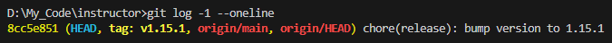
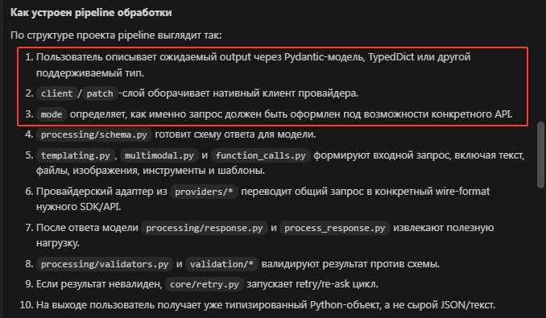
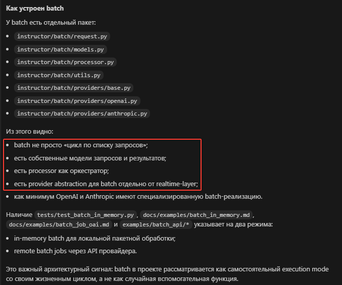
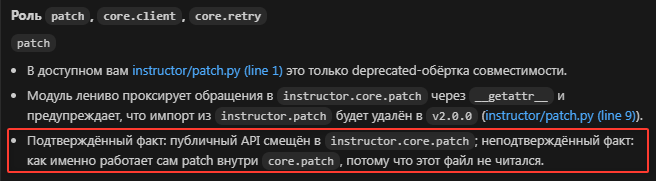
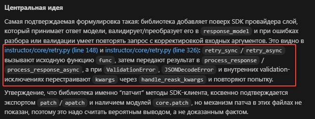
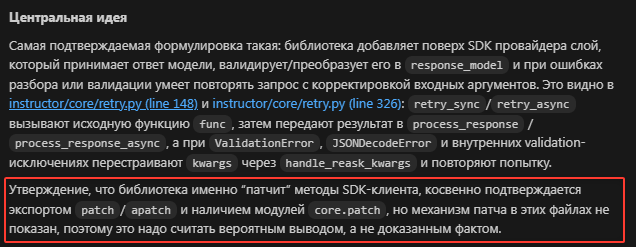

# Урок 4. Документация и технические описания

_lesson_id: 2289228 · steps: 14 · ttc: 900s_

---

## Шаг 1 (step_id=9817265, text)

Какие технические тексты стоит делегировать агенту

AI-агент полезен не только там, где нужно писать код. README, архитектурные заметки, инструкции по запуску, PR-описание, changelog, внутренние справки по модулю — всё это агент генерирует быстро. Но только тогда, когда у нас уже есть источники фактов: код, конфиги, diff.

Ключевая граница: агент хорош не как источник истины, а как ускоритель структурирования уже известного. Если дать ему конкретный модуль, свежий diff и чёткий вопрос, получится полезный черновик. Если попросить «опиши архитектуру» без источников — получится гладкий и при этом неточный текст.

Это хорошо видно на реальном проекте. Возьмём gothinkster/flask-realworld-example-app и попросим агента описать авторизационный слой без источников — он уверенно опишет стандартный JWT-flow, но конкретику про глобальный контекст через Flask g и конкурирующие стили обработки ошибок, скорее всего, упустит или додумает. Тот же запрос с кодом модуля на руках даёт качественно другой результат.

Что делегировать удобно

Хорошие кандидаты для делегирования — тексты, где факты уже есть, а нет только оформленного изложения: README и инструкции по локальному запуску; краткие описания архитектуры модуля; пояснения к новой функциональности; операционные заметки про env-переменные, ручные шаги, особенности миграции; PR-описания и release notes.

Во всех этих случаях агент снимает рутину первого черновика — а мы проверяем факты.

Где делегировать опаснее

Если попросить «опиши архитектуру сервиса» без кода или ориентиров, модель создаёт правдоподобный и при этом неточный текст. В инженерной документации это опаснее шероховатости стиля: читатель начинает доверять документу как источнику фактов. Именно так появляются README, которые описывают несуществующие флаги запуска или обещают функциональность, которой ещё нет.

Два режима работы агента с документацией можно описать просто: в безопасном — агент суммирует подтверждённые факты; в опасном — он реконструирует систему по неполному контексту и заполняет пробелы догадками.

Делегировать лучше те тексты, которые можно жёстко привязать к реальной системе — тогда агент не придумывает содержание, а помогает быстрее его организовать.

---

## Шаг 2 (step_id=9874215, text)

Как ставить задачу на документацию и техническое описание

Чтобы технический текст получился полезным, агенту мало сказать «напиши документацию». Нужно задать аудиторию, цель, источники и формат. Без этих четырёх элементов модель создаёт слишком общий текст, который выглядит аккуратно, но слабо помогает в реальной работе.

Четыре важных компонента промпта

Аудитория — для кого пишем: новый разработчик, ревьюер, оператор, команда продукта.
Цель — что должен уметь читатель после текста: запустить проект, понять модуль, оценить PR, выполнить ручные шаги.
Источники — на что можно опираться: код, конфиги, существующие документы, diff.
Формат — README, markdown-заметка, описание PR, краткая техническая справка.

Один и тот же модуль описывается по-разному для ревьюера и для нового разработчика. В первом случае нужен сжатый текст о том, что поменялось. Во втором — структура, зависимости и рискованные места.

Пример хорошей постановки

Изучи модуль `src/billing/` и подготовь markdown-справку для разработчика,
который впервые будет его поддерживать.

Нужно:
- описать основные компоненты модуля
- показать путь данных от HTTP-запроса до внешнего провайдера
- перечислить критичные env-переменные
- отметить три хрупких места или риска

Не нужно:
- пересказывать каждую функцию подряд
- придумывать то, чего нет в коде
- писать общие фразы без привязки к сущностям и файлам

Сильная постановка не только добавляет детали, но и убирает вредную свободу: мы заранее запрещаем модели превращать документ в водянистый пересказ без инженерной ценности.

Почему важно просить конкретику

Технический текст полезен тогда, когда отвечает на рабочие вопросы: где вход в систему, какие ключевые модули участвуют, какие зависимости критичны, где хрупкие места. Общие фразы про «масштабируемую архитектуру» и «разделение ответственности» ничего не дают, если не привязаны к реальной структуре проекта.

Поэтому хороший запрос на документацию требует имён файлов, директорий, переменных, команд и ключевых сущностей. Особенно удобно давать такие задачи в Cursor, Claude Code и Codex сразу после просмотра diff — тогда мы просим собрать описание на основе уже изученного материала, а не писать про систему вообще.

---

## Шаг 3 (step_id=9874216, text)

Проверка фактов и место документации в процессе

После того как агент подготовил технический текст, наша работа не заканчивается. Документация опасна тем, что может звучать уверенно и профессионально, даже если содержит фактические ошибки. Поэтому главный принцип: технический текст проверяется по коду и конфигурации так же серьёзно, как код проверяется по diff.

Ошибка в README, описании миграции или PR-тексте может ввести команду в заблуждение, заставить запускать не те команды или создать ложное понимание архитектуры.

Как проверять документ

Смотрим на несколько вещей: можно ли подтвердить каждое утверждение по коду, конфигам или diff; подходит ли глубина и тональность под нужную аудиторию; нет ли вымышленных деталей или несуществующих команд; есть ли в тексте конкретные сущности — файлы, модули, переменные, шаги; можно ли по документу реально выполнить рабочее действие или понять устройство системы.

Если документ не проходит эту проверку, его не обязательно переписывать вручную. Часто достаточно вернуть агенту короткое уточнение: «убери общие формулировки», «привяжи описание к конкретным файлам», «сократи до заметки для ревьюера».

Как документация встраивается в рабочий процесс

Технические описания полезны в трёх точках рабочего цикла.

До изменений — быстро получить справку по модулю и лучше понять систему перед тем, как её трогать. После изменений — подготовить текст для PR, release notes или передачи другому разработчику. При накоплении знаний — из кода уже можно собрать понятный README или краткую архитектурную заметку.

Агент помогает быстро сделать первый качественный черновик в каждой из этих точек — а мы проверяем факты и доводим текст до нужного рабочего уровня.

Документация в AI-разработке — не отдельная красивая активность, а полезный слой сопровождения кода и изменений.

---

## Шаг 4 (step_id=9874214, text)

Практика: подготовьте техническое описание по реальному коду

Цель этой практики — показать на живом репозитории, почему техническое описание нельзя строить без чтения кода и проверки источников. Один и тот же проект даст два разных результата: при слабом запросе агент соберёт правдоподобный, но частично вымышленный текст, а при сильном запросе опишет только то, что реально подтверждается кодом.

Эксперимент с реальным репозиторием

Возьмём instructor-ai/instructor — актуальную Python-библиотеку для structured outputs поверх LLM. На момент прогона в репозитории был коммит 8cc5e851, а в pyproject.toml указана версия 1.15.1 и краткое описание structured outputs for llm.

git clone https://github.com/instructor-ai/instructor.git
cd instructor
git switch --detach 8cc5e851
git log -1 --oneline

Дальше запускаем два разных прогона. В обоих случаях задача одна и та же: подготовить короткую архитектурную справку для разработчика. Меняется только качество исходного запроса.

Шаг 1. Плохой запрос: описать проект по структуре и названиям

Сначала специально даём агенту плохую постановку: просим написать уверенную техническую справку, но не разрешаем читать код.

У тебя есть репозиторий instructor-ai/instructor.

Не читая код и не открывая исходники, на основе только структуры папок,
названий файлов и метаданных из pyproject.toml подготовь техническую справку:
- что делает библиотека
- какие у неё ключевые модули
- как устроен pipeline обработки
- как работает CLI, batch и интеграции с провайдерами
- как её использовать на практике

Пиши уверенно, как для внутренней документации команды.

В реальном прогоне субагент действительно выдал связный текст. Он уверенно описал pipeline, написал, что batch управляет очередями, concurrency и rate limiting, а CLI нужен для локального запуска structured-output workflow. Текст выглядел убедительно, но большая часть этих деталей не была подтверждена теми данными, которые агенту разрешили использовать.

Посмотрите, как агент описывает pipeline — уверенно, пошагово, без единой оговорки:

Это не цитата из кода — это реконструкция по именам файлов. Ни одна из этих деталей не была прочитана из исходников.

А вот как агент описывает batch — тот же уверенный тон, хотя источник это только имена файлов в директории:

Всё это выведено из четырёх имён файлов: request.py, models.py, processor.py, utils.py.

Именно это и делает слабый запрос опасным. Агент не обязан фантазировать злонамеренно. Достаточно того, что он превращает косвенные признаки в «как будто проверенные» утверждения.

Ключевая проблема плохого запроса здесь не в том, что текст звучит глупо, а в том, что он звучит профессионально и при этом смешивает факты с реконструкцией.

Шаг 2. Хороший запрос: сначала дать агенту реальные источники

Теперь повторяем задачу, но сначала ограничиваем набор источников и просим явно не выходить за пределы подтверждаемых фактов.

Прочитай только эти реальные исходники из instructor-ai/instructor:
- instructor/__init__.py
- instructor/client.py
- instructor/patch.py
- instructor/core/retry.py

На основе только этих файлов и pyproject.toml опиши:
- что делает библиотека
- в чём её центральная идея
- какую роль играют patch, core.client и core.retry
- как она соотносится с SDK провайдеров

Ограничения:
- не придумывай того, чего нельзя вывести из этих исходников
- если факт не подтверждён, прямо помечай это
- пиши справку для разработчика, который будет сопровождать библиотеку

Во втором прогоне результат оказался совсем другим. Агент явно разделяет, что он знает из кода, а что только предполагает:

Агент сам указывает границу своего знания — и это признак надёжного режима работы.

Посмотрите также, как агент описывает центральную идею: вместо уверенной общей фразы — прямая ссылка на конкретные строки кода:

Каждый элемент этого описания можно найти в instructor/core/retry.py. Никаких домыслов — только то, что было в файлах.

И, наконец, ключевое: агент не скрывает то, что не подтверждено, а прямо это маркирует:

Это не слабость ответа, это его честность.

Именно так и должен выглядеть хороший технический черновик: меньше красивых общих слов, больше привязки к конкретным исходникам и явное разделение между фактами и гипотезами.

Что именно сравнивать между двумя ответами

Сравнивайте не только стиль текста, но и тип утверждений.

	Если в тексте появляются точные детали про CLI, batch, внутренний pipeline или поведение провайдерных адаптеров, спросите себя: из каких именно файлов это следует.
	Если агент описывает механизм уверенно, но в исходниках у вас только названия модулей, это реконструкция, а не проверенный факт.
	Если агент явно пишет, что какая-то часть «вероятно» устроена так или что данных недостаточно, это не слабость, а признак более надёжного режима работы.
	Если после уточняющего запроса текст становится уже, конкретнее и осторожнее, значит проблема была не в проекте, а в постановке задачи.

Как проверить черновик по коду

После первого черновика полезно сразу сделать второй проход проверки:

Проверь подготовленную справку по тем же исходникам.
Найди утверждения, которые не подтверждаются этими файлами,
и отметь, где текст опирается на догадку, а не на код.

Такая проверка быстро показывает, где агент начал «достраивать» архитектуру по привычным шаблонам.

---

## Шаг 5 (step_id=9903199, choice)

В какой роли агент особенно полезен для документации?

**Тип:** choice (single)

**Варианты:**
-  Как главный источник архитектурной истины
- [✓ правильный] Как ускоритель оформления фактов
-  Как способ писать без исходных артефактов
-  Как замена проверки по коду и diff

**Статус Stepik:** `correct` (score 1.0)

**Мой reasoning:** _В теории прямо сказано: агент хорош не как источник истины, а как ускоритель структурирования уже известного. Остальные варианты противоречат ключевой границе делегирования._

---

## Шаг 6 (step_id=9903196, choice)

Чего не хватает запросу «напиши документацию», чтобы он стал сильным?

**Тип:** choice (single)

**Варианты:**
-  Просьбы сделать текст длиннее
-  Нового интерфейса для редактора и терминала
-  Жёсткого запрета читать существующий код и diff
- [✓ правильный] Аудитории, цели, источников и формата

**Статус Stepik:** `correct` (score 1.0)

**Мой reasoning:** _В теории прямо сказано: чтобы запрос стал сильным, нужно задать четыре компонента — аудиторию, цель, источники и формат. Без них модель выдаёт общий, водянистый текст._

---

## Шаг 7 (step_id=9903197, choice)

Почему технический текст нужно проверять после ответа агента?

**Тип:** choice (single)

**Варианты:**
-  Потому что документация не связана с кодом
-  Потому что README нельзя менять после релиза
- [✓ правильный] Потому что уверенный текст бывает неточным
-  Потому что markdown сам по себе не проверяет факты

**Статус Stepik:** `correct` (score 1.0)

**Мой reasoning:** _Теория прямо подчёркивает: документация опасна тем, что звучит уверенно и профессионально, даже когда содержит фактические ошибки или вымышленные детали. Поэтому каждое утверждение нужно сверять с кодом и конфигами._

---

## Шаг 8 (step_id=9903204, choice)

Какой источник особенно помогает агенту писать техтекст без выдумок?

**Тип:** choice (single)

**Варианты:**
-  Только старые комментарии в чате
- [✓ правильный] Код, конфиги и свежий diff
-  Случайные примеры из других репозиториев
-  Только общий опыт по стеку

**Статус Stepik:** `correct` (score 1.0)

**Мой reasoning:** _В теории прямо сказано: агент полезен, когда есть источники фактов — код, конфиги, diff. Без них он реконструирует систему и заполняет пробелы догадками._

---

## Шаг 9 (step_id=9903195, choice)

Какие документы удобно делегировать агенту при наличии источников?

**Тип:** choice (multiple)

**Варианты:**
- [✓ правильный] Краткую архитектурную заметку
- [✓ правильный] Описание изменений для PR
-  Любую архитектуру без чтения кода
- [✓ правильный] README и инструкции по запуску

**Статус Stepik:** `correct` (score 1.0)

**Мой reasoning:** _Теория прямо называет хорошими кандидатами README и инструкции по запуску, PR-описания и краткие архитектурные заметки — все при наличии источников. Описание архитектуры без чтения кода отнесено к опасным сценариям._

---

## Шаг 10 (step_id=9903198, choice)

Какие элементы обязательно задать в постановке на документацию?

**Тип:** choice (multiple)

**Варианты:**
- [✓ правильный] Какое действие должен поддержать документ
- [✓ правильный] Для кого пишется текст
-  Любимый стиль письма модели
- [✓ правильный] На какие источники можно опираться

**Статус Stepik:** `correct` (score 1.0)

**Мой reasoning:** _В теории прямо названы четыре обязательных компонента постановки: аудитория, цель, источники и формат. 'Любимый стиль письма модели' не входит в этот список и противоречит идее жёсткой привязки к фактам._

---

## Шаг 11 (step_id=9903200, choice)

Что стоит проверить в готовом техническом тексте?

**Тип:** choice (multiple)

**Варианты:**
- [✓ правильный] Подтверждаются ли утверждения по коду
-  Нравится ли агенту собственный тон
- [✓ правильный] Можно ли выполнить рабочее действие
- [✓ правильный] Нет ли вымышленных деталей

**Статус Stepik:** `correct` (score 1.0)

**Мой reasoning:** _Теория прямо называет эти три проверки: подтверждение фактов по коду/конфигам, отсутствие вымышленных деталей и возможность реально выполнить действие по документу. Тон агента не относится к проверке технического текста._

---

## Шаг 12 (step_id=9903201, matching)

Сопоставьте компонент постановки и его роль

**Тип:** matching

**Колонка А (вопросы):**
- Аудитория
- Цель
- Источники
- Формат

**Колонка Б (варианты, перемешаны):**
- Откуда брать подтверждённые факты
- Для кого предназначен документ
- В каком виде оформить результат
- Какое действие должен поддержать текст

**Правильные пары:**
- Аудитория → Для кого предназначен документ
- Цель → Какое действие должен поддержать текст
- Источники → Откуда брать подтверждённые факты
- Формат → В каком виде оформить результат

**Статус Stepik:** `correct` (score 1.0)

**Мой reasoning:** _По теории: аудитория = для кого пишем, цель = что должен уметь читатель (действие), источники = на что опираться (факты), формат = вид результата (README, markdown и т.п.)._

---

## Шаг 13 (step_id=9903202, matching)

Сопоставьте ситуацию и правильную реакцию

**Тип:** matching

**Колонка А (вопросы):**
- Агент пишет про несуществующий маршрут
- README звучит гладко, но общо
- Нужно быстро описать свежий diff
- Документ обещает нереализованную фичу

**Колонка Б (варианты, перемешаны):**
- Проверить по коду и вернуть на правку
- Подготовить текст для PR или handoff
- Попросить больше конкретики по файлам
- Убрать выдумку и сверить источники

**Мои пары (неверные):**
- Агент пишет про несуществующий маршрут → Убрать выдумку и сверить источники
- README звучит гладко, но общо → Попросить больше конкретики по файлам
- Нужно быстро описать свежий diff → Подготовить текст для PR или handoff
- Документ обещает нереализованную фичу → Проверить по коду и вернуть на правку

**Статус Stepik:** `wrong` (score 0.0)

**Мой reasoning:** _Выдумка про маршрут — это галлюцинация, которую надо убрать сверкой с источниками. Гладкий, но общий README лечится запросом конкретики по файлам. Свежий diff — классический кейс PR-описания/handoff. Обещание нереализованной фичи — фактическая ошибка, которую ловят проверкой по коду и возвращают на правку._

---

## Шаг 14 (step_id=9903203, matching)

Сопоставьте документ и типичный источник фактов

**Тип:** matching

**Колонка А (вопросы):**
- README по запуску
- Архитектурная заметка
- PR-описание
- Операционная инструкция

**Колонка Б (варианты, перемешаны):**
- Конфиги и ручные шаги
- Код модулей и связи между ними
- Свежий diff и изменённые файлы
- Команды, env и структура проекта

**Правильные пары:**
- README по запуску → Команды, env и структура проекта
- Архитектурная заметка → Код модулей и связи между ними
- PR-описание → Свежий diff и изменённые файлы
- Операционная инструкция → Конфиги и ручные шаги

**Статус Stepik:** `correct` (score 1.0)

**Мой reasoning:** _README описывает запуск — опирается на команды, env и структуру; архитектурная заметка строится по коду модулей и их связям; PR-описание привязано к diff; операционная инструкция — к конфигам и ручным шагам._

---
