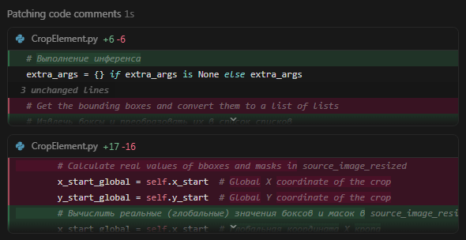
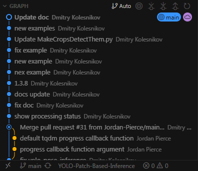
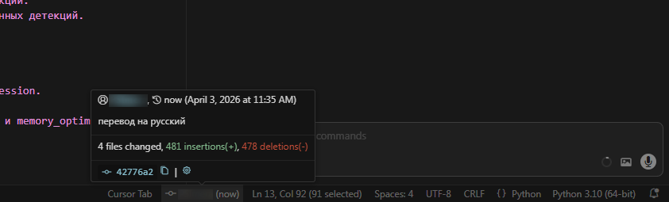
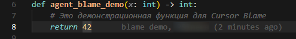
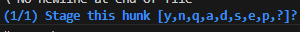
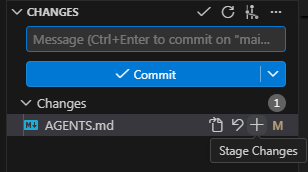
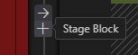
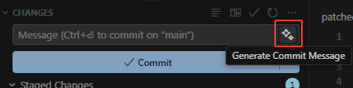

# Урок 5. Git и оформление изменений

_lesson_id: 2289229 · steps: 13 · ttc: 852s_

---

## Шаг 1 (step_id=9817266, text)

С чего начинать оформление изменений после работы агента

После агентной сессии рабочее дерево обычно выглядит не так, как мы ожидали. Основная правка — на месте, но рядом с ней почти всегда есть что-то ещё: попутная полировка, временный лог, случайно переписанный текст, обновлённый документ. Всё это лежит в одной куче, и коммитить эту кучу целиком — плохая идея.

Git здесь играет ту же роль, что и при ревью патча: возвращает нас от общего впечатления к фактам. Сначала смотрим, что именно изменилось, и только потом решаем, что войдёт в историю.

Как это выглядит на практике

Начинаем с короткого цикла: ветка, статус, карта файлов, детальный diff.

git branch --show-current
git status --short
git diff --stat
git diff

git diff --stat — первая остановка. Он показывает только имена файлов и число изменённых строк, без деталей кода. Часто уже здесь видно, вышел ли агент за границы задачи.

В Cursor и VS Code тот же цикл проходит через панель Source Control: список изменённых файлов слева, diff в основном редакторе. В Claude Code и Codex удобнее начинать с команд в терминале. Интерфейс разный, логика одна.

Как разные инструменты работают с git

Поведение агентов в отношении git различается — и это важно понимать до того, как смотреть на рабочее дерево.

Claude Code по умолчанию не делает коммиты без явной команды. Зато у него есть флаг --worktree (или сокращённо -w): он создаёт изолированную копию репозитория в .claude/worktrees/<name>/ с собственной веткой. Агент работает там и не трогает рабочую ветку, пока мы не решим принять патч. Когда сессия завершается без изменений, воркдерево удаляется автоматически; если изменения есть — Claude предлагает выбор: оставить или удалить.

# Запустить агента в изолированном воркдереве
claude --worktree feature-auth

# Или с автогенерированным именем
claude --worktree

Это особенно полезно при параллельной работе: можно держать несколько сессий одновременно, каждая — в своём воркдереве, на своей ветке, без конфликтов.

Codex CLI по умолчанию запускается в режиме workspace-write — это песочница, которая ограничивает доступ к файлам рамками проекта. При этом директория .git/ защищена даже в этом режиме: команды вроде git commit потребуют явного подтверждения. Это осознанное решение — чтобы агент не коммитил без нашего ведома. Если хочется убедиться наверняка, в конфигурации можно явно заблокировать коммиты:

# В ~/.codex/config.toml — запретить git commit
[rules]
deny = ["git commit"]

В Codex также есть настройка commit_coauthor_trailer, которая добавляет в сообщение коммита строку Co-authored-by: Codex. По умолчанию она включена — это удобно, когда нужно понять при ревью, что именно написал агент.

Cursor работает иначе — это IDE, и взаимодействие с git здесь визуальное. После агентного прохода изменения отображаются в Source Control, и там же можно принять или отклонить отдельные правки. Cursor также делает автоматические чекпоинты во время агентного прохода — снимки состояния, к которым можно откатиться, если что-то пошло не так.

Плюс у Cursor есть фоновые агенты, которые работают на отдельных ветках и могут открывать PR напрямую из интерфейса.

Ещё одна примечательная вещь в Cursor — Cursor Blame, аналог стандартного git blame, который дополнительно показывает, какие строки были написаны агентом, а какие — человеком.

При ревью это помогает быстро понять контекст изменения.

С чего начинать — независимо от инструмента

Несмотря на разницу в интерфейсах, отправная точка одна: сначала смотрим на карту изменений, потом принимаем решения. Это значит — до staging и до коммита нужно ответить на три вопроса: какие файлы реально изменились, ожидали ли мы именно этот набор и нет ли в рабочем дереве правок, которые не относятся к текущей задаче.

Если агент работал в воркдереве (Claude Code) или в изолированной ветке (Cursor Background Agents), у нас есть время осмотреться, не рискуя основной веткой. Если он работал прямо в рабочем дереве — тем важнее сделать этот осмотр до того, как что-то попадёт в историю.

В следующем шаге разберём, как из этого рабочего дерева — каким бы пёстрым оно ни было — собрать один понятный коммит.

---

## Шаг 2 (step_id=9874219, text)

Как собирать коммит из реального набора правок

Когда рабочее дерево понятно, следующий вопрос: что именно мы хотим сохранить в историю. Хороший коммит связан с одной причиной. Он не обязан быть микроскопическим, но у него должна быть ясная граница.

После работы агента это особенно важно. Одна сессия может оставить в репозитории код, тесты, стили и документацию. Если сохранить всё вместе без разбора, получится история не про задачу, а про то, как модель двигалась по соседним идеям.

Простой тест для границы коммита

Попробуйте объяснить будущий коммит одной фразой. Например: «исправить отображение дедлайнов», «добавить smoke-проверку», «обновить README под текущее состояние проекта». Если в объяснении сразу появляются несколько разных причин — коммит, скорее всего, собран слишком широко.

Staging — промежуточный слой между сессией и историей

Staging позволяет взять из рабочего дерева не всё подряд, а только тот срез, который действительно хотим сохранить. Именно поэтому этот промежуточный слой остаётся важным в AI-разработке: он превращает неидеальный агентный проход в понятный инженерный результат.

Стандартный сценарий: прочитали весь diff, выделили один причинно связанный срез, добавили в staging только его, оставшиеся изменения либо отложили, либо оформили отдельно.

Интерактивный staging: git add -p

Когда агент за один проход изменил и навигацию, и попутно поправил стили — git add файл целиком не подойдёт: оба изменения окажутся в одном коммите. Здесь пригодится git add -p — интерактивный режим, в котором Git предлагает каждый кусок изменений отдельно.

git add -p

Git разбивает diff на hunks — фрагменты изменений — и для каждого показывает такой запрос:

@@ -12,6 +12,8 @@ def get_articles():
     articles = Article.query.all()
+    # добавлена пагинация
+    page = request.args.get('page', 1)

(1/1) Stage this hunk [y,n,q,a,d,s,e,p,?]?

Буквы в скобках — это команды:

	y (yes) — взять этот фрагмент в staging;
	n (no) — пропустить;
	q (quit) — выйти, всё уже отмеченное останется в staging;
	a (all) — взять этот и все оставшиеся фрагменты файла;
	d (don't) — пропустить этот и все оставшиеся фрагменты файла;
	s (split) — разбить hunk на ещё более мелкие части, если между изменениями есть строки контекста;
	e (edit) — открыть hunk в редакторе и вручную отредактировать, какие строки брать;
	p (print) — ещё раз показать текущий hunk;
	? — показать справку прямо в терминале.

Самый частый сценарий: идём по фрагментам с y и n, пока не отберём нужный срез. Если hunk слишком большой — жмём s, Git дробит его дальше и снова спрашивает. Если в одном файле все нужные изменения идут подряд — проще нажать a, чем подтверждать каждый по одному.

Таким образом, из одного агентного прохода можно собрать два аккуратных коммита: сначала зафиксировать основную правку, потом — косметику. Каждый коммит останется понятным и обратимым.

В Cursor и VS Code то же самое доступно визуально: в панели Source Control можно разворачивать изменения по файлам

Либо открыв diff добавлять в staging по частям, через интерфейс.

Агент на этом этапе — помощник, не ответственный

Агент полезен и здесь: можно попросить перечислить изменённые файлы, предложить разбиение на коммиты или набросать варианты сообщений. Но финальное решение о структуре истории — за нами. Агент не знает, что важно для вашей команды и как принято оформлять изменения в этом репозитории.

---

## Шаг 3 (step_id=9874218, text)

Commit message и PR-описание после агентной сессии

Когда срез изменений собран, остаётся коротко и честно объяснить его другим людям — и будущему себе. Для этого нужны понятный commit message и нормальный текст для ревью. Оба текста должны объяснять инженерную причину изменения, а не пересказывать весь ход агентной сессии.

Что должно быть в commit message

Хорошее сообщение отвечает на вопрос: что именно изменилось и зачем. update files или fix stuff не помогает ни при чтении истории, ни при поиске по репозиторию. Намного полезнее короткая фраза с предметом изменения: update README for project onboarding или preserve next lesson link in dashboard.

Если сообщение начинает перечислять через запятую несколько несвязанных действий — это сигнал вернуться назад и проверить, не слишком ли широк коммит.

Conventional commits

Большинство современных проектов использует conventional commits — соглашение о формате сообщений: тип изменения, необязательный скоуп и краткое описание.

feat: добавить пагинацию в список статей
fix: сохранять токен после перезапуска приложения
docs: обновить README под текущий каркас
refactor: упростить логику формирования дедлайнов
test: добавить smoke-проверку для /health

Это не формальность. Такой формат делает историю сканируемой: по первому слову сразу видно, что перед нами — новая функциональность, исправление, документация или рефакторинг. Агенты его понимают и, если попросить, сами придерживаются этого формата. Плюс на основе conventional commits легко автоматизировать changelog и семантическое версионирование.

Cursor умеет генерировать сообщения коммитов прямо из интерфейса: в панели Source Control есть кнопка со значком искры, которая смотрит на staged changes и предлагает вариант.

Claude Code, Codex или другого агента можно попросить сформулировать сообщение после завершения прохода — он учтёт контекст сессии. В любом случае предложенный текст стоит проверить: агент иногда описывает весь diff сразу, не разбирая его на отдельные смысловые части.

Что стоит написать в PR

После AI-правок ревьюеру особенно важно быстро понять границы задачи. Поэтому полезный PR-текст держится на четырёх вещах: какую цель решали, что вошло в изменения, как проверяли результат и что сознательно оставили вне scope.

Цель:
- что нужно было улучшить

Вошло:
- какие файлы или части системы реально изменились

Проверка:
- какие команды, тесты или ручные сценарии запускались

Вне scope:
- что сознательно не трогали в этом проходе

Такой текст не украшает патч, а экономит время ревьюеру. Он сразу показывает: изменение было узким, его проверили, соседние идеи не смешали в тот же проход.

История коммитов как контекст для будущих сессий

Понятная история коммитов — это не только удобство при ревью. Когда мы в следующей сессии просим агента разобраться, что изменилось за последнюю неделю, или объяснить, почему функция выглядит именно так — качество ответа напрямую зависит от качества сообщений в истории. fix stuff не даёт агенту никакого контекста. fix: сохранять токен после перезапуска приложения — даёт.

---

## Шаг 4 (step_id=9874217, text)

Практика: упакуйте узкое изменение в Git

В этой практике мы не придумываем новый продуктовый шаг. Задача — посмотреть на то, что уже есть в репозитории после предыдущих уроков, и навести порядок.

Проверьте состояние репозитория

Начнём с того, что вообще происходит в проекте прямо сейчас:

git branch --show-current
git status --short
git log --oneline -10

Посмотрите на последние коммиты. Скорее всего, среди них найдётся что-то, что можно было бы организовать иначе: слишком широкий коммит, который захватил и навигацию, и стили, и README заодно; или наоборот — незакоммиченные изменения, которые так и лежат в рабочем дереве с прошлого урока.

Возможны два сценария:

Сценарий A: есть незакоммиченные изменения

Если в рабочем дереве что-то лежит незакоммиченным — это хороший материал для практики. Смотрим на diff:

git diff --stat
git diff

Теперь применяем то, что разобрали в шаге 2: читаем карту файлов, делим изменения на смысловые группы и собираем staging через git add -p, а не целыми файлами.

git add -p

Для каждого hunk отвечаем: это ядро задачи — y, это попутная косметика — n, hunk слишком большой — s, чтобы разбить его дальше. Первый коммит — только основное изменение. Остаток — отдельным коммитом или сбрасываем, если это мусор:

git checkout -- app/static/css/main.css  # сбросить конкретный файл

Сценарий Б: рабочее дерево чистое, но коммиты широкие

Если всё уже закоммичено, откройте историю и честно оцените последние несколько коммитов:

git log --oneline -10
git show <hash> --stat

Задайте себе те же вопросы, что при ревью патча: можно ли объяснить каждый коммит одной фразой? Нет ли коммитов, где в одно сообщение попали и функциональность, и стили, и документация? Понятно ли из сообщений, что именно менялось и зачем?

Если коммиты получились слишком широкими — не нужно их переписывать. Просто зафиксируйте для себя, где граница размылась, и в следующем проходе используйте git add -p с самого начала.

Оформите PR-описание

Независимо от сценария — попросите агента набросать описание последнего сделанного изменения для ревью:

Посмотри на последние коммиты и подготовь короткое описание для ревью.
Укажи цель, что вошло, как проверяли и что осталось вне scope.
Пиши кратко, без общих фраз.

Проверьте результат: всё ли в описании можно подтвердить по коду, нет ли общих фраз без привязки к конкретным файлам, понятно ли ревьюеру, что именно не входило в эту задачу.

Что считать завершением шага

Практика выполнена, если вы осознанно посмотрели на состояние репозитория, разобрали хотя бы одно изменение через git add -p или оценили структуру уже сделанных коммитов, и можете объяснить каждый из них одной фразой.

---

## Шаг 5 (step_id=9914805, choice)

С чего начинается нормальное оформление изменений после работы агента?

**Тип:** choice (single)

**Варианты:**
- ✓ С просмотра ветки, статуса и diff
- ○  С полного переписывания затронутых файлов
- ○ С немедленного commit всех правок
- ○ С удаления всего, что менял агент за сессию

---

## Шаг 6 (step_id=9914810, choice)

Какой признак лучше всего описывает хороший commit?

**Тип:** choice (single)

**Варианты:**
- ○ Его сообщение перечисляет максимум деталей diff
- ✓ Он связан с одной причиной изменения
- ○ В него попало всё из одной агентной сессии
- ○ В нём обязательно есть код, тесты и README

---

## Шаг 7 (step_id=9914808, choice)

Зачем нужен staging после агентного прохода?

**Тип:** choice (single)

**Варианты:**
- ○ Чтобы скрыть лишние файлы от git log
- ○ Чтобы агент автоматически сделал PR
- ○ Чтобы заменить ручную проверку интерфейса
- ✓ Чтобы собрать нужный срез изменений

---

## Шаг 8 (step_id=9914806, choice)

Что стоит проверить в PR-описании после AI-правок?

**Тип:** choice (single)

**Варианты:**
- ○ Что текст получился длиннее commit message
- ○ Что в нём есть вся история агентной сессии
- ○ Что оно перечисляет все идеи на будущее сразу
- ✓ Что цель и проверка названы ясно

---

## Шаг 9 (step_id=9914804, choice)

Что помогает держать границу commit узкой?

**Тип:** choice (multiple)

**Варианты:**
- ○ Объяснить commit одной фразой
- ○ Отложить попутные изменения отдельно
- ○ Держать вместе код и тесты по одной задаче
- ○ Использовать staging по смысловым кускам

---

## Шаг 10 (step_id=9914807, choice)

Какие пункты полезно включить в PR-описание?

**Тип:** choice (multiple)

**Варианты:**
- ✓ Как проверяли результат
- ✓ Что вошло в изменения
- ✓ Цель изменения
- ○ промпт агенту

---

## Шаг 11 (step_id=9914809, matching)

Сопоставьте действие и его роль

**Тип:** matching

**Правильные пары:**
- git diff --stat → Быстро показать карту изменений
- git diff → Дать детали по строкам
- git add -p → Отобрать только нужные hunks
- git status --short → Показать текущее состояние файлов

---

## Шаг 12 (step_id=9914803, matching)

Сопоставьте ситуацию и правильную реакцию

**Тип:** matching

**Правильные пары:**
- В diff попала косметика рядом с фиксом → Не тащить всё в один commit
- Hunk слишком крупный → Попробовать `s` и разбить его
- Агент предложил commit message → Проверить смысл и границу
- Рабочее дерево уже чистое → Оценить ширину недавних коммитов

---

## Шаг 13 (step_id=9914802, matching)

Сопоставьте артефакт и его задачу

**Тип:** matching

**Правильные пары:**
- Commit message → Коротко объяснить что и зачем изменили
- Staging → Отделить нужный срез от лишних правок
- PR-описание → Показать цель, проверку и границы задачи
- Узкий commit → Сохранить одну инженерную причину в истории

---
