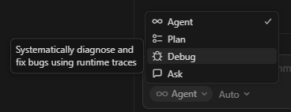
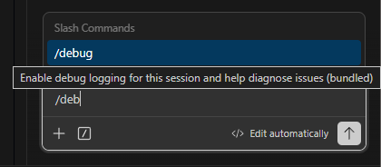
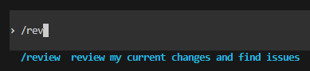
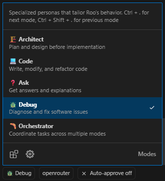

# Урок 1. Debugging с coding agents

_lesson_id: 2289230 · steps: 16 · ttc: 1076s_

---

## Шаг 1 (step_id=9817267, text)

Чем debugging отличается от обычной задачи

Когда вы просите агента добавить фичу или поправить понятный участок кода, у вас уже есть цель: что должно появиться, какие файлы трогать, что считать готовым результатом. В debugging-задаче этого нет. Есть только симптом — ошибка, странное поведение, упавший тест, расхождение между тем, что ожидалось, и тем, что произошло.

Из-за этого простой запрос исправить проблему — плохой старт. Для агента это слишком широко, он начинает заполнять пробелы самостоятельно: сам выбирает предполагаемую причину, сам решает, какие слои трогать — и быстро превращает расследование в преждевременный фикс.

Другая первая цель

В debugging первая цель — сделать проблему воспроизводимой и наблюдаемой. Только после этого имеет смысл строить гипотезы и предлагать правки.

Последовательность такая:

	сначала воспроизведение — потом гипотезы;
	сначала сигналы — потом правки;
	сначала сужение области поиска — потом изменение кода.

Это другой режим, чем написание новой фичи. Там хорошая рамка строится вокруг результата. Здесь — вокруг фактов.

Где агент чаще всего ошибается

Если не задать правильную рамку, агент ошибается не синтаксисом, а ходом расследования:

	предлагает фикс до того, как воспроизвёл проблему;
	объявляет причину найденной без проверки альтернатив;
	тащит в задачу соседние улучшения и cleanup;
	меняет несколько слоёв проекта сразу, хотя источник сбоя ещё не ясен;
	путает симптом с первопричиной.

Это одинаково верно для всех инструментов. В Cursor агент может начать редактировать файлы прямо в IDE, не спросив. Claude Code в терминале может предложить патч уже на первом ответе. Codex может зафиксировать изменение раньше, чем вы успели проверить гипотезу.

Что просить у агента на первом шаге

Хороший первый результат debugging-сессии — не патч, а карта: что сломано, как воспроизвести, где искать причину. На первом проходе просите исследование, а не исправление. Это выглядит примерно так: перечисли связанные файлы, покажи возможные точки сбоя, объясни цепочку данных — и явно добавьте, что код пока менять нельзя. Такой запрос работает и в чате, и в терминальном режиме.

Как именно его оформить — разберём в следующих шагах.

---

## Шаг 2 (step_id=9921528, text)

Как разные инструменты ведут себя при отладке

Прежде чем собирать brief и давать агенту первый запрос, полезно знать, что именно будет делать конкретный инструмент, когда вы описываете баг. Поведение по умолчанию сильно отличается.

Cursor — Debug Mode, Plan Mode, Ask Mode

В Cursor есть специальный Debug Mode. Он работает именно по той схеме, которую описывает этот урок: сначала агент читает кодовую базу и строит несколько гипотез — без немедленного фикса. Потом сам инструментирует код логами под каждую гипотезу. Вы воспроизводите баг, агент собирает runtime-данные (состояния переменных, пути выполнения, тайминги) и только после этого предлагает точечное исправление — обычно 2–3 строки. Потом просит верифицировать и убирает все логи.

Переключить режим: выпадающее меню рядом с полем ввода → Debug.

Если хотите только исследовательский проход без изменений кода — используйте Ask Mode (только Q&A, не трогает файлы). Если нужно построить план перед тем, как агент начнёт что-то менять — Plan Mode (читает кодовую базу, задаёт вопросы, генерирует план с to-do без правок).

В обычном Agent Mode Cursor может начать редактировать файлы сразу после описания проблемы — при отладке это нежелательно.

Claude Code — разрешения и LSP

В Claude Code (терминал, VS Code, JetBrains) инструменты для чтения одобряются автоматически: Read, Glob, Grep, LSP. LSP даёт возможности как в IDE — go-to-definition, find references, hover с типом. Инструменты для записи требуют вашего явного подтверждения.

Это значит, что исследовательский проход технически безопасен по умолчанию: агент может читать весь проект, искать по файлам, смотреть ссылки на функции — и ничего не изменит без вашего разрешения.

Команда /debug в сессии включает debug-логирование прямо в процессе работы.

Если в проекте есть файл CLAUDE.md — добавьте туда строку вроде During debugging sessions: read-only investigation first, no edits without explicit approval. Claude Code подхватит это автоматически и без отдельного напоминания в каждом запросе.

Codex CLI — sandbox и политика одобрений

По умолчанию Codex работает в sandbox: сеть отключена, запись ограничена рабочей директорией, каждое изменение файла или команда требуют подтверждения (--approval-policy on-request). Это уже хорошая защита от преждевременных правок.

Режим --full-auto (он же --yolo) убирает все запросы подтверждения — при отладке его лучше не использовать, особенно на первом исследовательском проходе. /review внутри сессии читает diff без изменений рабочего дерева.

Проектный контекст можно задать в файле AGENTS.md в корне репозитория — аналог CLAUDE.md для Claude Code.

Roo Code — Debug Mode и shell-интеграция

Roo Code имеет явный Debug Mode — отдельный режим. При его использовании агент ограничен инструментами, релевантными для отладки, и не лезет в архитектурные правки.

Shell-интеграция работает автоматически: Roo Code читает вывод терминала в реальном времени, отслеживает exit-коды команд и может замечать ошибки в запущенном приложении без вашего ручного копирования логов.

Windsurf — Cascade и Memories

Windsurf использует агент Cascade, который следит за вашими действиями в реальном времени и сохраняет контекст между сессиями через механизм Memories. При отладке это полезно: агент помнит, что вы уже проверяли в прошлый раз. AI Terminal позволяет запускать команды и сразу видеть вывод в контексте чата.

Trade-off одной строкой: Cursor Debug Mode удобен для UI-багов с runtime-данными. Claude Code лучше работает с большими кодовыми базами через LSP и Grep. Roo Code гибче настраивается и работает с любой моделью. Codex удобен, когда нужна облачная изоляция задачи.

---

## Шаг 3 (step_id=9921454, text)

Технические сигналы: что дать агенту перед расследованием

Чем меньше агент угадывает и чем больше опирается на конкретные факты, тем точнее он локализует сбой. Хорошее расследование начинается не с описания проблемы, а с набора сигналов.

Какие сигналы нужны

	Текст ошибки или stack trace — где именно сломалось выполнение.
	Шаги воспроизведения — что сделать, чтобы увидеть сбой снова.
	Входные данные — какие значения, записи в базе или действия пользователя запускают проблему.
	Логи — какие ветки кода реально проходят во время сбоя.
	Окружение — локально или на сервере, какая версия зависимостей, какие переменные окружения задействованы.

Одного текста ошибки часто не хватает. Если вы передаёте только жалобу — например, страница иногда показывает не тот урок — модель может придумать десяток причин. Если добавить точные шаги, конкретный курс, текущий прогресс и место в интерфейсе, круг поиска резко сужается.

Минимальный воспроизводящий пример

Это самый короткий сценарий, в котором проблема всё ещё повторяется. Его задача — убрать шум: убрать лишние данные, лишние шаги, лишний контекст. Вот как это выглядит на практике:

Было (жалоба):

Dashboard иногда показывает не тот урок.

Стало (минимальный пример):

# Запустить локально:
python app.py

# Открыть:
http://localhost:5000/dashboard          # показывает Урок 3
http://localhost:5000/next-lesson        # показывает Урок 2

# Данные в БД: user_id=1, course_id=1, lesson_2 — не завершён

Для Codex и Claude Code лучше всего работает конкретная команда или запрос — что запустить, что открыть, что сравнить. В Cursor достаточно текстового описания с точными шагами, если рядом уже открыты нужные файлы. В любом случае агент должен получить воспроизводимый маршрут, а не абстрактную жалобу.

Факт против предположения

В debugging легко смешать наблюдение и интерпретацию. Фраза сервис выбора следующего урока сломан — это уже вывод. А для курса с незавершённым уроком на dashboard показывается другой урок, чем на странице next-lesson — это наблюдаемый симптом.

Когда составляете описание, разделяйте факты и предположения явно:

	факт: какой экран, команда или тест дают сбой;
	факт: какие данные использовались;
	факт: что ожидалось и что произошло;
	предположение: какой модуль может быть причиной;
	предположение: какое изменение, возможно, исправит ситуацию.

Чем чище разделены факты и гипотезы, тем меньше шансов, что агент перепрыгнет через расследование прямо к сомнительному фиксу.

---

## Шаг 4 (step_id=9921455, text)

Debugging brief: шаблон и пример

Когда проблема воспроизводится, удобно свести всё в короткий артефакт — debugging brief. Это не документация ради документации: brief нужен, чтобы у вас и у агента была одна и та же карта задачи, а не каждый раз пересказывать контекст с нуля.

Что входит в brief

  Симптом — что именно выглядит сломанным.
  Шаги воспроизведения — как повторить проблему.
  Ожидаемый результат — что должно было произойти.
  Фактический результат — что произошло на самом деле.
  Технические сигналы — ошибка, stack trace, лог, команда, данные, среда.
  Предполагаемая зона поиска — какие файлы или слои выглядят связанными.
  Что пока не менять — чтобы агент не расползался по проекту.

Пример заполненного brief

Симптом:
На dashboard блок "Продолжить обучение" показывает не тот урок.

Шаги воспроизведения:
1. Запустить приложение локально: python app.py
2. Открыть http://localhost:5000/dashboard
3. Открыть http://localhost:5000/next-lesson
4. Сравнить, какой урок предлагается в обоих местах.

Ожидаемый результат:
Обе страницы показывают один и тот же следующий незавершённый урок.

Фактический результат:
На dashboard показывается другой урок или блок пустой.

Технические сигналы:
- локальный запуск проходит
- есть tests/test_smoke.py с частичным покрытием этого сценария
- связанный сервис: app/services/dashboard_service.py
- связанные шаблоны: templates/dashboard.html, templates/next_lesson.html

Предполагаемая зона поиска:
Логика выбора следующего урока и слой шаблонов.

Пока не менять:
Схему базы, стили, навигацию и несвязанные страницы.

  Хороший brief — не длинный, а проверяемый: другой человек или агент должен по нему повторить ваш путь и получить тот же симптом.

Как это работает в разных инструментах

Codex и Claude Code хорошо воспринимают такой brief напрямую в терминале — вставляете его в начало запроса и сразу получаете структурированный ответ, а не общие рассуждения. В Cursor brief удобно вставить в чат: IDE уже видит файлы проекта, и агент может сразу переходить к конкретным местам, а не просить уточнить контекст.

Следующий шаг — взять этот brief и дать агенту первый исследовательский запрос, не разрешая ещё трогать код.

---

## Шаг 5 (step_id=9921456, text)

Первый исследовательский проход без редактирования кода

Возьмите brief из предыдущего шага и дайте агенту первый запрос. Цель — получить карту связанного участка проекта и варианты проверки. Никаких правок пока нет.

Что просить у агента

Шаблон запроса для любого агента выглядит одинаково:

Ниже debugging brief. Изучи связанный участок проекта и помоги локализовать область поиска.

[вставьте brief как текст или ссылку на фаил]

Нужно:
- перечислить только реально связанные файлы;
- объяснить, где формируется нужное поведение;
- если причина неочевидна, назвать 2–4 возможные точки сбоя;
- если проблема выглядит локальной и простой, прямо отметить это и предложить самый вероятный порядок проверки.

Пока не редактируй код и не предлагай финальный фикс.
Если каких-то данных не хватает, явно перечисли что именно.

В Claude Code и Codex CLI этот запрос вставляется прямо в терминал. В Cursor или другом IDE инструменте, вместо ручного запроса можно переключиться в Ask Mode или Plan Mode — оба режима технически предотвращают редактирование файлов.

Как понять, что агент перескочил диагностику

Иногда агент начинает редактировать код, даже если вы этого не просили. Сигналы, что что-то пошло не так:

	в ответе появляется diff или конкретное изменение файла;
	агент уверенно называет одну причину как единственную в неочевидной ситуации, не объясняя, почему другие варианты можно отбросить;
	ответ затрагивает файлы за пределами зоны поиска из brief;
	вместо диагностики появляется сразу «решение», без понятного объяснения, почему оно следует из симптома.

Если видите такое — вернитесь к запросу и явно добавьте: только исследование, без изменений кода, без финального фикса. Это нужно делать в начале запроса, а не в конце. Если работаете в Cursor Agent Mode — переключитесь в Ask Mode или Debug Mode: они технически не позволяют агенту сразу редактировать файлы.

Как оценить качество ответа

Хороший первый ответ агента не обязан быть коротким, но он должен быть проверяемым. После него вы должны понимать:

	какие файлы связаны с симптомом;
	какие из них центральные, а какие вторичные;
	какую гипотезу или какую первую проверку стоит сделать дальше;
	каких данных ещё не хватает.

Не у каждой проблемы должен быть длинный список гипотез. Если симптом локальный, воспроизводится в одном месте и причина почти очевидна, нормальный результат первого прохода — быстро сузить поиск до одной основной версии и коротко объяснить, почему именно с неё стоит начать.

Если после первого прохода хочется спросить «что именно ты сейчас считаешь сломанным?» — расследование ещё не собрано.

В следующем уроке переходим от симптома к гипотезам и разбираем, как проверить, что найденная причина действительно объясняет сбой.

---

## Шаг 6 (step_id=9921457, text)

Практика: debugging brief и первый исследовательский проход

В эту практику нужно входить уже с ошибкой или хотя бы с воспроизводимым подозрительным поведением. Без этого debugging-сессия превращается в абстрактный разговор. Если в вашем StudyFlow или в собственном проекте проблема уже есть, берите её. Если всё пока работает нормально, сначала создайте себе учебный симптом, а потом переходите к brief и исследовательскому проходу.

Если в проекте пока нет ошибки

В StudyFlow есть несколько нормальных способов быстро получить материал для debugging-практики:

	сделать ещё 1–2 небольших изменения в проекте и взять первый реальный сбой, который появится по дороге;
	временно сломать одну локальную часть руками, чтобы потом найти причину и вернуть корректное поведение;
	попросить агента специально внести небольшую регрессию в узкий участок проекта, а затем расследовать её как чужую ошибку.

Если хотите устроить учебную поломку именно в StudyFlow, можно, например, нарушить выбор следующего занятия, чтобы главная страница и страница ближайшего занятия показывали разные результаты, сломать фильтрацию завершённых занятий, чтобы в качестве следующего предлагалось уже пройденное, исказить сортировку, чтобы вместо ближайшего занятия показывалось другое, или сделать так, чтобы блок на главной странице пустел, хотя данные в системе есть.

Если вы создаёте учебную ошибку специально, держите её узкой и обратимой: один симптом, небольшой затронутый участок и понятный способ вернуться к рабочему состоянию после практики.

Шаг 1. Проверьте исходную точку

Перед новым проходом убедитесь, что рабочее дерево чистое:

git branch --show-current
git status --short
git log -1 --oneline

Если есть незакоммиченные изменения, сначала разберите их. Для debugging-сессии важно, чтобы вы не смешивали старый незавершённый проход с новым расследованием.

Шаг 2. Запустите приложение и воспроизведите симптом

В нашем проекте StudyFlow запуск выглядит так (у вас в проекте может быть по другому):

uvicorn app.main:app --reload

После запуска откройте минимум две точки, через которые видно одно и то же поведение, например:

	http://127.0.0.1:8000/ — главная страница;
	http://127.0.0.1:8000/next-lesson — страница ближайшего занятия.

Для примера со StudyFlow мы возьмём симптом, связанный с выбором следующего занятия: проверить, согласован ли он в разных местах интерфейса. Если в вашем репозитории другой продукт, логика та же: запустите приложение своей командой, откройте основной экран и отдельную страницу или действие, где должен проявляться тот же симптом, и сравните фактическое поведение.

Важный момент: для первого debugging-прохода важен не конкретный стек, а воспроизводимый сценарий с понятной точкой входа и наблюдаемым расхождением.

Шаг 3. Заполните debugging brief

Возьмите шаблон из предыдущих шагов урока и заполните его по реальным наблюдениям. Зафиксируйте:

	где именно виден симптом;
	как его воспроизвести;
	что вы ожидали увидеть;
	что увидели на самом деле;
	какие сигналы уже есть: ошибка, логи, входные данные, состояние базы, конкретный маршрут или экран.

Если приложение не стартовало, это тоже нормальный результат для brief. Впишите, на какой команде всё остановилось и какой текст ошибки вы получили.

Шаг 4. Дайте агенту исследовательский запрос

Когда brief заполнен, отправьте агенту запрос такого вида:

Изучи проект по этому debugging brief.

Нужно:
- перечислить только реально связанные файлы;
- показать, где формируется нужное поведение;
- назвать возможные точки сбоя;
- предложить порядок проверки гипотез.

Пока не редактируй код.

Для StudyFlow хороший ответ обычно связывает симптом с маршрутом страницы, сервисным слоем, шаблоном или данными, которые влияют на выбор следующего занятия. Для вашего проекта названия файлов могут быть другими, но структура ответа должна остаться такой же: только связанный участок системы, без раннего фикса и без лишнего обхода репозитория.

Как проверить, что практика выполнена

После этого шага у вас должны быть ответы на три вопроса:

	Где именно в коде формируется нужное поведение?
	Какую гипотезу проверять первой?
	Каких данных ещё не хватает для уверенного фикса?

Если ответа на первый вопрос пока нет, не переходите к исправлению. Сначала сузьте область поиска ещё одним исследовательским запросом.

Где ещё тренироваться на чужих проектах

Когда этот проход станет привычным на StudyFlow, полезно повторить тот же workflow на чужой кодовой базе. Лучше не ограничиваться только знакомой вам областью: сам debugging-процесс одинаково полезно тренировать и на backend, и на frontend, и на других стеках.

	BugsInPy — коллекция реальных Python-багов из публичных проектов с воспроизводимыми версиями и тестами;
	py-bugger — инструмент, который специально вносит ошибки в Python-проект для тренировки отладки;
	debugging_tutorial — учебный набор сломанных примеров, где удобно отрабатывать сам процесс поиска причины;
	BugsJS — набор воспроизводимых багов из публичных JavaScript и Node.js-проектов;
	Defects4J — большая база реальных багов для Java-проектов с командами checkout и тестами.

Если хотите найти похожие источники под свой стек, ищите не просто «buggy repo», а наборы с тремя признаками: воспроизводимая ошибка, инструкция запуска или тест, и отделённая исправленная версия. Полезные запросы: bug benchmark <ваш язык>, reproducible bugs <ваш фреймворк>, bug dataset <ваш стек>, debugging practice repository <ваша область>.

Смысл везде один и тот же: сначала воспроизвести симптом, затем собрать debugging brief, попросить агента локализовать область поиска и только после этого переходить к исправлению.

---

## Шаг 7 (step_id=9922456, choice)

Какая первая цель у debugging-сессии с агентом?

**Тип:** choice (single)

**Варианты:**
-  Найти виноватый файл по одной догадке
- [✓ правильный] Сделать проблему наблюдаемой и воспроизводимой
-  Сразу получить рабочий патч
-  Передать агенту весь репозиторий на переписывание

**Статус Stepik:** `correct` (score 1.0)

**Мой reasoning:** _В теории прямо сказано: «В debugging первая цель — сделать проблему воспроизводимой и наблюдаемой. Только после этого имеет смысл строить гипотезы и предлагать правки.»_

---

## Шаг 8 (step_id=9922451, choice)

Почему запрос исправь проблему плох как старт debugging?

**Тип:** choice (single)

**Варианты:**
- [✓ правильный] Потому что он слишком широк для расследования
-  Потому что он запрещает смотреть логи
-  Потому что с ним можно работать только в IDE
-  Потому что агент не умеет читать ошибки

**Статус Stepik:** `correct` (score 1.0)

**Мой reasoning:** _В теории прямо сказано: для агента запрос 'исправь проблему' слишком широк, он начинает заполнять пробелы сам и превращает расследование в преждевременный фикс._

---

## Шаг 9 (step_id=9922452, choice)

Что должно быть результатом первого прохода агента?

**Тип:** choice (single)

**Варианты:**
-  Финальный фикс с изменениями в коде
-  Список идей для будущих улучшений интерфейса
-  Новый план рефакторинга на весь модуль
- [✓ правильный] Карта связанного участка и точек проверки

**Статус Stepik:** `correct` (score 1.0)

**Мой reasoning:** _В теории прямо сказано: хороший первый результат debugging-сессии — не патч, а карта: что сломано, как воспроизвести, где искать причину. На первом проходе просим исследование, а не исправление._

---

## Шаг 10 (step_id=9922448, choice)

Какой сигнал показывает, что агент перескочил диагностику?

**Тип:** choice (single)

**Варианты:**
-  Он сузил поиск до одной вероятной зоны
-  Он перечислил связанные файлы
- [✓ правильный] Он сразу показывает diff и правки
-  Он запросил недостающие данные

**Статус Stepik:** `correct` (score 1.0)

**Мой reasoning:** _В теории прямо сказано: если в ответе появляется diff или конкретное изменение файла — это сигнал, что агент перескочил диагностику. Остальные варианты описывают нормальное поведение исследовательского прохода._

---

## Шаг 11 (step_id=9922454, choice)

Что полезно включить в debugging brief?

**Тип:** choice (multiple)

**Варианты:**
- [✓ правильный] Уже доступные сигналы и ограничения
-  Полную историю всех прошлых задач в проекте
- [✓ правильный] Шаги воспроизведения
- [✓ правильный] Ожидание и фактический результат

**Статус Stepik:** `correct` (score 1.0)

**Мой reasoning:** _Согласно теории, brief включает симптом, шаги воспроизведения, ожидаемый и фактический результат, технические сигналы и ограничения (что не менять). Полная история прошлых задач не входит — brief должен быть коротким и проверяемым._

---

## Шаг 12 (step_id=9922449, choice)

Какие сигналы помогают агенту в debugging-задаче?

**Тип:** choice (multiple)

**Варианты:**
-  Любые идеи о редизайне соседних экранов
- [✓ правильный] Команда воспроизведения и окружение
- [✓ правильный] Текст ошибки или stack trace
- [✓ правильный] Логи, входные данные и маршрут

**Статус Stepik:** `correct` (score 1.0)

**Мой reasoning:** _Урок прямо перечисляет технические сигналы: текст ошибки/stack trace, шаги воспроизведения, входные данные, логи и окружение. Идеи о редизайне соседних экранов — это посторонний шум, который агенту в debugging не нужен._

---

## Шаг 13 (step_id=9922458, choice)

Что помогает удержать первый проход исследовательским?

**Тип:** choice (multiple)

**Варианты:**
- [✓ правильный] Явный запрет редактировать код
- [✓ правильный] Просьба назвать точки сбоя и порядок проверки
-  Требование сразу выбрать финальный фикс
- [✓ правильный] Просьба перечислить только связанные файлы

**Статус Stepik:** `correct` (score 1.0)

**Мой reasoning:** _Теория прямо говорит: на первом проходе просим карту (связанные файлы, точки сбоя, порядок проверки) и явно запрещаем редактировать код. Требование финального фикса — наоборот, ломает исследовательский режим._

---

## Шаг 14 (step_id=9922450, matching)

Сопоставьте элемент и его роль в debugging brief

**Тип:** matching

**Колонка А (вопросы):**
- Симптом
- Шаги воспроизведения
- Сигналы
- Зона поиска

**Колонка Б (варианты, перемешаны):**
- Где стоит проверять сначала
- Что выглядит сломанным для пользователя
- Какие факты уже доступны
- Как повторить проблему

**Правильные пары:**
- Симптом → Что выглядит сломанным для пользователя
- Шаги воспроизведения → Как повторить проблему
- Сигналы → Какие факты уже доступны
- Зона поиска → Где стоит проверять сначала

**Статус Stepik:** `correct` (score 1.0)

**Мой reasoning:** _Из теории: симптом = что выглядит сломанным, шаги воспроизведения = как повторить, технические сигналы = доступные факты (ошибка, логи, данные), зона поиска = где искать причину._

---

## Шаг 15 (step_id=9922453, matching)

Сопоставьте ситуацию и правильную реакцию

**Тип:** matching

**Колонка А (вопросы):**
- Агент сразу предложил патч
- Симптом не удаётся повторить
- Ответ затрагивает лишние файлы
- Не хватает данных по ошибке

**Колонка Б (варианты, перемешаны):**
- Вернуть его к исследованию
- Сузить область поиска
- Сначала уточнить сценарий
- Явно запросить недостающее

**Правильные пары:**
- Агент сразу предложил патч → Вернуть его к исследованию
- Симптом не удаётся повторить → Сначала уточнить сценарий
- Ответ затрагивает лишние файлы → Сузить область поиска
- Не хватает данных по ошибке → Явно запросить недостающее

**Статус Stepik:** `correct` (score 1.0)

**Мой reasoning:** _Преждевременный патч — возврат к режиму исследования; невоспроизводимый симптом требует уточнения шагов; выход за зону поиска — сузить область; нехватка данных — явно перечислить, чего не хватает._

---

## Шаг 16 (step_id=9922455, matching)

Сопоставьте действие и его цель

**Тип:** matching

**Колонка А (вопросы):**
- Запустить приложение и повторить сбой
- Заполнить debugging brief
- Дать запрос без правок
- Отложить фикс до проверки

**Колонка Б (варианты, перемешаны):**
- Получить карту проблемы
- Подтвердить симптом
- Собрать факты для расследования
- Не спутать гипотезу с причиной

**Правильные пары:**
- Запустить приложение и повторить сбой → Подтвердить симптом
- Заполнить debugging brief → Собрать факты для расследования
- Дать запрос без правок → Получить карту проблемы
- Отложить фикс до проверки → Не спутать гипотезу с причиной

**Статус Stepik:** `correct` (score 1.0)

**Мой reasoning:** _Воспроизведение подтверждает симптом, brief собирает факты, исследовательский запрос без правок даёт карту проблемы, а откладывание фикса предотвращает путаницу гипотезы с причиной._

---
