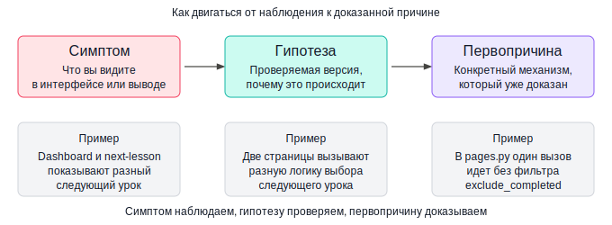
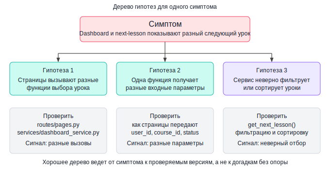
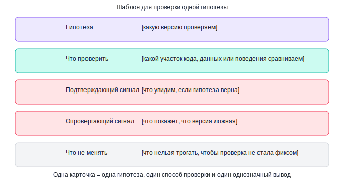
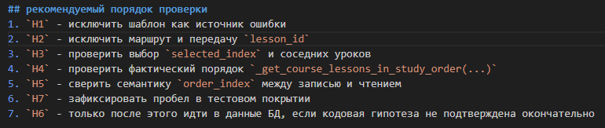
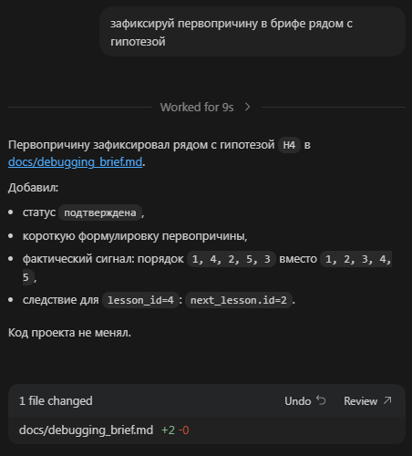

# Урок 2. Поиск причины ошибки и проверка гипотез

_lesson_id: 2289231 · steps: 14 · ttc: 834s_

---

## Шаг 1 (step_id=9817268, text)

Симптом, гипотеза и первопричина

После первого debugging-прохода важно не перепрыгнуть от симптома прямо к выводу о причине. Между этими точками есть ещё один обязательный слой — гипотеза. Без него расследование превращается в угадывание.

Чем отличаются три уровня

Симптом — это то, что вы видите. Например: на dashboard показывается не тот следующий урок.

Гипотеза — это проверяемая версия, почему симптом возникает. Например: сервис выбора следующего урока неверно фильтрует завершённые занятия.

Первопричина — это то конкретное место в коде, данных или логике, которое действительно порождает симптом. Она считается найденной, только когда проверка объясняет наблюдаемое поведение и исключает разумные альтернативы.

Где агент чаще всего срезает угол

Если в запросе уже встроена предполагаемая причина, агент её принимает как данность. Сравните две формулировки:

Плохо: 

сломана логика в dashboard_service

Здесь вывод уже встроен. Агент пойдёт чинить dashboard_service, даже если проблема в другом месте.

Лучше:

dashboard и next-lesson расходятся в выборе следующего урока

Это чистый симптом. Агент будет искать причину, а не подтверждать вашу версию.

Особенно это важно в Agent Mode: стоит встроить причину в первый запрос — и агент может сразу предложить патч, не проверив альтернативы. В Debug Mode это чуть безопаснее: режим сначала строит несколько гипотез независимо, прежде чем предлагать что-то менять.

Как удержать эти уровни разделёнными

Простой способ — явно помечать, что сейчас что:

	Симптом: dashboard и next-lesson показывают разный следующий урок.
	Гипотеза: они обращаются к разным функциям или фильтруют по-разному.
	Первопричина: не установлена — проверка ещё не проводилась.

Пока проверка не прошла, третья строчка всегда остаётся пустой. Если формулировка начинается с «возможно», «похоже», «скорее всего» — это гипотеза, не причина.

Симптом видим. Гипотезу проверяем. Первопричину доказываем.

---

## Шаг 2 (step_id=9921461, text)

Дерево гипотез и порядок проверки

После того как симптом зафиксирован, у вас почти всегда есть несколько версий того, что могло пойти не так. Их полезно выписать в явный список — от самой дешёвой и быстро проверяемой к более глубоким. Это и есть дерево гипотез.

Как выглядит плохое дерево гипотез

Плохое дерево — это список без порядка и без привязки к конкретным местам в коде:

- что-то не так в базе данных
- может быть ошибка в сервисном слое
- возможно, шаблоны рендерят не те данные
- не исключено, что сломан какой-то маршрут

По такому списку непонятно, с чего начать, что искать и как понять, что версия проверена.

Как выглядит хорошее дерево

Хорошее дерево привязано к конкретным файлам и содержит сигнал проверки:

1. dashboard и next-lesson обращаются к разным функциям выбора следующего урока.
   → Проверить: routes/pages.py, services/dashboard_service.py
   → Сигнал: две разные функции или разные входные параметры

2. одна функция вызывается с разными входными данными (user_id, course_id, статус прогресса).
   → Проверить: как каждая страница передаёт параметры в сервис
   → Сигнал: расхождение в аргументах при одном и том же пользователе

3. сервис неверно фильтрует завершённые занятия или сортирует кандидатов.
   → Проверить: метод get_next_lesson в dashboard_service.py, условие WHERE/filter на статус урока, test_smoke.py
   → Сигнал: фильтрация включает завершённые уроки или исключает незавершённые

По какому принципу расставлять порядок

Три критерия, которые помогают выбрать, что проверять первым:

	Стоимость проверки — сколько чтения и запусков нужно. Начинайте с того, что проверяется быстро и тратит меньше токенов.

	Например, проверить совместимость версий библиотек в зависимостях проще чем читать исходники этих библиотек
	
	Сила сигнала — насколько однозначно результат подтвердит или опровергнет версию. Гипотеза с чётким «да/нет» лучше, чем размытая «возможно».
	Риск уйти в сторону — не затащит ли версия в слишком большой участок проекта без ясного результата.

Как попросить агента собрать дерево

Дайте такой запрос сразу после исследовательского прохода:

На основе debugging brief и связанных файлов построй дерево гипотез.

Для каждой гипотезы укажи:
- конкретный файл или функцию, которую нужно проверить;
- какой сигнал подтвердит версию;
- какой сигнал её опровергнет;
- стоимость проверки (быстро/медленно).

Отсортируй от самой дешёвой к дорогой.
Код не менять.

Слабый ответ агента — длинный список мест «где вообще может быть проблема», без порядка и без критерия выбора. Если получили такой ответ, добавьте к запросу: «отсортируй по стоимости проверки и добавь подтверждающий и опровергающий сигнал для каждой».

Дерево гипотез нужно не для полноты — а чтобы следующий шаг был осознанным, а не случайным.

---

## Шаг 3 (step_id=9921458, text)

Шаблон «Проверка гипотезы»

Когда гипотеза выбрана, зафиксируйте не только её, но и способ проверки. Это не даёт агенту подменить эксперимент догадкой и начать редактировать код раньше времени.

Debug Mode

Если работаете в Debug Mode — агент делает большую часть этого шага сам: строит несколько гипотез, инструментирует код логами под каждую и ждёт, пока вы воспроизведёте баг. По сути, это автоматизированный шаблон проверки гипотезы с runtime-данными вместо статического чтения кода.

Шаблон ниже нужен везде, где такого режима нет.

Структура шаблона

	Гипотеза — какую версию проверяем.
	Что нужно проверить — какой участок кода, данных или поведения сравниваем.
	Подтверждающий сигнал — что увидим, если гипотеза верна.
	Опровергающий сигнал — что покажет, что версия ложная.
	Что не менять — чтобы проверка не превратилась в скрытый фикс.

Гипотеза:
Dashboard и next-lesson используют разную логику выбора следующего урока.

Что нужно проверить:
Сравнить маршруты pages.py и вызовы dashboard_service — смотрим,
одну и ту же функцию они вызывают или разные.

Подтверждающий сигнал:
Две страницы вызывают разные функции или передают разные параметры
в одну и ту же функцию.

Опровергающий сигнал:
Обе страницы вызывают одну и ту же функцию с одинаковыми параметрами —
тогда причина не здесь, переходим к гипотезе 2.

Что не менять во время проверки:
Шаблоны, стили, модель данных, тесты, структуру маршрутов.

Почему нужен опровергающий сигнал

Без него расследование становится предвзятым. Если вы не формулируете заранее, что сломает гипотезу, агент почти наверняка будет читать код так, чтобы найти подтверждение — и найдёт. Когда оба сигнала заданы явно, агент должен ответить однозначно: подтверждено или опровергнуто.

Запрос агенту для ручной проверки

Проверь гипотезу по шаблону ниже.

[вставьте шаблон]

Нужно:
- показать только факты, относящиеся к этой гипотезе;
- явно сказать: подтверждена или опровергнута, с каким сигналом;
- не редактировать код;
- если опровергнута — предложить следующую по дереву гипотез.

Один запрос — одна гипотеза — один вывод. Если попросить проверить несколько версий сразу, агент смешает результаты и будет труднее понять, что именно подтверждено, а что нет.

---

## Шаг 4 (step_id=9921460, text)

Как понять, что причина действительно доказана

Причина считается доказанной не тогда, когда объяснение звучит правдоподобно, а когда оно выдерживает проверку. Разница принципиальная: правдоподобная версия без проверки почти всегда порождает либо лишние правки, либо возврат к тому же багу через одну-две итерации.

Признаки доказанной причины

	Она объясняет конкретный симптом, а не «общие странности проекта».
	Есть воспроизводимый сигнал: что вы проверяли, что увидели.
	Разумные альтернативы либо исключены, либо показано, почему они слабее.
	Проверка не меняла код и не подстраивала результат под гипотезу.
	После фикса вы сможете проверить именно этот механизм — не «что-то рядом».

Какие формулировки должны насторожить

Если вывод звучит как скорее всего дело здесь или похоже, это и есть причина — расследование ещё не закончено.

Отдельный тревожный сигнал: доказательство строится только на том, что после правки сценарий прошёл. Если вы сначала изменили код, а потом увидели, что симптом исчез — вы доказали только то, что одно из изменений повлияло на симптом. Это не то же самое, что найденная и понятая причина: симптом мог исчезнуть потому, что вы случайно обошли проблему, а не устранили её.

Три вопроса перед тем, как разрешить агенту редактировать

Ответьте на каждый конкретно — без «возможно» и «скорее всего».

Что именно считаем первопричиной? Не что-то в сервисе, а конкретно, например: dashboard вызывает get_next_lesson() без параметра exclude_completed, поэтому при одном прогрессе результат расходится с next-lesson.

Какой сигнал это подтвердил? Не посмотрели код и кажется так, а конкретно, например: в pages.py нашли два разных вызова к сервису — один с фильтром, другой без.

Какой узкий участок нужно менять? Не dashboard_service, а конкретно, например: один метод в dashboard_service.py, строки 47–52.

Доказанная причина сужает фикс. Недоказанная — расширяет его.

Когда на все три вопроса есть чёткий ответ — можно переходить к следующему шагу: решать, нужен ли для этого места автоматический тест и какого уровня он должен быть.

---

## Шаг 5 (step_id=9921459, text)

Практика: проверьте гипотезы и зафиксируйте первопричину

Продолжаем кейс из предыдущего урока. У вас уже есть debugging brief и список связанных файлов. Задача — пройти две-три гипотезы в явном порядке и зафиксировать, какая версия действительно объясняет симптом. Код пока не трогаем.

С чем заходить в эту практику

Лучше всего заходить сюда с реальным багом или хотя бы с воспроизводимым подозрительным поведением, которое вы не придумывали специально под упражнение. Именно в такой ситуации по-настоящему тренируется навык формулировки гипотез: вы ещё не знаете ответ и вынуждены опираться на сигналы, а не на память о том, что сами недавно сломали.

Если в проекте пока нет живой проблемы, учебный симптом тоже подойдёт, но это запасной вариант. Вручную созданная поломка почти всегда упрощает расследование: вы всё равно уже примерно знаете, где искать. Поэтому, если есть выбор, берите первый реальный сбой, который встретился в StudyFlow или в вашем проекте, и работайте с ним.

Чем меньше вы заранее знаете о причине, тем честнее получается проверка гипотез и тем полезнее сама практика.

Шаг 1. Соберите дерево гипотез

Попросите агента построить дерево по brief из предыдущего урока:

На основе debugging brief и связанных файлов построй дерево гипотез.

Для каждой гипотезы укажи:
- конкретный файл или функцию для проверки;
- подтверждающий и опровергающий сигнал;
- стоимость проверки (быстро/медленно).

Отсортируй от самой дешёвой к дорогой. Код не менять.

Если у вас Cursor — переключитесь в Ask Mode или Debug Mode перед запросом. В Claude Code и Codex CLI вставьте запрос в терминал. В Roo Code — переключитесь в Ask Mode.

Шаг 2. Проверьте первую гипотезу

Возьмите первую (самую дешёвую) гипотезу и дайте агенту запрос по шаблону:

Проверь гипотезу:
dashboard и next-lesson используют разную логику выбора следующего урока.

Нужно:
- показать связанные маршруты и сервисные вызовы;
- явно сказать: подтверждена или опровергнута, с каким сигналом;
- не редактировать код;
- если опровергнута — предложить следующую гипотезу из списка.

После ответа запишите результат отдельно: гипотеза → подтверждена/опровергнута → сигнал. Это нужно, чтобы не смешивать уже проверенные версии с новыми, когда дерево начнёт ветвиться.

Шаг 3. Пройдите оставшиеся гипотезы

Если первая гипотеза опровергнута — переходите ко второй с тем же шаблоном. Если подтверждена — зафиксируйте её как кандидата и проверьте хотя бы одну альтернативу. Это нужно, чтобы убедиться, что симптом объясняется именно этой причиной, а не двумя независимыми проблемами одновременно.

Шаг 4. Зафиксируйте первопричину

Когда одна гипотеза подтверждена и альтернативы проверены, запишите причину конкретно — без «возможно» и «скорее всего»:

Первопричина:
[конкретная функция/путь/условие] вызывает расхождение,
потому что [объяснение механизма].

Подтверждающий сигнал:
[что именно нашли в коде или данных].

Проверенные и отвергнутые гипотезы:
[гипотеза 1] — опровергнута, потому что [сигнал].

Что нужно менять:
[конкретный файл и метод].

Если не можете заполнить этот шаблон без неопределённых слов — причина ещё не доказана. Вернитесь к следующей гипотезе.

Что считать завершением практики

Практика выполнена, если шаблон выше заполнен полностью: есть дерево гипотез с порядком проверки, минимум одна отвергнутая версия, зафиксированная первопричина с подтверждающим сигналом и конкретный узкий участок кода, который теперь можно исправлять.

Коммит по-прежнему не нужен — мы всё ещё на этапе расследования.

---

## Шаг 6 (step_id=9937533, choice)

Какая формулировка ближе всего к первопричине?

**Тип:** choice (single)

**Варианты:**
- ○ Интерфейс иногда ведёт себя нестабильно
- ✓ Конкретный вызов или условие, дающее сбой
- ○ Сбой виден в логике выбора
- ○ Проблема заметна в нескольких связанных местах

---

## Шаг 7 (step_id=9937529, choice)

Почему полезно начинать с самой дешёвой гипотезы?

**Тип:** choice (single)

**Варианты:**
- ○ Так агенту проще сразу предложить готовый патч
- ○ Так можно не проверять остальные версии
- ✓ Так быстрее сузить поиск по сигналам
- ○ Так не нужно смотреть соседние маршруты

---

## Шаг 8 (step_id=9937532, choice)

Что показывает, что вывод сделан слишком рано?

**Тип:** choice (single)

**Варианты:**
- ○ Назван узкий участок для будущего исправления
- ✓ Есть слова «возможно» или «скорее всего»
- ○ Указан конкретный файл
- ○ Приведён подтверждающий сигнал

---

## Шаг 9 (step_id=9937527, choice)

Что должно входить в хорошее дерево гипотез?

**Тип:** choice (multiple)

**Варианты:**
- ○ Финальный патч для каждой версии
- ✓ Конкретный файл или функция для проверки
- ✓ Подтверждающий и опровергающий сигнал
- ✓ Оценка стоимости проверки

---

## Шаг 10 (step_id=9937530, choice)

Что помогает не спутать гипотезу с доказанной причиной?

**Тип:** choice (multiple)

**Варианты:**
- ✓ Отдельно записывать результат каждой проверки
- ○ Сразу выбирать самый крупный участок системы
- ✓ Проверить хотя бы одну альтернативу
- ✓ Не редактировать код во время проверки

---

## Шаг 11 (step_id=9937525, choice)

Почему реальные баги полезнее специально созданных?

**Тип:** choice (multiple)

**Варианты:**
- ✓ По ним нельзя заранее помнить место поломки
- ○ Они всегда проще и быстрее учебных примеров
- ✓ Приходится опираться на сигналы, а не на память
- ✓ Они честнее тренируют формулировку гипотез

---

## Шаг 12 (step_id=9937531, matching)

Сопоставьте элемент и его роль в проверке

**Тип:** matching

**Правильные пары:**
- Гипотеза → Проверяемая версия причины
- Подтверждающий сигнал → Что увидим, если версия верна
- Опровергающий сигнал → Что исключает эту версию
- Первопричина → Доказанный конкретный механизм сбоя

---

## Шаг 13 (step_id=9937526, matching)

Сопоставьте действие и его цель

**Тип:** matching

**Правильные пары:**
- Отсортировать версии по стоимости → Начать с дешёвых проверок
- Проверить ещё одну альтернативу → Не принять ранний вывод за истину
- Записать гипотеза → сигнал → Не смешивать результаты расследования
- Назвать точный файл и метод → Сузить будущий фикс

---

## Шаг 14 (step_id=9937528, matching)

Сопоставьте формулировку и уровень расследования

**Тип:** matching

**Правильные пары:**
- «dashboard и next-lesson расходятся» → Симптом
- «маршруты вызывают разные функции» → Гипотеза
- «в pages.py найден вызов без нужного параметра» → Подтверждающий сигнал
- «конкретный вызов вызывает расхождение» → Первопричина

---
