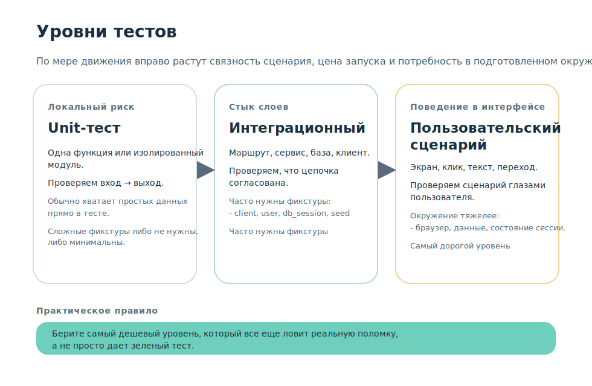
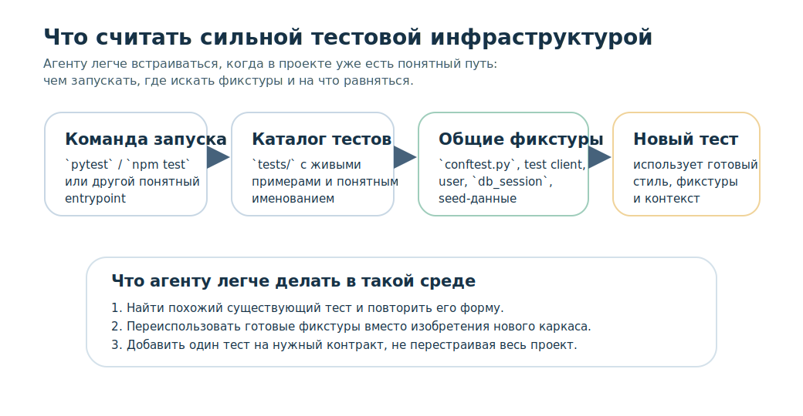
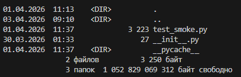
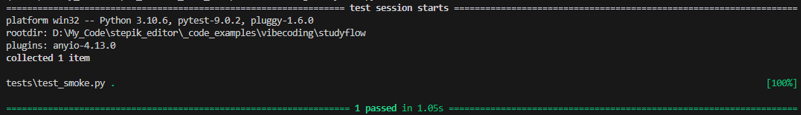
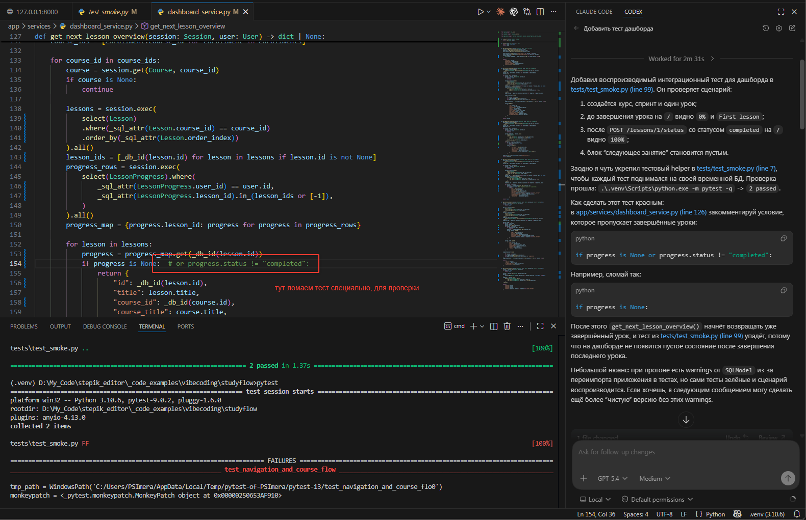
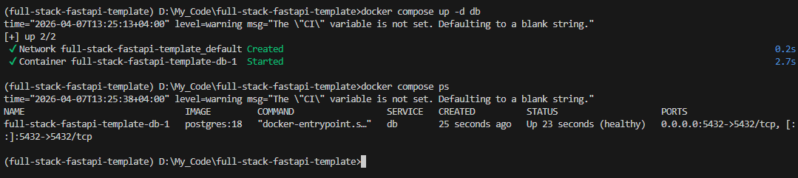
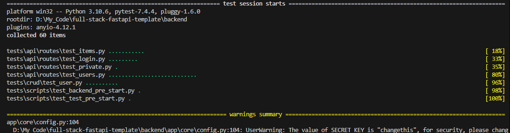
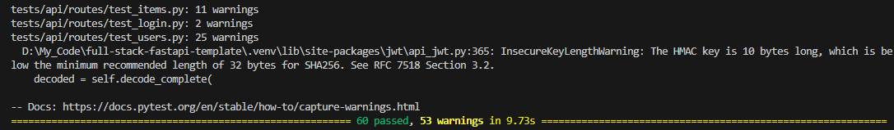
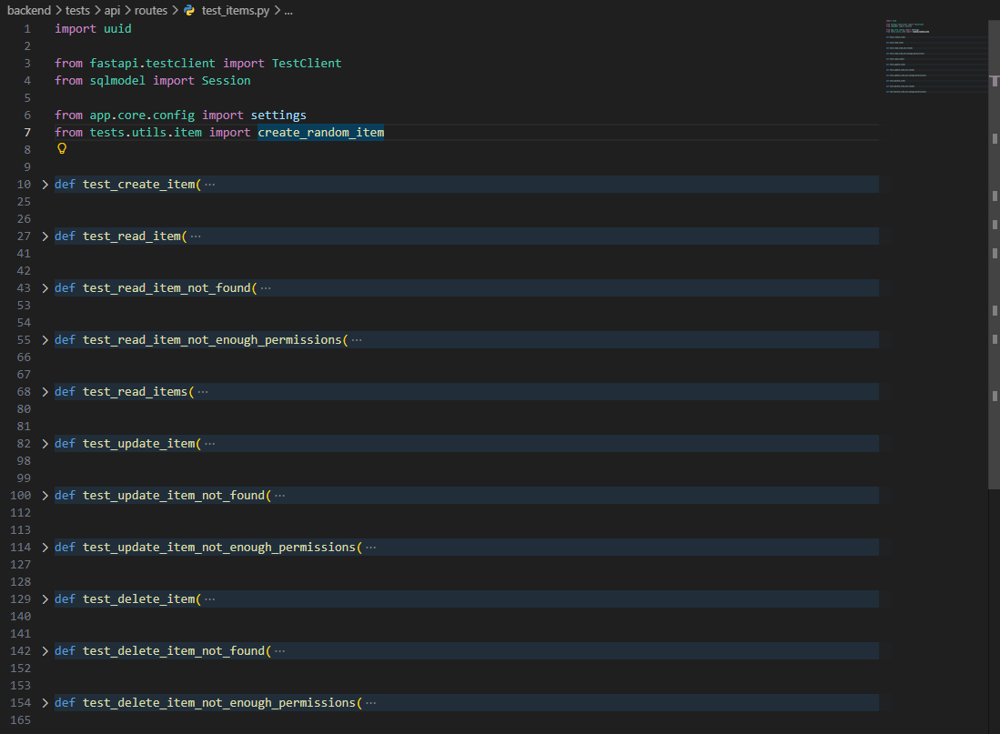
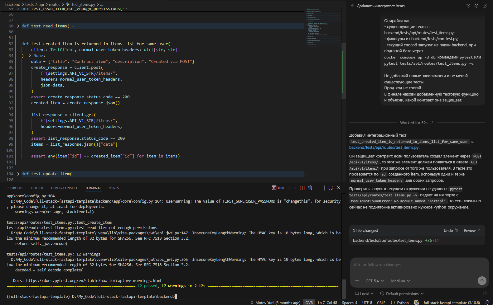

# Урок 3. Генерация тестов

_lesson_id: 2289232 · steps: 15 · ttc: 1044s_

---

## Шаг 1 (step_id=9817269, text)

Когда тест нужен, а когда достаточно ручной проверки

После расследования может возникнуть желание сразу попросить агента написать тест. Но автоматический тест полезен не всегда — прежде чем генерировать, стоит понять, какой риск вы хотите застраховать и насколько он переживёт текущий проход.

Когда автоматический тест действительно нужен

Тест оправдан в следующих случаях:

  вы исправляете регрессию, которая может вернуться;
  есть поведенческий контракт, который должен оставаться стабильным при следующих изменениях;
  ручная проверка дорогая, хрупкая или легко забывается.

Если вы нашли причину расхождения и понимаете, что эта логика будет жить дальше и ещё не раз меняться, тест фиксирует не текущее состояние кода, а инвариант: при таких входных данных система должна давать именно этот результат.

Когда ручной проверки достаточно

Если вы меняете чисто визуальную деталь, одноразово правите документ или разбираетесь с редким ручным сценарием без перспективы развития — достаточно короткой ручной проверки.

Перед тем как генерировать тест, полезно задать себе вопрос: что именно я хочу защитить на следующий проход? Если ответа нет, тест почти наверняка получится проверкой реализации, а не поведения.

Как ведут себя агенты при туманном запросе

Если попросить добавь тесты, агент сделает то, что проще всего встроить в текущую инфраструктуру: поверхностный smoke, тест на наличие строки в ответе, хрупкий сценарий с лишними деталями разметки. Такой тест станет зелёным сразу — но не защитит реальный риск и упадёт по ложным причинам при следующем невинном изменении.

Агент не знает, что именно важно сохранить. Поэтому сначала формулируем риск или контракт поведения, и только потом решаем, нужен ли для него тест и какой.

---

## Шаг 2 (step_id=9921464, text)

Выбор уровня теста: unit, интеграционный, пользовательский

Когда уже понятно, что тест нужен, следующий вопрос — на каком уровне его писать. Уровень зависит от того, где живёт риск и что именно вы хотите зафиксировать.

Unit-тест

Unit-тест подходит, когда риск локализован в одной функции или небольшом изолированном модуле. Он быстрый, дешёвый и хорошо работает, если вы точно знаете: вот входные данные, вот ожидаемый результат, и между ними нет слоёв, которые надо проверять вместе.

Интеграционный тест

Интеграционный тест нужен, когда риск живёт на стыке слоёв: маршрут вызывает сервис, сервис идёт в базу, результат попадает в ответ. Такой тест медленнее, но ближе к реальной проблеме. Для FastAPI и аналогичных фреймворков это часто самый практичный уровень — он проверяет цепочку целиком без браузерной оболочки.

Пользовательский или end-to-end сценарий

Пользовательский сценарий нужен, когда важно поведение, видимое глазами пользователя: какой экран открылся, какой текст показан, что произошло после клика. Он самый дорогой в написании и поддержке. Дорогой тест не значит сильный: если проблему можно надёжно поймать на интеграционном уровне, браузерный сценарий здесь лишний.

Как выбирать уровень на практике

Агент по умолчанию часто предлагает unit-тест даже тогда, когда риск явно на стыке слоёв. Причина простая: unit-тест проще сгенерировать. Но как только нужно проверить маршрут, базу или связку нескольких компонентов, почти всегда появляется опора на фикстуры.

Фикстура — это подготовленное тестовое окружение, которое pytest собирает перед запуском теста и передаёт в функцию теста как аргумент. На практике это может быть тестовый клиент, пользователь в базе, временные данные, подключение к тестовой БД или уже созданный объект, который нужен сразу нескольким тестам.

Интуитивно можно думать так: сам тест отвечает на вопрос что должно получиться?, а фикстура подготавливает состояние с чем именно мы это проверяем?. Поэтому unit-тесты часто обходятся без сложных фикстур, а интеграционные сценарии почти всегда опираются на них.

Если хочется посмотреть на термин в первоисточнике, откройте официальную документацию pytest How to use fixtures и fixtures reference. Там хорошо видно, как фикстура объявляется и затем подставляется в тест по имени аргумента. Эти страницы удобно использовать как опорную карту, когда вы видите в проекте чужие фикстуры и хотите быстро понять их роль.

Если риск внутри одной функции — unit. Если на стыке маршрута, сервиса и данных — интеграционный. Если критично именно то, что видит пользователь в интерфейсе — пользовательский сценарий. В остальных случаях выбирайте самый дешёвый уровень, который всё ещё ловит реальную поломку.

---

## Шаг 3 (step_id=9921462, text)

Генерация тестов в проекте с сильной и слабой тестовой инфраструктурой

Один и тот же запрос на тест работает по-разному в двух проектах: там, где уже есть понятный тестовый слой, и там, где его почти нет.

Когда инфраструктура уже есть

Если в проекте уже лежат тесты, фикстуры, соглашения по именам и известный способ запуска — агенту проще встроиться в существующий стиль. Наличие хотя бы одного работающего теста и понятной точки входа вроде pytest или npm test уже даёт ему достаточно контекста.

В таком проекте сильный запрос ссылается на конкретные существующие файлы: где лежат тесты, чем запускаются, какие фикстуры уже есть, какой стиль проверок принят в команде.

На практике полезно быстро проверить три опоры: где находится точка входа для запуска тестов, где лежат общие фикстуры и какой тест уже можно взять за образец. В проектах на pytest это часто связка tests/, conftest.py и один-два живых файла с тестами рядом.

Когда инфраструктура слабая

Если тестов почти нет, агенту очень легко «достроить» инфраструктуру за вас: добавить новые библиотеки, придумать фикстуры, изменить конфиг, создать тяжёлый каркас ради одного локального риска. Иногда это оправдано, но чаще превращает маленькую задачу в большую перестройку.

В таком случае помогает узкая постановка. Например:

Напиши минимальный тест без смены тестового стека.
Не добавляй новые зависимости.
Защити один риск: [контракт].
Не трогай прод-код.

Что важно явно запретить

При слабой инфраструктуре полезно сказать агенту, чего делать нельзя: не подключать новые тестовые библиотеки без крайней необходимости, не переписывать существующие тесты ради красоты, не трогать прод-код если задача только про тест, не придумывать поведение, которого в проекте ещё нет.

Такие ограничения можно вынести в постоянные инструкции проекта — тогда они работают на весь проект, не только на один запрос. В Claude Code это CLAUDE.md, в Codex — AGENTS.md, в Cursor — .cursorrules. Без явного запрета агент может незаметно подправить прод-код, чтобы тест прошёл — и это именно тот сценарий, который нужно исключить.

---

## Шаг 4 (step_id=9921463, text)

Шаблон «Запрос на генерацию теста»

Чтобы агент написал тест, который защищает нужное поведение, запрос полезно собирать по шаблону. В этом уроке мы используем артефакт Запрос на генерацию теста.

Из чего состоит шаблон

Нужно защитить такой контракт:
[сформулируйте инвариант поведения: при каких входных данных
система должна давать какой именно результат].

Уровень теста:
[unit / интеграционный / пользовательский сценарий].

Опирайся на:
- существующие тесты в tests/
- текущий способ запуска тестов
- реальные маршруты и сервисный слой проекта.

Полезный сигнал теста:
тест падает при нарушении контракта и проходит, когда
поведение согласовано.

Не выдумывай:
- новую тестовую инфраструктуру;
- новые зависимости;
- несуществующие маршруты и вспомогательные функции.

Почему в шаблоне нужен именно контракт

Тест должен защищать поведение, а не реализацию. Запрос вида напиши тест на payment_service задаёт техническую форму и почти ничего не говорит о том, что важно сохранить. Намного сильнее: после успешной оплаты заказ должен переходить в статус paid. Агент получает цель, а не задание воспроизвести текущий код в тестах.

Что ещё стоит добавить в запрос

Если в проекте уже есть файл, рядом с которым логично разместить новый тест, укажите его прямо. Если важно не трогать production-код — напишите это явно. Такие запреты удерживают агента в тестовом слое и не дают ему незаметно подправить приложение ради зелёного теста.

---

## Шаг 5 (step_id=9921465, text)

Практика: создайте тест на риск или контракт поведения

В этой практике берём первопричину из предыдущего урока и превращаем её в тестовую страховку. Цель — не покрыть весь проект, а защитить один конкретный контракт поведения, который вы уже доказали.

Ниже два варианта: основной — через ваш проект, дополнительный — на публичном репозитории, где можно отработать тот же процесс на чужой кодовой базе.

Вариант А: ваш проект

Шаг 1. Проверьте исходную точку

Перед тем как что-то генерировать, убедитесь, что рабочее дерево чистое и вы понимаете, какой тестовый слой уже есть. Если папки tests/ и готовых тестов пока нет, это тоже нормальная исходная точка для этого шага:

git status --short
git log -1 --oneline

# если папка уже есть
dir tests              # Windows (cmd)
Get-ChildItem tests    # Windows (PowerShell)
ls tests/              # macOS / Linux

 

pytest

Посмотрите, что выводит pytest сейчас. Возможны разные исходные точки:

	уже есть несколько зелёных тестов,
	выводится no tests ran
	тестовый слой ещё только предстоит создать.

Зафиксируйте это состояние: после шага в проекте должен появиться новый тестовый сценарий, не требующий лишней перестройки.

Шаг 2. Сформулируйте контракт из первопричины

Возьмите то, что вы зафиксировали в конце предыдущего урока: конкретную функцию, маршрут или условие, которое вызывало расхождение. На основе этого сформулируйте инвариант — что система должна делать при определённых входных данных.

Например, если расхождение было между двумя точками интерфейса, работающими с одними данными, контракт — обе должны возвращать одинаковый результат для одного и того же состояния. Если баг был в фильтрации или сортировке — при конкретном входе функция должна вернуть конкретный набор элементов. Формулируйте без привязки к внутренней реализации: тест защищает поведение, а не то, как оно достигается.

Шаг 3. Отправьте запрос на генерацию теста

Используйте шаблон из предыдущего шага урока. Адаптируйте его под ваш контракт и проект:

Нужно добавить интеграционный тест на такой контракт:
[вставьте сформулированный контракт из предыдущего урока].

Опирайся на текущий тестовый слой, если он уже есть.
Если папки tests/ и тестов пока нет, создай минимальную тестовую структуру под существующий запуск pytest без лишней перестройки проекта.
Не добавляй новые зависимости и не меняй test setup сверх минимума, который нужен для первого теста.
Если нужно, добавь минимальные фикстуры рядом с новым тестом.
Прод-код не меняй.
В финале перечисли изменённые тестовые файлы и объясни, какой контракт теперь защищён.

Шаг 4. Проверьте полезность результата

После генерации запустите только новый тест — не весь набор сразу:

pytest path/to/your_new_test.py -v

Важно понять не только то, что тест стартует, но и то, что он действительно ловит нужную поломку. Временно нарушьте контракт руками — измените логику или данные так, чтобы поведение стало расходиться — и убедитесь, что тест упал именно по нужной причине, а не по ложной.

Верните изменение и проверьте, что тест снова зелёный.

Если тест проверяет второстепенные детали разметки или внутреннюю реализацию вместо контракта поведения — он не решает задачу. Вернитесь к формулировке контракта и уточните запрос.

Шаг 5. Зафиксируйте результат

Практика выполнена, если новый тест защищает один понятный контракт, запускается в текущем тестовом слое и не потребовал перестройки проекта. Завершите шаг коммитом, например:

git add путь_к_новому_тесту
git commit -m "step 04-03-05: добавить тест на [короткое описание контракта]"

Вариант Б: публичный репозиторий

Когда работа в собственном проекте уже понятна, полезно повторить тот же процесс на чужой кодовой базе. Это тренирует именно навык составления запроса на тест по риску, независимо от того, знаком ли вам проект изнутри.

Для этого варианта используем fastapi/full-stack-fastapi-template — официальный шаблон FastAPI с полноценным тестовым слоем. Важно только учесть одну особенность: backend-тесты в этом проекте используют реальный PostgreSQL. Поэтому для учебного сценария лучше сразу выбрать способ запуска, который не создаёт лишних проблем с путями, контейнерами и отсутствующими файлами.

Самый надёжный и воспроизводимый вариант такой: поднимаем только базу данных через Docker Compose, а сами тесты запускаем локально из папки backend. Так вы не зависите от того, смонтирована ли папка tests внутрь контейнера, и не упираетесь в проблемы с рабочей директорией.

Шаг 1. Клонируйте репозиторий

git clone https://github.com/fastapi/full-stack-fastapi-template.git
cd full-stack-fastapi-template

В корне проекта уже есть файл .env с настройками для локального запуска. Для первого прогона его обычно не нужно менять.

Шаг 2. Поднимите только PostgreSQL

Из корня проекта выполните:

docker compose up -d db

Именно этот шаг нужен, потому что backend-тесты обращаются к базе данных. Полный стек поднимать необязательно, если ваша цель сейчас — только запуск тестов.

После этого полезно проверить, что база действительно стартовала:

docker compose ps

В списке должен быть сервис db со статусом running или healthy.

Шаг 3. Установите backend-зависимости

Теперь перейдите в папку backend и установите зависимости:

cd backend
uv sync

Если uv у вас ещё не установлен:

pip install uv

После uv sync все следующие команды выполняйте из папки backend.

Шаг 4. Запустите существующие backend-тесты

Находясь в backend, выполните:

pytest

Тут мы получаем предупреждения о том что пароли и секреты не настроены, но мы лоб этом знаем, тут мы просто тренируемся, а не полноценно настраиваем проект. В остальном тесты проходят.

Если хотите сначала проверить только тесты маршрутов items:

pytest tests/api/routes/test_items.py -v

Обратите внимание на структуру тестов: они лежат в backend/tests/. Также посмотрите, какие фикстуры используются в backend/tests/conftest.py, как создаётся тестовый клиент и как тесты получают доступ к базе.

Смотреть в conftest.py полезно чтобы понять: есть ли уже готовый client или superuser_token_headers, как в тестах создаются данные и нужно ли вам поднимать что-то вручную внутри нового теста. Если нужная фикстура уже существует, лучше переиспользовать её, чем собирать то же окружение заново в теле теста.

Может быть полезным ознакомится с документацией FastAPI: Testing, она показывает типичный тестовый клиент и общий сценарий проверки маршрутов.

Шаг 5. Изучите файл с тестами маршрутов items

В этом проекте есть маршруты для работы с объектами items: создание, чтение списка, чтение по id, обновление и удаление. Хороший контракт для практики: элемент, созданный через POST /api/v1/items/, должен появляться в ответе GET /api/v1/items/.

Откройте существующие тесты маршрутов:

backend/tests/api/routes/test_items.py

Именно здесь нужно проверить, покрыт ли уже такой сценарий.

Шаг 6. Сформулируйте запрос на новый тест

Используйте такой запрос к агенту:

Нужно добавить интеграционный тест на такой контракт:
элемент, созданный через POST /api/v1/items/, должен присутствовать
в ответе GET /api/v1/items/ для того же пользователя.

Опирайся на:
- существующие тесты в backend/tests/api/routes/test_items.py;
- фикстуры из backend/tests/conftest.py;
- текущий способ запуска: из папки backend, при поднятой базе через
`docker compose up -d db`, командами `pytest` или
`pytest tests/api/routes/test_items.py -v`.

Не добавляй новые зависимости и не меняй существующие тесты.
Прод-код не трогай.
В финале назови добавленную тестовую функцию и объясни, какой контракт она защищает.

Такой запрос полезен тем, что сразу задаёт рамки: где смотреть примеры, чем пользоваться и что менять нельзя.

Шаг 7. Запустите только файл с тестами items

pytest tests/api/routes/test_items.py -v

Убедитесь, что новый тест действительно проверяет контракт, а не детали реализации. Хорошая дополнительная проверка: временно сломать сценарий и убедиться, что тест падает. Например, убрать шаг создания элемента и посмотреть, что тест перестанет проходить. После этого верните код обратно.

Как не столкнуться с типичными проблемами

	Запускайте pytest именно из папки backend. Если запускать из корня проекта, конфиг может не найти нужный .env.
	Перед тестами поднимайте хотя бы сервис db через docker compose up -d db, потому что backend-тесты используют реальный PostgreSQL.
	Для учебной практики не запускайте тесты через docker compose exec backend ..., если специально не проверяли, что каталог backend/tests доступен внутри контейнера.
	Если тесты выглядят как «зависшие» на первом файле, это часто не зависание, а ожидание подключения к базе. Сначала проверьте, что контейнер db действительно запущен.
	Используйте одну и ту же последовательность: корень проекта → docker compose up -d db → cd backend → uv sync → pytest.

---

## Шаг 6 (step_id=9944373, choice)

Когда автоматический тест обычно действительно нужен?

**Тип:** choice (single)

**Варианты:**
- [✓ правильный] Когда нужно закрепить устойчивый контракт
-  Когда хочется сразу перепроверить весь проект
-  Когда правка разовая и чисто косметическая
-  Когда агенту дали общий запрос без рамок

**Статус Stepik:** `correct` (score 1.0)

**Мой reasoning:** _В теории прямо сказано: тест оправдан, когда есть поведенческий контракт, который должен оставаться стабильным при следующих изменениях. Остальные варианты — либо разовая правка (тест не нужен), либо антипаттерны._

---

## Шаг 7 (step_id=9944376, choice)

Какой уровень чаще всего подходит для риска на стыке слоёв?

**Тип:** choice (single)

**Варианты:**
-  Проверка только по скриншоту
- [✓ правильный] Интеграционный тест цепочки
-  Unit-тест одной функции
-  Полный браузерный прогон всего продукта

**Статус Stepik:** `correct` (score 1.0)

**Мой reasoning:** _В теории прямо сказано: если риск живёт на стыке слоёв (маршрут → сервис → база), нужен интеграционный тест, проверяющий цепочку целиком._

---

## Шаг 8 (step_id=9944369, choice)

Что особенно важно запретить при слабой тестовой инфраструктуре?

**Тип:** choice (single)

**Варианты:**
- [✓ правильный] Трогать прод-код ради прохождения теста
-  Опираться на реальные файлы и соглашения проекта
-  Указывать текущую команду запуска тестов
-  Смотреть существующие тесты перед генерацией

**Статус Stepik:** `correct` (score 1.0)

**Мой reasoning:** _В теории прямо сказано: при слабой инфраструктуре важно явно запретить агенту менять прод-код, чтобы тест прошёл — иначе он незаметно подправит приложение ради зелёного теста. Остальные варианты — наоборот, полезные опоры, а не запреты._

---

## Шаг 9 (step_id=9944370, choice)

Что должно входить в хороший запрос на генерацию теста?

**Тип:** choice (multiple)

**Варианты:**
- [✓ правильный] Выбранный уровень теста
- [✓ правильный] Ссылки на существующие файлы и соглашения
-  Полный рефакторинг тестового слоя заранее
- [✓ правильный] Риск или контракт поведения

**Статус Stepik:** `correct` (score 1.0)

**Мой reasoning:** _Шаблон запроса в теории включает контракт поведения, уровень теста (unit/интеграционный/пользовательский) и опору на существующие тесты, способ запуска и фикстуры. Полный рефакторинг тестового слоя — антипаттерн, которого как раз нужно избегать._

---

## Шаг 10 (step_id=9944368, choice)

Что помогает удержать генерацию минимальной в слабой инфраструктуре?

**Тип:** choice (multiple)

**Варианты:**
-  Автоматическая замена тестового стека целиком
- [✓ правильный] Запрет на новые зависимости без нужды
- [✓ правильный] Опора на текущий способ запуска тестов
- [✓ правильный] Явный запрет менять прод-код

**Статус Stepik:** `correct` (score 1.0)

**Мой reasoning:** _Теория прямо рекомендует узкую постановку: не добавлять зависимости, не трогать прод-код и опираться на существующий запуск тестов. Автоматическая замена стека — это как раз та перестройка, которую нужно исключить._

---

## Шаг 11 (step_id=9944371, choice)

Почему запрос добавь тесты обычно слабый?

**Тип:** choice (multiple)

**Варианты:**
-  Он автоматически запрещает интеграционные тесты
- [✓ правильный] Он не называет конкретный риск
- [✓ правильный] Агент может написать поверхностный smoke
- [✓ правильный] Тест может проверять реализацию, а не поведение

**Статус Stepik:** `correct` (score 1.0)

**Мой reasoning:** _Теория прямо говорит: без формулировки риска/контракта агент делает поверхностный smoke или тест на реализацию. Запрет интеграционных тестов в теории не упоминается — это выдумка._

---

## Шаг 12 (step_id=9944374, choice)

В каких случаях браузерный сценарий чаще всего избыточен?

**Тип:** choice (single)

**Варианты:**
-  Риск локализован внутри одной функции
- [✓ правильный] Интеграционный тест уже ловит ту же поломку
-  Пользовательский экран не является источником риска
-  Нужно проверить текст после реального клика в UI

**Статус Stepik:** `correct` (score 1.0)

**Мой reasoning:** _В теории прямо сказано: если проблему можно надёжно поймать на интеграционном уровне, браузерный сценарий здесь лишний. Дорогой тест не значит сильный._

---

## Шаг 13 (step_id=9944375, matching)

Сопоставьте уровень теста и тип риска

**Тип:** matching

**Колонка А (вопросы):**
- Unit-тест
- Интеграционный тест
- Пользовательский сценарий
- Фикстура

**Колонка Б (варианты, перемешаны):**
- Стык маршрута, сервиса и данных
- Локальная логика одной функции
- Подготовка нужного состояния для теста
- Видимое поведение интерфейса

**Правильные пары:**
- Unit-тест → Локальная логика одной функции
- Интеграционный тест → Стык маршрута, сервиса и данных
- Пользовательский сценарий → Видимое поведение интерфейса
- Фикстура → Подготовка нужного состояния для теста

**Статус Stepik:** `correct` (score 1.0)

**Мой reasoning:** _Из теории: unit — изолированная функция, интеграционный — стык слоёв (маршрут+сервис+БД), пользовательский — видимое поведение в интерфейсе, фикстура — подготовленное окружение/состояние._

---

## Шаг 14 (step_id=9944372, matching)

Сопоставьте состояние проекта и полезный акцент в запросе

**Тип:** matching

**Колонка А (вопросы):**
- Сильная тестовая инфраструктура
- Слабая тестовая инфраструктура
- Уже доказанный риск
- Один локальный сценарий

**Колонка Б (варианты, перемешаны):**
- Запретите лишний каркас
- Просите минимальный новый тест
- Сформулируйте точный контракт
- Ссылайтесь на реальные тесты

**Правильные пары:**
- Сильная тестовая инфраструктура → Ссылайтесь на реальные тесты
- Слабая тестовая инфраструктура → Запретите лишний каркас
- Уже доказанный риск → Сформулируйте точный контракт
- Один локальный сценарий → Просите минимальный новый тест

**Статус Stepik:** `correct` (score 1.0)

**Мой reasoning:** _При сильной инфре опираемся на существующие тесты, при слабой — запрещаем достраивать каркас. Доказанный риск превращается в контракт поведения, а один локальный сценарий требует минимального теста._

---

## Шаг 15 (step_id=9944377, matching)

Сопоставьте ситуацию и правильное решение

**Тип:** matching

**Колонка А (вопросы):**
- Исправляете регрессию, которая может вернуться
- Делаете разовую визуальную правку 
- Новый тест зелёный, но не ловит поломку
- Агент предлагает менять setup и библиотеки

**Колонка Б (варианты, перемешаны):**
- Сузить рамки запроса
- Уточнить контракт
- Ограничиться ручной проверкой
- Добавить автотест

**Мои пары (неверные):**
- Исправляете регрессию, которая может вернуться → Добавить автотест
- Делаете разовую визуальную правку → Ограничиться ручной проверкой
- Новый тест зелёный, но не ловит поломку → Уточнить контракт
- Агент предлагает менять setup и библиотеки → Сузить рамки запроса

**Статус Stepik:** `wrong` (score 0.0)

**Мой reasoning:** _Регрессия — классический случай для автотеста; разовая визуалка — ручная проверка; зелёный, но бесполезный тест значит, что не сформулирован контракт поведения; расширение setup лечится узкой постановкой запроса._

---
