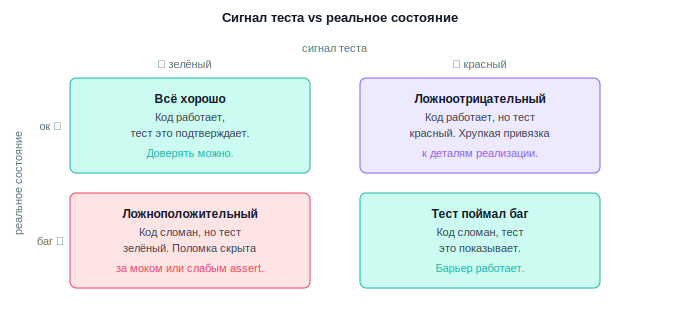
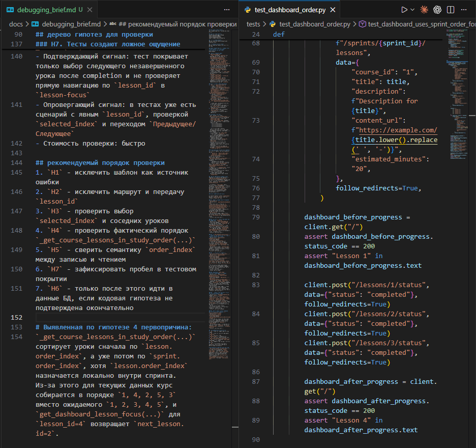
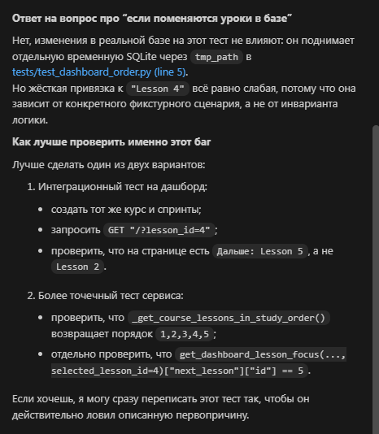
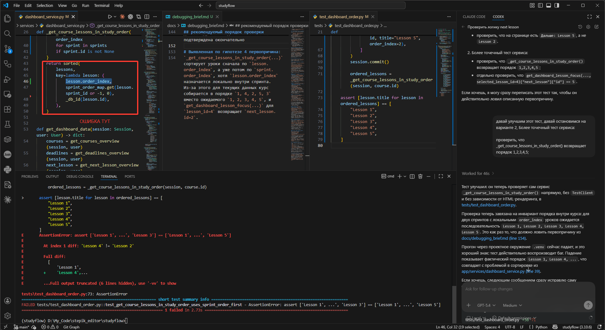
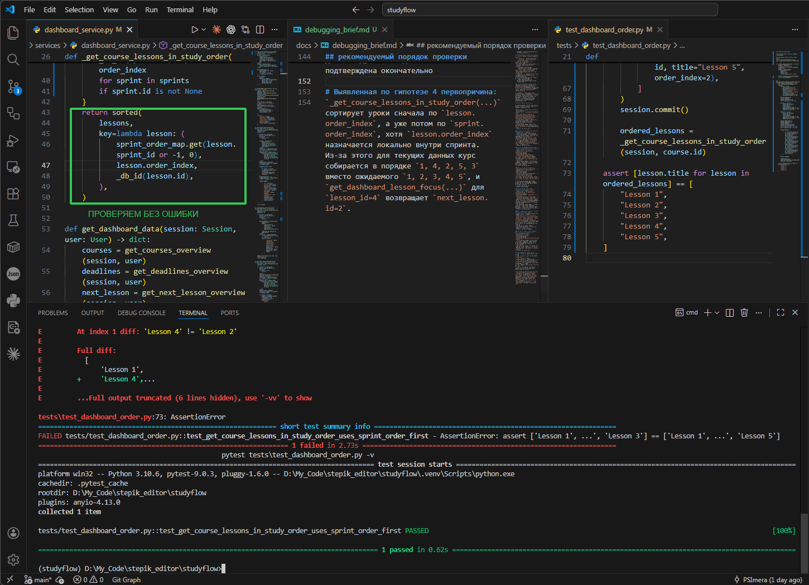

# Урок 4. Проверка качества тестов

_lesson_id: 2289234 · steps: 15 · ttc: 959s_

---

## Шаг 1 (step_id=9817271, text)

Плохие тесты

Сам факт наличия теста ещё ничего не гарантирует. В реальной работе много времени теряется не на отсутствие тестов, а на некачественные тесты, которые создают ложное чувство безопасности. Умение отличить хороший тест от плохого — такой же рабочий навык, как умение писать production-код.

Слабый тест

Слабый тест проходит, но почти ничего не защищает. Риск состоит в том, что система выбирает не тот следующий урок, а тест проверяет только то, что маршрут вернул 200 OK и на странице есть заголовок. Такой тест подтверждает, что экран открылся, но не говорит, правильные ли данные внутри.

# Слабый тест: проверяет только что страница открылась
def test_dashboard_loads(client):
    response = client.get("/dashboard")
    assert response.status_code == 200
    assert "Следующее занятие" in response.text

Слабость видна по разрыву между вопросом «какая поломка нас волнует?» и вопросом «что именно проверяет assertion?». Если баг в выборе конкретного урока, а проверка смотрит только на наличие страницы, это формальное покрытие, а не защита поведения.

# Сильный тест: проверяет конкретный инвариант
def test_dashboard_shows_correct_next_lesson(client, db_session):
    # спринт 2, урок 1 завершён — следующим должен быть спринт 2, урок 2
    setup_progress(db_session, completed=[(2, 1)], enrolled=[(2, 1), (2, 2), (3, 1)])

    response = client.get("/dashboard")

    assert response.status_code == 200
    assert response.json()["next_lesson"] == {"sprint": 2, "lesson": 2}

Хрупкий тест

Хрупкий тест слишком тесно привязан к внутренней реализации. Он ломается от безопасной перестройки кода, хотя пользовательское поведение осталось прежним. Для агентной разработки это особенно болезненно: агент делает разумный рефакторинг, а тесты взрываются не потому что продукт сломан, а потому что тест знал слишком много о внутренностях.

# Хрупкий тест: знает о внутренней структуре сервиса
def test_dashboard_calls_service(client, mocker):
    mock = mocker.patch("app.services.dashboard_service.get_ordered_lessons")
    mock.return_value = [{"sprint": 2, "lesson": 2, "completed": False}]

    client.get("/dashboard")

    mock.assert_called_once_with(user_id=1, course_id=1)

После рефакторинга, который переименовал или разделил get_ordered_lessons, этот тест покраснеет — хотя для пользователя ничего не изменилось. Такой барьер не защищает изменение, а запрещает безопасную перестройку.

Тест, вводящий в заблуждение

Тест зелёный и выглядит убедительно, но защищает не тот инвариант. Утверждает, что блок на dashboard содержит название какого-то урока, хотя настоящий риск — в выборе конкретного следующего урока и правильном порядке навигации.

# Вводящий в заблуждение: проверяет что урок есть, но не какой именно
def test_dashboard_has_next_lesson(client, db_session):
    setup_progress(db_session, completed=[(2, 1)], enrolled=[(2, 1), (2, 2), (3, 1)])

    response = client.get("/dashboard")
    data = response.json()

    assert "next_lesson" in data          # урок есть
    assert data["next_lesson"] is not None  # и он не пустой

Такой тест опаснее отсутствия теста. Когда теста нет, вы знаете, что защиты нет. Когда он есть, но проверяет не то, вы принимаете решения на ложной уверенности. Баг в выборе урока остаётся, при том что тест зелёный.

Как быстро отличить один тип от другого

Если тест почти ничего не говорит о целевой поломке — он слабый. Если падает от безопасной перестройки — хрупкий. Если зелёный, но всё ещё не защищает нужный риск — вводит в заблуждение.

Хороший тест защищает инвариант поведения. Плохой тест защищает случайный след текущей реализации. Поэтому после генерации теста работа не заканчивается — тест нужно читать почти так же внимательно, как production-код.

---

## Шаг 2 (step_id=9921468, text)

Ложные сигналы

Тест может ошибаться в обе стороны. И обе ошибки вредны.

Ложноположительный сигнал

Ложноположительный сигнал — это зелёный тест при реально сломанном поведении. Такое бывает, когда проверка слишком поверхностная, использует подменённые данные, не доходит до проблемной ветки или проверяет второстепенный признак вместо нужного контракта.

Например, реальный риск находится на стыке маршрута, сервиса и базы данных, а тест подменяет сервис заглушкой, которая всегда возвращает «правильный» ответ. Формально сценарий проходит, но проблемная ветка даже не была затронута. Сигнал зелёный, а защита иллюзорная.

Ложноотрицательный сигнал

Ложноотрицательный сигнал — это красный тест при корректном поведении. Обычно причина в хрупкой привязке к деталям реализации, нестабильных данных, неверной подготовке окружения или в том, что assertions проверяют слишком много лишнего.

Например, пользовательский результат тот же, но тест ожидает точный HTML-фрагмент, конкретный порядок внутренних вызовов или жёсткое количество элементов там, где контракт этого не обещал. После небольшой безопасной правки тест краснеет, хотя реального регресса нет. Такой тест разрушает workflow: команда перестаёт доверять красному прогону и начинает воспринимать тестовый слой как шум.

Как распознать проблему в ревью

При чтении нового теста стоит отдельно спросить себя: может ли этот тест остаться зелёным, если целевая поломка вернётся? Может ли он покраснеть после безопасного рефакторинга без изменения поведения? Есть ли в нём подменённые данные или моки, которые делают проблемный участок недостижимым? Не проверяет ли он случайные детали ответа вместо одного главного инварианта?

Почему обе ситуации вредят агентной разработке

Агент ориентируется на сигналы, которые вы ему даёте. Если тестовый слой врёт, весь следующий проход строится на плохой обратной связи. Ложноположительный прогон разрешает опасный рефакторинг. Ложноотрицательный заставляет чинить несуществующую проблему или откатывать нормальное изменение.

В обоих случаях ломается одно и то же: связь между реальностью проекта и тем, что показывает тестовый слой. Нам нужен не просто зелёный или красный сигнал, а сигнал, которому можно доверять.

---

## Шаг 3 (step_id=9921466, text)

Как ревьюить тесты

Тесты, написанные агентом, стоит читать с тем же уровнем подозрительности, что и обычный патч. Фраза «агент добавил покрытие» ещё не означает, что добавлена полезная защита.

Какие вопросы задавать к тесту

	Какой именно риск этот тест страхует?
	Что в нём является главным assertion?
	Не знает ли тест слишком много о внутренней реализации?
	Не проверяет ли он второстепенную деталь вместо контракта поведения?
	Можно ли объяснить, почему этот тест должен упасть на целевой поломке?

Если ответ на последний вопрос неочевиден, тест уже подозрителен. Сильный тест можно связать с поломкой одной фразой: если эта логика снова разойдётся, этот тест покраснеет. Попробуйте ответить на все пять вопросов письменно — если вместо короткого ответа получается длинное расплывчатое объяснение, тест скорее всего проверяет слишком много сразу или не попадает в главный риск.

На что смотреть в assertions, моках и фикстурах

Assertions должны быть ближе к поведению, чем к устройству кода. Если риск в результате выбора данных, главный assertion говорит о выбранном объекте, статусе, порядке или видимом результате — а не о том, что была вызвана конкретная внутренняя функция.

Моки и фикстуры должны помогать изолировать риск, а не создавать альтернативный мир, в котором поломка никогда не проявится. Если ради одного теста агент построил громоздкую цепочку моков, стоит остановиться и спросить, не проще ли был бы другой уровень теста. Если тест на маршрут полностью подменяет сервис, в котором был баг, такой тест проверяет только поведение заглушки, а не реальную цепочку.

На практике можно держать в голове три коротких правила:

	assertion отвечает на вопрос что сломается для пользователя?
	фикстура подготавливает только нужное состояние, а не целый искусственный мир
	мок уместен, если без него трудно изолировать внешний эффект, но он не должен подменять проблемный участок

Ловушка: тест и фикс в одном ответе агента

Отдельная проблема возникает, когда тест и фикс появились в одном ответе агента. Агент читает свой же код и пишет assertions, которые тот удовлетворяет. Тест зелёный, но он подтверждает только то, что код делает то, что он делает — а не то, что он должен делать.

# Агент написал фикс и тест вместе.
# Тест проверяет поведение фикса, а не исходный контракт.
def get_next_lesson(lessons):
    # фикс: сортировка по sprint_order, потом lesson_order
    return sorted(
        [l for l in lessons if not l["completed"]],
        key=lambda l: (l["sprint_order"], l["lesson_order"])
    )[0]

def test_next_lesson():
    lessons = [
        {"id": 3, "sprint_order": 2, "lesson_order": 1, "completed": False},
        {"id": 1, "sprint_order": 1, "lesson_order": 1, "completed": True},
    ]
    result = get_next_lesson(lessons)
    assert result["id"] == 3  # зелёный — но проверяет ли это нужный контракт?

Проверить это просто: откатите только фикс, оставив тест. Если тест не покраснел — он не защищает нужный контракт, а лишь описывает текущее поведение кода.

Полезный запрос после генерации

После того как агент написал тест, попросите его объяснить ценность:

Кратко объясни:
- какой риск страхует этот тест;
- почему выбран именно такой уровень;
- какой assertion в нём главный;
- на какой поломке он должен упасть.

Такой ответ не заменяет ревью, но помогает быстро увидеть, понимает ли агент, зачем он написал именно этот тест. Если агент не может назвать риск и точку падения — это повод перечитать тест ещё внимательнее.

---

## Шаг 4 (step_id=9921467, text)

Когда тестов уже достаточно

После генерации и ревью тестов может возникнуть желание продолжать усиливать их бесконечно. Тестовый барьер нужен для следующего инженерного шага, а не ради абстрактного идеала покрытия.

Признаки достаточного барьера

Барьер рабочий, если понятно какой риск или инвариант защищён, есть хотя бы один тест, который действительно должен ловить целевую поломку, и тесты запускаются в текущем workflow без лишней экзотики. Если следующий шаг — локальный bugfix или небольшой рефакторинг вокруг одного участка, не нужно сначала покрыть весь модуль и все соседние маршруты. Достаточно закрыть именно тот риск, ради которого вы продолжаете работу.

Когда усиливать барьер всё же нужно

Если тест зелёный, но неясно на чём он вообще должен падать — барьера ещё нет. Если тест краснеет от безопасной перестройки — барьер плохой. Если один и тот же риск проверяется только косвенно и через второстепенные детали — барьер слабый.

Иногда усиление оправдано: например, когда тест страхует только общий успех маршрута, но не конкретный выбор данных. Или когда он проходит лишь потому что внутри много подмен и проблемная ветка не исполняется. В таких случаях один точный тест полезнее, чем десять дополнительных проверок.

Покрытие как инструмент поиска слепых пятен

Отчёт о покрытии помогает найти ветки кода, до которых тесты вообще не доходят. В Python для этого достаточно:

pytest --cov=app --cov-report=term-missing tests/

Флаг --cov-report=term-missing покажет в терминале номера строк, которые не были выполнены ни одним тестом. Это полезно, когда нужно убедиться, что тест вообще доходит до проблемной ветки, а не проходит мимо неё.

Важная оговорка: высокий процент покрытия не означает хорошие тесты. Код может быть выполнен, но assertion при этом проверяет что-то второстепенное. Покрытие показывает, какие строки были запущены, — не то, правильно ли они работают. Метрика полезна как инструмент обнаружения слепых пятен, но не как цель сама по себе.

Практический вопрос перед остановкой

Перед тем как считать барьер достаточным, спросите себя: если сейчас слегка перестроить этот участок кода, какой тест должен остановить вас, если вы случайно вернёте исходную поломку? Если ответ есть и выглядит правдоподобно — барьер рабочий. Если ответа нет — работа с тестами ещё не закончена.

---

## Шаг 5 (step_id=9921469, text)

Практика: проверьте, что тест действительно защищает нужный сценарий

Эта практика продолжает кейс модуля. Нужно проверить, не создаёт ли тестовый барьер ложное чувство безопасности — до того как в следующем уроке вы начнёте вносить изменения.

Шаг 1. Проверьте исходную точку

Убедитесь, что смотрите на чистое состояние репозитория и на тот самый тест, который появился после предыдущего урока:

git branch --show-current
git status --short
git log -1 --oneline

pytest tests/ -q

Если дерево не чистое, сначала разберитесь с хвостом изменений. Иначе непонятно, какому именно состоянию тестов вы доверяете.

Шаг 2. Сопоставьте тест с реальным багом

Смотря на запись о первопричине и тестовый файл, ответьте себе на вопросы:

	какой конкретный риск страхует текущий тест;
	какой assertion в нём главный;
	ловит ли он именно тот сценарий, который был зафиксирован в первопричине;
	на какой реальной поломке он должен покраснеть.

Проверьте себя жёстко: баг из расследования мог быть не только в том, что выбирался не тот элемент в целом, но и в конкретном условии — при определённом состоянии данных, при определённом пути навигации, при определённом входном параметре. Если текущий тест не доходит до этого конкретного условия, барьер слабый, даже если он зелёный.

Шаг 3. При необходимости усильте барьер

Если нашли пробел, сформулируйте точечный запрос на закрытие именно этого условия:

Нужно усилить существующий тестовый барьер.

Контекст:
- первопричина: [конкретное условие из вашей записи];
- текущий тест: [имя файла из 04.03];
- пробел: тест проверяет [что проверяет], но не ловит [конкретное условие].

Задача:
- перечитать запись о первопричине и текущий тест;
- если тест не ловит нужное условие, дополни его минимально необходимым сценарием;
- переиспользуй существующий стиль и фикстуры;
- прод-код не меняй.

Ограничения:
- не добавляй новые зависимости;
- не перестраивай тестовую инфраструктуру;
- не трогай несвязанные тесты;
- в финале коротко объясни, какой ложный зелёный сигнал теперь убран.

Если пробела нет и тест уже ловит нужное условие — это тоже хороший результат, переходите к шагу 4.

Шаг 4. Проверьте, что сигналу можно доверять

После любых правок запустите только релевантный тестовый файл и перечитайте diff:

pytest tests/ваш_тестовый_файл.py -v

Если баг учебный и вы делали его руками, можно сразу проверить тест откатив поломку — тест должен стать зелёным. Если баг реальный, тест останется красным до следующего урока, где мы его исправим.

После этого вы должны уметь произнести одну короткую формулировку: этот тест защищает [конкретное условие] и должен падать, если [конкретная поломка] вернётся. Если такой формулировки нет, барьер всё ещё расплывчатый.

Шаг 5. Зафиксируйте результат

Практика выполнена, если у вас есть тестовый барьер, которому можно доверять перед следующим локальным изменением, и вы можете назвать конкретное условие, которое он защищает. Завершите шаг коммитом:

git add tests/
git commit -m "step 04-04-05: усилить тестовый барьер [короткое описание условия]"

---

## Шаг 6 (step_id=9962115, choice)

Что лучше всего описывает слабый тест?

**Тип:** choice (single)

**Варианты:**
- ✓ Он зелёный, но почти не страхует целевой риск
- ○ Он проверяет поведение через пользовательский маршрут
- ○ Он краснеет после безопасной перестройки кода
- ○ Он падает только при смене внешнего контракта

---

## Шаг 7 (step_id=9962113, choice)

Когда тест чаще всего становится хрупким?

**Тип:** choice (single)

**Варианты:**
- ○ Когда он проверяет публичный результат, а не вызовы
- ✓ Когда он знает порядок внутренних шагов сервиса
- ○ Когда он ловит конкретную поломку в пользовательском потоке
- ○ Когда он строится вокруг главного assertion по контракту

---

## Шаг 8 (step_id=9962112, choice)

Что важнее всего спросить в ревью нового теста?

**Тип:** choice (single)

**Варианты:**
- ○ Какие моки и фикстуры в нём выглядят наиболее аккуратно
- ○ Какой участок кода агент переписал вместе с тестом
- ○ Сколько внутренних веток модуля он задевает косвенно
- ✓ На какой реальной поломке тест обязан покраснеть

---

## Шаг 9 (step_id=9962116, choice)

Что характерно для ложноположительного сигнала?

**Тип:** choice (multiple)

**Варианты:**
- ○ Тест падает после безобидной перестройки кода
- ✓ Мок скрывает участок, где реально живёт поломка
- ✓ Проверяется наличие блока, а не правильный выбор урока
- ✓ Тест зелёный, хотя дефектная ветка всё ещё активна

---

## Шаг 10 (step_id=9962109, choice)

Что часто приводит к ложноотрицательному сигналу?

**Тип:** choice (multiple)

**Варианты:**
- ✓ Assertion привязан к точному HTML без нужного риска
- ○ Один главный assertion проверяет внешний контракт
- ✓ Подготовка данных зависит от нестабильного состояния
- ✓ Тест проверяет порядок внутренних вызовов сервиса

---

## Шаг 11 (step_id=9962114, choice)

Что полезно проверить в assertions, моках и фикстурах?

**Тип:** choice (multiple)

**Варианты:**
- ✓ Не создаёт ли фикстура больше состояния, чем нужно
- ✓ Какой assertion действительно страхует основной риск
- ○ Чем больше подмен и setup, тем надёжнее тест
- ✓ Не вырезает ли мок участок с предполагаемой поломкой

---

## Шаг 12 (step_id=9962117, choice)

Когда тестовый барьер уже можно считать достаточным?

**Тип:** choice (multiple)

**Варианты:**
- ✓ Барьер ловит нужный сбой и не мешает безопасной перестройке
- ✓ После него можно делать следующий локальный bugfix
- ○ Полностью покрыты все соседние сценарии модуля
- ✓ Есть явная связь теста с конкретной поломкой

---

## Шаг 13 (step_id=9962110, matching)

Сопоставьте тип проблемы и её признак

**Тип:** matching

**Правильные пары:**
- Слабый тест → Почти не связан с целевой поломкой
- Хрупкий тест → Ломается от безопасной перестройки
- Ложноположительный сигнал → Зелёный при реальном баге
- Ложноотрицательный сигнал → Красный без регресса поведения

---

## Шаг 14 (step_id=9962108, matching)

Сопоставьте элемент ревью и главный вопрос

**Тип:** matching

**Правильные пары:**
- Assertion → Что сломается для пользователя
- Фикстура → Как подготовить только нужное состояние
- Мок → Не скрывает ли он проблемный участок
- Точка падения → На каком баге тест обязан покраснеть

---

## Шаг 15 (step_id=9962111, matching)

Сопоставьте ситуацию и правильное действие

**Тип:** matching

**Правильные пары:**
- Тест проверяет только заголовок страницы → Уточнить контракт поведения
- Тест знает порядок helper-функций → Ослабить связь с реализацией
- Сервис полностью заменён заглушкой → Проверить реальную проблемную ветку
- Один риск уже надёжно закрыт → Переходить к следующему изменению

---
