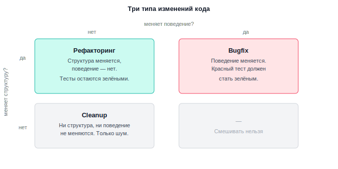
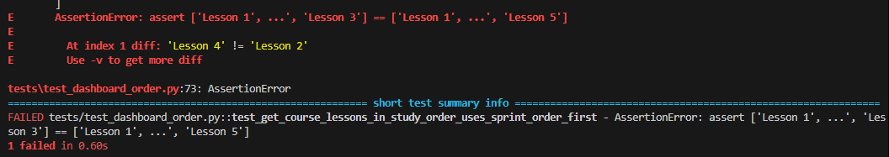
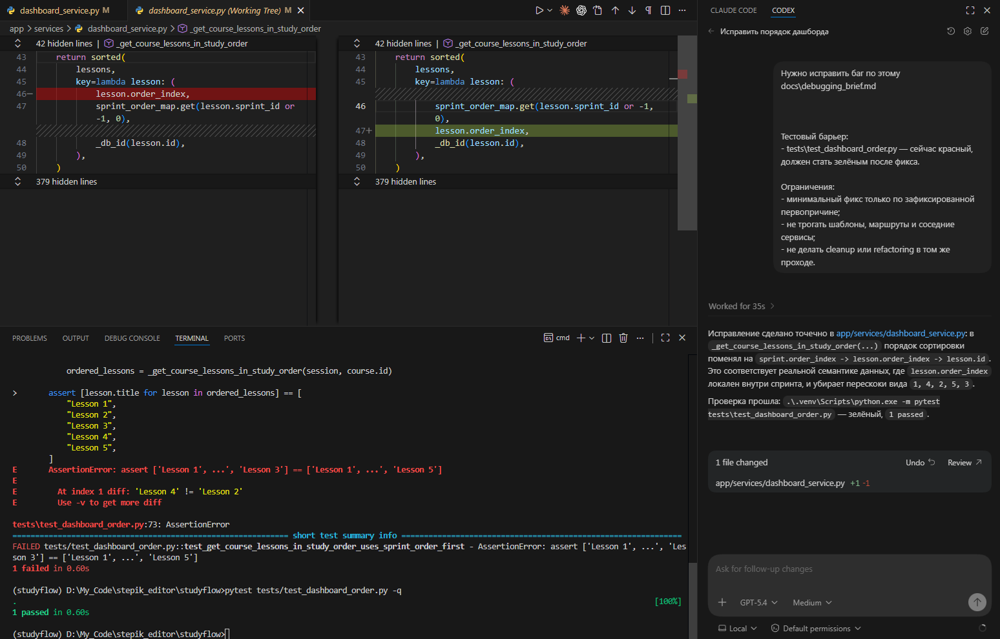
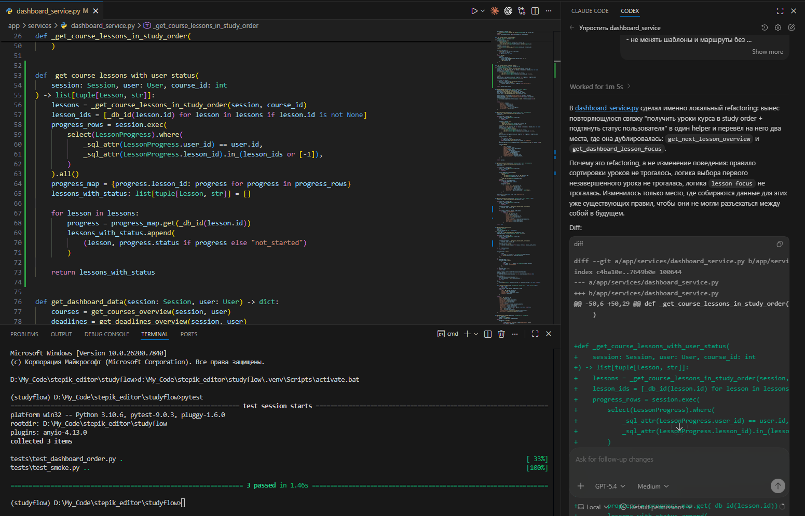

# Урок 5. Исправление кода с агентом

_lesson_id: 2289262 · steps: 14 · ttc: 174s_

---

## Шаг 1 (step_id=9817314, text)

Три типа изменений кода

Запрос вроде приведи этот участок в порядок легко даёт в ответ один diff, в котором перемешаны три разных типа изменений. Но bugfix, cleanup и рефакторинг решают разные задачи, а значит по-разному ставятся, проверяются и принимаются.

Bugfix

Bugfix меняет наблюдаемое поведение. До патча пользовательский сценарий давал неверный результат, после патча начинает давать верный.

Падает тест, который должен стать зелёным. Маршрут отдавал не тот результат и теперь отдаёт тот. Кнопка вела не туда и теперь ведёт туда, куда должна.

Если вы меняете то, что система делает, это bugfix, даже если код после этого стал чище.

Cleanup

Cleanup — это локальная уборка без изменения поведения и без заметного архитектурного шага. Обычно это переименование, удаление мёртвого кода, выравнивание форматирования, перенос мелкой константы, удаление дубля комментария.

Cleanup полезен, когда он действительно убирает шум. Но он не должен маскировать ни исправление ошибки, ни реальное структурное изменение. Иначе diff становится труднее читать: непонятно, где была инженерная причина, а где просто косметика.

Рефакторинг

Рефакторинг меняет устройство кода, но сохраняет наблюдаемое поведение. Снаружи система должна работать так же, как раньше; внутри код становится проще сопровождать.

Одинаковая логика перестаёт дублироваться в разных местах. Сложная часть кода получает отдельную функцию с ясной ответственностью. Следующий bugfix или тест теперь делается в одном понятном месте, а не в нескольких.

Если вы просите рефакторинг, а агент в том же проходе исправляет баг, чуть-чуть меняет шаблон и заодно полирует стиль, вы теряете управляемость. Diff шире, тестовый сигнал слабее, а смысл изменения приходится угадывать.

Если после изменения должен поменяться результат для пользователя, это bugfix. Если результат должен остаться тем же, а проще становится устройство кода, это рефакторинг.

---

## Шаг 2 (step_id=9921472, text)

Рефакторинг

Узкий рефакторинг начинается не с абстрактного желания сделать код красивее, а с конкретного ответа на вопрос: что именно станет проще после этого изменения.

Какие цели подходят хорошо

Хорошая цель касается одного локального участка, проверяется текущими тестами и чтением diff, а после неё следующий инженерный шаг действительно упрощается. Если хотя бы одно из трёх не выполняется, цель либо слишком широкая, либо пока не сформулирована достаточно конкретно.

Дублирование логики

Одна и та же обработка данных встречается в двух местах: например, в одном файле или в двух разных сервисах. Любое следующее изменение нужно вносить дважды, и риск рассинхронизации растёт с каждым фиксом. Цель: убрать повторяющийся проход и оставить поведение прежним. После этого следующий bugfix или тест делается в одном месте.

Функция, которая делает слишком много

Один метод получает данные из базы, фильтрует их по статусу, вычисляет следующий элемент и формирует ответ. Написать тест на конкретное условие фильтрации невозможно — придётся поднимать всё окружение целиком. Цель: вынести вычисление следующего элемента в отдельную функцию с явным входом и выходом. После этого тест на это условие пишется в три строки без лишних зависимостей.

Условие, которое нельзя прочитать

Вложенное if с тремя условиями через and и or без объяснения, что именно проверяется. Логика правильная, но следующий человек не может сказать, является ли это намеренным бизнес-правилом или случайным накоплением исправлений. Цель: вынести условие в функцию с говорящим именем. Поведение не меняется, но теперь понятно что проверяется — и следующий bugfix не сломает это случайно.

Цель не обязана звучать громко. Скромная формулировка вроде «убрать один дублирующийся проход и оставить поведение прежним» — это часто и есть правильный масштаб.

Какие цели ведут не туда

Абстрактные формулировки — улучшить архитектуру, привести к лучшим практикам, сделать код чище, отрефакторить модуль — не задают ни границ, ни сигнала остановки. Агент в такой ситуации либо делает минимальное косметическое изменение и называет его рефакторингом, либо переписывает половину слоя. Ни тот, ни другой результат не поддаётся нормальной проверке.

Начинать рефакторинг, когда bugfix ещё не отделён, — отдельная ошибка. Если тест красный и причина уже доказана, сейчас не время структурных улучшений. Сначала нужен минимальный фикс, который возвращает работоспособность кода. После этого уже можно спросить: есть ли смысл локально упростить устройство того же участка? Если смешать это в один проход, diff может стать нечитаемым, а тестовый сигнал потерять смысл.

Проверить цель просто: если её нельзя закончить фразой «после этого станет проще делать X», значит, она пока сформулирована слишком туманно.

Шаблон запроса для рефакторинга

Узкий рефакторинг лучше просить отдельным запросом — это помогает удержать границу между исправлением бага, косметикой и структурным изменением без смены поведения.

В запросе стоит явно обозначить участок, цель, инвариант поведения, страховку и запреты:

Нужно выполнить небольшой рефакторинг.

Участок:
app/services/order_service.py,
только логика сортировки и фильтрации элементов очереди.

Цель:
убрать повторяющийся проход по одним и тем же данным так,
чтобы следующее изменение этой логики делалось в одном месте.

Поведение должно остаться прежним:
- порядок элементов в ответе не меняется;
- существующие тесты остаются зелёными.

Страховка:
- pytest tests/test_order.py -q
- pytest tests/test_smoke.py -q
- чтение diff по изменённым файлам

Запрещено:
- не исправлять новые баги;
- не менять маршруты и шаблоны без необходимости;
- не добавлять абстракции вне выбранного участка;
- не трогать несвязанные сервисы и тесты.

Такой шаблон работает в Codex, Claude Code и Cursor одинаково — формат интерфейса разный, но инженерная рамка одна. Главное, что он даёт: явные границы того, куда агент может лезть, и чёткий сигнал остановки.

Цикл: план → проверка → diff → решение

Прежде чем отправлять запрос, зафиксируйте план в двух-трёх предложениях: что именно трогаем, что выносим или объединяем, какие файлы допустимо менять. Если уже на этом этапе хочется перечислить пять файлов и три побочные идеи, это сигнал сузить цель, а не продолжать.

До изменения нужно знать, какие тесты и сценарии обязаны сохраниться. После изменения запускаете именно их. Красная база — не старт для рефакторинга: если нужный тест уже падает до ваших правок, сначала отделите bugfix.

Зелёные тесты не заменяют чтение diff. Тест отвечает на вопрос «поведение сохранилось». Diff отвечает на другой: «агент действительно сделал тот маленький шаг, о котором вы просили?» При чтении diff стоит проверить три вещи: не вышел ли агент в соседние файлы без причины, не подмешал ли cleanup, не появилась ли лишняя абстракция, которую теперь нужно сопровождать отдельно.

После этого — простое решение: остановиться или сделать ещё один проход. В большинстве случаев правильный ответ — остановиться. Второй проход нужен только если его цель так же ясна и так же хорошо страхуется текущими тестами. Хороший рефакторинг заканчивается раньше, чем становится интересно «сделать ещё чуть-чуть».

---

## Шаг 3 (step_id=9921470, text)

Минимальный bugfix

Когда первопричина доказана и тестовый барьер написан, остаётся исправить именно то, что сломано, и ничего больше.

Что значит минимальный

Минимальный bugfix меняет ровно то, что объясняет симптом. Не больше. Если первопричина — неправильный порядок сортировки в одной функции, фикс касается этой функции. Соседние методы, которые «тоже можно было бы улучшить», остаются нетронутыми. Переименования, выравнивание форматирования и попутные структурные улучшения — в другой коммит, если они вообще нужны.

Это не педантизм. Чем уже diff, тем проще убедиться, что тест стал зелёным именно по нужной причине, а не случайно. Широкий diff с несколькими изменениями сразу маскирует, что именно сработало.

Как давать агенту контекст на фикс

К этому моменту у вас уже есть debugging brief с зафиксированной первопричиной и тест, который описывает нужный контракт поведения. Это и есть весь контекст для агента: не нужно пересказывать историю расследования или объяснять симптом заново. Достаточно передать первопричину и тест как границу результата.

Хороший запрос выглядит так: вот конкретное место и механизм поломки из brief, вот тест, который должен стать зелёным, вот что трогать нельзя.

Отдельно стоит явно запретить cleanup и рефакторинг в том же проходе. Не потому что агент обязательно их сделает, а потому что явный запрет снижает вероятность того, что небольшое «попутное улучшение» попадёт в diff незамеченным.

Как принять результат

После того как агент предложил изменение, до коммита запустите тест, который был красным — он должен стать зелёным. Запустите smoke-тесты — они должны остаться зелёными. Прочитайте diff — изменение должно касаться только того участка, который был в запросе.

Если тест зелёный, но diff шире, чем ожидалось, — это повод разобраться, что именно агент поменял и почему. Иногда это оправданно, иногда это лишнее изменение, которое лучше убрать и зафиксировать отдельно.

Коммит как граница

Bugfix и последующий рефакторинг должны лежать в разных коммитах. Это не формальность: отдельный коммит на фикс позволяет потом точно сказать, что именно вернуло нужное поведение, и при необходимости откатить только его. Коммит на рефакторинг позволяет отдельно проверить, что структурное изменение не сдвинуло поведение.

Если оба изменения оказались в одном коммите, это не катастрофа — но следующему человеку, который будет разбираться в истории, придётся угадывать, где был фикс, а где косметика.

---

## Шаг 4 (step_id=9921473, text)

Практика: сначала отделите bugfix, потом сделайте маленький рефакторинг

По итогам прошлых уроков модуля у нас есть debugging_brief.md с описанием первопричины и того, как мы к ней пришли, и тест, который описывает нужный контракт поведения. Баг ещё не исправлен. Именно с этой точки начинается текущий урок.

Шаг 1. Проверьте исходную точку

Прежде чем что-то менять, убедитесь, что рабочее дерево чистое и тест действительно красный:

git branch --show-current
git status --short
git log -2 --oneline
pytest tests/<ваш тест>

Если дерево не чистое, разберите хвост изменений перед тем, как двигаться дальше.

Если у вас учебный рукотворный баг и тест зелёный после проверки в прошлом уроке, не забудьте вернуть баг на место для чистоты эксперимента.

Шаг 2. Сделайте минимальный bugfix

Откройте docs/debugging_brief.md — там зафиксирована первопричина и конкретный участок, который нужно исправить. Передайте этот контекст агенту вместе с тестом:

Нужно исправить баг по этому debugging brief.

[вставьте содержимое docs/debugging_brief.md]

Тестовый барьер:
- tests/<ваш тест> — сейчас красный, должен стать зелёным после фикса.

Ограничения:
- минимальный фикс только по зафиксированной первопричине;
- не трогать шаблоны, маршруты и соседние сервисы;
- не делать cleanup или рефакторинг в том же проходе.

После того как агент предложит изменение, запустите тесты:

pytest tests/<ваш тест> -q

Если тест зелёный — зафиксируйте bugfix отдельным коммитом:

git add app/services/dashboard_service.py
git commit -m "step 04-05-04: исправить порядок уроков на dashboard"

Это отдельный контрольный шаг. Не подмешивайте сюда структурные изменения — ни переименования, ни переносы, ни «раз уж я уже в этом файле».

Шаг 3. На зелёной базе выберите один маленький рефакторинг

Теперь посмотрите на тот же участок с другим вопросом: что здесь стало бы проще, если убрать одно конкретное дублирование или выделить одну понятную функцию? Это не обязательная часть — после фикса архитектура уже может быть достаточно чистой. Но нередко сам баг был симптомом структурной проблемы, и её стоит устранить отдельным шагом.

Для StudyFlow, например, можно устранить повторяющийся проход по упорядоченным урокам и их статусам, который сейчас нужен сразу в двух местах: при выборе следующего незавершённого урока и при формировании блока lesson focus. Если ваш проект другой, посмотрите, возможно, есть аналогичный локальный дубль.

Пример запроса для агента:

Нужно выполнить небольшой рефакторинг в app/services/dashboard_service.py.

Участок:
логика получения упорядоченных уроков курса и их статусов пользователя,
которая сейчас повторяется в связанных проходах.

Цель:
локализовать этот повторяющийся код в одном месте без изменения поведения.

Поведение должно остаться прежним:
- tests/test_dashboard_order.py остаётся зелёным;
- tests/test_smoke.py остаётся зелёным;
- выбор следующего незавершённого урока и lesson focus не меняются.

Ограничения:
- не исправлять новые баги;
- не менять шаблоны и маршруты без необходимости;
- не добавлять широкие абстракции вне выбранного участка;
- в финале показать diff и объяснить, почему это именно рефакторинг.

Если узкую цель сформулировать не получается, это нормальный результат. Остановитесь на bugfix-этапе и не раздувайте шаг искусственно.

Шаг 4. Примите результат по полному циклу

После прохода агента перечитайте diff — не вышел ли он за заявленный участок. Запустите тесты — оба должны остаться зелёными. Проверьте, не подмешал ли агент cleanup или дополнительный bugfix. Затем решите, нужен ли ещё один шаг, или цель уже достигнута.

В большинстве случаев правильный ответ — остановиться после первого локального рефакторинга. Второй проход нужен только если его цель так же ясна и так же хорошо страхуется текущими тестами.

Если рефакторинг удался, зафиксируйте его отдельным коммитом:

git add app/services/dashboard_service.py
git commit -m "step 04-05-04: локализовать статусы уроков"

Что считать завершением практики

Практика выполнена, если bugfix и рефакторинг лежат в отдельных коммитах с разными сообщениями и вы можете по diff и тестам объяснить, почему второй коммит — именно рефакторинг, а не ещё один фикс.

Самостоятельная практика на других проектах

Тот же алгоритм работает на любой кодовой базе, независимо от стека и проекта. Если хотите потренироваться на чужом коде:

	Найдите или создайте воспроизводимый симптом — в своём проекте или в публичном репозитории.
	Соберите debugging brief: где симптом, как воспроизвести, что ожидали, что получили.
	Локализуйте первопричину через гипотезы, не трогая код.
	Напишите тест на контракт поведения до фикса.
	Сделайте минимальный bugfix — только по доказанной причине.
	На зелёной базе, при необходимости, один узкий рефакторинг с явным инвариантом.

Для поиска материала подходят репозитории с реальными багами: BugsInPy для Python и Defects4J для Java дают воспроизводимые случаи с тестами и исправленными версиями. Если хотите практиковаться на незнакомом коде без готовых багов, возьмите любой небольшой открытый проект, внесите узкую учебную поломку и пройдите весь цикл как чужую проблему.

---

## Шаг 5 (step_id=9967081, choice)

Какой главный признак bugfix?

**Тип:** choice (single)

**Варианты:**
- ○ После правки diff легче читать на ревью
- ○ Изменение затрагивает один файл проекта
- ○ Код становится короче и аккуратнее
- ✓ Меняется наблюдаемое поведение системы

---

## Шаг 6 (step_id=9967076, choice)

Что лучше всего описывает хороший маленький рефакторинг?

**Тип:** choice (single)

**Варианты:**
- ○ Любая локальная правка после зелёного теста
- ○ Полировка стиля без явной инженерной цели
- ✓ Поведение то же, а сопровождать код проще
- ○ Переписывание слоя ради более чистой архитектуры

---

## Шаг 7 (step_id=9967083, choice)

Когда можно переходить к рефакторингу?

**Тип:** choice (single)

**Варианты:**
- ✓ После минимального bugfix на зелёной базе
- ○ Сразу после обнаружения подозрительного участка
- ○ Когда агент предлагает улучшить всё рядом
- ○ Когда хочется заодно выровнять стиль файла

---

## Шаг 8 (step_id=9967078, choice)

Какие цели подходят для узкого рефакторинга?

**Тип:** choice (multiple)

**Варианты:**
- ○ Перестроить модуль по лучшим практикам целиком
- ✓ Выделить понятную функцию с ясной ролью
- ✓ Убрать один повторяющийся проход по данным
- ✓ Сделать следующий шаг в одном месте

---

## Шаг 9 (step_id=9967084, choice)

Что делает формулировку цели плохой?

**Тип:** choice (multiple)

**Варианты:**
- ○ В ней упомянут один конкретный участок кода
- ✓ Она не задаёт границы изменения
- ✓ Она звучит как «улучшить архитектуру»
- ✓ После неё непонятно, где остановиться

---

## Шаг 10 (step_id=9967080, choice)

Что должно входить в запрос на рефакторинг?

**Тип:** choice (multiple)

**Варианты:**
- ✓ Выбранный участок и его границы
- ○ Просьба заодно поправить соседние баги
- ✓ Тесты и чтение diff как страховка
- ✓ Инвариант поведения после изменения

---

## Шаг 11 (step_id=9967082, choice)

Что нужно проверить после прохода агента?

**Тип:** choice (multiple)

**Варианты:**
- ○ Стал ли код максимально абстрактным
- ✓ Не подмешан ли cleanup или bugfix
- ✓ Остались ли нужные тесты зелёными
- ✓ Не вышел ли diff в соседний scope

---

## Шаг 12 (step_id=9967079, matching)

Сопоставьте тип изменения и его признак

**Тип:** matching

**Правильные пары:**
- Bugfix → Меняет наблюдаемое поведение
- Cleanup → Убирает локальный шум без шага в архитектуру
- Refactoring → Меняет устройство без смены результата
- Широкий diff → Скрывает, что именно сработало

---

## Шаг 13 (step_id=9967075, matching)

Сопоставьте ситуацию и правильное действие

**Тип:** matching

**Правильные пары:**
- Тест уже красный до правок → Сначала отделить bugfix
- Цель звучит слишком широко → Сузить участок и результат
- Тесты зелёные после изменения → Прочитать diff перед решением
- Следующий шаг уже стал проще → Остановиться после прохода

---

## Шаг 14 (step_id=9967077, matching)

Сопоставьте элемент цикла и его задачу

**Тип:** matching

**Правильные пары:**
- План → Задать чёткую цель и допустимые границы
- Проверка → Убедится в корректности поведения
- Diff → Убедиться, что изменения локальные
- Решение → Понять, нужен ли ещё один цикл

---
