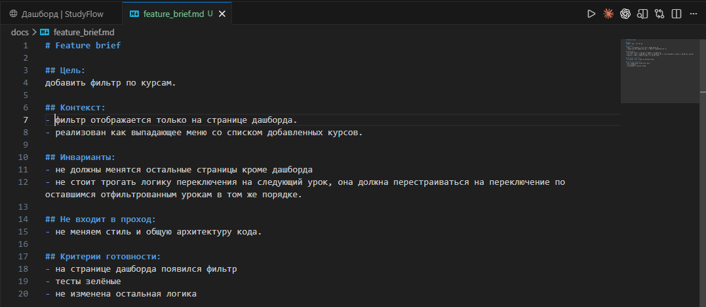
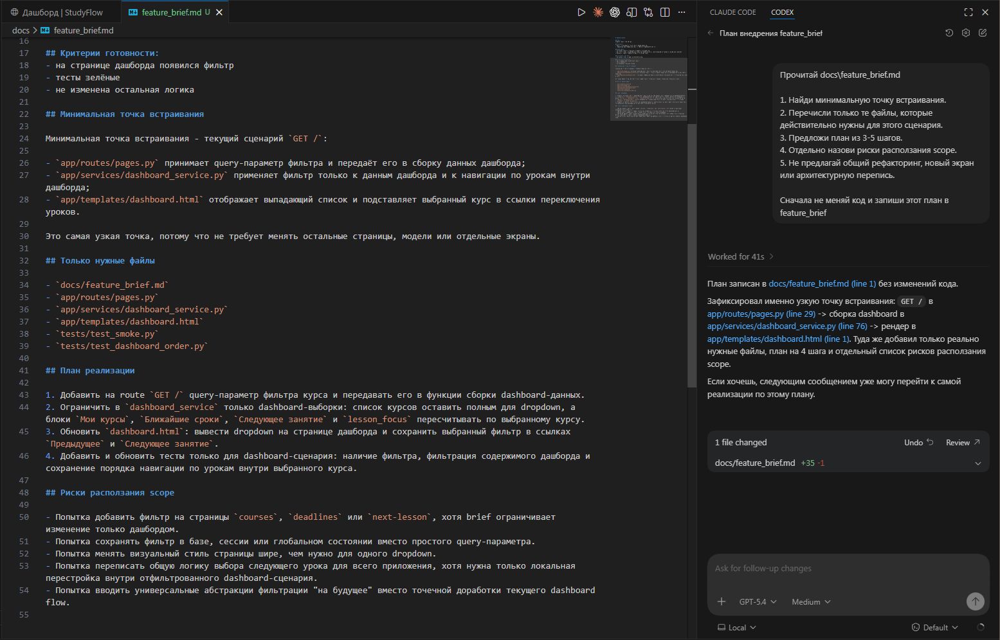
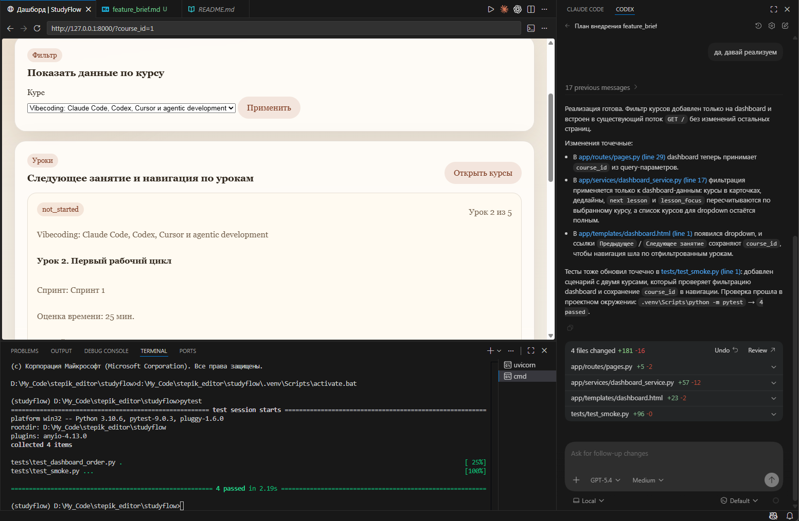

# Урок 1. Разработка фичи в существующем проекте

_lesson_id: 2289235 · steps: 15 · ttc: 315s_

---

## Шаг 1 (step_id=9817272, text)

Почему новая фича в живом проекте опаснее, чем кажется

Когда агент пишет код с нуля, он не связан прошлой историей проекта. В существующем продукте ситуация обратная: каждое новое действие уже встроено в маршруты, данные, тесты, нейминг и ожидания пользователей. Поэтому задача добавить маленькую фичу в реальном репозитории редко бывает маленькой сама по себе. Маленькой её делает только хорошая инженерная рамка.

С нуля мы придумываем, в проекте мы встраиваемся

В пустом репозитории можно свободно выбирать структуру файлов, формат данных и способ реализации. В живом проекте почти всё это уже определено. Есть текущий пользовательский поток, есть существующие сервисы, есть модель состояния экрана, есть тестовые ожидания. Если агент не видит эти границы, он начинает улучшать соседние участки просто потому, что может.

Отсюда и главный риск feature-задач: вместо локальной доработки вы получаете полу-рефакторинг слоя. В diff попадают переименования, перенос логики, новая абстракция и случайные косметические правки. Формально фича может даже заработать, но принять такой проход трудно: непонятно, какие изменения были необходимыми, а какие агент добавил по собственной инициативе.

Ограничения уже существуют до первого запроса

Перед стартом фичи полезно определиться, что в системе должно остаться после изменения. Обычно это не одна вещь, а несколько классов ограничений. Например это могут быть:

	Пользовательский поток: новый сценарий не должен ломать существующий путь пользователя.
	Данные: формат сущностей, обязательные поля и порядок вычислений уже кем-то используются.
	Интерфейс или API: соседи по системе ожидают конкретный контракт.
	Тесты и проверки: даже если они неполные, они всё равно задают границы поведения.
	Соседний scope: рядом почти всегда есть код, который можно «улучшить», но не нужно трогать в этом проходе.

Начинать стоит именно с фиксации точки встраивания и инвариантов. Сначала мы определяем рамку, что агенту запрещено менять, и только потом просим реализацию.

Один пользовательский сценарий лучше общей идеи

Фича часто приходит в формулировке уровня продукта: добавить фильтры, поддержать уведомления, показать статус. Для агента это слишком широко. В работе ему нужен не лозунг, а один наблюдаемый сценарий: кто именно что делает, в каком месте интерфейса или API, что считается успешным результатом и где заканчивается текущий проход. Например, вместо:

- добавь поиск по урокам

 Сильнее звучит такая постановка:

+ пользователь на экране курса вводит подстроку в поле поиска и видит отфильтрованный список уроков без изменения маршрутов, модели курса и соседних экранов

Это уже не абстрактная функция, а локальный пользовательский проход с границами.

---

## Шаг 2 (step_id=9987339, text)

Feature brief: что дать агенту перед реализацией

Большинство проблем в feature-задачах начинается не после генерации кода, а раньше: на этапе постановки. Если запрос сводится к одной фразе вроде добавь возможность X, агенту приходится самому догадываться о границах, точке встраивания и критериях готовности. Поэтому перед реализацией нужен короткий артефакт, который делает задачу инженерной, а не расплывчатой. В этом уроке назовём такой артефакт feature brief.

Из чего состоит хороший feature brief

Brief не должен превращаться в большую спецификацию. Его задача проще: дать агенту достаточно контекста, чтобы тот сделал один узкий проход и не расползся по проекту. Для этого обычно хватает пяти блоков.

	Цель: какой новый сценарий должен заработать.
	Точка встраивания: где в продукте и в коде примерно живёт это поведение.
	Инварианты: что должно остаться неизменным.
	Запреты по scope: что нельзя переписывать, переносить или улучшать в этом проходе.
	Критерии готовности: по каким сигналам вы примете результат.

Шаблон, который можно использовать в работе

Feature brief

Цель:
[какой пользовательский сценарий должен заработать]

Контекст:
[где этот сценарий находится в продукте и какие файлы/слои, вероятно, задействованы]

Инварианты:
- [что должно остаться прежним]
- [какой существующий поток нельзя сломать]

Не входит в этот проход:
- [какие соседние улучшения запрещены]
- [какие слои или файлы нельзя трогать без отдельного согласования]

Критерии готовности:
- [какой сценарий проверяем руками]
- [какие тесты или локальные проверки ожидаются]
- [какой diff считаем приемлемым]

Заметьте, здесь нет требования заранее описать реализацию. Мы не говорим агенту, какую именно абстракцию создавать, какой helper заводить и как назвать новую функцию. Мы задаём задачу через поведение и границы, а не через микроменеджмент кода.

Как выглядит сильный и слабый brief

Слабый вариант звучит так:

- Добавь фильтрацию уроков по статусу на dashboard

Агенту придётся самому разбираться в логике фильтра, как перестроить состояние страницы, нужно ли трогать API и можно ли заодно почистить соседний код.

Сильный вариант длиннее, но конкретнее:

Нужно добавить на dashboard фильтр "только незавершённые уроки".

Сценарий:
пользователь включает фильтр на текущем экране и видит только незавершённые уроки без изменения порядка карточек.

Точка встраивания:
существующий экран dashboard и его текущий источник данных.

Инварианты:
- существующая загрузка dashboard остаётся рабочей;
- порядок карточек уроков не меняется;
- другие фильтры и маршруты не добавляем.

Не входит в проход:
- общий рефакторинг dashboard;
- редизайн панели фильтров;
- изменения в соседних экранах.

Критерии готовности:
- фильтр работает локально на dashboard;
- существующие проверки экрана остаются зелёными;
- diff ограничен экраном dashboard и связанным узким источником данных.

Что brief даёт вам как инженеру

Feature brief полезен не только агенту. Он помогает вам самому заметить, что задача всё ещё слишком широкая. Если вы не можете назвать инварианты и запреты, значит проход пока не готов к делегированию. Если критерии готовности звучат как «ну в целом должно работать», значит принимать результат будет тяжело.

Хороший признак: после brief вы можете быстро ответить на три вопроса. Что именно должно заработать? Что нельзя трогать? По чему поймём, что проход завершён? Если ответы есть, агенту уже можно выдавать задачу.

В следующем шаге разберём, как превратить такой brief в запрос для агента так, чтобы агент сначала нашёл точку встраивания и предложил минимальный план, а не сразу ушёл в широкую реализацию.

---

## Шаг 3 (step_id=9987336, text)

Как сузить рамку фичи для агента

Даже хороший feature brief можно испортить одной деталью: сразу попросить агента «сделать всё». Для живого проекта это почти всегда слишком рано. Сначала полезнее заставить модель пройти через промежуточный инженерный шаг: найти точку встраивания, предложить минимальный план и показать, какие файлы она считает затронутыми.

Сначала прочитать, затем править

Во всех агентных системах действует один и тот же принцип: перед внесением изменений лучше сделать короткий этап планирования. Это особенно важно в задачах, где есть риск выхода за изначальные границы.

Ниже feature brief. Сначала не редактируй код.

1. Найди вероятную точку встраивания.
2. Назови минимальный набор файлов, который может понадобиться.
3. Предложи короткий план из 3-5 шагов.
4. Отдельно перечисли риски расползания scope.
5. Не предлагай рефакторинг и архитектурные улучшения без прямой необходимости.

[вставьте feature brief]

Что явно сказать агенту перед редактированием

Узкая задача обычно выигрывает от трёх прямых ограничений:

	Один сценарий: реализуем только один наблюдаемый пользовательский проход.
	Один инженерный слой: меняем экран и близкий источник данных, но не пересобираем архитектуру вокруг.
	Один stop-point: после локальной реализации и проверки останавливаемся, а не полируем всё вокруг.

Практически это можно оформить так:

Если для реализации достаточно локального изменения, не расширяй задачу.
Не добавляй новые абстракции без доказанной необходимости.
Если видишь соседние улучшения, перечисли их отдельным списком как follow-up, но не включай в текущий diff.

Какие ответы считать тревожными

Если агент на этапе плана предлагает вынести общую платформенную абстракцию, пересобрать слой состояния, обновить naming по модулю или «заодно почистить» несколько файлов, это сигнал остановиться. Скорее всего, исходный запрос всё ещё слишком широкий или плохо закреплён инвариантами.

Другой тревожный сигнал: агент не может назвать точку встраивания и начинает перечислять полрепозитория. В этом случае не стоит сразу переходить к редактированию. Нужно либо уточнить пользовательский сценарий, либо самому сузить зону поиска и дать более конкретный brief.

Рабочая формула этого шага

Сначала карта изменения, потом минимальный план, потом локальный diff. Этот ритм кажется медленнее, чем запрос на внесение изменений с первого промпта, но на практике именно он экономит время: вам проще принять результат, проще понять, не ушёл ли агент в сторону, и проще остановить проход до того, как он затронет лишний код.

---

## Шаг 4 (step_id=9987337, text)

Приём фичи

Если новая возможность просто открывается и визуально похожа на ожидаемую, этого ещё недостаточно. В существующем проекте важен не только факт появления фичи, но и качество инженерного прохода: насколько локален diff, не сломаны ли соседние сценарии, не появилась ли лишняя сложность и действительно ли результат соответствует исходному brief.

Первый сигнал: пользовательский сценарий работает именно так, как был поставлен

Проверка начинается с самой простой проверки: заработал ли тот конкретный сценарий, ради которого вы запускали задачу? Не в общем смысле экран не упал, а в узком: пользователь сделал действие, увидел именно тот результат, который был обещан в brief, и не столкнулся с неожиданным побочным эффектом.

Если brief формулировался правильно, здесь легко проверить готовность. У вас уже есть один сценарий, одна точка входа и один наблюдаемый результат. Если же brief был туманным, приёмка быстро скатывается в расплывчатое «ну вроде похоже».

Второй сигнал: локальные проверки страхуют изменение

Даже для маленькой фичи полезно иметь хотя бы минимальный набор проверок. Это может быть существующий тест, новый локальный тест, ручной smoke на экране или короткая команда, которая доказывает работоспособность сценария. Важно не количество проверок, а связь с риском изменения.

	Если фича добавляет ветку UI, нужен сценарий, который проходит через эту ветку.
	Если меняется обработка данных, нужна проверка нового и старого поведения.
	Если затронут API-контракт, стоит проверить как минимум один успешный и ошибочный пути.

Плохая привычка — считать приёмку завершённой после одной ручной проверки. Для локального прохода этого часто мало: агент мог подмешать изменение в соседний поток, который просто не попал в текущий тест.

Третий сигнал: diff читается и укладывается в заявленные границы

Diff — это не формальность, а главный способ понять, осталась ли задача инженерно управляемой. Если ради одного фильтра внезапно изменились имена переменных, переносы функций и соседние экраны, перед вами уже не локальная фича, а смешанный проход.

При чтении diff полезно задать три вопроса:

	Каждая правка действительно нужна для нового сценария?
	Есть ли изменения в местах, которые brief запрещал трогать?
	Смогу ли я через неделю быстро объяснить смысл этого diff?

Четвёртый сигнал: агент не спрятал вторую задачу внутри первой

Частая проблема feature-проходов — агент незаметно совмещает несколько целей. В одном diff оказываются новая фича, cleanup, случайный рефакторинг и мелкая правка поведения рядом. Даже если каждое изменение по отдельности не выглядит страшным, вместе они ухудшают приёмку: непонятно, что именно проверено и какой частью diff объясняется результат.

Если такое случилось, хороший инженерный ответ не героически принимать всё сразу, а разделить проход. Либо вернуться к точечному изменению, либо попросить агента вынести соседние улучшения в отдельное задание.

---

## Шаг 5 (step_id=9987338, text)

Практика: добавьте небольшую фичу проект

В этой практике вы проходите полный feature-workflow: выбираете один маленький пользовательский сценарий, фиксируете его в feature brief, даёте агенту read-first маршрут, затем принимаете результат по проверкам и diff. Как и ранее, мы показываем на примере StudyFlow, вы практикуетесь на собственном проекте.

Шаг 1. Выберите один узкий сценарий

Подойдёт фича, которая улучшает существующий функционал, но не тянет за собой большую архитектурную ветку. Для StudyFlow это может быть локальная доработка вроде отображения метки Новый для только что опубликованных уроков, небольшого фильтра на dashboard или компактного состояния пустого списка на одном экране.

Хороший признак: сценарий можно сформулировать в одном предложении и он затрагивает один главный пользовательский путь. Плохой признак: вам хочется сразу добавить настройки, новый экран, общую систему фильтрации и ещё пару косметических улучшений.

Шаг 2. Соберите feature brief

Создайте короткий документ или заметку с такой структурой:

# Feature brief

## Цель
- [какой новый сценарий должен заработать]

## Контекст
- [на каком экране/маршруте это живёт и какие файлы, вероятно, связаны]

## Инварианты
- [что должно остаться без изменений]
- [какой существующий сценарий нельзя сломать]

## Не входит в проход
- [что не делаем сейчас]

## Критерии готовности
- [что проверите руками]
- [какие тесты или локальные команды запустите]
- [какой diff считаете нормальным]

Если brief уже на этом этапе расползается на полстраницы, сократите задачу. Цель практики не в том, чтобы поручить агенту самую амбициозную доработку, а в том, чтобы удержать один инженерный проход под контролем.

Шаг 3. Запустите read-first проход

Сначала не просите агента сразу редактировать код. Дайте ему найти точку встраивания:

Ниже feature brief. Сначала не меняй код.

1. Найди минимальную точку встраивания.
2. Перечисли только те файлы, которые действительно нужны для этого сценария.
3. Предложи план из 3-5 шагов.
4. Отдельно назови риски расползания scope.
5. Не предлагай общий рефакторинг, новый экран или архитектурную перепись.

[вставьте ваш feature brief]

После ответа агента сравните его карту с вашей. Если он тянет в задачу слишком много файлов или предлагает общий redesign, сузьте brief и повторите шаг.

Шаг 4. Попросите узкую реализацию и проверьте результат

Когда точка встраивания понятна, разрешите редактирование и явно повторите ограничения по scope. После изменения выполните ваш локальный набор проверок: ручной пользовательский сценарий, нужные тесты и чтение diff.

git status --short
pytest tests/<релевантный набор> -q
git diff -- app/ tests/

Шаг 5. Зафиксируйте stop-point

Опишите в двух-трёх предложениях, почему задача считается завершённой именно сейчас. Важно уметь не только стартовать фичу, но и останавливаться после достаточного локального результата. Если агент предлагает ещё несколько улучшений, оставьте их отдельным списком, но не включайте автоматически в текущий проход.

Что считать завершением практики

Практика выполнена, если у вас есть один feature brief, один локальный diff, одна понятная точка встраивания и набор проверок, который позволяет объяснить: новая фича заработала, соседний scope не расползся, а результат принят не на ощущении, а по артефактам.

---

## Шаг 6 (step_id=9990822, choice)

Почему агент в существующем проекте начинает менять больше, чем требует фича?

**Тип:** choice (single)

**Варианты:**
-  Он вынужден поддерживать совместимость с тестами
- [✓ правильный] Он улучшает всё, что замечает, раз уже в этом месте
-  Он не может читать чужой код без явных подсказок
-  Он ждёт явного разрешения на каждое следующее действие

**Статус Stepik:** `correct` (score 1.0)

**Мой reasoning:** _В теории прямо сказано: если агент не видит границ, он начинает улучшать соседние участки просто потому, что может — это и есть причина расползания scope._

---

## Шаг 7 (step_id=9990826, choice)

Какой вывод следует сделать, если вы не можете назвать инварианты для задачи?

**Тип:** choice (single)

**Варианты:**
-  Агенту потребуется дополнительный проход на рефакторинг
-  Задача слишком техническая для делегирования агенту
- [✓ правильный] Проход ещё не готов к делегированию
-  Нужно добавить больше примеров в постановку задачи

**Статус Stepik:** `correct` (score 1.0)

**Мой reasoning:** _В теории прямо сказано: если вы не можете назвать инварианты и запреты, значит проход пока не готов к делегированию. Это сигнал, что задача всё ещё слишком широкая._

---

## Шаг 8 (step_id=9990817, choice)

Почему хороший feature brief не описывает реализацию заранее?

**Тип:** choice (single)

**Варианты:**
- [✓ правильный] Задача задаётся через поведение и границы, а не код
-  Реализация зависит от навыков конкретного разработчика
-  Агент сам запросит детали реализации при необходимости
-  Описание реализации делает задачу слишком технической

**Статус Stepik:** `correct` (score 1.0)

**Мой reasoning:** _В теории прямо сказано: 'Мы задаём задачу через поведение и границы, а не через микроменеджмент кода' — brief описывает сценарий, инварианты и запреты, а не способ реализации._

---

## Шаг 9 (step_id=9990818, choice)

Какие пункты помогают удержать feature brief в инженерных границах?

**Тип:** choice (multiple)

**Варианты:**
-  Полная дорожная карта развития продукта
- [✓ правильный] Инварианты того, что нельзя сломать
- [✓ правильный] Один наблюдаемый пользовательский сценарий
- [✓ правильный] Запрет на соседние улучшения в этом проходе

**Статус Stepik:** `correct` (score 1.0)

**Мой reasoning:** _Brief удерживается в инженерных границах через инварианты, запреты по scope и один узкий сценарий. Полная дорожная карта продукта противоположна сужению — она расширяет рамку._

---

## Шаг 10 (step_id=9990825, choice)

Что должен показать агент на этапе планирования до начала редактирования?

**Тип:** choice (single)

**Варианты:**
-  Оценку сложности и ожидаемого времени реализации
-  Полный список файлов, которые могут понадобиться
- [✓ правильный] Точку встраивания и минимальный набор файлов
-  Список всех потенциальных рисков в кодовой базе

**Статус Stepik:** `correct` (score 1.0)

**Мой reasoning:** _В теории прямо сказано: на read-first этапе агент должен найти точку встраивания и назвать минимальный набор файлов, который может понадобиться. Полный список файлов и оценки времени противоречат принципу узкой рамки._

---

## Шаг 11 (step_id=9990820, choice)

Какие ограничения полезно явно повторить агенту перед реализацией?

**Тип:** choice (multiple)

**Варианты:**
-  Нужно сразу закрыть все сценарии вокруг этой функции
- [✓ правильный] Не добавляем рефакторинг без прямой необходимости
- [✓ правильный] Работаем только с одним пользовательским сценарием
- [✓ правильный] Соседние идеи фиксируем как follow-up, а не включаем в текущий проход

**Статус Stepik:** `correct` (score 1.0)

**Мой reasoning:** _Теория прямо называет три ограничения: один сценарий, без новых абстракций/рефакторинга без необходимости, соседние улучшения — отдельным follow-up списком. Закрывать «все сценарии вокруг» — это расползание scope, противоречит принципу узкой рамки._

---

## Шаг 12 (step_id=9990819, choice)

Что отличает хорошую приёмку фичи от поверхностной?

**Тип:** choice (single)

**Варианты:**
- [✓ правильный] Нужны сценарий, проверки и diff
-  Главное, чтобы агент изменил как можно больше файлов
-  Достаточно увидеть, что экран не падает
-  Если код выглядит аккуратно, остальное уже неважно

**Статус Stepik:** `correct` (score 1.0)

**Мой reasoning:** _В теории явно сказано: приёмка строится на том, что заработал конкретный сценарий из brief, есть локальные проверки, страхующие изменение, и diff читается в заявленных границах. Остальные варианты — поверхностные подходы, которые урок прямо критикует._

---

## Шаг 13 (step_id=9990824, matching)

Сопоставьте элементы и их роли

**Тип:** matching

**Колонка А (вопросы):**
- Цель
- Точка встраивания
- Инварианты
- Критерии готовности

**Колонка Б (варианты, перемешаны):**
- Где находится изменение в продукте и коде
- По каким сигналам принимается результат
- Какой сценарий должен заработать
- Что должно остаться прежним после доработки

**Правильные пары:**
- Цель → Какой сценарий должен заработать
- Точка встраивания → Где находится изменение в продукте и коде
- Инварианты → Что должно остаться прежним после доработки
- Критерии готовности → По каким сигналам принимается результат

**Статус Stepik:** `correct` (score 1.0)

**Мой reasoning:** _Соответствие напрямую из теории: пять блоков feature brief — цель=сценарий, точка встраивания=место в продукте/коде, инварианты=что остаётся неизменным, критерии готовности=сигналы приёмки._

---

## Шаг 14 (step_id=9990823, matching)

Сопоставьте ситуацию с выводом

**Тип:** matching

**Колонка А (вопросы):**
- Агент перечислил много несвязанных файлов
- В diff появился cleanup рядом с фичей
- План ограничен несколькими связанными файлами
- Проверен только общий вид экрана

**Колонка Б (варианты, перемешаны):**
- Точка встраивания найдена достаточно узко
- Внутрь прохода попала вторая задача
- Границы задачи пока заданы слишком широко
- Приёмка пока не страхует изменение

**Правильные пары:**
- Агент перечислил много несвязанных файлов → Границы задачи пока заданы слишком широко
- В diff появился cleanup рядом с фичей → Внутрь прохода попала вторая задача
- План ограничен несколькими связанными файлами → Точка встраивания найдена достаточно узко
- Проверен только общий вид экрана → Приёмка пока не страхует изменение

**Статус Stepik:** `correct` (score 1.0)

**Мой reasoning:** _Широкий список файлов — сигнал размытого scope; cleanup в diff — спрятанная вторая задача; узкий план — найденная точка встраивания; поверхностная проверка — слабая приёмка._

---

## Шаг 15 (step_id=9996715, choice)

Какие признаки чаще всего говорят о расползании прохода?

**Тип:** choice (multiple)

**Варианты:**
- [✓ правильный] Агент предлагает общий платформенный слой «на будущее»
- [✓ правильный] В diff появились правки вне целевого сценария
-  Изменение осталось локальным и объяснимым
- [✓ правильный] Соседние улучшения смешаны с основной задачей

**Статус Stepik:** `correct` (score 1.0)

**Мой reasoning:** _Признаки расползания — смешивание соседних улучшений, предложение общих абстракций без необходимости и правки вне целевого сценария. Локальный и объяснимый diff, наоборот, признак удержанной рамки._

---
