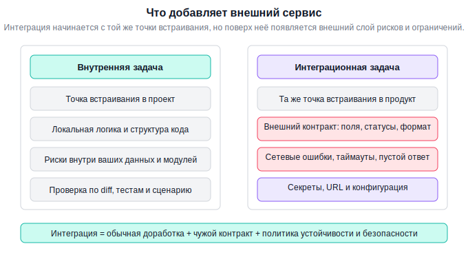
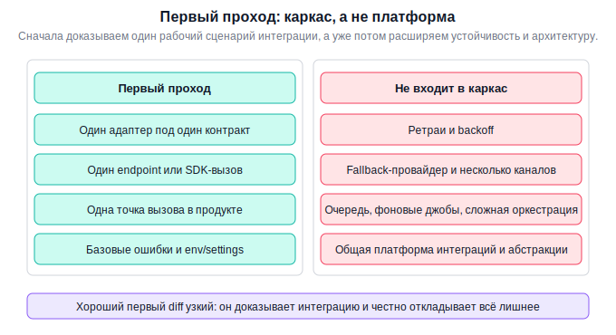
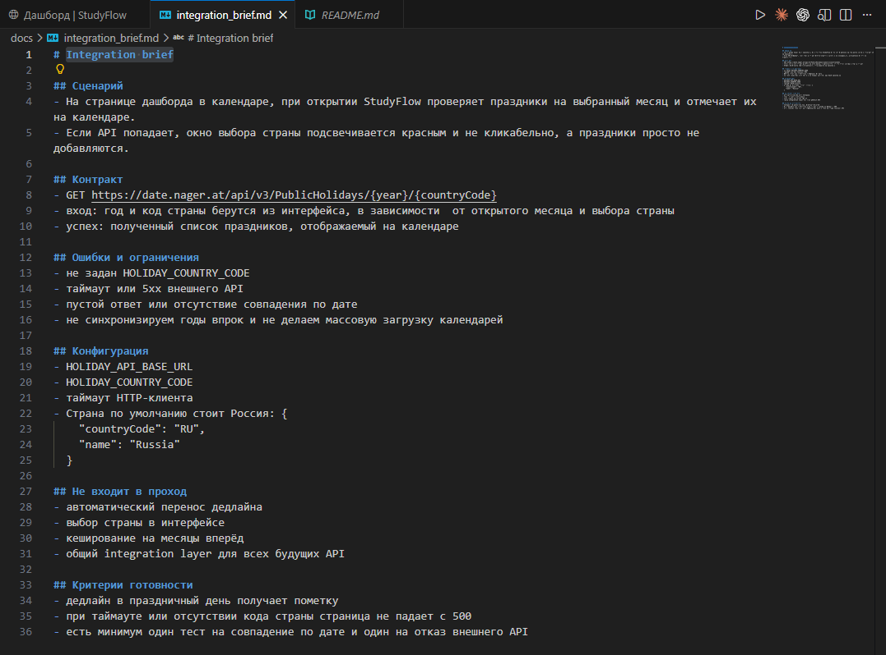
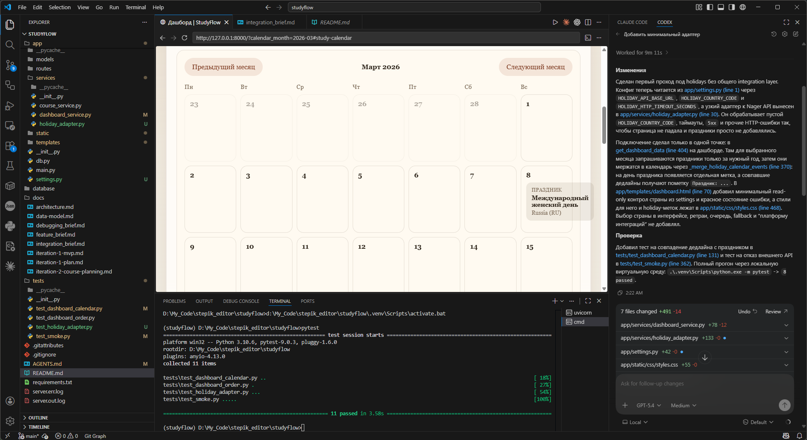
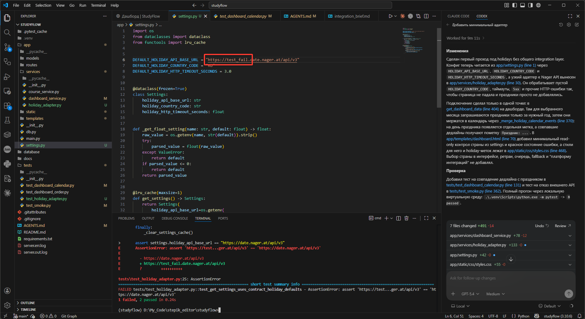

# Урок 2. API и внешние интеграции

_lesson_id: 2289236 · steps: 15 · ttc: 631s_

---

## Шаг 1 (step_id=9817273, text)

Что меняется, когда в задаче появляется внешний сервис

Пока код работает полностью внутри вашего репозитория, почти все ограничения находятся под вашим контролем. Как только в сценарии появляется внешний API, SDK или вебхук-провайдер, картина меняется: теперь есть внешний контракт, чужие ошибки, таймауты, лимиты и секреты, которые нельзя случайно утащить в код или логи. Поэтому интеграционная задача всегда шире обычной внутренней доработки, даже если объём кода кажется небольшим.

Внутренний код и внешний контракт подчиняются разным рискам

Когда вы добавляете обычную локальную фичу, основная неопределённость связана с точкой встраивания в текущий проект. В интеграции к этому добавляется внешний договор: какие поля обязательны, какой формат ответа приходит, какие ошибки возвращает провайдер, как выглядит поведение при пустом ответе и что делать, если сервис временно недоступен.

Именно поэтому запрос вида подключи этот API почти гарантированно слабый. Он не фиксирует, что агент должен считать успехом, какие случаи обязан обработать сразу, а какие можно оставить на следующий проход.

Интеграционный сценарий начинается не с кода, а с границ

Полезно заранее определить четыре вещи:

	Контракт: что мы отправляем наружу и что ожидаем получить обратно.
	Точки отказа: что делаем при таймауте, ошибке статуса, пустом ответе или невалидных данных.
	Секреты и конфигурация: где находятся токены, ключи и URL, и как не протащить их в репозиторий.
	Граница прохода: где заканчивается текущий проход — на адаптере, на одном endpoint или на одном пользовательском сценарии.

Если этого нет, агент начинает угадывать политику безопасности и устойчивости сам. Иногда он сделает разумный каркас, а иногда зашьёт токен в пример, залогирует лишнее или построит чрезмерную обвязку ради воображаемого production-ready состояния.

Одного успешного сценария почти никогда не достаточно

В задаче на обычную фичу один успешный сценарий, так называемый happy path, уже сам по себе может дать полезный первый сигнал. Это ситуация, в которой всё идёт по плану: конфигурация на месте, сервис отвечает как ожидается, ошибок нет. В интеграции этого мало. Внешний сервис может ответить медленно, частично, пусто, с ошибкой авторизации или в неожиданном формате. Если агент написал код, который работает только на идеальном ответе, надёжного инженерного результата ещё нет.

Это не значит, что в первом проходе нужно закрыть все возможные граничные случаи. Значит только одно: даже в узком проходе стоит заранее назвать хотя бы базовые негативные сценарии, которые нельзя игнорировать.

---

## Шаг 2 (step_id=9987342, text)

Integration brief: контракт, ограничения, точки отказа

Чтобы агент не превращал подключение API в смесь из сетевой логики, конфигов, логирования и догадок о надёжности, интеграционную задачу лучше начинать с короткого integration brief. Он нужен для того, чтобы зафиксировать внешний контракт и минимальный инженерный объём первого прохода.

Какие блоки должны быть в integration brief

	Сценарий: какой пользовательский или системный поток требует внешний вызов.
	Контракт: endpoint, SDK-метод или webhook, формат входа и ожидаемого выхода.
	Ошибки и точки отказа: какие негативные случаи должны быть учтены уже сейчас.
	Конфигурация: где находятся токены, URL и другие параметры.
	Политика логирования: что можно логировать, а что нельзя.
	Границы прохода: что именно входит в текущую интеграцию, а что останется на следующий этап.

Шаблон integration brief

Integration brief

Сценарий:
[какой поток в продукте требует внешний вызов]

Контракт:
- провайдер / endpoint / SDK:
- входные данные:
- ожидаемый успешный ответ:

Ошибки и ограничения:
- какие статусы или исключения нужно обработать сейчас;
- что делать при пустом или невалидном ответе;
- какие таймауты/лимиты важны для первого прохода.

Конфигурация:
- откуда берутся токен, base URL и прочие настройки;
- что нельзя хардкодить.

Логирование и безопасность:
- какие данные допустимо писать в логи;
- какие секреты и payload запрещено логировать.

Не входит в этот проход:
- [список того, что явно откладываем]

Критерии готовности:
- [что проверяем на успешном и негативном пути]
- [какие тесты, моки или локальные прогоны нужны]
- [какой diff считаем приемлемым]

Чем этот brief отличается от обычного feature brief

Обычный feature brief отвечает на вопрос: какой сценарий должен заработать внутри существующего проекта. Integration brief добавляет ещё один слой: какой внешний контракт мы считаем реальностью и как защищаемся от его неидеального поведения. В постановке появляются таймауты, статусы ошибок, секреты и политика логирования.

Если не зафиксировать эти вещи явно, агент всё равно примет решения, но молча. Например, может положить токен прямо в пример конфигурации, залогировать целый ответ провайдера вместе с чувствительными полями или не различать 401 и 500.

Пример узкого integration brief

Нужно подключить внешний сервис уведомлений для одного сценария:
после успешной публикации нового урока отправлять короткое сообщение в webhook.

Контракт:
- POST /notify
- вход: title, lesson_id, published_at
- успешный ответ: 200 или 202

Обязательно обработать сейчас:
- отсутствие токена/URL в конфигурации;
- таймаут запроса;
- ответ 4xx/5xx;
- пустое тело ответа.

Конфигурация:
- URL и токен брать из переменных окружения;
- в коде и логах не хранить секреты.

Не входит в проход:
- ретраи с очередью;
- fallback-провайдер;
- админка для настройки интеграции.

Критерии готовности:
- успешный вызов проходит локальный тест;
- при отсутствии конфигурации система отвечает предсказуемо;
- diff ограничен интеграционным адаптером и точкой вызова.

Практическая польза brief

Хороший integration brief помогает не только агенту, но и вам. После него легко увидеть, не слишком ли широка задача. Если brief уже требует очередей, ретраев, circuit breaker, мониторинга и пользовательских настроек — это почти точно не один проход. Сначала стоит ограничиться каркасом интеграции и базовой обработкой ошибок.

---

## Шаг 3 (step_id=9987344, text)

Как просить агента сначала собрать каркас интеграции, а не весь production-ready слой

В интеграционных задачах агент особенно склонен к переусложнению. Как только в постановке появляются внешний сервис и ошибки, модель легко начинает строить ретраи, абстракции провайдеров, очереди, толстые обёртки и «универсальные» клиенты. Иногда всё это выглядит солидно, но для первого прохода почти всегда избыточно. Поэтому полезно явно делить интеграцию на этапы.

Этап 1: адаптер и контракт

Первый проход должен доказать, что приложение умеет обращаться к внешнему сервису в одном конкретном сценарии и предсказуемо переживает базовые ошибки. Это не момент для большой платформы интеграций — это момент для узкого адаптера и одной точки вызова.

По этому integration brief сначала не строй общий integration layer.

Нужен первый проход:
1. Создай минимальный адаптер под один endpoint / один SDK-вызов.
2. Подключи его только в один целевой сценарий.
3. Обработай обязательные ошибки из brief.
4. Используй конфигурацию через env / settings, без хардкода секретов.
5. Не добавляй ретраи, очередь, fallback-провайдер и общую платформу без отдельного запроса.

[вставьте integration brief]

Почему каркас лучше большой «правильной» архитектуры

Пока вы ещё не доказали, что внешний вызов правильно встроен в продуктовый сценарий, общая архитектура интеграции почти всегда преждевременна. Возможно, endpoint изменится. Возможно, окажется, что нужны другие поля. Возможно, пользовательский поток стоит перестроить. Маленький адаптер и локальный вызов дешевле пересобрать, чем большую платформу, построенную на ранних предположениях.

Кроме того, каркас проще принимать. В diff легче увидеть, где формируется запрос, как берётся конфигурация и как обрабатываются ошибки. Когда всё спрятано под многоуровневой обвязкой, инженерный контроль снижается.

Какие улучшения сознательно откладывать

На следующий этап часто логично вынести:

	ретраи и backoff;
	fallback-провайдера;
	несколько endpoint одного сервиса;
	систему фоновой очереди;
	расширенные метрики и мониторинг;
	админскую настройку интеграции.

Все эти вещи могут быть важны, но только после того, как вы приняли первый узкий проход по контракту и базовым отказам.

Что считать хорошим ответом агента

Хороший ответ на первом этапе показывает один локальный путь: где находится адаптер, где он вызывается, как берётся конфигурация и какие ошибки уже учтены. Он также явно называет, что не вошло в текущий diff. Это облегчает дальнейшую эволюцию: позже вы сможете отдельно запросить усиление устойчивости, не смешивая всё сразу.

Плохой ответ начинает с построения общей платформы интеграций «на будущее». Обычно это выглядит красиво, но плохо связано с одним текущим сценарием и труднее проверяется.

---

## Шаг 4 (step_id=9987341, text)

Как проверять интеграцию без слепой веры в happy path

Интеграция не считается принятой только потому, что однажды успешно вернула 200. Внешний сервис остаётся внешним: он может быть недоступен, отвечать неожиданно, требовать конфигурацию, возвращать пустой payload или вести себя медленно. Поэтому инженерная приёмка интеграции всегда должна включать как минимум один негативный слой.

Что проверить кроме успешного вызова

Минимальный набор зависит от сценария, но чаще всего полезны четыре класса проверок:

	Нет конфигурации: что делает система без токена, ключа или URL.
	Ошибка сети: что происходит при таймауте, обрыве соединения или недоступности API.
	Плохой ответ: что делает код при 4xx/5xx или невалидном payload.
	Логи и сообщения: не утекают ли секреты и можно ли по логам понять, что произошло.

Эти проверки не обязаны сразу покрывать весь спектр деградаций. Но хотя бы один контролируемый негативный кейс в первом проходе почти всегда обязателен — иначе вы принимаете интеграцию только по счастливому пути.

Как это проверять на практике

Для локальной разработки обычно достаточно комбинации из моков, подмены ответа и ручного прогона с неполной конфигурацией. Например, можно отдельно убедиться, что при отсутствии токена код не падает неочевидным исключением, а возвращает предсказуемый результат или понятную ошибку.

Если у вас есть тесты, полезно иметь хотя бы один сценарий на успешный вызов и один на отказ. Если тестов нет или они пока не покрывают интеграцию, сделайте ручную табличку проверки: что произойдёт без токена, при таймауте и при пустом ответе. Главное — не забыть эти случаи, а не обязательно сразу автоматизировать всё.

Логи тоже входят в приёмку

Агент может написать корректную обработку ошибки и одновременно испортить безопасность логов. Например, залогировать целый payload вместе с секретом, токеном или чувствительными пользовательскими данными. Поэтому хороший integration brief заранее фиксирует политику логирования, а приёмка проверяет, соблюдена ли она.

Хорошее правило: лог должен помогать диагностике, но не раскрывать секреты и не превращать журнал во вторую базу данных. Для первого прохода часто достаточно логировать тип ошибки, контекст сценария и технический код ответа без чувствительного содержимого.

Diff тоже нужно читать

Как и в обычной задаче на фичу, diff показывает, не спрятал ли агент лишнюю архитектуру внутри интеграции. Если ради одного webhook в проекте появились общий API-клиент, фабрика провайдеров, система ретраев и несколько новых уровней абстракции, стоит остановиться и пересобрать проход.

---

## Шаг 5 (step_id=9987343, text)

Практика: подключите внешний API в узком сценарии

В этой практике ваша задача — не «подключить всё», а провести один узкий интеграционный проход. Вы выбираете один внешний сценарий, оформляете его через integration brief, просите агента сначала собрать каркас интеграции, а затем принимаете результат по контракту, негативным кейсам и чистоте diff. На примере StudyFlow можно взять бесплатный и реалистичный сценарий: при показе дедлайнов приложение делает справочный запрос во внешний API и помечает, что дата спринта попадает на официальный праздник. Если у вас есть собственный проект и готовый платный сервис, используйте его. Если нет, возьмите один из бесплатных вариантов из этого шага.

Шаг 1. Выберите один реалистичный внешний сценарий

Подойдут кейсы вроде загрузки внешних данных, отправки webhook-уведомления, интеграции с сервисом писем, валидации через внешний endpoint или получения статуса из стороннего API. Для StudyFlow это может быть, например, уведомление о публикации нового урока, подтягивание внешней метки курса или узкий справочный запрос к стороннему сервису.

Избегайте задач, которые сразу требуют платформы интеграций, очередей и нескольких провайдеров. Цель практики — один контракт, один адаптер, один пользовательский или системный сценарий.

Nager.Date — это открытый JSON API с данными о государственных праздниках для разных стран. Он хорошо подходит для учебной интеграции, потому что даёт простой HTTP-контракт, понятный ответ и не заставляет сразу разбираться со сложной авторизацией. Документация сервиса: https://date.nager.at/Api.

Если нужен готовый бесплатный кейс для проекта, подобного StudyFlow, возьмите интеграцию с API праздников Nager.Date. Узкий сценарий здесь такой: на странице дедлайнов приложение по дате спринта проверяет, не попадает ли она на официальный праздник в выбранной стране, и при совпадении показывает рядом с датой короткую пометку. Это хороший первый проход: один внешний endpoint, один адаптер и одна точка встраивания в существующий экран.

Не расширяйте этот проход до автоматического переноса сроков, выбора страны в интерфейсе, кеша на несколько месяцев и общей платформы внешних интеграций. Для первого шага достаточно вынести код страны и базовый URL в настройки, а при недоступности внешнего API просто не показывать праздничную пометку и не ломать страницу дедлайнов.

Шаг 2. Соберите integration brief

Зафиксируйте в заметке:

Integration brief

Сценарий:
[когда и зачем приложение обращается наружу]

Контракт:
- endpoint / SDK / webhook
- входные данные
- ожидаемый успешный ответ

Ошибки и ограничения:
- отсутствие токена/ключа
- таймаут или сетевой сбой
- 4xx/5xx или пустой ответ

Конфигурация:
- где хранятся URL и секреты

Не входит в проход:
- [что сознательно оставляете на потом]

Критерии готовности:
- [какой успешный и какой негативный кейс проверите]
- [какие тесты, моки или ручные проверки выполните]

Пример brief для бесплатного кейса в StudyFlow

Шаг 3. Попросите у агента каркас, а не платформу

Сначала дайте агенту задачу на минимальный адаптер и одну точку вызова:

Ниже integration brief.
Нужен первый проход, а не общий integration layer.

1. Создай минимальный адаптер под этот сценарий.
2. Подключи его только в одну точку приложения.
3. Учти ошибки, перечисленные в brief.
4. Бери конфигурацию из env/settings.
5. Не добавляй ретраи, очередь, fallback и общую платформу интеграций.

[вставьте ваш integration brief]

Если агент начинает строить слишком широкую архитектуру, остановите проход и сузьте задачу.

Шаг 4. Проверьте happy path и один негативный путь

После реализации выполните как минимум два типа проверки: успешный вызов и один контролируемый отказ. Это может быть отсутствие токена, искусственный таймаут, ответ с ошибкой или пустой payload. Важно показать, что вы принимаете интеграцию не только по счастливому пути.

pytest tests/<релевантные тесты> -q

Отдельно проверьте, что внешняя интеграция не ломает исходный пользовательский поток вокруг того места, где она встраивается.

Шаг 5. Зафиксируйте, что осталось вне прохода

После практики составьте короткий список того, что пойдёт на следующий этап: например, ретраи, очередь, расширенные метрики или второй endpoint. Это важный навык. Хорошая интеграционная дисциплина умеет не только подключать API, но и честно называть, какие улучшения ещё не сделаны и почему это нормально для первого прохода.

Что считать завершением практики

Практика выполнена, если у вас есть один integration brief, один узкий адаптер, одна точка вызова, успешный сценарий, хотя бы один проверенный негативный кейс и diff, который не расползся в общую платформу интеграций.

Идеи для API

Если у вас нет готовой идеи, какой API можно встроить, выберите любой сервис из списка ниже и сохраните ту же дисциплину: один endpoint, одна точка вызова, один успешный сценарий и один негативный сценарий. Не берите сразу несколько API в одном проходе.

	Open-Meteo — прогноз погоды. Для первого прохода здесь обычно хватает одного GET-запроса и чтения JSON-ответа.
	Telegram Bot API — сервис бесплатный, но требует токен бота, поэтому хорошо тренирует работу с конфигурацией и секретами.
	GitHub REST API — данные публичного репозитория: последний релиз, открытые issues или дату последнего обновления. Можно начать с публичных запросов, но помните про лимиты.
	Open Library API — данные о книгах: название, обложка, автор, ссылка. Этот вариант особенно удобен для редких пользовательских запросов и учебных каталогов.

---

## Шаг 6 (step_id=10000001, choice)

Что прежде всего добавляется к задаче, когда появляется внешний сервис?

**Тип:** choice (single)

**Варианты:**
- ○ Полный отказ от локальных тестов
- ○ Обязательный переход к микросервисной архитектуре
- ○ Только новый UI-экран
- ✓ Внешний контракт, ошибки сети и конфигурация

---

## Шаг 7 (step_id=9999994, choice)

Зачем нужен integration brief?

**Тип:** choice (single)

**Варианты:**
- ○ Чтобы агент сам придумал стратегию безопасности
- ✓ Чтобы зафиксировать контракт, ошибки и конфигурацию
- ○ Чтобы описать все текущие и будущие интеграции проекта
- ○ Чтобы не проверять негативные кейсы

---

## Шаг 8 (step_id=9999999, choice)

Какой первый проход обычно лучше для новой интеграции?

**Тип:** choice (single)

**Варианты:**
- ○ Реализовать все возможные ретраи, fallback и circuit breaker
- ○ Немедленно строить общую платформу провайдеров
- ○ Сразу покрыть все endpoint сервиса
- ✓ Минимальный адаптер под один сценарий и один контракт

---

## Шаг 9 (step_id=10000000, choice)

Что обычно должно войти в integration brief?

**Тип:** choice (multiple)

**Варианты:**
- ✓ Источник конфигурации и правила работы с секретами
- ✓ Формат входа и выхода внешнего контракта
- ✓ Базовые негативные кейсы и точки отказа
- ○ Полный мониторинг будущего продакшена

---

## Шаг 10 (step_id=9999998, choice)

Какие вещи часто разумно оставить на следующий этап после первого интеграционного прохода?

**Тип:** choice (multiple)

**Варианты:**
- ✓ Очередь и расширенная обвязка
- ○ Сам минимальный адаптер под один endpoint
- ✓ Fallback-провайдер
- ✓ Ретраи и backoff

---

## Шаг 11 (step_id=10000003, choice)

Что полезно проверить при приёмке интеграции?

**Тип:** choice (multiple)

**Варианты:**
- ✓ Happy path по целевому сценарию
- ○ Только длину сгенерированного diff
- ✓ Отсутствие секретов в коде и логах
- ✓ Поведение без конфигурации или при ошибке внешнего сервиса

---

## Шаг 12 (step_id=9999995, choice)

Какие признаки говорят о переусложнении первого прохода?

**Тип:** choice (multiple)

**Варианты:**
- ✓ Для одного webhook появился общий integration layer «на будущее»
- ○ В коде есть один локальный адаптер под один контракт
- ✓ Агент молча добавил платформенные абстракции без запроса
- ✓ Diff затрагивает много файлов вне целевого сценария

---

## Шаг 13 (step_id=10000002, matching)

Сопоставьте элемент и его назначение

**Тип:** matching

**Правильные пары:**
- Контракт → Что отправляем и что ожидаем получить
- Конфигурация → Где хранятся URL, токены и настройки
- Точки отказа → Какие негативные случаи учитываем сразу
- Границы прохода → Что сознательно не делаем в первом этапе

---

## Шаг 14 (step_id=9999996, matching)

Сопоставьте ситуацию и инженерный вывод

 

.

**Тип:** matching

**Правильные пары:**
- Токен зашит в пример кода → Нарушена граница безопасности
- Есть только успешный локальный вызов → Приёмка опирается лишь на happy path
- Адаптер подключён в один сценарий → Первый проход остаётся локальным
- В diff появилась очередь и fallback → Интеграция расползлась сверх brief

---

## Шаг 15 (step_id=9999997, matching)

Сопоставьте действие и этап workflow

**Тип:** matching

**Правильные пары:**
- Описать endpoint, payload и ошибки → Сборка integration brief
- Попросить минимальный адаптер → Первый инженерный проход
- Проверить отсутствие токена и таймаут → Негативные кейсы приёмки
- Отдельно записать ретраи и мониторинг → Следующий этап после первого прохода

---
