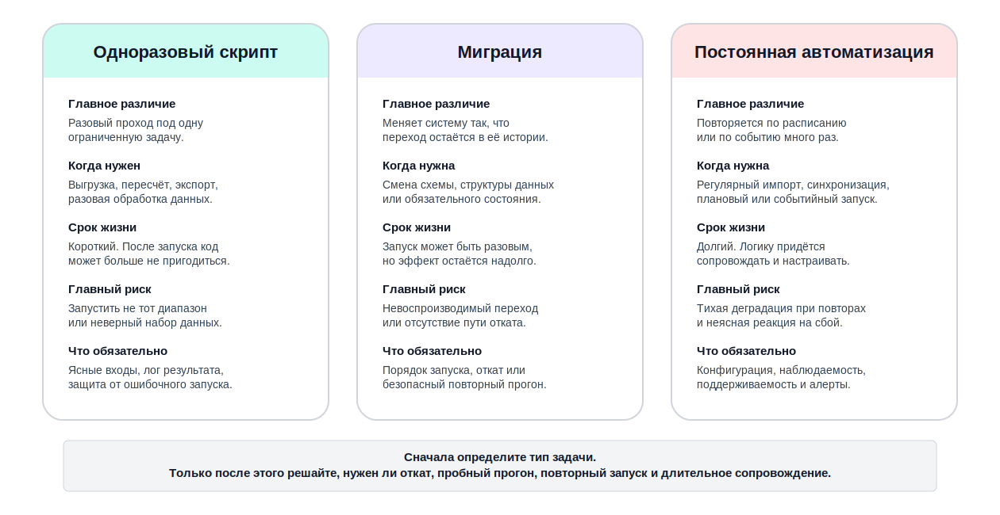
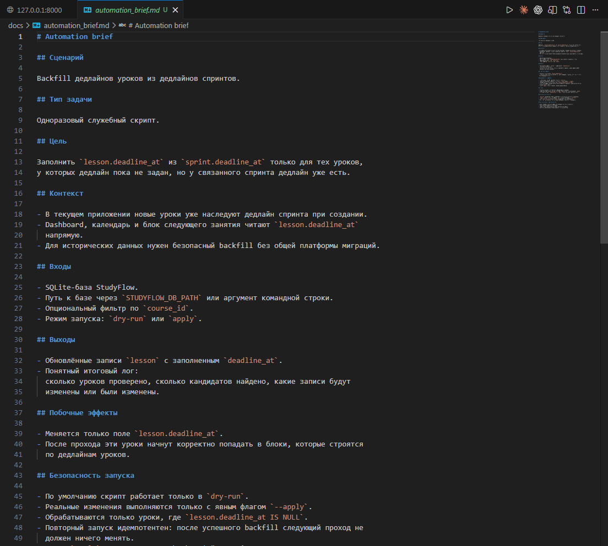
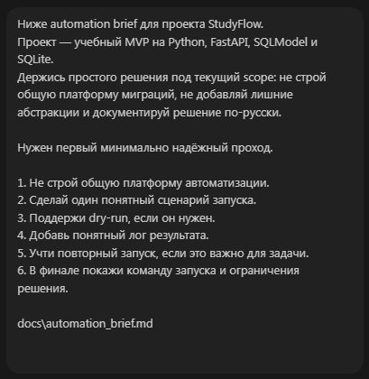
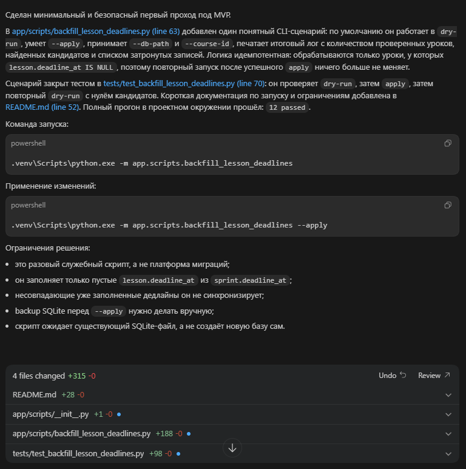
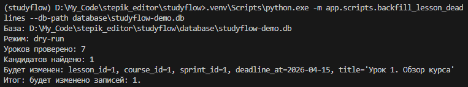
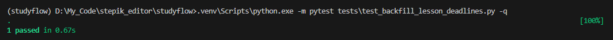

# Урок 3. Скрипты, миграции и автоматизация

_lesson_id: 2289237 · steps: 15 · ttc: 200s_

---

## Шаг 1 (step_id=9817274, text)

Когда нужен одноразовый скрипт, когда миграция, а когда постоянная автоматизация

Когда мы просим агента написать «что-нибудь для служебной задачи», под этим могут скрываться три очень разных случая. Одноразовый скрипт нужен для разового прохода с ограниченной целью. Миграция меняет состояние системы так, чтобы этот переход остался частью её истории. Постоянная автоматизация запускается снова и снова по расписанию или по событию и поэтому должна быть удобной в сопровождении.

Разница между ними не академическая. У них разный срок жизни, разная цена ошибки и разные требования к защите. Если не назвать тип задачи сразу, агент может либо сделать опасно простой проход там, где нужны воспроизводимость и откат, либо, наоборот, построить лишнюю инфраструктуру для работы, которую нужно выполнить один раз.

Одноразовый скрипт

Одноразовый скрипт нужен тогда, когда есть конкретный локальный проход с ограниченным сроком жизни. Например, пересчитать поле для небольшого набора записей, экспортировать данные в особом формате или подготовить разовую выгрузку. У такого скрипта обычно нет долгой продуктовой судьбы, но это не делает его «безопасным по умолчанию». Если он меняет данные, ему всё равно нужны понятные входы, лог результата и защита от случайного неправильного запуска.

Миграция

Миграция отличается тем, что становится частью истории системы. Она изменяет схему, структуру данных или обязательный переход состояния, и её результаты должны быть воспроизводимы в разных окружениях. Здесь особенно важны порядок запуска, обратимость или хотя бы ясный путь отката, совместимость с текущим кодом и предсказуемость повторного прогона.

Постоянная автоматизация

Постоянная автоматизация рассчитана на несколько запусков. Это может быть cron-задача, ночной запуск по расписанию, регулярный импорт, синхронизация или обслуживающая утилита, которой будут пользоваться повторно. Здесь к обычным требованиям добавляются поддерживаемость, понятная конфигурация, наблюдаемость и защита от деградации при повторных запусках.

Почему важно развести эти типы задач

Если одноразовую выгрузку оформлять как вечную платформу автоматизации, вы тратите время на ненужную архитектуру. Если миграцию оформлять как «быстрый скрипт», вы рискуете получить опасный запуск без пробного прогона, без лога и без плана отката. А если постоянную задачу делать как одноразовый проход, через пару недель никто не поймёт, как её безопасно запускать и что делать при сбое.

Для агента эта разница особенно важна. Без явной постановки он склонен либо строить лишнюю инфраструктуру, либо писать рискованно простой скрипт там, где нужен контроль повторного запуска и прозрачные побочные эффекты.

---

## Шаг 2 (step_id=9987358, text)

Automation brief: входы, выходы, побочные эффекты и откат

Служебный код опасен не тем, что он длинный, а тем, что он часто влияет на данные, файлы, внешние системы или инфраструктуру. Поэтому перед генерацией скрипта, миграции или автоматизации полезно собрать краткий brief. Он делает видимыми входы, побочные эффекты и условия безопасного запуска.

Из чего состоит automation brief

	Тип задачи: одноразовый скрипт, миграция или постоянная автоматизация.
	Входы: откуда берутся данные, какие параметры и ограничения есть на запуск.
	Выходы: что создаётся, меняется или выводится на выходе.
	Побочные эффекты: какие данные, файлы или состояния система меняет.
	Безопасность запуска: нужен ли dry-run, защита от повторного запуска, подтверждение или ограничение по выборке.
	Откат: как вернуть систему назад, если проход пойдёт не так.
	Критерии готовности: как проверить результат до реального боевого запуска.

Шаблон automation brief

Automation brief

Тип задачи:
[одноразовый скрипт / миграция / постоянная автоматизация]

Цель:
[что нужно сделать и зачем]

Входы:
- источник данных:
- диапазон / фильтр / параметры:
- ограничения по объёму:

Выходы:
- что создаётся, меняется или печатается

Побочные эффекты:
- какие записи, файлы или системы затрагиваются

Безопасность запуска:
- нужен ли dry-run;
- нужна ли защита от повторного запуска;
- какая инструкция запуска ожидается.

Откат:
- как отменить последствия;
- что делать, если проход оборвался посередине.

Критерии готовности:
- какой тестовый прогон нужен;
- какой лог или отчёт должен появиться;
- какой результат доказывает успех.

Почему побочные эффекты нужно называть прямо

В обычной задаче на фичу побочный эффект часто очевиден: пользователь видит новую кнопку или другой ответ API. В служебном коде эффект легко не заметить. Именно здесь начинается риск. Изменяются ли существующие записи? Удаляются ли файлы? Перезаписывается ли уже вычисленное значение? Можно ли случайно запустить задачу второй раз?

Если не обозначить эти эффекты в brief, агент всё равно напишет код, но проверять его станет намного труднее. Нельзя будет быстро ответить, какой результат считать успехом и где проходит граница допустимого риска.

Что отличает хороший brief от слабого

Слабый вариант:

- сделай скрипт пересчёта прогресса

Непонятно, для кого, на каком объёме, как проверить результат, можно ли запускать повторно и что делать в случае ошибки. Сильный вариант:

нужен backfill для поля estimated_duration только для уроков, у которых поле пустое; 
сначала поддержать dry-run с отчётом по количеству записей; 
в реальном режиме обновлять только выбранную выборку; 
при повторном запуске уже заполненные записи не трогать; 
в конце печатать итог по обработанным и пропущенным объектам.

Практическая ценность brief

После хорошего automation brief у вас появляется инженерный язык для приёмки служебного кода. Вы проверяете не «написал ли агент скрипт», а отвечает ли он на конкретные вопросы: какие входы ждёт, как себя ограничивает, что пишет в лог и как безопасно остановиться, если что-то пошло не так.

---

## Шаг 3 (step_id=9987360, text)

Минимально надёжный проход

Служебные сценарии особенно соблазняют агента на «красивую» архитектуру. Появляются команды CLI с несколькими слоями, фабрики источников данных, универсальные pipeline и полдюжины классов на задачу, которая на самом деле должна выполниться один или несколько раз под жёстким контролем. В таких случаях лучшее инженерное решение часто наоборот проще: сделать прозрачный и ограниченный проход.

Простой код здесь часто лучше умного

Если задача состоит в том, чтобы пересчитать одно поле, экспортировать один набор данных или безопасно обновить один класс записей, выигрывает не самая «гибкая» архитектура, а та, которую легко прочитать, локально проверить и безопасно запустить. Чем очевиднее путь вход → обработка → лог → результат, тем легче принять такой код и тем меньше риск неприятного сюрприза при запуске.

Что просить у агента в первом проходе

По этому automation brief нужен первый минимально надёжный проход.

1. Не строй общую платформу автоматизаций.
2. Сделай понятный сценарий запуска для одной задачи.
3. Поддержи dry-run, если он указан в brief.
4. Добавь явный лог результата и защиту от опасного повторного запуска, если она нужна.
5. В финале покажи инструкцию запуска и ограничения текущего решения.

[вставьте automation brief]

Такой запрос задаёт правильный приоритет: прозрачность, управляемость и безопасность важнее абстрактной расширяемости.

Когда архитектурное усложнение действительно оправдано

Иногда оно нужно. Например, если автоматизация будет работать долго, запускаться по расписанию и обслуживать несколько похожих сценариев. Но даже тогда лучше сначала доказать один рабочий и понятный проход, а уже потом обобщать. Иначе вы принимаете архитектуру без подтверждённой полезности.

Какие признаки хорошего первого решения

	Входы и параметры видны сразу.
	Побочные эффекты названы и ограничены.
	Есть режим проверки без реального изменения данных, если он нужен.
	Лог или отчёт дают понятный итог запуска.
	Инструкция запуска короткая и воспроизводимая.

Среди этих признаков нет требования «сделать универсально». Для служебного прохода гораздо важнее, чтобы команда через неделю могла безопасно повторить запуск или уверенно отказаться от него, чем чтобы код выглядел как маленький фреймворк.

Что считать тревожным ответом агента

Если для разовой обработки истории агент предлагает сложный CLI с плагинами, несколько стратегий выполнения и слой абстракций «на будущее», это сигнал остановиться. Скорее всего, текущий проход потерял связь с реальной задачей. Упростите brief и верните разговор к одному прозрачному сценарию запуска.

---

## Шаг 4 (step_id=9987357, text)

Проверка служебного кода: что должно быть видно до реального запуска

Скрипт, миграцию или автоматизацию редко хочется проверять сразу на рабочем коде. Поэтому важная часть инженерной приёмки должна происходить ещё до реального запуска. Задача в том, чтобы получить достаточную уверенность: код понимает свои входы, ограничивает побочные эффекты и даёт наблюдаемый результат.

Инструкции по запуску

Если после ответа агента вы всё ещё не понимаете, какой командой запускать служебный код и с какими параметрами, решение ещё не готово. Хороший первый проход всегда заканчивается явной инструкцией запуска: что выполнить, в каком режиме сначала проверить, какие параметры обязательны и где смотреть результат.

Тестовый прогон и dry-run

Для задач с побочными эффектами сухой прогон особенно ценен. Dry-run — это режим предварительной проверки, в котором код показывает, что он собирается сделать, но не вносит реальные изменения. Он позволяет увидеть объём затрагиваемых данных, формат лога и ожидаемый результат без фактического изменения состояния. Если dry-run неуместен, его роль может играть тестовая выборка, sandbox-окружение или специальный режим, который печатает план действий до выполнения.

Важно не просто наличие режима dry-run, а то, насколько он полезен. Если сухой прогон печатает бессмысленный поток строк и не показывает итог по количеству затронутых объектов, контроль остаётся слабым.

Защита от повторного запуска

Многие служебные задачи опасны не только первым запуском, но и вторым. Например, backfill может удвоить данные, миграция — повторно применить изменение, экспорт — затереть уже подготовленный файл. Поэтому приёмка должна проверить, видит ли код повторный запуск и как он на него реагирует: игнорирует уже обработанные записи, завершает работу с понятным сообщением или просит явное подтверждение.

Лог результата должен отвечать на инженерные вопросы

После прогона полезно быстро понять: сколько объектов обработано, сколько пропущено, были ли ошибки, где находится результат и можно ли доверять завершению задачи. Если лог этого не показывает, служебный код трудно сопровождать и опасно использовать повторно.

---

## Шаг 5 (step_id=9987359, text)

Практика: подготовьте автоматизацию или миграционный проход

В этой практике вы поручаете агенту служебную инженерную задачу так, чтобы её можно было безопасно проверить и запустить. Это может быть одноразовый backfill, экспорт, пересчёт, подготовка данных, простая миграция или локальная автоматизация. Работайте в своём проекте с реальной служебной болью, он подойдёт лучше, так как он вам больше знаком.

Шаг 1. Определитеcь с типом задачи

Сначала выберите задачу в вашем проекте: это одноразовый скрипт, миграция или постоянная автоматизация? Советуем начинать с задач попроще, а не лезть сразу в миграцию. Для StudyFlow подойдут кейсы вроде backfill служебного поля у уроков, экспорта статистики в файл, пересчёта агрегатов курса или подготовки данных для нового блока интерфейса. Главное — выбрать один понятный сценарий, а не собирать пакет инфраструктурных улучшений.

Шаг 2. Соберите automation brief

Зафиксируйте цель, входы, выходы, побочные эффекты, требования к dry-run и откату. Важно явно назвать объём обработки и правила повторного запуска.

Automation brief

Тип задачи:
[скрипт / миграция / automation]

Цель:
[что именно нужно сделать]

Входы:
[источник данных, фильтр, параметры]

Выходы:
[что меняется или создаётся]

Побочные эффекты:
[какие записи, файлы, состояния затрагиваются]

Безопасность запуска:
[dry-run, ограничения, защита от повторного запуска]

Откат:
[как вернуть систему назад]

Критерии готовности:
[какой предварительный прогон и какой лог вы ожидаете]

Состав пунктов может варьироваться в зависимости от вашей задачи.

Шаг 3. Попросите минимально надёжный проход

Дайте агенту задачу сделать прозрачный и ограниченный сценарий запуска:

Ниже automation brief.
Нужен первый минимально надёжный проход.

1. Не строй общую платформу автоматизации.
2. Сделай один понятный сценарий запуска.
3. Поддержи dry-run, если он нужен.
4. Добавь понятный лог результата.
5. Учти повторный запуск, если это важно для задачи.
6. В финале покажи команду запуска и ограничения решения.

[вставьте ваш automation brief]

Если агент начинает строить слишком широкую архитектуру, остановите проход и сузьте brief.

 

Шаг 4. Примите результат

Сначала проверьте инструкцию запуска, dry-run или тестовый прогон, лог результата и поведение при повторном запуске. Только после этого решайте, готов ли проход к реальному выполнению.

В StudyFlow и аналогичных проектах, особенно полезно сохранить короткий отчёт: какие записи или сущности затронет проход, что будет пропущено и какой сигнал покажет успешное завершение.

Шаг 5. Отделите первый проход от улучшений

После практики отдельно запишите, что осталось на follow-up: например, планировщик, метрики, отдельная команда для админов или более богатая отчётность. Не добавляйте это автоматически в текущий diff, если базовый запуск уже прозрачен и безопасен для своей задачи.

Что считать завершением практики

Практика выполнена, если у вас есть automation brief, один служебный сценарий запуска, понятный dry-run или иной предварительный прогон, наблюдаемый лог результата и граница между текущим решением и последующими улучшениями.

---

## Шаг 6 (step_id=10003768, choice)

Что лучше всего отличает миграцию от одноразового скрипта?

**Тип:** choice (single)

**Варианты:**
- ○ Миграция никогда не меняет данные
- ○ Миграция не нуждается в инструкции запуска
- ○ Одноразовый скрипт всегда безопасен и не требует проверок
- ○ Миграция входит в историю системы и воспроизводима

---

## Шаг 7 (step_id=10003763, choice)

Зачем нужен automation brief?

**Тип:** choice (single)

**Варианты:**
- ✓ Чтобы зафиксировать входы, эффекты и откат
- ○ Чтобы заменить dry-run красивым названием
- ○ Чтобы не думать о повторном запуске
- ○ Чтобы описать сложную архитектуру будущих интеграций заранее

---

## Шаг 8 (step_id=10003770, choice)

Что чаще всего лучше для первого прохода служебного кода?

**Тип:** choice (single)

**Варианты:**
- ○ Несколько слоёв абстракций для покрытия будущих кейсов
- ○ Универсальный фреймворк автоматизаций
- ○ Полный отказ от логирования
- ✓ Прозрачный сценарий запуска с явными ограничениями

---

## Шаг 9 (step_id=10003765, choice)

Что обычно должно входить в automation brief?

**Тип:** choice (multiple)

**Варианты:**
- ✓ Источник данных и параметры запуска
- ✓ Побочные эффекты и ограничения
- ○ Полный roadmap инфраструктуры на год
- ✓ Dry-run, откат и критерии готовности

---

## Шаг 10 (step_id=10003764, choice)

Почему важно прямо называть побочные эффекты служебной задачи?

**Тип:** choice (multiple)

**Варианты:**
- ✓ Чтобы оценить риск запуска и повторного запуска
- ✓ Чтобы проще принимать результат по наблюдаемым артефактам
- ✓ Чтобы понимать, что именно меняется в системе
- ○ Чтобы агенту было удобнее добавлять произвольные улучшения

---

## Шаг 11 (step_id=10003766, choice)

Что полезно проверить до реального запуска?

**Тип:** choice (multiple)

**Варианты:**
- ✓ Есть ли понятная команда запуска
- ✓ Появляется ли понятный лог результата
- ○ Только насколько «красиво» выглядит код
- ✓ Есть ли dry-run или безопасный предварительный прогон

---

## Шаг 12 (step_id=10003762, choice)

Какие признаки говорят о переусложнении первого служебного прохода?

**Тип:** choice (multiple)

**Варианты:**
- ○ Есть один ясный сценарий вход → обработка → результат
- ✓ Для разового backfill появился маленький фреймворк
- ✓ Инструкция запуска потерялась за общей архитектурой
- ✓ Агент добавил абстракции, не связанные с текущим запуском

---

## Шаг 13 (step_id=10003771, matching)

Сопоставьте тип задачи и её природу

**Тип:** matching

**Правильные пары:**
- Одноразовый скрипт → Ограниченный проход с коротким сроком жизни
- Миграция → Обязательный исторический переход состояния системы
- Постоянная автоматизация → Повторяемый служебный сценарий на длительный срок
- Dry-run → Безопасный предварительный прогон без реального изменения состояния

---

## Шаг 14 (step_id=10003767, matching)

Сопоставьте элемент brief и вопрос

**Тип:** matching

**Правильные пары:**
- Входы → Что подаётся на запуск
- Выходы → Что создаётся или меняется на выходе
- Побочные эффекты → Какие записи, файлы или состояния затрагиваются
- Откат → Как вернуть систему назад при неудаче

---

## Шаг 15 (step_id=10003769, matching)

Сопоставьте действие и этап workflow

**Тип:** matching

**Правильные пары:**
- Определить тип служебной задачи → Подготовка постановки
- Зафиксировать dry-run и ограничения → Сборка automation brief
- Проверить инструкцию запуска и лог → Приёмка до боевого запуска
- Отделить улучшения от текущего прохода → Фиксация follow-up

---
