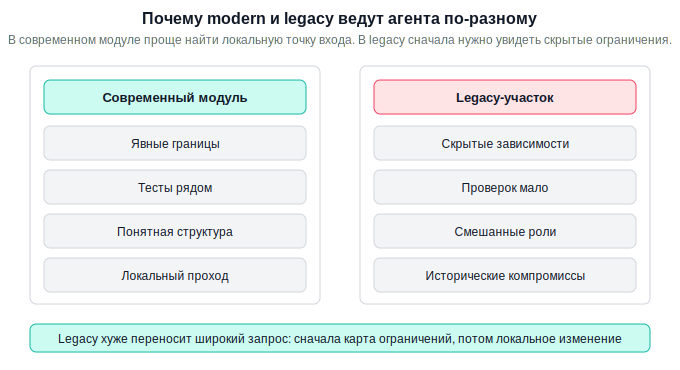
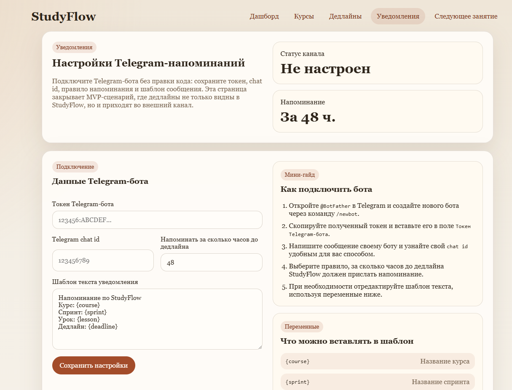

# Урок 4. Перенос подхода на другие инженерные сценарии

_lesson_id: 2289238 · steps: 15 · ttc: Nones_

---

## Шаг 1 (step_id=9817275, text)

Перенос подхода на другие инженерные сценарии

В первых уроках модуля мы подробно разобрали три инженерных сценария: локальную фичу в существующем проекте, внешнюю интеграцию и служебный код вроде скриптов или миграций. На них уже виден основной рабочий каркас: сначала зафиксировать задачу и границы изменения, потом собрать достаточный контекст, затем поручить агенту узкий проход и принять результат по проверкам и diff.

Этот каркас не заканчивается на трёх разобранных кейсах. Он переносится и на другие задачи, просто с небольшими поправками. В этом уроке мы не вводим ещё один большой отдельный сценарий, а смотрим на несколько дополнительных случаев, где тот же подход нужно чуть адаптировать: хрупкий legacy-участок, один короткий демонстрируемый срез и серия быстрых итераций без потери контроля.

Начнём с legacy-кода. Здесь сама рамка модуля не меняется. Меняется другое: часть ограничений не читается прямо из кода, поэтому их приходится проговаривать явно до редактирования.

Опасность legacy не в возрасте как таковом, а в скрытых связях. Поведение участка может определяться старой версией библиотеки, историческим соглашением, редкой конфигурацией, побочным эффектом в соседнем слое или неполной документацией. Если этого контекста нет в задаче, агент начинает достраивать картину по современным ожиданиям и легко выходит за пределы нужного локального прохода.

Legacy — не новый процесс, а более строгая версия уже знакомого

В обычной доработке точка изменения часто видна быстрее: рядом есть тесты, более свежие имена, понятные границы ответственности. В legacy всё слабее сразу в нескольких местах. Поэтому здесь особенно важно не придумывать новый «специальный режим», а сделать жёстче уже знакомые опоры: brief, чтение до правки и узкий критерий остановки.

Что нужно добавить к brief

Для legacy brief обычно расширяют тремя вещами: критичными версиями зависимостей, источниками поведения и коротким объяснением механики участка. Если поведение меняется из-за старого фреймворка, ORM, SDK, плагина или нестандартной сборки, это полезно назвать прямо. Иначе агент подставит более новый образец работы API и предложит неверное изменение.

Дополнение к brief для legacy-участка

Критичные версии:
- [что в стеке реально влияет на поведение]

Источники поведения:
- [README, changelog, migration note, внешняя документация]

Как проходит этот участок:
- [откуда приходит запрос или данные]
- [где меняются данные и где есть побочные эффекты]

Запреты рядом:
- [что нельзя переписывать в текущем проходе]

Почему read-first здесь почти обязателен

Если в прошлых уроках read-first был сильным приёмом, то в legacy он часто становится первым шагом по умолчанию. Сначала полезно получить карту связей вокруг целевого участка, минимальную точку изменения и список мест, где контекста пока не хватает. Так вы видите границу безопасного прохода ещё до появления diff.

Ниже brief по участку. Сначала не меняй код.

1. Построй карту связей вокруг целевого участка.
2. Назови минимальную точку изменения.
3. Отдельно перечисли риски, старые зависимости и внешние источники поведения.
4. Скажи, каких проверок или контекста ещё не хватает.
5. Не предлагай широкий рефакторинг как основной ответ.

[вставьте ваш brief]

Что считать хорошим результатом

Хороший результат в legacy обычно скромнее, чем хочется сначала: один локальный diff, одна понятная цель, доступные проверки и отдельный список следующих шагов вместо «заодно почистим всё рядом». Если после чтения изменений вы можете в одном предложении объяснить, что именно исправлено и почему соседние участки остались нетронутыми, проход удался.

На этом специфика legacy заканчивается. Дальше вопрос уже не в том, как не потерять границы в старом коде, а в том, как ускоряться без потери контроля. Для этого нужен slice brief и короткие продуктовые итерации.

---

## Шаг 2 (step_id=9987370, text)

Демонстрируемый срез

Мы уже проходили, что агенту не стоит отдавать продукт целиком одним широким запросом. Для этого урока важнее следующий шаг: как оформить маленький продуктовый проход так, чтобы он оставался проверяемым, демонстрируемым и не расползался в соседние улучшения.

В этом шаге нас интересует один демонстрируемый срез: локальный результат, который проверяет конкретную гипотезу и который можно показать сразу после прохода. Это может быть один экран, один маршрут API, одна маленькая доработка существующего интерфейса или одна полезная системная возможность. Главное, чтобы после работы можно было честно показать: вот конкретный результат, который теперь работает.

Что здесь появляется нового

Новая идея не в том, что проход должен быть узким, а в том, что для такого прохода нужна отдельная короткая постановка. Такой постановкой и будет slice brief: brief для одного демонстрируемого среза с явной гипотезой, критерием показа, проверкой и границей остановки.

Из чего состоит slice brief

	Гипотеза: кому и зачем полезен этот маленький проход.
	Сценарий текущей итерации: что именно должно заработать сейчас.
	Что не входит в проход: какие идеи сознательно откладываются.
	Критерий демонстрации: по какому наблюдаемому сигналу видно, что срез состоялся.
	Проверка: какой локальный тест, smoke или ручной проход достаточен.
	Stop-point: после какого результата итерацию не расширяют дальше.

Шаблон slice brief

Slice brief

Гипотеза:
[кому и зачем полезен этот проход]

Сценарий текущей итерации:
[один демонстрируемый пользовательский или системный сценарий]

Не входит в итерацию:
- [что откладываем]
- [какие соседние улучшения сейчас не делаем]

Критерий демонстрации:
- [что можно показать экраном, ответом API или локальным прогоном]

Проверка:
- [какой тест или ручной сценарий достаточен]

Stop-point:
- [после какого результата мы останавливаемся]

Чем этот brief отличается от предыдущих

В feature brief в центре была точка встраивания в существующий проект. В integration brief — внешний контракт и отказоустойчивость. В legacy-работе — скрытые ограничения и карта рисков. В slice brief главное другое: выбрать настолько узкий срез, чтобы его можно было быстро показать и на этом основании решить, нужен ли следующий проход.

Пример сильной постановки

Гипотеза:
авторам курса полезно сразу видеть, какие уроки обновлялись недавно.

Сценарий текущей итерации:
на списке уроков показывать метку "обновлён" только у материалов,
которые менялись за последние 7 дней.

Не входит в итерацию:
- настройка порога в интерфейсе;
- отдельный фильтр по этому признаку;
- система уведомлений.

Критерий демонстрации:
на локальном списке метка появляется только у нужных уроков.

Проверка:
ручной проход по экрану и один тест на вычисление признака.

---

## Шаг 3 (step_id=9987368, text)

Короткие итерации: один diff, одна ценность, один stop-point

В предыдущем шаге мы зафиксировали один узкий демонстрируемый срез. Теперь важно увидеть следующий уровень: такие срезы не существуют сами по себе, а постепенно складываются в более цельный продуктовый результат.

MVP и есть такой минимально жизнеспособный продукт: не полный набор всех задуманных возможностей, а уже целостный результат, которым можно реально воспользоваться для проверки продуктовой гипотезы. В нём может не хватать удобств, настроек и второстепенных сценариев, но основная ценность уже должна работать для пользователя от начала до конца. К нему обычно идут серией коротких инженерных итераций: каждая добавляет или уточняет один проверяемый кусок, а вместе они постепенно доводят проект до рабочего минимального состояния. Поэтому каждая итерация на пути к MVP должна оставлять после себя один понятный результат: локальный diff, достаточную проверку, короткую фиксацию того, что теперь работает, и отдельную запись о следующем шаге.

Базовый ритм итерации

	Соберите slice brief для одного узкого сценария.
	Если участок хрупкий, сначала пройдите read-first и уточните точку изменения.
	Поручите агенту только текущий локальный проход.
	Проверьте результат по одному достаточному набору проверок.
	Отдельно зафиксируйте, что теперь работает и что станет следующим шагом.

Такой ритм кажется медленнее только до первой приёмки. На деле он экономит время, потому что вам не приходится распутывать большой пакет разнотипных изменений.

Как формулировать запрос на текущую итерацию

Продолжаем по этому brief.
Нужна только текущая короткая итерация.

Цель этой итерации:
[один конкретный результат]

Не делаем сейчас:
- [соседние улучшения]

Критерий демонстрации:
[по какому сигналу видно, что шаг завершён]

Проверка:
[какой локальный тест, smoke или ручной проход нужен]

Если видишь следующий логичный шаг, перечисли его отдельно,
но не включай в текущий diff.

Когда нужно остановиться

Остановка — это не отказ от качества. Она означает, что текущая гипотеза уже подтверждается, diff остаётся объяснимым, а следующий набор улучшений требует нового brief. Если в одном проходе одновременно появляются новый экран, дополнительная настройка, общая abstraction и cleanup соседнего слоя, итерация уже потеряла фокус.

Хороший момент остановки наступает тогда, когда текущий результат уже можно внятно показать и объяснить одной целью. Если для описания diff вам уже приходится говорить о нескольких независимых улучшениях сразу, значит итерация стала слишком широкой. В такой точке полезнее зафиксировать достигнутый результат, отдельно записать следующую идею и открыть для неё новый проход, чем продолжать наращивать изменения в том же diff.

Как понять, что MVP уже собрался

Отдельные итерации не должны тянуться бесконечно. В какой-то момент они уже складываются в минимально жизнеспособный продукт. Это происходит тогда, когда основную ценность можно пройти от начала до конца без мысленного достраивания недостающих частей. Пользовательский сценарий уже работает как единое целое, его можно показать, проверить и использовать, чтобы понять, действительно ли продукт решает ту задачу, ради которой вы его делали.

Это не значит, что в продукте уже есть всё задуманное. У него всё ещё могут отсутствовать удобные настройки, дополнительные ветки, финальная доводка и второстепенные улучшения. Но если ключевой сценарий уже работает целиком и каждая следующая итерация скорее улучшает, расширяет или украшает его, чем делает продукт впервые жизнеспособным, значит базовый MVP у вас уже есть.

---

## Шаг 4 (step_id=9987369, text)

Практика: доведите свой проект до понятного MVP

В этой практике цель уже не в том, чтобы сделать один случайный локальный проход, а в том, чтобы увидеть маршрут к MVP как цепочку коротких инженерных итераций. На примере StudyFlow видно, что MVP появляется не тогда, когда «почти всё придумано», а тогда, когда основной пользовательский сценарий уже можно пройти от начала до конца без мысленного достраивания недостающих кусков.

Рабочий проект по умолчанию здесь ваш собственный. StudyFlow нужен как демонстрационный пример того, как раскладывать продукт на короткие срезы, как решать, что входит в MVP, и как понять, что следующая итерация уже относится не к сборке MVP, а к его развитию.

Как это выглядело бы на примере StudyFlow

Для StudyFlow продуктовую ценность в  полезно сформулировать чуть строже: студент видит свои курсы, прогресс и дедлайны, не пропускает обучение между визитами в сервис. Значит, MVP здесь должен закрывать не только интерфейс внутри сайта, но и минимальный внешний канал напоминаний. Самый простой вариант для такого канала в учебном проекте — Telegram-бот.

Под такой сценарий MVP собирается как цепочка коротких проходов, где каждый шаг замыкает ещё один кусок жизнеспособности.

	Первая итерация: dashboard показывает курсы, прогресс, дедлайны и блок Продолжить обучение.
	Вторая итерация: страница курса показывает упорядоченный список занятий и выделяет следующее рекомендуемое.
	Третья итерация: страница занятия позволяет поменять статус и вернуть обновлённый прогресс в общий поток.
	Четвёртая итерация: в настройках появляется подключение Telegram-бота с мини-гайдом, куда вставить токен и chat id, а также правила уведомлений — например, за сколько часов или дней до дедлайна присылать напоминание.

После этого основной сценарий уже проходит целиком: студент ведёт обучение в сервисе и получает напоминание до наступления дедлайна, не залезая в код ради настройки интеграции. Значит, для такой рамки продукта MVP уже есть. Всё, что идёт дальше, например более сложные сценарии уведомлений, много каналов доставки, повторные напоминания, вебхуки или интеграции с внешними календарями, уже не делает продукт впервые жизнеспособным, а расширяет или усиливает его.

Шаг 1. Сформулируйте MVP своего проекта

Не начинайте с отдельной задачи вроде добавить фильтр, прикрутить интеграцию или подчистить страницу. Сначала зафиксируйте, ради какого сквозного сценария вы вообще собираете продукт. Хорошая формулировка отвечает на вопрос: что пользователь должен суметь сделать от начала до конца уже в минимальной, но рабочей версии.

MVP проекта

Основная ценность:
[какую проблему решает продукт]

Ключевой сценарий:
1. [с чего пользователь начинает]
2. [какое полезное действие делает]
3. [какой наблюдаемый результат получает]

Пока не входит в MVP:
- [улучшения, расширения, удобства]
- [второстепенные ветки и дополнительные режимы]

Если не получается описать сценарий без длинного списка оговорок, значит MVP ещё слишком расплывчатый и его надо сузить. Но бывает и обратная ситуация: базовый сценарий уже работает, а продукт всё ещё не дотягивает до обещанной ценности. В StudyFlow как раз можно увидеть такой момент: одного показа дедлайнов на сайте недостаточно, если пользователь легко забывает зайти вовремя. Тогда в рамку MVP разумно добавить самый простой внешний канал напоминаний.

Шаг 2. Разложите путь к MVP на 2–4 короткие итерации

Теперь разбейте этот сценарий на несколько демонстрируемых проходов. Каждая итерация должна давать один локальный результат, который можно показать и проверить. Не пытайтесь заранее расписывать весь roadmap проекта. Нужна только ближайшая цепочка, которая собирает минимально жизнеспособную версию.

Путь к MVP

Итерация 1:
[какой первый рабочий срез появляется]

Итерация 2:
[какой следующий срез замыкает сценарий]

Итерация 3:
[что ещё нужно, чтобы пройти сценарий до конца]

Сигнал, что MVP уже есть:
[по какому наблюдаемому признаку видно,
что ключевой сценарий работает целиком]

Если участок одной из итераций лежит в хрупком месте, добавьте к ней legacy-дополнение и начните с read-first. Но не разворачивайте весь проект в одну огромную постановку: у каждой итерации должен оставаться свой slice brief. Например, в StudyFlow не нужно одной постановкой одновременно делать бота, фоновый scheduler, правила повтора и новый раздел аналитики. Для MVP достаточно отделить текущий шаг: подключение Telegram из интерфейса и одно понятное правило уведомления до дедлайна.

Шаг 3. Возьмите только текущую итерацию и оформите её через slice brief

В работу с агентом отдавайте не весь путь к MVP сразу, а только ближайший проход. Это и есть мост между продуктовым уровнем и инженерным ритмом урока: вы знаете, к какому MVP идёте, но реализуете его по одному объяснимому diff за раз.

Slice brief

Гипотеза:
[зачем полезна именно эта итерация]

Сценарий текущей итерации:
[один демонстрируемый срез]

Не входит в итерацию:
- [соседние улучшения]

Критерий демонстрации:
- [что можно показать после прохода]

Проверка:
- [какой тест, smoke или ручной сценарий достаточен]

Stop-point:
- [после какого результата вы останавливаетесь]

В примере со StudyFlow таким brief мог бы быть не «сделай сразу Telegram-бота», а более узкий проход: добавить на сайт раздел настройки уведомлений, мини-гайд как создать бота через BotFather, поля для токена и chat id, а также выбор правила напоминания — например, за 24 часа до дедлайна. Это уже демонстрируемый срез: пользователь может подключить канал уведомлений сам, не меняя код.

Шаг 4. Попросите агента сделать только этот проход

Запрос к агенту должен быть привязан к одной итерации, а не к всему продукту. Тогда после ответа проще понять, приблизились ли вы к MVP, или агент просто нагенерировал несколько несвязанных улучшений.

Продолжаем по этому brief.
Нужна только текущая итерация на пути к MVP.

1. Реализуй только этот сценарий.
2. Не добавляй функции из следующих итераций.
3. В финале покажи, по какому результату видно, что текущий шаг завершён.
4. Отдельно перечисли, какой следующий проход логичен после него,
   но не включай его в текущий diff.

[вставьте ваш brief]

Для StudyFlow хороший запрос в таком месте мог бы звучать так: «Добавь страницу или блок настроек Telegram-бота, чтобы пользователь мог вставить токен, chat id и выбрать правило уведомлений без редактирования кода. Не делай пока автозапуск по расписанию и не добавляй сложный onboarding через команды бота». Это удерживает итерацию в рамке MVP.

Если после ответа видно, что агент одновременно добавил текущий сценарий, часть следующего шага и какой-то общий cleanup, итерация стала слишком широкой и её стоит пересобрать.

Шаг 5. Проверьте, собрался ли MVP или нужен ещё один проход

После реализации примите результат не только по diff, но и по месту этого diff в общей цепочке. У вас должно быть понятно, какую часть сквозного сценария этот шаг уже закрыл и чего ещё не хватает до минимально жизнеспособной версии.

pytest tests/<релевантный набор> -q
git diff -- app/ tests/

Затем письменно ответьте на два вопроса:

	Можно ли уже пройти ключевой пользовательский сценарий от начала до конца?
	Следующая итерация нужна, чтобы продукт вообще стал жизнеспособным, или только чтобы сделать его удобнее, шире или чище?

В случае StudyFlow вопрос в конце можно сформулировать так: достаточно ли уже того, что пользователь подключает Telegram из интерфейса и задаёт правило напоминания, чтобы считать внешний канал уведомлений закрытым для MVP, или без реальной отправки сообщения до дедлайна продукт всё ещё не дотягивает до своей минимальной обещанной ценности?

Если основной сценарий уже работает целиком, MVP у вас есть. Значит, следующая итерация должна оформляться не как «ещё немного доделать MVP», а как отдельное расширение: улучшение, новая ветка сценария, интеграция, автоматизация или cleanup.

Что должно получиться в конце практики

	Короткая формулировка MVP вашего проекта.
	Цепочка из 2–4 итераций, которая ведёт к этому MVP.
	Slice brief только для текущего прохода.
	Один локальный diff и достаточная проверка.
	Явный вывод: MVP уже есть или до него осталась ещё одна конкретная итерация.
	Понимание, почему именно этот новый кусок действительно нужен для минимальной жизнеспособности, а не просто выглядит как приятная интеграция.

---

## Шаг 5 (step_id=10014085, choice)

Что делает привычный рабочий процесс строже в legacy-участке?

**Тип:** choice (single)

**Варианты:**
- ✓ Нужно явно назвать скрытые ограничения
- ○ Нужно заменить чтение кода длинным запросом
- ○ Нужно сразу переписать соседний слой
- ○ Нужно отказаться от промежуточной проверки

---

## Шаг 6 (step_id=10014083, choice)

Какой термин в этом уроке отвечает за один демонстрируемый проход?

**Тип:** choice (single)

**Варианты:**
- ○ Legacy-дополнение
- ✓ Slice brief
- ○ Read-first
- ○ MVP

---

## Шаг 7 (step_id=10014084, choice)

С чего начать, если сценарий лежит в хрупком участке?

**Тип:** choice (single)

**Варианты:**
- ○ С немедленной переписи слоя под новую архитектуру
- ✓ С карты связей и минимальной точки изменения
- ○ С подготовки slice brief
- ○ Сразу объединить фикс и cleanup

---

## Шаг 8 (step_id=10014087, choice)

Что полезно добавить к brief для legacy-участка?

**Тип:** choice (multiple)

**Варианты:**
- ✓ Источники поведения и документацию
- ✓ Критичные версии зависимостей
- ○ Полный план переписывания модуля
- ✓ Короткую механику участка

---

## Шаг 9 (step_id=10014091, choice)

Что обычно входит в хороший slice brief?

**Тип:** choice (multiple)

**Варианты:**
- ✓ Критерий демонстрации
- ✓ Один текущий сценарий
- ✓ Гипотеза и кому полезен проход
- ○ Полный backlog следующих релизов

---

## Шаг 10 (step_id=10014088, choice)

Какие признаки говорят, что итерация осталась короткой?

**Тип:** choice (multiple)

**Варианты:**
- ✓ Один diff даёт одну ценность
- ✓ Следующий шаг вынесен отдельно
- ○ Заодно строится общая платформа на будущее
- ✓ Результат объясняется одной целью

---

## Шаг 11 (step_id=10014086, choice)

Когда стоит остановиться и открыть новый проход?

**Тип:** choice (multiple)

**Варианты:**
- ✓ Когда diff ещё легко объяснить
- ○ Когда нашёлся повод отполировать всё рядом
- ✓ Когда новые идеи стали отдельной задачей
- ✓ Когда гипотеза уже демонстрируется

---

## Шаг 12 (step_id=10014090, matching)

Сопоставьте артефакт и его роль

**Тип:** matching

**Правильные пары:**
- Legacy-дополнение → Версии, источники и механика участка
- Slice brief → Гипотеза, сценарий и демонстрация
- Read-first → Карта связей до редактирования
- Stop-point → Граница, после которой не расширяют diff

---

## Шаг 13 (step_id=10014082, matching)

Сопоставьте ситуацию и правильное действие

**Тип:** matching

**Правильные пары:**
- Поведение зависит от старого ORM → Добавить версии и опорную документацию
- Агент тащит соседний cleanup → Вернуть задачу к одному локальному проходу
- Результат уже можно показать → Остановиться и записать следующий шаг отдельно
- Точка изменения неочевидна → Сначала запросить карту связей

---

## Шаг 14 (step_id=10014089, matching)

Сопоставьте сигнал и его смысл

**Тип:** matching

**Правильные пары:**
- Один diff → Одна демонстрируемая ценность
- Список того, что не входит → Защита от расползания объёма
- Отдельная запись следующего шага → Новый проход не смешан с текущим
- Критерий демонстрации → Наблюдаемый признак успешного результата

---

## Шаг 15 (step_id=10022188, matching)

Сопоставьте этап и его результат

**Тип:** matching

**Правильные пары:**
- Сборка brief → Зафиксированы границы и критерии
- Read-first → Понятна минимальная точка изменения
- Реализация итерации → Появился локальный diff
- Приёмка и остановка → Следующий шаг вынесен отдельно

---
