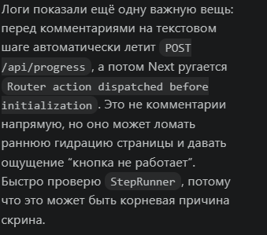
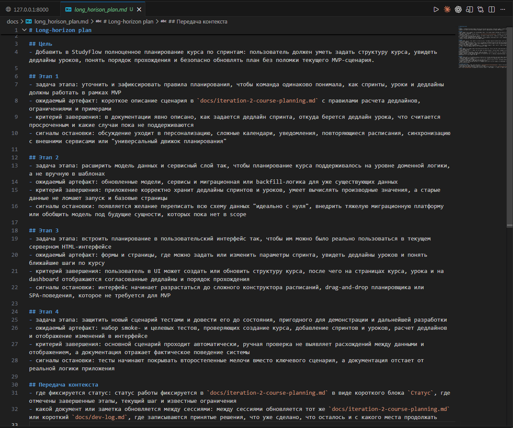

# Урок 1. Long-horizon tasks

_lesson_id: 2289240 · steps: 15 · ttc: 502s_

---

## Шаг 1 (step_id=9817277, text)

Чем long-horizon задача отличается от просто большой задачи

После модуля 5 у нас уже есть привычка не пытаться провести весь путь к результату одним огромным запросом. В этом модуле делаем следующий шаг: начинаем работать с задачами, где важно провести не один удачный шаг, а весь маршрут до результата. Такие задачи называют long-horizon task.

Большая задача может быть трудной, но при этом укладываться в один управляемый проход: одно описание, один набор проверок, один локальный набор изменений, одна точка остановки. Длинная многоэтапная задача устроена иначе. В ней меняются подцели, появляются новые артефакты, добавляются промежуточные решения, а контекст остаётся актуальным дольше одной сессии.

Проблема не в размере, а в длине траектории

Две ситуации. В первой вы добавляете фильтр на один экран существующего продукта. Во второй запускаете ветку с новой функциональностью: меняете контракт API, добавляете фоновые задачи, обновляете документацию, вводите проверки, проводите поэтапное внедрение. Обе задачи требуют работы, но только во второй маршрут сам по себе становится риском.

На длинном маршруте агенту приходится удерживать не одно изменение, а цепочку зависимых решений. Если эти решения нигде не зафиксированы, появляется дрейф: следующая сессия уже не опирается на реальную историю работы, а достраивает её по памяти чата или по случайным следам в репозитории.

Почему монолитный запрос здесь ломает управление

Когда long-horizon задачу ставят как один большой запрос, кажется, будто экономится время: пусть агент сам декомпозирует, реализует и доведёт до конца. На практике быстро теряется инженерная прозрачность. Непонятно, на каком этапе агент находится, что уже принято как решение, какие допущения не подтверждены и где нужно вернуть человека в цикл.

Прежде всего теряется точка текущего состояния: непонятно, исследуем мы ещё или уже интегрируем. Из-за этого трудно возобновить работу после паузы, а любой побочный поворот начинает выглядеть как естественное продолжение задачи, хотя это отдельный риск.

Длинная задача требует не больше доверия, а больше маршрутизации

Длинный проход не означает «отдать агенту больше свободы». Он означает «заранее спроектировать больше точек контроля». Чем длиннее задача, тем важнее определить этапы, ожидаемые артефакты, правила перехода вперёд и сигналы остановки.

Поэтому организация длинной задачи начинается не с промпта, а с вопроса: как я пойму, что текущий этап закончен, что можно идти дальше и что нужно вернуть на ручную проверку? Пока на него нет ответа, задача ещё не готова к длинному агентному проходу.

Большая задача требует декомпозиции. Длинная многоэтапная — декомпозиции плюс маршрута возобновления и контрольных точек.

---

## Шаг 2 (step_id=10033561, text)

Каркас длинного прохода: цель, этапы, контрольные точки и сигналы остановки

Длинной задаче нужен явный каркас. Его цель проста: в каждый момент должно быть понятно, куда движется проход, что считается результатом текущего этапа и по каким сигналам нельзя идти дальше без проверки.

Сначала фиксируем конечную цель, а не список действий

Каркас начинается не со списка задач, а с короткой формулировки конечного результата. Хорошая цель описывает наблюдаемый итог: какой сценарий должен заработать, какой инженерный контур должен появиться, какой тип риска должен быть снят. Если вместо цели только список действий — «добавить endpoint, переписать сервис, настроить пайплайн, обновить документацию» — проход почти сразу потеряет приоритеты.

Цель полезно сформулировать в одном абзаце и сразу отделить от расширений. У каждой длинной задачи есть удобные побочные улучшения, которые внешне похожи на прогресс, но не двигают основной маршрут.

Делим маршрут на этапы с разными функциями

Этапы нужны, чтобы у каждого куска работы была своя функция. В длинном инженерном проходе обычно нужно различать хотя бы такие состояния: разведка и картирование, узкая реализация, проверка и стабилизация, интеграция артефактов, финальная приёмка или передача контекста. Внутри одного этапа тип работы должен быть однородным. Если вы одновременно исследуете, проектируете, правите код и принимаете архитектурные решения — этап слишком размыт.

Каркас long-horizon прохода

Цель:
- [какой наблюдаемый результат должен появиться]

Этап 1:
- задача этапа
- ожидаемый артефакт
- критерий завершения

Этап 2:
- задача этапа
- ожидаемый артефакт
- критерий завершения

Этап 3:
- задача этапа
- ожидаемый артефакт
- критерий завершения

Сигналы остановки:
- [какие признаки запрещают идти дальше автоматически]

Контрольная точка — это артефакт, а не ощущение прогресса

Самая частая ошибка в длинной задаче: «кажется, мы уже неплохо продвинулись». Для управления маршрутом это бесполезный сигнал. Контрольная точка должна существовать как внешний артефакт: документ с решением, фиксирующий коммит, список подтверждённых допущений, diff на узком участке или короткая заметка для следующей сессии.

У хорошей контрольной точки два свойства: она позволяет продолжить работу без пересборки контекста и в любой момент честно показывает, какая часть маршрута завершена, а какая нет.

Сигналы остановки лучше определить заранее

Опасно надеяться, что момент остановки «сам почувствуется». Когда агент уже внутри потока, ему естественно двигаться дальше. Сигналы остановки задают заранее: спорные архитектурные развилки, неожиданные внешние побочные эффекты, нестабильные тесты, размывание границ задачи, необходимость тронуть критичный участок без достаточного read-first.

	Открылся новый значимый риск — нужна отдельная контрольная точка, не молчаливое продолжение.
	Этап завершён, но следующий требует другой формы мышления — лучше оформить передачу контекста.
	Проверка не даёт уверенного сигнала — переход нельзя считать завершённым.

В большинстве инструментов это выглядит одинаково: вместо одного запроса на весь маршрут вы ведёте агента через серию опорных блоков. Этап 1 — верни такой-то артефакт, при сигнале X — остановись, к этапу 2 — только после подтверждения. Каркас — это план маршрута до старта; заметка передачи контекста — это живой статус в процессе. Так длинная задача перестаёт зависеть от памяти чата.

---

## Шаг 3 (step_id=10033559, text)

Как сохранять контекст между сессиями и не пересобирать задачу с нуля

Long-horizon работа почти всегда переживает паузы. Вы заканчиваете день, переключаетесь на другую ветку, возвращаетесь после review или продолжаете задачу в новом чате. Если весь контекст хранится только в памяти и истории переписки, каждая новая сессия начинает дорогую и ненадёжную пересборку.

История переписки — плохая опора для возобновления

Лог чата полезен как журнал, но не как опорный слой для продолжения длинной задачи. В нём смешаны рассуждения, гипотезы, устаревшие варианты и промежуточные решения. Когда агент или человек пытается продолжить маршрут только по этому следу, легко перепутать принятые решения с черновыми идеями.

Для длинной задачи нужен короткий документ передачи контекста. Его задача — быстро ответить на четыре вопроса: где мы находимся, что уже подтверждено, что делаем следующим шагом и по каким рискам нельзя двигаться автоматически.

Заметка для передачи контекста

Цель прохода:
- ...

Текущий этап:
- ...

Что уже подтверждено:
- ...

Что осталось сделать следующим шагом:
- ...

Риски / сигналы остановки:
- ...

Несколько коротких слоёв лучше одного большого документа

Один документ на всё быстро разрастается и снова становится трудным для возобновления. Удобнее разделять артефакты по функции: короткий маршрутный план, отдельный TODO на ближайший этап, фиксирующие коммиты. Тогда следующая сессия поднимается по слоям: сначала цель и статус, потом ближайшее действие, потом реальные изменения в коде.

	Маршрутный план — общая траектория и контрольные точки.
	Заметка передачи контекста — быстрый вход в текущий этап.
	TODO следующего шага — конкретное ближайшее действие.
	Фиксирующий коммит — связь текстового статуса с реальным состоянием репозитория.

Фиксирующий коммит полезен до финального результата

В большинстве команд коммит ассоциируется с «уже законченной работой». Для длинной задачи это слишком поздно. Промежуточный коммит нужен как безопасная точка возврата и как часть передачи контекста: вот состояние, на котором этап принят, дальше начинается новый кусок маршрута. Особенно полезно, когда следующий этап меняет тип риска или требует другого контекста.

Возобновление должно занимать минуты, а не часы

Хорошо устроенная long-horizon работа возобновляется коротким маршрутом: прочитать заметку передачи контекста, открыть итог прошлого этапа, сверить TODO, подтвердить следующий шаг — и только потом продолжать. Если каждый раз приходится заново объяснять агенту полпроекта, система сохранения контекста ещё не настроена.

В конкретных инструментах это выглядит по-разному. В Codex заметку передачи контекста удобно держать в AGENTS.md: агент читает его при каждом новом запуске. В Claude Code роль такого документа играет CLAUDE.md или короткий файл, который вы явно добавляете в контекст через /add. В Cursor аналогичную функцию выполняют правила в .cursor/rules: актуальный статус текущего этапа там означает, что каждый новый чат начинает не с нуля.

Признак зрелого процесса: другая сессия или другой человек могут продолжить работу без длинного онбординга и без гадания, что из прошлых решений ещё актуально.

---

## Шаг 4 (step_id=10033562, text)

Типичные поломки long-horizon прохода

Даже если у задачи есть цель и каркас, этого недостаточно. Длинный проход ломается не только из-за плохих промптов, но и из-за накопления мелких инженерных сбоев, каждый из которых по отдельности выглядит безобидно.

Расползание границ начинается как полезное уточнение

Самый частый сценарий: в ходе работы открывается соседняя проблема, и агент предлагает «сразу поправить, чтобы было чище». В длинной задаче это особенно опасно — каждое такое улучшение внешне похоже на прогресс. Но в какой-то момент вы уже не двигаетесь к исходной цели, а обслуживаете цепочку побочных решений.

Антидот простой: всё, что не нужно для завершения текущего этапа, либо получает отдельную контрольную точку позже, либо идёт в список доработок. Если новая идея не меняет исходную цель прямо сейчас — она не расширяет текущий проход.

Потеря цели происходит тихо

Иногда задача не расползается по объёму, но всё равно теряет направление. Диффы идут, документы множатся, проверки запускаются — но вопрос «какой этап мы сейчас завершаем?» уже никто не задаёт. Такой проход может выглядеть занятым и дисциплинированным, а в финале оказывается, что целевой сценарий всё ещё не собран.

Например, при написании Latorn автор курса попросил Codex добавить админ-панель с статистикой и ушел по своим делам. В итоге Codex улучшил интерфейс редактора урока, а основную задачу даже не тронул.

Ранний архитектурный перегиб маскируется под качество

На длинных маршрутах велик соблазн «сразу построить правильно». Агент видит повторяемость и предлагает абстракцию, новый слой сервисов или перестройку схемы данных ещё до того, как базовый путь подтверждён. Иногда это нужно, но намного чаще маршрут ломается именно здесь: усложняется раньше, чем проверено, нужен ли такой масштаб вообще.

Рабочий критерий: пока не подтверждён следующий наблюдаемый этап, архитектурное усложнение — не вариант по умолчанию. Сначала рабочий узкий контур, потом обоснованное расширение.

Неподтверждённые допущения и усталость

Long-horizon работа накапливает скрытые предположения. Что-то «должно работать так», какая-то интеграция «наверное совместима», какой-то тест «скорее всего нестабилен из-за окружения». Пока задача короткая, это держится в голове. На длинном маршруте такие догадки начинают влиять на решения без явной проверки.

Отдельная проблема — усталость от бесконечного продолжения. После нескольких этапов появляется желание не останавливаться: «давайте дотянем ещё чуть-чуть». Именно тогда пропускают нужную контрольную точку, не оформляют передачу контекста и принимают смешанный diff просто чтобы не делать ещё один цикл контроля.

	Если допущение влияет на следующий этап — его нужно либо проверить, либо явно пометить как риск.
	Если задача тянется только на инерции — пора остановиться и переобозначить этап.
	Если текущий результат трудно кратко объяснить другому человеку — проход потерял прозрачность.

Почти все эти поломки лечатся не героизмом, а дисциплиной контрольных точек. Сильный длинный проход — это не тот, где агент сделал всё сам, а тот, где у процесса было достаточно явных точек возврата, приёмки и переосмысления.

---

## Шаг 5 (step_id=10033560, text)

Практика: соберите long-horizon план для заметной инженерной задачи

Возьмите заметную доработку уже существующего продукта и превратите её в управляемый long-horizon маршрут. Задача практики — не запускать проект с нуля, а спланировать развитие текущей версии: добавить новую функцию, усилить слабое место или улучшить существующий сценарий.

Что выбрать

Подойдёт задача, которая не сводится к одному локальному diff и продолжает уже собранный MVP. Например: ветка с новой функциональностью через несколько слоёв проекта, добавление внешнего контракта и проверки отказов, переработка нестабильного сценария с обязательной стабилизацией, существенный рефакторинг без потери рабочего состояния.

Работайте на своём проекте, отталкивайтесь от того состояния, которое уже собрано.

Что должно появиться в результате

Соберите один короткий документ, например docs/long-horizon-plan.md:

	Конечная цель в 1–2 абзацах: какой наблюдаемый результат должен появиться.
	От 3 до 5 этапов с разной функцией: исследование, реализация, стабилизация, интеграция, приёмка.
	Для каждого этапа: ожидаемый артефакт, критерий завершения и запрет на самовольное расширение.
	Список сигналов остановки: какие события требуют вернуть человека в цикл или пересобрать маршрут.
	Формат передачи контекста: где фиксируется текущий статус и следующий шаг.

Минимальный шаблон

# Long-horizon plan

## Цель
- ...

## Этап 1
- задача этапа
- ожидаемый артефакт
- критерий завершения
- сигналы остановки

## Этап 2
- ...

## Этап 3
- ...

## Передача контекста
- где фиксируется статус
- какой документ обновляется между сессиями

Как принять результат

Сильный план узнаётся не по длине, а по управляемости. После прочтения должно быть понятно: почему задачу нельзя запускать как один запрос, где будут контрольные точки, какой артефакт доказывает завершение каждого этапа, как другая сессия продолжит работу и по каким сигналам маршрут должен остановиться.

Если хотите усилить практику — попросите агента критически проверить план: где этапы смешивают разные типы работы, где нет явного критерия завершения, какие сигналы остановки сформулированы слишком расплывчато.

---

## Шаг 6 (step_id=10034841, choice)

Какой признак лучше всего отличает long-horizon задачу?

**Тип:** choice (single)

**Варианты:**
- ○ Высокая цена фичи
- ○ Срочная бизнес-задача
- ✓ Длинная цепочка этапов
- ○ Большой объём написанного кода

---

## Шаг 7 (step_id=10034833, choice)

Почему один монолитный запрос плохо управляет long-horizon задачей?

**Тип:** choice (multiple)

**Варианты:**
- ✓ Делает побочные повороты незаметными
- ✓ Размывает момент ручной проверки
- ○ Упрощает возврат после паузы
- ✓ Скрывает текущий этап работы

---

## Шаг 8 (step_id=10034838, matching)

Соотнесите элемент каркаса long-horizon прохода и его роль

**Тип:** matching

**Правильные пары:**
- Цель → Наблюдаемый итог маршрута
- Этап → Кусок работы с одной функцией
- Контрольная точка → Внешний проверяемый артефакт
- Сигнал остановки → Признак запрета на автопереход

---

## Шаг 9 (step_id=10034836, choice)

Какие артефакты подходят на роль контрольной точки?

**Тип:** choice (multiple)

**Варианты:**
- ✓ Список подтверждённых допущений
- ✓ Документ с решением
- ✓ Зафиксированный diff на узком участке
- ○ Ощущение, что команда уже продвинулась

---

## Шаг 10 (step_id=10034832, choice)

Что лучше зафиксировать до старта длинного прохода?

**Тип:** choice (single)

**Варианты:**
- ○ Полный текст будущего чата
- ○ Все возможные побочные улучшения продукта
- ○ Финальный список коммитов
- ✓ Сигналы остановки для маршрута

---

## Шаг 11 (step_id=10034840, choice)

Что должно быть в короткой заметке передачи контекста?

**Тип:** choice (multiple)

**Варианты:**
- ○ Полная история всех обсуждений
- ✓ Текущий этап
- ✓ Что уже подтверждено
- ✓ Что делать следующим шагом

---

## Шаг 12 (step_id=10034834, choice)

Какой вариант в уроке назван удобным для Codex?

**Тип:** choice (single)

**Варианты:**
- ✓ Держать заметку в AGENTS.md или аналоге
- ○ Сохранять этап только в терминале
- ○ Писать статус лишь в названии рабочей git-ветки
- ○ Хранить статус только в памяти чата

---

## Шаг 13 (step_id=10034835, matching)

Соотнесите типичную поломку long-horizon прохода и её проявление

**Тип:** matching

**Правильные пары:**
- Расползание границ → Побочные улучшения маскируются под прогресс
- Потеря цели → Диффы идут, но этап маршрута неясен
- Ранний архитектурный перегиб → Усложнение до проверки базового пути
- Неподтверждённые допущения → Решения строятся на «должно работать»

---

## Шаг 14 (step_id=10034839, choice)

Что делать, если новая идея не нужна для текущего этапа?

**Тип:** choice (single)

**Варианты:**
- ○ Спрятать её внутри рефакторинга
- ✓ Вынести её в backlog этапа
- ○ Сразу включить её в текущий многошаговый diff
- ○ Заменить ей исходную цель

---

## Шаг 15 (step_id=10034837, choice)

Что должен содержать результат практики из этого урока?

**Тип:** choice (multiple)

**Варианты:**
- ✓ От 3 до 5 этапов с разной функцией 
- ✓ Формат передачи контекста между сессиями
- ✓ Список сигналов остановки
- ○ Немедленную реализацию всей задачи

---
