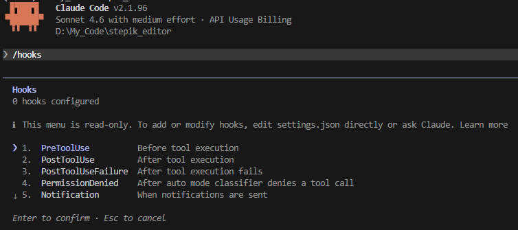
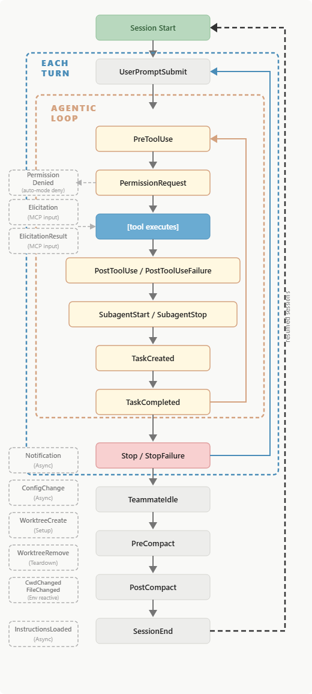
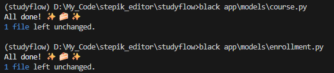

# Урок 2. CLI automation

_lesson_id: 2289241 · steps: 14 · ttc: 132s_

---

## Шаг 1 (step_id=9817278, text)

Что стоит автоматизировать в agent workflow, а что — нет

Когда в проекте появляется длинный агентный маршрут, быстро становится видно, сколько времени уходит на повторяемые действия: собрать контекст, прогнать тесты, отформатировать код, проверить один и тот же сценарий. Отсюда рождается идея автоматизации. Но автоматизировать всё подряд только потому, что действие повторяется, — типичная ошибка.

Автоматизация работает там, где маршрут уже стабилен

Лучший кандидат — действие с предсказуемым входом и наблюдаемым выходом: запуск конкретного набора тестов, короткая smoke-проверка, форматирование, сбор файлов для read-first, валидация структуры проекта. Во всех этих случаях уже есть ответ на вопрос: что именно команда делает и как понять, что она сработала.

Такую автоматизацию одинаково хорошо воспринимают люди и агенты. Человек перестаёт помнить длинные команды и порядок флагов, агент — каждый раз заново воспроизводить однотипный маршрут. В long-horizon режиме это особенно заметно: чем меньше импровизации на каждом этапе, тем устойчивее процесс.

Плохой кандидат — ещё неустоявшийся процесс

Опасно автоматизировать то, что само ещё не определилось. Если структура проверки меняется, формат результата спорен или последовательность действий зависит от каждой новой ситуации — упаковка в команду только прячет неопределённость под удобной оболочкой.

Не стоит раньше времени делать «универсальный pipeline для всего», если команда ещё не договорилась, какие проверки обязательны и в каком порядке они идут. Сначала стабилизируйте процесс вручную, потом делайте обёртку.

Хорошая автоматизация снимает рутину, а не мышление

Задача CLI-автоматизации скромна: убрать механическую повторяемость и сделать маршрут воспроизводимым. Хорошая команда отвечает на вопрос как одинаково выполнить уже понятный шаг. Плохая прячет внутри нерешённые вопросы уровня что вообще следует делать.

Автоматизируйте запуск проверок, но не вывод о том, что изменение архитектурно верно; сбор данных для read-first, но не выбор финальной стратегии; подготовку артефактов, но не спорные продуктовые приоритеты.

Как принять решение

Три вопроса: повторяется ли шаг без существенных вариаций, можно ли заранее описать его входы и ожидаемый результат, поможет ли единая команда уменьшить импровизацию и для человека, и для агента. Если ответы в основном положительные — хороший кандидат.

Сначала два-три раза стабильно пройти шаг вручную, потом делать из него команду. Если шаг не держит форму без обёртки — автоматизация окажется хрупкой.

---

## Шаг 2 (step_id=10042024, text)

Хуки: детерминированная автоматизация на событиях агента

Когда агент редактирует файл, заканчивает ответ, запрашивает разрешение на действие или стартует новую сессию — каждое из этих событий можно перехватить и выполнить собственный код. Именно так работают хуки (hooks) в современных CLI-агентах. Это принципиально другой уровень автоматизации по сравнению с CLI-обёртками: не «запусти команду вручную или по инструкции в промпте», а «гарантированно выполни действие при наступлении конкретного события в lifecycle агента».

Чем хук отличается от CLI-команды

CLI-команда — это то, что вы или агент запускаете явно. Хук — это то, что срабатывает автоматически при определённом событии, независимо от того, указал ли об этом промпт. В результате правило перестаёт быть рекомендацией и становится гарантией: форматирование запустится после каждого редактирования файла, опасная команда будет заблокирована до исполнения, уведомление придёт всякий раз, когда агент закончит сессию и ждёт ответа.

Это важно на длинном маршруте: чем длиннее задача, тем больше мест, где агент может «забыть» про инструкцию из промпта. Хук не забудет — он срабатывает детерминированно.

Хуки в Claude Code

В Claude Code система хуков появилась в середине 2025 года и с тех пор активно расширяется. Хук — это shell-команда или LLM-промпт, привязанный к событию жизненного цикла агента. Полный актуальный список событий доступен в официальной документации и продолжает пополняться — инструмент развивается быстро.

Интерактивный браузер хуков открывается командой /hooks прямо в сессии:

Все события можно разбить на несколько классов по назначению.

Жизненный цикл сессии. SessionStart удобен для инъекции актуального контекста при старте или возобновлении работы. Stop срабатывает, когда агент завершил ответ, — сюда обычно вешают уведомления, автоматический коммит или обновление статусного документа. StopFailure аналогичен Stop, но для случаев, когда сессия завершилась из-за ошибки API. SessionEnd срабатывает при завершении сессии.

Уведомления и ввод пользователя. Notification срабатывает, когда агент отправляет уведомление — стандартный способ получить десктоп-оповещение, когда агент ждёт вашего ответа. UserPromptSubmit перехватывает момент отправки промпта пользователем.

Перехват действий инструментов — самый востребованный класс. PreToolUse срабатывает до выполнения любого инструмента и может заблокировать действие, изменить его аргументы или добавить контекст; здесь удобно ставить охранные проверки и политики безопасности. PostToolUse срабатывает после успешного выполнения — идеально для форматирования, логирования и запуска проверок по факту изменения файла. PostToolUseFailure позволяет добавить агенту полезный контекст о причине ошибки.

Управление разрешениями. PermissionRequest срабатывает, когда агент собирается показать диалог подтверждения — можно автоматически одобрить или отклонить запрос по правилу. PermissionDenied срабатывает, когда классификатор Auto-режима заблокировал вызов инструмента; хук может вернуть retry: true, чтобы агент попробовал ещё раз.

Работа с контекстом и конфигурацией. PreCompact и PostCompact срабатывают до и после компактизации контекста — можно сохранить важное состояние перед сжатием. InstructionsLoaded срабатывает при загрузке файла инструкций (CLAUDE.md или правила). ConfigChange реагирует на изменения конфигурационных файлов в ходе сессии.

Помимо этого, есть события для работы с воркдеревьями (WorktreeCreate, WorktreeRemove), подагентами (SubagentStart, SubagentStop), задачами (TaskCreated, TaskCompleted), MCP-элиситацией и рядом других. Список продолжает расти с каждым обновлением Claude Code.

Хуки настраиваются в файле .claude/settings.json. Проектные настройки (в репозитории) применяются для всей команды, локальные (.claude/settings.local.json) — только на вашей машине.

{
  "hooks": {
    "PostToolUse": [
      {
        "matcher": "Edit|Write",
        "hooks": [
          {
            "type": "command",
            "command": "jq -r '.tool_input.file_path' | xargs npx prettier --write"
          }
        ]
      }
    ],
    "PreToolUse": [
      {
        "matcher": "Bash",
        "hooks": [
          {
            "type": "command",
            "command": "~/.claude/hooks/block-dangerous-commands.sh"
          }
        ]
      }
    ]
  }
}

Хук можно попросить написать сам агент: «Напиши хук, который после каждого редактирования файла запускает eslint». Поле matcher принимает строку или regex-паттерн — Edit|Write сработает на оба события.

Коды завершения управляют поведением: код 2 в PreToolUse блокирует действие, код 0 с JSON в stdout позволяет вернуть структурированное решение (permissionDecision: "deny" или "allow"). Для задач, требующих суждения, а не только правила, доступен тип "type": "prompt" — хук отправит однократный запрос в модель (по умолчанию Haiku) и примет решение на основе ответа.

Хуки в Codex

В Codex хуки появились позже и на апрель 2026 года всё ещё находятся в стадии активной разработки. По умолчанию они выключены — нужно явно включить флаг в config.toml:

[features]
codex_hooks = true

В отличие от Claude Code, хуки хранятся не внутри основного конфига, а в отдельном файле hooks.json, который кладётся рядом с активными слоями конфигурации: глобально в ~/.codex/hooks.json или в проекте как .codex/hooks.json. Если существует несколько файлов hooks.json на разных уровнях, Codex загружает все из них — слои не замещают друг друга.

Поддерживаемые события на апрель 2026 года: PreToolUse, PostToolUse, UserPromptSubmit, SessionStart и Stop. Все они работают на уровне одного хода (turn scope), список будет расширяться. Важное текущее ограничение: PreToolUse и PostToolUse пока срабатывают только для инструмента Bash — перехватить события редактирования файлов через apply_patch ещё нельзя (это известная открытая проблема). Хуки на Windows в данный момент отключены.

Синтаксис hooks.json близок к Claude Code — те же поля matcher, type, command и JSON-протокол через stdin. Дополнительно поддерживается поле statusMessage: строка, которая выводится в TUI пока хук работает, и timeout.

{
  "hooks": {
    "SessionStart": [
      {
        "matcher": "startup|resume",
        "hooks": [
          {
            "type": "command",
            "command": "python3 ~/.codex/hooks/inject_context.py",
            "statusMessage": "Загружаю контекст сессии",
            "timeout": 10
          }
        ]
      }
    ],
    "PreToolUse": [
      {
        "matcher": "Bash",
        "hooks": [
          {
            "type": "command",
            "command": "python3 .codex/hooks/block_dangerous.py",
            "statusMessage": "Проверяю команду"
          }
        ]
      }
    ],
    "Stop": [
      {
        "hooks": [
          {
            "type": "command",
            "command": "bash ~/.codex/hooks/notify.sh",
            "statusMessage": "Отправляю уведомление"
          }
        ]
      }
    ]
  }
}

Управление поведением — через код завершения и JSON в stdout: код 2 блокирует действие, permissionDecision: "deny" в JSON из PreToolUse тоже блокирует. PostToolUse поддерживает decision: "block" — это не отменяет уже выполненную команду, но заменяет её результат обратной связью и продолжает модель с этого места.

Актуальный список событий, ограничения и примеры — в официальной документации. Инструмент развивается быстро, и картина к моменту прочтения этого урока может заметно отличаться от описанного.

Хуки и Automations в Cursor

В Cursor хуки агента появились в конце 2025 года (версия 1.7) и позволяют перехватывать и ограничивать действия агента во время выполнения. Для команд доступны Team Rules — глобальные политики, которые применяются ко всем проектам из единого дашборда.

Параллельно в начале 2026 года Cursor запустил Automations — механизм для агентов, которые работают по расписанию или по внешнему событию без вашего присутствия. Триггером может быть открытый PR на GitHub, созданный тикет в Linear, инцидент в PagerDuty, сообщение в Slack или произвольный webhook. При срабатывании Cursor поднимает облачную песочницу, выполняет инструкции с настроенными MCP-серверами и опционально сохраняет результат для следующего запуска. Это уже не CLI-команда и не хук в классическом смысле, а event-driven агентный рабочий процесс.

Примеры Cursor Automations
 
— При каждом открытии PR: проверить diff на безопасность,
  назначить ревьюеров по истории коммитов, уведомить в Slack
— По расписанию каждое утро: найти участки без тестов,
  добавить покрытие по существующим конвенциям, открыть PR
— При инциденте в PagerDuty: исследовать логи через Datadog MCP,
  найти недавние изменения, предложить фикс

Когда использовать хук, а когда CLI-команду

Хук — правильный инструмент, когда нужна гарантия: действие должно выполняться всегда при наступлении события, независимо от того, упомянуто ли это в задаче. CLI-команда — правильный инструмент, когда нужна точка входа: явный запуск с известным входом и результатом, встроенный в маршрут как проверяемый шаг. В длинном проходе они работают вместе: хуки обеспечивают фоновые гарантии, CLI-команды — явные контрольные точки.

---

## Шаг 3 (step_id=10042025, text)

CLI-обёртки и automation contract

Хук срабатывает по событию автоматически. CLI-команда запускается явно — человеком или агентом — как часть маршрута. Чтобы она стала надёжной опорой, её нужно оформить по принципу один вход, один ожидаемый результат и снабдить коротким контрактом.

Что такое CLI-обёртка

Представьте, что для запуска тестов нужно выполнить такую команду:

cd src && python -m pytest tests/unit/ -v --tb=short --ignore=tests/unit/legacy -x 2>&1 | tee /tmp/test-report.txt

Каждый раз вводить её вручную утомительно. Агент тоже воспроизводит её чуть по-разному от сессии к сессии: где-то забудет флаг, где-то упустит cd, где-то использует другой путь. Обёртка — это файл, который прячет эту команду за коротким именем:

#!/usr/bin/env bash
# tools/run-unit-tests
set -e
cd "$(git rev-parse --show-toplevel)/src"
python -m pytest tests/unit/ -v --tb=short --ignore=tests/unit/legacy -x \
  2>&1 | tee /tmp/test-report.txt

После этого и человек, и агент запускают одно и то же:

./tools/run-unit-tests

Обёртка — не обязательно shell-скрипт. Это может быть цель в Makefile (make test-unit), npm script (npm run test:unit) или Python CLI (python tools/cli.py test-unit). Форма не важна — важна единая предсказуемая точка входа вместо хрупкой инструкции в промпте.

Узкая ответственность лучше широкой

Если в одну обёртку упаковать и сборку контекста, и форматирование, и тесты, и деплой — команда становится нечитаемой. Полезнее строить набор небольших блоков с одной функцией каждый, которые агент может комбинировать в маршруте.

Хорошие узкие команды:

./tools/check-smoke
./tools/run-targeted-tests
./tools/collect-read-first-context
./tools/format-changed-files

Плохая широкая команда:

./tools/do-everything

Automation contract

Чтобы CLI-команда стала пригодной для агентного маршрута, у неё должен быть automation contract — краткое описание того, как именно она работает и на что может опираться следующий этап.

Контракт начинается с входов: аргументы, переменные окружения, ожидаемое состояние рабочего дерева. Без этого команда зависит от скрытого контекста — работает у автора и ломается у агента. Выходы важнее внутренней реализации: что команда создаёт в файловой системе, что пишет в stdout, какой артефакт обновляет. Только когда выход описан явно, команду можно использовать как checkpoint-блок.

Коды завершения делают команду пригодной для автоматического маршрута. Агент может по-разному реагировать на успех, ошибку во входах и провал проверки — если они разделены числовыми кодами, а не расплывчатым текстом.

Automation contract

Назначение:
- [что именно делает команда]

Входы:
- обязательные аргументы
- переменные окружения
- ожидаемое состояние рабочего дерева

Выходы:
- stdout / stderr
- создаваемые файлы
- обновляемые артефакты

Коды завершения:
- 0: успех
- 1: проверка не пройдена
- 2: неверные входы

Логирование:
- что пишем
- что не логируем (токены, секреты)

Когда у команды есть contract, она перестаёт быть «чьим-то скриптом» и становится инженерным интерфейсом — одинаково пригодным и для человека, и для агента внутри хука или маршрута.

---

## Шаг 4 (step_id=10042022, text)

Практика: хук автоформатирования после редактирования файла

Сделаем конкретный хук: агент отредактировал файл — форматер запустился автоматически, без отдельной просьбы в промпте. Хорошая точка входа для знакомства с хуками: побочных эффектов нет, результат виден сразу, и логика переносится на любой язык и форматер.

У Codex хуки есть, но они пока не перехватывают события Edit/Write. В Cursor для такого сценария обычно опираются не на агентный хук, а на форматирование в редакторе и правила проекта. Разберём все три варианта.

Claude Code

Шаг 1. Выберите форматер

Команда должна принимать путь к файлу и форматировать его на месте:

# Python
ruff format <file>          # или: black <file>

# JavaScript / TypeScript
npx prettier --write <file>

# Go
gofmt -w <file>

# Rust
rustfmt <file>

Сначала проверьте команду вручную на реальном файле. Если форматер не установлен — установите до настройки хука, иначе хук будет тихо падать при каждом редактировании.

Шаг 2. Создайте скрипт хука

Хук получает из stdin JSON с данными о событии. Логику удобно вынести в отдельный скрипт — создайте .claude/hooks/format-on-edit.sh:

#!/usr/bin/env bash
if [ -f ".venv/Scripts/python.exe" ]; then
  PYTHON=".venv/Scripts/python.exe"
else
  PYTHON=".venv/bin/python"
fi

STDIN=$(cat)

FILE=$(echo "$STDIN" | "$PYTHON" -c "import sys, json; d=json.load(sys.stdin); print(d.get('tool_input',{}).get('file_path',''))" 2>/dev/null | tr -d '\r')

[ -z "$FILE" ] && exit 0

case "$FILE" in
  *.py)
    "$PYTHON" -m black "$FILE" 2>/dev/null
    ;;
esac

exit 0

 Данный хук должен форматировать .py файлы с помощью black форматтера.

Если данный код и его синтаксис вам не понятны, не страшно, попросите самого агента разобраться или написать готовый скрипт под вашу задачу.

Шаг 3. Зарегистрируйте хук

Откройте или создайте .claude/settings.json:

{
  "hooks": {
    "PostToolUse": [
      {
        "matcher": "Edit|Write|MultiEdit",
        "hooks": [
          {
            "type": "command",
            "command": "bash .claude/hooks/format-on-edit.sh"
          }
        ]
      }
    ]
  }
}

matcher перехватывает три инструмента: Edit (точечное редактирование), Write (запись нового файла), MultiEdit (несколько правок в одном вызове). Чтобы хук применялся для всей команды — добавьте .claude/settings.json в репозиторий. Для локального использования — .claude/settings.local.json в .gitignore.

Шаг 4. Проверьте

Заранее испортим форматирование в каком либо файле и попросим агента изменить его. Для проверки можно просто попросить изменить комментарий. 

Как видим, срабатывает. Сам агент в diff нам показывает что изменил только комментарий, но после изменения файла, к нему применяется форматирование и список тоже изменяется.

Codex

Прямого аналога post-edit хука в Codex пока нет: PreToolUse и PostToolUse срабатывают только для инструмента Bash. Рабочий обходной путь — вынести форматирование в отдельный скрипт и сделать его обязательным шагом маршрута.

Кроме того на Windows на момент написания урока хуки официально отключены. Но возможно когда вы это читаете, разработчики уже сделали эту функциональность доступной, стоит это проверить если вы работаете с Codex на Windows и хуки вам нужны.

1. Включите хуки

# ~/.codex/config.toml
[features]
codex_hooks = true

2. Создайте скрипт форматирования

#!/usr/bin/env bash
set -euo pipefail

REPO_ROOT="$(git rev-parse --show-toplevel 2>/dev/null || pwd)"
cd "$REPO_ROOT"

git diff --name-only -- '*.py' | while IFS= read -r file; do
  [ -z "$file" ] && continue
  [ -f "$file" ] || continue

  case "$file" in
    *.py) black "$file" ;;
  esac
done

3. Зарегистрируйте хук в .codex/hooks.json

{
  "hooks": {
    "PostToolUse": [
      {
        "matcher": "Bash",
        "hooks": [
          {
            "type": "command",
            "command": "bash \"$(git rev-parse --show-toplevel)/.codex/hooks/format-changed.sh\"",
            "statusMessage": "Formatting changed files"
          }
        ]
      }
    ]
  }
}

В текущем Codex ближайший рабочий вариант — PostToolUse для Bash: он срабатывает после Bash-команд, а не после каждого файлового редактирования.

Что адаптировать

Список расширений в case-блоке, команда форматера и её флаги, путь к скрипту. Если форматер уже настроен через pre-commit или CI — убедитесь, что локальная автоматизация использует те же флаги и конфиг, иначе будут расхождения между тем, что применяет агент, и тем, что проверяет CI.

Попросите агента не просто «настроить форматирование», а выбрать механизм под среду: «Если инструмент поддерживает настоящий post-edit hook — используй его. Если нет — выбери ближайший надёжный аналог и кратко объясни компромисс». Так проверяется умение отличать точный механизм от похожего.

---

## Шаг 5 (step_id=10043577, choice)

Какой сценарий лучше всего подходит для CLI-автоматизации?

**Тип:** choice (single)

**Варианты:**
- ○ Редкий исследовательский заход
- ○ Меняющийся набор ручных решений
- ✓ Стабильный smoke-прогон
- ○ Спорный выбор архитектуры

---

## Шаг 6 (step_id=10043581, choice)

Какие признаки показывают, что шаг пока рано упаковывать в automation?

**Тип:** choice (multiple)

**Варианты:**
- ✓ Результат зависит от каждой новой ситуации 
- ✓ Порядок действий всё ещё меняется
- ○ Команда уже стабильно проходится вручную
- ○ Можно заранее назвать входы и выходы

---

## Шаг 7 (step_id=10043582, choice)

Чем хук принципиально отличается от CLI-команды?

**Тип:** choice (single)

**Варианты:**
- ○ Хук удобнее хранить в Makefile
- ✓ Хук срабатывает по событию
- ○ CLI-запуск исключает явный checkpoint
- ○ CLI-команда не подходит для агентов

---

## Шаг 8 (step_id=10043576, matching)

Соотнесите инструмент или механизм с его свойством из урока

**Тип:** matching

**Правильные пары:**
- Claude Code hooks → могут запускаться после Edit|Write|MultiEdit
- Codex hooks → пока перехватывают PostToolUse только для Bash
- Cursor format-on-save → типичный путь локального автоформатирования
- CLI-обёртка → явная точка входа с известным результатом

---

## Шаг 9 (step_id=10043578, choice)

Какие события в Claude Code относятся к перехвату действий инструментов?

**Тип:** choice (multiple)

**Варианты:**
- ✓ PostToolUseFailure
- ○ SessionEnd
- ✓ PreToolUse
- ✓ PostToolUse

---

## Шаг 10 (step_id=10043575, choice)

Какое ограничение хуков Codex особенно важно для post-edit форматирования?

**Тип:** choice (single)

**Варианты:**
- ○ Им нужен отдельный MCP-сервер
- ✓ Они ловят только Bash
- ○ Они работают только в облаке
- ○ Они запускаются лишь после git commit

---

## Шаг 11 (step_id=10043580, choice)

Что должен описывать automation contract?

**Тип:** choice (multiple)

**Варианты:**
- ✓ Коды завершения и логирование
- ○ Только внутреннюю реализацию скрипта
- ✓ Обязательные входы команды
- ✓ Выходы и артефакты

---

## Шаг 12 (step_id=10043579, choice)

Зачем в automation contract разделять коды завершения?

**Тип:** choice (single)

**Варианты:**
- ○ Чтобы сократить число CLI-команд
- ○ Чтобы не документировать stdout и файлы
- ○ Чтобы скрыть детали проверки
- ✓ Чтобы маршрут различал тип исхода

---

## Шаг 13 (step_id=10043584, choice)

Почему узкие CLI-обёртки полезнее команды вида do-everything?

**Тип:** choice (multiple)

**Варианты:**
- ○ Они уменьшают явность этапов
- ✓ Их результат легче проверить
- ✓ У них яснее ответственность
- ✓ Их проще комбинировать в маршрут

---

## Шаг 14 (step_id=10043574, choice)

Какой рабочий подход в уроке предложен для Cursor в сценарии автоформатирования?

**Тип:** choice (single)

**Варианты:**
- ○ Блокировать правки через PermissionDenied
- ○ Запускать formatter только при SessionStart
- ○ Ловить Edit через hooks.json
- ✓ Опора на format-on-save и правила проекта

---
