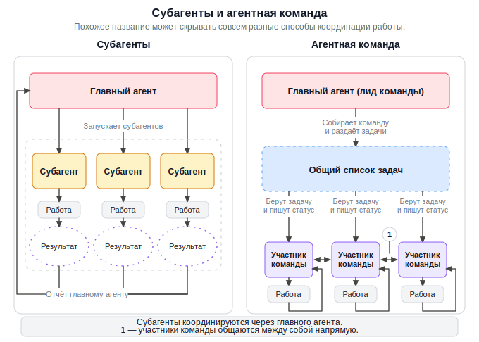
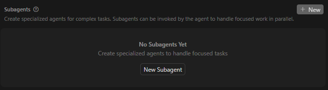
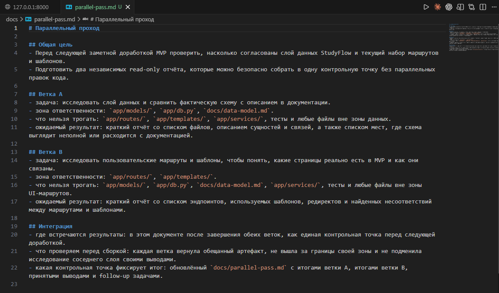
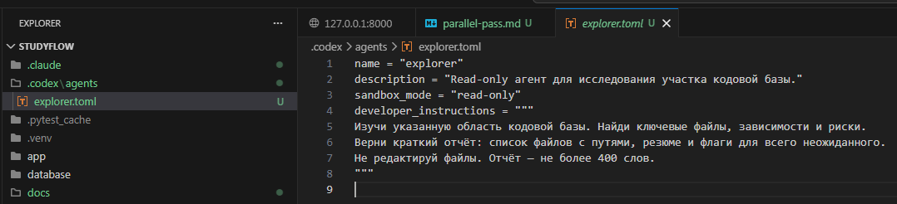
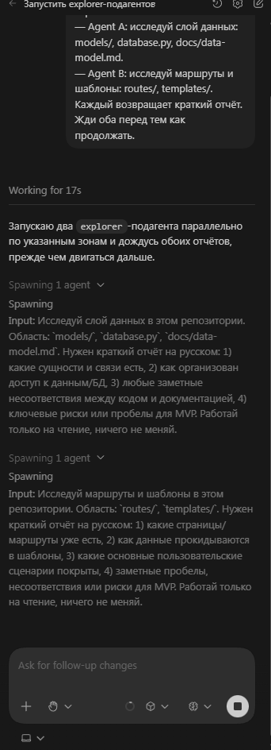
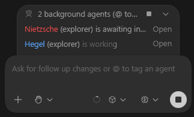
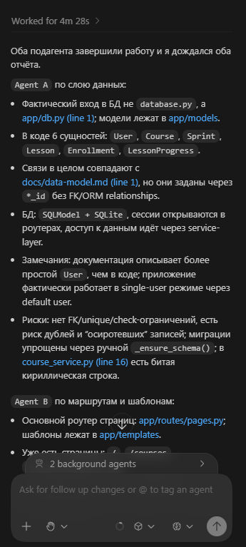
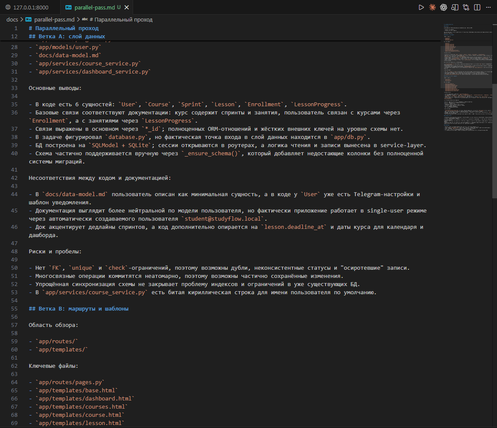

# Урок 3. Parallel agents

_lesson_id: 2289242 · steps: 14 · ttc: 60s_

---

## Шаг 1 (step_id=9817279, text)

Когда parallel agents действительно помогают

Когда длинный маршрут начинает работать, почти неизбежно появляется следующий вопрос: можно ли ускорить задачу несколькими агентами сразу? Можно, но только если работа действительно делится на независимые части — а не просто «кажется большой».

Параллельность работает только при реальной независимости

Сильный случай для parallel agents — задачи, которые можно разделить на ветки с явными зонами ответственности и понятной точкой сборки. Например: две исследовательские гипотезы, патчи в разных модулях с непересекающимися файлами, отдельная верификация рядом с реализацией, независимый review документации. Выигрыш появляется потому, что работа идёт без взаимного ожидания.

Если две подзадачи трогают один и тот же слой, спорят за одни и те же решения или каждая зависит от постоянно меняющегося результата соседней — параллельность не помогает. Она размножает конфликты интеграции.

«Быстрее» не значит «параллельно»

Иногда задача ощущается медленной, и первая мысль — выдать её нескольким агентам. Но источник медлительности может быть в другом: плохой brief, неясные критерии готовности, неподготовленный контекст, слишком широкая область правок, отсутствие контрольных точек. В таком случае несколько агентов не решают проблему — они делают её дороже. Вместо одного дрейфующего прохода вы получаете три.

Хорошая параллельность строится на разных ролях

На практике хороший параллельный расклад чаще строится не вокруг одинаковых задач, а вокруг разных ролей в одном маршруте. Один агент исследует кодовую базу и собирает риски, другой готовит патч в независимом модуле, третий проверяет документацию. Ветки не конкурируют за одно и то же решение — поэтому маршрут действительно ускоряется.

Первый вопрос перед параллелизацией

Не «что ещё можно распараллелить?», а «что можно выполнить независимо и потом собрать без неясностей?». Если на этот вопрос нет короткого ответа — задача ещё не готова к parallel agents.

Параллелизация оправдана там, где интеграция заранее дешевле последовательного ожидания. Если сборка результатов выглядит туманно — распараллеливать рано.

---

## Шаг 2 (step_id=10051941, text)

Parallel agents в конкретных инструментах

Под словом parallel agents разные инструменты скрывают разные механизмы. Где-то это subagents внутри одной сессии, где-то — отдельные worktrees или треды, а где-то — удалённый агент, который работает на своей ветке и возвращает pull request. Поэтому ниже важно не просто запомнить названия, а понять, какая именно единица изоляции есть у каждого продукта.

Claude Code

Subagents в Claude Code работают внутри одной сессии, но в отдельных контекстных окнах. Три встроенных: Explore (read-only, по умолчанию работает на Haiku — оптимизирован для скорости и стоимости), Plan (сбор контекста перед планом) и General (общие задачи с полным набором инструментов). Кастомные агенты определяются markdown-файлами с YAML frontmatter в .claude/agents/ или ~/.claude/agents/. Создавать их можно вручную или через /agents. Пример простого read-only агента:

---
name: security-reviewer
description: Проверяет изменения кода на уязвимости. Используй перед коммитом.
tools: Read, Bash
model: haiku
---
Ты — security reviewer. Найди уязвимости в изменённых файлах.
Верни список с file:line референсами и severity (Critical/High/Medium/Low).
Если проблем нет — явно напиши об этом.

Практически важно следующее: subagents могут выполняться в foreground или background. Для управления удобнее использовать /agents: во вкладке Library создаются и редактируются агенты, а во вкладке Running видны активные ветки. Если текущую задачу нужно отправить в фон, используйте Ctrl+B. Начиная с апреля 2026 года, конкретный subagent можно вызвать напрямую через @-упоминание прямо в поле ввода — так же, как вы @-ссылаетесь на файл.

Agent Teams — отдельный экспериментальный режим, который включается через CLAUDE_CODE_EXPERIMENTAL_AGENT_TEAMS=1. В отличие от subagents, здесь участники команды могут обмениваться сообщениями напрямую и координироваться через общий список задач. Это важно не путать: если веткам нужна peer-to-peer коммуникация, значит речь уже не о простых subagents.

Codex

В Codex subagents тоже запускаются только явно, но схема отличается от Claude Code. У Codex есть встроенные агенты default, worker и explorer, а поверх них можно добавлять свои кастомные роли. Автоматической маршрутизации здесь нет: если вы хотите параллельную работу, нужно прямо попросить Codex породить подагентов, дождаться их и собрать результат.

Кастомный агент в Codex задаётся отдельным TOML-файлом в ~/.codex/agents/ для личного уровня или в .codex/agents/ для конкретного проекта. Обязательны три поля: name, description и developer_instructions. Остальные настройки можно добавлять по задаче: например, model, model_reasoning_effort, sandbox_mode, nickname_candidates, mcp_servers или skills.config. Если вы их не укажете, они наследуются от родительской сессии.

name = "reviewer"
description = "PR reviewer на баги, регрессии и пропущенные тесты."
model = "gpt-5.4"
model_reasoning_effort = "high"
sandbox_mode = "read-only"
developer_instructions = """
Проверяй correctness, security, regressions и missing tests.
Возвращай конкретные findings с file:line.
Не уходи в style-only замечания.
"""
nickname_candidates = ["Atlas", "Echo"]

Глобальные ограничения для subagent-веток задаются в .codex/config.toml через секцию [agents]: обычно это лимит одновременно открытых веток max_threads и глубина вложенной делегации max_depth. Это важный инженерный сигнал: в Codex вы настраиваете не только роль агента, но и пределы распараллеливания, чтобы ветки не начали бесконтрольно размножаться.

[agents]
max_threads = 6
max_depth = 1

Практически полезно запомнить ещё один нюанс: отдельная регистрация каждого кастомного агента через [agents.имя] в актуальной схеме не обязательна. Достаточно положить корректный TOML-файл в папку агентов. А вот запуск остаётся явным: хороший промпт должен сразу сказать, сколько веток создать, как поделить работу, нужно ли дождаться всех и в каком формате вернуть итог.

Cursor

В Cursor subagents по смыслу тот же класс механики, что и в Claude Code или Codex: вспомогательные агенты внутри родительского прохода, которые запускаются параллельно, работают в собственном контексте и берут на себя отдельную подзадачу. Cursor описывает их как способ распараллелить исследование кодовой базы и другие дискретные части работы.

Но у Cursor важно не смешивать три разных уровня параллельности. Subagents — это внутренние ветки внутри текущего агентного прохода. Tabs — несколько независимых разговоров, у каждого свой контекст и свой маршрут.

Создать агентов можно через меню Cursor Settings > Rules, Skills, Subagents, там есть блок субагентов и при нажатии кнопки New Subagent

Cursor предложит с помощью команды /create-subagent прописать промпт и агент сам поможет настроить его. Агенты хранятся по адресу .cursor/agents/, но так же Cursor может читать папки .claude/agents/ и .codex/agents/ и работать с claude и codex совместимыми субагентами

Заметное отличие: продукт одновременно совмещает внутреннюю оркестрацию внутри текущего прохода и вынесение длинной автономной задачи в отдельную облачную среду. Если вам нужно ускорить текущий проход внутри одной сессии, это логика subagents.

Универсальный паттерн

Несмотря на разные интерфейсы, общий инженерный вывод один и тот же. Лучше всего параллелятся исследование, review и независимые ветки с заранее известной точкой сборки. Хуже всего — задачи, где две ветки спорят за один и тот же файл, контракт или решение.

Параллельность выигрывает:          Параллельность проигрывает:
— исследование                      — два агента в одном файле
— независимые review-проходы        — неясная область правок
— патчи в непересекающихся модулях  — каждая ветка зависит от соседней
— проверка рядом с реализацией      — нет известной точки сборки

Где перепроверять детали

У инструментов такого класса детали меняются очень быстро: появляются новые режимы, переименовываются команды, пересобираются интерфейсы, а экспериментальные функции могут менять статус или поведение. Поэтому перед тем как переносить конкретный приём в свою работу, полезно быстро свериться с официальной документацией именно той версии продукта, которой вы пользуетесь сейчас.

	Claude Code: Subagents и Agent Teams
	Codex: Subagents
	Cursor: Subagents

---

## Шаг 3 (step_id=10051939, text)

Зоны ответственности, декомпозиция и сборка результатов

Параллельная работа начинает приносить пользу только тогда, когда у каждой ветки есть собственная зона ответственности, заранее известная точка сборки и понятный формат результата.

Независимая подзадача имеет собственный результат

Подзадача готова к параллельному запуску, если её ожидаемый результат можно назвать отдельно от соседних веток. Это может быть исследовательская заметка, патч в конкретной области правок, список рисков, пакет тестовых проверок или review одного конкретного блока. Если результат неотделим от соседей — подзадача слишком расплывчата.

Делить стоит по типу зависимости, а не по количеству работы. Решение разделить работу с большим количеством файлов между агентами работает только если между этими файлами почти нет общих решений. Намного надёжнее: отдельное исследование без правок, отдельный изолированный патч, отдельный проход проверки.

Зона ответственности формулируется положительно и отрицательно

Недостаточно сказать «ты отвечаешь за модуль X». Полезно сразу добавить, что именно запрещено менять. Так у агента появляется не только зона действия, но и жёсткая граница, через которую нельзя расширять задачу самовольным cleanup или рефакторингом.

	Положительная граница: какие файлы, слои или артефакты входят в зону ответственности.
	Отрицательная граница: какие соседние участки нельзя трогать без нового решения.
	Ожидаемый результат: что именно ветка возвращает в финале.

Запрет на самовольное улучшение чужого участка — базовое правило. Даже полезная правка вне своей зоны ответственности размывает ответственность, усложняет diff и делает результат ветки трудно приемлемым.

Параллельная декомпозиция

Ветка A:
- задача
- область правок
- что нельзя трогать
- ожидаемый результат

Ветка B:
- задача
- область правок
- что нельзя трогать
- ожидаемый результат

Интеграция:
- где встречаются результаты
- кто принимает итог
- по каким критериям ветка считается готовой к сборке

Точка интеграции должна быть известна заранее

Плохая декомпозиция узнаётся по фразе «потом как-нибудь соберём». Хорошая заранее определяет, где результаты встретятся: основной маршрут ждёт исследовательский отчёт до старта реализации, два патча собираются в основную ветку после локальной проверки, документ по плану внедрения прикладывается к контрольной точке перед передачей.

Сборка: сначала по контракту, потом по смыслу

Перед объединением необходимо проверять, вернула ли каждая ветка именно тот артефакт, который обещала. Если исследовательская ветка вместо списка рисков принесла полуготовый рефакторинг, а тестовая ветка изменила прод-код — это не вопрос merge-конфликта, а нарушение зоны ответственности. Такие случаи лучше разворачивать назад.

Даже если Git не показывает явного конфликта, ветки могут пересекаться по смыслу. Одна меняет интерфейс функции, другая продолжает опираться на старый контракт. Один агент описал план внедрения, который предполагает другую последовательность, чем та, что сложилась в патче реализации. Поэтому при сборке важно проверять не только строки diff, но и совпадение решений и контрактов.

---

## Шаг 4 (step_id=10051940, text)

Практика: параллельный проход на реальной задаче

Возьмите задачу из своего проекта и проведите один параллельный проход. Конкретный механизм зависит от инструмента, но логика одна: спроектировать независимые ветки заранее, запустить их с явными границами и собрать результаты по контракту.

В качестве демонстрационного примера используем StudyFlow. Хороший кандидат на параллельное исследование перед любой заметной доработкой MVP — два независимых read-only прохода: один по слою данных (models/, database.py, docs/data-model.md), другой по маршрутам и шаблонам (routes/, templates/). Файлы не пересекаются, результаты независимы.

Шаг 1. Спроектируйте две независимые ветки

Выберите задачу, где работа честно делится на 2–3 ветки без общих решений. Самый безопасный стартовый паттерн — два параллельных read-only исследования, а не два редактирующих агента в одном слое.

Оформите короткий документ docs/parallel-pass.md:

# Параллельный проход

## Общая цель
- [какой вопрос или доработка требует предварительного исследования]

## Ветка A
- задача: [что исследуем или меняем]
- зона ответственности: [конкретные файлы или слой]
- что нельзя трогать: [соседние файлы и слои]
- ожидаемый результат: [формат отчёта или артефакт]

## Ветка B
- задача: [что исследуем или меняем]
- зона ответственности: [конкретные файлы или слой]
- что нельзя трогать: [соседние файлы и слои]
- ожидаемый результат: [формат отчёта или артефакт]

## Интеграция
- где встречаются результаты
- что проверяем перед сборкой
- какая контрольная точка фиксирует итог

Шаг 2. Запустите ветки в своём инструменте

Codex. Создайте кастомного агента — TOML-файл .codex/agents/explorer.toml:

Зарегистрируйте агента в ~/.codex/config.toml:

[agents.explorer]
description = "Read-only агент для исследования кодовой базы."
config_file = ".codex/agents/explorer.toml"

Запустите ветки явно — Codex не запускает subagents автоматически:

Создайте два параллельных подагента, используя агента explorer:
— Agent A: исследуй слой данных: models/, database.py, docs/data-model.md.
— Agent B: исследуй маршруты и шаблоны: routes/, templates/.
Каждый возвращает краткий отчёт. Жди оба перед тем как продолжать.

Claude Code. Создайте read-only subagent — вручную или через /agents → Library. Файл .claude/agents/explorer.md:

---
name: explorer
description: Исследует участок кодовой базы. Используй, когда нужно понять структуру или найти риски в конкретной области без правок.
tools: Read, Bash, Glob, Grep
model: haiku
---

Ты — read-only исследовательский агент. Изучи указанную область, найди ключевые файлы, зависимости и потенциальные риски. Верни краткий отчёт: список файлов с путями, резюме и флаги для всего неожиданного. Не редактируй файлы. Отчёт — не более 400 слов.

Затем запустите ветки явным промптом:

Запусти два параллельных subagents используя агент explorer:
— Ветка A: исследуй слой данных: models/, database.py, docs/data-model.md.
  Верни список файлов, краткое описание схемы и все места, где она выглядит неполной.
— Ветка B: исследуй маршруты и шаблоны: routes/, templates/.
  Верни список эндпоинтов, какие шаблоны они используют, и любые несоответствия.

Каждый агент работает только в своей области и не пересекает файлы с соседней веткой.

Следите за ветками через /agents → Running. Если subagent мешает основному потоку — Ctrl+B отправляет его в фон.

Cursor. В Cursor для такого прохода можно использовать subagents: они подходят и для read-only исследования, и для других дискретных подзадач внутри одного родительского прохода. Дайте каждому субагенту явную инструкцию и ограничение на файлы:

Субагент 1:
Изучи models/, database.py и docs/data-model.md в StudyFlow.
Не трогай routes/ и templates/. Верни список файлов, краткое описание схемы
и все места, где схема выглядит неполной.

Субагент 2:
Изучи routes/ и templates/ в StudyFlow.
Не трогай models/ и database.py. Верни список эндпоинтов,
какие шаблоны они используют, и любые несоответствия.

Объедините результаты вручную — каждый субагент работает независимо, точка интеграции у вас. Для длинных фоновых задач в Cursor используйте Background Agents.

Шаг 3. Соберите результаты и зафиксируйте итог

После завершения обеих веток проверьте результаты по контракту: вернул ли каждый агент именно тот артефакт, который обещал, не вышел ли за границы своей зоны, нет ли смысловых пересечений. Если ветка принесла что-то лишнее вместо обещанного — разворачивайте к контракту, а не пытайтесь это интегрировать.

Зафиксируйте итог в docs/parallel-pass.md: что нашли, что принято, что уходит в follow-up. Этот документ и станет контрольной точкой перед следующим этапом работы в проекте.

Как принять результат

Сильная работа отвечает на два вопроса: почему выбранные ветки действительно можно вести параллельно, и как вы поняли бы, что одна из веток вышла за границы своей зоны ответственности. Для дополнительной проверки попросите агента сыграть роль строгого интегратора — найти места, где области правок ещё пересекаются по смыслу, и указать, какие ветки лучше оставить последовательными.

Если вам нужно, чтобы ветки сообщали друг другу о зависимостях напрямую — это уже не задача для subagents. В Claude Code для peer-to-peer координации есть экспериментальный режим Agent Teams, в Codex — multi-agent v2 с адресацией по путям. Но это другая практика и другой уровень сложности.

---

## Шаг 5 (step_id=10053418, choice)

Какой признак лучше всего показывает, что задачу можно параллелить?

**Тип:** choice (single)

**Варианты:**
- [✓ правильный] Интеграция заранее выглядит ясной
-  Обе ветки кажутся срочными
-  Подзадачи имеют одинаковый размер
-  Каждая ветка меняет общий контракт

**Статус Stepik:** `correct` (score 1.0)

**Мой reasoning:** _В теории прямо сказано: параллелизация оправдана там, где интеграция заранее дешевле последовательного ожидания, и первый вопрос — что можно выполнить независимо и собрать без неясностей. Если точка сборки понятна заранее — задача готова к parallel agents._

---

## Шаг 6 (step_id=10053412, choice)

Какие признаки чаще говорят не о пользе parallel agents, а о плохой подготовке маршрута?

**Тип:** choice (multiple)

**Варианты:**
- [✓ правильный] Неясные критерии готовности
- [✓ правильный] Слишком широкая область правок
-  Сам факт, что задача кажется срочной
- [✓ правильный] Неподготовленный контекст

**Статус Stepik:** `correct` (score 1.0)

**Мой reasoning:** _В теории прямо названы источники медлительности, которые путают с поводом распараллелить: плохой brief, неясные критерии готовности, неподготовленный контекст и слишком широкая область правок. Срочность как таковая в тексте не упоминается среди этих признаков._

---

## Шаг 7 (step_id=10053415, matching)

Соотнесите механизм с его ролью в уроке

**Тип:** matching

**Колонка А (вопросы):**
- Subagent
- Agent Teams
- Worktree
- Background Agent

**Колонка Б (варианты, перемешаны):**
- Режим с прямой координацией участников
- Вспомогательная ветка внутри родительского прохода
- Отдельная рабочая копия репозитория
- Удалённый асинхронный проход в своей среде

**Правильные пары:**
- Subagent → Вспомогательная ветка внутри родительского прохода
- Agent Teams → Режим с прямой координацией участников
- Worktree → Отдельная рабочая копия репозитория
- Background Agent → Удалённый асинхронный проход в своей среде

**Статус Stepik:** `correct` (score 1.0)

**Мой reasoning:** _Subagents — вспомогательные ветки внутри родительского прохода; Agent Teams — экспериментальный режим с peer-to-peer координацией; worktree — отдельная рабочая копия; Background Agent в Cursor — длинная автономная задача в облачной среде._

---

## Шаг 8 (step_id=10053416, choice)

Какие утверждения о конкретных инструментах соответствуют уроку?

**Тип:** choice (multiple)

**Варианты:**
-  Tabs в Cursor эквивалентны Background Agents
-  Claude Code subagents обязаны общаться друг с другом напрямую
-  Bugbot в Cursor относится к PR-review
- [✗ выбран, неверно] В Codex subagents нужно запускать явно

**Статус Stepik:** `wrong` (score 0.0)

**Мой reasoning:** _Урок прямо указывает, что в Codex автоматической маршрутизации нет и subagents запускаются только явно. Bugbot и Tabs=Background Agents в уроке не утверждаются, а Claude Code subagents работают в отдельных контекстах без обязательной peer-to-peer связи (это уже Agent Teams)._

---

## Шаг 9 (step_id=10053413, choice)

Какой способ деления задачи урок считает надёжнее?

**Тип:** choice (single)

**Варианты:**
- [✓ правильный] По типу зависимости между ветками
-  По ориентировочному объёму правок в репозитории
-  По количеству файлов в модуле
-  По размеру общего diff

**Статус Stepik:** `correct` (score 1.0)

**Мой reasoning:** _В уроке прямо сказано: «Делить стоит по типу зависимости, а не по количеству работы». Объём правок, количество файлов и размер diff — ненадёжные критерии, потому что не отражают реальную независимость веток._

---

## Шаг 10 (step_id=10053420, choice)

Что должно входить в описание зоны ответственности ветки?

**Тип:** choice (multiple)

**Варианты:**
- [✓ правильный] Что именно ветка должна вернуть
- [✓ правильный] Какие файлы и слои в неё входят
-  Какой у агента любимый стиль рефакторинга
- [✓ правильный] Какие соседние участки нельзя трогать

**Статус Stepik:** `correct` (score 1.0)

**Мой reasoning:** _Теория явно перечисляет три компонента: положительная граница (файлы/слои), отрицательная граница (что нельзя трогать) и ожидаемый результат. Любимый стиль рефакторинга — нерелевантный шум._

---

## Шаг 11 (step_id=10053417, choice)

Что означает правило «сначала по контракту, потом по смыслу»?

**Тип:** choice (single)

**Варианты:**
-  Сначала закрыть merge-конфликт, потом проверить границы
-  Сначала выбрать агента, потом смотреть diff
- [✓ правильный] Сначала сверить артефакт, потом смысловые конфликты
-  Сначала слить ветки, потом читать отчёты

**Статус Stepik:** `correct` (score 1.0)

**Мой reasoning:** _В теории явно сказано: перед объединением проверяем, вернула ли ветка обещанный артефакт (контракт), и только потом — совпадение решений и смысловые пересечения._

---

## Шаг 12 (step_id=10053411, matching)

Соотнесите тип результата и пример параллельной ветки

**Тип:** matching

**Колонка А (вопросы):**
- Исследовательская ветка
- Изолированный патч
- Review-проход
- Пакет проверок

**Колонка Б (варианты, перемешаны):**
- Замечания по одному блоку
- Список рисков и ключевых файлов
- Отчёт о тестовом прогоне
- Diff в своей области правок

**Правильные пары:**
- Исследовательская ветка → Список рисков и ключевых файлов
- Изолированный патч → Diff в своей области правок
- Review-проход → Замечания по одному блоку
- Пакет проверок → Отчёт о тестовом прогоне

**Статус Stepik:** `correct` (score 1.0)

**Мой reasoning:** _Согласно теории, у каждой ветки свой ожидаемый артефакт: исследование возвращает риски и файлы, патч — diff в своей зоне, review — замечания по блоку, проверки — отчёт о прогоне._

---

## Шаг 13 (step_id=10053419, choice)

Что должно быть в docs/parallel-pass.md по уроку?

**Тип:** choice (multiple)

**Варианты:**
- [✓ правильный] Что проверяем перед сборкой
-  Список любимых моделей команды
- [✓ правильный] Общая цель прохода
- [✓ правильный] Где встречаются результаты

**Статус Stepik:** `correct` (score 1.0)

**Мой reasoning:** _В уроке шаблон docs/parallel-pass.md содержит общую цель, ветки с зонами ответственности и секцию интеграции с пунктами 'где встречаются результаты' и 'что проверяем перед сборкой'. Список любимых моделей — нерелевантный пункт._

---

## Шаг 14 (step_id=10053414, choice)

Какой стартовый паттерн урок называет самым безопасным?

**Тип:** choice (single)

**Варианты:**
-  Два редактирующих агента в одном слое
-  Три редактирующие ветки с общим правом на cleanup
- [✓ правильный] Два параллельных read-only исследования
-  Один Bugbot и один cloud-run без границ

**Статус Stepik:** `correct` (score 1.0)

**Мой reasoning:** _В уроке прямо сказано: «Самый безопасный стартовый паттерн — два параллельных read-only исследования, а не два редактирующих агента в одном слое». Read-only ветки не конфликтуют за файлы и решения, точка сборки очевидна._

---
