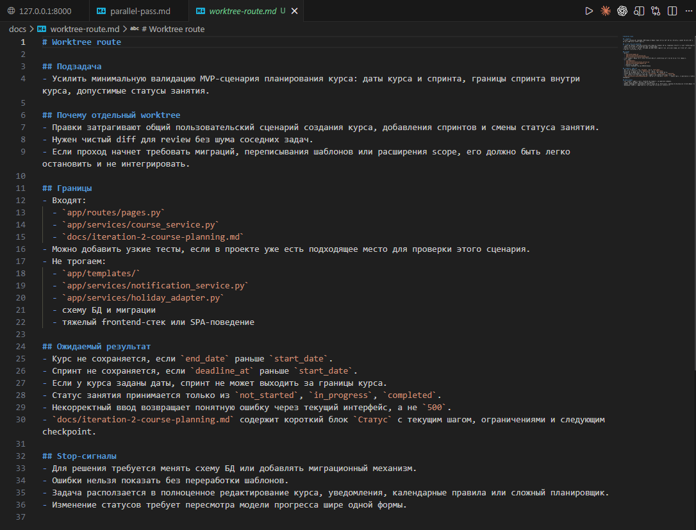
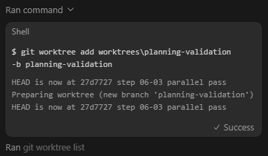
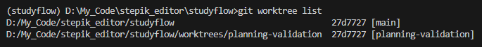
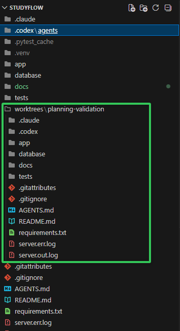
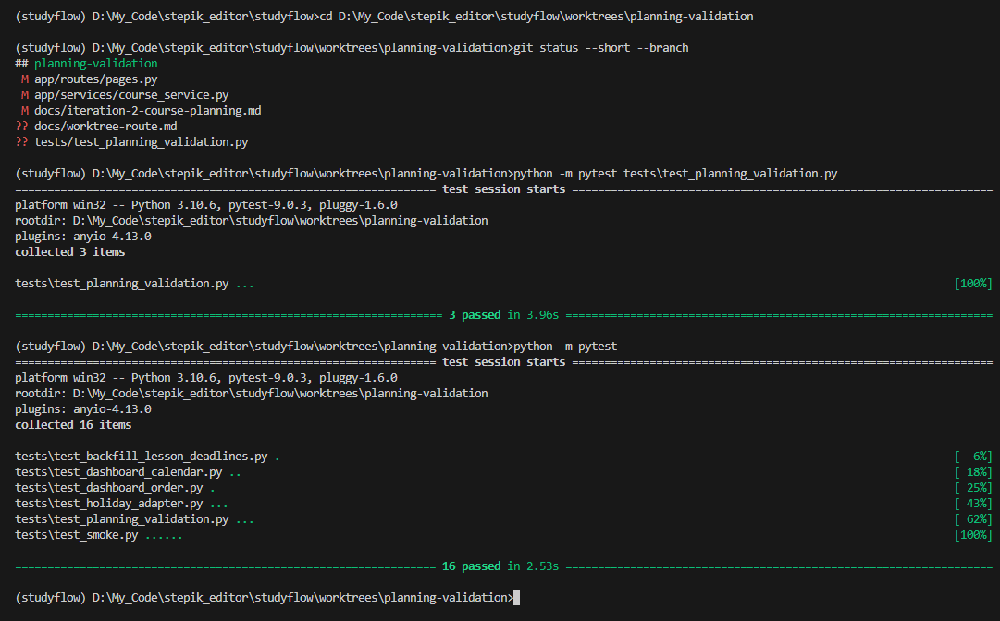
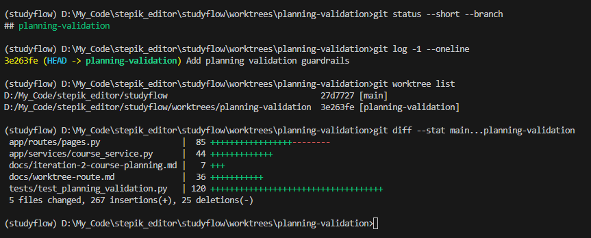
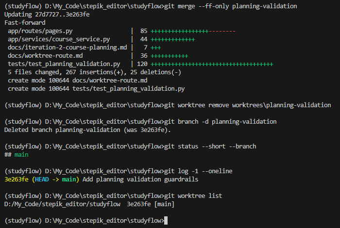

# Урок 4. Worktrees и изолированные изменения

_lesson_id: 2289243 · steps: 14 · ttc: Nones_

---

## Шаг 1 (step_id=9817280, text)

Зачем нужна изоляция изменений, если уже есть ветки

На первый взгляд worktree кажется лишним: ветки уже есть. Для линейной работы — да, хватает. В agent workflow — нет.

Git-ветка изолирует историю, но не всегда рабочую площадку

Ветка хорошо решает вопрос версии истории: от какой точки вы ответвились и куда будете сливать изменения. Но ветка не создаёт отдельную физическую рабочую среду сама по себе. Если несколько проходов идут в одном дереве, у них остаются общие временные файлы, общее состояние индекса, общий набор незакоммиченных правок — и высокий риск случайно перенести один контекст в другой.

При нескольких параллельных агентных ветках это сразу создаёт путаницу: ветки формально разные, а физическая папка и её состояние — общие.

В agent workflow опасен не только merge, но и смешение состояния

Когда несколько проходов идут рядом, нужно изолировать не только историю коммитов, но и рабочее состояние: какие файлы сейчас изменены, какие артефакты сгенерированы, какая команда запускалась последней, какой набор зависимостей активен. Если эти следы принадлежат сразу нескольким задачам, агент и человек начинают путать, что откуда, ещё до слияния.

Изоляция полезна и без параллельности

Worktree полезно использовать, когда вы хотите, чтобы агент продолжил в отдельном checkout. Типичные причины:

	держать экспериментальные правки подальше от основного checkout;
	запускать установки зависимостей, сборку и тесты, не тревожа текущую ветку;
	делать рискованный рефакторинг с простым путём отката и очистки.

Даже в одиночном проходе отдельная площадка помогает: рискованный рефакторинг, эксперимент с альтернативной реализацией, длинный проход с несколькими контрольными точками, сравнение двух вариантов решения. Неудачную попытку проще отбросить, удачную — проще проверять и сравнивать.

Worktrees нужны не потому что Git слабый — просто agent workflow создаёт больше одновременных состояний, чем удобно держать в одном рабочем дереве.

---

## Шаг 2 (step_id=10056730, text)

Worktrees в конкретных инструментах

Git worktrees — не новая концепция. Важнее другое: в современных агентных инструментах изоляцию всё чаще можно запустить прямо из самого инструмента, а не только вручную через Git.

Claude Code: флаг --worktree и isolation в frontmatter

Флаг --worktree (сокращение -w) создаёт изолированный checkout в .claude/worktrees/имя/ с собственной веткой и сразу запускает Claude Code в этой папке:

# Создать worktree с именем feature-auth и запустить агент
claude --worktree feature-auth

# Запустить второй агент в отдельном worktree
claude --worktree bugfix-123

# Имя можно не указывать — Claude сгенерирует случайное
claude --worktree

# --tmux оставляет сессию живой, если закрыть терминал
claude --worktree feature-auth --tmux

Все worktrees хранятся в .claude/worktrees/ — эту папку стоит добавить в .gitignore, иначе содержимое будет всплывать как неотслеживаемые файлы в основном репозитории.

Поскольку worktree — это чистый checkout, gitignored файлы вроде .env туда не попадают. Чтобы они копировались автоматически, добавьте в корень проекта файл .worktreeinclude с паттернами в стиле .gitignore:

# .worktreeinclude
.env
.env.local
.env.development

Очистка worktree происходит автоматически: если изменений нет, при завершении сессии ветка и папка удаляются без вопросов. Если изменения есть — Claude спрашивает, оставить worktree или удалить вместе со всеми незакоммиченными правками.

Worktrees для subagents. Добавьте isolation: worktree в frontmatter кастомного subagent — и каждый его запуск автоматически получит собственный изолированный checkout:

---
name: refactor-agent
description: Выполняет масштабный рефакторинг в изолированной ветке.
tools: Read, Write, Edit, Bash
isolation: worktree
model: sonnet
---

Работай в своём worktree. Выполни рефакторинг, прогони тесты, сделай коммит.
Не делай push — основной агент проверит ветку и примет решение о merge.

Можно также сказать агенту в промпте: «используй worktrees для своих subagents» — и Claude настроит изоляцию автоматически, без ручного редактирования frontmatter.

Для нестандартных VCS (Version Control System, системы контроля версий) вроде Mercurial или SVN, или для особой логики создания изолированной среды настройте хуки WorktreeCreate и WorktreeRemove — они полностью заменяют стандартную git-логику.

Codex: режим Worktree в приложении

В Codex app (macOS и Windows) изоляция встроена как режим создания треда. При создании нового треда выбираете между Local и Worktree:

	Local — агент работает прямо в вашем основном checkout, изменения немедленно видны в IDE.
	Worktree — Codex создаёт изолированный git worktree, агент работает там, основная копия не трогается.

Используйте Worktree, когда хотите попробовать новую идею без вмешательства в текущую работу, или когда нужно несколько задач параллельно в одном репозитории. Automations (запуск по расписанию или событию) тоже работают в выделенных фоновых worktrees.

Handoff — механизм перемещения треда между Local и Worktree. Это не просто переключение папки: Codex сам выполняет нужные git-операции, потому что Git не позволяет одновременно checkout одну ветку в двух местах. Типичный сценарий: агент работает в Worktree, вы хотите проверить результат в своём IDE — делаете Handoff в Local.

Если проект требует зависимостей или переменных окружения, которых нет в git, настройте setup-скрипт в параметрах Local Environment: он будет запускаться автоматически при создании каждого нового worktree.

В Codex CLI нативного флага --worktree пока нет — в феврале 2026 открыт GitHub Issue с просьбой добавить его. До его появления для параллельной работы через CLI используйте стандартный git worktree add и запускайте Codex в нужной папке:

git worktree add ../studyflow-feature-auth -b feature-auth
cd ../studyflow-feature-auth
codex

Cursor

В Cursor это осуществляется через команды /worktree и /best-of-n. Эти команды позволяют запускать локальную работу агента в изолированных git worktrees.

/worktree: один изолированный проход

/worktree исправь падающие тесты авторизации и обнови текст на экране входа

Такой режим полезен, когда вы хотите увести рискованную или шумную задачу в отдельный checkout. Дальше либо агент коммитит и отправляет изменения прямо из worktree, либо вы переносите результат в основной checkout через /apply-worktree.

Сделай коммит, отправь изменения в удалённый репозиторий и открой PR

Когда изолированная копия больше не нужна, пригодится /delete-worktree.

/best-of-n: несколько моделей, несколько worktrees

Команда /best-of-n запускает одну и ту же задачу сразу на нескольких моделях. Каждому запуску выделяется собственный worktree, поэтому кандидаты изолированы и друг от друга, и от вашего основного checkout.

/best-of-n sonnet, gpt, composer почини нестабильный тест выхода из аккаунта

Этот режим нужен, когда вы хотите сравнить несколько моделей или подходов к одной задаче. Победивший результат затем либо применяете через /apply-worktree, либо оставляете в его worktree и оформляете обычный commit/push.

Настройка окружения через .cursor/worktrees.json

Если проекту мало самого checkout, подготовку описывают в .cursor/worktrees.json: установить зависимости, скопировать .env, выполнить миграции. Для простых случаев хватает массива команд, для сложных — отдельного скрипта.

{
  "setup-worktree": [
    "npm ci",
    "cp $ROOT_WORKTREE_PATH/.env .env"
  ]
}

Универсальный базовый паттерн

Независимо от инструмента схема одна: выносите самостоятельную задачу в чистый checkout, доводите площадку до рабочего состояния, а потом либо возвращаете удачный результат через commit/push/PR или apply/handoff, либо удаляете неудачный проход целиком. Именно это и делает worktree не просто git-приёмом, а удобной рабочей площадкой под отдельный маршрут.

# Базовый git worktree — работает в любом инструменте
git worktree add ../project-feature-a -b feature-a
git worktree add ../project-feature-b -b feature-b

# Запустить агент в нужном worktree
cd ../project-feature-a && claude   # или: codex, opencode, ...

# Посмотреть список активных worktrees
git worktree list

# Убрать worktree после завершения
git worktree remove ../project-feature-a

---

## Шаг 3 (step_id=10056729, text)

Изолированные изменения для review, сравнения и отката

Одна из главных причин использовать изолированные площадки — изменения становятся читаемыми. Пока несколько задач живут в одном дереве, diff превращается в кашу. Когда проход вынесен отдельно, сразу видно, что именно сделано, зачем и стоит ли принимать результат.

Review чище, когда у прохода отдельный контекст

В review важно не только содержание изменений, но и отсутствие постороннего шума. Если вместе с целевым патчем в рабочем дереве лежат следы соседних экспериментов, временные файлы или незаконченные правки по другой задаче, оценить качество заметно сложнее. Изолированный контур позволяет проверять именно тот маршрут, который нужен, а не всю историю недавней работы сразу.

Сравнение вариантов требует разных физических состояний

Иногда нужно сравнить два подхода: прямой патч и более системная реализация, локальный фикс и частичный рефакторинг, два варианта schema migration. Если оба варианта живут в одном дереве, сравнение превращается в путаницу. Отдельные worktrees дают каждому варианту собственное состояние — вы сравниваете реальные рабочие площадки, а не воспоминания о diff.

Откат выигрывает от изоляции

В длинной или рискованной задаче важно не только уметь двигаться вперёд, но и честно отказываться от неудачного прохода. Изолированная площадка делает это простым: не нужно распутывать, какие незавершённые изменения затронет откат. Если ветка не доказала свою пользу — закрываете её как самостоятельный эксперимент и возвращаетесь к основному маршруту.

В Claude Code: если при выходе из worktree-сессии изменений нет — папка и ветка удаляются автоматически. Если есть — Claude спрашивает явно. В Codex app: закрываете worktree-тред без merge. При универсальном git подходе: git worktree remove убирает площадку без следа в основной ветке.

Чистый diff — это управляемость, а не эстетика

В agent workflow через diff проходит приёмка, интеграция и handoff. Изоляция сохраняет связь между задачей и её следом в коде. Чем яснее отдельный контур, тем проще понять, где закончился удачный проход и где начинаются побочные попытки, которые лучше не принимать.

Изолированная площадка упрощает три вещи: ревью, сравнение вариантов и отказ от неудачного прохода. Именно поэтому worktrees хорошо сочетаются с long-horizon checkpoints и parallel subagents: каждый проход можно проверить и выбросить независимо от остальных.

---

## Шаг 4 (step_id=10056728, text)

Практика: проведите узкую подзадачу в отдельном worktree

Возьмите одну подзадачу из своего проекта и проведите её в отдельной рабочей площадке. Ваша цель здесь не просто создать ещё одну ветку, а показать, что изоляция действительно упрощает один из трёх дорогих сценариев из урока: review, сравнение вариантов или отказ от неудачного направления.

StudyFlow в этом шаге остаётся только демонстрационным примером. Если у вас другой стек, другая архитектура и другие риски - это нормально. Важен не конкретный репозиторий, а сам метод: выбрать задачу с ясными границами, вынести её в отдельный worktree, довести до понятной контрольной точки и принять решение по результату.

Как выбрать задачу

Хорошая задача для отдельного worktree не обязана быть большой, но должна выигрывать от физической изоляции состояния. Обычно подходят такие случаи:

	рискованный локальный рефакторинг, который может завести в тупик;
	усиление валидации или изменение правил сохранения данных в общем пользовательском сценарии;
	эксперимент с альтернативной реализацией, которую вы хотите сравнить с текущим вариантом;
	доработка, после которой особенно важно прочитать чистый diff без шума соседних задач.

Плохой кандидат для этого шага - расплывчатое «улучши проект вообще», большой пересмотр архитектуры без stop-сигналов или задача, где нет понятного способа принять результат.

Шаг 1. Зафиксируйте маршрут

Перед созданием worktree коротко опишите маршрут в файле внутри своего репозитория, например в docs/worktree-route.md. Достаточно пяти пунктов:

# Worktree route

## Подзадача
- что именно меняем

## Почему отдельный worktree
- какой риск, шум или сценарий сравнения хотим изолировать

## Границы
- какие файлы или слой входят в задачу
- что явно не трогаем

## Ожидаемый результат
- что должно быть готово в конце прохода

## Stop-сигналы
- в каком случае проход надо остановить, оставить checkpoint или закрыть без интеграции

Затем проверьте стартовую точку:

git status --short --branch
git log -1 --oneline

Шаг 2. Создайте отдельную площадку

Codex app. Создайте новый тред в режиме Worktree.

Если работаете через обычный Git, создайте площадку вручную:

git worktree add ../project-risk-pass -b risk-pass
cd ../project-risk-pass

Не привязывайтесь к этим именам буквально. Важнее, чтобы из названия ветки было понятно, какой именно проход вы изолировали.

В Studyflow мы взяли подзадачу planning-validation: минимально усилить валидацию POST-форм и статусов перед развитием планирования курсов. Она прямо следует из docs/parallel-pass.md с прошлого урока и хорошо подходит для worktree: правки затрагивают общий сценарий, diff должен быть чистым, а неудачный проход легко выбросить.

Агент создаёт стандартный git worktree

Проверяем ветки в консоли

Codex создаёт копию проекта в папке worktrees/

Шаг 3. Дайте агенту узкую инструкцию

Сформулируйте задачу так, чтобы у агента были ясные границы, ожидаемый результат и момент остановки. Базовый шаблон может выглядеть так:

Ты работаешь в отдельном worktree для узкой подзадачи.

Прочитай docs/worktree-route.md.

Цель:
- [одна конкретная цель прохода]

Зона ответственности:
- [какие файлы, папки или слой можно менять]

Не трогай:
- [соседние области, которые не входят в задачу]

Ожидаемый результат:
- [какой проверяемый результат должен получиться]

Проверка:
- [какой локальный тест, smoke или ручной сценарий достаточен]

Stop-сигналы:
- [когда остановиться и не расползаться дальше]

Сначала коротко опиши план, потом внеси изменения и зафиксируй результат отдельным коммитом.

Если после первого ответа агента видно, что задача расширяется до миграций, переделки схемы, большого UI-переписывания или серии зависимых решений, это уже хороший повод остановить проход и пересобрать задачу.

Пример на StudyFlow

В docs/parallel-pass.md уже зафиксирован следующий шаг: усилить валидацию POST-форм и ограничить допустимые значения статусов. В docs/long_horison_plan.md следующая крупная линия — безопасное планирование курса по спринтам без поломки текущего MVP. Поэтому один из разумных отдельных проходов — ветка planning-validation.

Для этого примера маршрут может быть таким:

Прочитай docs/parallel-pass.md, docs/long_horison_plan.md и docs/iteration-2-course-planning.md.

Нужен отдельный проход в worktree planning-validation.
Цель: защитить текущий MVP-сценарий планирования курса перед следующей итерацией.

Сделай только минимальные изменения:
- не принимай курс, если end_date раньше start_date;
- не принимай спринт, если deadline_at раньше start_date;
- если у курса заданы даты, не давай спринту выходить за эти границы;
- статус урока принимай только из not_started / in_progress / completed;
- при некорректном вводе возвращай понятную ошибку через текущий интерфейс, а не 500;
- обнови docs/iteration-2-course-planning.md: добавь блок "Статус" с текущим шагом, ограничениями и следующим checkpoint.

Зона ответственности:
- app/routes/pages.py
- app/services/course_service.py
- docs/iteration-2-course-planning.md

Не трогай:
- templates/
- notification_service.py
- holiday_adapter.py
- схему БД, если для этого нужен отдельный миграционный проход

Задача подходит для отдельного worktree: правки идут в общий пользовательский сценарий, diff должен быть чистым, а неудачный проход легко отбросить целиком.

Шаг 4. Примите решение по ветке

После прохода проверьте изменения, прогоните тесты, убедитесь, что ничего не сломано. Не забудьте переключиться на нужную ветку перед проверкой.

Оправдала ли себя изоляция? Действительно ли стало проще читать diff, сравнивать вариант, делать review или откатывать неудачное направление?

	Если результат хороший - оставьте коммит в ветке, отправьте её на review и решите, как возвращать результат в основной маршрут.
	Если результат частично готов - оставьте worktree, сделайте checkpoint-коммит и явно зафиксируйте, что осталось.
	Если проход ушёл за границы своей задачи - закройте его без интеграции и удалите worktree. 

git worktree list
git diff main...risk-pass

В Studyflow подзадача выиграла от отдельного worktree, потому что меняла общий сценарий создания курса, спринтов и статусов урока; изоляция дала чистый diff для review и позволяла целиком отказаться от прохода, если бы валидация потребовала миграций, правок шаблонов или расширения scope. После проверок решаем сливать с основной веткой.

---

## Шаг 5 (step_id=10064541, choice)

Какой риск остаётся, если несколько агентных проходов идут в одной рабочей папке?

**Тип:** choice (single)

**Варианты:**
-  Нельзя посмотреть последний коммит
-  Git перестаёт хранить историю коммитов
- [✓ правильный] Смешение рабочего состояния
-  Сложнее создать новую ветку

**Статус Stepik:** `correct` (score 1.0)

**Мой reasoning:** _В теории прямо сказано: ветка изолирует историю, но не рабочую площадку — общие временные файлы, индекс и незакоммиченные правки создают риск смешения состояния между параллельными проходами._

---

## Шаг 6 (step_id=10064546, choice)

Какие элементы важно изолировать в agent workflow кроме истории коммитов?

**Тип:** choice (multiple)

**Варианты:**
- [✓ правильный] Состояние индекса
- [✓ правильный] Незакоммиченные правки
- [✓ правильный] Временные артефакты
-  Название основной ветки

**Статус Stepik:** `correct` (score 1.0)

**Мой reasoning:** _В теории прямо названы общие временные файлы, общее состояние индекса и общий набор незакоммиченных правок как то, что ветка не изолирует. Название основной ветки к рабочему состоянию не относится._

---

## Шаг 7 (step_id=10064539, choice)

Когда отдельный worktree полезен даже без параллельной работы?

**Тип:** choice (single)

**Варианты:**
-  Для замены всех checkpoint-коммитов в длинном маршруте
-  Когда нужно скрыть diff от review
- [✓ правильный] Для рискованного отдельного прохода
-  Когда ветки в Git запрещены

**Статус Stepik:** `correct` (score 1.0)

**Мой reasoning:** _В теории прямо сказано: worktree полезен даже без параллельности — для рискованного рефакторинга, эксперимента или длинного прохода, где неудачную попытку проще отбросить, а удачную — проверить._

---

## Шаг 8 (step_id=10064547, matching)

Соотнесите механизм с его ролью

**Тип:** matching

**Колонка А (вопросы):**
- claude --worktree
- .worktreeinclude
- Codex Handoff
- Cursor /best-of-n

**Колонка Б (варианты, перемешаны):**
- Описывает gitignored файлы для копирования
- Открывает отдельный проход из терминала
- Переносит уже начатый тред между Local и Worktree
- Даёт кандидатам отдельные worktrees

**Правильные пары:**
- claude --worktree → Открывает отдельный проход из терминала
- .worktreeinclude → Описывает gitignored файлы для копирования
- Codex Handoff → Переносит уже начатый тред между Local и Worktree
- Cursor /best-of-n → Даёт кандидатам отдельные worktrees

**Статус Stepik:** `correct` (score 1.0)

**Мой reasoning:** _claude --worktree запускает изолированный checkout из CLI; .worktreeinclude задаёт паттерны для копирования gitignored файлов вроде .env; Handoff в Codex перемещает тред между Local и Worktree; /best-of-n в Cursor выделяет каждому кандидату-модели свой worktree._

---

## Шаг 9 (step_id=10064540, choice)

Отметьте верные утверждения о конкретных инструментах.

**Тип:** choice (multiple)

**Варианты:**
- [✓ правильный] Claude Code хранит worktrees в .claude/worktrees/
- [✓ правильный] Cursor /apply-worktree помогает вернуть результат
-  Codex CLI уже имеет флаг --worktree
- [✓ правильный] Codex Handoff переносит тред между Local и Worktree

**Статус Stepik:** `correct` (score 1.0)

**Мой reasoning:** _В теории явно сказано: Handoff перемещает тред между Local и Worktree, Claude Code хранит worktrees в .claude/worktrees/, а /apply-worktree в Cursor переносит результат в основной checkout. Codex CLI нативного флага --worktree пока НЕ имеет (открыт GitHub Issue)._

---

## Шаг 10 (step_id=10064537, choice)

Зачем настраивать перенос окружения в новый worktree?

**Тип:** choice (single)

**Варианты:**
-  Чтобы заменить отдельную ветку
-  Чтобы запретить агенту запускать тесты
- [✓ правильный] Чтобы восстановить нужную среду
-  Чтобы скрыть .gitignore от Git

**Статус Stepik:** `correct` (score 1.0)

**Мой reasoning:** _В теории прямо сказано: gitignored файлы вроде .env не попадают в worktree, поэтому через .worktreeinclude, setup-скрипт Codex или .cursor/worktrees.json настраивают копирование env-файлов и установку зависимостей — то есть восстанавливают рабочую среду._

---

## Шаг 11 (step_id=10064545, matching)

Соотнесите действие с его смыслом в универсальном паттерне worktree

**Тип:** matching

**Колонка А (вопросы):**
- Создать чистый checkout
- Довести площадку до рабочего состояния
- Вернуть результат через PR или apply
- Удалить worktree

**Колонка Б (варианты, перемешаны):**
- Отказаться от неудачного прохода
- Подготовить проход к проверке
- Интегрировать удачный вариант
- Вынести задачу в отдельный контур

**Правильные пары:**
- Создать чистый checkout → Вынести задачу в отдельный контур
- Довести площадку до рабочего состояния → Подготовить проход к проверке
- Вернуть результат через PR или apply → Интегрировать удачный вариант
- Удалить worktree → Отказаться от неудачного прохода

**Статус Stepik:** `correct` (score 1.0)

**Мой reasoning:** _Универсальный паттерн из теории: вынести задачу в чистый checkout, довести площадку до рабочего состояния для проверки, вернуть удачный результат через commit/PR/apply, либо удалить worktree при отказе от прохода._

---

## Шаг 12 (step_id=10064543, choice)

Почему review выигрывает от отдельного контура изменений?

**Тип:** choice (single)

**Варианты:**
-  Ветка автоматически доказывает качество кода
-  Агенту уже не нужны границы задачи
-  Merge-конфликты полностью исчезают
- [✓ правильный] Review видит меньше постороннего шума

**Статус Stepik:** `correct` (score 1.0)

**Мой reasoning:** _В теории прямо сказано: изолированный контур позволяет проверять именно тот маршрут, который нужен, без следов соседних экспериментов и незаконченных правок. Чистый diff делает review управляемым._

---

## Шаг 13 (step_id=10064538, choice)

Что делает worktree полезным при сравнении вариантов?

**Тип:** choice (multiple)

**Варианты:**
- [✓ правильный] Соседние эксперименты меньше смешиваются
- [✓ правильный] Diff каждого подхода можно читать отдельно
- [✓ правильный] Каждый вариант имеет своё физическое состояние
-  Сравнение заменяется выбором самой новой модели

**Статус Stepik:** `correct` (score 1.0)

**Мой reasoning:** _Теория прямо говорит: отдельные worktrees дают каждому варианту собственное состояние, изолируют от соседних экспериментов и обеспечивают чистый diff для сравнения. Выбор по новизне модели в теории не упоминается._

---

## Шаг 14 (step_id=10064542, choice)

Что делать, если изолированный проход ушёл за границы задачи?

**Тип:** choice (single)

**Варианты:**
-  Перенести шум в основной checkout
-  Слить его, чтобы не потерять работу
- [✓ правильный] Закрыть без интеграции
-  Расширить исходную задачу задним числом

**Статус Stepik:** `correct` (score 1.0)

**Мой reasoning:** _В теории прямо сказано: если проход ушёл за границы своей задачи — закройте его без интеграции и удалите worktree. Изоляция как раз и нужна, чтобы спокойно отказаться от неудачного направления._

---
