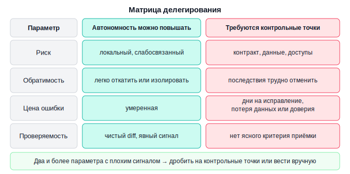
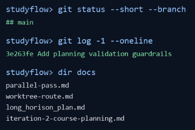
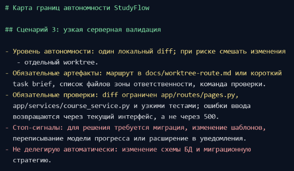
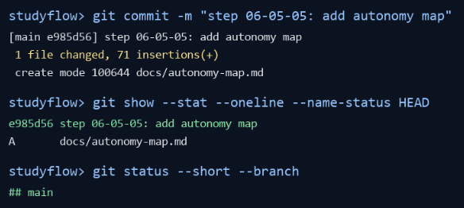

# Урок 5. Границы автономности

_lesson_id: 2289244 · steps: 15 · ttc: 213s_

---

## Шаг 1 (step_id=9817281, text)

Спектр автономности: от ручного режима до длинного автономного прохода

Сколько свободы давать агенту в конкретной задаче — главный вопрос при работе в продвинутом режиме. Ответ почти никогда не «максимум» или «минимум». Между полностью ручной работой и длинным автономным проходом есть несколько промежуточных режимов, и выбор между ними зависит не от доверия к агенту, а от свойств задачи.

Автономность — это диапазон, а не переключатель

Иногда нужен только read-first проход: агент читает, составляет карту, перечисляет риски, но не меняет код. Иногда достаточно одного узкого diff с явными критериями приёмки. Иногда задачу можно вести через автоматизацию и контрольные точки почти без постоянного вмешательства. А иногда цена ошибки такова, что даже сильный агент должен работать в очень тесном контуре — не потому что агент слабый, а потому что задача этого требует.

Уровень автономности задаётся задачей, а не агентом

Высокая автономность оправдана там, где процесс уже стабилизирован: есть команды-контракты, явные контрольные точки, понятная зона ответственности и явные стоп-сигналы. Эта логика работает в современных агентах: проектные инструкции вроде CLAUDE.md, AGENTS.md, rules-файлов или их аналогов фиксируют границы; diff и review показывают, что реально изменилось; команды-контракты дают проверяемый сигнал завершения. Конкретный интерфейс может отличаться, но критерий один: агенту можно дать больше свободы только там, где его маршрут снаружи ограничен и проверяем.

Чем выше автономность, тем важнее внешние опоры

Полностью ручной режим почти не требует специальных артефактов: человек сам двигается шаг за шагом и держит контекст в голове. Но как только вы хотите отдать агенту более длинный кусок работы, внешние структуры становятся обязательными: brief, контрольные точки, контракт автоматизации, передача состояния. Без них автономность превращается не в ускорение, а в потерю прозрачности.

Рабочие режимы на практике

	Read-first: агент читает и картирует без правки — точка входа перед любым рискованным изменением.
	Один локальный diff: узкая задача с понятной приёмкой и коротким стоп-сигналом; такой режим может идти и в IDE, и в CLI, и в облачном агенте.
	Автоматизированный проход: повторяемые этапы через скрипты, команды-контракты и воспроизводимые проверки.
	Параллельные ветки: несколько агентов с непересекающимися зонами и явной зоной ответственности.
	Long-horizon orchestration: серия этапов с контрольными точками, передачей состояния и правилами возврата человека в цикл.

Режим выбирается под свойства задачи — это инженерное решение, а не оценка того, насколько хорош агент.

---

## Шаг 2 (step_id=10069332, text)

Какие сигналы требуют вернуть человека в цикл

Высокая автономность работает, пока ход работы понятен и проверяем. Как только что-то начинает ускользать из-под контроля, нужно включиться — не разбирать аварию, а заметить первые признаки.

Дрейф цели и объёма изменений

Если агент начинает двигаться сразу в несколько сторон, добавляет побочные улучшения, всё больше отклоняется в сторону попутных улучшений и теряет связь с исходной целью — автономность уже завышена для данного момента. Практически это видно по двум признакам: агент затрагивает файлы за пределами явно объявленной зоны задачи, а diff начинает расти несвязанными строками. В редакторе это заметно в панели изменений, в CLI — по списку изменённых файлов и git diff. Это не признак слабого агента: чаще это сигнал, что маршрут пора снова сузить.

Спорные решения и рост необратимости

Когда задача упирается в архитектурный выбор, изменение публичного контракта, миграцию данных, внешние побочные эффекты, секреты, доступы или другие трудно обратимые шаги — агент не должен продолжать по инерции только потому, что до этого шёл хорошо. Чем выше цена ошибки и сложнее откат — тем раньше стоит включиться самому.

Пропадает проверяемость

Иногда задача внешне движется, но вы уже не понимаете, как принять следующий результат. Проверки неустойчивы, код завершения автоматизации не даёт ясного сигнала, diff становится смешанным, передача состояния не отражает реальное состояние. В любом инструменте это проявляется одинаково: рефакторинг перемешан с исправлением логики, а принять результат по частям уже невозможно. Работать автономно имеет смысл только там, где понятно, как принять следующий результат.

Внешние эффекты и безопасность

Любые действия с деплоем, секретами, платными API, удалением данных, изменением инфраструктуры, отправкой сообщений пользователям или модификацией чувствительной среды почти всегда требуют human-in-the-loop. Даже если технический шаг кажется автоматизируемым, стоимость ошибки здесь выше обычной локальной доработки.

Маршрут стал туманным

Если вам трудно в двух-трёх предложениях объяснить, на каком этапе сейчас находится проход, что считается завершением этого этапа и по какому критерию он будет принят — автономность уже слишком велика для текущего состояния задачи. Сначала нужно вернуть ясность маршрута, потом снова расширять свободу агента.

Снижать автономность — это не недоверие к агенту. Это понимание того, сколько стоит ошибка.

---

## Шаг 3 (step_id=10069333, text)

Матрица делегирования: риск, обратимость, цена ошибки и проверяемость

Чтобы выбор уровня автономности не зависел от настроения, полезно иметь простую инженерную матрицу. Она не подменяет мышление, но помогает быстро оценить задачу по четырём параметрам и понять, какой режим работы уместен прямо сейчас.

Первый параметр: риск

Риск отвечает на вопрос: насколько болезненна ошибка в этой задаче? Если изменение локальное и затрагивает слабосвязанный участок — риск относительно низкий. Если речь идёт о публичном контракте, критичном денежном сценарии, безопасности, данных пользователей или инфраструктуре — риск быстро растёт. Высокий риск сам по себе не запрещает использование агента, но требует более плотного контроля.

Второй параметр: обратимость

Даже рискованную задачу иногда можно делегировать дальше, если её легко откатить или изолировать. И наоборот: небольшая с виду правка может требовать жёсткого human-in-the-loop, если последствия сложно отменить. Worktrees, коммиты-контрольные точки и поэтапный выкат повышают обратимость прохода и тем самым дают пространство для более высокой автономности.

Третий параметр: цена ошибки

Цена ошибки не ограничивается кодом. Иногда ошибка не ломает систему, но съедает дни на распутывание последствий, ломает доверие команды или портит данные. Если цена ошибки высока, автономность стоит снижать даже при внешне небольшом объёме изменений.

Четвёртый параметр: проверяемость

Это один из самых практичных параметров. Есть ли у задачи ясный способ принять результат? Хорошая проверяемость обычно складывается из трёх вещей: чистый diff, понятный критерий приёмки в проектных инструкциях или brief и команда-контракт с ясным результатом. Если проверяемость низкая, задача плохо подходит для длинного автономного прохода даже при умеренном риске.

Как читать матрицу

Низкий риск, высокая обратимость и хорошая проверяемость позволяют делегировать больше: локальный diff, блок автоматизации или короткий составной проход. Высокий риск, низкая обратимость и слабая проверяемость тянут задачу к контрольным точкам, read-first и частому возвращению человека в цикл. Если хотя бы два параметра дают плохой сигнал — задачу лучше дробить.

В командах, где агент стал частью рабочего процесса, матрица помогает обсуждать конкретные свойства задачи — а не абстрактный вопрос доверия.

---

## Шаг 4 (step_id=10069334, text)

Персональный набор правил для режима агента

Матрица делегирования становится по-настоящему полезной, когда превращается в ваш собственный рабочий набор правил. Это не формальный документ ради документа, а короткий набор правил, который помогает быстрее принимать решения в реальной инженерной практике: что вы отдаёте агенту охотно, где требуете контрольные точки, а какие зоны оставляете под особенно жёсткий контроль.

Набор правил нужен, чтобы не решать одно и то же заново

Без личного набора правил каждый новый проход приходится оценивать почти с нуля. В момент спешки это ведёт к случайным решениям: сегодня вы даёте агенту слишком много свободы, завтра слишком мало. Набор правил делает подход последовательнее: вместо размытого ощущения риска — конкретные критерии, которые не меняются от задачи к задаче.

Хороший набор правил конкретен и привязан к вашим типовым сценариям

Слишком общий набор правил вроде «важные задачи проверяю сам» мало помогает. Намного полезнее формулировки такого уровня: «внешние интеграции всегда начинай с read-first и integration brief», «миграции данных не начинай без отдельной контрольной точки и rollback-плана», «полировку интерфейса можно делать локальным diff без параллельных веток», «доступы и секреты не делегирй без ручной финальной проверки».

Пример одного правила

Вот как выглядит конкретное правило для работы с внешними интеграциями:

#Внешние интеграции
Начинай с read-first прохода и integration brief. 
Не трогай конфигурацию SDK и переменные среды до тех пор, пока diff по бизнес-логике не принят. 
Финальную проверку учётных данных и конфигурации отдавай пользователю. 

# Стоп-сигнал
агент предлагает изменить конфиг или переменные среды до завершения логического diff.

Такая формулировка сразу отвечает на все ключевые вопросы — какой уровень автономности, какие артефакты обязательны, какой стоп-сигнал — и не зависит от настроения в момент старта задачи.

Что должно быть в наборе правил явно

Полезно явно определить: какие типы задач вы готовы делегировать почти целиком; какие всегда дробите на контрольные точки; какие практики автоматизации, передачи состояния и ревью считаете обязательными; по каким стоп-сигналам автоматически возвращаетесь в цикл; и что нельзя делать без отдельного ручного подтверждения. Эти пять вопросов дают скелет для любого конкретного правила.

Набор правил должен эволюционировать вместе с вашим рабочим процессом

Это не священный текст. По мере роста навыка вы сможете повышать автономность там, где раньше действовали осторожнее. Но и обратное верно: если какой-то тип задач регулярно приносит дорогие ошибки, набор правил стоит ужесточить. Сильный оператор не держится за идею «максимальной автономности», если практика показывает, что цена такой свободы пока слишком велика.

Набор правил нужен, чтобы работа с агентом оставалась инженерной практикой, а не набором ситуативных решений.

---

## Шаг 5 (step_id=10069335, text)

Практика: составьте свою карту границ автономности

Возьмите свой рабочий проект и зафиксируйте, сколько автономности вы готовы давать агенту в повторяющихся сценариях. Результат практики — короткий документ в репозитории, например docs/autonomy-map.md, по которому можно быстро выбрать режим работы: read-first, локальный diff, отдельный worktree, параллельные ветки или составной проход с контрольными точками.

StudyFlow ниже используется как демонстрационный пример. В своём проекте сохраняйте тот же метод: стартовая проверка, привязка к реальным задачам, явные стоп-сигналы и итоговый checkpoint.

Шаг 1. Проверьте стартовую точку

Не начинайте карту с общих рассуждений. Сначала убедитесь, что агент видит фактическое состояние проекта: текущую ветку, последний commit, рабочие документы и ближайшие незакрытые решения. Если рабочее дерево грязное, сначала разберите этот шум, иначе карта смешает уже выполненную работу с будущими намерениями.

git status --short --branch
git log -1 --oneline
ls docs

В демонстрационном StudyFlow стартовая точка перед этим шагом была такой: ветка main, последний commit 3e263fe Add planning validation guardrails, а в docs/ уже лежали артефакты предыдущих проходов: parallel-pass.md, worktree-route.md, long_horison_plan.md, iteration-2-course-planning.md.

Шаг 2. Дайте агенту задачу на карту, а не на новую фичу

Карта автономности не должна запускать очередную разработку. Попросите агента прочитать текущее состояние, выбрать 5–7 повторяющихся сценариев и для каждого сценария указать допустимый режим, обязательные артефакты, проверки, стоп-сигналы и действия, которые не делегируются автоматически.

Для StudyFlow промпт выглядел так:

Ты работаешь в репозитории StudyFlow.

Сначала проверь стартовую точку:
- git status --short --branch
- git log -1 --oneline
- релевантные документы в docs/

Задача: создать docs/autonomy-map.md.

Собери карту границ автономности для текущего проекта. Нужны 5-7
повторяющихся сценариев: документация, read-only исследование,
узкая серверная валидация, ограничения БД и миграции, UI-полировка,
внешние интеграции, long-horizon развитие планирования.

По каждому сценарию зафиксируй:
- допустимый уровень автономности;
- обязательные артефакты;
- проверки перед приёмкой;
- стоп-сигналы;
- что не делегируется автоматически.

Не меняй код приложения. После создания документа покажи diff
и предложи короткий commit.

 

В своём проекте замените список сценариев на ваши настоящие повторяющиеся задачи. Если вы часто работаете с платежами, миграциями, импортами, генерацией отчётов, внутренними админками или аналитическими скриптами — карта должна описывать именно эти сценарии, а не универсальный набор из примера.

Шаг 3. Проверьте, что карта привязана к реальному проекту

После ответа агента не принимайте документ только потому, что он аккуратно оформлен. Пройдитесь по сценариям и уберите всё, что звучит как общая памятка. Хороший сценарий узнаётся по конкретике: какие файлы или слои обычно затрагиваются, какие документы уже используются в проекте, какая проверка доказывает готовность и где агент должен остановиться.

Фрагмент результата для StudyFlow:

Шаг 4. Зафиксируйте карту как checkpoint

Когда карта стала достаточно конкретной, проверьте diff и зафиксируйте документ отдельным commit-ом. Это не обязательно должен быть большой технический commit: здесь важна контрольная точка оператора, к которой можно вернуться перед следующей задачей.

git diff -- docs/autonomy-map.md
git add docs/autonomy-map.md
git commit -m "add autonomy map"

В StudyFlow демонстрационный проход завершился отдельным checkpoint:

e985d56 step 06-05-05: add autonomy map
A    docs/autonomy-map.md

Как принять результат

Сильная карта границ автономности содержит 5–7 сценариев из вашего реального проекта, а не абстрактный список «типов задач». В каждом сценарии должны быть явно названы уровень автономности, обязательные артефакты, проверки перед приёмкой, стоп-сигналы и то, что не делегируется автоматически.

Проверьте карту ещё одним запросом к агенту:

Проверь docs/autonomy-map.md как строгий reviewer.
Найди сценарии, где уровень автономности завышен, стоп-сигналы слишком
расплывчаты или проверки не доказывают готовность результата.
Не редактируй файл сразу: сначала верни замечания списком.

Если после такой проверки вы можете быстро объяснить, почему одну задачу отдаёте агенту локальным diff, другую ведёте через worktree, а третью начинаете только с read-first и ручной контрольной точки, карта готова к использованию.

---

## Шаг 6 (step_id=10069535, choice)

Какой принцип стоит использовать для выбора уровня автономности?

**Тип:** choice (single)

**Варианты:**
-  Сколько агентов доступно команде
- [✓ правильный] Свойства конкретной задачи
-  Насколько уверенно агент пишет комментарии
-  Насколько новая версия модели

**Статус Stepik:** `correct` (score 1.0)

**Мой reasoning:** _В теории явно сказано: уровень автономности задаётся задачей, а не агентом — режим выбирается под свойства задачи (риск, обратимость, цена ошибки, проверяемость), это инженерное решение._

---

## Шаг 7 (step_id=10069531, choice)

Какие опоры нужны, когда вы отдаёте агенту длинный кусок работы?

**Тип:** choice (multiple)

**Варианты:**
- [✓ правильный] Контрольные точки
-  Уверенность агента в ответе
- [✓ правильный] Brief
- [✓ правильный] Контракт автоматизации

**Статус Stepik:** `correct` (score 1.0)

**Мой reasoning:** _Теория прямо перечисляет внешние опоры для длинной работы: brief, контрольные точки, контракт автоматизации, передача состояния. Уверенность агента не упоминается как опора — наоборот, автономность задаётся свойствами задачи, а не агентом._

---

## Шаг 8 (step_id=10069540, matching)

Соотнесите рабочий режим и его смысл

**Тип:** matching

**Колонка А (вопросы):**
- Read-first
- Один локальный diff
- Параллельные ветки
- Long-horizon orchestration

**Колонка Б (варианты, перемешаны):**
- Серия этапов с контрольными точками и передачей состояния
- Узкая правка с коротким стоп-сигналом
- Несколько агентов с непересекающимися зонами
- Агент читает и картирует без правки

**Правильные пары:**
- Read-first → Агент читает и картирует без правки
- Один локальный diff → Узкая правка с коротким стоп-сигналом
- Параллельные ветки → Несколько агентов с непересекающимися зонами
- Long-horizon orchestration → Серия этапов с контрольными точками и передачей состояния

**Статус Stepik:** `correct` (score 1.0)

**Мой reasoning:** _Соответствия взяты напрямую из раздела «Рабочие режимы на практике»: read-first = чтение и картирование без правки, локальный diff = узкая задача со стоп-сигналом, параллельные ветки = агенты с непересекающимися зонами, long-horizon = серия этапов с контрольными точками._

---

## Шаг 9 (step_id=10069533, choice)

Какие сигналы требуют рано вернуть человека в цикл?

**Тип:** choice (multiple)

**Варианты:**
- [✓ правильный] Дрейф цели и объёма задачи
- [✓ правильный] Смешанный diff без ясной приёмки
- [✓ правильный] Спорный архитектурный выбор
-  Длинный brief с явными критериями

**Статус Stepik:** `correct` (score 1.0)

**Мой reasoning:** _Теория явно называет дрейф цели, потерю проверяемости (смешанный diff без ясной приёмки) и спорные/необратимые решения как сигналы вернуть человека в цикл. Длинный brief с явными критериями — наоборот, опора для автономности, а не стоп-сигнал._

---

## Шаг 10 (step_id=10069537, choice)

Почему даже небольшая на вид правка может потребовать human-in-the-loop?

**Тип:** choice (single)

**Варианты:**
-  Потому что иначе нельзя оформить передачу состояния
-  Потому что любая правка обязана идти через migration
-  Потому что агенту нужен только terminal режим
- [✓ правильный] Потому что её последствия трудно откатить

**Статус Stepik:** `correct` (score 1.0)

**Мой reasoning:** _В теории прямо сказано: небольшая с виду правка может требовать жёсткого human-in-the-loop, если последствия сложно отменить — то есть из-за низкой обратимости, а не объёма изменений._

---

## Шаг 11 (step_id=10069536, matching)

Соотнесите параметр матрицы делегирования и вопрос, на который он отвечает

**Тип:** matching

**Колонка А (вопросы):**
- Риск
- Обратимость
- Цена ошибки
- Проверяемость

**Колонка Б (варианты, перемешаны):**
- Насколько дороги последствия за пределами кода: время на распутывание, доверие команды, данные
- Есть ли ясный критерий принять результат, не угадывая
- Насколько легко откатить или изолировать шаг
- Насколько критична область задачи: затронуты ли безопасность, деньги или публичный контракт

**Правильные пары:**
- Риск → Насколько критична область задачи: затронуты ли безопасность, деньги или публичный контракт
- Обратимость → Насколько легко откатить или изолировать шаг
- Цена ошибки → Насколько дороги последствия за пределами кода: время на распутывание, доверие команды, данные
- Проверяемость → Есть ли ясный критерий принять результат, не угадывая

**Статус Stepik:** `correct` (score 1.0)

**Мой reasoning:** _Риск отвечает за болезненность ошибки (контракт, безопасность, деньги), обратимость — за лёгкость отката, цена ошибки — за последствия вне кода (время, доверие, данные), проверяемость — за наличие ясного критерия приёмки._

---

## Шаг 12 (step_id=10069532, choice)

Какие приёмы повышают обратимость прохода?

**Тип:** choice (multiple)

**Варианты:**
- [✓ правильный] Worktrees
- [✓ правильный] Коммиты-контрольные точки
-  Рост числа побочных улучшений
- [✓ правильный] Поэтапный выкат

**Статус Stepik:** `correct` (score 1.0)

**Мой reasoning:** _В теории прямо названы worktrees, коммиты-контрольные точки и поэтапный выкат как приёмы, повышающие обратимость прохода. Рост побочных улучшений — это, наоборот, сигнал дрейфа объёма._

---

## Шаг 13 (step_id=10069534, choice)

Что делать, если хотя бы два параметра матрицы дают плохой сигнал?

**Тип:** choice (single)

**Варианты:**
- [✓ правильный] Дробить задачу на более короткие этапы
-  Передать задачу самому сильному агенту
-  Оставить маршрут как есть и ускорить проход
-  Компенсировать риск большим diff

**Статус Stepik:** `correct` (score 1.0)

**Мой reasoning:** _В теории прямо сказано: «Если хотя бы два параметра дают плохой сигнал — задачу лучше дробить». Это снижает риск и возвращает проверяемость._

---

## Шаг 14 (step_id=10069538, choice)

Зачем нужен персональный набор правил для агента?

**Тип:** choice (single)

**Варианты:**
-  Чтобы убрать контрольные точки и передачу состояния
-  Чтобы заменить инженерные критерии
- [✓ правильный] Чтобы одинаковые задачи не оценивать с нуля
-  Чтобы каждую задачу оценивать по степени риска

**Статус Stepik:** `correct` (score 1.0)

**Мой reasoning:** _В теории прямо сказано: 'Без личного набора правил каждый новый проход приходится оценивать почти с нуля' — набор правил нужен, чтобы не решать одно и то же заново и обеспечить последовательность подхода._

---

## Шаг 15 (step_id=10069539, choice)

Какие пункты нужно фиксировать по каждому сценарию в карте границ автономности?

**Тип:** choice (multiple)

**Варианты:**
- [✓ правильный] Уровень автономности
-  Любимую модель для этого сценария
- [✓ правильный] Стоп-сигналы
- [✓ правильный] Обязательные артефакты и проверки

**Статус Stepik:** `correct` (score 1.0)

**Мой reasoning:** _В теории явно перечислено: по каждому сценарию фиксируются допустимый уровень автономности, обязательные артефакты, проверки перед приёмкой, стоп-сигналы и что не делегируется автоматически. Любимая модель в этот список не входит._

---
