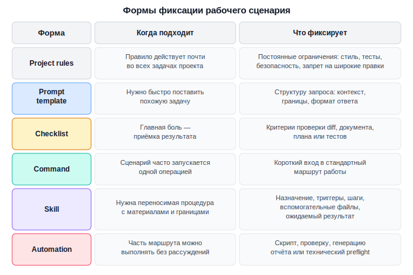
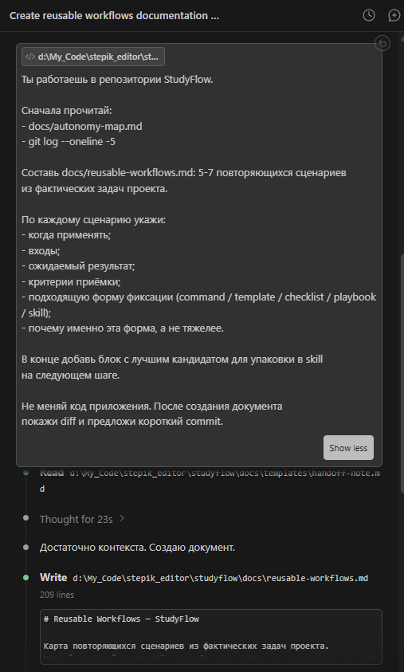
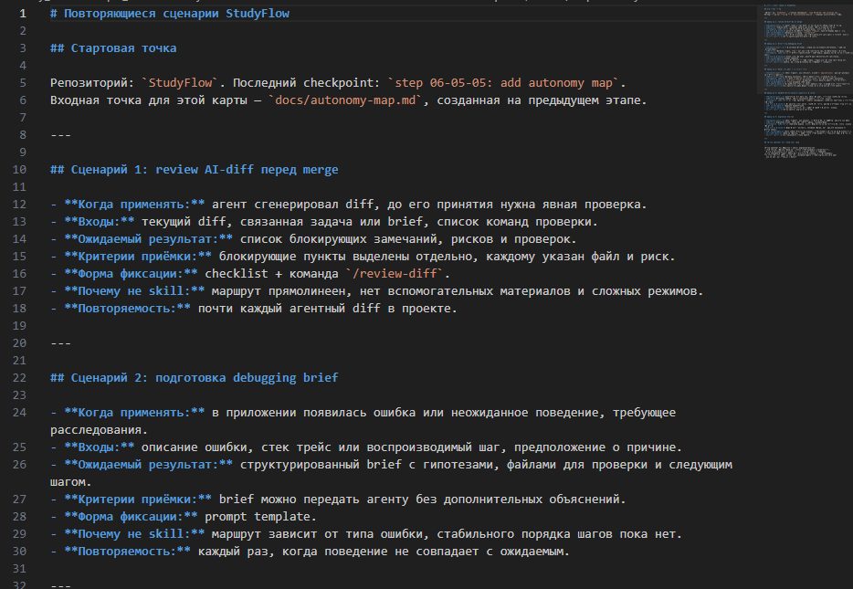
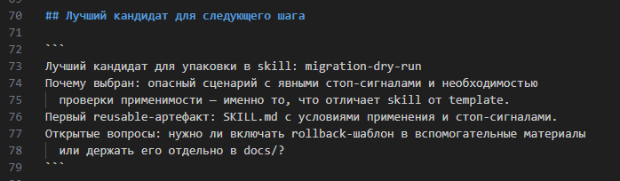

# Урок 1. От разового прохода к reusable workflow

_lesson_id: 2289245 · steps: 14 · ttc: Nones_

---

## Шаг 1 (step_id=9817283, text)

Почему удачный агентный проход часто трудно повторить

Сильный проход с агентом может дать хороший результат: найденную причину бага, аккуратный diff, полезную документацию или понятный план релиза. Но через неделю тот же сценарий часто приходится собирать заново. В чате остались отдельные реплики, часть критериев держалась в голове, а следующий запуск начинается с импровизации.

Проблема в том, что рабочий сценарий не был вынесен наружу. Если маршрут, критерии и стоп-сигналы существуют только внутри одного диалога, в следующей сессии агент их не помнит и они не становятся частью вашей системы разработки.

Возьмём типовой сценарий: агент проверяет diff после своей же реализации. Вы просите его работать в режиме read-only, не выходить за заявленные границы, искать побочные изменения, отделять блокирующие замечания от улучшений и честно отмечать, какие проверки не запускались. Если этот маршрут не сохранить отдельно, следующий review снова начнётся с ручного напоминания тех же правил.

Что обычно теряется после сессии

После успешного прохода легко сохранить итоговый код и потерять способ, которым вы к нему пришли. Особенно часто пропадают три вещи: стартовый контекст, критерии хорошего результата и правила остановки. Без них следующий агентный запуск может решить похожую задачу иначе: шире изменить код, пропустить проверку, смешать исследование с реализацией или принять спорное решение без возврата к человеку.

Например, в debugging-проходе важен не только найденный fix. Важны входные данные: какие логи смотреть, какие гипотезы проверять первыми, где нельзя менять поведение до подтверждения причины, какие тесты должны доказать исправление. Если эти опоры не сохранены, следующий баг снова превращается в ручное управление с нуля.

Повторяемый сценарий сильнее разового промпта

Reusable workflow — это не красивая коллекция промптов, а закреплённый рабочий сценарий: когда его запускать, какие входы дать агенту, какие шаги он должен пройти, какой артефакт вернуть и по каким признакам результат можно принять.

Reusable workflow может быть очень лёгким. Иногда достаточно короткого шаблона запроса. Иногда нужен чеклист приёмки. Иногда полезна команда, которая запускает стандартный маршрут. Для устойчивых повторяемых сценариев современные инструменты предлагают специализированные механизмы — разберём их подробнее в этом модуле. Форма зависит от зрелости сценария, а не от желания всё упаковать одинаково.

Что стоит сохранить сразу после удачного прохода

После сильной агентной сессии полезно зафиксировать не весь чат, а рабочий минимум:

	сценарий: для какого класса задач этот маршрут подходит;
	входы: какие файлы, симптомы, требования или ограничения нужны на старте;
	порядок действий: что агент должен сделать сначала, что после проверки, а где остановиться;
	результат: какой документ, diff, brief, план или список замечаний должен появиться;
	приёмка: какие проверки доказывают, что результат можно использовать.

Этого достаточно, чтобы следующий запуск начинался не с пустого чата, а с уже проверенной рабочей формы.

Мини-шаблон фиксации

Сценарий:
Когда применять:
Что дать агенту на вход:
Что агент делает сначала:
Где агент должен остановиться:
Какой результат должен вернуть:
Как проверить результат:

Если заполнить такой блок после реального прохода, вы уже превращаете удачный опыт в материал для будущего workflow. Дальше можно решить, останется ли он заметкой, станет шаблоном запроса, командой, чеклистом или полноценным skill.

---

## Шаг 2 (step_id=10079715, text)

Какие сценарии стоит упаковывать

Не каждый удачный агентный запуск заслуживает отдельного reusable-артефакта. Разовая исследовательская задача, спорное архитектурное решение или необычная интеграция могут требовать плотного ручного управления. Упаковка нужна там, где сценарий повторяется, имеет узнаваемые входы и даёт проверяемый результат.

Кандидат на упаковку

Хороший кандидат обычно узнаётся по рабочему раздражению: вы уже несколько раз объясняли агенту почти одно и то же, вручную напоминали одинаковые ограничения и каждый раз заново проверяли одни и те же признаки качества. Если сценарий повторяется, но каждый запуск требует восстановления контекста, его стоит вынести в устойчивую форму.

В реальной разработке такими кандидатами часто становятся:

	debugging-проход по логам, воспроизведению и гипотезам;
	review AI-кода перед принятием diff;
	подготовка feature brief перед реализацией;
	документация по существующему модулю;
	dry-run миграции или изменения схемы данных;
	release prep: проверка changelog, тестов и рискованных зон;
	handoff-заметка после длинного агентного прохода.

Общий признак один: результат можно описать заранее и проверить после выполнения.

Сильный и слабый кандидат

Review AI-кода перед merge — сильный кандидат. У него есть узнаваемые входы: diff, исходная задача, проектные правила и команды проверки. Есть понятный результат: список блокирующих замечаний, рисков и пробелов проверки. Есть приёмка: замечания должны ссылаться на конкретные файлы, не смешивать обязательные исправления с улучшениями и честно отмечать, где проверки не запускались.

Улучшить архитектуру проекта — слабый кандидат для упаковки. Формулировка слишком широкая: агенту сначала нужно понять цель изменения, ограничения продукта, допустимый риск и границы вмешательства. Такой сценарий лучше начинать с read-first исследования или feature brief, а не прятать в skill или команду.

Что не стоит упаковывать слишком рано

Слабый кандидат выглядит похоже на рабочий сценарий, но не имеет стабильной формы. Например, «помочь с архитектурой», «улучшить проект», «разобраться в странном поведении» или «сделать код лучше» слишком широки. В таких задачах сначала нужна ручная постановка, read-first проход или отдельный brief, а не reusable-артефакт.

Также не стоит упаковывать сценарий, если его результат нельзя принять без гадания. Команда или skill должны возвращать что-то наблюдаемое: список рисков, diff в узкой зоне, проверенный план, карту файлов, набор тестов, документ с решениями. Если итог описывается только словами «стало понятнее», форма ещё не созрела.

Три вопроса перед упаковкой

Перед созданием шаблона, команды или skill проверьте сценарий тремя вопросами:

	Повторяется ли он? Похожая задача должна встречаться достаточно часто, чтобы не тратить усилия на одноразовую инструкцию.
	Стабилен ли маршрут? Должны быть понятны стартовые входы, последовательность действий и стоп-сигналы.
	Проверяем ли результат? Должен быть явный артефакт и критерии приёмки.

Если хотя бы один ответ слабый, лучше начать с короткой заметки или prompt template. Если все три ответа сильные, сценарий можно развивать дальше: добавить чеклист, оформить команду или описать как специализированный маршрут.

Связь с картой автономности

Карта границ автономности из предыдущего модуля уже содержит хорошие кандидаты. В ней есть повторяющиеся сценарии, допустимый уровень автономности, проверки и стоп-сигналы. Теперь эту карту можно использовать как источник reusable workflows: выбрать один сценарий и решить, какая форма фиксации даст ему больше устойчивости.

---

## Шаг 3 (step_id=10079057, text)

Формы фиксации рабочего сценария

Один и тот же рабочий сценарий можно закрепить на разных уровнях. Не каждый повторяемый сценарий нужно сразу оформлять в тяжёлую инструкцию. Иногда достаточно одного шаблона запроса, а иногда нужен skill с материалами, границами применения и проверкой результата.

Быстрый маршрут выбора

Выбор формы начинается с того, где именно сценарий разваливается. Если каждый раз заново формулируется постановка, нужен prompt template. Если пропускаются критерии приёмки, начните с checklist. Если сценарий часто запускается одной операцией, оформите command. Если маршрут требует условий применения, материалов и стоп-сигналов, проектируйте skill. Если часть работы можно выполнять без рассуждений, вынесите её в automation.

Как выбирать уровень фиксации

Начинайте с самой лёгкой формы, которая делает сценарий повторяемым. Если проблема в том, что вы забываете одинаково поставить задачу, хватит prompt template. Если проблема в слабой приёмке, нужен checklist. Если сценарий часто запускается в Codex, Claude Code, Cursor или другом агенте как отдельное действие, удобнее команда или command-like workflow.

Skill нужен позже: когда сценарий требует собственной процедуры, примеров, reference-файлов, шаблонов или особых стоп-сигналов. Он не должен дублировать AGENTS.md, CLAUDE.md, rules-файлы Cursor или общие правила проекта. Проектные правила отвечают за постоянные ограничения, а skill — за повторяемую работу в конкретном классе задач.

Как это выглядит в инструментах

В Codex постоянные правила обычно находятся в AGENTS.md, skills — в папках .agents/skills или личной директории, а команды и review запускаются из интерфейса или slash-команд. В Claude Code близкую роль играют .claude/skills и команды, которые могут вызывать один и тот же маршрут. В Cursor чаще встречается связка .cursor/rules, сохранённых шаблонов запросов и контекста, добавленного в Agent. Названия разные, но инженерный выбор тот же: постоянное правило, вход в сценарий, процедура и приёмка не должны лежать вперемешку.

Признак неверной формы

Если артефакт приходится читать целиком перед любой задачей, он слишком общий. Если команда запускает слишком широкий промпт и скрывает спорные решения, она опасна. Если checklist заставляет проверять пункты, не связанные с задачей, он будет игнорироваться. Если skill содержит все правила проекта, он превращается во второй общий файл инструкций и создаёт противоречия.

Хорошая форма помогает быстрее запустить конкретный сценарий и легче принять результат. Всё, что не улучшает запуск, выполнение или проверку, лучше оставить за пределами reusable-артефакта.

---

## Шаг 4 (step_id=10079058, text)

Практика: составьте карту повторяющихся сценариев

Возьмите свой рабочий проект и найдите сценарии, которые вы уже несколько раз запускали с агентом и почти наверняка будете запускать снова. Результат практики — короткий документ, например docs/reusable-workflows.md, где для каждого сценария указана подходящая форма фиксации: правило, шаблон запроса, чеклист, команда, skill или автоматизация. В конце документа выберите 1-2 лучших кандидата для следующей упаковки.

StudyFlow ниже используется как демонстрационный пример. В своём проекте сохраняйте тот же метод: начните с реальных рабочих документов, составьте карту по фактическим задачам, явно выберите форму для каждого сценария и зафиксируйте кандидата для следующего шага.

Шаг 1. Соберите кандидатов

Не начинайте с выбора инструмента. Сначала выпишите 5-7 повторяющихся сценариев. Для каждого сценария укажите, что обычно приходит на вход и какой результат должен появиться на выходе.

Сценарий: review AI-кода перед merge
Входы: diff, связанная задача, список изменённых файлов, команды проверки
Результат: список блокирующих замечаний, рисков и проверок
Повторяемость: почти каждый агентный diff

Не берите сценарии, где нет стабильного маршрута или проверяемого результата. Если задача каждый раз требует нового архитектурного решения, оставьте её в зоне ручного управления. Reusable-артефакт должен снижать повторную настройку, а не маскировать неопределённость.

Шаг 2. Подберите форму фиксации

Для каждого сценария выберите самый лёгкий достаточный формат. Не стремитесь сразу создавать skill. Часто первый полезный шаг — это шаблон запроса или чеклист приёмки.

Сценарий: debugging brief
Форма: prompt template + checklist
Почему не skill: маршрут пока зависит от типа бага
Следующий шаг: проверить шаблон на 2-3 реальных ошибках

Шаг 3. Дайте агенту задачу на черновую карту

Можно попросить агента помочь с первичной структурой, но не отдавайте ему выбор полностью. Он может предложить слишком аккуратную, но абстрактную карту. Ваша роль — вернуть её к реальным задачам проекта и проверить, что агент читал только релевантные источники, а не весь репозиторий подряд.

Работаем в моём проекте.

Сначала прочитай только релевантные проектные инструкции и рабочие
документы. Не меняй код. В ответе укажи, на какие источники внутри
проекта ты опирался.

Составь docs/reusable-workflows.md: 5-7 повторяющихся сценариев,
которые стоит закрепить для будущих агентных задач.

По каждому сценарию укажи:
- когда применять;
- входы;
- ожидаемый результат;
- критерии приёмки;
- подходящую форму фиксации;
- почему это не слишком тяжёлая форма.

Если сценарий пока не созрел для упаковки, отметь это явно.

Шаг 4. Выберите кандидата для следующего урока

В конце карты добавьте небольшой блок передачи дальше. Он должен показать, какой сценарий вы будете превращать в контракт skill или оставите в более лёгкой форме.

Лучший кандидат для следующей упаковки:
Почему выбран:
Почему это skill / не skill:
Первый reusable-артефакт:
Что осталось непонятным:

Пример: StudyFlow

В StudyFlow стартовой точкой перед этим шагом была docs/autonomy-map.md из предыдущего модуля — семь сценариев с уровнями автономности. Карта повторяющихся сценариев строилась поверх неё: из тех же сценариев выбирались те, у которых есть стабильный маршрут и проверяемый результат, а для каждого подбиралась лёгкая форма фиксации.

Промпт для создания карты в StudyFlow:

Ты работаешь в репозитории StudyFlow.

Сначала прочитай:
- docs/autonomy-map.md
- git log --oneline -5

Составь docs/reusable-workflows.md: 5-7 повторяющихся сценариев
из фактических задач проекта.

По каждому сценарию укажи:
- когда применять;
- входы;
- ожидаемый результат;
- критерии приёмки;
- подходящую форму фиксации (command / template / checklist / playbook / skill);
- почему именно эта форма, а не тяжелее.

В конце добавь блок с лучшим кандидатом для упаковки в skill
на следующем шаге.

Не меняй код приложения. После создания документа
покажи diff и предложи короткий commit.

Агент прочитал docs/autonomy-map.md и создал docs/reusable-workflows.md с пятью сценариями: review AI-diff, debugging brief, узкая итерация в сервисном слое, handoff-заметка и migration dry-run. Для четырёх сценариев подобрана лёгкая форма (checklist, template, playbook), для пятого — skill, потому что сценарий опасный и требует явных стоп-сигналов.

Как лучшего кандидата, агент предложил migration-dry-run.

Как принять результат

Карта готова, если по каждому сценарию можно быстро понять три вещи: когда его запускать, что должен вернуть агент и как проверить результат. Хорошая карта не обязана быть большой. Достаточно 3-5 сильных сценариев, которые вы действительно будете использовать, и одного явно выбранного кандидата для продолжения в следующем уроке.

---

## Шаг 5 (step_id=10079059, choice)

Что чаще всего делает удачный агентный проход неповторяемым?

**Тип:** choice (single)

**Варианты:**
- ○ Использование одной модели весь день
- ✓ Процесс остался в чате
- ○ Наличие отдельного commit
- ○ Слишком короткий diff без пояснений

---

## Шаг 6 (step_id=10079714, choice)

Какие признаки говорят, что сценарий стоит упаковать?

**Тип:** choice (multiple)

**Варианты:**
- ✓ Его каждый раз нужно объяснять заново
- ✓ Он повторяется в похожих задачах
- ✓ У него есть проверяемый результат
- ○ Он требует нового архитектурного решения

---

## Шаг 7 (step_id=10080999, matching)

Соотнесите форму фиксации и её роль

**Тип:** matching

**Правильные пары:**
- Prompt template → Стабилизирует постановку похожей задачи
- Checklist → Помогает принять результат по критериям
- Command → Запускает стандартный маршрут коротким входом
- Skill → Описывает переносимую процедуру с границами

---

## Шаг 8 (step_id=10079716, choice)

Что лучше выбрать для редкой спорной задачи без стабильного маршрута?

**Тип:** choice (single)

**Варианты:**
- ○ Сразу оформить отдельный skill
- ✓ Разовый запрос с контролем
- ○ Скрыть решение внутри команды
- ○ Добавить правило для всех задач проекта

---

## Шаг 9 (step_id=10079717, choice)

Что нужно сохранить после сильной агентной сессии?

**Тип:** choice (multiple)

**Варианты:**
- ✓ Входы и порядок действий
- ✓ Критерии приёмки результата
- ✓ Сценарий и условия применения
- ○ Всю историю чата без отбора

---

## Шаг 10 (step_id=10079718, choice)

Агент каждый раз делает review diff по-разному: то забывает тесты, то смешивает блокирующие замечания с улучшениями. Что лучше упаковать первым?

**Тип:** choice (single)

**Варианты:**
- ✓ Checklist приёмки diff
- ○ Автоматический merge изменений
- ○ Правило для всех будущих задач
- ○ Большой skill на всю разработку

---

## Шаг 11 (step_id=10079719, choice)

Какой вопрос лучше всего проверяет зрелость сценария?

**Тип:** choice (single)

**Варианты:**
- ✓ Проверяем ли его результат?
- ○ Можно ли дать ему красивое название?
- ○ Подходит ли он для любой кодовой базы?
- ○ Удобно ли оформить длинный документ?

---

## Шаг 12 (step_id=10079720, choice)

Какие сценарии обычно подходят для reusable workflow?

**Тип:** choice (multiple)

**Варианты:**
- ✓ Release prep с проверками
- ✓ Review AI-кода перед merge
- ✓ Подготовка feature brief
- ○ Разовый выбор архитектуры продукта

---

## Шаг 13 (step_id=10079721, choice)

Почему project rules не стоит заменять skill-ом?

**Тип:** choice (single)

**Варианты:**
- ○ Rules нужны только для дизайна интерфейса
- ✓ Rules фиксируют постоянные ограничения
- ○ Skill обязан содержать все правила проекта
- ○ Skill всегда выполняется быстрее rules

---

## Шаг 14 (step_id=10079722, choice)

Что должно быть в карте повторяющихся сценариев?

**Тип:** choice (multiple)

**Варианты:**
- ✓ Когда применять сценарий
- ○ Рейтинг всех доступных моделей
- ✓ Подходящая форма фиксации
- ✓ Ожидаемый результат

---
