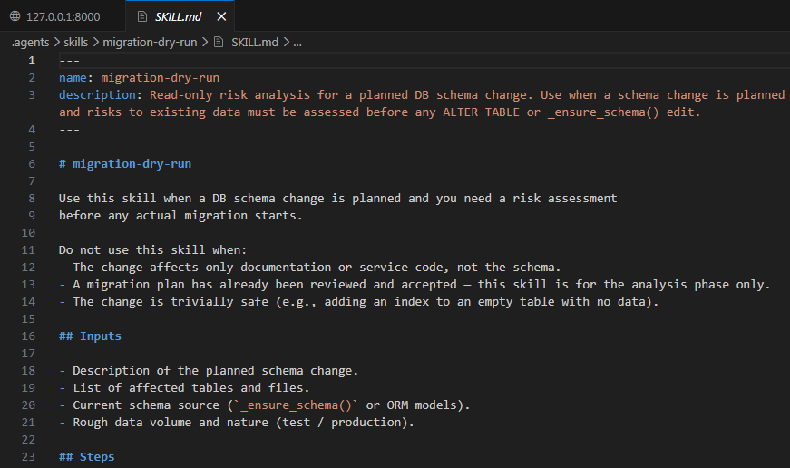
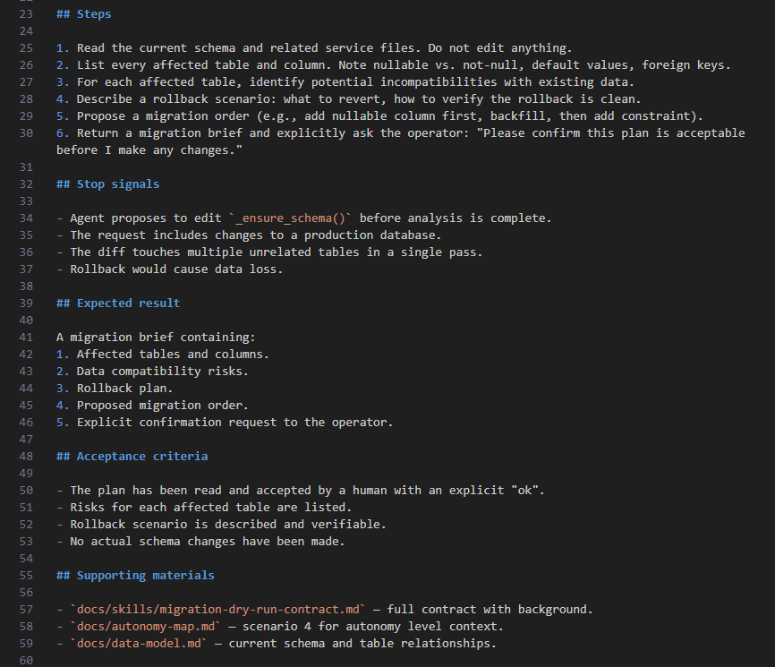

# Урок 2. Skills: переносимый навык агента

_lesson_id: 2289246 · steps: 14 · ttc: Nones_

---

## Шаг 1 (step_id=10080614, text)

Skill: что это и как устроено в инструментах

В прошлом уроке мы разобрали спектр форм фиксации рабочих сценариев — от prompt template до automation. Skill стоит в этом спектре ближе к тяжёлому концу, и это не случайно: он решает задачу, с которой шаблон или чеклист не справятся.

Skill — это файл-инструкция с упакованным маршрутом для повторяемого класса задач. Он говорит агенту, для какого класса задач подходит, когда именно применяется, какие входы запросить, по каким шагам идти, что вернуть и где остановиться. Skill не делает модель «умнее» — он снижает количество повторной настройки между запусками одного и того же сценария.

Это не метафора и не условный термин курса. Skill реализован как конкретный механизм в современных coding-инструментах, хотя называется по-разному и устроен немного иначе в каждом из них.

Skill в Claude Code

В Claude Code skill — это папка в директории .claude/skills/ с файлом SKILL.md внутри: .claude/skills/<name>/SKILL.md. Когда вы вводите слэш-команду /имя-skill, агент загружает этот файл и следует описанному в нём маршруту.

/review-ai-diff

Skills могут быть проектными — тогда они лежат в директории .claude/skills/ внутри репозитория — или персональными, если хранятся в глобальной директории профиля. Проектный skill доступен всем, кто работает с этим репозиторием. Персональный — только вам, но переносится между проектами.

Skill-файл не заменяет CLAUDE.md и проектные правила. Постоянные ограничения — какие директории не трогать, как запускать тесты, какой стиль кода принят — остаются в CLAUDE.md. Skill описывает процедуру для одного конкретного класса задач.

Как та же идея устроена в других инструментах

В Codex skill — папка в .agents/skills/ с файлом SKILL.md внутри. Можно хранить на уровне репозитория или в личной среде агента. Вызов явный — через $имя-skill — или автоматический, если агент сам подбирает подходящий skill по описанию задачи. Структура содержимого похожа на Claude Code: назначение, условия применения, шаги, ожидаемый результат.

В OpenCode — open-source терминальном агенте — skills поддерживаются напрямую. Папка .opencode/skills/<name>/SKILL.md в репозитории или ~/.config/opencode/skills/ для персональных. Агент обращается к ним через встроенный инструмент: читает список, подбирает по описанию и загружает содержимое. OpenCode также сканирует .claude/skills/ и .agents/skills/, поэтому skill, написанный для Claude Code, нередко работает без изменений.

В Cursor встроенного механизма skill нет. Ближайший аналог — conditional rules: файлы в .cursor/rules/ с параметром alwaysApply: false, которые загружаются агентом только при совпадении контекста или явном упоминании @имя-правила в Agent. Если нужен полноценный skill-подход в Cursor, его придётся собирать из одной части: conditional rule описывает процедуру, а вызов — через @имя в чате.

Ни один из инструментов не использует слово «skill» одинаково, но все реализуют одну идею: упакованная процедура для конкретного класса задач хранится отдельно и не требует каждый раз ручного объяснения агенту.

Что входит в skill

Хороший skill отвечает на несколько практических вопросов:

	для чего он нужен: какой класс задач закрывает;
	когда его применять: какие триггеры указывают на подходящий сценарий;
	что нужно на входе: файлы, diff, issue, логи, требования или ограничения;
	как действовать: порядок шагов и точки проверки;
	что вернуть: документ, список замечаний, план, diff или другой артефакт;
	где остановиться: стоп-сигналы и решения, которые нельзя принимать автоматически.

Если skill не отвечает на эти вопросы, он превращается в длинную просьбу «работай хорошо». Такая инструкция может выглядеть подробно, но не даёт агенту устойчивого маршрута.

Skill должен быть применим без длинного вступления

Проверка простая: если перед каждым использованием вам всё равно приходится объяснять агенту почти весь порядок действий, skill ещё не выполняет свою работу. Он должен быть достаточно конкретным, чтобы агент мог применить его по короткой постановке задачи, но не настолько широким, чтобы под него подходило всё подряд.

Готовые skill-коллекции

Skills можно не только писать самостоятельно — существуют публичные коллекции с готовыми навыками для типичных задач. Например,  softaworks/agent-toolkit содержит 40+ skills для документации, тестирования, планирования и интеграций с внешними сервисами. Работает с Claude Code, Codex и Cursor. Устанавливается одной командой:

npx skills add softaworks/agent-toolkit

Готовые skills из таких коллекций удобно брать за основу и адаптировать под проект. Это быстрее, чем писать с нуля, и помогает понять, как устроены хорошие skill-файлы на практике.

---

## Шаг 2 (step_id=10080615, text)

Когда skill уместен, а когда нет

Skill имеет смысл только там, где процедура уже достаточно стабильна. Если сценарий каждый раз требует нового решения, skill начнёт скрывать неопределённость. Если сценарий слишком простой, skill добавит лишний слой вместо ускорения.

Когда сценарий подходит для skill

Повторяемость. Вы запускаете похожую работу достаточно часто: review AI-кода, подготовку debugging brief, документацию по модулю, migration dry-run, handoff после длинного прохода.

Стабильность процедуры. Порядок действий можно описать без постоянных исключений. Агент должен понимать, что делать сначала, какие материалы читать и где ждать решения человека.

Проверяемый результат. На выходе есть артефакт, который можно принять или отклонить: список замечаний, brief, план миграции, карта файлов, checklist, patch в узкой зоне.

Полезные материалы. Skill выигрывает, если к нему можно приложить шаблоны, короткие примеры, reference-файлы, scripts или assets. Если дополнительных знаний нет, возможно, хватит команды или prompt template.

Практический фильтр выбора

Если повторяется только постановка задачи, оставьте prompt template. Если повторяется приёмка результата, начните с checklist. Если сценарий запускается короткой фразой и не требует собственной процедуры, подойдёт command-like workflow. Если часть маршрута механическая и проверяемая, например сбор списка файлов или preflight, её можно вынести в hook или script.

Skill нужен, когда агент должен сам пройти несколько шагов внутри класса задач. Но спорное решение не должно прятаться в skill: архитектурный выбор, публичный API, миграция данных, безопасность, конфиденциальность или биллинг должны возвращаться человеку как стоп-сигнал.

Широкий skill не работает

Формулировка вроде «помогай с backend-разработкой» слишком широка. Под неё попадают review, фичи, тесты, миграции, отладка и документация. Такой skill начнёт конфликтовать с проектными правилами и разовой постановкой задачи.

Сильнее работает узкое название: review-ai-diff, prepare-debugging-brief, migration-dry-run, module-docs-from-source. По названию должно быть понятно, какой результат ожидается.

Skill не повышает автономность автоматически

Skill может сделать агентный проход устойчивее, но не отменяет карту автономности. Если сценарий рискованный, skill должен раньше возвращать человека в цикл: перед изменением схемы данных, перед публичным API, перед удалением кода, перед изменением безопасности или биллинга. Хороший skill не только запускает работу, но и ограничивает её.

---

## Шаг 3 (step_id=10080616, text)

Skill, rules, hooks, команды и шаблоны

Skill работает в системе других инструкций. Если смешать все уровни в один файл, агент получит много текста и мало маршрута. Поэтому важно понимать, где skill дополняет проектные правила, а где начинает их дублировать.

Постоянные правила остаются в project rules

AGENTS.md, CLAUDE.md, Cursor rules и похожие файлы нужны для ограничений, которые действуют почти всегда: как запускать тесты, какие директории не трогать, какой стиль кода принят, какие команды использовать, где лежат материалы курса или проекта.

Skill не должен повторять эти правила целиком. Если в проекте уже сказано «не менять соседние модули без запроса», skill для review AI-кода может ссылаться на это ограничение, но не обязан переписывать весь набор проектных инструкций.

Шаблон запроса задаёт вход, skill задаёт процедуру

Prompt template помогает быстро поставить похожую задачу: указать контекст, границы, ожидаемый формат ответа. Но он обычно не содержит отдельной процедуры, вспомогательных материалов и критериев применимости.

Skill нужен, когда агент должен самостоятельно провести маршрут внутри класса задач. Например, не просто «проверь diff», а «определи границы, раздели замечания по severity, проверь тестовый сигнал, найди скрытые побочные изменения, верни блокирующие пункты отдельно от улучшений».

Команда запускает, skill направляет

Команда удобна как короткий вход: /review-diff, /debug-brief, /handoff-note. Но если за командой стоит сложный порядок работы, эту процедуру лучше не прятать в одном большом промпте. Команда может вызывать skill или ссылаться на него, а skill описывает, как именно выполнять сценарий.

Hook выполняет действие, skill задаёт рабочий маршрут

Hook или автоматическое действие подходят для технических реакций: запустить форматирование, проверить файл, собрать отчёт, выполнить preflight. Skill не должен заменять automation. Если часть процедуры можно надёжно выполнить скриптом, лучше оставить её скрипту, а skill пусть объясняет, когда этот скрипт использовать и как интерпретировать результат.

Граница между уровнями

Один вопрос помогает не смешивать уровни: действует ли это ограничение всегда или только внутри конкретного сценария? Если всегда — место в project rules. Если только в конкретном сценарии — кандидат для skill, шаблона, команды или checklist.

---

## Шаг 4 (step_id=10080617, text)

Практика: опишите контракт будущего skill

Выберите один сценарий из карты, которую вы составили в прошлом уроке, и опишите его как будущий skill. На этом шаге не нужно сразу писать финальный файл навыка. Сначала нужен контракт: зачем skill существует, когда он применяется, какие входы нужны агенту, что он должен вернуть и где обязан остановиться.

Сохраните контракт в понятном месте: например, в конце docs/reusable-workflows.md или отдельным файлом docs/skills/<skill-name>-contract.md. В следующем уроке этот контракт станет входом для первого SKILL.md.

Шаг 1. Выберите узкий сценарий

Подходящий размер — один повторяемый результат. Не берите «улучшение проекта» или «работу с backend». Возьмите сценарий вроде review-ai-diff, prepare-debugging-brief, migration-dry-run, release-prep-note или module-docs-from-source.

Шаг 2. Заполните контракт

Название skill:
Назначение:
Когда применять:
Когда не применять:
Входы:
Ожидаемый результат:
Основные шаги:
Стоп-сигналы:
Вспомогательные материалы:
Критерии приёмки:

Если какое-то поле заполняется расплывчато, это хороший сигнал. Возможно, сценарий пока стоит оставить prompt template или checklist, а не превращать в skill.

Шаг 3. Проверьте границы

Отдельно проверьте, не дублирует ли будущий skill постоянные правила проекта. Например, команда запуска тестов, правила кодстайла и запрет на широкие правки должны оставаться в project rules, если они действуют во всех задачах. В skill стоит оставить только то, что важно для выбранного сценария.

Шаг 4. Попросите агента выступить ревьюером контракта

Проверь контракт будущего skill как строгий reviewer.

Найди:
- слишком широкий триггер применения;
- дублирование project rules;
- скрытую автоматизацию спорных решений;
- слабые критерии приёмки;
- стоп-сигналы, которые стоит сделать явнее.

Не переписывай контракт сразу. Верни замечания списком и предложи,
какие поля нужно уточнить.

Шаг 5. Обновите контракт и оставьте передачу в 07-03

После review внесите минимальные правки в контракт. Затем добавьте короткий handoff-блок, чтобы в следующем уроке не начинать заново.

Сценарий для SKILL.md:
Входы, которые должны быть доступны агенту:
Ожидаемый результат:
Стоп-сигналы:
Материал, который возможно понадобится:
Открытые сомнения перед реализацией:

Пример: StudyFlow

В StudyFlow кандидатом для skill стал сценарий migration-dry-run: любая ошибка в схеме БД может потребовать ручного восстановления данных — именно поэтому здесь нужна отдельная процедура, а не просто prompt template.

Промпт для создания контракта в StudyFlow:

Ты работаешь в репозитории StudyFlow.

Прочитай:
- docs/reusable-workflows.md (сценарий migration-dry-run)
- docs/autonomy-map.md (сценарий 4)
- docs/data-model.md

Задача: создать docs/skills/migration-dry-run-contract.md —
контракт будущего skill.

Заполни поля:
- Название skill
- Назначение
- Когда применять / когда не применять
- Входы
- Ожидаемый результат
- Основные шаги
- Стоп-сигналы
- Вспомогательные материалы
- Критерии приёмки
- Открытые сомнения

Не меняй код и схему БД. Только документ.

После проверки контракта агентом как ревьюером нашлось одно слабое место: стоп-сигнал «diff затрагивает несколько несвязанных таблиц» был расплывчатым. После уточнения он стал «diff затрагивает несколько несвязанных таблиц одновременно».

Как принять результат

Контракт готов, если по нему можно понять, почему этот сценарий достоин skill, какие материалы понадобятся, что агент вернёт после применения и где он не должен продолжать без человека. Важно, чтобы контракт был не только заполнен, но и отревьюен: слабые триггеры, лишние project rules и размытые критерии приёмки должны быть исправлены до перехода к следующему уроку.

---

## Шаг 5 (step_id=10080618, choice)

У вас есть review diff: агент должен определить границы изменения, найти побочные правки, разделить замечания по важности и вернуть стоп-сигналы. Какая форма подходит лучше всего?

**Тип:** choice (single)

**Варианты:**
-  Короткая заметка в чате
-  Автоматический merge результата
- [✓ правильный] Skill для review AI-diff
-  Замена всех project rules

**Статус Stepik:** `correct` (score 1.0)

**Мой reasoning:** _Сценарий повторяемый, требует прохода по нескольким шагам (границы → побочные правки → severity → стоп-сигналы) и возвращает проверяемый артефакт — это ровно то, для чего нужен skill, а не правила, automation или разовая заметка._

---

## Шаг 6 (step_id=10080619, choice)

Когда сценарий хорошо подходит для skill?

**Тип:** choice (multiple)

**Варианты:**
- [✓ правильный] Маршрут достаточно стабилен
- [✓ правильный] Он часто повторяется
-  Решение каждый раз уникально
- [✓ правильный] Результат можно проверить

**Статус Stepik:** `correct` (score 1.0)

**Мой reasoning:** _Skill уместен при повторяемости, стабильности процедуры и проверяемом артефакте. Уникальное каждый раз решение наоборот скрывает неопределённость и не подходит для skill._

---

## Шаг 7 (step_id=10080620, matching)

Соотнесите артефакт и его основную роль

**Тип:** matching

**Колонка А (вопросы):**
- Project rules
- Prompt template
- Command
- Skill

**Колонка Б (варианты, перемешаны):**
- Быстрая постановка похожей задачи
- Процедура для класса задач
- Короткий вход в стандартный маршрут
- Постоянные ограничения проекта

**Правильные пары:**
- Project rules → Постоянные ограничения проекта
- Prompt template → Быстрая постановка похожей задачи
- Command → Короткий вход в стандартный маршрут
- Skill → Процедура для класса задач

**Статус Stepik:** `correct` (score 1.0)

**Мой reasoning:** _Из теории: project rules держат постоянные ограничения, prompt template задаёт вход для похожей задачи, команда — короткий запуск маршрута, skill — упакованная процедура для класса задач._

---

## Шаг 8 (step_id=10080621, choice)

Почему не стоит делать skill для спорного архитектурного выбора?

**Тип:** choice (multiple)

**Варианты:**
- [✓ правильный] Решение принимает человек
- [✓ правильный] Skill скрывает спорное решение внутри автоматизации
-  Skill не умеет читать файлы
-  Skill запрещён в IDE

**Статус Stepik:** `correct` (score 1.0)

**Мой reasoning:** _В теории прямо сказано: спорные решения (архитектура, публичный API, миграция данных, безопасность) не должны прятаться в skill — они должны возвращаться человеку как стоп-сигнал._

---

## Шаг 9 (step_id=10080622, choice)

Что стоит описать в контракте будущего skill?

**Тип:** choice (multiple)

**Варианты:**
- [✓ правильный] Входы и ожидаемый результат
-  Личные предпочтения по теме IDE
- [✓ правильный] Стоп-сигналы
- [✓ правильный] Назначение и триггеры

**Статус Stepik:** `correct` (score 1.0)

**Мой reasoning:** _Контракт описывает зачем skill, когда применяется, какие входы и результат, и где остановиться. Личные предпочтения по IDE не относятся к контракту скилла._

---

## Шаг 10 (step_id=10080623, choice)

Где лучше хранить постоянную команду запуска тестов проекта?

**Тип:** choice (single)

**Варианты:**
-  В каждом будущем prompt
- [✓ правильный] В project rules
-  В случайной handoff-заметке
-  В названии skill

**Статус Stepik:** `correct` (score 1.0)

**Мой reasoning:** _Команда запуска тестов — постоянное правило, действующее во всех задачах, а такие ограничения по теории урока живут в project rules (CLAUDE.md/AGENTS.md), а не в skill, prompt или заметке._

---

## Шаг 11 (step_id=10080624, matching)

Соотнесите часть контракта и вопрос

**Тип:** matching

**Колонка А (вопросы):**
- Назначение
- Триггеры
- Входы
- Стоп-сигналы

**Колонка Б (варианты, перемешаны):**
- Где агент должен остановиться
- Когда его применять
- Что дать агенту перед запуском
- Какую работу закрывает skill

**Правильные пары:**
- Назначение → Какую работу закрывает skill
- Триггеры → Когда его применять
- Входы → Что дать агенту перед запуском
- Стоп-сигналы → Где агент должен остановиться

**Статус Stepik:** `correct` (score 1.0)

**Мой reasoning:** _Из теории: назначение = какой класс задач закрывает; триггеры = когда применять; входы = что нужно подать агенту перед запуском; стоп-сигналы = где остановиться._

---

## Шаг 12 (step_id=10080625, choice)

Что лучше сделать перед написанием финального skill?

**Тип:** choice (single)

**Варианты:**
-  Сразу добавить много reference-файлов
-  Сделать skill максимально общим
- [✓ правильный] Описать контракт skill
-  Скопировать весь чат в инструкцию

**Статус Stepik:** `correct` (score 1.0)

**Мой reasoning:** _В теории прямо сказано: на шаге практики сначала нужен контракт (зачем, когда, входы, результат, стоп-сигналы), а не финальный файл. Контракт из этого урока становится входом для SKILL.md в следующем._

---

## Шаг 13 (step_id=10080626, choice)

Какие задачи skill может выполнять без опасного расширения автономности?

**Тип:** choice (multiple)

**Варианты:**
- [✓ правильный] Собирать handoff-заметку
-  Сам решать спорную миграцию
- [✓ правильный] Проверять AI-diff по критериям
- [✓ правильный] Готовить debugging brief

**Статус Stepik:** `correct` (score 1.0)

**Мой reasoning:** _Skill уместен для повторяемых процедур с проверяемым результатом — handoff, debugging brief, review AI-diff. Спорные решения вроде миграции должны возвращаться человеку как стоп-сигнал, а не приниматься skill автоматически._

---

## Шаг 14 (step_id=10080627, choice)

Агент применяет skill к слишком широкому запросу «улучши backend». Что нужно исправить?

**Тип:** choice (single)

**Варианты:**
-  Скопировать project rules
- [✓ правильный] Сузить триггеры skill
-  Добавить больше материалов
-  Удалить все стоп-сигналы

**Статус Stepik:** `correct` (score 1.0)

**Мой reasoning:** _В теории прямо сказано: широкий skill вроде «помогай с backend-разработкой» не работает, нужно узкое название и понятные триггеры применения, чтобы под skill не попадало всё подряд._

---
