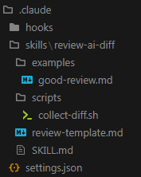
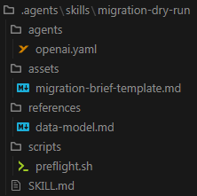
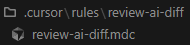
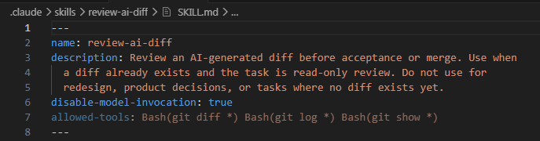
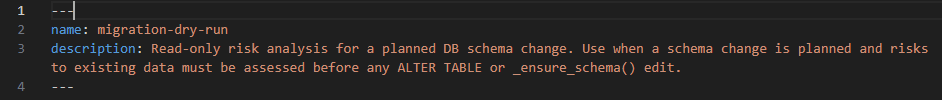
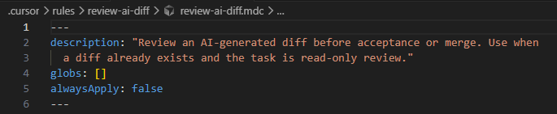
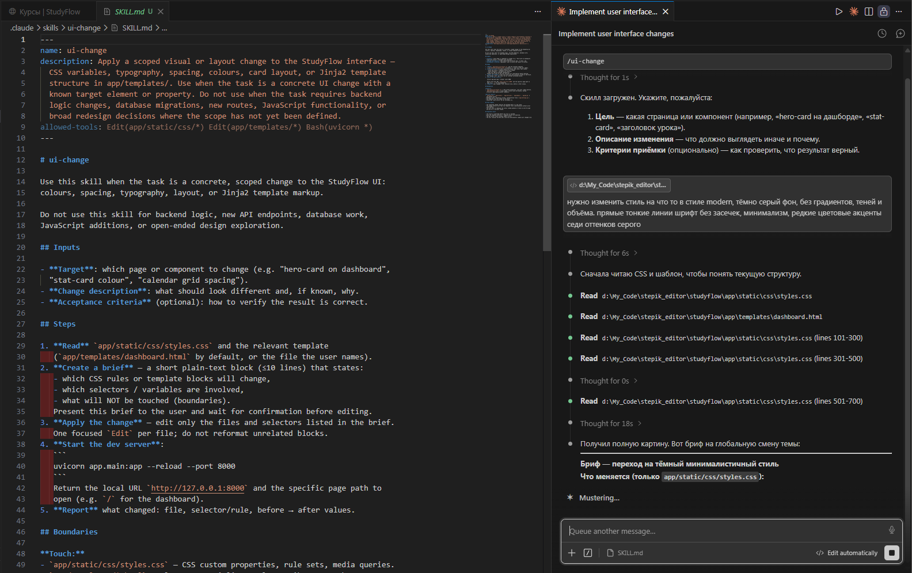
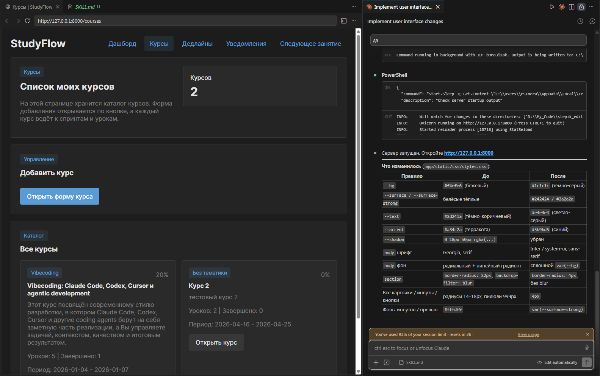
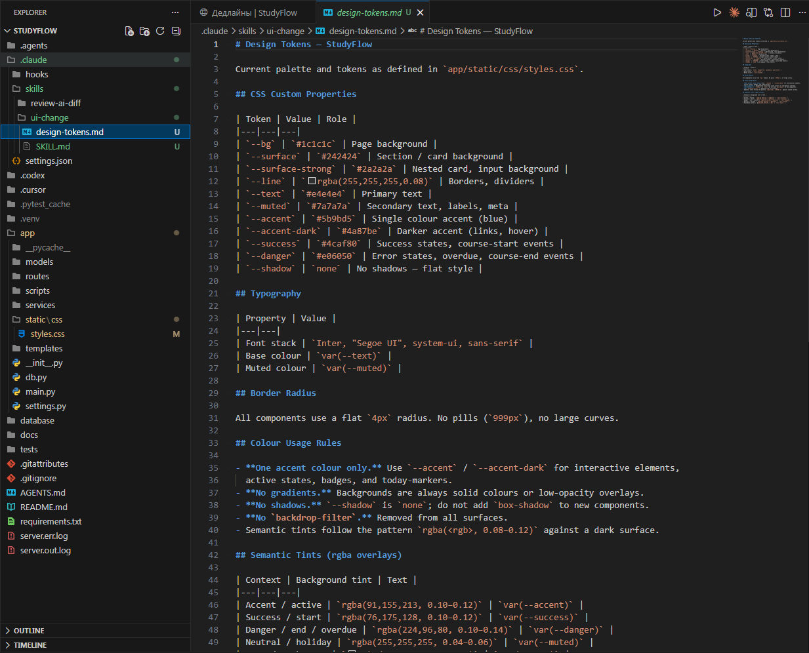

# Урок 3. Проектирование и проверка skill

_lesson_id: 2289247 · steps: 14 · ttc: Nones_

---

## Шаг 1 (step_id=9817285, text)

Файловая организация skill

Каждый инструмент хранит skills в конкретной папке и обнаруживает их автоматически — без ручной регистрации. Папка skill содержит главный файл инструкций и, при необходимости, дополнительные материалы: шаблоны результатов, примеры, справочники, скрипты. Агент обращается к ним только когда SKILL.md явно на них ссылается — они не загружаются при каждом вызове и не занимают контекст без необходимости.

Claude Code

Skills хранятся в .claude/skills/ внутри проекта или в ~/.claude/skills/ для личных навыков, доступных во всех проектах. Каждый skill — отдельная папка с обязательным файлом SKILL.md.

Есть четыре уровня: enterprise (управляемые настройки организации), личный (~/.claude/skills/), проектный (.claude/skills/) и plugin. Если одноимённый skill есть на нескольких уровнях, enterprise перекрывает личный, а личный — проектный.

Старый формат .claude/commands/name.md продолжает работать. Skills — рекомендованный способ: они поддерживают вспомогательные файлы и расширенный frontmatter.

Рядом с SKILL.md можно разместить произвольные файлы. Рекомендуемая структура:

.claude/skills/
└── review-ai-diff/
    ├── SKILL.md               ← обязательный
    ├── review-template.md     ← шаблон финального результата
    ├── examples/
    │   └── good-review.md     ← пример качественного результата
    └── scripts/
        └── collect-diff.sh    ← скрипт сбора данных

В тексте SKILL.md работает синтаксис динамической инъекции: команда в обратных кавычках с восклицательным знаком выполняется до того, как агент получит текст skill, и её вывод подставляется на место.

## Context
Current diff: !`git diff --staged`
Branch: !`git rev-parse --abbrev-ref HEAD`
Open issues: !`gh issue list --limit 5`

Агент видит уже подставленные данные, а не команду. Это позволяет передавать актуальный контекст — состояние ветки, список файлов, вывод тестов — без ручного копирования перед каждым вызовом.

Codex

Codex ищет skills в четырёх местах. Приоритет повышается по мере приближения к рабочей директории.

	
		
			Область
			Путь
		
		
			Системный
			/etc/codex/skills/<name>/
		
		
			Пользователь
			$HOME/.agents/skills/<name>/
		
		
			Корень репозитория
			$REPO_ROOT/.agents/skills/<name>/
		
		
			Рабочая директория
			.agents/skills/<name>/
		
	

Skill из рабочей директории перекрывает одноимённый skill пользовательского уровня. Codex различает четыре типа поддиректорий внутри папки skill:

.agents/skills/
└── prepare-debug-brief/
    ├── SKILL.md               ← обязательный
    ├── scripts/               ← исполняемые скрипты
    ├── references/            ← справочные материалы
    ├── assets/                ← шаблоны и статические файлы
    └── agents/
        └── openai.yaml        ← UI-метаданные и зависимости

	scripts/ — для операций с детерминированным поведением: preflight-проверки, сбор данных о состоянии репозитория, валидация перед миграцией. Документация Codex рекомендует предпочитать инструкции скриптам — скрипт нужен только тогда, когда поведение должно быть предсказуемым или задействованы внешние инструменты.
	references/ — справочная документация, API-схемы, правила предметной области. Загружается по явному указанию из SKILL.md, а не автоматически.
	assets/ — статические файлы: шаблоны результатов, иконки для UI, примеры.
	agents/openai.yaml — конфигурация интерфейса и зависимостей skill: display name, иконка, политика вызова, MCP-инструменты.

Cursor

Правила Cursor хранятся в .cursor/rules/. Начиная с версии 2.2, каждое правило — отдельная папка с файлом .mdc или .md внутри. Более ранний формат плоских файлов .cursor/rules/name.mdc по-прежнему работает.

.cursor/rules/
└── handoff-note/
    └── handoff-note.mdc  ← правило

Cursor поддерживает только проектный уровень — правила не синхронизируются между репозиториями автоматически.

Cursor не имеет выделенных поддиректорий для вспомогательных файлов. Вместо этого правило ссылается на файлы репозитория через синтаксис @filename прямо в тексте:

При создании API-эндпоинта следуй схеме из @src/api/schema.ts
и примерам из @docs/api-examples.md

Cursor включает содержимое указанных файлов в контекст при активации правила. Ссылаться можно на любой файл репозитория — документацию, схему, шаблон или пример. Скриптовый запуск или динамическая инъекция команд на уровне правил не поддерживаются.

Когда добавлять вспомогательный файл

Вспомогательный материал нужен, если без него агент стабильно возвращает результат хуже: пропускает нужный формат или не учитывает domain-специфику. Для первого skill достаточно одного файла — например, шаблона результата. Добавлять references/, examples/ и scripts/ одновременно только потому, что инструмент их поддерживает, не имеет смысла.

---

## Шаг 2 (step_id=10079734, text)

Frontmatter SKILL.md

Frontmatter — YAML-блок между маркерами --- в начале SKILL.md. Он управляет тем, когда и как агент применяет skill: условиями автоматической активации, допустимыми инструментами, режимом выполнения. Набор полей сильно различается между инструментами.

Claude Code

У Claude Code самый богатый набор полей. Ключевые:

---
name: review-ai-diff
description: Review an AI-generated diff before acceptance. Use when a diff
  exists and the task is read-only review.
when_to_use: "Trigger: 'check this diff', 'review changes', 'what did the agent do'"
disable-model-invocation: true
allowed-tools: Bash(git diff *) Bash(git log *)
context: fork
agent: Explore
paths: ["src/**/*.ts", "src/**/*.py"]
---

Что делает каждое поле:

	description — основной триггер; Claude читает его, чтобы решить, загрузить ли skill автоматически.
	when_to_use — дополнительные фразы-триггеры, прибавляются к description в листинге skills.
	disable-model-invocation: true — skill запускается только по явному /name; Claude не активирует его сам. Подходит для деструктивных операций: деплой, миграции, отправка сообщений.
	user-invocable: false — скрывает skill из меню /; только Claude может его вызвать. Подходит для фоновых справочников.
	allowed-tools — инструменты, которые агент использует без запроса подтверждения в рамках этого skill.
	context: fork — skill запускается в изолированном субагенте; не видит историю чата.
	agent — тип субагента при context: fork: Explore, Plan, или любой кастомный из .claude/agents/.
	paths — glob-паттерны; skill активируется автоматически только при работе с совпадающими файлами.

Codex

Frontmatter SKILL.md минимальный — только name и description:

Дополнительную конфигурацию выносят в agents/openai.yaml внутри папки skill:

interface:
  display_name: "Review AI Diff"
  icon_small: "./assets/icon.svg"
policy:
  allow_implicit_invocation: false
dependencies:
  tools:
    - type: "mcp"

allow_implicit_invocation: false работает аналогично disable-model-invocation в Claude Code — запрещает Codex активировать skill без явного вызова.

Cursor

Frontmatter в файле .mdc содержит три поля. Их комбинация определяет режим активации правила:

---
description: "Review an AI-generated diff. Use when checking changes before commit."
globs: ["src/**/*.ts", "src/**/*.py"]
alwaysApply: false
---

 

	
		
			Режим
			Условие
		
		
			Always Apply
			alwaysApply: true — загружается в каждый чат
		
		
			Apply Intelligently
			задан description, нет globs — агент решает сам
		
		
			Apply to Specific Files
			задан globs — при работе с совпадающими файлами
		
		
			Apply Manually
			нет globs, нет описания, alwaysApply: false — только через @rule-name
		
	

Cursor не поддерживает allowed-tools, изолированный субагент или hook-интеграцию на уровне frontmatter. Управление контекстом здесь строится через globs и @-ссылки на файлы внутри текста правила.

Ключевое различие

В Claude Code и Codex description одновременно служит справкой для пользователя и критерием автоматической активации — разница лишь в том, что Codex не предлагает дополнительных полей управления. В Cursor эту роль берут на себя globs и alwaysApply, а description задействуется только в режиме Apply Intelligently.

---

## Шаг 3 (step_id=10079737, text)

Как проверять skill

Аккуратный текст — не признак рабочего skill. Его нужно проверить: берётся ли он за нужный класс задач и выдаёт ли рабочий результат. Самый прямой способ — прогнать skill на слабом и сильном примере.

Проверка должна быть похожа на небольшой эксперимент: один запрос, где skill обязан отказаться, и один запрос, где он обязан дать рабочий артефакт. После этого правите не весь текст, а только место, где эксперимент показал сбой.

Слабый пример показывает границы

Слабый пример — задача, похожая на целевой сценарий, но не подходящая для skill. Например, для review-ai-diff слабым примером может быть запрос «перепроектируй модуль целиком». Skill должен не браться за задачу, а объяснить, что здесь нужен другой режим: read-first или явное решение человека.

Если skill охотно берётся за слабый пример, его description слишком широкий — агент активирует навык там, где не нужно. Уточните формулировку или добавьте явный Do not use when в начало тела SKILL.md.

Сильный пример показывает результат

Сильный пример — нормальная задача из целевого класса. Для prepare-debugging-brief это может быть баг с логом, шагами воспроизведения и ограничением «код пока не менять». Skill должен вернуть brief: гипотезы, список файлов для чтения и явные стоп-сигналы.

Если результат нельзя принять без дополнительного расспроса, в skill не хватает структуры результата или критериев приёмки. Добавьте раздел Expected result или шаблон финального ответа в вспомогательный файл.

Что считать провалом проверки

Skill взялся за слабый пример — description слишком широкий или нет явного отказа. Ответ на сильном примере вышел общим — скорее всего, шаги недостаточно конкретны или отсутствует формат результата. Агент предложил изменить код там, где нужен был только просмотр, — добавьте стоп-сигнал. Не сформулировал verification gaps — вынесите их в обязательный раздел.

Запрос на проверку skill

Проверь этот skill на двух примерах:

1. Слабый пример, где skill не должен применяться.
2. Сильный пример, где skill должен дать рабочий результат.

Оцени:
- не слишком ли широкие условия применения;
- хватает ли шагов для выполнения;
- есть ли стоп-сигналы;
- можно ли принять результат по критериям.

Сначала верни замечания, не редактируй skill автоматически.

После такой проверки правьте skill точечно — только те места, где эксперимент показал конкретный сбой.

---

## Шаг 4 (step_id=10079738, text)

Практика: создайте первый небольшой skill

StudyFlow здесь — демонстрационный пример. Работайте в своём репозитории, следуя тем же шагам.

Возьмите контракт, который вы описали в прошлом уроке, и превратите его в первый рабочий skill. Подойдёт любой небольшой сценарий: review AI-диффа, debugging brief или migration dry-run. Главное — выбрать один проверяемый результат.

Шаг 1. Создайте папку и SKILL.md

Создайте папку skill в нужном инструменте и напишите минимальный SKILL.md с frontmatter и телом инструкций.

Claude Code — project-scoped skill:

.claude/skills/review-ai-diff/SKILL.md

Codex — repo-scoped skill:

.agents/skills/review-ai-diff/SKILL.md

Cursor — правило в проекте:

.cursor/rules/review-ai-diff/review-ai-diff.mdc

Пример SKILL.md для Claude Code и Codex:

---
name: review-ai-diff
description: Review an AI-generated diff before acceptance or merge.
  Use when a diff already exists and the task is read-only review.
  Do not use for redesign, product decisions, or tasks where no diff exists yet.
disable-model-invocation: true
allowed-tools: Bash(git diff *) Bash(git log *)
---

# review-ai-diff

## Inputs
- Current diff
- Related task or issue
- Project rules
- Available test/check commands

## Steps
1. Identify the intended scope of the diff.
2. Find changes outside that scope.
3. Separate blocking issues from non-blocking improvements.
4. Check whether tests or manual verification support the change.
5. Return a review note with files, risks, and next actions.

## Stop signals
- Public API change without explicit approval
- Data migration or destructive operation
- Security, privacy, billing, or permissions impact
- Diff too large to review as one unit

## Expected result
A review note with blocking issues first, then risks, then optional
improvements, then verification gaps.

Для Cursor тот же контент помещается в файл .mdc, а frontmatter сокращается до трёх полей:

---
description: "Review an AI-generated diff before acceptance or merge.
  Use when a diff already exists and the task is read-only review."
globs: []
alwaysApply: false
---

[тело инструкций то же самое]

Шаг 2. Добавьте один вспомогательный материал

Не перегружайте первый skill. Добавьте один полезный файл — шаблон review note или пример хорошего результата. В Claude Code и Codex он ложится рядом с SKILL.md:

review-ai-diff/
├── SKILL.md
└── review-template.md   ← шаблон финального ответа

В Cursor — сошлитесь на существующий файл репозитория через @docs/review-template.md внутри текста правила.

Шаг 3. Проверьте skill на двух задачах

Сначала дайте агенту слабый пример, где skill не должен применяться. Затем дайте сильный пример из целевого сценария. Зафиксируйте, что пошло не так: description слишком широкий, шаги неполные, стоп-сигналы слабые, результат неудобно принимать.

Шаг 4. Обновите skill после проверки

Skill становится полезным после первой правки по итогам реального запуска. Не добавляйте абстрактные улучшения заранее. Исправляйте только то, что проявилось при проверке: стоп-сигнал, формат результата, формулировку description.

Пример: StudyFlow

В StudyFlow первым skill стал ui-change — визуальные правки интерфейса. Задачи вроде «поменяй шрифт» или «измени цвет кнопок» повторялись, но без skill агент мог случайно затронуть роуты или сервисный слой. Skill ограничивает его двумя папками и создаёт brief перед изменениями, чтобы можно было проверить границы до запуска.

Skill размещён в .claude/skills/ui-change/SKILL.md — project-scoped навык для Claude Code. Frontmatter включает allowed-tools, который ограничивает редактирование файлами app/static/css/ и app/templates/.

Промпт для создания SKILL.md:

И сразу же проверяем этот skill

После теста добавили вспомогательный файл design-tokens.md с текущей палитрой проекта. Без него при следующем запросе «поменяй цвет кнопок» агент может выбирать значения из воздуха, а не из реального дизайна.

Что сохранить после практики

	файл SKILL.md с frontmatter в папке нужного инструмента;
	один вспомогательный материал, если он действительно нужен;
	слабый тестовый запрос и поведение агента;
	сильный тестовый запрос и итоговый артефакт;
	одну правку, внесённую после проверки.

---

## Шаг 5 (step_id=10079739, choice)

Где хранятся project-scoped skills в Claude Code?

**Тип:** choice (single)

**Варианты:**
-  .cursor/rules/&lt;name&gt;/SKILL.md
-  .claude/skills/&lt;name&gt;/SKILL.md
-  .claude/commands/&lt;name&gt;.md
-  .agents/skills/&lt;name&gt;/SKILL.md

**Статус Stepik:** `wrong` (score 0.0)

**Мой reasoning:** _По теории Claude Code хранит project-scoped skills в .claude/skills/ внутри проекта, каждый skill — отдельная папка с обязательным файлом SKILL.md._

---

## Шаг 6 (step_id=10079740, choice)

Какие области действия поддерживает Codex для skills?

**Тип:** choice (multiple)

**Варианты:**
- [✓ правильный] Системный: /etc/codex/skills/
- [✓ правильный] Рабочая директория: .agents/skills/
- [✓ правильный] Корень репозитория: .agents/skills/
- [✓ правильный] Пользовательский: ~/.agents/skills/
-  Браузерный: browser://codex/skills/

**Статус Stepik:** `correct` (score 1.0)

**Мой reasoning:** _Из теории: Codex ищет skills в четырёх местах — системный (/etc/codex/skills/), пользовательский ($HOME/.agents/skills/), корень репозитория и рабочая директория. Браузерной области не существует._

---

## Шаг 7 (step_id=10079741, choice)

Какое поле frontmatter в Claude Code запрещает агенту активировать skill автоматически?

**Тип:** choice (single)

**Варианты:**
-  user-invocable: false
-  context: fork
-  alwaysApply: false
- [✓ правильный] disable-model-invocation: true

**Статус Stepik:** `correct` (score 1.0)

**Мой reasoning:** _Согласно теории, именно disable-model-invocation: true означает, что skill запускается только по явному /name и Claude не активирует его сам. Подходит для деструктивных операций._

---

## Шаг 8 (step_id=10079742, matching)

Соотнесите режим активации Cursor с его frontmatter-условием

**Тип:** matching

**Колонка А (вопросы):**
- Always Apply (alwaysApply: true)
- Apply Intelligently (задан description, нет globs)
- Apply to Specific Files (задан globs)
- Apply Manually (нет globs, нет описания, alwaysApply: false)

**Колонка Б (варианты, перемешаны):**
- агент решает сам
- при работе с совпадающими файлами
- загружается в каждый чат
- только через @rule-name

**Правильные пары:**
- Always Apply (alwaysApply: true) → загружается в каждый чат
- Apply Intelligently (задан description, нет globs) → агент решает сам
- Apply to Specific Files (задан globs) → при работе с совпадающими файлами
- Apply Manually (нет globs, нет описания, alwaysApply: false) → только через @rule-name

**Статус Stepik:** `correct` (score 1.0)

**Мой reasoning:** _Прямое соответствие из таблицы режимов активации Cursor в теории урока._

---

## Шаг 9 (step_id=10079743, choice)

Для чего служит файл agents/openai.yaml в папке Codex skill?

**Тип:** choice (single)

**Варианты:**
-  Задаёт шаги выполнения skill целиком, заменяя основной файл SKILL.md
- [✓ правильный] Описывает UI-метаданные, политику вызова и зависимости skill
-  Хранит тестовые запросы для проверки skill
-  Регистрирует skill в AGENTS.md проекта

**Статус Stepik:** `correct` (score 1.0)

**Мой reasoning:** _В теории прямо сказано: agents/openai.yaml содержит конфигурацию интерфейса (display name, иконка), политику вызова (allow_implicit_invocation) и зависимости (MCP-инструменты). Остальные варианты не соответствуют назначению файла._

---

## Шаг 10 (step_id=10079744, choice)

Что происходит с командой в синтаксисе !git diff --staged внутри SKILL.md Claude Code?

**Тип:** choice (single)

**Варианты:**
-  Команда сохраняется как текст и выполняется агентом во время работы skill
-  Это ссылка на скрипт в папке scripts/ того же skill
-  Команда запускается вручную пользователем перед каждым вызовом skill
- [✓ правильный] Команда выполняется до отправки агенту, её вывод подставляется в текст

**Статус Stepik:** `correct` (score 1.0)

**Мой reasoning:** _В теории прямо сказано: синтаксис в обратных кавычках с восклицательным знаком выполняется до того, как агент получит текст skill, и вывод подставляется на место команды._

---

## Шаг 11 (step_id=10080897, choice)

Какие поддиректории поддерживает Codex внутри папки skill?

**Тип:** choice (multiple)

**Варианты:**
- [✓ правильный] assets/
-  plugins/
- [✓ правильный] references/
- [✓ правильный] agents/
- [✓ правильный] scripts/

**Статус Stepik:** `correct` (score 1.0)

**Мой reasoning:** _Из теории: Codex различает четыре типа поддиректорий — scripts/, references/, assets/ и agents/. Plugins/ не упоминается._

---

## Шаг 12 (step_id=10080898, choice)

Как Cursor ссылается на внешние файлы репозитория внутри правила?

**Тип:** choice (single)

**Варианты:**
-  Через import в начале файла .mdc
-  Через поддиректорию references/ в папке правила
-  Через поле files: в frontmatter
- [✓ правильный] Через синтаксис @filename в тексте правила

**Статус Stepik:** `correct` (score 1.0)

**Мой reasoning:** _В теории прямо сказано, что Cursor не имеет выделенных поддиректорий для вспомогательных файлов и правило ссылается на файлы репозитория через синтаксис @filename прямо в тексте._

---

## Шаг 13 (step_id=10080899, matching)

Соотнесите вспомогательную папку Codex с её назначением

**Тип:** matching

**Колонка А (вопросы):**
- scripts/
- references/
- assets/
- agents/openai.yaml

**Колонка Б (варианты, перемешаны):**
- Шаблоны, иконки и статические файлы
- UI-метаданные, политика вызова и MCP-зависимости
- Детерминированные операции и вызовы внешних инструментов
- Справочная документация, API-схемы, правила предметной области

**Правильные пары:**
- scripts/ → Детерминированные операции и вызовы внешних инструментов
- references/ → Справочная документация, API-схемы, правила предметной области
- assets/ → Шаблоны, иконки и статические файлы
- agents/openai.yaml → UI-метаданные, политика вызова и MCP-зависимости

**Статус Stepik:** `correct` (score 1.0)

**Мой reasoning:** _По теории Codex: scripts/ — для детерминированных операций и внешних инструментов, references/ — справочные материалы, assets/ — статические файлы и шаблоны, agents/openai.yaml — UI-конфигурация и зависимости._

---

## Шаг 14 (step_id=10080900, choice)

Когда имеет смысл добавить вспомогательный файл к skill?

**Тип:** choice (single)

**Варианты:**
- [✓ правильный] Только когда без него агент стабильно возвращает результат хуже
-  Сразу при создании SKILL.md, чтобы skill выглядел профессионально
-  Когда инструмент поддерживает данный тип файла
-  Когда skill применяется больше трёх раз подряд

**Статус Stepik:** `correct` (score 1.0)

**Мой reasoning:** _В теории прямо сказано: вспомогательный материал нужен, если без него агент стабильно возвращает результат хуже. Добавлять файлы только потому, что инструмент их поддерживает, не имеет смысла._

---
