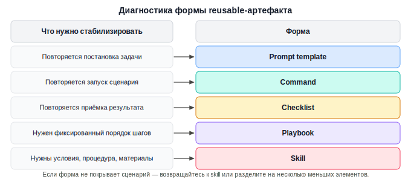
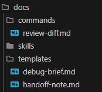
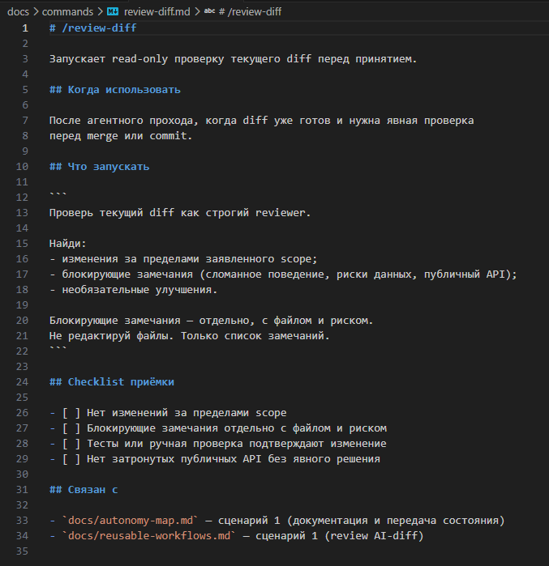

# Урок 4. Команды, шаблоны и чеклисты

_lesson_id: 2289248 · steps: 15 · ttc: Nones_

---

## Шаг 1 (step_id=9817286, text)

Когда достаточно лёгкого reusable-артефакта

После первого skill появляется соблазн упаковывать так каждый повторяемый сценарий — это почти всегда избыточно. Многие рабочие маршруты становятся устойчивыми без полноценного skill: через команду, prompt template, checklist или короткий playbook.

Лёгкий артефакт подходит там, где сценарий повторяется, но не требует отдельного набора знаний, материалов и сложной процедуры. Он должен быстро запускать работу или помогать принять результат, а не создавать новый слой инструкций ради самого слоя.

Три ситуации для лёгкой формы

Повторяется постановка. Вы часто просите агента об одном и том же, но каждый раз заново формулируете контекст, границы и формат ответа. Здесь обычно хватает prompt template.

Повторяется запуск. Сценарий можно начать короткой командой: review diff, собрать debugging brief, подготовить handoff, проверить release prep. Здесь удобна команда или command-like workflow.

Повторяется приёмка. Агентный результат уже есть, но вы каждый раз вручную вспоминаете критерии качества. Здесь сильнее работает checklist.

Диагностика формы

Начните с вопроса: что именно нужно стабилизировать? Если вход — используйте template. Если запуск — command. Если выход — checklist. Если есть короткий порядок действий из нескольких шагов — playbook. Если появились условия применения, вспомогательные материалы и сложные стоп-сигналы, возвращайтесь к skill.

Слабый кандидат для лёгкой формы: «улучшить проект». Непонятно, где границы, какой результат принять и когда остановиться. Сильный кандидат: «собрать read-only review текущего diff». Здесь можно заранее описать вход, формат ответа и критерии приёмки, не создавая отдельный skill.

Когда лёгкой формы недостаточно

Если сценарий требует особых материалов, нескольких режимов работы, сложных стоп-сигналов или проверки на применимость, prompt template быстро станет длинным и хрупким. В таком случае лучше вернуться к skill или разделить сценарий на несколько меньших элементов.

Например, «подготовь release note» может быть шаблоном. А «проведи release prep для сервиса с миграциями, changelog, backward compatibility и рисками выката» уже может потребовать skill или хотя бы playbook с checklist.

---

## Шаг 2 (step_id=10079745, text)

Команды и command-like workflows

Команда хороша там, где сценарий часто начинается одинаково. Она даёт короткий вход в рабочий маршрут: /review-diff, /prepare-debug-brief, /handoff-note, /feature-slice. В разных инструментах механизм может называться по-разному, но инженерный смысл один: одна команда запускает понятный сценарий с ожидаемым результатом.

Команда должна быть узкой

Слабая команда скрывает слишком широкий промпт. Например, /improve-project может означать что угодно: refactoring, tests, UI, архитектуру, документацию. Такая команда не снижает неопределённость, а только переносит её в красивое имя.

Сильная команда называет один результат: /review-diff возвращает review note, /debug-brief возвращает brief для поиска причины, /handoff-note возвращает состояние задачи для следующей сессии.

Структура хорошей команды

Команда должна фиксировать минимум, который нельзя забыть при запуске:

	цель: какой результат нужен;
	границы: что не менять и куда не расширяться;
	входы: какие файлы, diff, issue или логи нужны;
	формат ответа: как агент должен вернуть результат;
	стоп-сигналы: где нужна пауза и решение человека.

Команда может ссылаться на skill или checklist

Команда не обязана содержать всю процедуру. Если у вас уже есть skill для review AI-кода, команда может быть коротким запуском этого skill. Если главная ценность — приёмка, команда может завершаться checklist. Так reusable-элементы связываются между собой без дублирования.

Пример команды в виде шаблона

/review-diff

Проверь текущий diff перед принятием.

Сначала определи заявленные границы изменения.
Потом найди изменения вне этих границ, блокирующие риски,
недостающие проверки и спорные решения.

Не редактируй код. Верни review note:
1. Blocking issues
2. Risks
3. Verification gaps
4. Optional improvements

Даже если ваш инструмент не поддерживает slash-команды, такой блок можно хранить как command-like workflow и быстро вставлять в агентную сессию.

Как это выглядит в инструментах

Один и тот же /review-diff оформляется по-разному в зависимости от инструмента. Ниже — конкретные пути и форматы файлов для каждого из них.

Claude Code

Команды хранятся в папке .claude/commands/ (только для текущего проекта) или в ~/.claude/commands/ (для всех проектов). Файл — обычный Markdown, имя файла без расширения становится именем команды.

# .claude/commands/review-diff.md

Проверь текущий diff перед принятием.

Определи заявленные границы изменения.
Найди изменения вне этих границ, блокирующие риски,
недостающие проверки и спорные решения.

Не редактируй код. Верни review note:
1. Blocking issues
2. Risks
3. Verification gaps
4. Optional improvements

Вызов: /review-diff в чате. Если команда нужна для конкретного файла или задачи, добавьте в файл плейсхолдер $ARGUMENTS — при вызове он заменится на всё, что вы написали после имени команды.

# .claude/commands/fix-issue.md
Исправь задачу $ARGUMENTS согласно стандартам проекта.

1. Прочитай описание задачи в трекере.
2. Найди затронутые файлы.
3. Реализуй исправление и напиши тест.
4. Создай коммит.

Вызов /fix-issue 423 — Claude получит текст с подставленным номером: «Исправь задачу 423…». Если $ARGUMENTS нет в файле, аргументы всё равно передаются: Claude Code дописывает их в конец промпта.

Codex

В Codex лёгкий артефакт оформляется как skill — директория с файлом SKILL.md. Место хранения: .agents/skills/ в корне репозитория (для команды) или ~/.agents/skills/ (для личного использования).

# .agents/skills/review-diff/SKILL.md
---
name: review-diff
description: Read-only review текущего diff перед принятием изменений.
---

Проверь текущий diff перед принятием.

Определи заявленные границы изменения.
Найди изменения вне этих границ, блокирующие риски,
недостающие проверки и спорные решения.

Не редактируй код. Верни review note:
1. Blocking issues
2. Risks
3. Verification gaps
4. Optional improvements

Явный вызов: упомяните $review-diff в промпте. Codex также может выбрать skill неявно, если описание в description совпадает с задачей. Для лёгкого артефакта достаточно одного файла SKILL.md — никаких вспомогательных папок.

Форма хранения и роль артефакта — разные вещи. В Codex нет отдельного слота для команд: всё оформляется как SKILL.md. Но если файл просто запускает один узкий сценарий — это command-like workflow, а не skill. Skill отличается не папкой, а содержимым: сложная процедура, стоп-сигналы, вспомогательные материалы, условия применения. Команда — только вход в один понятный сценарий.

Cursor

В Cursor лёгкие артефакты хранятся как правила в .cursor/rules/. Каждое правило — это Markdown-файл (.mdc или .md) с YAML-фронтматтером.

# .cursor/rules/review-diff.mdc
---
description: Read-only review текущего diff перед принятием изменений.
alwaysApply: false
---

Проверь текущий diff перед принятием.

Определи заявленные границы изменения.
Найди изменения вне этих границ, блокирующие риски,
недостающие проверки и спорные решения.

Не редактируй код. Верни review note:
1. Blocking issues
2. Risks
3. Verification gaps
4. Optional improvements

Поле alwaysApply: false означает «применять только по явному вызову». Вызов: @review-diff в Agent-чате. Если заполнено только description без alwaysApply, Cursor сам решает, когда применить правило, опираясь на контекст разговора. Для привязки к конкретным файлам используйте globs: src/**/*.ts.

Файл AGENTS.md в корне проекта работает как упрощённая альтернатива без метаданных — подходит для коротких постоянных инструкций. Устаревший формат .cursorrules в корне не рекомендован к использованию.

/review-diff не обязан быть одинаковой нативной командой во всех инструментах. Главное — он запускает узкий сценарий и возвращает один ожидаемый результат. Механика оформления вторична.

---

## Шаг 3 (step_id=10079746, text)

Prompt templates и чеклисты приёмки

Prompt template стабилизирует вход в задачу, а checklist стабилизирует выход. Вместе они закрывают большую часть повторяемых сценариев, где полноценный skill избыточен.

Prompt template задаёт форму постановки

Хороший шаблон не должен быть универсальным промптом для всего. Он помогает не забыть важные поля: контекст, цель, границы, входные материалы, ожидаемый результат и запрет на лишние действия.

Задача:
Контекст проекта:
Режим работы агента:
Границы изменений:
Что приложено в контекст:
Что уже известно:
Что нужно сделать сначала:
Что не делать без подтверждения:
Ожидаемый результат:
Проверки для приёмки:

Такой шаблон не заменяет мышление. Он снижает шанс, что вы забудете указать границы или ожидаемый формат результата.

Checklist удерживает качество результата

Checklist полезен после ответа агента, diff или документа. Его задача — не добавить бюрократию, а быстро обнаружить слабые места: расползание границ, отсутствие проверки, неверный формат результата, скрытое решение, которое должен принять человек.

Review checklist:
- Агент явно назвал границы исходной задачи?
- Есть ли изменения вне этих границ?
- Разделены ли blocking issues, risks и optional improvements?
- Указаны ли verification gaps, если проверки не запускались?
- Спорные решения вынесены отдельно, без автоматического исправления?
- Следующее действие понятно без перечитывания всего чата?

Шаблон и checklist должны совпадать

Если в prompt template вы просите вернуть verification gaps, checklist должен проверять, что они действительно есть. Если в checklist есть пункт про границы diff, шаблон должен просить агента эти границы назвать. Иначе вход и приёмка расходятся, а reusable-сценарий начинает дрейфовать.

Как хранить в инструментах

Template и checklist — это справочный материал, который вы приносите в сессию по необходимости. Playbook — это короткая процедура, которая ведёт агента по шагам. Поэтому они хранятся по-разному.

Template и checklist: проектные файлы

Удобное место для обеих форм — папка в документации проекта. Файлы версионируются вместе с кодом и доступны из любого инструмента.

docs/
├── templates/
│   ├── debug-brief.md      ← шаблон постановки
│   └── handoff-note.md
└── checklists/
    └── review-checklist.md ← критерии приёмки

Чтобы принести файл в контекст агентной сессии:

	Claude Code и Cursor: @docs/templates/debug-brief.md в чате — агент загружает содержимое и работает в соответствии с полями шаблона или применяет checklist к текущему результату.
	Codex: укажите путь в промпте: «Используй шаблон из docs/templates/debug-brief.md» — агент прочитает файл.

# docs/templates/debug-brief.md
Симптом:
Воспроизводится:         да / нет
Компонент:
Последнее рабочее состояние:
Что изменилось с тех пор:
Логи или сообщения об ошибке:
Уже проверено:
Гипотеза о причине:

Если вы хотите, чтобы агент сам заполнял шаблон по короткому запросу, храните его как command-артефакт — тогда /debug-brief автоматически подставляет структуру. Это удобно, когда заполнение шаблона само по себе является повторяемой задачей.

Playbook: command-артефакт

Playbook описывает короткий фиксированный порядок действий для агента — поэтому он хранится в тех же слотах, что и команды.

	
		
			Инструмент
			Путь
			Вызов
		
	
	
		
			Claude Code
			.claude/commands/feature-slice.md
			/feature-slice
		
		
			Codex
			.agents/skills/feature-slice/SKILL.md
			$feature-slice
		
		
			Cursor
			.cursor/rules/feature-slice.mdc
			@feature-slice
		
	

Playbook отличается от команды содержимым, а не местом хранения. Команда запускает один результат, playbook ведёт по нескольким последовательным шагам с явными точками проверки.

# .claude/commands/feature-slice.md
Декомпозируй задачу перед началом работы.

Шаг 1. Прочитай постановку и назови одну цель.
Шаг 2. Выдели три независимых куска, которые можно реализовать отдельно.
Шаг 3. Для каждого куска: входные данные, результат, риск.
Шаг 4. Назови порядок реализации и обоснуй его.

Не начинай реализацию — только план.

---

## Шаг 4 (step_id=10079747, text)

Как связать команды, шаблоны, чеклисты, rules и skills

Reusable-элементы должны усиливать друг друга, а не повторять одни и те же инструкции в пяти местах. Сильный набор устроен как связанная система: project rules задают постоянные ограничения, skill описывает процедуру, команда запускает сценарий, template помогает поставить задачу, checklist помогает принять результат.

Разделяйте зоны ответственности

	
		
			Элемент
			За что отвечает
			Что не должен дублировать
		
	
	
		
			Project rules
			Постоянные ограничения проекта
			Разовые детали текущей задачи
		
		
			Skill
			Процедуру для класса задач
			Все общие правила проекта
		
		
			Command
			Короткий запуск сценария
			Длинную скрытую процедуру
		
		
			Prompt template
			Форму постановки
			Полный маршрут выполнения
		
		
			Checklist
			Приёмку результата
			Обучающий текст и рассуждения
		
	

Пример исправления дублирования

Было: команда /review-diff, skill review-ai-diff и project rules все отдельно повторяют «запусти npm test и не меняй файлы вне diff». После правки команда только запускает review, skill описывает процедуру анализа, а project rules остаются единственным источником команд проверки и постоянных запретов.

Project rules:
- команды проверки и постоянные ограничения

Command:
- запусти review текущего diff

Skill:
- определи границы, риски и verification gaps
- команды проверки бери из project rules

Ссылайтесь, не копируйте

Вместо копирования используйте короткие ссылки внутри своей системы: команда запускает skill, skill ссылается на project rules, checklist проверяет результат команды, prompt template просит заполнить поля, которые потом проверяются. Так каждый элемент остаётся маленьким и понятным.

Выделяйте повторяющийся блок в общую команду

Дублирование появляется не только между уровнями (rules, skill, command), но и внутри одного уровня — когда несколько команд содержат одинаковый блок инструкций. Признак: вы обновляете один и тот же текст в трёх местах одновременно.

Представим три команды, каждая из которых завершается одинаковой проверкой безопасности:

# .claude/commands/review-diff.md
...определи границы diff и риски...
Перед ответом: проверь, нет ли в изменениях хардкода секретов,
открытых SQL-запросов и незащищённых входных данных.

# .claude/commands/fix-issue.md
...исправь задачу $ARGUMENTS...
Перед коммитом: проверь, нет ли в изменениях хардкода секретов,
открытых SQL-запросов и незащищённых входных данных.

Этот блок — кандидат на выделение. Создайте отдельную команду и сошлитесь на неё:

# .claude/commands/security-check.md
Выполни проверку безопасности текущих изменений:
- нет ли хардкода секретов, токенов или паролей?
- нет ли незащищённых SQL-запросов или вставок без санации?
- все внешние входные данные валидируются?
Если нашёл проблему — перечисли отдельно, не исправляй.

# .claude/commands/review-diff.md
...определи границы diff и риски...
Перед ответом выполни /security-check.

# .claude/commands/fix-issue.md
...исправь задачу $ARGUMENTS...
Перед коммитом выполни /security-check.

Теперь обновление критериев безопасности требует правки одного файла, а не поиска по всем командам. Та же логика работает для любого повторяющегося блока: формата ответа, списка запрещённых операций, шагов финальной проверки.

Мини-карта reusable-набора

Scenario: review AI-generated diff

Project rules:
- общие ограничения репозитория и команды проверки

Command:
- /review-diff запускает read-only review

Skill:
- review-ai-diff описывает процедуру анализа

Checklist:
- проверяет blocking issues, risks, verification gaps

Template:
- помогает поставить review для конкретного diff

---

## Шаг 5 (step_id=10079748, text)

Практика: соберите мини-набор reusable-элементов

StudyFlow ниже используется как демонстрационный пример. Работайте в своём репозитории, следуя тем же шагам.

Возьмите 2-3 сценария из карты повторяющихся задач и подберите для каждого лёгкий reusable-элемент. Цель практики — не создать больше инструкций, а получить небольшой набор, который можно применить в следующей агентной сессии.

Не собирайте здесь полный agent workflow kit — это задача следующего урока. Сейчас нужен мини-набор: несколько лёгких элементов, короткая карта связей, один пробный запуск и одно исправление после проверки.

Шаг 1. Выберите сценарии разного типа

Хороший набор может выглядеть так:

	review-diff — команда или checklist;
	prepare-debug-brief — prompt template;
	feature-slice — короткий playbook для декомпозиции;
	handoff-note — template для передачи состояния.

Не берите все сценарии сразу. Лучше сделать три полезных элемента, чем десять черновиков, которые не будут использоваться.

Шаг 2. Для каждого элемента укажите роль

Элемент:
Сценарий:
Форма: command / template / checklist / playbook
Когда применять:
Что должен вернуть агент:
Как проверить результат:
С чем связан: rules / skill / checklist / command

Шаг 3. Проверьте набор на дублирование

Откройте созданные элементы рядом и найдите повторяющиеся инструкции. Если один и тот же пункт встречается в нескольких местах, оставьте его там, где он должен быть источником правды. Например, постоянную команду проверки держите в project rules, а checklist пусть только проверяет, что результат подтверждён.

Шаг 4. Проведите короткий пробный запуск

Выберите один элемент и примените его в реальной агентной сессии. Лучше начать с read-only сценария: review diff, debugging brief или handoff note. Сохраните короткое evidence: какой элемент запускали, какой ответ получили, что пришлось уточнять вручную. После запуска исправьте артефакт одним маленьким изменением.

Что должно остаться после практики

	2-3 reusable-элемента: команда, template, checklist или playbook;
	короткая карта связей между ними и project rules;
	запись одного read-only пробного запуска;
	одно исправление после фактического применения;
	критерии приёмки для каждого элемента.

Пример: StudyFlow

Для StudyFlow из карты сценариев выбраны три: review AI-diff, debugging brief и handoff после прохода. Skill migration-dry-run уже создан в предыдущем уроке, поэтому здесь добавляются только лёгкие элементы для остальных сценариев.

Промпт для создания набора:

Ты работаешь в репозитории StudyFlow.

Прочитай docs/reusable-workflows.md.

Задача: создать три лёгких reusable-элемента для сценариев
1, 2 и 4 из карты.

Для сценария 1 (review AI-diff): создать docs/commands/review-diff.md —
команда с embedded checklist приёмки.

Для сценария 2 (debugging brief): создать docs/templates/debug-brief.md —
prompt template с полями для заполнения.

Для сценария 4 (handoff): создать docs/templates/handoff-note.md —
template с разделами состояния и следующего шага.

Каждый элемент должен содержать:
- когда использовать;
- сам артефакт (команда, шаблон или checklist);
- checklist приёмки результата;
- ссылки на связанные документы.

Не дублируй постоянные project rules.
После создания покажи список файлов и предложи commit.

В промпте команды и шаблоны размещаются в docs/ — это универсальный подход, который работает в любом инструменте без дополнительных настроек. Если вы используете конкретный инструмент, адаптируйте пути и формат файла: команды в Claude Code хранятся в .claude/commands/ как обычный Markdown без фронтматтера; в Codex — в .agents/skills/<name>/SKILL.md с YAML-заголовком name и description; в Cursor — в .cursor/rules/ с заголовком description и alwaysApply: false. Шаблоны и чеклисты в docs/ остаются универсальными — их подключают через @путь (Claude Code, Cursor) или явную ссылку в промпте (Codex).

После создания набора проверялось дублирование: review-diff.md сначала включал пункт «проверь, что тесты проходят» — это было перекрытием с постоянными project rules. Пункт убран, остался только в checklist приёмки как «тесты или ручная проверка подтверждают изменение».

Как принять результат

Мини-набор готов, если каждый элемент имеет понятный сценарий, не дублирует соседние правила и возвращает проверяемый результат. Сохраните рядом короткую карту связей: какая команда запускает какой template или skill, какой checklist используется для приёмки и где находятся постоянные проектные правила. Один элемент должен быть уже проверен в реальной агентной сессии.

---

## Шаг 6 (step_id=10079749, choice)

Вы каждый раз заново пишете контекст, цели и формат ответа для одной и той же задачи. Какой лёгкий артефакт это устраняет?

**Тип:** choice (single)

**Варианты:**
-  Checklist
-  Полноценный skill
-  Command-артефакт
- [✓ правильный] Prompt template

**Статус Stepik:** `correct` (score 1.0)

**Мой reasoning:** _В теории прямо сказано: «Повторяется постановка. Вы часто просите агента об одном и том же, но каждый раз заново формулируете контекст, границы и формат ответа. Здесь обычно хватает prompt template». Это точно соответствует описанной ситуации._

---

## Шаг 7 (step_id=10079750, choice)

Какие формы относятся к лёгким reusable-элементам?

**Тип:** choice (multiple)

**Варианты:**
-  Полная замена project rules
- [✓ правильный] Checklist
- [✓ правильный] Command-like workflow
- [✓ правильный] Prompt template

**Статус Stepik:** `correct` (score 1.0)

**Мой reasoning:** _Теория прямо называет лёгкими reusable-формами команду/command-like workflow, prompt template, checklist и playbook. Полная замена project rules не относится к лёгким артефактам — rules задают постоянные ограничения отдельным слоем._

---

## Шаг 8 (step_id=10079751, matching)

Соотнесите элемент и его роль

**Тип:** matching

**Колонка А (вопросы):**
- Command
- Prompt template
- Checklist
- Playbook

**Колонка Б (варианты, перемешаны):**
- Помогает принять результат
- Описывает короткий порядок действий
- Стабилизирует постановку задачи
- Коротко запускает сценарий

**Правильные пары:**
- Command → Коротко запускает сценарий
- Prompt template → Стабилизирует постановку задачи
- Checklist → Помогает принять результат
- Playbook → Описывает короткий порядок действий

**Статус Stepik:** `correct` (score 1.0)

**Мой reasoning:** _Из теории: command — короткий вход в сценарий, template стабилизирует вход/постановку, checklist — приёмка результата, playbook — короткий фиксированный порядок действий._

---

## Шаг 9 (step_id=10079752, choice)

Команда /improve-project обещает улучшить код, тесты, архитектуру и документацию сразу. В чём проблема?

**Тип:** choice (single)

**Варианты:**
-  Нельзя писать по-английски
-  Ей не хватает слэша
-  Она слишком короткая
- [✓ правильный] Слишком широкий запуск

**Статус Stepik:** `correct` (score 1.0)

**Мой reasoning:** _В теории прямо сказано: слабая команда вроде /improve-project скрывает слишком широкий промпт и не снижает неопределённость. Сильная команда называет один результат, а не охватывает сразу код, тесты, архитектуру и документацию._

---

## Шаг 10 (step_id=10079753, choice)

Что обычно стоит включить в prompt template?

**Тип:** choice (multiple)

**Варианты:**
- [✓ правильный] Границы изменений
- [✓ правильный] Ожидаемый результат
- [✓ правильный] Контекст и цель
-  Полный маршрут выполнения

**Статус Stepik:** `correct` (score 1.0)

**Мой reasoning:** _Шаблон фиксирует форму постановки: контекст, цель, границы, ожидаемый результат и проверки. Полный маршрут выполнения — это задача playbook или skill, шаблон его не содержит._

---

## Шаг 11 (step_id=10079754, matching)

Соотнесите уровень и источник правды

**Тип:** matching

**Колонка А (вопросы):**
- Project rules
- Skill
- Command
- Checklist

**Колонка Б (варианты, перемешаны):**
- Процедура класса задач
- Критерии приёмки
- Постоянные ограничения
- Запуск сценария

**Правильные пары:**
- Project rules → Постоянные ограничения
- Skill → Процедура класса задач
- Command → Запуск сценария
- Checklist → Критерии приёмки

**Статус Stepik:** `correct` (score 1.0)

**Мой reasoning:** _По таблице зон ответственности из урока: project rules задают постоянные ограничения проекта, skill описывает процедуру для класса задач, command запускает сценарий, checklist отвечает за приёмку результата._

---

## Шаг 12 (step_id=10080906, choice)

Prompt template разросся: в нём появились условия применения, материалы, два режима работы и стоп-сигналы. Что лучше сделать?

**Тип:** choice (single)

**Варианты:**
-  Удалить критерии приёмки
- [✓ правильный] Вынести процедуру в skill
-  Сделать project rules длиннее
-  Скрыть всё в команде

**Статус Stepik:** `correct` (score 1.0)

**Мой reasoning:** _По теории, если шаблон обрастает условиями применения, материалами, несколькими режимами и стоп-сигналами — это сигнал, что лёгкой формы недостаточно и нужно возвращаться к skill._

---

## Шаг 13 (step_id=10080907, choice)

Что помогает избежать дублирования reusable-элементов?

**Тип:** choice (multiple)

**Варианты:**
- [✓ правильный] Разделение зон ответственности
- [✓ правильный] Один источник правды для общих правил
- [✓ правильный] Короткие ссылки между элементами
-  Копирование rules в каждый template

**Статус Stepik:** `correct` (score 1.0)

**Мой reasoning:** _Теория прямо указывает: разделять зоны ответственности, держать один источник правды (например, project rules) и ссылаться, а не копировать. Копирование rules в каждый template — это и есть дублирование, которого нужно избегать._

---

## Шаг 14 (step_id=10080908, choice)

Чем playbook отличается от команды?

**Тип:** choice (single)

**Варианты:**
- [✓ правильный] Playbook ведёт по нескольким шагам
-  Playbook не может ссылаться на skills
-  Playbook требует отдельного синтаксиса
-  Playbook хранится в другой папке

**Статус Stepik:** `correct` (score 1.0)

**Мой reasoning:** _В теории прямо сказано: команда запускает один результат, а playbook ведёт по нескольким последовательным шагам с явными точками проверки. Место хранения у них одинаковое._

---

## Шаг 15 (step_id=10080909, choice)

Что должно быть в мини-наборе после практики?

**Тип:** choice (multiple)

**Варианты:**
- [✓ правильный] Короткая карта связей
-  Полный kit на все задачи
- [✓ правильный] 2-3 reusable-элемента
- [✓ правильный] Один read-only пробный запуск

**Статус Stepik:** `correct` (score 1.0)

**Мой reasoning:** _В разделе «Что должно остаться после практики» прямо перечислены 2-3 reusable-элемента, карта связей, запись пробного запуска и одно исправление с критериями приёмки. Полный kit явно отложен до следующего урока._

---
