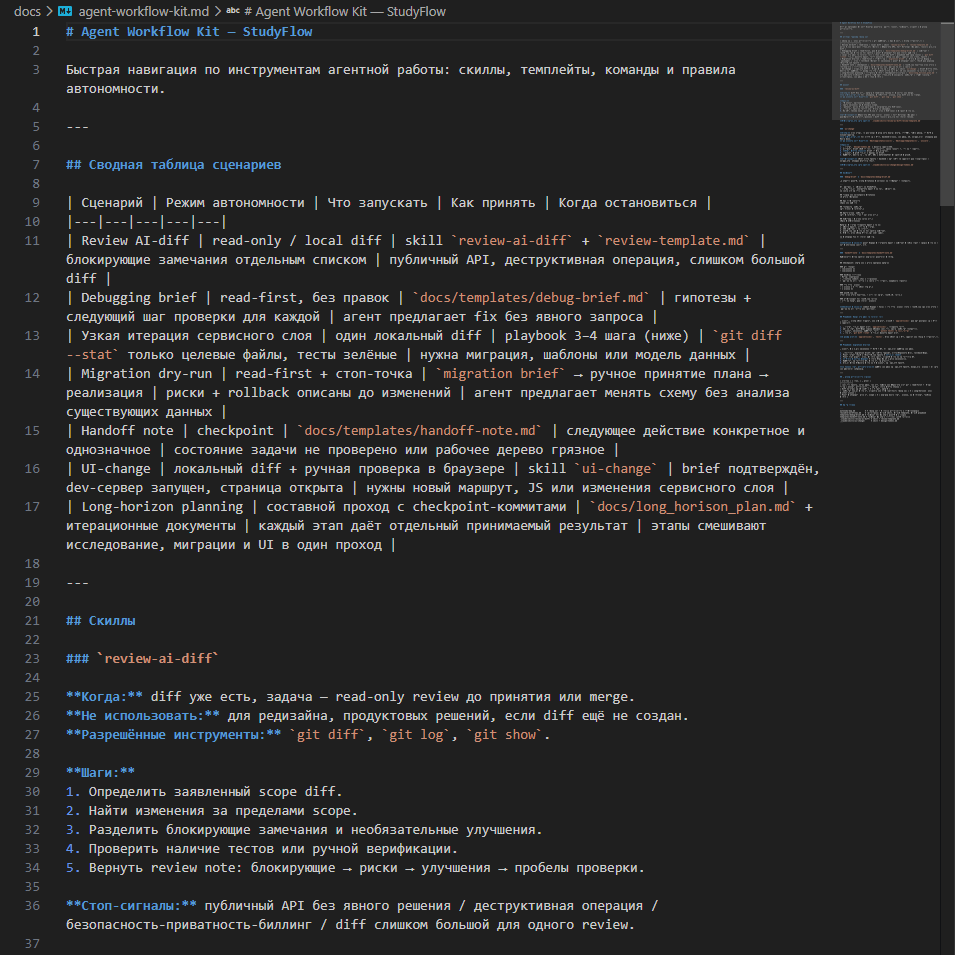

# Урок 5. Личный agent workflow kit

_lesson_id: 2289263 · steps: 12 · ttc: Nones_

---

## Шаг 1 (step_id=9817316, text)

Из чего состоит личный agent workflow kit

К концу модуля у вас уже есть несколько reusable-артефактов: карта повторяющихся сценариев, контракт skill, первый skill с корректным frontmatter, команды, шаблоны и чеклисты — и карта автономности из предыдущего модуля. Теперь их нужно собрать не в папку случайных промптов, а в связанный agent workflow kit: небольшой рабочий набор, который помогает быстро запустить, ограничить и принять повторяемую агентную задачу.

Kit отвечает на конкретные вопросы

Хороший kit не требует читать десять файлов, чтобы вспомнить, что вообще делать. Он отвечает на практические вопросы: какой сценарий перед вами, какой уровень автономности допустим, какой элемент запустить, какой результат ожидать и как его принять. Если набор на эти вопросы не отвечает — это просто папка с заметками.

Пример маленького kit

	
		
			Сценарий
			Где хранится
			Чем запускается
			Как принять
			Когда остановиться
		
	
	
		
			Review AI-diff
			review-diff.md (command)
			/review-diff или $review-diff
			Embedded checklist приёмки
			Публичный API, данные, безопасность
		
		
			Debugging brief
			debug-brief.md (template)
			Заполнить шаблон, отправить агенту
			Гипотезы, файлы для чтения, шаги проверки
			Предложение менять код до диагноза
		
		
			Handoff
			handoff-note.md (template)
			Заполнить шаблон или вставить блок
			Понятное следующее действие
			Нет подтверждённого состояния задачи
		
	

Начните с минимума

Один skill, 2–3 команды или шаблона, один checklist и короткая карта применения — достаточно для старта. Такой набор легче проверить на реальных задачах и обновить после использования. Если для выбора нужного элемента приходится читать много файлов, kit уже слишком тяжёлый.

---

## Шаг 2 (step_id=10079755, text)

Что должно быть личным, а что проектным

Одни reusable-артефакты помогают вам работать в любом репозитории. Другие описывают правила конкретной кодовой базы. Первые — личные, вторые — проектные. Разница важна: если проектное ограничение попадёт в личный skill, он начнёт вредить в другом проекте. Если личная процедура окажется в project rules — она будет навязываться там, где не нужна.

Личный уровень

На личном уровне удобно держать переносимые формы: review skill, шаблон debugging brief, checklist приёмки AI-diff, playbook для feature slice. Это способ работы, который переходит вместе с вами между pet-проектом, рабочим сервисом и учебным репозиторием — он не зависит от устройства конкретной кодовой базы.

	В Claude Code личные skills лежат в ~/.claude/skills/, личные команды — в ~/.claude/commands/.
	В Codex — в ~/.agents/skills/.
	Cursor поддерживает личные User Rules (Settings → General → Rules for AI) — они применяются глобально во всех проектах. Проектные правила хранятся в .cursor/rules/. Шаблоны и чеклисты, которые не помещаются в User Rules, удобно держать в отдельном приватном репозитории и подключать через @path.

Проектный уровень

Внутри репозитория остаются правила, которые нельзя универсализировать: как запускать тесты, какие директории не трогать, какие зависимости запрещены, какие процедуры миграции приняты в команде.

	В Claude Code это CLAUDE.md и .claude/skills/.
	В Codex — AGENTS.md и .agents/skills/.
	В Cursor — .cursor/rules/.

Как это работает вместе

Рабочая связка такая: личный skill задаёт маршрут, а project rules уточняют локальные ограничения. Например, skill для review AI-кода требует проверить тестовый сигнал — но конкретная команда запуска тестов берётся из rules текущего проекта. Skill ссылается на неё, а не дублирует содержимое.

В любом инструменте агент должен читать только инструкции, нужные для текущего сценария. Если skill активируется вместе с десятком других правил по умолчанию — это признак того, что границы между личным и проектным размылись.

Командный проект и личные skills

Личный уровень существует только на вашей машине. Когда проект использует команда, коллеги не получают ваш ~/.claude/skills/ автоматически — он нигде не объявлен как зависимость и не попадает в репозиторий. Если project rules или проектный skill ссылаются на личный skill, агент на машине коллеги просто не найдёт его: в лучшем случае пропустит шаг, в худшем — сломается именно там, где вы рассчитываете на надёжное поведение.

Граница жёсткая: проектный артефакт может ссылаться только на то, что лежит в репозитории. Личные skills можно использовать внутри своего workflow, но они не должны быть зависимостью проектного. Если skill нужен всей команде — перенесите его в .claude/skills/ проекта и зафиксируйте в репозитории.

Быстрая проверка

Перед добавлением элемента в kit спросите: будет ли это верно в трёх разных проектах? Если да — элемент может быть личным. Если нет — оставьте его на проектном уровне или добавьте в личном элементе явную точку, где агент должен прочитать локальные rules текущего репозитория.

---

## Шаг 3 (step_id=10079756, text)

Как поддерживать workflow kit

Workflow kit быстро превращается в архив, если в него только добавлять новое. Устаревшие шаблоны, повторяющиеся rules и skills без реального применения создают шум. Поддержка kit — не отдельная бюрократия, а короткий разбор после реального использования.

Обновляйте по факту запуска

Лучший момент для правки — сразу после применения. Пришлось вручную уточнить границы — добавьте это в template. Checklist не поймал важный риск — обновите критерий. Skill запустился не там — сузьте триггер. Не добавляйте улучшения «на всякий случай» без конкретной наблюдаемой причины.

Например: вы запустили review-шаблон, а агент вернул общий список улучшений и не выделил verification gaps. Не нужно переписывать весь kit — достаточно добавить в checklist вопрос «указаны ли проверки, которые не запускались?» и в template поле «какой проверочный сигнал доступен сейчас». Маленькая правка по фактическому сбою.

Удаляйте устаревшие элементы

Старый template опасен тем, что выглядит рабочим. Если сценарий больше не нужен — удалите элемент или пометьте как устаревший. Если два элемента делают одно и то же — оставьте один источник правды. Если команда постоянно требует пояснений — перепишите её или превратите в skill или playbook.

Ревизия kit промптом

Проверь мой agent workflow kit.

Найди:
- элементы без понятного сценария применения;
- дублирование между rules, skills, commands и templates;
- устаревшие команды или шаблоны;
- чеклисты, которые не проверяют результат;
- skills со слишком широкими триггерами.

Не редактируй файлы сразу. Верни:
1. список дублей;
2. список устаревших элементов;
3. один минимальный patch-план.

Kit должен становиться короче и точнее — а не только больше.

---

## Шаг 4 (step_id=10079757, text)

Связь kit с картой автономности

Workflow kit работает в паре с картой автономности из модуля 6. Один и тот же reusable-элемент может ускорять работу и одновременно ограничивать её — в зависимости от того, какой сценарий перед вами.

Где kit повышает автономность

Если сценарий повторяется, хорошо проверяется и имеет устойчивый маршрут — kit позволяет делегировать больше. Review diff с понятным checklist можно запускать быстрее. Debugging brief без изменения кода можно отдавать агенту шире. Handoff после длинного прохода можно стандартизировать командой.

Здесь kit снижает риск: агент получает готовые границы, формат результата и критерии приёмки.

Где kit ограничивает автономность

В рискованных сценариях kit должен не ускорять выполнение любой ценой, а раньше возвращать решение человеку. Если задача затрагивает публичный API, миграции данных, безопасность или необратимые операции — skill или command должны явно остановить агента и запросить подтверждение.

Именно поэтому reusable workflow связан с картой автономности: он не только говорит «как делать», но и — «когда не продолжать».

Сценарии и режимы

	
		
			Сценарий
			Режим автономности
			Элемент kit
			Когда остановиться
		
	
	
		
			Review AI-diff
			Read-only или локальный diff
			Command + checklist
			Изменение вне границ или публичный API
		
		
			Debugging brief
			Read-first
			Prompt template
			Fix без подтверждённой причины
		
		
			Migration dry-run
			Read-first с ранним stop-point
			Skill + checklist
			Схема данных, rollback или destructive-действие
		
		
			Handoff после long-horizon
			Контрольная точка
			Template или command
			Нет проверенного состояния и следующего шага
		
	

Kit помогает и отказывать

Сильный kit помогает не только запускать сценарии, но и распознавать ситуации, где агентный маршрут не подходит. Если задача не совпадает с условиями skill или команды — правильный результат это предложение более безопасного варианта: read-first, отдельный brief, ручное решение или разбивка задачи на шаги.

---

## Шаг 5 (step_id=10079758, text)

Практика: соберите первый agent workflow kit

StudyFlow ниже используется как демонстрационный пример. Работайте в своём репозитории, следуя тем же шагам.

Соберите минимальный kit из артефактов, которые уже появились в модуле: карта повторяющихся сценариев, один skill, 2–3 команды или шаблона, один checklist и карта применения, связанная с границами автономности.

После практики у вас должны остаться: agent-workflow-kit.md или аналогичный индекс, ссылка на один существующий skill, 2–3 лёгких элемента, один checklist, один good run или короткая заметка о реальном запуске.

Шаг 1. Создайте карту kit

Начните с одного файла-индекса, например agent-workflow-kit.md. Он должен не дублировать содержимое всех элементов, а показывать, что применять в каком сценарии.

Сценарий | Режим автономности | Что запускать | Как принять | Когда остановиться
Review AI-diff | read-only / local diff | /review-diff + checklist | блокирующие замечания отдельно | публичный API или изменения вне границ
Debugging brief | read-first | debug-brief template | гипотезы и следующие проверки | агент предлагает fix без причины
Migration dry-run | read-first + stop-point | migration-dry-run skill | риски до изменений | схема, данные или rollback
Handoff note | checkpoint | handoff template | следующее действие понятно | состояние задачи не проверено

Шаг 2. Проверьте личное и проектное

Отметьте, какие элементы переносимы между проектами, а какие завязаны на текущий репозиторий. Личные элементы описывают способ работы — они не должны зависеть от конкретной кодовой базы. Проектные хранят локальные команды, ограничения и доменные правила. В Claude Code граница проходит между ~/.claude/ и .claude/, в Codex — между ~/.agents/ и .agents/, в Cursor — переносимые элементы хранятся отдельно от .cursor/rules/.

Шаг 3. Прогоните один сценарий

Выберите один сценарий из kit и примените его в реальной агентной сессии. Лучше начать с read-only варианта: review diff, debugging brief или handoff note. Сохраните короткую заметку: что запускали, какой результат получили, какой критерий приёмки сработал или не сработал. После запуска обновите один элемент kit по фактическому замечанию — не переписывайте всё сразу.

Шаг 4. Проведите ревизию на дублирование

Попросите агента проверить kit как ревьюера инструкций:

Проверь мой agent workflow kit.

Найди:
- дублирование между rules, skills, commands и templates;
- элементы без понятного сценария применения;
- слишком широкие команды;
- skills без стоп-сигналов;
- чеклисты, которые не проверяют результат;
- места, где нужен ранний возврат человека в цикл.

Не редактируй файлы сразу. Сначала верни список замечаний
и предложи минимальные исправления.

Пример: StudyFlow

В StudyFlow kit собирался из уже созданных элементов: skill migration-dry-run из .agents/skills/migration-dry-run/SKILL.md, команда review-diff из docs/commands/review-diff.md, шаблоны debug-brief.md и handoff-note.md из docs/templates/, карта автономности из docs/autonomy-map.md. Задача kit — не дублировать содержимое элементов, а создать индекс: для какого сценария что запускать.

Промпт для создания kit:

Ты работаешь в репозитории StudyFlow.

Прочитай:
- docs/reusable-workflows.md
- docs/commands/review-diff.md
- docs/templates/debug-brief.md
- docs/templates/handoff-note.md
- .agents/skills/migration-dry-run/SKILL.md
- docs/autonomy-map.md

Задача: создать docs/agent-workflow-kit.md — индекс kit.

Карта должна содержать:
- таблицу: сценарий / режим автономности / что запускать /
  как принять / когда остановиться;
- раздел: какие элементы переносимы между проектами,
  какие привязаны к StudyFlow;
- раздел: где находятся постоянные project rules
  (не дублировать их содержимое);
- раздел: подтверждение одного реального запуска.

Не создавай новых элементов. Только индекс поверх уже существующих.
После создания покажи diff.

После создания kit проверялся агентом как ревьюером инструкций. Найдено: команда review-diff была слишком широкой — в неё попал пункт о тестах, который уже есть в постоянных правилах. После исправления checklist приёмки стал специфичным для сценария.

Как принять результат

Первый kit готов, если по карте можно быстро выбрать сценарий, режим автономности, reusable-элемент, способ приёмки и стоп-сигнал. В нём должен быть минимум один skill, 2–3 лёгких элемента, один checklist, понятная граница между личными и проектными правилами и подтверждение одного реального запуска.

---

## Шаг 6 (step_id=10079759, choice)

В проекте есть один skill, две команды, checklist и карта применения. Что делает это agent workflow kit, а не архивом промптов?

**Тип:** choice (single)

**Варианты:**
- ○ Длинные описания всех файлов
- ✓ Карта сценариев
- ○ Количество файлов
- ○ Замена project rules

---

## Шаг 7 (step_id=10079761, matching)

Соотнесите уровень или понятие с описанием.

**Тип:** matching

**Правильные пары:**
- Личный уровень → Review skill для разных проектов
- Проектный уровень → Команда тестов текущего репозитория
- Карта применения → Связь сценария с reusable-элементом
- Good run → Пример удачного запуска

---

## Шаг 8 (step_id=10079762, choice)

В каком инструменте нет встроенного личного уровня для хранения skills и rules?

**Тип:** choice (single)

**Варианты:**
- ○ Claude Code
- ○ Ни в одном из перечисленных инструментов
- ○ Codex
- ○ Cursor

---

## Шаг 9 (step_id=10079763, choice)

Что помогает поддерживать kit актуальным?

**Тип:** choice (multiple)

**Варианты:**
- ✓ Удаление устаревших элементов
- ○ Добавление всех найденных промптов
- ✓ Правки после реального запуска
- ✓ Проверка на дублирование

---

## Шаг 10 (step_id=10079764, choice)

Зачем удалять старые templates и commands из kit?

**Тип:** choice (single)

**Варианты:**
- ○ Чтобы агент работал без rules
- ○ Чтобы скрыть историю изменений
- ✓ Чтобы убрать устаревший шум
- ○ Чтобы заменить все skills

---

## Шаг 11 (step_id=10080912, choice)

Где kit может безопасно повысить автономность агента?

**Тип:** choice (multiple)

**Варианты:**
- ○ Спорное изменение биллинга
- ✓ Стандартизированный handoff
- ✓ Debugging brief без правки кода
- ✓ Повторяемый review diff

---

## Шаг 12 (step_id=10080913, choice)

Где kit должен раньше вернуть человека в цикл?

**Тип:** choice (single)

**Варианты:**
- ○ При заполнении template
- ✓ При спорных решениях
- ○ При чтении документации
- ○ При коротком handoff

---
