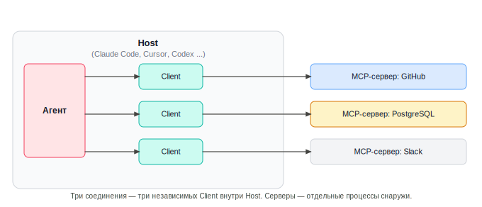

# Урок 1. MCP: базовая модель работы

_lesson_id: 2289250 · steps: 13 · ttc: Nones_

---

## Шаг 1 (step_id=9817288, text)

Что такое MCP

До появления MCP каждый AI-инструмент подключался к внешним сервисам по-своему. Claude Code требовал одного кода интеграции для GitHub, Cursor — другого, а следующий инструмент — третьего. При этом одна и та же потребность — прочитать PR или получить строки из базы — реализовывалась заново в каждом продукте. Model Context Protocol (MCP) — открытый стандарт, который решает эту проблему на уровне протокола, а не на уровне конкретного инструмента.

MCP опубликован Anthropic в ноябре 2024 года. Сегодня его поддерживают Claude Code, Claude Desktop, Cursor, VS Code с GitHub Copilot, OpenAI Codex, opencode и другие инструменты. Спецификация открыта на modelcontextprotocol.io и не привязана к конкретному провайдеру.

Место в агентном стеке

В прошлом модуле, мы уже настраивали слой reusable workflows: skills задают процедуры, commands запускают их, hooks реагируют на события, templates стандартизируют запросы. Этот слой описывает как агент должен работать внутри проекта.

MCP добавляет другой слой — к чему агент имеет доступ снаружи. MCP-сервер даёт агенту инструмент, которым можно реально запросить статус CI или прочитать строки из базы данных. Это не замена skills и commands — это следующий уровень, который они могут использовать.

Чем MCP отличается от обычного API-вызова

Когда разработчик пишет обёртку над REST API внутри скрипта, агент видит только то, что написал разработчик. Когда подключён MCP-сервер, агент видит его возможности напрямую — через стандартизированный контракт. Агент знает, какие инструменты доступны, какие параметры они принимают и какой формат ответа ожидать. Это позволяет одному и тому же серверу работать с разными агентами без переписывания интеграционного кода.

	
		
			Обычный API-вызов в коде
			MCP-сервер
		
	
	
		
			Описание зашито в промпт или код
			Стандартный контракт, агент читает автоматически
		
		
			Работает только в том инструменте, где написан
			Подключается к любому MCP-совместимому клиенту
		
		
			Интеграционный код надо поддерживать в каждом проекте
			Сервер переиспользуется между проектами и инструментами
		
		
			Права доступа размыты внутри кода
			Явный список инструментов с описаниями
		
	

MCP — это протокол, а не платформа

Важно удерживать эту рамку: MCP определяет формат общения между агентом и внешним инструментом. Он не говорит, что именно должен делать инструмент, как хранить данные или как реализовывать логику. Это стандарт сообщений — как HTTP для веб-запросов. Содержимое, права доступа и область видимости — ответственность того, кто разворачивает и настраивает конкретный сервер.

---

## Шаг 2 (step_id=10121631, text)

Архитектура MCP: host, client, server и три типа возможностей

MCP описывает трёхуровневую модель: есть тот, кто встраивает агента (host), есть соединение между ним и внешним инструментом (client), и есть сам внешний инструмент (server). Понимание этих ролей помогает правильно читать документацию, конфигурировать подключение и диагностировать проблемы.

Host, client, server

Host — это приложение, которое запускает агента и встраивает поддержку MCP. Claude Code, Claude Desktop, Cursor, VS Code с GitHub Copilot, OpenAI Codex — всё это hosts. Host отвечает за то, чтобы создать соединение, передать агенту информацию о доступных инструментах и пропустить вызовы к серверу.

Client — компонент внутри host, который управляет одним соединением с одним сервером. Если вы подключили три сервера, host создаёт три независимых client-соединения. Клиент говорит с сервером на языке MCP.

Server — отдельный процесс или удалённая служба, которая предоставляет инструменты, данные или шаблоны. Это может быть npx-пакет, Python-скрипт, Docker-контейнер или Streamable HTTP-эндпоинт где-то в интернете.

Три типа возможностей

MCP определяет три типа того, что сервер может предоставить агенту.

Tools (действия) — функции, которые агент может вызвать. У tool могут быть побочные эффекты: он может отправить сообщение, создать PR, записать строку в БД. Именно поэтому вызов tool требует явного разрешения и осознанного решения о том, при каких сценариях агент может его использовать.

Resources (данные) — данные, которые агент может прочитать без побочных эффектов. Ресурс адресуется URI: file:///home/user/projects/readme.md, postgres://db/users/42 и прочее. В отличие от tool, resource не изменяет внешнее состояние — это аналог GET-запроса.

Prompts (шаблоны) — встроенные в сервер prompt-шаблоны. Агент может получить шаблон и использовать его как стартовую точку. Например, сервер баз данных может предоставлять prompt для анализа запроса с уже вставленным нужным контекстом.

	
		
			Тип
			Что делает
			Побочный эффект
			Пример
		
	
	
		
			Tool
			Выполняет действие
			Да
			create_issue, send_message, run_query
		
		
			Resource
			Возвращает данные
			Нет
			file:///readme.md, db://users/42
		
		
			Prompt
			Предоставляет шаблон
			Нет
			debug_query, review_pr
		
	

Транспорт: как client и server общаются

MCP поддерживает два стандартных транспорта.

stdio — транспорт по умолчанию для локальных серверов. Host запускает сервер как дочерний процесс и общается с ним через stdin/stdout. Это простая, надёжная и самая совместимая схема. Большинство готовых серверов работают именно так.

Streamable HTTP — транспорт для удалённых серверов, введён в марте 2025 года. Сервер работает как независимый HTTP-сервис. Клиент отправляет запросы через HTTP POST и GET; сервер может использовать Server-Sent Events для потоковой передачи. Это стандарт для серверов, которые нужно разделить между несколькими пользователями или развернуть в облаке.

Старый транспорт HTTP+SSE из версии протокола 2024-11-05 устарел и не рекомендуется для новых интеграций. Если видите упоминание SSE-only транспорта в документации или туториале, скорее всего, это устаревший материал.

Как агент видит подключённые серверы

При старте сессии host опрашивает все подключённые серверы и загружает список их tools, resources и prompts в контекстное окно агента. Агент видит их так же, как встроенные возможности инструмента. Это означает две вещи: агент знает о существовании tool даже если не вызывает его, и это знание занимает место в контексте. Чем больше серверов подключено, тем больше контекста уходит на описание их возможностей.

---

## Шаг 3 (step_id=10121632, text)

Когда нужен MCP, а когда достаточно skill или command

Появление MCP не означает, что теперь нужно оборачивать каждую задачу в сервер. Skill, command, hook и template покрывают огромную часть реальных агентных сценариев. MCP нужен там, где агенту требуется реальный доступ к внешнему состоянию — данным или действиям, которых нет ни в проекте, ни в его контексте.

Когда MCP — правильный слой

MCP нужен, если выполняется хотя бы одно из условий:

	Агенту нужно читать или изменять данные вне репозитория: строки в базе данных, файлы в другом месте файловой системы, записи во внешнем сервисе.
	Агенту нужен доступ к динамическому состоянию, которое меняется между запросами: статус CI, открытые PR, сообщения в Slack.
	Один и тот же инструмент нужен в нескольких проектах или нескольких агентных инструментах — MCP-сервер развёртывается один раз и переиспользуется.
	Нужно выполнить действие с побочным эффектом через агента: создать issue, отправить сообщение, обновить запись.

Когда достаточно skill, command или automation

Если задача сводится к тому, как агент должен думать и структурировать ответ — MCP избыточен:

	Skill задаёт процедуру агенту: «при ревью diff проверь тестовый сигнал, сначала читай, потом правь». Это не внешний доступ — это инструкция.
	Command стандартизирует запрос: /review-diff разворачивается в детальный prompt. Это тоже процедура, а не внешний инструмент.
	Hook реагирует на событие: после остановки агента показать чеклист. Это автоматизация жизненного цикла сессии, а не доступ к внешним данным.
	Template упаковывает стандартный контекст для повторяемого запроса. Внешнего состояния не нужно.

Пограничные случаи и ловушки

«MCP для удобства». Если можно скопировать нужные данные в контекст вручную — MCP лишний. Не добавляйте сервер ради того, чтобы агент мог сам найти то, что вы и так знаете где взять.

«MCP вместо файла». Если данные статичны и редко меняются, иногда проще положить их в файл и добавить в контекст через @file. MCP оправдан, когда данные меняются достаточно часто, что ручное обновление становится проблемой.

«Собственный сервер для одного проекта». Если потребность узко-проектная и не выйдет за пределы одного репозитория — сначала проверьте, не покрывается ли она Filesystem-сервером или одним из готовых решений.

Схема принятия решения

	
		
			Сценарий
			Решение
			Почему
		
	
	
		
			Стандартизировать формат запроса на review
			Skill / Command
			Нет внешнего состояния, только процедура
		
		
			Читать строки из PostgreSQL в ходе задачи
			MCP (Database server)
			Реальные внешние данные, меняются динамически
		
		
			Показывать агенту документацию из README
			Файл в контексте / Resource
			Статичные данные; MCP оправдан если README большой и часто меняется
		
		
			Создать PR в GitHub после завершения задачи
			MCP (GitHub server)
			Действие с побочным эффектом во внешней системе
		
		
			Запускать линтер перед коммитом
			Hook
			Реакция на событие жизненного цикла, не внешний доступ
		
		
			Отправить сообщение в Slack по итогу прохода
			MCP (Slack server)
			Внешнее действие с побочным эффектом
		
		
			Шаблон debugging brief с заполненными полями
			Template
			Структура запроса, внешнего доступа не требует
		
	

MCP — это не способ дать агенту больше возможностей вообще. Это способ дать ему доступ к конкретному внешнему состоянию, которое без MCP недоступно. Каждый добавленный сервер расширяет область действий агента — и расширяет область ответственности за то, что он делает.

---

## Шаг 4 (step_id=10121633, text)

Практика: карта кандидатов на MCP в вашем проекте

Прежде чем подключать первый MCP-сервер, полезно сделать шаг назад и составить карту того, где агенту действительно нужен внешний доступ. Без этого шага легко подключить слишком много серверов или выбрать не тот инструмент.

Что делать

Откройте свой проект и ответьте на вопросы в агентной сессии или в отдельном файле:

	Где в вашем workflow агент сейчас вынужден спрашивать вас о данных? Например: «какой статус задачи?», «есть ли открытый PR?», «что в базе для этого пользователя?»
	Какие данные вы регулярно вставляете в контекст вручную? Логи, схемы БД, содержимое внешних файлов, данные из трекера задач.
	Какие внешние действия вы выполняете сами после того, как агент заканчивает? Создаёте PR вручную, копируете результат в Slack, обновляете задачу в трекере.

Как оценить каждый кандидат

Для каждого выявленного сценария заполните три поля:

	
		
			Сценарий
			Тип доступа
			Оценка: MCP / skill / вручную
		
	
	
		
			Пример: получить список открытых задач
			Чтение из трекера (Jira / Linear)
			MCP — данные меняются, внешний сервис
		
		
			Ваш сценарий 1
			 
			 
		
		
			Ваш сценарий 2
			 
			 
		
		
			Ваш сценарий 3
			 
			 
		
	

Используйте схему из предыдущего шага: MCP нужен — MCP избыточен — достаточно skill или command.

Что показывает StudyFlow

В StudyFlow типичные кандидаты выглядят так:

	SQL-запросы к учебной базе — агент часто спрашивает: «сколько пользователей завершили курс?», «какой урок самый часто пропускаемый?». Это реальный внешний доступ → кандидат на Database MCP.
	Файлы учебных материалов вне репозитория — агент не видит PDF-конспекты студентов. → кандидат на Filesystem MCP.
	Стандартный формат code review — это процедура агента, не доступ к данным → достаточно skill.
	Создание issues по найденным багам — внешнее действие → кандидат на GitHub MCP.

Результат практики

В конце у вас должен быть список из 2–4 конкретных сценариев, где MCP оправдан, и 1–2 сценария, где вы явно решили, что достаточно уже существующих skill или command. Выберите один сценарий в качестве кандидата на подключение в следующем уроке.

Если вы прошлись по всем вопросам и честно не нашли ни одного кандидата — это нормально. MCP действительно не нужен в каждом проекте, и отсутствие очевидных сценариев говорит о том, что ваш текущий стек skill и command уже хорошо выстроен. В следующих уроках мы разберём несколько универсальных кейсов, на которых можно отработать подключение MCP вне зависимости от специфики вашего проекта.

---

## Шаг 5 (step_id=10121634, choice)

MCP расшифровывается как:

**Тип:** choice (single)

**Варианты:**
- ○ Multi-Client Pipeline
- ○ Meta Context Platform
- ✓ Model Context Protocol
- ○ Model Completion Protocol

---

## Шаг 6 (step_id=10121635, choice)

Что такое host в архитектуре MCP?

**Тип:** choice (single)

**Варианты:**
- ○ Компонент, управляющий одним соединением с сервером
- ○ Внешний процесс, предоставляющий инструменты
- ○ Протокол передачи данных между клиентом и сервером
- ✓ Приложение, встраивающее агента и поддержку MCP

---

## Шаг 7 (step_id=10121636, choice)

Какой транспорт является стандартным для локальных MCP-серверов?

**Тип:** choice (single)

**Варианты:**
- ○ WebSocket
- ✓ stdio
- ○ Streamable HTTP
- ○ SSE (Server-Sent Events)

---

## Шаг 8 (step_id=10121637, choice)

Что верно про SSE-only транспорт MCP?

**Тип:** choice (single)

**Варианты:**
- ○ Это актуальный стандарт для удалённых серверов
- ○ Он введён в марте 2025 года вместо Streamable HTTP
- ✓ Он устарел и не рекомендуется для новых интеграций
- ○ Он заменяет stdio для локальных серверов

---

## Шаг 9 (step_id=10121638, choice)

Что относится к типу resource в MCP?

**Тип:** choice (single)

**Варианты:**
- ○ Функция, создающая GitHub PR
- ✓ Данные по URI без побочных эффектов
- ○ Действие с записью в базу данных
- ○ Шаблон prompt, встроенный в сервер

---

## Шаг 10 (step_id=10121640, matching)

Соотнесите тип возможности MCP с примером.

**Тип:** matching

**Правильные пары:**
- Tool → create_issue в GitHub-сервере
- Resource → file:///home/user/readme.md
- Prompt → Шаблон «проанализируй медленный SQL-запрос»
- Client → Компонент внутри host, управляющий соединением

---

## Шаг 11 (step_id=10121641, choice)

В каком из сценариев MCP является правильным выбором?

**Тип:** choice (single)

**Варианты:**
- ○ Хранить шаблон debugging brief для повторного использования
- ✓ Отправить сообщение в Slack после агентного прохода
- ○ Запускать линтер после каждого коммита
- ○ Стандартизировать формат запроса на code review

---

## Шаг 12 (step_id=10121642, choice)

Когда достаточно skill вместо MCP?

**Тип:** choice (single)

**Варианты:**
- ✓ Стандартизация review без доступа к внешним данным
- ○ Агенту нужно читать строки из PostgreSQL
- ○ Агент должен получить список открытых задач из трекера
- ○ Требуется создать PR в GitHub через агента

---

## Шаг 13 (step_id=10121643, choice)

Выберите все верные утверждения о MCP.

**Тип:** choice (multiple)

**Варианты:**
- ✓ Подключение нового сервера расширяет область действий агента
- ○ MCP заменяет skills и commands
- ○ SSE-транспорт рекомендован для новых удалённых серверов
- ✓ MCP — открытый стандарт, не привязанный к Anthropic

---
