# Урок 2. MCP servers для разработки

_lesson_id: 2289251 · steps: 14 · ttc: Nones_

---

## Шаг 1 (step_id=9817289, text)

Где искать готовые MCP-серверы и как их оценивать

Строить собственный сервер с нуля оправдано редко. Большинство типовых потребностей — доступ к файловой системе, GitHub, базам данных, поиск в интернете — уже покрыты готовыми серверами. Первый шаг всегда один: проверить, не существует ли нужного решения.

Где искать

Smithery.ai — крупнейший каталог с более чем 7 000 серверов с поиском по категориям. Встроенный OAuth без необходимости реализовывать авторизацию самостоятельно. Удобен как отправная точка для большинства задач.

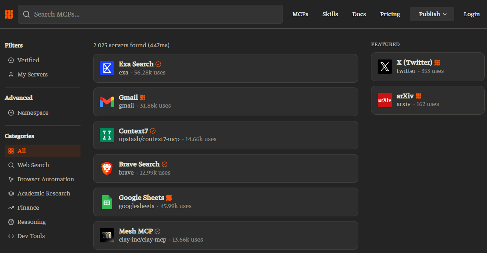

Предоставляет hosted-режим для удалённых серверов и готовые инсталляционные команды для большинства агентов.

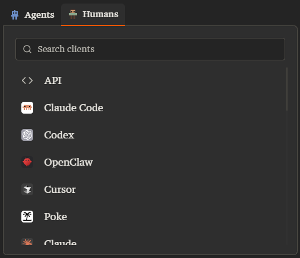

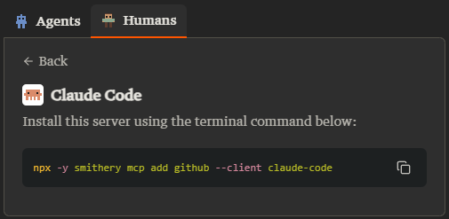

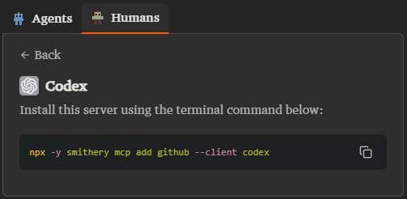

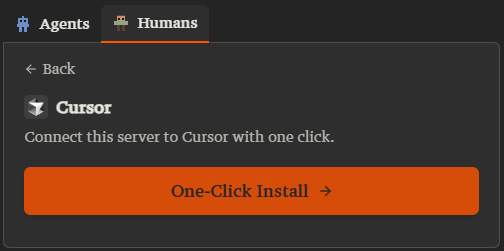

mcp-awesome.com — более 1 200 верифицированных серверов с руководствами по установке. Фокус на качестве, а не количестве.

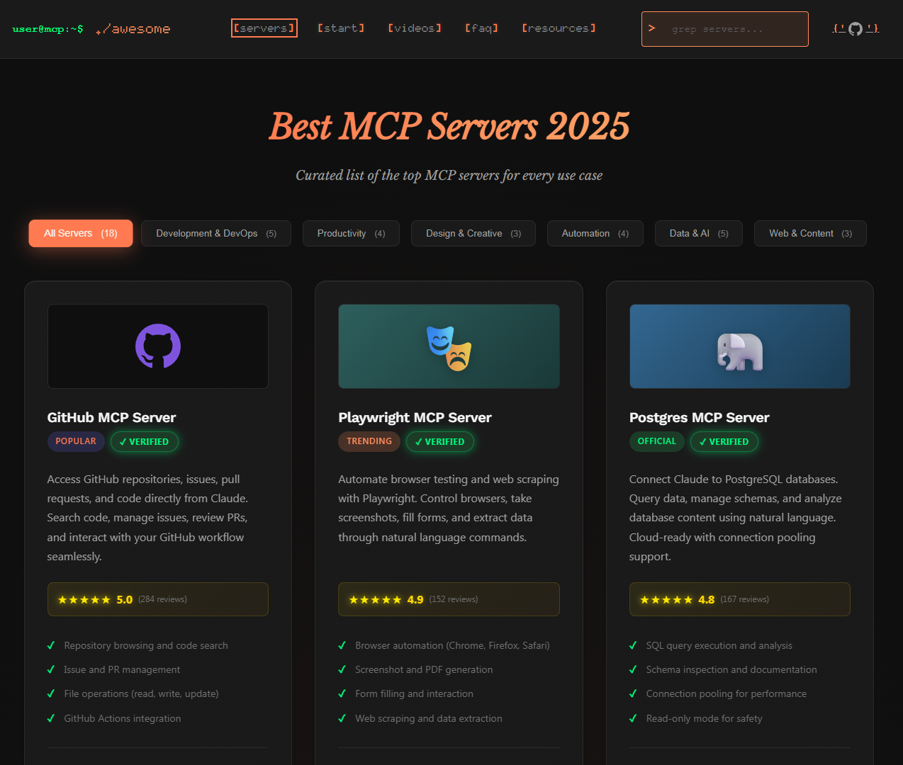

PulseMCP — агрегатор, который сравнивает серверы из 12+ источников. Если Smithery не нашёл, проверьте здесь.

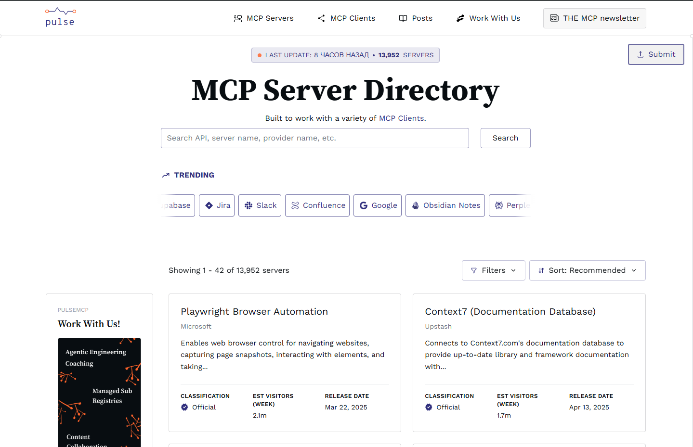

Официальный реестр Anthropic — reference-реализации самых распространённых серверов: Filesystem, Git, GitHub, PostgreSQL, SQLite, Brave Search, Fetch, Slack, Puppeteer, Memory. Это исходники, которым доверяют как базовым шаблонам: github.com/modelcontextprotocol/servers.

GitHub-коллекции:

	punkpeye/awesome-mcp-servers — более 85 000 звёзд, широкий охват категорий.
	wong2/awesome-mcp-servers — курируемый список с активной поддержкой.
	TensorBlock/awesome-mcp-servers — более 7 000 серверов, регулярные обновления.

Docker MCP Catalog — интегрирован в Docker Hub и Docker Desktop. Более 100 контейнеризованных серверов. Запуск без установки зависимостей на локальной машине — подробнее в практическом шаге этого урока.

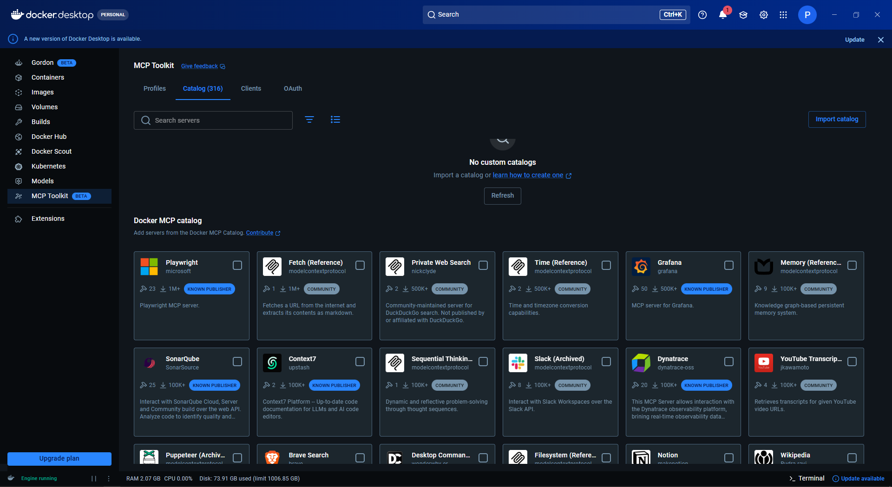

Как оценивать перед подключением

Не каждый сервер из каталога подходит для рабочего кейса. Перед подключением проверьте:

	Активность поддержки. Когда последний коммит? Отвечают ли на issues? Сервер с последним коммитом полгода назад и десятками открытых issues — риск. Часто признак брошенного проекта.
	Задокументированный контракт. Какие именно tools и resources предоставляет сервер? Какие параметры принимает каждый tool? Если это не описано — вы не знаете, что именно получит агент в контексте.
	Область видимости данных. К чему сервер имеет доступ? Filesystem-сервер читает всё, что вы укажете в пути. GitHub-сервер видит все репозитории, к которым относится токен. Нужно явно ограничить scope при настройке.
	Права доступа и секреты. Нужен ли API-ключ? Где он хранится — в переменной окружения или в конфиге? Никогда не кладите токены и ключи прямо в конфигурационный файл, который уходит в репозиторий.

---

## Шаг 2 (step_id=10121645, text)

Конфигурация MCP в разных инструментах

Каждый AI-инструмент хранит список MCP-серверов в своём конфигурационном файле. Форматы похожи, но пути и ключи объектов отличаются.

Чтобы не показывать абстрактные примеры, разберём конфигурацию на одном реальном сервере. Context7 — один из наиболее популярных community-серверов (~60 000 звёзд на GitHub). Решает конкретную боль AI-агентов: модели часто галлюцинируют несуществующие API или пишут код по устаревшей документации. Context7 подтягивает актуальную документацию нужной библиотеки прямо в контекст агента — с правильной версией и живыми примерами кода. Два инструмента: resolve-library-id находит библиотеку по имени, get-library-docs возвращает актуальное описание и примеры. Работает без API-ключа (с ограниченным rate limit) — ключ нужен только для повышенного лимита.

Как работает запуск MCP-сервера через npx

MCP-сервер описывается в конфиге не как URL, а как команда запуска: AI-инструмент сам стартует процесс сервера при открытии проекта и останавливает его при выходе. В конфиге вы указываете исполняемый файл и аргументы — всё остальное делает инструмент.

npx — это утилита из Node.js для запуска npm-пакетов без глобальной установки. При первом запуске она скачивает пакет, кэширует его и запускает. Флаг -y автоматически подтверждает загрузку, не спрашивая пользователя. @upstash/context7-mcp@latest — имя npm-пакета с указанием версии.

Что нужно для работы: Node.js версии 18 или новее. Проверить: node --version. Установить — с nodejs.org или через пакетный менеджер системы. На Windows, macOS и Linux поведение одинаковое — различий нет.

Откуда берётся команда. Команду запуска публикует сам автор пакета — в README репозитория или на странице npm. Smithery показывает её в своём каталоге, но в другом формате:

npx -y @smithery/cli mcp add upstash/context7-mcp --client claude-code

Это обёртка: Smithery CLI сам скачивает пакет, находит нужную команду запуска и записывает конфиг за вас. Удобно для первого знакомства, но требует аккаунта на Smithery. Прямой вариант через claude mcp add ... -- npx ... делает то же самое явно и без посредников — именно его мы будем использовать.

Ниже — как добавить Context7 в каждом инструменте.

Claude Code

Claude Code поддерживает три области видимости конфигурации:

	Проектная (.mcp.json в корне репозитория) — общая для команды, коммитится в git. Используйте для серверов, нужных всем участникам проекта.
	Пользовательская (~/.claude.json) — применяется глобально ко всем проектам текущего пользователя.
	Локальная — в ~/.claude.json с привязкой к конкретному пути проекта; приватна, не попадает в git.

Добавить через CLI. По умолчанию команда пишет в local scope — сервер сохраняется в ~/.claude.json с привязкой к текущему проекту и в git не попадает:

claude mcp add context7 -- npx -y @upstash/context7-mcp@latest

Чтобы сервер был общим для всей команды и коммитился в репозиторий, укажите явно --scope project — тогда запись уйдёт в .mcp.json в корне проекта:

claude mcp add --scope project context7 -- npx -y @upstash/context7-mcp@latest

Флаг --scope user пишет в ~/.claude.json без привязки к проекту — сервер будет доступен во всех проектах.

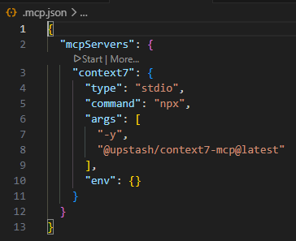

Или вручную в .mcp.json:

{
  "mcpServers": {
    "context7": {
      "type": "stdio",
      "command": "npx",
      "args": ["-y", "@upstash/context7-mcp@latest"]
    }
  }
}

Claude Code поддерживает подстановку переменных окружения прямо в конфиге: ${VAR} и ${VAR:-default}. Никогда не вставляйте токены как строки — только через переменные окружения.

После изменения конфига перезапустите Claude Code — изменения не применяются «на лету».

Cursor

В Cursor два уровня:

	Проектный: .cursor/mcp.json в корне репозитория.
	Глобальный: ~/.cursor/mcp.json — применяется ко всем проектам.

Добавить через UI: Cursor Settings → Tools & MCP → New MCP Server.

Формат .cursor/mcp.json:

{
  "mcpServers": {
    "context7": {
      "command": "npx",
      "args": ["-y", "@upstash/context7-mcp@latest"]
    }
  }
}

Важно: у Cursor есть лимит ~40 активных инструментов суммарно по всем серверам. При превышении агент теряет доступ к части из них — без явного предупреждения. Если подключаете несколько серверов, считайте суммарное количество tools.

Codex

Codex хранит конфигурацию MCP в TOML-файле, не в JSON:

	Глобально: ~/.codex/config.toml
	Проектно: .codex/config.toml (только в доверенных проектах)

Добавить через CLI: codex mcp add.

Секция в config.toml:

[mcp_servers.context7]
command = "npx"
args = ["-y", "@upstash/context7-mcp@latest"]
startup_timeout_sec = 10.0

 VS Code / GitHub Copilot

Требует режима Agent mode — в режимах Ask и Edit инструменты MCP невидимы.

Конфигурация через Settings → Extensions → GitHub Copilot → MCP, или вручную в .vscode/mcp.json (проектный уровень). VS Code синхронизирует настройки между устройствами через Settings Sync.

{
  "servers": {
    "context7": {
      "command": "npx",
      "args": ["-y", "@upstash/context7-mcp@latest"]
    }
  }
}

Обратите внимание: VS Code использует ключ "servers", а не "mcpServers" как в Cursor и Claude Code.

opencode

Конфигурация в ~/.config/opencode/opencode.json (глобально) или opencode.json в корне проекта.

{
  "mcp": {
    "context7": {
      "command": "npx",
      "args": ["-y", "@upstash/context7-mcp@latest"],
      "enabled": true,
    }
  }
}

Обязательный параметр enabled включает/выключает сервер.

Серверы описываются в объекте mcp — обратите внимание, не mcpServers

Roo Code

Конфигурация MCP хранится в JSON-файле:

	Проектный: .roo/mcp.json в корне репозитория.
	Глобальный: ~/Library/Application Support/Code/User/globalStorage/rooveterinaryinc.roo-cline/settings/cline_mcp_settings.json (macOS) или аналогичный путь в AppData на Windows.

Формат идентичен Cursor — объект mcpServers. Добавить сервер можно через UI: кнопка MCP Servers в боковой панели Roo Code → Edit MCP Settings.

{
  "mcpServers": {
    "context7": {
      "command": "npx",
      "args": ["-y", "@upstash/context7-mcp@latest"]
    }
  }
}

С 15 мая 2026 года Roo Code прекращает работу, его сменяет Kilo Code. При миграции конфигурация переносится из .roo/mcp.json в ключ mcp файла .kilo/kilo.jsonc — формат аналогичен, только меняется расположение.

Секреты в конфигурации

Правило одно для всех инструментов: токены и API-ключи — только через переменные окружения. В .env файле проекта или в системных переменных. Конфигурационный файл (.mcp.json, config.toml) можно и нужно коммитить в репозиторий — но без секретов внутри.

Для Context7 с API-ключом:

{
  "mcpServers": {
    "context7": {
      "command": "npx",
      "args": ["-y", "@upstash/context7-mcp@latest"],
      "env": {
        "CONTEXT7_API_KEY": "${CONTEXT7_KEY}"
      }
    }
  }
}

---

## Шаг 3 (step_id=10121646, text)

Типовые серверы и их сценарии применения

Официальные reference-серверы от Anthropic — хорошая отправная точка: они поддерживаются командой протокола, имеют документированный контракт и предсказуемое поведение. Поверх них существует большая экосистема community-серверов для специфичных сервисов.

Все серверы из этого списка реализуют открытый протокол MCP и работают с любым совместимым клиентом — Claude Code, Cursor, Roo Code, opencode и другими. Anthropic их написала, но не привязала к своим продуктам.

Официальные серверы (github.com/modelcontextprotocol/servers)

Filesystem — чтение и запись файлов в указанных директориях. Область видимости задаётся аргументами запуска: только те пути, которые вы явно передали, будут доступны серверу.

Возникает логичный вопрос: Claude Code и так умеет читать и писать файлы — зачем тогда отдельный сервер? Разница в том, как агент получает доступ. Встроенные инструменты Claude Code работают только внутри Claude Code. Filesystem MCP — это стандартный интерфейс: один и тот же сервер подключается к Cursor, Roo Code или любому другому клиенту без переконфигурации. Кроме того, он явно ограничивает область видимости переданными путями — агент не может выйти за их пределы, даже если попросить его об этом. Удобен, когда нужно дать агенту доступ к директориям вне репозитория: документации, экспортам, общим конфигам.

npx -y @modelcontextprotocol/server-filesystem /home/user/docs /home/user/exports

Git — история коммитов, diff, ветки, статус. Только чтение. Полезен, когда агенту нужен контекст о том, что менялось в кодовой базе, без доступа к GitHub-аккаунту.

GitHub — PR, issues, reviews, файлы репозитория через API. Требует Personal Access Token. Умеет создавать PR и issues — это tool с побочными эффектами, требует явного решения, когда агенту разрешено это делать.

PostgreSQL / SQLite — SQL-запросы к локальной или удалённой базе. PostgreSQL-сервер работает в режиме только для чтения по умолчанию. SQLite даёт полный доступ к локальному файлу базы. Для StudyFlow это ключевой сервер: агент может самостоятельно запрашивать прогресс студентов, статистику по урокам, данные о дедлайнах.

Brave Search / Fetch — поиск в интернете и загрузка содержимого URL. Fetch умеет конвертировать HTML в markdown прямо внутри агентной сессии.

Slack — отправка сообщений и чтение каналов. Высокий риск: агент может отправить сообщение — настраивайте с явными ограничениями.

Memory — персистентное key-value хранилище между сессиями. Агент сам решает, что запомнить. Полезно для накопления контекста о проекте через несколько рабочих сессий.

У Claude Code встроенная память есть двух видов. CLAUDE.md — файл с инструкциями, который пишет пользователь вручную; загружается в каждую сессию. Авто-память — Claude сам записывает полезные выводы в ~/.claude/projects/<project>/memory/MEMORY.md без участия пользователя; включена по умолчанию начиная с v2.1.59. Команда /memory позволяет просматривать и управлять обоими хранилищами. Memory MCP в первую очередь актуален для инструментов без встроенного механизма памяти — Cursor, Roo Code и других.

Puppeteer — управление браузером: навигация, клик, скриншоты, заполнение форм. Нужен для автоматизации тестирования UI или сбора данных с сайтов.

Популярные community-серверы

Context7 — актуальная документация библиотек прямо в контексте агента; разобрали установку и конфигурацию в предыдущем шаге.

Exa / Tavily — семантический поиск в интернете с лучшим качеством результатов, чем у стандартного Brave Search. Tavily заточен под поиск для AI-агентов.

Linear / Jira — чтение и создание задач в трекерах. Типичный сценарий: агент сам создаёт issue по найденному багу или читает контекст задачи при начале работы.

Docker MCP Catalog — запуск без локальной установки

Docker Desktop 4.42+ содержит встроенный MCP Toolkit. Это пункт меню в боковой панели Docker Desktop — не расширение и не плагин, а часть приложения.

Как работает:

	Откройте Docker Desktop → раздел MCP Toolkit в левом меню.
	Перейдите на вкладку Catalog.
	Найдите нужный сервер (Grafana, Neo4j, Elastic, Pulumi и другие).
	Нажмите Add — сервер запускается в изолированном контейнере.
	На вкладке Clients скопируйте готовую конфигурацию для вашего инструмента (Claude, Cursor и т.д.).

Преимущество: не нужно устанавливать Node.js, Python или зависимости сервера на локальную машину. Каждый сервер работает в изолированной среде. Особенно удобно для серверов с OAuth — Docker MCP Toolkit обрабатывает авторизацию через встроенный browser flow.

Docker описывают Docker MCP Catalog как «npm для AI-инструментов».

Выбор между official, community и Docker-сервером

	
		
			Критерий
			Official
			Community
			Docker Catalog
		
	
	
		
			Поддержка
			Команда MCP
			Автор/сообщество
			Vendor + Docker
		
		
			Установка
			npx / pip
			npx / pip
			Docker Desktop UI
		
		
			Изоляция
			Нет
			Нет
			Контейнер
		
		
			OAuth
			Ручная
			Ручная / зависит
			Встроенная

---

## Шаг 4 (step_id=10121647, text)

Практика: подключить первый сервер и задокументировать контракт

Цель этой практики — пройти полный цикл: подключить сервер, убедиться, что агент реально вызывает его инструменты, и зафиксировать контракт. Без документирования контракт остаётся непрозрачным: ни вы, ни агент не знаете точно, что именно стало доступным и в каком режиме.

В качестве основного примера используем StudyFlow подключая SQLite-сервер для чтения аналитики по студентам: база лежит в файле database/studyflow.db рядом с проектом. Если у вас нет базы данных — в шаге есть запасной вариант с Filesystem-сервером.

Все шаги показаны на Claude Code — он даёт CLI с явными командами подключения и проверки, которые удобно показать пошагово. Если вы работаете в Cursor или Codex, после каждого CLI-шага будет текстовая подсказка: что делать вместо команды и на что смотреть вместо скриншота.

Шаг 1. Выбрать сервер

Возьмите кандидата из карты, которую составили в предыдущем уроке. Если кандидата нет — выберите один из двух вариантов:

	SQLite-сервер — если у вас есть файл базы данных. Для StudyFlow это основной выбор: агент сможет самостоятельно запрашивать прогресс студентов, статистику по урокам и дедлайны без ручной передачи данных в контекст.
	Filesystem-сервер — если базы нет. Дайте доступ к директории с документами вне репозитория: конспектами, экспортами, архивами.

Не подключайте сразу несколько серверов. Один сервер — один понятный контракт.

Шаг 2. Подключить к инструменту

Для SQLite-mcp-сервера в StudyFlow запускаем  в терминале из корня проекта:

claude mcp add --scope project sqlite -- uvx mcp-server-sqlite --db-path ./database/studyflow.db

После выполнения команды Claude Code подтверждает добавление и показывает, что сервер записан в конфигурацию.

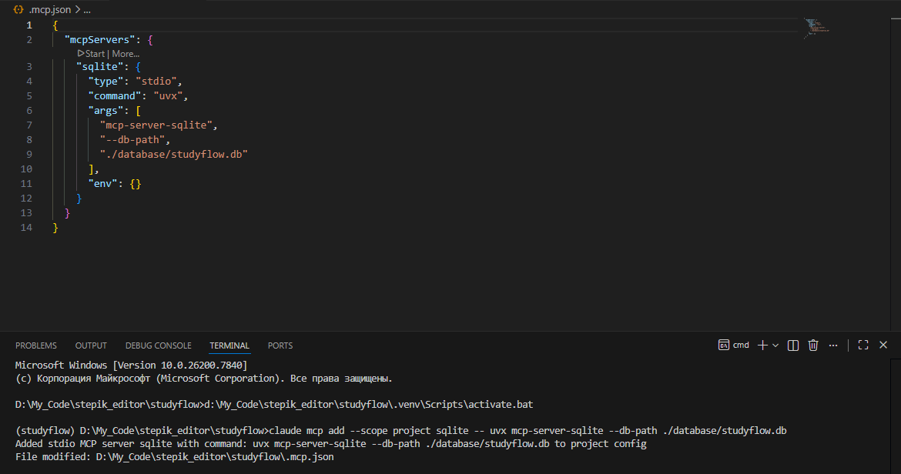

MCP-сервер для SQLite использует uvx (часть пакета uv) — не npx. В проекте uv уже установлен (он входит в requirements.txt), поэтому дополнительных шагов было не нужно. Если вы разворачиваете проект с нуля и uvx недоступен, установите его через pip:

pip install uv

Если используете Filesystem — замените команду на npx -y @modelcontextprotocol/server-filesystem /ваш/путь. Если у вас другой mcp сервер или host, ориентируйтесь на рекомендации из шага 2 для вашего инструмента и документацию mcp сервера.

В Cursor: откройте Settings → Features → MCP, нажмите Add new MCP server и добавьте конфигурацию в .cursor/mcp.json в корне проекта:

{
  "mcpServers": {
    "sqlite": {
      "command": "uvx",
      "args": ["mcp-server-sqlite", "--db-path", "./database/studyflow.db"]
    }
  }
}

В Codex: добавьте сервер в ~/.codex/config.toml:

[mcp_servers.sqlite]
command = "uvx"
args = ["mcp-server-sqlite", "--db-path", "./database/studyflow.db"]

Шаг 3. Убедиться, что сервер запустился

Для начала запустите в консоли claude и он предложит использовать вновь обнаруженные mcp

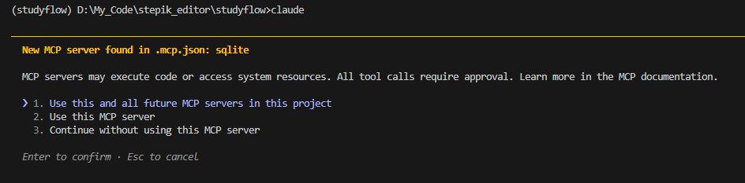

Выполните:

claude mcp list

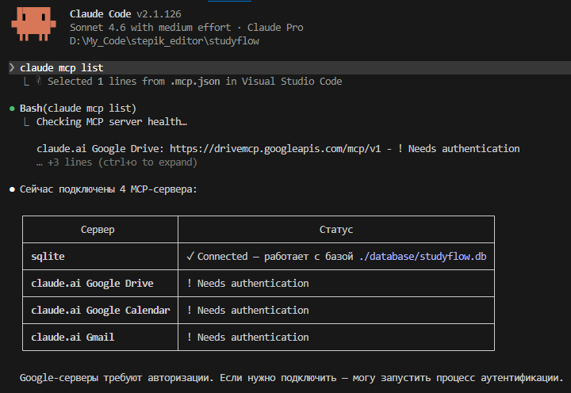

Сервер должен появиться в списке со статусом. Если статус показывает ошибку — проверьте строку подключения и доступность базы данных.

В Cursor: статус серверов виден прямо в разделе Settings → MCP — зелёная точка рядом с именем означает успешное подключение. В Codex: встроенной команды list нет; запустите codex и в первых строках инициализации будут перечислены подключённые серверы с их статусом.

Шаг 4. Провести read-only проход

Задайте агенту запросы по очереди. Не комбинируйте их в один — смотрите, как агент реагирует на каждый отдельно. В Claude Code агент явно показывает, какой tool он вызывает: это видно в интерфейсе как блок вызова инструмента с именем и аргументами.

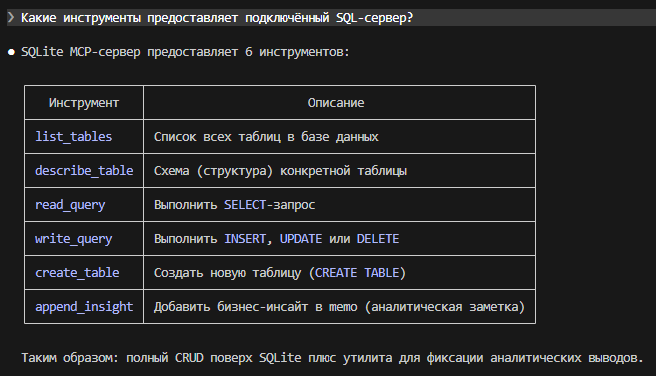

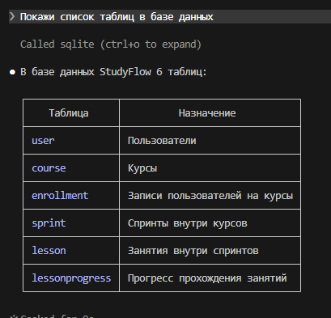

Для Filesystem можно проверить работоспособность, например такими запросами:

	«Перечисли файлы в директории /ваш/путь» — агент вызовет list_directory.
	«Покажи содержимое файла X» — агент вызовет read_file.
	«Найди файлы, в названии которых есть слово "отчёт"» — агент вызовет search_files.

Главное, что нужно зафиксировать: агент реально вызывает tool, а не придумывает ответ из своих знаний. Если блока вызова инструмента нет — сервер не подключился или агент не использует MCP в текущем режиме.

В Cursor: вызовы инструментов показаны как раскрывающиеся блоки с именем tool — разверните, чтобы увидеть аргументы запроса и ответ сервера. В Codex: каждый вызов выводится в терминале с именем инструмента и аргументами; по умолчанию Codex запрашивает подтверждение перед выполнением — это и есть сигнал, что MCP работает.

Шаг 5. Задокументировать контракт

Создайте файл docs/mcp-servers.md или добавьте раздел в существующий. Для SQLite / StudyFlow контракт выглядит так:

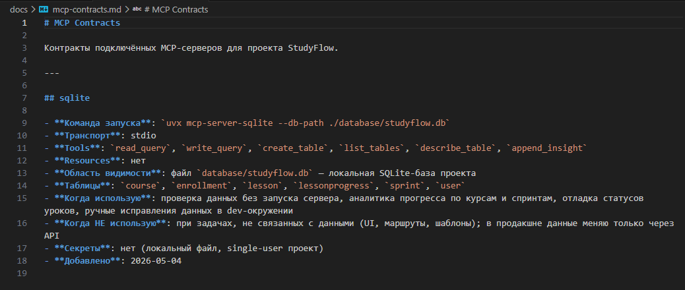

Если используете Filesystem — адаптируйте поля под ваши пути и список tools: обычно это read_file, write_file, list_directory, search_files, get_file_info.

Результат практики

В конце у вас должно быть:

	Работающее подключение одного сервера в вашем инструменте.
	Заполненный раздел в docs/mcp-servers.md с контрактом.

Не переходите к write-операциям до урока 08-04, где разбираем управление правами доступа.

---

## Шаг 5 (step_id=10121648, choice)

Какой критерий оценки стороннего MCP-сервера отвечает на вопрос «что именно получит агент в контексте»?

**Тип:** choice (single)

**Варианты:**
- [✓ правильный] Задокументированный контракт: tools и их параметры
-  Дата последнего коммита и ответы на issues
-  Область видимости: к каким данным имеет доступ сервер
-  Место хранения секретов: конфиг или переменная окружения

**Статус Stepik:** `correct` (score 1.0)

**Мой reasoning:** _В теории прямо сказано: 'Какие именно tools и resources предоставляет сервер? Какие параметры принимает каждый tool? Если это не описано — вы не знаете, что именно получит агент в контексте.' Это дословно отвечает на вопрос._

---

## Шаг 6 (step_id=10121649, choice)

Чем PulseMCP отличается от Smithery и mcp-awesome.com?

**Тип:** choice (single)

**Варианты:**
-  Показывает готовые инсталляционные команды для агентов
-  Предлагает hosted-режим для удалённых MCP-серверов
- [✓ правильный] Агрегирует серверы из более чем 12 источников
-  Содержит только верифицированные серверы с руководствами

**Статус Stepik:** `correct` (score 1.0)

**Мой reasoning:** _В теории прямо сказано: «PulseMCP — агрегатор, который сравнивает серверы из 12+ источников». Hosted-режим и инсталляционные команды — про Smithery, верификация с руководствами — про mcp-awesome.com._

---

## Шаг 7 (step_id=10121650, choice)

Что отличает Smithery от GitHub-коллекций MCP-серверов?

**Тип:** choice (single)

**Варианты:**
-  Smithery работает только с Claude Code
- [✓ правильный] Smithery предоставляет hosted-режим со встроенным OAuth
-  Smithery показывает только официальные серверы Anthropic
-  Smithery индексирует больше репозиториев

**Статус Stepik:** `correct` (score 1.0)

**Мой reasoning:** _В теории прямо сказано: Smithery имеет встроенный OAuth без необходимости реализовывать авторизацию самостоятельно и предоставляет hosted-режим для удалённых серверов. GitHub-коллекции — это просто списки репозиториев без такой инфраструктуры._

---

## Шаг 8 (step_id=10121651, choice)

Почему количество звёзд на GitHub — недостаточный критерий для выбора MCP-сервера?

**Тип:** choice (single)

**Варианты:**
-  GitHub не отображает звёзды для приватных форков
-  Звёзды накручиваются ботами, их нельзя верифицировать
- [✓ правильный] Звёзды не говорят об активности и контракте сервера
-  Звёзды отражают только популярность среди разработчиков

**Статус Stepik:** `correct` (score 1.0)

**Мой reasoning:** _В теории прямо указано: перед подключением нужно проверять активность поддержки (последний коммит, ответы на issues) и задокументированный контракт (tools, resources, параметры). Звёзды этих критериев не отражают._

---

## Шаг 9 (step_id=10121652, choice)

Чем отличается проектный scope MCP от пользовательского?

**Тип:** choice (single)

**Варианты:**
- [✓ правильный] Проектный коммитится в репозиторий
-  Проектный поддерживает только JSON-формат
-  Проектный хранится в зашифрованном виде
-  Проектный работает быстрее при запуске

**Статус Stepik:** `correct` (score 1.0)

**Мой reasoning:** _В теории явно сказано: проектная область видимости (.mcp.json в корне репозитория) общая для команды и коммитится в git, тогда как пользовательская хранится в ~/.claude.json и применяется только для текущего пользователя._

---

## Шаг 10 (step_id=10121653, choice)

Где следует хранить токены и API-ключи при настройке MCP-серверов?

**Тип:** choice (single)

**Варианты:**
- [✓ правильный] В переменных окружения или в .env файле
-  Только в системных переменных, не в .env файле
-  Прямо в конфигурационном файле как строка
-  В зашифрованном хранилище инструмента

**Статус Stepik:** `correct` (score 1.0)

**Мой reasoning:** _Теория прямо говорит: 'токены и API-ключи — только через переменные окружения. В .env файле проекта или в системных переменных.' Прямое хранение в конфиге запрещено._

---

## Шаг 11 (step_id=10121654, choice)

Какую проблему решает Context7 MCP-сервер?

**Тип:** choice (single)

**Варианты:**
-  Хранит историю запросов между сессиями агента
-  Ускоряет загрузку файлов из репозитория
- [✓ правильный] Подтягивает актуальную документацию библиотек в контекст
-  Ограничивает доступ агента к конфиденциальным файлам проекта

**Статус Stepik:** `correct` (score 1.0)

**Мой reasoning:** _В теории прямо сказано, что Context7 решает боль галлюцинаций и устаревшей документации, подтягивая актуальные доки нужной библиотеки в контекст агента через инструменты resolve-library-id и get-library-docs._

---

## Шаг 12 (step_id=10121655, choice)

Какое преимущество Docker MCP Catalog по сравнению с npx-установкой?

**Тип:** choice (single)

**Варианты:**
-  Поддерживает больший список серверов, чем Smithery
- [✓ правильный] Сервер работает в контейнере без установки зависимостей
-  Серверы запускаются быстрее за счёт кэширования
-  Автоматически обновляет сервер до последней доступной версии

**Статус Stepik:** `correct` (score 1.0)

**Мой reasoning:** _В теории прямо сказано: преимущество Docker MCP Catalog — не нужно устанавливать Node.js, Python или зависимости сервера на локальную машину, каждый сервер работает в изолированной среде._

---

## Шаг 13 (step_id=10121656, choice)

Зачем при запуске Filesystem MCP-сервера явно передавать только нужные пути?

**Тип:** choice (single)

**Варианты:**
- [✓ правильный] Агент не сможет выйти за пределы этих путей
-  Это ускоряет поиск по файловой системе
-  Это единственный способ запустить сервер
-  Пути нужны для генерации конфигурационного файла

**Статус Stepik:** `correct` (score 1.0)

**Мой reasoning:** _В теории явно сказано, что Filesystem MCP ограничивает область видимости переданными путями — агент не может выйти за их пределы, даже если попросить. Это и есть смысл явной передачи путей._

---

## Шаг 14 (step_id=10121657, choice)

Почему при использовании GitHub MCP-сервера нужно явно ограничивать права агента?

**Тип:** choice (single)

**Варианты:**
- [✓ правильный] Агент может создавать PR и issues — это побочные эффекты
-  Сервер по умолчанию отключает write-операции
-  GitHub-сервер требует платный план API
-  GitHub-сервер имеет доступ только к публичным репозиториям

**Статус Stepik:** `correct` (score 1.0)

**Мой reasoning:** _В теории прямо сказано: GitHub-сервер умеет создавать PR и issues — это tool с побочными эффектами, который требует явного решения, когда агенту разрешено это делать._

---
