# Урок 3. MCP в инженерных сценариях

_lesson_id: 2289252 · steps: 14 · ttc: Nones_

---

## Шаг 1 (step_id=9817290, text)

Когда нужен собственный MCP-сервер

После предыдущего урока у вас уже подключён один готовый сервер. Прежде чем строить собственный, стоит ответить честно: а нужен ли он вообще? Собственная реализация — это инженерный артефакт, который нужно тестировать, поддерживать и документировать.

Когда собственный сервер оправдан

Уникальный внутренний источник данных. Корпоративный CRM, внутренний API, данные из нестандартного хранилища, которые нельзя получить через Filesystem или SQL — здесь готового сервера нет по определению. Если данные специфичны для компании или проекта, их никто не обернул в публичный пакет.

Точный контроль над тем, что видит агент. Иногда нужно не просто отдать данные, а преобразовать их: сгруппировать, отфильтровать, изменить формат. Агент должен получать именно то представление данных, которое полезно для задачи — не сырой дамп таблицы.

Специфичный формат ответа. Когда агенту нужен структурированный JSON с конкретными полями, а не текст из базы, собственный сервер позволяет гарантировать этот формат через схему.

Внутренний API без публичного SDK. Если у компании есть REST API без MCP-обёртки — сервер с одним tool может закрыть задачу быстрее, чем любая другая интеграция.

Когда собственный сервер избыточен

Готовый сервер покрывает задачу. Если Filesystem-сервер даёт доступ к нужным файлам, а GitHub-сервер — к нужным PR, не нужно писать обёртку поверх.

Задача решается skill или command. Если нужна только процедура — способ задать вопрос агенту или стандартизировать запрос — MCP-сервер избыточен. Вспомните матрицу из 08-01.

Сервер нужен для одного разового прохода. Если данные нужны один раз, проще передать их в контекст вручную, чем строить сервер.

Это просто интересно построить. «Интересно» — не инженерный аргумент. Каждый созданный сервер требует поддержки.

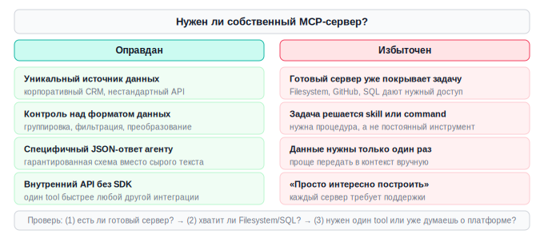

Предварительная проверка

Перед началом реализации задайте себе три вопроса:

	Нет ли готового сервера в Smithery.ai, Docker Catalog или modelcontextprotocol/servers?
	Нельзя ли решить задачу Filesystem-сервером с нужным путём или SQL-сервером с нужной базой?
	Покроет ли один tool или один resource то, что нужно, — или вы уже думаете о полноценной MCP-платформе?

Если после проверки ответ на вопрос 1 и 2 — «нет», а на вопрос 3 — «один tool», тогда собственный сервер оправдан. Начните с минимума.

---

## Шаг 2 (step_id=10121658, text)

MCP-сервер на Python: tool, resource и prompt

Начнём с минимального tool, добавим resource, prompt, и проверим через Inspector.

Структура проекта

Создайте отдельную папку mcp_server/ в корне вашего проекта:

mcp_server/
  server.py          # код сервера
  requirements.txt   # mcp>=1.2.0
  README.md          # контракт: что делает, какие параметры принимает

Всё дальнейшее пишется в mcp_server/server.py.

Установка

pip install mcp

FastMCP — высокоуровневая обёртка, встроенная в официальный Python SDK MCP. Ничего дополнительного устанавливать не нужно.

Tool: вызов с возможным побочным эффектом

Агент вызывает tool как функцию с параметрами и получает структурированный ответ.

from mcp.server.fastmcp import FastMCP

mcp = FastMCP("dev-tools")

@mcp.tool()
def check_service_health(service: str) -> dict:
    """Проверить состояние сервиса по имени."""
    statuses = {
        "api":   {"status": "ok",       "latency_ms": 42},
        "db":    {"status": "ok",       "latency_ms": 5},
        "cache": {"status": "degraded", "latency_ms": 380},
    }
    result = statuses.get(service)
    if not result:
        raise ValueError(f"Service '{service}' not found")
    return result

if __name__ == "__main__":
    print("MCP server 'dev-tools' started")
    mcp.run()

FastMCP читает аннотации типов и docstring и автоматически генерирует JSON-схему. Агент увидит параметры, типы и описание без дополнительных объявлений.

Resource: данные только для чтения

Resource — данные по URI, которые агент читает без побочных эффектов. Если нужно что-то изменить — это tool.

Шаблонный resource с параметром из URI:

import json

@mcp.resource("config://{env}")
def get_env_config(env: str) -> str:
    """Конфигурация для указанного окружения."""
    configs = {
        "dev":  {"debug": True,  "db_host": "localhost"},
        "prod": {"debug": False, "db_host": "db.internal"},
    }
    config = configs.get(env)
    if not config:
        raise ValueError(f"Unknown environment: '{env}'")
    return json.dumps(config, ensure_ascii=False)

Агент обращается по URI: config://dev или config://prod. FastMCP автоматически извлекает параметры из пути.

Статический resource без параметров:

@mcp.resource("config://services")
def list_services() -> str:
    """Список всех зарегистрированных сервисов."""
    return json.dumps(["api", "db", "cache", "worker"])

Prompt: шаблон из сервера

Prompt — шаблон, который сервер отдаёт агенту по имени. Агент подставляет параметры и получает готовый текст. Имеет смысл, когда шаблон логически связан с данными, которые сервер уже обслуживает.

@mcp.prompt()
def analyze_slow_query(sql: str) -> str:
    """Шаблон для анализа медленного SQL-запроса."""
    return f"""Проанализируй этот SQL-запрос и предложи оптимизации.
Учти: индексы, N+1 проблемы, возможность использования CTE.

Запрос:
{sql}

Формат ответа: краткое объяснение проблемы, конкретное исправление, ожидаемый эффект."""

Tool, resource или prompt — выбор сводится к одному: нужно ли что-то изменить? Если да — tool. Если прочитать статичные данные — resource. Если отдать шаблон запроса — prompt.

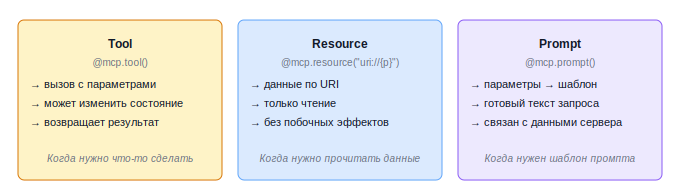

Запуск

python server.py

Сервер молчит — это нормально. Он ждёт MCP-сообщений через stdin; прямой вывод не предусмотрен.

Проверка через Inspector

npx @modelcontextprotocol/inspector@latest python server.py

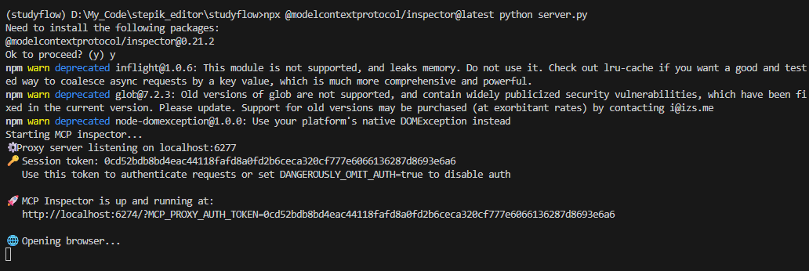

После запуска автоматически откроется, адрес инспектора http://localhost:6277.

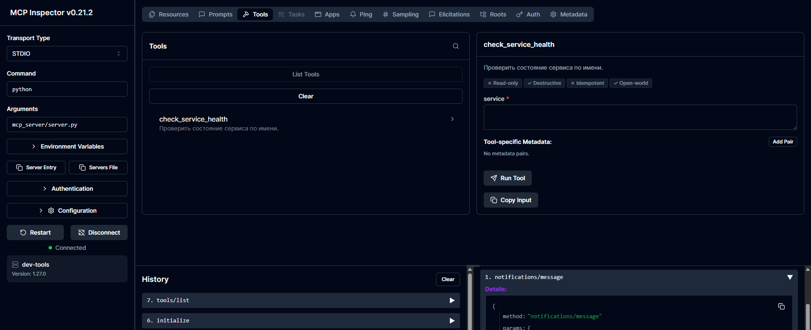

Если запустили не из подпапки с сервером, нужно будет поправить путь до файла server.py. Далее в панели Tools должен появиться check_service_health. Вызовите с service: "api" — должен прийти ответ.

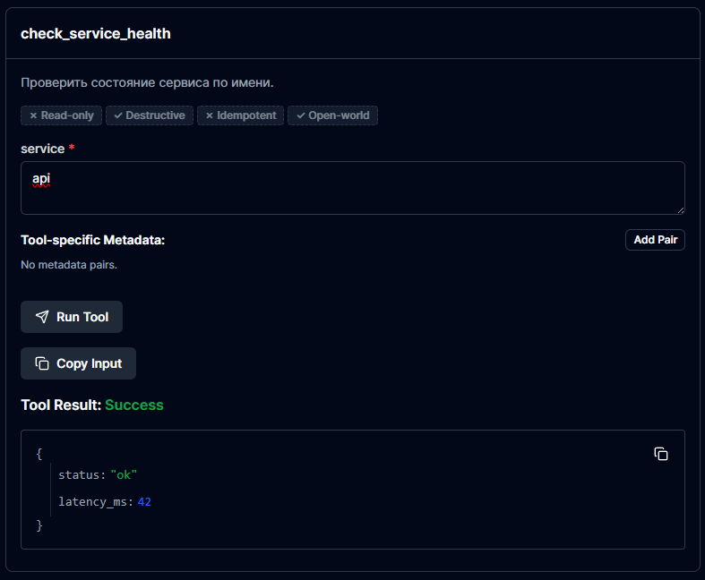

Попробуйте несуществующее имя — должна вернуться ошибка, не crash.

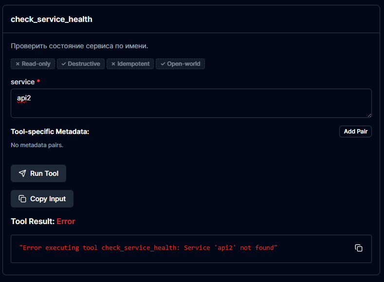

На вкладке Resources проверьте config://dev и config://services.

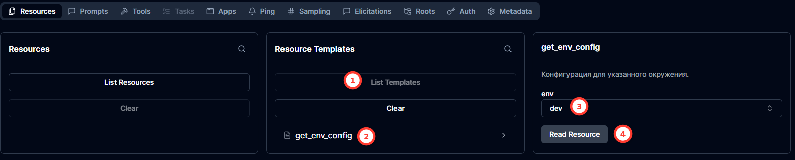

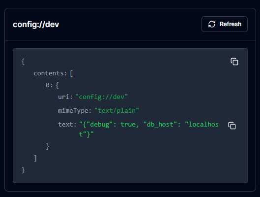

На вкладке Prompts вызовите analyze_slow_query с любым SQL.

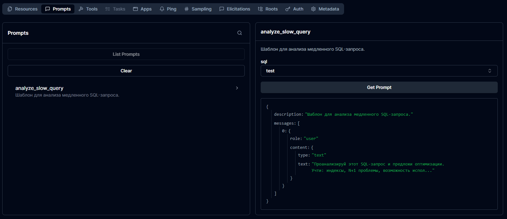

Частые ошибки

Tool не появляется в Inspector. Декоратор — @mcp.tool(), скобки обязательны. @mcp.tools и @tool не работают.

Inspector не подключается. Проверьте, что запускаете интерпретатор из виртуального окружения: .venv/Scripts/python server.py (Windows) или .venv/bin/python server.py (Unix).

Ответ tool не принимается. FastMCP оборачивает dict автоматически, но только при корректных аннотациях. Убедитесь, что тип возврата указан в сигнатуре.

Регистрация в агенте

Чтобы Claude Code или другой MCP-совместимый инструмент увидел сервер, добавьте запись в конфигурацию агента. Отличия оформления в разных агентах разбирали на прошлом уроке. Для Claude code это будет выглядеть так:

{
  "mcpServers": {
    "my-project-tools": {
      "type": "stdio",
      "command": "python",
      "args": ["mcp_server/server.py"]
    }
  }
}

Поле command — это интерпретатор. Если используете виртуальное окружение, укажите полный путь: .venv/Scripts/python (Windows) или .venv/bin/python (Unix). После добавления записи перезапустите агентат — сервер появится в списке доступных MCP-серверов.

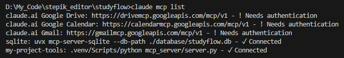

---

## Шаг 3 (step_id=10121659, text)

TypeScript-вариант и другие языки

TypeScript SDK реализует тот же протокол MCP, но с двумя принципиальными отличиями: схема параметров объявляется явно через Zod, а ответы не оборачиваются автоматически — их нужно формировать вручную. Для других экосистем есть официальные SDK на Go, Rust, Java и C#.

Установка

npm install @modelcontextprotocol/sdk zod

Tool

import { McpServer } from "@modelcontextprotocol/sdk/server/mcp.js";
import { StdioServerTransport } from "@modelcontextprotocol/sdk/server/stdio.js";
import { z } from "zod";

const server = new McpServer({ name: "dev-tools", version: "1.0.0" });

server.registerTool(
  "check_service_health",
  {
    description: "Проверить состояние сервиса по имени",
    inputSchema: { service: z.string() },
  },
  async ({ service }) => {
    const statuses: Record<string, object> = {
      api:   { status: "ok",       latency_ms: 42  },
      db:    { status: "ok",       latency_ms: 5   },
      cache: { status: "degraded", latency_ms: 380 },
    };
    const result = statuses[service];
    if (!result) throw new Error(`Service '${service}' not found`);
    return { content: [{ type: "text", text: JSON.stringify(result) }] };
  }
);

Resource

import { ResourceTemplate } from "@modelcontextprotocol/sdk/server/mcp.js";

server.registerResource(
  "env-config",
  new ResourceTemplate("config://{env}", { list: undefined }),
  { description: "Конфигурация для указанного окружения" },
  async (uri, { env }) => {
    const configs: Record<string, object> = {
      dev:  { debug: true,  db_host: "localhost" },
      prod: { debug: false, db_host: "db.internal" },
    };
    const config = configs[env as string];
    if (!config) throw new Error(`Unknown environment: '${env}'`);
    return { contents: [{ uri: uri.href, text: JSON.stringify(config) }] };
  }
);

server.registerResource(
  "services-list",
  "config://services",
  { description: "Список всех зарегистрированных сервисов" },
  async (uri) => ({
    contents: [{ uri: uri.href, text: JSON.stringify(["api", "db", "cache", "worker"]) }],
  })
);

Prompt

server.registerPrompt(
  "analyze_slow_query",
  {
    description: "Шаблон для анализа медленного SQL-запроса",
    argsSchema: { sql: z.string() },
  },
  ({ sql }) => ({
    messages: [{
      role: "user",
      content: {
        type: "text",
        text: `Проанализируй этот SQL-запрос и предложи оптимизации.\nУчти: индексы, N+1 проблемы, возможность использования CTE.\n\nЗапрос:\n${sql}`,
      },
    }],
  })
);

const transport = new StdioServerTransport();
await server.connect(transport);

Проверка через Inspector после сборки:

npx @modelcontextprotocol/inspector@latest node dist/server.js

Ключевые отличия от Python

	
		
			Аспект
			Python (FastMCP)
			TypeScript
		
	
	
		
			Схема параметров
			Из аннотаций типов автоматически
			Явная Zod-схема в inputSchema / argsSchema
		
		
			Ответ tool
			Dict — FastMCP оборачивает автоматически
			Явный объект { content: [...] }
		
		
			Ответ resource
			Строка — FastMCP оборачивает автоматически
			Явный объект { contents: [{ uri, text }] }
		
		
			Запуск
			python server.py
			Сборка через tsc, затем node dist/server.js
		
		
			Когда выбрать
			Бизнес-логика и данные на Python
			Node/React-стек, фронтенд-интеграции
		
	

Другие языки

Все SDK реализуют один протокол — tool на Go агент воспринимает так же, как Python-tool. Выбор языка определяется только экосистемой проекта.

	
		
			Язык
			SDK / пакет
			Когда выбрать
		
	
	
		
			Go
			github.com/modelcontextprotocol/go-sdk
			Go-микросервисы, быстрый холодный старт
		
		
			Rust
			rmcp (crates.io)
			Системные задачи, максимальная производительность
		
		
			Java / Kotlin
			io.modelcontextprotocol:mcp
			JVM-стек, Spring Boot приложения
		
		
			C# / .NET
			ModelContextProtocol (NuGet)
			.NET-стек, Azure-интеграции
		
	

Python и TypeScript лучше документированы и покрыты примерами. Go и Rust выбирают, когда кодовая база уже на этих языках.

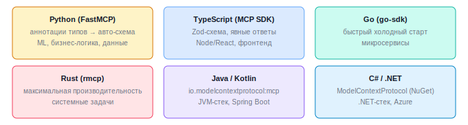

---

## Шаг 4 (step_id=10121660, text)

Практика: собственный сервер

Теоретические шаги урока уже провели через полный цикл: tool, resource, prompt, Inspector, подключение к агенту. Практика — применить это к своему проекту. Но сначала — та же проверка, что в 08-03-01: нужен ли вам собственный сервер?

Вариант А: в проекте есть реальный кандидат

Если у вас есть уникальный источник данных, внутренний API или специфичный формат, который готовые серверы не покрывают, — ваш путь прямой. Возьмите один конкретный сценарий: один вопрос, который агент сейчас не может решить без вашей помощи.

Реализуйте один tool или один resource — не стройте полный сервер сразу. Пройдите приёмку через Inspector: нормальный вызов возвращает ожидаемый ответ, невалидный — ошибку, не crash. Подключите к агенту и задайте вопрос, для которого нужен именно ваш tool. Убедитесь, что агент вызывает его, а не отвечает из головы.

Вариант Б: в проекте MCP-сервер не нужен — тренируемся на заглушках

Это нормальная ситуация, а не недостаток. Если Filesystem, GitHub или SQL-сервер уже покрывают ваши задачи, писать собственный нет смысла. Но пройти механику один раз полезно — потом, когда появится реальный кандидат, не придётся начинать с нуля.

Создайте минимальный тренировочный сервер без привязки к проекту. Хорошая точка входа — два компонента:

	Tool get_project_stats, который читает данные из простого JSON-файла. Файл с данными создайте вручную — это имитация внутреннего источника.
	Resource config://{env} с фиктивными конфигурациями dev и prod.

Запустите Inspector, проверьте нормальный вызов и вызов с несуществующим параметром — убедитесь, что сервер отвечает ошибкой, а не падает. Подключите к агенту и задайте один вопрос, использующий tool. На этом можно останавливаться — цель не в результате, а в том, чтобы пройти весь путь от кода до первого реального вызова.

Что в StudyFlow

StudyFlow прошёл по варианту А. Уникальный источник нашёлся: данные курсов с платформы Stepik. SQLite MCP даёт агенту доступ к локальной базе прогресса, но он не знает ничего о курсах на Stepik — расписании обновлений, структуре модулей, датах. Именно это закрывает собственный MCP-сервер.

Сервер расположен в mcp_server/stepik_mcp.py и реализует инструмент получения списка курсов со структурой модулей и расписанием уроков:

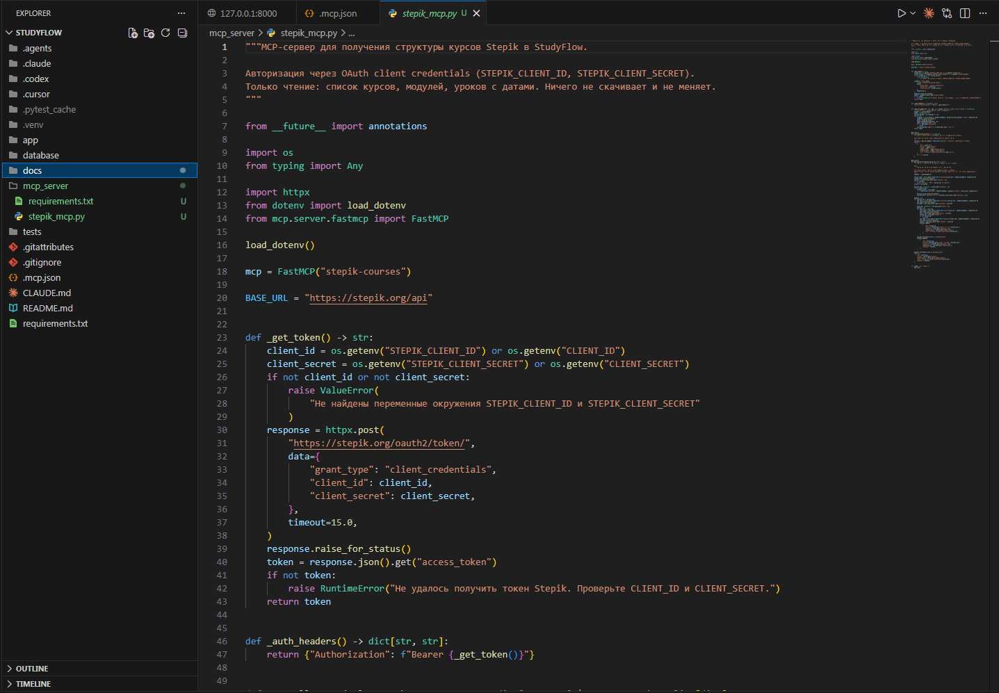

Авторизация — OAuth client credentials: необходимы STEPIK_CLIENT_ID и STEPIK_CLIENT_SECRET в .env. Ключи создаются в настройках аккаунта Stepik → Приложения → Новое приложение.

Для реализации этого сервера полезно было дать агенту документацию API платформы Stepik, чтобы он знал контракты, на которые нужно опираться при генерации кода для mcp сервера.

Регистрация в Claude Code:

{
  "mcpServers": {
    "stepik-courses": {
      "type": "stdio",
      "command": "python",
      "args": ["mcp_server/stepik_mcp.py"]
    }
  }
}

После подключения агент получает возможность считывать информацию о курсах пользователя и добавлять её в studyflow или отвечать на вопросы вроде «покажи структуру курса 123456» без ручного копирования данных.

Результат практики

	Вариант А: один рабочий tool или resource в вашем проекте, Inspector показывает корректный ответ и корректную ошибку, сервер подключён и отвечает на запрос агента.
	Вариант Б: тренировочный сервер с заглушками, Inspector пройден, агент успешно вызывает tool.

---

## Шаг 5 (step_id=10121661, choice)

В каком случае создание собственного MCP-сервера оправдано?

**Тип:** choice (single)

**Варианты:**
- [✓ правильный] У компании есть внутренний API без публичного MCP-сервера
-  Готовый сервер есть, но хочется разобраться, как он устроен
-  Задача решается Filesystem-сервером с нужным путём
-  Нужна стандартная процедура code review

**Статус Stepik:** `correct` (score 1.0)

**Мой reasoning:** _В теории прямо указано: внутренний API без публичного SDK — оправданный случай, когда сервер с одним tool закрывает задачу. Остальные варианты явно отнесены к избыточным или не относящимся к делу._

---

## Шаг 6 (step_id=10121662, choice)

Что такое FastMCP в контексте Python MCP SDK?

**Тип:** choice (single)

**Варианты:**
- [✓ правильный] Высокоуровневый интерфейс, встроенный в официальный пакет <code>mcp</code>
-  Отдельная библиотека, альтернативная официальному SDK
-  Фреймворк для TypeScript-серверов
-  Инструмент для тестирования серверов

**Статус Stepik:** `correct` (score 1.0)

**Мой reasoning:** _В теории прямо сказано: «FastMCP — высокоуровневая обёртка, встроенная в официальный Python SDK MCP. Ничего дополнительного устанавливать не нужно»._

---

## Шаг 7 (step_id=10121663, choice)

Какой формат должен возвращать MCP tool?

**Тип:** choice (single)

**Варианты:**
-  JSON-строку с произвольной структурой
-  Обычный dict или строку Python
-  Список параметров следующего вызова
- [✓ правильный] Объект с полем <code>content</code> — массивом блоков с <code>type</code> и <code>text</code>

**Статус Stepik:** `correct` (score 1.0)

**Мой reasoning:** _В теории явно показан формат ответа MCP tool: { content: [{ type: "text", text: ... }] }. В Python FastMCP оборачивает dict автоматически именно в эту структуру, а в TypeScript её нужно формировать вручную — это и есть канонический формат ответа tool по протоколу MCP._

---

## Шаг 8 (step_id=10121664, choice)

Чем resource отличается от tool в MCP?

**Тип:** choice (single)

**Варианты:**
-  Resource быстрее, tool медленнее
-  Resource обязательно возвращает файл, tool — JSON
- [✓ правильный] Resource не имеет побочных эффектов и адресуется URI
-  Tool доступен только в Claude Code, resource — в любом инструменте

**Статус Stepik:** `correct` (score 1.0)

**Мой reasoning:** _В теории прямо сказано: resource — данные по URI, которые агент читает без побочных эффектов; если нужно что-то изменить — это tool._

---

## Шаг 9 (step_id=10121665, choice)

Как TypeScript MCP SDK получает схему параметров tool?

**Тип:** choice (single)

**Варианты:**
-  Из JSON Schema в соседнем файле
-  Из конфигурационного файла проекта
- [✓ правильный] Из явной Zod-схемы в поле inputSchema
-  Из аннотаций типов, как в Python FastMCP

**Статус Stepik:** `correct` (score 1.0)

**Мой reasoning:** _В теории прямо указано: в TypeScript SDK схема параметров объявляется явно через Zod в поле inputSchema, в отличие от Python FastMCP, где она выводится из аннотаций типов._

---

## Шаг 10 (step_id=10121666, choice)

Как запустить MCP Inspector для Python-сервера?

**Тип:** choice (single)

**Варианты:**
-  <code>mcp inspect server.py</code>
-  <code>npx mcp-test python server.py</code>
-  <code>npx @modelcontextprotocol/inspector@latest python server.py</code>
-  <code>python -m mcp.inspector server.py</code>

**Статус Stepik:** `correct` (score 1.0)

**Мой reasoning:** _В теории урока прямо указана эта команда для проверки сервера через Inspector. Остальные варианты — выдуманные команды, которых в материале нет._

---

## Шаг 11 (step_id=10121667, choice)

Что нужно проверить при приёмке собственного сервера через Inspector?

**Тип:** choice (single)

**Варианты:**
-  Формат ответа соответствует документации
- [✓ правильный] Каждый tool вызван, граничные значения — ошибка, не crash
-  Сервер корректно отвечает агенту после подключения к Claude
-  Сервер запускается и не выводит ошибок в консоль

**Статус Stepik:** `correct` (score 1.0)

**Мой reasoning:** _В теории прямо сказано: при приёмке через Inspector проверяется, что нормальный вызов возвращает ожидаемый ответ, а невалидный — ошибку, не crash. Остальные варианты либо не относятся к приёмке через Inspector, либо описывают следующий шаг (подключение к агенту)._

---

## Шаг 12 (step_id=10121668, choice)

Как агент узнаёт о собственном MCP-сервере после его создания?

**Тип:** choice (single)

**Варианты:**
- [✓ правильный] Через запись в конфигурационном файле агента
-  Через команду mcp register в терминале
-  Сервер регистрируется автоматически при запуске
-  Через переменную окружения MCP_SERVER_PATH

**Статус Stepik:** `correct` (score 1.0)

**Мой reasoning:** _В уроке прямо указано: чтобы Claude Code или другой MCP-совместимый инструмент увидел сервер, нужно добавить запись в конфигурацию агента (mcpServers) и перезапустить его._

---

## Шаг 13 (step_id=10121669, matching)

Соотнесите сценарий с наиболее подходящим языком MCP SDK.

**Тип:** matching

**Колонка А (вопросы):**
- Микросервисы с быстрым холодным стартом
- Системные задачи, максимальная производительность
- JVM-стек и Spring Boot приложения
- Azure-интеграции и Windows-экосистема

**Колонка Б (варианты, перемешаны):**
- C#/.NET
- Java/Kotlin
- Go
- Rust

**Правильные пары:**
- Микросервисы с быстрым холодным стартом → Go
- Системные задачи, максимальная производительность → Rust
- JVM-стек и Spring Boot приложения → Java/Kotlin
- Azure-интеграции и Windows-экосистема → C#/.NET

**Статус Stepik:** `correct` (score 1.0)

**Мой reasoning:** _В теории прямо указано: Go — микросервисы и быстрый холодный старт, Rust — системные задачи и максимальная производительность, Java/Kotlin — JVM и Spring Boot, C#/.NET — Azure-интеграции._

---

## Шаг 14 (step_id=10121670, choice)

Что нужно проверить перед созданием собственного MCP-сервера?

**Тип:** choice (multiple)

**Варианты:**
- [✓ правильный] Убедиться, что хватит одного tool или resource
- [✓ правильный] Поискать готовый сервер в Smithery.ai или Docker Catalog
- [✓ правильный] Проверить, покрывает ли задачу Filesystem- или SQL-сервер
-  Оценить, сколько времени займёт реализация

**Статус Stepik:** `correct` (score 1.0)

**Мой reasoning:** _В теории явно перечислены три предварительных вопроса: готовый сервер, решение через Filesystem/SQL, и достаточность одного tool/resource. Оценка времени реализации не упоминается как критерий проверки._

---
