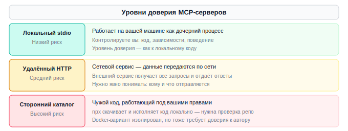
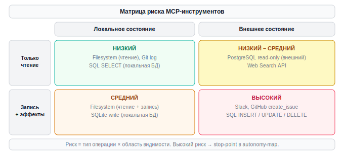
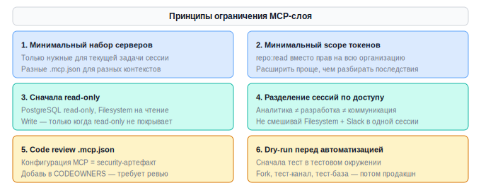
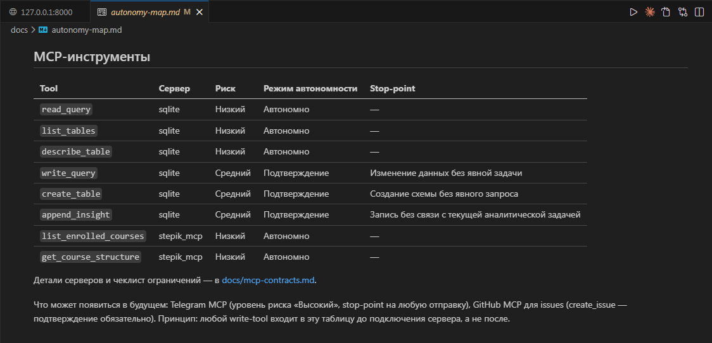

# Урок 4. Безопасность и ограничения MCP

_lesson_id: 2289253 · steps: 13 · ttc: Nones_

---

## Шаг 1 (step_id=9817291, text)

Модель доверия MCP: что на самом деле получает агент

Когда вы добавляете MCP-сервер в конфигурацию, агент не просто получает новые кнопки. Список tools, resources и prompts сервера загружается в контекстное окно агента при каждом старте сессии. Это расширяет область его возможных действий — независимо от того, вызывает он эти инструменты или нет.

Что значит «агент видит сервер»

В начале каждой сессии host опрашивает все подключённые серверы и сообщает агенту их возможности. Агент знает о существовании send_message даже если вы не просили его ничего отправлять. Это влияет на его поведение: агент может включить вызов этого tool в цепочку рассуждений, предложить его использовать или вызвать его по аналогии с другой задачей.

Это называют контекстным расширением: каждый подключённый сервер расширяет не только функциональность, но и то, о чём агент способен думать и что способен предлагать.

Уровни доверия серверов

Локальный stdio-сервер. Работает на вашей машине, запускается как дочерний процесс. Уровень доверия сравним с доверием к локальному коду. Контролируете вы — код, зависимости, что именно сервер делает.

Удалённый Streamable HTTP-сервер. Работает как сетевой сервис. Данные передаются по сети. Даже если соединение шифруется, внешний сервис получает все ваши запросы и отправляет ответы. Нужно явно понимать, кому и что отправляется.

Сторонний сервер из каталога. Чужой код, работающий под вашими правами. При npx-запуске код скачивается и исполняется локально. При Docker-запуске — в изоляции контейнера. Оба варианта требуют проверки репозитория и доверия к автору.

Как host управляет доверием

Каждый инструмент реализует свою модель разрешений:

Claude Code показывает уведомление при вызове tool с побочным эффектом. Пользователь подтверждает или отклоняет — явное «человек в петле» перед действием.

Cursor использует более автоматический подход: если tool включён в конфигурации, агент может вызвать его без дополнительного подтверждения. Ответственность за ограничения — на конфигурации.

Codex использует три режима одобрения: read-only — только просмотр без изменений; auto (по умолчанию) — свободно работает внутри рабочей директории, спрашивает при выходе за её пределы или при сетевом доступе; full access — без запросов по всей машине. Отдельный механизм для MCP: деструктивные tool-вызовы (те, что объявляют destructive-аннотацию) требуют явного одобрения вне зависимости от общего режима.

Промпт-инъекции через MCP

Реальный риск, задокументированный в спецификации MCP: вредоносный сервер может вернуть в ответе tool не данные, а инструкции для агента, маскированные под данные. Если агент не фильтрует входящий контент от серверов, такая инъекция может изменить его поведение.

Практическое следствие: не подключайте серверы из неизвестных источников к сессиям с высокими правами доступа. Сервер из непроверенного GitHub-репозитория, запущенный в той же сессии, что и ваш Slack-сервер — неприемлемое сочетание.

---

## Шаг 2 (step_id=10121676, text)

Классификация рисков MCP-инструментов

Не все MCP-серверы несут одинаковый риск. Прежде чем подключить сервер к реальной сессии, стоит оценить его по двум параметрам: что он делает с данными (читает или меняет) и где эти данные находятся (локально или во внешних системах).

Что сервер делает: читает или меняет

Read-only операции — resources и tools, которые только возвращают данные. Если tool внутри делает только SELECT или GET — это чтение. Риск ниже: агент не может сломать внешнее состояние.

Write-операции — tools с побочными эффектами: INSERT, UPDATE, DELETE, POST, отправка сообщений, создание задач. Это необратимые или трудно обратимые действия. Риск выше: ошибка агента = реальное изменение во внешней системе.

Где находятся данные

Локальное состояние — файлы на вашей машине, локальная база данных. Изменения видны только вам, откат возможен вручную.

Внешнее состояние — API-сервисы, облачные базы данных, системы коммуникации. Изменения видны другим людям или системам. Откат может быть невозможен (отправленное сообщение нельзя «отозвать»).

Типичные серверы и их уровень риска

	
		
			Сервер / Tool
			Тип
			Область
			Уровень риска
		
	
	
		
			Filesystem (только чтение)
			Read
			Локальное
			Низкий
		
		
			Git (история, diff)
			Read
			Локальное
			Низкий
		
		
			PostgreSQL read-only
			Read
			Локальное / внешнее
			Низкий — средний
		
		
			Filesystem (чтение + запись)
			Read + Write
			Локальное
			Средний
		
		
			GitHub (PR, issues)
			Read + Write
			Внешнее
			Средний
		
		
			Slack (отправка сообщений)
			Write
			Внешнее, публичное
			Высокий
		
		
			PostgreSQL с правами записи
			Read + Write
			Внешнее
			Высокий
		
	

Дополнительные факторы риска

Смешивание серверов в одной сессии. Если одновременно подключены Filesystem-сервер и Slack-сервер, агент технически может прочитать локальный файл и отправить его содержимое в Slack. Никто этого не просил — но ничего не запрещало. Такие сценарии называют нежелательным «соединением» возможностей.

Токен с широкими правами. GitHub PAT с правами на все репозитории в организации — это не «подключил GitHub-сервер», это «отдал агенту доступ ко всем репозиториям». Создавайте токены с минимально необходимым scope.

Проектный .mcp.json как вектор атаки. Если злоумышленник добавит в PR изменение .mcp.json, которое подключает вредоносный сервер — все участники команды, принявшие PR, подключат его автоматически. Конфигурация MCP должна проходить code review как любой security-критичный файл.

---

## Шаг 3 (step_id=10121672, text)

Принципы ограничения: минимальные права в практике MCP

Подключить сервер и дать ему работать без ограничений — это не рабочая конфигурация, а отложенная проблема. Принципы ограничения не замедляют работу; они делают её предсказуемой и обратимой.

Принцип 1: минимальный набор серверов на сессию

Подключайте только те серверы, которые нужны для конкретной задачи в этой сессии. Не держите постоянно подключёнными Slack, GitHub, базу данных и Filesystem одновременно «на всякий случай». Для каждого типа задач — свой профиль серверов.

Практически это означает: разные конфигурации .mcp.json для разных рабочих контекстов, или использование профилей в Docker MCP Toolkit (Docker Desktop поддерживает именованные профили с набором серверов).

Принцип 2: минимальный scope токенов

GitHub Personal Access Token с правами repo:read для конкретных репозиториев — это не то же самое, что токен с правами на всю организацию. Slack API с правами на один канал — не то же, что с правами на все каналы рабочего пространства.

Создавайте токены с наименьшим необходимым набором прав. Если через неделю понадобится больше — расширить токен проще, чем разобраться с последствиями компрометации широкого токена.

Принцип 3: сперва read-only, write — только когда нужно

PostgreSQL-сервер по умолчанию работает в read-only режиме. Filesystem-сервер можно запустить с аргументом, ограничивающим пути только на чтение. Начинайте с этих ограничений. Только когда вы убедились, что read-only режим не покрывает задачу — расширяйте до write.

Принцип 4: разделение сессий по уровню доступа

Не смешивайте серверы с разным уровнем риска в одной сессии. Правило простое:

	Аналитическая сессия (читаем данные, строим понимание): Filesystem read-only + PostgreSQL read-only.
	Рабочая сессия (правим код): Git + Filesystem для проекта.
	Коммуникационная сессия (создаём PR, отправляем сообщения): GitHub + Slack — только когда конкретная задача это требует, без других серверов.

Принцип 5: code review конфигурации MCP как security-артефакта

Файл .mcp.json в репозитории — это конфигурация, которая влияет на безопасность всей команды. Любое изменение этого файла в PR должно проходить явный review: что добавляется, откуда берётся сервер, какие права получает токен.

Добавьте .mcp.json в CODEOWNERS или аналогичный механизм защиты ветки — изменения должны требовать утверждения конкретных людей.

Принцип 6: dry-run и проверка до широкой автоматизации

Если агент должен делать write-операции через MCP — сначала проверьте маршрут с read-only параметром или в тестовом окружении. Создать тестовый PR в fork-репозитории, отправить сообщение в тестовый Slack-канал, сделать INSERT в тестовую базу — прежде чем разрешать то же самое в продакшне.

Связь с картой автономности

Карта автономности из модуля 6 распространяется и на MCP. Каждый tool — это потенциальный сценарий с режимом автономности. Tool с высоким риском (отправка сообщений, запись в БД) требует явного stop-point или подтверждения. Tool с низким риском (чтение файлов, SQL-запрос) можно делегировать без подтверждения.

	
		
			Tool
			Риск
			Режим автономности
		
	
	
		
			read_file, list_directory
			Низкий
			Автономно
		
		
			git log, git diff
			Низкий
			Автономно
		
		
			SQL SELECT
			Низкий
			Автономно
		
		
			create_issue, get_pull_request
			Средний
			С подтверждением при создании
		
		
			send_message (Slack)
			Высокий
			Только явный вызов пользователем
		
		
			SQL INSERT/UPDATE/DELETE
			Высокий
			Только в тестовом окружении или с explicit approve

---

## Шаг 4 (step_id=10121673, text)

Практика: матрица риска серверов и MCP-раздел в autonomy-map

К этому моменту у вас подключены серверы, которые разбирали в этом модуле. Задача этой практики — пересмотреть их с позиции безопасности и интегрировать в карту автономности, которую вы ведёте с модуля 6.

Шаг 1. Заполнить матрицу риска для каждого сервера

Откройте docs/mcp-contracts.md и для каждого подключённого сервера добавьте поля риска — в том же файле, где уже хранятся команды запуска и область видимости:

## github

- **Tools**: get_pull_request, list_issues, create_issue, create_review
- **Тип операций**: Read + Write (create_issue, create_review имеют побочные эффекты)
- **Область видимости**: внешнее состояние — репозитории GitHub
- **Уровень риска**: Средний
- **Токен scope**: repo:read + issues:write (только целевые репозитории)
- **Stop-point**: создание PR или issue без явного подтверждения пользователя
- **Когда подключаю**: только в сессиях с задачами по работе с PR и issues
- **Когда НЕ подключаю**: аналитические сессии, debugging-сессии без нужды в GitHub

Шаг 2. Проверить токены и права

Откройте настройки каждого токена и сервиса:

	GitHub: Settings → Developer settings → Personal access tokens → проверьте scope.
	Slack: api.slack.com → Your apps → проверьте Bot Token Scopes.
	Для локальных серверов: убедитесь, что пути Filesystem-сервера ограничены нужными директориями.

Если scope шире, чем нужно — создайте новый токен с минимальными правами и обновите переменную окружения.

Шаг 3. Добавить MCP-раздел в docs/autonomy-map.md

Карта автономности теперь должна включать MCP-слой. Добавьте раздел ## MCP-инструменты с таблицей:

Шаг 4. Проверить конфигурацию по принципам ограничения

Пройдитесь по чеклисту:

	Все ли подключённые серверы реально нужны для текущих задач?
	Нет ли сервера, который вы забыли отключить после разового эксперимента?
	Все ли токены имеют минимально необходимый scope?
	Нет ли риска «нежелательного соединения» между подключёнными серверами?
	Есть ли stop-point для каждого write-tool в карте автономности?

Что показывает StudyFlow

В проекте подключёно два реальных MCP-сервера:

SQLite MCP

Предоставляет шесть инструментов: read_query, write_query, create_table, list_tables, describe_table, append_insight. Первые три разделяются по риску: read_query, list_tables и describe_table — чтение, низкий риск, агент может вызывать автономно. write_query и create_table меняют данные — для них в карту добавляются stop-point'ы.

Stepik MCP

В предыдущем уроке в StudyFlow появился собственный MCP-сервер — stepik_mcp. Он делает только read-операции через Stepik API: получает список курсов и их структуру. Разберём его по той же схеме, что применяли к остальным серверам.

Тип операций. Только чтение: два tool (list_enrolled_courses, get_course_structure) делают исключительно GET-запросы к Stepik API. Никаких POST, PUT, DELETE. Агент не может что-либо изменить на платформе через этот сервер.

Область данных. Внешняя — сетевые запросы к stepik.org. Данные передаются по HTTPS, но при каждом вызове tool идёт несколько запросов: за токеном, за курсом, за каждой секцией и каждым уроком. Stepik получает эти запросы и знает, что именно интересовало агента.

Уровень риска: низкий–средний. Read-only снижает риск, но внешняя область его повышает. Итог — как у PostgreSQL read-only в таблице из второго шага этого урока.

Хранение ключей. STEPIK_CLIENT_ID и STEPIK_CLIENT_SECRET читаются из .env через python-dotenv. Обязательные условия: файл .env добавлен в .gitignore, ключи не попадают в коммиты. Если клиент создан с минимальными правами на чтение, компрометация ключа позволяет прочитать структуру курсов — не более того.

Что получает агент. Tool возвращает id, title и update_date курсов и уроков. Если на аккаунте есть приватные или корпоративные курсы — их структура тоже попадёт в ответ. Убедитесь, что это приемлемо, прежде чем подключать сервер в командной среде.

Место в autonomy-map. Сервер подключают только в аналитических сессиях — когда нужно сравнить прогресс студента с датами обновления курса. Stop-point не нужен: оба tool read-only. Запись в autonomy-map:

	
		
			Tool
			Сервер
			Риск
			Режим автономности
			Stop-point
		
	
	
		
			list_enrolled_courses
			stepik-courses
			Низкий–Средний
			Автономно
			—
		
		
			get_course_structure
			stepik-courses
			Низкий–Средний
			Автономно
			—
		
	

Что может появиться в будущем

Когда StudyFlow вырастет до отправки уведомлений через Telegram напрямую из агента — потребуется MCP-обёртка над Telegram Bot API с уровнем риска «Высокий» и обязательным stop-point'ом на любую отправку. Если проект перейдёт на GitHub для публичного отслеживания задач — GitHub MCP даст агенту доступ к issues, но create_issue нужно будет ограничить подтверждением. Принцип один: любой write-tool входит в autonomy-map до подключения, а не после.

Результат практики

	docs/mcp-contracts.md обновлён с полями риска для каждого сервера.
	Токены проверены, scope минимизирован где возможно.
	docs/autonomy-map.md содержит MCP-раздел с таблицей tool → режим → stop-point.
	Конфигурация проверена по чеклисту принципов ограничения.

---

## Шаг 5 (step_id=10121674, choice)

Что происходит при старте агентной сессии с подключёнными MCP-серверами?

**Тип:** choice (single)

**Варианты:**
- ✓ Список tools всех серверов загружается в контекст
- ○ Серверы подключаются по одному по мере необходимости
- ○ Серверы запускаются только при явном вызове tool
- ○ Агент получает права только тех серверов, что назвал

---

## Шаг 6 (step_id=10121675, choice)

Что такое промпт-инъекция через MCP?

**Тип:** choice (single)

**Варианты:**
- ✓ Внедрение вредоносных инструкций в ответ MCP-сервера
- ○ Передача неверных параметров в tool
- ○ Атака на транспортный слой соединения между host и server
- ○ Перехват stdio-потока

---

## Шаг 7 (step_id=10121677, matching)

Соотнесите сервер с уровнем риска по матрице чтение/запись × локальное/внешнее.

**Тип:** matching

**Правильные пары:**
- Git (только история) → Низкий риск
- Slack (отправка сообщений) → Высокий риск
- PostgreSQL read-only → Низкий–средний риск
- GitHub (create_issue) → Средний риск

---

## Шаг 8 (step_id=10121678, choice)

Какой принцип описывает подход «аналитическая сессия — только read-only серверы, коммуникационная — только тогда, когда нужно»?

**Тип:** choice (single)

**Варианты:**
- ○ Dry-run первым
- ○ Code review конфигурации
- ○ Минимальный набор серверов на одну сессию
- ✓ Разделение сессий по уровню доступа

---

## Шаг 9 (step_id=10121679, choice)

Почему файл .mcp.json в репозитории требует code review?

**Тип:** choice (single)

**Варианты:**
- ○ Потому что он влияет на скорость и производительность агента
- ○ Потому что его формат нестандартен
- ○ Потому что он хранит секреты
- ✓ Потому что вредоносный PR с ним затронет всю команду

---

## Шаг 10 (step_id=10121681, choice)

GitHub Personal Access Token с правами на все репозитории организации используется для чтения одного репозитория. Что нужно сделать?

**Тип:** choice (single)

**Варианты:**
- ○ Ничего, ведь использование для чтения не несёт рисков
- ○ Добавить токен в .gitignore
- ✓ Создать токен с минимальным scope для нужного репо
- ○ Отключить GitHub-сервер

---

## Шаг 11 (step_id=10121682, choice)

Что относится к «нежелательному соединению» (unintended capability chaining) в MCP?

**Тип:** choice (single)

**Варианты:**
- ○ Конфликт имён tools в разных подключённых серверах
- ✓ Агент без запроса объединяет Filesystem и Slack
- ○ Два разных сервера разделяют один токен авторизации
- ○ Сервер не отвечает в timeout

---

## Шаг 12 (step_id=10121683, choice)

Какой режим автономности правильный для tool send_message в Slack?

**Тип:** choice (single)

**Варианты:**
- ○ Автономно
- ○ С подтверждением при первом запуске
- ○ Запрещён к подключению
- ✓ Только явный вызов пользователем

---

## Шаг 13 (step_id=10121684, choice)

Выберите все верные принципы ограничения MCP-инструментов.

**Тип:** choice (multiple)

**Варианты:**
- ✓ Подключать только серверы, нужные для текущей задачи
- ✓ Создавать токены с минимально необходимым scope
- ✓ Начинать с read-only, расширять до write только когда нужно
- ○ Держать все серверы подключёнными постоянно для удобства

---
