# Урок 5. MCP и agent workflows

_lesson_id: 2289254 · steps: 13 · ttc: Nones_

---

## Шаг 1 (step_id=9817292, text)

Как MCP меняет skills и commands

К этому уроку мы рассмотрели два слоя: reusable workflows (skills, commands, templates, чеклисты) и MCP-серверы. MCP не заменяет skills — он даёт им новые возможности.

Skill, который ссылается на MCP

Skill описывает процедуру. MCP предоставляет инструмент. Процедура может включать вызов инструмента как один из шагов — и это делает skill мощнее, потому что агент больше не зависит от данных, которые вы вставили в контекст вручную. Ниже — иллюстративные примеры; конкретные названия условны, важен паттерн.

Было: skill для генерации release notes просит вас вручную вставить список изменений.

Стало: skill читает merged PR напрямую через GitHub-сервер и формирует CHANGELOG.

Как это может выглядеть в skill-файле:

## release-notes skill

Когда вызван:
1. Через GitHub-сервер получи список merged PR с момента последнего тега
2. Сгруппируй по типу: features, fixes, breaking changes
3. Сформируй текст релизных заметок в формате Markdown
4. Запиши результат в CHANGELOG.md

Command, которая использует tool

Command разворачивается в prompt при вызове. Если command ссылается на MCP-данные, агент получает их автоматически:

## /morning-standup command

Генерирует текст стендапа для текущего дня.

Развернуть в:
Через GitHub-сервер получи коммиты за вчерашний день в текущей ветке.
Через Calendar-сервер прочитай встречи на сегодня.
Сформируй стендап: что сделано, что сегодня, возможные блокеры.

Checklist с автоматическими шагами

Часть шагов checklist можно автоматизировать через resource-вызов. Вместо ручной проверки дедлайнов skill читает resource studyflow://schedule и сравнивает текущую дату с ближайшим дедлайном.

Что меняется, а что остаётся

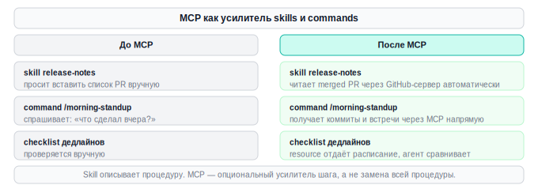

---

## Шаг 2 (step_id=10121698, text)

Обновление reusable-workflows.md: MCP как часть документации kit

Kit должен описывать зависимости — те инструменты, без которых часть workflows не работает. MCP-серверы именно такие зависимости: если сервер не подключён, skill, который на него полагается, работает частично или не работает вовсе.

Связь сервера с конкретными workflows

Каждая запись должна явно указывать, какие skills, commands и templates используют этот сервер. Тогда при удалении сервера сразу понятно, что перестанет работать. При добавлении нового workflow легко проверить, нужен ли новый сервер или хватит существующих.

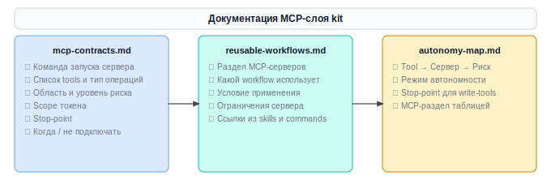

Принцип: нет открытых подключений без контракта

Любой сервер в конфигурации должен иметь запись в docs/mcp-servers.md и ссылку из docs/reusable-workflows.md. Без этого со временем никто не помнит, зачем он подключён, — и начинают бояться его удалять.

Простая проверка: если нельзя быстро ответить на вопрос «какой workflow использует этот сервер?» — сервер либо не нужен, либо не задокументирован.

Структура MCP-раздела в reusable-workflows.md

Добавьте в документ раздел, который описывает каждый подключённый сервер в контексте того, какие workflows его используют:

## MCP-серверы и их роль в kit

Контракты серверов: [`docs/mcp-contracts.md`](mcp-contracts.md).

### <имя сервера>

<одна строка: что предоставляет>

Участвует в: сценарий N (`<workflow>`), сценарий M (`<workflow>`).

### <имя сервера>

<одна строка: что предоставляет>

Участвует в: сценарий N (`<workflow>`).

В реальных проектах серверов может быть много: filesystem для доступа к файлам вне репозитория, GitHub-сервер для работы с PR и issues, Linear или Jira чтобы skill мог читать задачи без копипасты, сервер к внешнему API если проект с чем-то интегрируется. Все они документируются по той же схеме.

Когда обновлять документацию

	При добавлении нового сервера — сразу, до первого использования в реальной сессии.
	При изменении scope сервера или токена — обновить поле ограничений и риска.
	При удалении сервера — удалить раздел и проверить, не осталось ли ссылок из workflows.
	При изменении skill или command, которые используют сервер — синхронизировать список «используется в».

---

## Шаг 3 (step_id=10121686, text)

Поддержка MCP-слоя: обновление, ревизия и удаление

MCP-слой нужно поддерживать — как любую другую зависимость. Серверы устаревают, токены компрометируются, ненужные подключения копятся. Без чистки kit превращается в набор подключений, которые никто не решается тронуть.

Когда обновлять конфигурацию

При смене задачи или проекта. Если переключились на другой тип работы — проверьте, нужны ли все подключённые серверы в новом контексте. Часто достаточно оставить Filesystem и Git, а специализированные серверы отключить.

При обновлении версии сервера. Официальные серверы из modelcontextprotocol/servers обновляются. Изменился контракт — обновите запись в docs/mcp-servers.md. Новая версия что-то сломала — закрепите конкретную версию в аргументах npx.

При смене сценария использования. Начали с read-only — расширили до записи. Или наоборот: write-права больше не нужны — вернитесь к read-only. Расширять права стоит намеренно, а не оставлять как есть.

Ревизия kit: раз в месяц или при смене задач

Регулярная ревизия занимает 15 минут. Пройдитесь по списку подключённых серверов и ответьте для каждого:

	Использовался ли сервер в последние две недели?
	Соответствует ли текущий scope токена тому, что реально нужно?
	Актуальна ли документация контракта в docs/mcp-servers.md?
	Есть ли ссылки на сервер из workflows в docs/reusable-workflows.md?

Если на первый вопрос — «нет», сервер кандидат на отключение.

Удаление сервера

Удаление — нормальная часть поддержки, а не признание ошибки. Сервер, подключённый «на время» и оставшийся навсегда, — лишний риск и непредсказуемая зависимость.

Чеклист удаления:

	Убрать секцию из .mcp.json (или config.toml в Codex).
	Удалить или архивировать запись в docs/mcp-servers.md.
	Убрать ссылки из docs/reusable-workflows.md.
	Убрать строки из таблицы MCP в docs/autonomy-map.md.
	Отозвать токен или уменьшить scope, если токен использовался только для этого сервера.

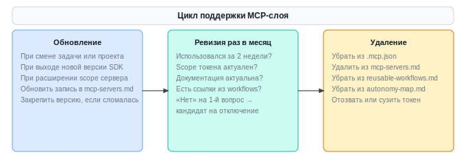

Версионирование конфигурации

Проектный .mcp.json отслеживается в git — история изменений есть автоматически. Личная конфигурация (~/.claude.json, ~/.cursor/mcp.json, ~/.codex/config.toml) — нет. Если есть личный dotfiles-репозиторий, добавьте туда и конфигурацию MCP (без секретов) — тогда при переходе на новую машину не придётся вспоминать, что было настроено.

Признаки того, что MCP-слой вышел из-под контроля

	Подключены серверы, которые «остались с прошлого проекта».
	Нет документации для серверов.
	Токен с широкими правами, созданный «на всякий случай».
	В карте автономности нет MCP-раздела.
	Никто не знает, что изменится, если удалить конкретный сервер.

Каждый из этих признаков — сигнал к ревизии.

---

## Шаг 4 (step_id=10121687, text)

Практика: skill с MCP-шагом внутри

Задача практики — найти существующий workflow или skill, которому нужны живые данные из MCP, оформить его как skill с явными стоп-сигналами, запустить и зафиксировать в kit.

Что делать

Шаг 1. Найти подходящий сценарий. Просмотрите существующие skills и commands в вашем kit. Хороший кандидат — тот, где агент сейчас вынужден просить данные у пользователя: прогресс, статус задач, ближайшие дедлайны, файлы вне репозитория. Если такой MCP-инструмент уже подключён — добавьте к skill явный шаг с вызовом нужного tool. Если подходящего кандидата нет — создайте новый skill под конкретную задачу.

Шаг 2. Обновить или написать SKILL.md. Если расширяете существующий skill — добавьте в его SKILL.md явный шаг с MCP-вызовом, допишите нужные инструменты в allowed-tools и добавьте стоп-сигнал на случай недоступности сервера. Если создаёте новый — файл .claude/skills/<название>/SKILL.md со структурой:

	frontmatter — поля name, description (одна строка: когда применять), allowed-tools (список MCP-инструментов через пробел).
	Inputs — что принимает skill, что опционально, что берётся по умолчанию.
	Steps — последовательность действий агента.
	Stop signals — при каких условиях остановиться и что сообщить.
	Expected result — формат вывода с примером.

Если skill требует готовых SQL-запросов, шаблонов или справочных данных — положите их в отдельный файл рядом и сошлитесь на него в секции Supporting materials.

Шаг 3. Запустить и проверить. Запустите skill в агентной сессии. Три вещи, которые нужно проверить:

	Агент вызвал MCP-инструменты из allowed-tools — это видно как явный вызов инструмента в интерфейсе, а не просто текстовый ответ.
	Стоп-сигнал срабатывает: спровоцируйте граничный случай и убедитесь, что агент останавливается с понятным сообщением, а не пытается что-то угадать.
	Формат вывода совпадает с Expected result из SKILL.md.

Шаг 4. Зафиксировать в kit. Добавьте запись в docs/reusable-workflows.md: когда применять, входы, ожидаемый результат, критерии приёмки, название skill, почему skill а не command, MCP-зависимости, как часто повторяется. Проверьте docs/autonomy-map.md — MCP-инструменты skill должны быть там с актуальным режимом.

StudyFlow

В StudyFlow к kit добавились три новых инструмента: два skill'а с MCP-шагами и один command. Вот что получилось и почему именно так.

Отправная точка — просмотр существующих workflows. Обнаружились три повторяющихся сценария, где агент каждый раз запрашивал данные у пользователя вручную: состояние спринта, сверка структуры курса со Stepik, ближайшие дедлайны. Все три можно закрыть инструментами с доступом к MCP.

Первый skill — sprint-health-check. Папка .claude/skills/sprint-health-check/ содержит два файла: SKILL.md и query-examples.md. SQL-запросы вынесены в отдельный файл — так основной остаётся читаемым.

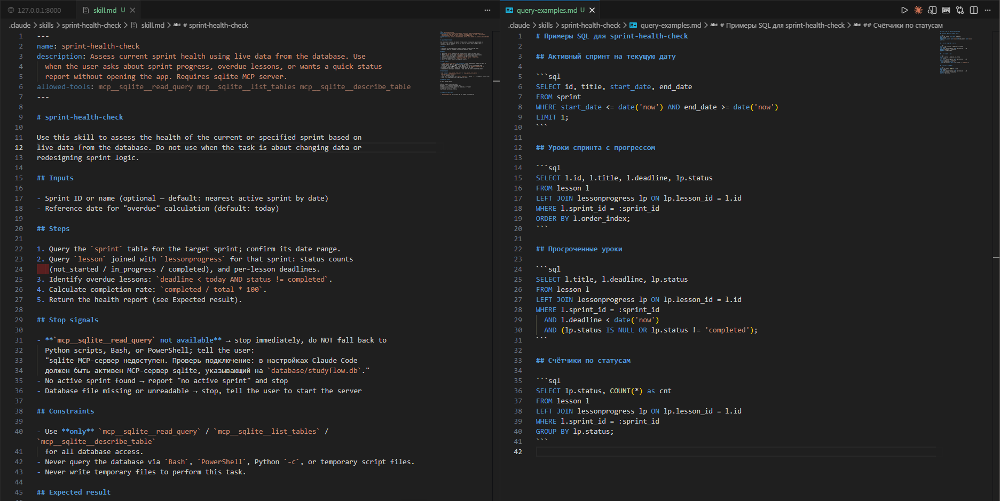

В description — конкретный триггер, не общие слова. Расплывчатое описание приводит к тому, что skill срабатывает не в тех ситуациях.

Stop signals прописаны явно — без них агент не знает, когда остановиться, и строит ответ из неполных данных:

query-examples.md содержит готовые запросы: активный спринт на текущую дату, уроки с прогрессом, просроченные, счётчики по статусам. Агент берёт их оттуда, а не составляет сам — это снижает вероятность ошибки при работе с незнакомой схемой таблиц.

Запуск. Запрос «Проверь здоровье текущего спринта» — агент последовательно вызывает mcp__sqlite__read_query для таблиц sprint, lesson, lessonprogress и возвращает отчёт. В интерфейсе это видно как явные tool calls, а не просто текст.

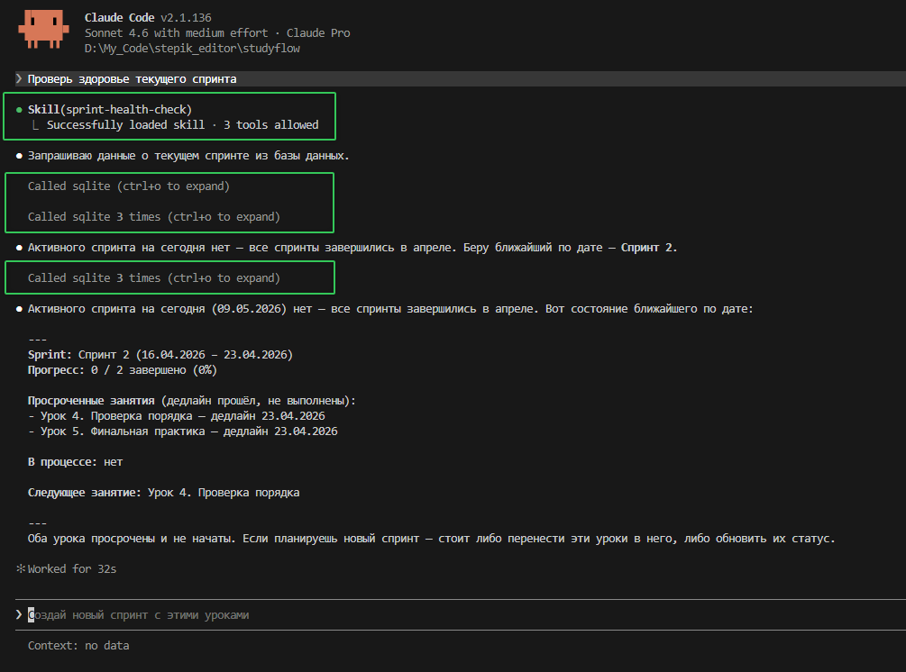

Стоп-сигнал проверен: при остановленном sqlite-сервере агент ответил коротким сообщением и остановился — не продолжал и не придумывал данные.

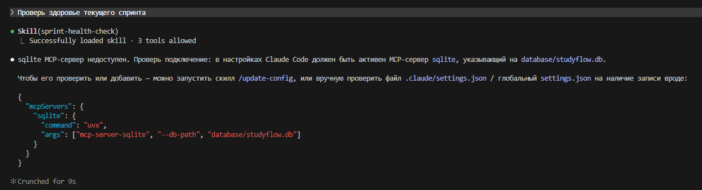

Чтобы временно отключить сервер для теста, самое простое — это внести ошибку в команду запуска.

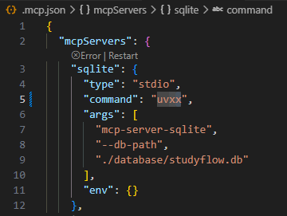

Второй skill — sync-stepik-course — написан по той же схеме. Frontmatter с двумя MCP-зависимостями (stepik_mcp и sqlite), Stop signals с проверкой авторизации и ненайденного курса, Expected result в diff-формате. Никаких структурных отличий от первого skill'а — только другой домен.

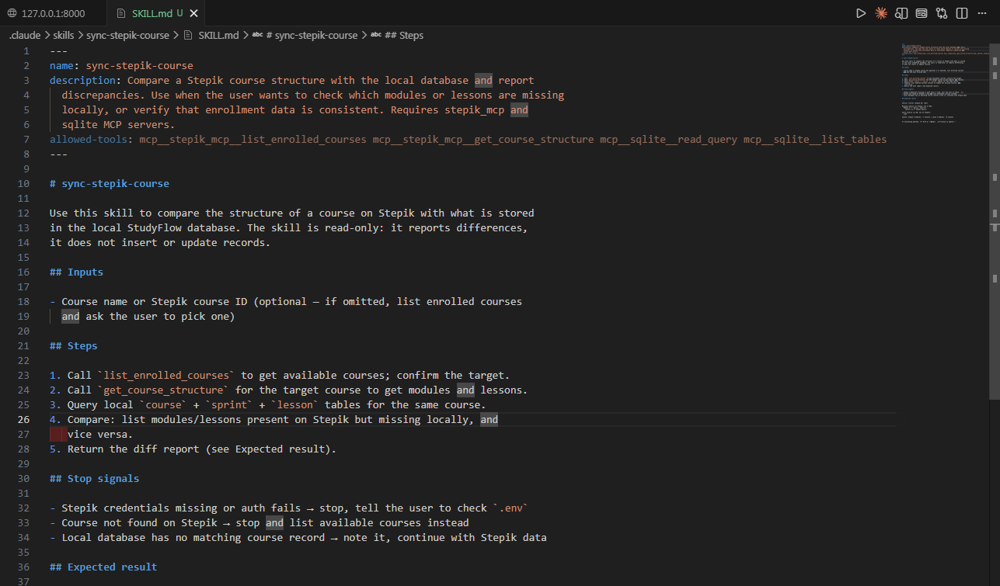

Третий инструмент — command /deadline-brief — оформлен иначе, и намеренно. Сценарий «сводка дедлайнов» линеен: два фиксированных SQL-запроса, никаких условий применения, никаких стоп-сигналов. Skill здесь был бы избыточен — достаточно файла .claude/commands/deadline-brief.md с готовыми запросами и шаблоном вывода. Если маршрут не разветвляется и стоп-сигналы не нужны — это command, не skill.

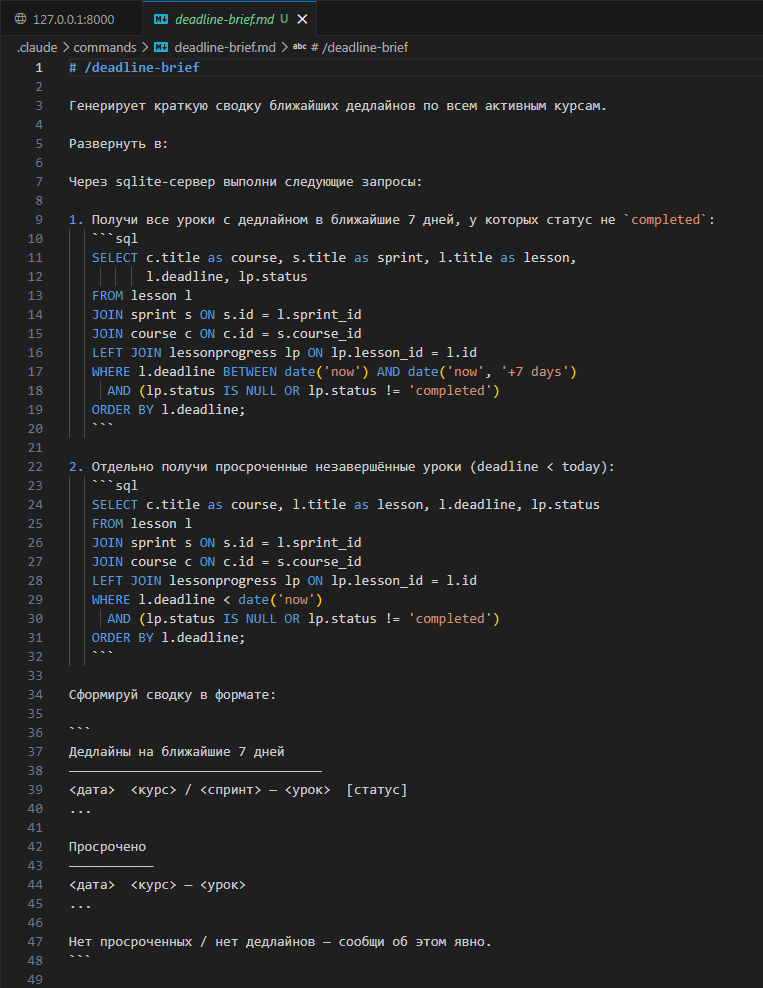

Фиксация в kit. Все три инструмента задокументированы в docs/reusable-workflows.md как Сценарии 6, 7 и 8. Для каждого — когда применять, входы, ожидаемый результат, форма фиксации, MCP-зависимости, обоснование формата. В конце файла — сводная таблица MCP-серверов с указанием, какие сценарии на них завязаны.

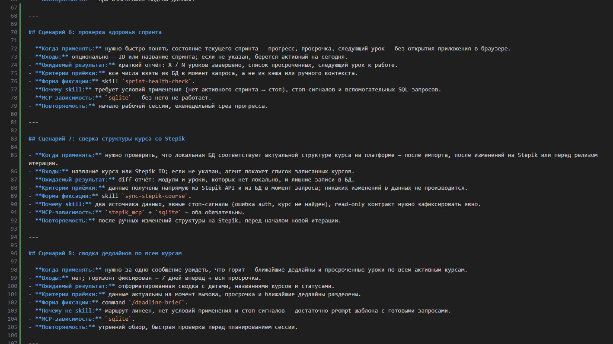

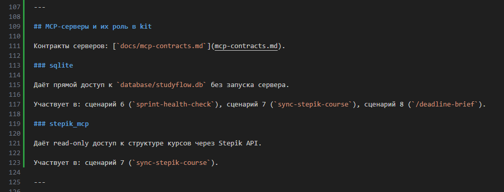

Результат практики

По итогу у вас есть:

	Минимум один или несколько новых workflow
	Зафиксированный первый запуск: агент вызвал нужные MCP-инструменты, стоп-сигнал сработал на граничном случае.
	Запись в docs/reusable-workflows.md с MCP-зависимостями и обоснованием формата.
	Актуальная docs/autonomy-map.md с MCP-таблицей.

---

## Шаг 5 (step_id=10121688, choice)

Как MCP-инструмент правильно встраивается в существующий skill?

**Тип:** choice (single)

**Варианты:**
- ○ Работает только вместо command, но не skill
- ✓ Встраивается как один из шагов skill-процедуры
- ○ Переносит всю логику выполнения skill на сторону сервера
- ○ Заменяет skill целиком, взяв управление на себя

---

## Шаг 6 (step_id=10121689, choice)

Что означает принцип «нет открытых подключений без контракта» в MCP-слое?

**Тип:** choice (single)

**Варианты:**
- ○ Токены хранятся в переменных окружения, не в конфиге
- ○ Каждое соединение шифруется на транспортном уровне
- ✓ Каждый сервер задокументирован и привязан к workflows
- ○ Перед каждым вызовом skill сервер должен пройти авторизацию

---

## Шаг 7 (step_id=10121690, choice)

Что отражает каждая запись о сервере в MCP-разделе docs/reusable-workflows.md?

**Тип:** choice (single)

**Варианты:**
- ✓ Что предоставляет сервер и какие workflows его используют
- ○ Историю всех агентных сессий, в которых использовался сервер
- ○ Полный контракт сервера с полями риска и scope токена
- ○ Исходный код каждого сервера

---

## Шаг 8 (step_id=10121691, choice)

Какие события требуют обновления документации MCP-слоя?

**Тип:** choice (multiple)

**Варианты:**
- ✓ При добавлении нового MCP-сервера
- ○ При каждом новом агентном сеансе с MCP-инструментами
- ✓ При изменении skill или command, использующих сервер
- ✓ При изменении scope токена существующего сервера

---

## Шаг 9 (step_id=10121692, choice)

Как часто рекомендуется проводить ревизию MCP-слоя?

**Тип:** choice (single)

**Варианты:**
- ○ Ежедневно
- ○ При добавлении нового сервера
- ○ Один раз при настройке
- ✓ Раз в месяц или при смене задач

---

## Шаг 10 (step_id=10121693, choice)

Что является признаком того, что MCP-слой вышел из-под контроля?

**Тип:** choice (single)

**Варианты:**
- ✓ Подключены серверы «с прошлого проекта» без документации
- ○ Каждый сервер подключён с минимально нужным scope доступа
- ○ Используется только один сервер
- ○ В карте автономности есть MCP-раздел

---

## Шаг 11 (step_id=10121694, matching)

Соотнесите документ kit с его назначением.

**Тип:** matching

**Правильные пары:**
- docs/mcp-servers.md → Контракт каждого MCP-сервера
- docs/reusable-workflows.md → Описание workflows и их MCP-зависимостей
- docs/autonomy-map.md → Карта инструментов с режимами и стоп-точками
- .mcp.json → Конфигурация подключений к серверам

---

## Шаг 12 (step_id=10121695, choice)

Что нужно сделать при удалении MCP-сервера из конфигурации?

**Тип:** choice (single)

**Варианты:**
- ○ Только убрать запись из .mcp.json
- ○ Удалить только токен доступа
- ○ Оповестить всех участников проекта об изменении конфигурации
- ✓ Убрать из конфига и документации, отозвать токен

---

## Шаг 13 (step_id=10121696, choice)

Как обеспечить версионирование личной MCP-конфигурации?

**Тип:** choice (single)

**Варианты:**
- ○ Она автоматически синхронизируется с проектом через git
- ○ Хранить в системном хранилище ключей
- ○ Загружать в облачное хранилище при каждом изменении
- ✓ Добавить её в личный dotfiles-репозиторий без секретов

---
